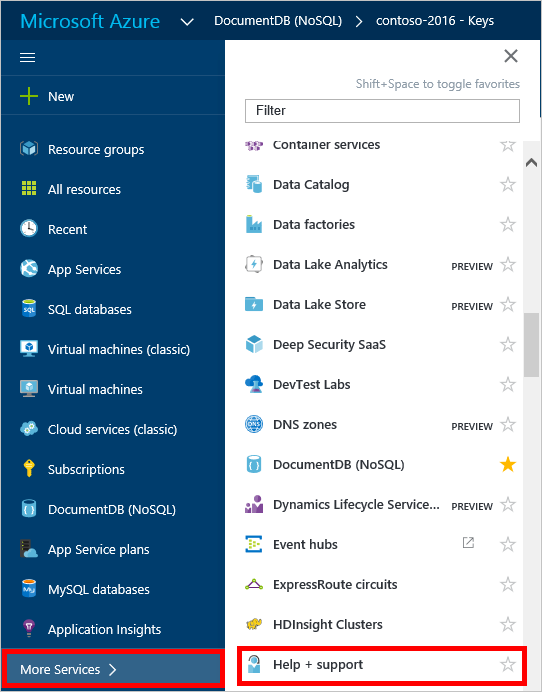
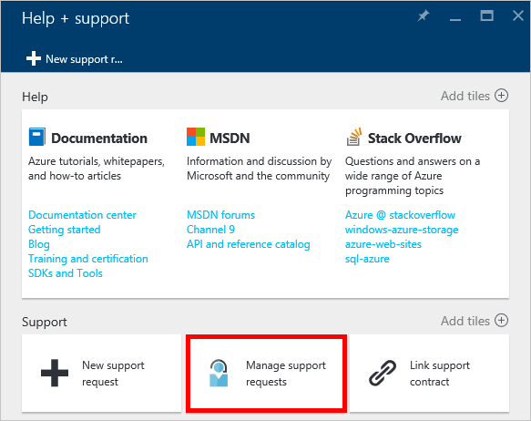

<properties
    pageTitle="Demande augmentée compte les quotas de DocumentDB | Microsoft Azure"
    description="Découvrez comment en demander un ajustement DocumentDB les quotas de base de données telles que le stockage des documents et débit par collection de sites."
    services="documentdb"
    authors="AndrewHoh"
    manager="jhubbard"
    editor="monicar"
    documentationCenter=""/>

<tags
    ms.service="documentdb"
    ms.workload="data-services"
    ms.tgt_pltfrm="na"
    ms.devlang="na"
    ms.topic="article"
    ms.date="08/25/2016"
    ms.author="anhoh"/>

# Demander des limites des comptes DocumentDB accrues

[Microsoft Azure DocumentDB](https://azure.microsoft.com/services/documentdb/) possède un ensemble de quotas par défaut qui peuvent être ajustés en contactant le support Azure.  Cet article vous explique comment demander une augmentation des quotas.

Lisez cet article, vous serez en mesure de répondre aux questions suivantes :  

-   Les quotas de base de données DocumentDB peuvent être ajustés en contactant le support Azure ?
-   Comment puis-je demander un ajustement du quota DocumentDB compte ?

##Compte les quotas de DocumentDB

Le tableau suivant décrit les quotas DocumentDB. Les quotas qui ont un astérisque (*) peuvent être ajustés en contactant le support Azure :

[AZURE.INCLUDE [azure-documentdb-limits](../../includes/azure-documentdb-limits.md)]

##Demander un ajustement de quota
Les étapes suivantes montrent comment demander un ajustement de quota.

1. Dans le [portail Azure](https://portal.azure.com), cliquez sur **Autres Services**, puis cliquez sur **aide + prise en charge**.

    

2. Dans la carte **aide + prise en charge** , cliquez sur **nouvelle demande d’assistance**.

    

3. Dans la carte de **demande d’assistance nouveau** , cliquez sur **Concepts de base**. Suivante, définissez **le type de problème** au **Quota**, **abonnement** à votre abonnement qui héberge votre DocumentDB du compte, **type de Quota** à **DocumentDB**et le **plan de Support** pour la **Prise en charge de Quota - inclus**. Ensuite, cliquez sur **suivant**.

    

4. Dans la carte de **problème** , choisissez une gravité et incluent informations concernant votre augmentation des quotas de **Détails**. Cliquez sur **suivant**.

    

5. Enfin, renseignez vos informations de contact dans la carte **les informations de Contact** et cliquez sur **créer**.

Une fois que les tickets de support a été créé, vous devez recevoir le numéro de demande de support par courrier électronique.  Vous pouvez également afficher la demande de support en cliquant sur **prise en charge de gérer les demandes** dans la carte **aide + prise en charge** .

##Étapes suivantes
- Pour en savoir plus sur DocumentDB, cliquez [ici](http://azure.com/docdb).
