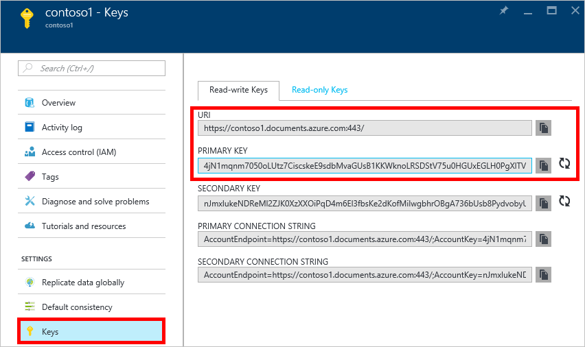

<properties
    pageTitle="Gérer un compte DocumentDB via le portail Azure | Microsoft Azure"
    description="Apprenez à gérer votre compte DocumentDB via le portail Azure. Recherchez un guide sur l’utilisation du portail Azure pour afficher, copier, supprimer et accéder aux comptes."
    keywords="Portail Azure, documentdb, azure, Microsoft azure"
    services="documentdb"
    documentationCenter=""
    authors="kirillg"
    manager="jhubbard"
    editor="cgronlun"/>

<tags
    ms.service="documentdb"
    ms.workload="data-services"
    ms.tgt_pltfrm="na"
    ms.devlang="na"
    ms.topic="article"
    ms.date="10/14/2016"
    ms.author="kirillg"/>

# Comment gérer un compte DocumentDB

Découvrez comment définir la cohérence, travailler avec les clés et supprimer un compte DocumentDB dans le portail Azure.

## Gérer les paramètres de la cohérence DocumentDB

Sélection du niveau de cohérence droite dépend de la sémantique de votre application. Vous devez vous familiariser avec les niveaux de cohérence disponible dans DocumentDB en lisant l’article [utilisation des niveaux de cohérence optimiser la disponibilité et les performances dans DocumentDB] [consistency]. DocumentDB fournit la cohérence, la disponibilité et la garantie, à chaque niveau de cohérence disponible pour votre compte de base de données. Configuration de votre compte de base de données avec un niveau de cohérence de fort nécessite que vos données sont restreints à une seule région Azure et pas globalement disponibles. En revanche, les niveaux de cohérence souple - obsolescence délimitée, session ou activer éventuelle vous pouvez associer un nombre quelconque de régions Azure à votre compte de base de données. Les étapes simples suivantes vous montrent comment sélectionner le niveau de cohérence par défaut pour votre compte de base de données. 

### Pour spécifier la cohérence par défaut pour un compte DocumentDB

1. Dans le [portail Azure](https://portal.azure.com/), accédez à votre compte DocumentDB.
2. Dans la carte de compte, cliquez sur **par défaut la cohérence**.
3. Dans la carte de **Cohérence par défaut** , sélectionnez le nouveau niveau de la cohérence et cliquez sur **Enregistrer**.
    ![Session de cohérence par défaut][5]

## Afficher, copier et régénérer les touches d’accès rapide
Lorsque vous créez un compte DocumentDB, le service génère deux touches d’accès maître qui peuvent être utilisés pour l’authentification lorsque le compte DocumentDB est accessible. En fournissant deux touches d’accès rapide, DocumentDB vous permet de régénérer les clés sans interruption à votre compte DocumentDB. 

Dans le [portail Azure](https://portal.azure.com/), accéder à la carte de **clés** dans le menu de ressources sur la carte **DocumentDB compte** pour afficher, copier et régénérer les touches d’accès qui sont utilisés pour accéder à votre compte DocumentDB.

> [AZURE.NOTE] La carte de **clés** inclut également des chaînes de connexion principal et secondaire qui peuvent être utilisés pour se connecter à votre compte à partir de l' [Outil de Migration de données](documentdb-import-data.md).

Clés en lecture seule sont également disponibles sur cette carte. Lectures et requêtes sont opérations en lecture seule, certain crée, suppressions, et remplace n’est pas.

### Copier une touche d’accès rapide dans le portail Azure

Dans la carte de **clés** , cliquez sur le bouton **Copier** vers la droite de la clé que vous souhaitez copier.

### Régénérer les touches d’accès rapide

Vous devez modifier les touches d’accès à votre compte DocumentDB régulièrement afin de renforcer la sécurité de vos connexions. Deux touches d’accès rapide affectés à vous permettent de conserver les connexions au compte DocumentDB à l’aide d’une touche d’accès rapide alors que vous régénérez autres touche d’accès rapide.

> [AZURE.WARNING] Régénérer votre touches d’accès rapide affecte toutes les applications qui dépendent de la clé actuelle. Tous les clients qui utilisent la touche d’accès rapide pour accéder au compte DocumentDB doivent être mis à jour pour utiliser la nouvelle clé.

Si vous avez des applications ou des services cloud en utilisant le compte DocumentDB, vous perdrez les connexions si vous régénérez les clés, à moins que vous opérationnelle vos clés. Les étapes suivantes décrivent le processus de transfert de vos clés.

1. Mettre à jour la touche d’accès rapide dans le code de votre application pour faire référence à la touche d’accès secondaire du compte DocumentDB.
2. Régénérer la clé primaire access pour votre compte DocumentDB. Dans le [Portail Azure](https://portal.azure.com/), accédez à votre compte DocumentDB.
3. Dans la carte **DocumentDB compte** , cliquez sur **les clés**.
4. Dans la carte de **clés** , cliquez sur le bouton Régénérer, puis cliquez sur **Ok** pour confirmer que vous souhaitez générer une nouvelle clé.
    

5. Une fois que vous avez vérifié que la nouvelle clé est disponible pour une utilisation (environ 5 minutes après régénération), mettre à jour la touche d’accès rapide dans le code de votre application pour faire référence à la nouvelle clé primaire access.
6. Régénérer la touche d’accès secondaire.

    

> [AZURE.NOTE] Il peut prendre plusieurs minutes avant d’une clé nouvellement créée peut être utilisée pour accéder à votre compte DocumentDB.

## Obtenir la chaîne de connexion

Pour extraire la chaîne de connexion, procédez comme suit : 

1. Dans le [portail Azure](https://portal.azure.com), accédez à votre compte DocumentDB.
2. Dans le menu de la ressource, cliquez sur **les clés**.
3. Cliquez sur le bouton **Copier** en regard de la zone **Chaîne de connexion principal** ou **Secondaire chaîne de connexion** . 

Si vous utilisez la chaîne de connexion dans l' [Outil de Migration de base de données DocumentDB](documentdb-import-data.md), ajoutez le nom de la base de données à la fin de la chaîne de connexion. `AccountEndpoint=< >;AccountKey=< >;Database=< >`.

## Supprimer un compte DocumentDB
Pour supprimer un compte DocumentDB à partir du portail Azure que vous utilisez n’est plus, utilisez la commande **Supprimer le compte** sur la carte **DocumentDB compte** .

1. Dans le [portail Azure](https://portal.azure.com/), accéder au compte DocumentDB que vous voulez supprimer.
2. Sur la carte **DocumentDB compte** , cliquez sur **plus**, puis cliquez sur **Supprimer le compte**. Ou, double-cliquez sur le nom de la base de données, puis cliquez sur **Supprimer le compte**.
3. Sur la carte de confirmation qui en résulte, tapez le nom du compte DocumentDB pour confirmer que vous souhaitez supprimer le compte.
4. Cliquez sur le bouton **Supprimer** .

## Étapes suivantes

Découvrez comment [commencer à utiliser votre compte DocumentDB](http://go.microsoft.com/fwlink/p/?LinkId=402364).

Pour en savoir plus sur DocumentDB, consultez la documentation Azure DocumentDB sur [azure.com](http://go.microsoft.com/fwlink/?LinkID=402319&clcid=0x409).

<!--Image references-->
[1]: ./media/documentdb-manage-account/documentdb_add_region-1.png
[2]: ./media/documentdb-manage-account/documentdb_add_region-2.png
[3]: ./media/documentdb-manage-account/documentdb_change_write_region-1.png
[4]: ./media/documentdb-manage-account/documentdb_change_write_region-2.png
[5]: ./media/documentdb-manage-account/documentdb_change_consistency-1.png
[6]: ./media/documentdb-manage-account/chooseandsaveconsistency.png

<!--Reference style links - using these makes the source content way more readable than using inline links-->
[bcdr]: https://azure.microsoft.com/documentation/articles/best-practices-availability-paired-regions/
[consistency]: https://azure.microsoft.com/documentation/articles/documentdb-consistency-levels/
[azureregions]: https://azure.microsoft.com/en-us/regions/#services
[offers]: https://azure.microsoft.com/en-us/pricing/details/documentdb/
