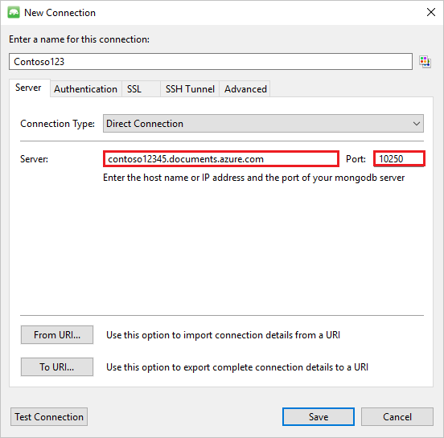

<properties 
    pageTitle="Utilisez MongoChef avec un compte DocumentDB avec prise en charge du protocole de MongoDB | Microsoft Azure" 
    description="Découvrez comment utiliser MongoChef avec un compte DocumentDB avec prise en charge du protocole de MongoDB, désormais disponible pour l’aperçu." 
    keywords="mongochef"
    services="documentdb" 
    authors="AndrewHoh" 
    manager="jhubbard" 
    editor="" 
    documentationCenter=""/>

<tags 
    ms.service="documentdb" 
    ms.workload="data-services" 
    ms.tgt_pltfrm="na" 
    ms.devlang="na" 
    ms.topic="article" 
    ms.date="08/25/2016" 
    ms.author="anhoh"/>

# Utilisez MongoChef avec un compte DocumentDB avec prise en charge du protocole de MongoDB

Pour vous connecter à un compte Azure DocumentDB avec prise en charge du protocole de MongoDB à l’aide de MongoChef, vous devez :

- Téléchargez et installez [MongoChef](http://3t.io/mongochef)
- Disposez votre compte DocumentDB avec prise en charge du protocole pour les informations de la [chaîne de connexion](documentdb-connect-mongodb-account.md) MongoDB

## Créer la connexion dans MongoChef  

Pour ajouter votre compte DocumentDB avec prise en charge du protocole de MongoDB pour le Gestionnaire de connexions MongoChef, procédez comme suit.

1. Récupérer votre DocumentDB avec prise en charge du protocole MongoDB informations de connexion en suivant les instructions [ici](documentdb-connect-mongodb-account.md).

    

2. Cliquez sur **se connecter** pour ouvrir le Gestionnaire de connexions, puis cliquez sur **Nouvelle connexion**

    
    
2. Dans la fenêtre **Nouvelle connexion** , sous l’onglet **serveur** , entrez l’hôte (FQDN) du compte DocumentDB avec prise en charge du protocole pour MongoDB et le PORT.
    
    

3. Dans la fenêtre **Nouvelle connexion** , sous l’onglet **authentification** , choisissez le Mode d’authentification **Standard (MONGODB CR ou SCARM-ça-1)** et entrez le nom d’utilisateur et mot de passe.  Acceptez la base de données d’authentification par défaut (admin) ou indiquez votre propre valeur.

    

4. Dans la fenêtre **Nouvelle connexion** , sous l’onglet **SSL** , cochez la case à cocher **protocole utiliser SSL pour se connecter** et le bouton d’option **certificats SSL auto-signé accepter** .

    

5. Cliquez sur le bouton **Tester la connexion** pour valider les informations de connexion, cliquez sur **OK** pour revenir à la fenêtre Nouvelle connexion, puis cliquez sur **Enregistrer**.

    

## MongoChef permet de créer une base de données, collection de sites et des documents  

Pour créer une base de données, la collection de sites et des documents à l’aide de MongoChef, effectuent les opérations suivantes.

1. Dans le **Gestionnaire de connexions**, sélectionnez la connexion, puis cliquez sur **se connecter**.

    

2. Cliquez avec le bouton droit sur l’hôte et choisissez **Ajouter une base de données**.  Indiquez un nom de base de données, cliquez sur **OK**.
    
    

3. Cliquez avec le bouton droit sur la base de données et cliquez sur **Ajouter la collection de sites**.  Indiquez un nom de la collection de sites, cliquez sur **créer**.

    

4. Cliquez sur l’élément de menu **collection de sites** , puis cliquez sur **Ajouter un Document**.

    

5. Dans la boîte de dialogue Ajouter un Document, collez les éléments suivants, puis sur **Ajouter un Document**.

        {
        "_id": "AndersenFamily",
        "lastName": "Andersen",
        "parents": [
            { "firstName": "Thomas" },
            { "firstName": "Mary Kay"}
        ],
        "children": [
        {
            "firstName": "Henriette Thaulow", "gender": "female", "grade": 5,
            "pets": [{ "givenName": "Fluffy" }]
        }
        ],
        "address": { "state": "WA", "county": "King", "city": "seattle" },
        "isRegistered": true
        }

    
6. Ajouter un autre document, cette fois avec le contenu suivant.

        {
        "_id": "WakefieldFamily",
        "parents": [
            { "familyName": "Wakefield", "givenName": "Robin" },
            { "familyName": "Miller", "givenName": "Ben" }
        ],
        "children": [
            {
                "familyName": "Merriam", 
                "givenName": "Jesse", 
                "gender": "female", "grade": 1,
                "pets": [
                    { "givenName": "Goofy" },
                    { "givenName": "Shadow" }
                ]
            },
            { 
                "familyName": "Miller", 
                "givenName": "Lisa", 
                "gender": "female", 
                "grade": 8 }
        ],
        "address": { "state": "NY", "county": "Manhattan", "city": "NY" },
        "isRegistered": false
        }

7. Exécuter un exemple de requête. Par exemple, recherchez familles avec le nom « Andersen » et retourner les parents et les champs d’état.

    
    

## Étapes suivantes

- Explorer DocumentDB avec prise en charge du protocole de MongoDB [exemples](documentdb-mongodb-samples.md).

 
