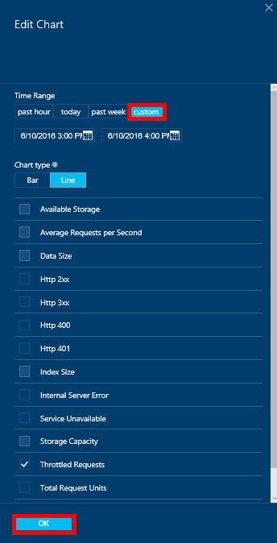
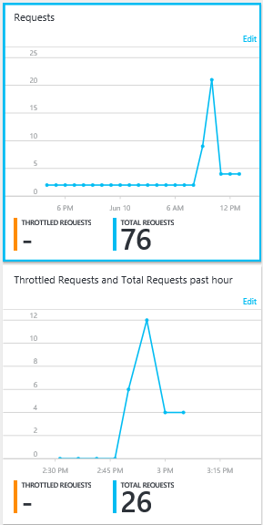

<properties
    pageTitle="Surveiller les demandes de DocumentDB et stockage | Microsoft Azure"
    description="Découvrez comment contrôler votre compte DocumentDB métriques de performances, tels que les demandes et les erreurs du serveur et les mesures d’utilisation, telles que la consommation de stockage."
    services="documentdb"
    documentationCenter=""
    authors="mimig1"
    manager="jhubbard"
    editor="cgronlun"/>

<tags
    ms.service="documentdb"
    ms.workload="data-services"
    ms.tgt_pltfrm="na"
    ms.devlang="na"
    ms.topic="article"
    ms.date="10/17/2016"
    ms.author="mimig"/>

# Surveiller les demandes DocumentDB, l’utilisation et le stockage

Vous pouvez surveiller vos comptes Azure DocumentDB dans le [portail Azure](https://portal.azure.com/). Pour chaque compte DocumentDB, les deux mesures de performances, tels que les demandes et erreurs du serveur et les mesures d’utilisation, telles que la consommation de stockage, sont disponibles.

Vous pouvez examiner les indicateurs sur la carte de compte ou sur la nouvelle carte indicateurs.

## Afficher les mesures de performances sur la carte de mesures

1. Dans une nouvelle fenêtre, ouvrez le [portail Azure](https://portal.azure.com/)et cliquez sur **Autres Services**, cliquez sur **DocumentDB (NoSQL)**, puis cliquez sur le nom du compte DocumentDB pour lequel vous voulez afficher les indicateurs de performance.
2. Dans le menu de la ressource, cliquez sur **indicateurs**.

La carte de mesures s’ouvre et vous pouvez sélectionner la collection de passer en revue. Vous pouvez examiner les mesures de disponibilité, demandes, débit et le stockage et comparez-les avec les SLA DocumentDB.

## Afficher les mesures de performances sur la carte de compte
1.  Dans une nouvelle fenêtre, ouvrez le [portail Azure](https://portal.azure.com/)et cliquez sur **Autres Services**, cliquez sur **DocumentDB (NoSQL)**, puis cliquez sur le nom du compte DocumentDB pour lequel vous voulez afficher les indicateurs de performance.

2.  Par défaut, la loupe **d’analyse** affiche les mosaïques suivantes :
    *   Nombre total de demandes pour le jour actuel.
    *   Espace de stockage utilisé.

    Si votre tableau n’affiche **aucune donnée disponible** et que vous pensez qu’il existe des données dans votre base de données, voir la section [résolution des problèmes](#troubleshooting) .

    

3.  Vignette ouvre une carte **métrique** détaillée cliquer sur les **demandes** ou un **espace de stockage** .
4.  La carte **métrique** affiche plus d’informations sur les mesures que vous avez sélectionné.  Dans la partie supérieure de la cuillère est un graphique de requêtes graphique toutes les heures, et en dessous est tableau qui indique les valeurs d’agrégation pour les demandes accélérées et total.  La carte métrique affiche également la liste des alertes qui ont été définis, filtrée sur les mesures qui apparaissent sur la carte métrique actuel (de cette façon, si vous avez un nombre d’alertes, vous verrez uniquement pertinents ceux présentés ici).   

    

## Personnaliser les vues métriques de performances dans le portail

1.  Pour personnaliser les indicateurs qui s’affichent dans un graphique en particulier, cliquez sur le graphique pour l’ouvrir dans la carte **métrique** , puis cliquez sur **Modifier le graphique**.  
    

2.  Sur la carte de **Modifier le graphique** , il existe options permettant de modifier les mesures qui s’affichent dans le graphique, ainsi que leurs laps de temps.  
    

3.  Pour modifier les mesures affichées dans le composant, sélectionnez simplement ou désactivez les indicateurs de performance disponibles, puis cliquez sur **OK** en bas de la carte.  
4.  Pour modifier la période, choisir une autre plage (par exemple, **personnalisé**), puis cliquez sur **OK** au bas de la carte.  

    

## Créer des graphiques côte à côte dans le portail
Le portail Azure vous permet de créer des graphiques métriques côte à côte.  

1.  Tout d’abord, avec le bouton droit sur le graphique que vous souhaitez copier et sélectionnez **Personnaliser**.

    

2.  Cliquez sur **cloner** dans le menu pour copier le composant, puis cliquez sur **terminé la personnalisation**.

      

Vous pouvez maintenant considérer ce composant comme n’importe quel autre composant métrique, personnalisation de l’intervalle de mesures et l’heure s’affiché dans le composant.  En procédant ainsi, vous pouvez voir deux mesures différentes graphique côte à côte en même temps.  
      

## Configurer des alertes dans le portail
1.  Dans le [portail Azure](https://portal.azure.com/), cliquez sur **Autres Services**et cliquez sur **DocumentDB (NoSQL)**, puis cliquez sur le nom du compte DocumentDB pour lequel vous voulez configurer des alertes métriques de performance.

2.  Dans le menu de la ressource, cliquez sur **Règles d’alerte** pour ouvrir la carte de règles d’alerte.  
    

3.  Dans la carte de **règles d’alerte** , cliquez sur **Ajouter une alerte**.  
    

4.  Dans la carte **Ajouter une règle d’alerte** , spécifiez :
    *   Le nom de la règle d’alerte que vous configurez.
    *   Une description de la nouvelle règle d’alerte.
    *   Métrique pour la règle d’alerte.
    *   La condition seuil et période qui déterminent quand l’alerte active. Par exemple, une erreur de serveur compter supérieure à 5 sur depuis 15 minutes.
    *   Si l’administrateur de service et coadministrators sont envoyés par e-mail au déclenchement de l’alerte.
    *   Adresses de messagerie supplémentaires pour les notifications d’alerte.  
    

## Surveiller DocumentDB par programmation
Les mesures de niveau de compte disponibles dans le portail, telles que les demandes l’utilisation et total de stockage compte, ne sont pas disponibles via les DocumentDB APIs. Cependant, vous pouvez récupérer des données d’utilisation au niveau de la collection de sites à l’aide de la DocumentDB APIs. Pour récupérer des données au niveau de collection de sites, procédez comme suit :

- Pour utiliser l’API REST, [effectuer une commande GET sur la collection de sites](https://msdn.microsoft.com/library/mt489073.aspx). Les informations de quota et l’utilisation de la collection de sites sont renvoyées dans les en-têtes x-ms--quota de ressources et x-ms--utilisation des ressources dans la réponse.
- Pour utiliser le Kit de développement .NET, utilisez la méthode [DocumentClient.ReadDocumentCollectionAsync](https://msdn.microsoft.com/library/microsoft.azure.documents.client.documentclient.readdocumentcollectionasync.aspx) , qui renvoie une [ResourceResponse](https://msdn.microsoft.com/library/dn799209.aspx) qui contient un nombre de propriétés de l’utilisation, telles que **CollectionSizeUsage**, **DatabaseUsage**, **DocumentUsage**et bien plus encore.

Pour accéder à des mesures supplémentaires, utilisez le [Kit de développement logiciel Azure moniteur](https://www.nuget.org/packages/Microsoft.Azure.Insights). Définitions métriques disponibles peuvent être récupérées en appelant :

    https://management.azure.com/subscriptions/{SubscriptionId}/resourceGroups/{ResourceGroup}/providers/Microsoft.DocumentDb/databaseAccounts/{DocumentDBAccountName}/metricDefinitions?api-version=2015-04-08

Requêtes pour récupérer des indicateurs individuels utilisent le format suivant :

    https://management.azure.com/subscriptions/{SubecriptionId}/resourceGroups/{ResourceGroup}/providers/Microsoft.DocumentDb/databaseAccounts/{DocumentDBAccountName}/metrics?api-version=2015-04-08&$filter=%28name.value%20eq%20%27Total%20Requests%27%29%20and%20timeGrain%20eq%20duration%27PT5M%27%20and%20startTime%20eq%202016-06-03T03%3A26%3A00.0000000Z%20and%20endTime%20eq%202016-06-10T03%3A26%3A00.0000000Z

Pour plus d’informations, voir [Métriques de ressources l’extraction via l’API REST de moniteur Azure](https://blogs.msdn.microsoft.com/cloud_solution_architect/2016/02/23/retrieving-resource-metrics-via-the-azure-insights-api/). Notez que « Azure Inights » a été renommé « Azure moniteur ».  Cette entrée de blog fait référence à son ancien nom.

## Résolution des problèmes
Si vos vignettes surveillance affichent le message **aucune donnée disponible** , et vous avez récemment apportées demandes ou ajouté de données à la base de données, vous pouvez modifier la vignette pour refléter l’utilisation récente.

### Modifier une vignette pour actualiser les données actuelles
1.  Pour personnaliser les indicateurs qui s’affichent dans une partie spécifique, cliquez sur le graphique pour ouvrir la carte **métrique** , puis cliquez sur **Modifier le graphique**.  
    

2.  Sur la carte de **Modifier le graphique** , dans la section **Laps de temps** , cliquez sur **après heure**, puis cliquez sur **OK**.  
    

3.  Mosaïque doit maintenant actualiser affichant vos données en cours et l’utilisation.  
    

## Étapes suivantes
Pour plus d’informations sur la capacité DocumentDB, voir [Gérer DocumentDB capacité](documentdb-manage.md).
