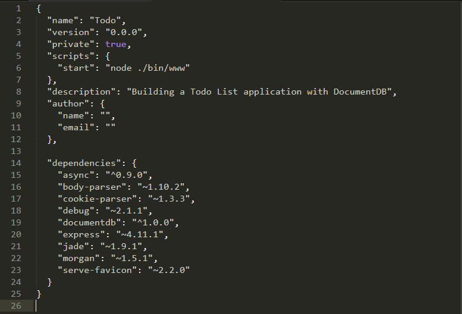

<properties 
    pageTitle="Découvrez Node.js - DocumentDB Node.js didacticiel | Microsoft Azure" 
    description="Découvrez Node.js ! Didacticiel porte sur l’utilisation de Microsoft Azure DocumentDB pour stocker et accéder aux données d’une application web Node.js Express hébergée sur des sites Web Azure." 
    keywords="Développement d’applications, didacticiel de la base de données, découvrez node.js, node.js didacticiel, documentdb, azure, Microsoft azure"
    services="documentdb" 
    documentationCenter="nodejs" 
    authors="syamkmsft" 
    manager="jhubbard" 
    editor="cgronlun"/>

<tags 
    ms.service="documentdb" 
    ms.workload="data-services" 
    ms.tgt_pltfrm="na" 
    ms.devlang="nodejs" 
    ms.topic="hero-article" 
    ms.date="08/25/2016" 
    ms.author="syamk"/>

# Créer une application web Node.js à l’aide de DocumentDB

> [AZURE.SELECTOR]
- [.NET](documentdb-dotnet-application.md)
- [Node.js](documentdb-nodejs-application.md)
- [Java](documentdb-java-application.md)
- [Python](documentdb-python-application.md)

Ce didacticiel Node.js vous montre comment utiliser le service DocumentDB Azure pour stocker et accéder aux données à partir d’une application Node.js Express hébergée sur des sites Web Azure.

Nous vous recommandons de mise en route en regardant la vidéo suivante, où vous allez apprendre à configurer un compte de base de données Azure DocumentDB et stocker des documents JSON dans votre application Node.js. 

> [AZURE.VIDEO azure-demo-getting-started-with-azure-documentdb-on-nodejs-in-linux]

Revenez ensuite à ce didacticiel Node.js, dans laquelle vous découvrirez les réponses aux questions suivantes :

- Comment travailler avec DocumentDB l’utilisation du module npm documentdb ?
- Comment déployer l’application web à des sites Web Azure ?

En suivant ce didacticiel de base de données, vous allez générer une application simple basée sur le web-gestion des tâches qui permet de créer, extraction et l’exécution des tâches. Les tâches sont stockées en tant que documents JSON dans Azure DocumentDB.

Ne pas avoir le temps pour terminer le didacticiel et vous voulez simplement obtenir une solution complète ? Pas un problème, vous pouvez obtenir la solution complète de [GitHub][].

## Conditions préalables

> [AZURE.TIP] Ce didacticiel Node.js suppose que vous avez certaines expérience antérieure à l’aide de Node.js et sites Web Azure.

Avant de suivre les instructions fournies dans cet article, vous devez vous assurer que vous disposez des éléments suivants :

- Un compte Azure actif. Si vous n’avez pas un compte, vous pouvez créer un compte d’évaluation gratuit en quelques minutes. Pour plus d’informations, voir [Azure la version d’évaluation gratuite](https://azure.microsoft.com/pricing/free-trial/).
- [Node.js][] version v0.10.29 ou une version ultérieure.
- [Générateur de Express](http://www.expressjs.com/starter/generator.html) (vous pouvez l’installer via `npm install express-generator -g`)
- [Git][].

## Étape 1 : Créer un compte de base de données DocumentDB

Nous allons commencer par créer un compte DocumentDB. Si vous possédez déjà un compte, vous pouvez passer à [étape 2 : créer une nouvelle application Node.js](#_Toc395783178).

[AZURE.INCLUDE [documentdb-create-dbaccount](../../includes/documentdb-create-dbaccount.md)]

[AZURE.INCLUDE [documentdb-keys](../../includes/documentdb-keys.md)]

## Étape 2 : Découvrez comment créer une nouvelle application Node.js

Maintenant découvrir créer un projet Node.js Hello World simple à l’aide de l’infrastructure [d’Express](http://expressjs.com/) .

1. Ouvrez votre terminal favori.

2. Utiliser le Générateur d’express pour générer une nouvelle application appelée **todo**.

        express todo

3. Ouvrez votre nouveau répertoire **todo** et installer des dépendances.

        cd todo
        npm install

4. Exécuter votre nouvelle application.

        npm start

5. Vous pouvez vous permet d’afficher votre nouvelle application en naviguant dans votre navigateur pour [http://localhost:3000](http://localhost:3000).

    

## Étape 3 : Installer des modules complémentaires

Le fichier **package.json** figure parmi les fichiers créés dans la racine du projet. Ce fichier contient la liste des modules complémentaires requis pour votre application Node.js. Plus tard, lorsque vous déployez cette application à un sites Web Azure, ce fichier est utilisé pour déterminer quels modules doivent être installés sur Azure pour prendre en charge votre application. Nous vous avez encore besoin d’installer les deux packages plus pour ce didacticiel.

1. Dans le terminal, installez le module **asynchrone** via npm.

        npm install async --save

1. Installez le module **documentdb** via npm. Il s’agit le module dans lequel la magie DocumentDB se produit.

        npm install documentdb --save

3. Une vérification rapide du fichier **package.json** de l’application doit afficher les modules complémentaires. Ce fichier indiquera Azure quels packages pour télécharger et installer lors de l’exécution de votre application. Il doit ressembler à l’exemple ci-dessous.

    

    Cette option indique à nœud (et Azure ultérieurement) que votre application dépend de ces modules complémentaires.

## Étape 4 : Au moyen du service DocumentDB dans une application de nœud

Qui prend en charge tous les la configuration initiale et de configuration, maintenant nous allons get vers le bas pour pourquoi nous sommes là, et qui consiste à écrire du code à l’aide de DocumentDB Azure.

### Créer le modèle

1. Dans le répertoire du projet, créez un répertoire nommé **modèles**.
2. Dans le répertoire de **modèles** , créez un nouveau fichier nommé **taskDao.js**. Ce fichier contient le modèle pour les tâches créées par notre application.
3. Dans le même répertoire de **modèles** , créez un autre fichier nommé **docdbUtils.js**. Ce fichier contiendra du code utile, réutilisable, nous allons utiliser partout dans notre application. 
4. Copiez le code suivant dans à **docdbUtils.js**

        var DocumentDBClient = require('documentdb').DocumentClient;
            
        var DocDBUtils = {
            getOrCreateDatabase: function (client, databaseId, callback) {
                var querySpec = {
                    query: 'SELECT * FROM root r WHERE r.id= @id',
                    parameters: [{
                        name: '@id',
                        value: databaseId
                    }]
                };
        
                client.queryDatabases(querySpec).toArray(function (err, results) {
                    if (err) {
                        callback(err);
        
                    } else {
                        if (results.length === 0) {
                            var databaseSpec = {
                                id: databaseId
                            };
        
                            client.createDatabase(databaseSpec, function (err, created) {
                                callback(null, created);
                            });
        
                        } else {
                            callback(null, results[0]);
                        }
                    }
                });
            },
        
            getOrCreateCollection: function (client, databaseLink, collectionId, callback) {
                var querySpec = {
                    query: 'SELECT * FROM root r WHERE r.id=@id',
                    parameters: [{
                        name: '@id',
                        value: collectionId
                    }]
                };             
                
                client.queryCollections(databaseLink, querySpec).toArray(function (err, results) {
                    if (err) {
                        callback(err);
        
                    } else {        
                        if (results.length === 0) {
                            var collectionSpec = {
                                id: collectionId
                            };
                            
                            client.createCollection(databaseLink, collectionSpec, function (err, created) {
                                callback(null, created);
                            });
        
                        } else {
                            callback(null, results[0]);
                        }
                    }
                });
            }
        };
                
        module.exports = DocDBUtils;

    > [AZURE.TIP] createCollection prend un paramètre requestOptions facultatif qui peut être utilisé pour spécifier le Type de proposer pour la Collection. Si aucune valeur requestOptions.offerType est fournie puis la collection de sites est créée à l’aide de la valeur par défaut offrent Type.
    >
    > Pour plus d’informations sur les Types de proposer DocumentDB reportez-vous à [des niveaux de Performance dans DocumentDB](documentdb-performance-levels.md) 
        
3. Enregistrez et fermez le fichier **docdbUtils.js** .

4. Au début du fichier **taskDao.js** , ajoutez le code suivant pour faire référence à la **DocumentDBClient** et la **docdbUtils.js** que nous avons créé ci-dessus :

        var DocumentDBClient = require('documentdb').DocumentClient;
        var docdbUtils = require('./docdbUtils');

4. Ensuite, vous ajouterez du code permettant de définir et exporter l’objet de la tâche. Ceci est responsable de l’initialisation de notre objet tâche et en configurant la base de données et la Collection de documents, nous utiliserons.

        function TaskDao(documentDBClient, databaseId, collectionId) {
          this.client = documentDBClient;
          this.databaseId = databaseId;
          this.collectionId = collectionId;
        
          this.database = null;
          this.collection = null;
        }
        
        module.exports = TaskDao;

5. Ensuite, ajoutez le code suivant pour définir des méthodes supplémentaires sur l’objet de la tâche, qui autorisent les interactions avec les données stockées dans DocumentDB.

        TaskDao.prototype = {
            init: function (callback) {
                var self = this;
        
                docdbUtils.getOrCreateDatabase(self.client, self.databaseId, function (err, db) {
                    if (err) {
                        callback(err);
                    } else {
                        self.database = db;
                        docdbUtils.getOrCreateCollection(self.client, self.database._self, self.collectionId, function (err, coll) {
                            if (err) {
                                callback(err);
        
                            } else {
                                self.collection = coll;
                            }
                        });
                    }
                });
            },
        
            find: function (querySpec, callback) {
                var self = this;
        
                self.client.queryDocuments(self.collection._self, querySpec).toArray(function (err, results) {
                    if (err) {
                        callback(err);
        
                    } else {
                        callback(null, results);
                    }
                });
            },
        
            addItem: function (item, callback) {
                var self = this;
        
                item.date = Date.now();
                item.completed = false;
        
                self.client.createDocument(self.collection._self, item, function (err, doc) {
                    if (err) {
                        callback(err);
        
                    } else {
                        callback(null, doc);
                    }
                });
            },
        
            updateItem: function (itemId, callback) {
                var self = this;
        
                self.getItem(itemId, function (err, doc) {
                    if (err) {
                        callback(err);
        
                    } else {
                        doc.completed = true;
        
                        self.client.replaceDocument(doc._self, doc, function (err, replaced) {
                            if (err) {
                                callback(err);
        
                            } else {
                                callback(null, replaced);
                            }
                        });
                    }
                });
            },
        
            getItem: function (itemId, callback) {
                var self = this;
        
                var querySpec = {
                    query: 'SELECT * FROM root r WHERE r.id = @id',
                    parameters: [{
                        name: '@id',
                        value: itemId
                    }]
                };
        
                self.client.queryDocuments(self.collection._self, querySpec).toArray(function (err, results) {
                    if (err) {
                        callback(err);
        
                    } else {
                        callback(null, results[0]);
                    }
                });
            }
        };

6. Enregistrez et fermez le fichier **taskDao.js** . 

### Créez le contrôleur

1. Dans le répertoire de **route** de votre projet, créez un nouveau fichier nommé **tasklist.js**. 
2. Ajouter le code suivant à **tasklist.js**. Les modules DocumentDBClient et asynchrone, qui sont utilisés par **tasklist.js**est chargée. Il définit également la fonction **liste des tâches** , qui est une instance de l’objet de **tâche** définie précédemment passée :

        var DocumentDBClient = require('documentdb').DocumentClient;
        var async = require('async');
        
        function TaskList(taskDao) {
          this.taskDao = taskDao;
        }
        
        module.exports = TaskList;

3. Continuez d’ajouter le fichier **tasklist.js** en ajoutant les méthodes utilisées pour **showTasks, addTask**et **completeTasks**:
        
        TaskList.prototype = {
            showTasks: function (req, res) {
                var self = this;
        
                var querySpec = {
                    query: 'SELECT * FROM root r WHERE r.completed=@completed',
                    parameters: [{
                        name: '@completed',
                        value: false
                    }]
                };
        
                self.taskDao.find(querySpec, function (err, items) {
                    if (err) {
                        throw (err);
                    }
        
                    res.render('index', {
                        title: 'My ToDo List ',
                        tasks: items
                    });
                });
            },
        
            addTask: function (req, res) {
                var self = this;
                var item = req.body;
        
                self.taskDao.addItem(item, function (err) {
                    if (err) {
                        throw (err);
                    }
        
                    res.redirect('/');
                });
            },
        
            completeTask: function (req, res) {
                var self = this;
                var completedTasks = Object.keys(req.body);
        
                async.forEach(completedTasks, function taskIterator(completedTask, callback) {
                    self.taskDao.updateItem(completedTask, function (err) {
                        if (err) {
                            callback(err);
                        } else {
                            callback(null);
                        }
                    });
                }, function goHome(err) {
                    if (err) {
                        throw err;
                    } else {
                        res.redirect('/');
                    }
                });
            }
        };

4. Enregistrez et fermez le fichier **tasklist.js** .
 
### Ajouter config.js

1. Dans le répertoire de votre projet créer un nouveau fichier nommé **config.js**.
2. Ajoutez le code suivant **config.js**. Définit les paramètres de configuration et les valeurs nécessaires pour notre application.

        var config = {}
        
        config.host = process.env.HOST || "[the URI value from the DocumentDB Keys blade on http://portal.azure.com]";
        config.authKey = process.env.AUTH_KEY || "[the PRIMARY KEY value from the DocumentDB Keys blade on http://portal.azure.com]";
        config.databaseId = "ToDoList";
        config.collectionId = "Items";
        
        module.exports = config;

3. Dans le fichier **config.js** , mettre à jour les valeurs des hôtes et AUTH_KEY en utilisant les valeurs figurant dans la carte de clés de votre compte DocumentDB sur le [Portail de Microsoft Azure](https://portal.azure.com):

4. Enregistrez et fermez le fichier **config.js** .
 
### Modifier app.js

1. Dans le répertoire du projet, ouvrez le fichier **app.js** . Ce fichier a été créé lors de la création de l’application web Express.
2. Ajoutez le code suivant en haut de la **app.js**
    
        var DocumentDBClient = require('documentdb').DocumentClient;
        var config = require('./config');
        var TaskList = require('./routes/tasklist');
        var TaskDao = require('./models/taskDao');

3. Ce code définit le fichier de configuration à utiliser et continue à lire les valeurs de ce fichier dans certaines variables nous utiliserons plus rapidement.
4. Remplacez les deux lignes suivantes dans le fichier **app.js** :

        app.use('/', routes);
        app.use('/users', users); 

      avec l’extrait de code suivante :

        var docDbClient = new DocumentDBClient(config.host, {
            masterKey: config.authKey
        });
        var taskDao = new TaskDao(docDbClient, config.databaseId, config.collectionId);
        var taskList = new TaskList(taskDao);
        taskDao.init();
        
        app.get('/', taskList.showTasks.bind(taskList));
        app.post('/addtask', taskList.addTask.bind(taskList));
        app.post('/completetask', taskList.completeTask.bind(taskList));
        app.set('view engine', 'jade');

6. Ces lignes définissent une nouvelle instance de notre objet **TaskDao** , avec une connexion à DocumentDB (en utilisant les valeurs lire à partir de la **config.js**), initialisation de l’objet de la tâche, puis lient actions du formulaire aux méthodes sur notre contrôleur de la **liste des tâches** . 

7. Pour finir, enregistrez et fermez le fichier **app.js** , nous avons pratiquement terminé.
 
## Étape 5 : Créer une interface utilisateur

Maintenant nous allons activer notre attention sur la création de l’interface utilisateur afin que l’utilisateur peut réellement interagir avec notre application. L’application Express que nous avons créé utilise **Jade** comme le moteur d’affichage. Pour plus d’informations sur Jade reportez-vous à [http://jade-lang.com/](http://jade-lang.com/).

1. Le fichier **layout.jade** dans le répertoire **affichages** est utilisé comme modèle global d’autres fichiers **.jade** . Dans cette étape, vous allez modifier pour qu’il utilise [Démarrage Twitter](https://github.com/twbs/bootstrap), qui est un jeu d’outils qui rend facile créer un site Web aspect piles. 
2. Ouvrir le fichier **layout.jade** figurant dans le dossier **affichages** et remplacez le contenu par les opérations suivantes :
    
        doctype html
        html
          head
            title= title
            link(rel='stylesheet', href='//ajax.aspnetcdn.com/ajax/bootstrap/3.3.2/css/bootstrap.min.css')
            link(rel='stylesheet', href='/stylesheets/style.css')
          body
            nav.navbar.navbar-inverse.navbar-fixed-top
              div.navbar-header
                a.navbar-brand(href='#') My Tasks
            block content
            script(src='//ajax.aspnetcdn.com/ajax/jQuery/jquery-1.11.2.min.js')
            script(src='//ajax.aspnetcdn.com/ajax/bootstrap/3.3.2/bootstrap.min.js')

    Cela demande au moteur **Jade** pour le rendu du code HTML de notre application et crée un **bloc** appelé **contenu** où nous pouvons fournir la mise en page pour notre pages de contenu.
    Enregistrez et fermez ce fichier **layout.jade** .

4. Ouvrez le fichier **index.jade** , l’affichage qui est utilisé par notre application et remplacez le contenu du fichier avec les éléments suivants :

        extends layout
        
        block content
          h1 #{title}
          br
        
          form(action="/completetask", method="post")
            table.table.table-striped.table-bordered
              tr
                td Name
                td Category
                td Date
                td Complete
              if (typeof tasks === "undefined")
                tr
                  td
              else
                each task in tasks
                  tr
                    td #{task.name}
                    td #{task.category}
                    - var date  = new Date(task.date);
                    - var day   = date.getDate();
                    - var month = date.getMonth() + 1;
                    - var year  = date.getFullYear();
                    td #{month + "/" + day + "/" + year}
                    td
                      input(type="checkbox", name="#{task.id}", value="#{!task.completed}", checked=task.completed)
            button.btn(type="submit") Update tasks
          hr
          form.well(action="/addtask", method="post")
            label Item Name:
            input(name="name", type="textbox")
            label Item Category:
            input(name="category", type="textbox")
            br
            button.btn(type="submit") Add item

    Cette disposition s’étend et fournit du contenu à l’espace réservé de **contenu** que nous l’avons vu plus haut dans le fichier **layout.jade** .
    
    Dans cette disposition que nous avons créé deux formulaires HTML. 
    La première forme contient un tableau pour nos données et un bouton qui permet de mettre à jour des éléments en publiant des éléments à méthode **/completetask** de notre contrôleur.
    La deuxième forme contient deux champs d’entrée et un bouton qui permet de créer un élément en publiant des éléments à méthode **/addtask** de notre contrôleur.
    
    Il s’agit tout ce que nous avons besoin de notre application pour l’utiliser.

5. Ouvrez le fichier **style.css** dans répertoire **public\stylesheets** et remplacez le code avec les éléments suivants :

        body {
          padding: 50px;
          font: 14px "Lucida Grande", Helvetica, Arial, sans-serif;
        }
        a {
          color: #00B7FF;
        }
        .well label {
          display: block;
        }
        .well input {
          margin-bottom: 5px;
        }
        .btn {
          margin-top: 5px;
          border: outset 1px #C8C8C8;
        }

    Enregistrez et fermez ce fichier **style.css** .

## Étape 6 : Exécuter votre application localement

1. Pour tester l’application sur votre ordinateur local, exécutez `npm start` dans un terminal pour démarrer votre application et lancer un navigateur avec une page qui ressemble à l’image ci-dessous :

    

2. Utiliser les champs fournis pour l’élément, nom de l’élément et catégorie pour entrer des informations, puis cliquez sur **Ajouter un élément**.

3. La page doit mettre à jour pour afficher les éléments nouvellement créé dans la liste ToDo.

    

4. Pour exécuter une tâche, vérifiez simplement la case à cocher dans la colonne achevé, puis cliquez sur **mettre à jour les tâches**.

## Étape 7 : Déployer votre projet de développement d’application à des sites Web Azure

1. Si vous n’avez pas déjà, activer un référentiel git pour votre site Web Azure. Vous trouverez des instructions sur la procédure à suivre dans la rubrique [Déploiement Local de Git Azure Application Service](../app-service-web/app-service-deploy-local-git.md) .

2. Ajoutez votre site Web Azure comme un git à distance.

        git remote add azure https://username@your-azure-website.scm.azurewebsites.net:443/your-azure-website.git

3. Déployer en appuyant au serveur distant.

        git push azure master

4. En quelques secondes, git sera terminer la publication de votre application web et lancer un navigateur dans laquelle vous pouvez voir votre travail pratique en cours d’exécution dans Azure !

## Étapes suivantes

Félicitations ! Vous avez simplement créé votre première Node.js Express Application Web à l’aide de DocumentDB Azure et publié à des sites Web Azure.

Le code source pour l’application de référence complète peut être téléchargé à partir de [GitHub][].

Pour plus d’informations, voir le [Centre de développement Node.js](https://azure.microsoft.com/develop/nodejs/).

[Node.js]: http://nodejs.org/
[GIT]: http://git-scm.com/
[Github]: https://github.com/Azure-Samples/documentdb-node-todo-app
 
