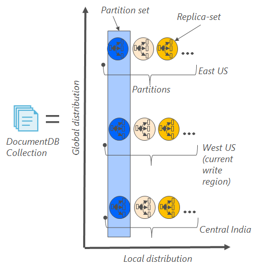

<properties
    pageTitle="Sauvegarde en ligne et restauration avec DocumentDB | Microsoft Azure"
    description="Découvrez comment effectuer une sauvegarde automatique et la restauration des bases de données NoSQL avec Azure DocumentDB."
    keywords="sauvegarde et restauration, sauvegarde en ligne"
    services="documentdb"
    documentationCenter=""
    authors="RahulPrasad16"
    manager="jhubbard"
    editor="monicar"/>

<tags
    ms.service="documentdb"
    ms.workload="data-services"
    ms.tgt_pltfrm="na"
    ms.devlang="multiple"
    ms.topic="article"
    ms.date="09/23/2016"
    ms.author="raprasa"/>

# La sauvegarde automatique en ligne et restauration avec DocumentDB 

DocumentDB Azure prend automatiquement des copies de sauvegarde de toutes vos données à intervalles réguliers. Les sauvegardes automatiques sont prises sans affecter les performances ou la disponibilité de vos opérations de base de données NoSQL. Toutes vos sauvegardes sont stockés séparément dans un autre service de stockage, et ces sauvegardes sont globalement répliquées pour la résilience contre les incidents régionaux. Les sauvegardes automatiques sont conçus pour des scénarios lorsque vous supprimez accidentellement votre collection de sites DocumentDB et ultérieurement requièrent récupération des données ou une solution de récupération d’urgence.  

Cet article commence par un récapitulatif rapide de la redondance des données et la disponibilité dans DocumentDB et puis traite des sauvegardes. 

## DocumentDB - un récapitulatif de disponibilité

DocumentDB est conçu pour être [globalement distribué](documentdb-distribute-data-globally.md) : il vous permet de mettre à l’échelle de débit dans plusieurs régions Azure ainsi que de la stratégie par l’effort basculement et API hébergement multiple transparent. Comme un système de base de données offrant une [disponibilité de 99,99 % SLA](https://azure.microsoft.com/support/legal/sla/documentdb/v1_0/), toutes les opérations d’écriture dans DocumentDB sont durablement engagées à disques locaux par un quorum des réplicas au sein d’un centre de données locales avant d’accusé de réception vers le client. Notez que la disponibilité du DocumentDB repose sur le stockage local et ne dépend pas des technologies de stockage externe. En outre, si votre compte de base de données est associé à plusieurs régions Azure, vos écritures sont répliquées dans ainsi que d’autres régions. Pour mettre à l’échelle vos données débit et accès au latence faible, vous pouvez avoir comme plupart lire régions associées à votre compte de base de données que vous le souhaitez. Dans chaque région lecture, les données (répliquées) sont conservées durablement au sein d’un ensemble de copie.  

Comme illustré dans le diagramme suivant, une collection de DocumentDB unique est [partition horizontalement](documentdb-partition-data.md). Une « partition » est indiquée par un cercle dans le diagramme suivant et chaque partition est rendue hautement disponible via un ensemble de copie. Il s’agit de la distribution locale dans une région Azure unique (indiquée par l’axe X). En outre, chacune des partitions (avec son jeu de réplica correspondant) sont ensuite globalement distribuée dans plusieurs régions associées à votre compte de base de données (par exemple, dans cette illustration les trois régions qui – US Extrême-Orient, US ouest Inde Central). Le « jeu de partitions » est globalement distribué entité comprenant de plusieurs copies de vos données dans chaque région (indiquée par l’axe des ordonnées). Vous pouvez affecter priorité aux régions associées à votre compte de base de données et DocumentDB bascule en toute transparence vers la zone suivante en cas de panne. Vous pouvez également manuellement simuler basculement pour tester la disponibilité de bout en bout de votre application.  

L’image suivante illustre le degré de redondance avec DocumentDB.

## Sauvegardes complètes, automatiques et en ligne

Mince, j’ai supprimé mon collection de sites ou d’une base de données ! Avec DocumentDB, non seulement vos données, mais la sauvegarde de vos données est également apportées hautement redondantes et résistant aux incidents régionaux. Ces sauvegardes automatisées sont actuellement prises environ toutes les quatre heures. 

Les sauvegardes sont effectuées sans affecter les performances ou la disponibilité de vos opérations de base de données. DocumentDB prend la sauvegarde en arrière-plan sans votre RUs générés par d’autres programmes ou affecter les performances et sans affecter la disponibilité de votre base de données NoSQL. 

Contrairement à vos données sont stockées dans DocumentDB, les sauvegardes automatiques sont stockées dans le service de stockage d’objets Blob Azure. Pour garantir le téléchargement faible latence/efficace, l’instantané de votre sauvegarde est téléchargé dans une instance de stockage d’objets Blob Azure dans la même région en tant que la zone d’écriture en cours de votre compte de base de données DocumentDB. Pour la résilience contre sinistre régional, chaque instantané de vos données de sauvegarde dans le stockage Blob Azure à nouveau répliquée à l’aide stockage geo redondantes (GRS) dans une autre région. Le diagramme suivant montre que l’ensemble de la collection DocumentDB (avec toutes les trois partitions principales ouest aux États-Unis, dans cet exemple) est sauvegardé dans un compte de stockage d’objets Blob Azure distant aux États-Unis Ouest et ensuite GRS répliquées Extrême-Orient US. 

L’image suivante illustre les sauvegardes périodiques complètes de toutes les entités DocumentDB dans le stockage Azure GRS.

## Période de rétention pour un instantané donné

Comme décrit ci-dessus, nous prendre régulièrement des instantanés de vos données et par notre réglementations, nous conserver la dernière capture instantanée 90 jours avant qu’il obtient finalement supprimés définitivement. Si un compte ou une collection de sites est supprimée, DocumentDB stocke la dernière sauvegarde de 90 jours.

## Restaurer la base de données à partir de la sauvegarde en ligne

Si vous supprimez accidentellement vos données, vous pouvez [fichier un tickets de support](https://portal.azure.com/?#blade/Microsoft_Azure_Support/HelpAndSupportBlade) ou [appeler le support Azure](https://azure.microsoft.com/support/options/) pour restaurer les données à partir de la dernière sauvegarde automatique. Pour un instantané spécifique de votre sauvegarde à restaurer, DocumentDB nécessite que les données étaient au moins disponibles avec nous pendant la durée du cycle de sauvegarde pour cet instantané.

## Étapes suivantes

Pour dupliquer votre base de données NoSQL dans plusieurs centres de données, voir [distribuer vos données globalement avec DocumentDB](documentdb-distribute-data-globally.md). 

Pour contacter le fichier Support Azure, [fichier un bon à partir du portail Azure](https://portal.azure.com/?#blade/Microsoft_Azure_Support/HelpAndSupportBlade).