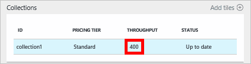

<properties
    pageTitle="Niveaux de performances dans DocumentDB | Microsoft Azure"
    description="Découvrez comment les niveaux de performances dans DocumentDB permettent de réserver débit sur une base par collection de sites."
    services="documentdb"
    authors="mimig1"
    manager="jhubbard"
    editor="monicar"
    documentationCenter=""/>

<tags
    ms.service="documentdb"
    ms.workload="data-services"
    ms.tgt_pltfrm="na"
    ms.devlang="na"
    ms.topic="article"
    ms.date="08/26/2016"
    ms.author="mimig"/>

# Niveaux de performances dans DocumentDB

Cet article fournit une vue d’ensemble des niveaux de performances dans [Microsoft Azure DocumentDB](https://azure.microsoft.com/services/documentdb/).

Lisez cet article, vous serez en mesure de répondre aux questions suivantes :  

-   Qu’est un niveau de performance ?
-   Comment débit est réservé à un compte de base de données ?
-   Comment travailler avec des niveaux de performance ?
-   Comment de facturation pour les niveaux de performance ?

## Présentation des niveaux de performances

Chaque collection DocumentDB créée sous un compte d’utilisateur Standard est configurée avec un niveau de performance associé. Chaque collection de sites dans une base de données peut avoir un niveau de performance qui vous permet de désigner plus de débit pour des collections de sites fréquemment consultées et moins débit pour des collections de rarement. DocumentDB prend en charge les deux niveaux de performances définis par l’utilisateur et prédéfinie des niveaux de performance.  

Chaque niveau de performance a une limite de taux associés [unité demande (demandeur)](documentdb-request-units.md) . Ceci est le débit qui sera réservé pour une collection de sites en fonction de son niveau de performance et n’est disponible pour une utilisation par cette collection de sites en mode exclusif.

<table border="0" cellspacing="0" cellpadding="0">
    <tbody>
        <tr>
            <td valign="top">

</td>
            <td valign="top">
Plus d’informations
</td>
            <td valign="top">
Limites du débit
</td>
            <td valign="top">
Limites de stockage
</td>
            <td valign="top">
Version
</td>
            <td valign="top">
API
</td>            
        </tr>
        <tr>
            <td valign="top">
Performances définis par l’utilisateur
</td>
            <td valign="top">
Stockage limitées basé sur l’utilisation en Go.

Débit en unités de 100 demandeur/s
</td>
            <td valign="top">
Illimité. 400 - 250 000 demander unités/s par défaut (supérieur à la demande)
</td>
            <td valign="top">
Illimité. 250 Go par défaut (supérieur à la demande) 
</td>
            <td valign="top">
V2
</td>
            <td valign="top">
API 2015-12-16 et versions ultérieures
</td>  
        </tr>
        <tr>
            <td valign="top">
Performances prédéfinis
</td>
            <td valign="top">
Stockage de 10 Go réservé.

S1 = 250 demandeur/s, S2 = 1000 demandeur/s, S3 = 2500 demandeur/s
</td>
            <td valign="top">
2500 demandeur/s
</td>
            <td valign="top">
10 GO
</td>
            <td valign="top">
V1
</td>
            <td valign="top">
Tout
</td>  
        </tr>        
    </tbody>
</table>                

DocumentDB permet un large éventail d’opérations de base de données, y compris des requêtes, des procédures de requêtes avec des fonctions définies par l’utilisateur (UDF), stockées et des déclencheurs. Le coût de traitement associé à chacune de ces opérations varient en fonction du processeur, la IO et la mémoire nécessaire pour terminer l’opération. À la place de demandant et la gestion des ressources matérielles, vous pouvez envisager d’une unité de demande comme une seule mesure pour les ressources requises pour effectuer diverses opérations de base de données et une demande d’application de service.

Collections de sites peuvent être créées par le biais du [portail Microsoft Azure](https://portal.azure.com), l' [API REST](https://msdn.microsoft.com/library/azure/mt489078.aspx) ou de la [SDK DocumentDB](https://msdn.microsoft.com/library/azure/dn781482.aspx). Les APIs DocumentDB permettent de spécifier le niveau de performance d’une collection de.

> [AZURE.NOTE] Le niveau de performance d’une collection de sites peut être ajusté par les API ou du [portail Microsoft Azure](https://portal.azure.com/). Modifications au niveau des performances doivent effectuer dans les 3 minutes.

## Définition des niveaux de performances pour des collections
Lorsqu’une collection est créé, l’allocation de complète de RUs basé sur le niveau de performance désigné sont réservés pour la collection de sites.

Notez qu’avec deux niveaux de performances prédéfinis et définis par l’utilisateur, DocumentDB fonctionne en fonction de réservation de débit. En créant une collection de sites, une application a réservée et est facturée pour débit réservé quelle que soit la quantité de que le débit est connue. Avec des niveaux de performances définis par l’utilisateur, stockage est mesuré en fonction de consommation, mais avec des niveaux de performance prédéfinis, 10 Go de stockage est réservée au moment de la création d’une collection de sites.  

Après la création de collections de sites, vous pouvez modifier le niveau de performance par le biais du SDK DocumentDB ou via le portail classique Azure.

> [AZURE.IMPORTANT] Collections DocumentDB Standard sont facturées un taux horaire et chaque collection de sites que vous créez est facturés une inférieure à une heure de l’utilisation.

Si vous ajustez le niveau de performance d’une collection de sites dans l’heure, le plus haut niveau de performance définis lors de l’heure vous seront facturés. Par exemple, si vous augmentez votre niveau de performance pour une collection de sites à 08:53 vous sera facturé pour le nouveau niveau en commençant à 8:00 am. De même, si vous diminuez le niveau de performance à 08:53, le nouveau taux est appliqué à 9:00 am.

Demande d’unités est réservée pour chaque collection de sites en fonction de l’ensemble de niveau de performance. Demande de consommation d’unités est évaluée comme un taux par seconde. Limiter les applications qui dépassent le taux unitaire demande généré (ou le niveau de performance) sur une collection seront jusqu'à ce que le taux passe en dessous du niveau réservé pour cette collection de sites. Si votre application requiert un niveau plus élevé de débit, vous pouvez augmenter le niveau de performance pour chaque collection de sites.

> [AZURE.NOTE] Lorsque votre application dépasse les niveaux de performances d’une ou plusieurs collections, demandes seront limitées sur une base par collection de sites. Cela signifie que certaines demandes d’application peuvent réussir tandis que d’autres personnes peuvent être limitées. Il est recommandé d’ajouter un petit nombre de tentatives lorsque limité afin de gérer les pointes de trafic demande.

## Utilisation des niveaux de performances
DocumentDB collections vous permettent de regrouper les données en fonction des modèles de requête et des besoins de performances de votre application. Avec de DocumentDB l’indexation automatique et prise en charge de la requête, il est assez courant colocaliser des documents hétérogènes dans la même collection. Les considérations clés si collections distinctes doivent être utilisées pour décider sont les suivantes :

- Requêtes – une collection de sites est la portée pour l’exécution des requêtes. Si vous devez exécuter des requêtes dans un ensemble de documents, les modèles en savoir plus efficaces provenant de cohabitation documents dans une collection unique.
- Transactions – toutes les transactions sont limitées au sein d’une collection unique. Si vous disposez de documents qui doivent être mis à jour au sein d’une seule procédure stockée ou un déclencheur, ils doivent être stockés dans la même collection. Plus précisément, une clé de partition au sein d’une collection de sites est la limite de transaction. Pour plus d’informations, consultez [partitionnement dans DocumentDB](documentdb-partition-data.md) .
- Isolement de performances – une collection de sites a un niveau de performance associé. Cela garantit que chaque collection de sites a un performances prévisibles via RUs réservés. Données peuvent être affectées à différentes collections, avec des niveaux de performances différentes, en fonction de la fréquence d’accès.

> [AZURE.IMPORTANT] Il est important de comprendre que vous sera facturée au taux standard complet en fonction du nombre de collections de sites créés par votre application.

Il est recommandé que votre application fait utiliser d’un petit nombre de collections de sites à moins d’avoir des exigences de stockage ou débit importantes. Vérifiez que vous avez bien compris les modèles d’application pour la création de nouvelles collections. Vous pouvez choisir de réserver la création de collection de sites en tant qu’une action gestion gérée en dehors de votre application. De même, l’ajuster le niveau de performance pour une collection de modifier le taux horaire auquel la collection de sites est facturé. Vous devez surveiller les niveaux de performance collection si votre application ajuste ces dynamique.

## Changer de S1, S2, S3 en performances définis par l’utilisateur

Procédez comme suit pour passer de l’utilisation de niveaux de débit prédéfinis niveaux de débit définies par l’utilisateur dans le portail Azure. En utilisant les niveaux de débit définies par l’utilisateur, vous pouvez personnaliser votre débit à vos besoins. Et si vous utilisez toujours un compte S1, vous pouvez augmenter votre débit par défaut à partir de 250 demandeur/s à 400 demandeur/s en quelques clics.

Pour plus d’informations sur le débit relatifs aux prédéfinis et définis par l’utilisateur modifications tarification, consultez le blog de publication [DocumentDB : tout ce que vous devez savoir sur l’utilisation de nouvelles options de tarification](https://azure.microsoft.com/blog/documentdb-use-the-new-pricing-options-on-your-existing-collections/).

> [AZURE.VIDEO changedocumentdbcollectionperformance]

1. Dans votre navigateur, accédez au [**portail Azure**](https://portal.azure.com).
2. Cliquez sur **Parcourir** -> **DocumentDB comptes**, puis sélectionnez le compte DocumentDB à modifier.   
3. Dans l’objectif de **bases de données** , sélectionnez la base de données à modifier, puis dans la carte de **base de données** , la collection de sites pour modifier. Comptes à l’aide de débit prédéfini ont un niveau de tarification de S1, S2 ou S3.

      

4. Dans la carte de **collections de sites** , cliquez sur **plus**, puis sur **paramètres** dans la barre supérieure.   
5. Dans la carte de **paramètres** , cliquez sur **Couche tarifs** et notez que l’estimation des coûts mensuel pour chaque plan est affichée dans la carte de **Choisir votre niveau de tarification** . Pour transformer débit définies par l’utilisateur, cliquez sur **Standard**, puis cliquez sur **Sélectionner** pour enregistrer vos modifications.

      

6. Dans la carte de **paramètres** , le **Niveau de prix** est modifié en **Standard** et la zone de **débit (demandeur/s)** s’affiche avec une valeur par défaut de 400. Définir le débit entre 10 000 et 400 [demande unités](documentdb-request-units.md)/second (demandeur/s). **Synthèse des tarifs** en bas de la page met à jour automatiquement pour fournir une estimation de coût mensuel. Cliquez sur **OK** pour enregistrer vos modifications.

    

7. Dans la carte de **base de données** , vous pouvez vérifier le nouveau débit de la collection de sites.

    

Si vous estimez que vous avez besoin plus de débit (supérieur à 10 000 demandeur/s) ou plus de stockage (supérieur à 10 Go) vous pouvez créer une collection de sites partitionnées. Pour créer une collection de sites partitionnées, voir [créer une collection de sites](documentdb-create-collection.md).

>[AZURE.NOTE] Modification des niveaux de performances d’une collection de sites peut prendre jusqu'à 2 minutes.

## Modification des niveaux de performance à l’aide du Kit de développement .NET

Une autre option de modification des niveaux de performances de vos collections consiste à notre SDK. Cette section couvre uniquement la modification du niveau de performances d’une collection à l’aide de notre [Kit de développement .NET](https://msdn.microsoft.com/library/azure/dn948556.aspx), mais le processus est similaire pour notre autres [SDK](https://msdn.microsoft.com/library/azure/dn781482.aspx). Si vous débutez dans notre kit de développement .NET, visitez notre [didacticiel mise en route](documentdb-get-started.md).

Voici un extrait de code permettant de modifier le débit offre à 50 000 unités de demande par seconde :

    //Fetch the resource to be updated
    Offer offer = client.CreateOfferQuery()
                      .Where(r => r.ResourceLink == collection.SelfLink)    
                      .AsEnumerable()
                      .SingleOrDefault();

    // Set the throughput to 5000 request units per second
    offer = new OfferV2(offer, 5000);

    //Now persist these changes to the database by replacing the original resource
    await client.ReplaceOfferAsync(offer);

    // Set the throughput to S2
    offer = new Offer(offer);
    offer.OfferType = "S2";

    //Now persist these changes to the database by replacing the original resource
    await client.ReplaceOfferAsync(offer);

> [AZURE.NOTE] Collections de sites mis en service avec sous 10 000 unités demande par seconde peuvent être migrées entre des offres avec débit définies par l’utilisateur et débit prédéfini (S1, S2, S3) à tout moment. Collections qui sont mis en service avec au-dessus de 10 000 unités demande par seconde Impossible de convertir en niveaux de débit prédéfinis.

Visitez [MSDN](https://msdn.microsoft.com/library/azure/microsoft.azure.documents.client.documentclient.aspx) pour afficher des exemples supplémentaires et en savoir plus sur nos méthodes offre :

- [**ReadOfferAsync**](https://msdn.microsoft.com/library/azure/microsoft.azure.documents.client.documentclient.readofferasync.aspx)
- [**ReadOffersFeedAsync**](https://msdn.microsoft.com/library/azure/microsoft.azure.documents.client.documentclient.readoffersfeedasync.aspx)
- [**ReplaceOfferAsync**](https://msdn.microsoft.com/library/azure/microsoft.azure.documents.client.documentclient.replaceofferasync.aspx)
- [**CreateOfferQuery**](https://msdn.microsoft.com/library/azure/microsoft.azure.documents.linq.documentqueryable.createofferquery.aspx)

## Modifier le débit d’une collection de sites

Si vous utilisez déjà des performances définis par l’utilisateur, vous pouvez modifier le débit de votre collection de sites en procédant comme suit. Si vous avez besoin de passer d’un niveau de performance S1, S2 ou S3 (performances prédéfinis) à performances définis par l’utilisateur, voir [Modifier S1, S2, S3 performances définies par l’utilisateur](#changing-performance-levels-using-the-azure-portal).

1. Dans votre navigateur, accédez au [**portail Azure**](https://portal.azure.com).
2. Cliquez sur **Parcourir** -> **DocumentDB comptes**, puis sélectionnez le compte DocumentDB à modifier.   
3. Sur la carte **DocumentDB compte** , dans l’objectif de **bases de données** , sélectionnez la base de données à modifier, puis dans la carte de **base de données** , la collection de sites à modifier.
4. Dans la carte de **collections de sites** , cliquez sur **paramètres** dans la barre supérieure.   
5. Dans la carte de **paramètres** , augmentez la valeur dans la zone de **débit (demandeur/s)** , puis cliquez sur **OK** pour enregistrer vos modifications. La **Synthèse des tarifs** en bas de la cuillère mises à jour pour montrer que vous le nouveau coût mensuel estimé de cette collection d’une région spécifique.

    

Si vous n’êtes pas sûr du quantité pour augmenter le débit, voir [doit estimer débit](documentdb-request-units.md#estimating-throughput-needs) et [demander calculatrice des unités](https://www.documentdb.com/capacityplanner).

## Étapes suivantes

Pour en savoir plus sur les tarifs et la gestion des données avec Azure DocumentDB, Explorez ces ressources :

- [DocumentDB tarifs](https://azure.microsoft.com/pricing/details/documentdb/)
- [Gestion de la capacité DocumentDB](documentdb-manage.md)
- [Modélisation de données dans DocumentDB](documentdb-modeling-data.md)
- [Données partition dans DocumentDB](documentdb-partition-data.md)
- [Unités de demande](http://go.microsoft.com/fwlink/?LinkId=735027)

Pour en savoir plus sur DocumentDB, voir la [documentation](https://azure.microsoft.com/documentation/services/documentdb/)de DocumentDB Azure.

Pour commencer avec échelle et tests de performances avec DocumentDB, consultez [performances et échelle réalisés avec Azure DocumentDB](documentdb-performance-testing.md).

[1]: ./media/documentdb-performance-levels/documentdb-change-collection-performance7-9.png
[2]: ./media/documentdb-performance-levels/documentdb-change-collection-performance10-11.png
