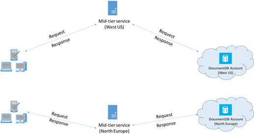

<properties 
    pageTitle="Optimiser les performances DocumentDB | Microsoft Azure" 
    description="Découvrez les options de configuration client pour améliorer les performances de base de données Azure DocumentDB"
    keywords="Comment faire pour améliorer les performances de base de données"
    services="documentdb" 
    authors="mimig1" 
    manager="jhubbard" 
    editor="" 
    documentationCenter=""/>

<tags 
    ms.service="documentdb" 
    ms.workload="data-services" 
    ms.tgt_pltfrm="na" 
    ms.devlang="na" 
    ms.topic="article" 
    ms.date="10/17/2016" 
    ms.author="mimig"/>

# Conseils de performance pour DocumentDB

DocumentDB Azure est une rapide et flexible distribué base de données qui s’adapte en toute transparence avec garantie latence et un débit. Vous n’avez pas à apporter des modifications principales architecture ou écrire du code complexe pour ajuster la taille de votre base de données avec DocumentDB. Mise à l’échelle monter et Descendre est aussi simple qu’un seul appel d’API ou une [méthode SDK appeler](documentdb-performance-levels.md#changing-performance-levels-using-the-net-sdk). Toutefois, étant donné que DocumentDB est accessible via les appels réseau il existe optimisations côté client que vous pouvez apporter à atteindre des performances optimales.

Afin que si vous demandez « comment puis-je améliorer mes performances de base de données ? » Tenez compte des options suivantes :

## Mise en réseau

1. **Stratégie de connexion : utiliser le mode de connexion directe**
    
    Comment un client se connecte à Azure DocumentDB a des implications importantes sur les performances, notamment en termes de latence côté client observée. Il existe deux paramètres de configuration de la clé de configuration client stratégie de connexion – le *mode* de connexion et le [ *protocole*de la connexion](#connection-protocol).  Les deux modes disponibles sont :

    1. Mode de passerelle (par défaut)
    2. Mode direct

    Dans la mesure où DocumentDB est un système de stockage distribué, DocumentDB ressources comme des collections sont répartis sur plusieurs ordinateurs et chaque partition est répliquée de disponibilité. La logique de traduction adresse physique est conservé dans une table de routage, qui est également disponible en interne en tant que ressource.

    En Mode de passerelle, les ordinateurs de passerelle DocumentDB effectuer cette gamme, ce qui permet le code client simple et compact. Une application cliente émet des requêtes pour les ordinateurs de passerelle DocumentDB, laquelle traduire la logique URI dans la demande pour l’adresse physique du nœud principal et les transférer la demande de manière appropriée.  En revanche, en Mode Direct clients doivent mettre à jour – et actualisez régulièrement – une copie de ce tableau routage et puis se connecter directement aux nœuds DocumentDB principaux.

    Mode de passerelle est pris en charge sur toutes les plateformes SDK et est configuré par défaut.  Si votre application est exécutée dans un réseau d’entreprise avec des restrictions de pare-feu strict, Mode passerelle est le meilleur choix car elle utilise le port HTTPS standard et un point de terminaison unique. Le compromis performances, cependant, est que le Mode passerelle implique un saut réseau supplémentaires chaque fois les données sont lues ou écrites dans DocumentDB.   Pour cette raison, le Mode Direct offre de meilleures performances en raison d’un nombre moins élevé sauts de réseau.

2. **Stratégie de connexion : utiliser le protocole TCP**

    Lors de l’exploitation Mode Direct, il existe deux options de protocole disponibles :

    - TCP
    - HTTPS

    DocumentDB offre une simple et ouvrez le modèle de programmation RESTful via HTTPS. En outre, il propose un protocole TCP efficace, qui est également RESTful dans son modèle de communication et n’est accessible via le client .NET SDK. TCP Direct et HTTPS utiliser SSL pour l’authentification initiale et le trafic de chiffrement. Pour de meilleures performances, utilisez le protocole TCP lorsque cela est possible. 

    Lorsque vous utilisez TCP en Mode passerelle, TCP Port 443 est le port DocumentDB et 10250 est le port MongoDB API. Lorsque vous utilisez TCP en Mode Direct, outre les ports de passerelle, vous devez vous assurer le port est compris entre 10000 et 20000 est ouvert, car DocumentDB utilise des ports TCP dynamiques. Si ces ports ne sont pas ouverts et que vous essayez d’utiliser TCP, vous recevrez une erreur 503 Service indisponible. 

    Le Mode de connexion est configuré lors de la construction de l’instance DocumentClient avec le paramètre ConnectionPolicy. Si le Mode Direct est utilisé, le protocole peut également être défini dans le paramètre ConnectionPolicy.

        var serviceEndpoint = new Uri("https://contoso.documents.net");
        var authKey = new "your authKey from Azure Mngt Portal";
        DocumentClient client = new DocumentClient(serviceEndpoint, authKey, 
        new ConnectionPolicy
        {
            ConnectionMode = ConnectionMode.Direct,
            ConnectionProtocol = Protocol.Tcp
        });

    Étant donné que TCP est uniquement prise en charge en Mode Direct, si le Mode passerelle est utilisé, puis le protocole HTTPS est toujours utilisé pour communiquer avec la passerelle et la valeur protocole dans la ConnectionPolicy est ignorée.

    

3. **Appeler OpenAsync pour éviter de latence de démarrage à la première requête**

    Par défaut, la première requête aura une latence plus élevée, car il a récupérer la table de routage adresse. Pour éviter cette latence de démarrage à la première requête, vous devez appeler OpenAsync() une seule fois lors de l’initialisation comme suit.

        await client.OpenAsync();

4. **Colocaliser clients dans la même région Azure pour les performances**

    Si possible, placez toutes les applications appelant DocumentDB dans la même région en tant que la base de données DocumentDB. Pour une comparaison approximative, appels à DocumentDB au sein de la même région se termine dans ms 1 et 2, mais la latence entre les régions Ouest et la côte est des États-Unis est > 50 ms. Cette latence peut varier probablement à partir d’une demande à une demande selon l’itinéraire utilisé par la requête lorsqu’il passe à partir du client à la limite du centre de données Azure. Latence minimale est atteint en garantissant que l’application appelante se trouve dans la même région Azure comme point de terminaison DocumentDB mis en service. Pour une liste des régions disponibles, voir [Régions Azure](https://azure.microsoft.com/regions/#services).

    

5. **Augmenter le nombre de threads/tâches**

    Étant donné que les appels à DocumentDB sont effectuées via le réseau, vous devrez peut-être varier le degré de parallélisme de vos demandes de sorte que l’application cliente passe très peu de temps en attente entre les demandes. Par exemple, si vous utilisez. [Bibliothèque parallèle de tâches](https://msdn.microsoft.com//library/dd460717.aspx), de NET créez dans l’ordre de 100 s des tâches lecture ou en écriture DocumentDB.

## Utilisation du Kit de développement

1. **Installez le Kit de développement plus récente**

    Kits de développement logiciel DocumentDB sont sans cesse améliorées afin d’améliorer les performances. Voir les pages [SDK DocumentDB](documentdb-sdk-dotnet.md) à déterminer le Kit de développement plus récente et réviser des améliorations. 

2. **Utiliser un client DocumentDB singleton pour la durée de vie de votre application**
  
    Notez que chaque instance DocumentClient est thread-safe et effectue la gestion des connexions efficace et la mise en cache adresse lorsqu’il fonctionne en Mode Direct. Pour autoriser la gestion des connexions efficace et améliorer les performances par DocumentClient, il est recommandé d’utiliser une seule instance de DocumentClient par AppDomain pour la durée de vie de l’application.

3. **Augmenter System.Net MaxConnections par hôte**

    Demandes de DocumentDB effectuées sur HTTPS/reste par défaut et sont soumis à la limite de connexion par défaut par nom d’hôte ou l’adresse IP. Vous devrez peut-être définir les MaxConnections sur une valeur supérieure (100-1000) afin que la bibliothèque cliente peut utiliser plusieurs connexions simultanées à DocumentDB. Dans le Kit de développement .NET 1.8.0 et versions ultérieures, la valeur par défaut pour [ServicePointManager.DefaultConnectionLimit](https://msdn.microsoft.com/library/system.net.servicepointmanager.defaultconnectionlimit.aspx) est achevée à 50 et pour modifier la valeur, vous pouvez définir la [Documents.Client.ConnectionPolicy.MaxConnectionLimit](https://msdn.microsoft.com/en-us/library/azure/microsoft.azure.documents.client.connectionpolicy.maxconnectionlimit.aspx) sur une valeur supérieure.  

4. **Optimisation des requêtes en parallèle pour des collections de partitionnées**

     Kit de développement .NET DocumentDB version 1.9.0 et au-dessus de prise en charge des requêtes en parallèle, ce qui vous permettent d’une collection de sites partitionnées en parallèle de la requête (voir les [exemples de code](https://github.com/Azure/azure-documentdb-dotnet/blob/master/samples/code-samples/Queries/Program.cs) connexes pour plus d’informations et [travailler avec les kits de développement](documentdb-partition-data.md#working-with-the-sdks) ). Requêtes en parallèle sont conçues pour améliorer la latence des requêtes et débit sur leur homologue en série. Fournissent des requêtes en parallèle deux paramètres utilisateurs peuvent optimiser pour personnalisée-ajuster leur configuration requise, MaxDegreeOfParallelism (a) : pour contrôler le nombre maximal de partitions que peuvent être interrogées en parallèle, puis MaxBufferedItemCount (b) : pour contrôler le nombre de résultats préalablement extraits. 
    
    (a) ***réglage MaxDegreeOfParallelism\: *** 
    fonctionne de la requête en parallèle par interroger plusieurs partitions en parallèle. Toutefois, les données à partir d’un collecter partitionnée individuel sont extraites en série en ce qui concerne la requête. Par conséquent, affectant la MaxDegreeOfParallelism le nombre de partitions offre la maximale chances d’obtenir la requête performant la plupart des, à condition que toutes les autres conditions système restent les mêmes. Si vous ne connaissez pas le nombre de partitions, vous pouvez définir la MaxDegreeOfParallelism sur une valeur plus élevée, et le système choisit automatiquement au minimum (nombre de partitions, entrée fourni par l’utilisateur) en tant que la MaxDegreeOfParallelism. 
    
    Il est important de noter que des requêtes en parallèle produisent avantages si les données sont réparties uniformément sur toutes les partitions en ce qui concerne la requête. Si la collection partitionnée est répartie de telle sorte que tout ou une majorité des données renvoyées par une requête est concentrée dans plusieurs partitions (une partition dans le pire des cas), puis les performances de la requête seraient congestionnés par ces partitions. 
    
    (b) ***réglage MaxBufferedItemCount\: *** 
    requête en parallèle est conçue pour lire au préalable résultats pendant le traitement du lot en cours des résultats par le client. Permet l’extraction préalable amélioration latence générale d’une requête. MaxBufferedItemCount est le paramètre pour limiter la quantité de résultats préalablement extraits. MaxBufferedItemCount au nombre de résultats attendus (ou un nombre plus élevé) permet à la requête recevoir le meilleur parti d’avant l’extraction. 
    
    Notez qu’avant l’extraction fonctionne de la même manière, quelle que soit la MaxDegreeOfParallelism, et il existe un seul tampon pour les données à partir de toutes les partitions.  

5. **Activer le catalogue global côté serveur**
    
    Réduction de la fréquence de nettoyage peut-être vous aider dans certains cas. Dans .NET, définissez [gcServer](https://msdn.microsoft.com/library/ms229357.aspx) sur true.

6. **Mettre en œuvre intervalle à intervalles RetryAfter**
 
    Pendant le test de performances, vous devez augmenter la charge jusqu'à ce qu’un petit taux de demandes obtenir limité. Si limitée, l’application cliente doit intervalle sur limitation pour l’intervalle de nouvelle tentative spécifiée par le serveur. Dans le respect l’intervalle garantit que vous dépensez minimum de temps à attendre entre les essais. Prise en charge de la stratégie réessayer est inclus dans la Version 1.8.0 et au-dessus du DocumentDB [.NET](documentdb-sdk-dotnet.md) et [Java](documentdb-sdk-java.md)et la version 1.9.0 et au-dessus des [Node.js](documentdb-sdk-node.md) et [Python](documentdb-sdk-python.md). Pour plus d’informations, voir [limites de débit réservé Exceeding](documentdb-request-units.md#exceeding-reserved-throughput-limits) et [RetryAfter](https://msdn.microsoft.com/library/microsoft.azure.documents.documentclientexception.retryafter.aspx).

7. **Adapter la charge de travail de votre client**

    Si vous testez niveaux haut débit (> 50 000 demandeur/s), l’application cliente peut devenir la critique en raison de la limitation des machine arrière sur l’utilisation du processeur ou le réseau. Si vous arrivez à ce stade, vous pouvez continuer à distribuer le compte DocumentDB davantage en faisant évoluer vos applications clientes sur plusieurs serveurs.

8. **Mettre en cache document URI de latence de lecture en bas**

    Mettre en cache document MU dès que possible pour optimiser les performances en lecture.

9. **Ajuster la taille de la page des flux de requêtes/lu pour de meilleures performances**

    Lors de l’exécution d’un bloc de lecture d’un documents à l’aide de lecture flux fonctionnalités (c'est-à-dire, ReadDocumentFeedAsync) ou lorsque vous émettez une requête DocumentDB SQL, les résultats sont retournés de manière segmentée si le jeu de résultats est trop volumineux. Par défaut, les résultats sont retournés sous forme de segments de 100 éléments ou 1 Mo, quelle que soit la limite est d’accès au premier. 

    Pour réduire le nombre de réseau boucles nécessaire pour extraire tous les résultats applicables, vous pouvez augmenter la taille de page à l’aide de l’en-tête x-ms-max--nombre d’éléments demande jusqu'à 1 000. Dans les cas où vous pouvez le n'afficher que quelques résultats, par exemple, si votre API interface ou d’une application utilisateur renvoie uniquement les 10 fois les résultats, vous pouvez également réduire la taille de page à 10 pour réduire le débit consommé pour la lecture et requêtes.

    Vous pouvez également définir la taille de page à l’aide de la SDK DocumentDB disponibles.  Par exemple :
    
        IQueryable<dynamic> authorResults = client.CreateDocumentQuery(documentCollection.SelfLink, "SELECT p.Author FROM Pages p WHERE p.Title = 'About Seattle'", new FeedOptions { MaxItemCount = 1000 });

10. **Augmenter le nombre de threads/tâches**

    Voir [augmenter le nombre de threads/tâches](#increase-threads) dans la zone mise en réseau.

## Politique d’indexation

1. **Utilisation de l’indexation différée pour les taux acquisition de temps plus rapides pointe**

    DocumentDB vous permet de spécifier – au niveau de la collection de sites – une politique d’indexation, qui vous permet de choisir si vous souhaitez que les documents dans une collection de sites à indexer automatiquement ou non.  En outre, vous pouvez également choisir entre synchrone (cohérent) et mises à jour des index asynchrones (lent). Par défaut, l’index est mise à jour synchrone sur chaque insertion, remplacer ou supprimer d’un document à la collection. Mode synchrone permet des requêtes de respecter du même [niveau de cohérence](documentdb-consistency-levels.md) que celui de la lecture document sans délai pour l’index « réaligner » sur.
    
    Indexation lente peut-être être considérées comme pour les scénarios dans lequel les données sont écrites dans Records, et que vous voulez amortissement le travail nécessaire à indexer le contenu sur une longue période de temps. Indexation lente vous permet également d’utiliser votre débit généré efficacement et répondre à des demandes d’écriture aux heures de pointe avec une latence minimale. Il est important de noter, cependant, que lorsque l’indexation différée est activée, résultats de la requête sera finalement cohérentes quel que soit le niveau de cohérence configuré pour le compte DocumentDB.

    Par conséquent, mode indexation cohérent (IndexingPolicy.IndexingMode est défini sur cohérent) entraîne les frais unitaires demande plus élevée par écriture, tout en lent l’indexation en mode (IndexingPolicy.IndexingMode est définie à lent) et aucune indexation (IndexingPolicy.Automatic est définie sur False) avoir zéro coût indexation au moment de l’écriture.

2. **Exclure des chemins inutilisées de l’indexation pour écrit plus rapide**

    Politique d’indexation de DocumentDB vous permet également de spécifier les chemins d’accès de document pour inclure ou exclure de l’indexation en tirant parti des chemins d’accès de l’indexation (IndexingPolicy.IncludedPaths et IndexingPolicy.ExcludedPaths). L’utilisation de l’indexation de chemins peut proposer performances améliorées d’écriture et inférieur stockage d’index pour les scénarios dans lesquels les modèles de requête sont connus à l’avance, comme les coûts d’indexation directement corrélation entre le nombre de chemins d’accès uniques indexées.  Par exemple, le code suivant montre comment exclure (également appelé une section entière de documents une sous-arborescence) à partir de l’indexation à l’aide de la « * » génériques.

        var collection = new DocumentCollection { Id = "excludedPathCollection" };
        collection.IndexingPolicy.IncludedPaths.Add(new IncludedPath { Path = "/*" });
        collection.IndexingPolicy.ExcludedPaths.Add(new ExcludedPath { Path = "/nonIndexedContent/*");
        collection = await client.CreateDocumentCollectionAsync(UriFactory.CreateDatabaseUri("db"), excluded);

    Pour plus d’informations, voir [règles d’indexation DocumentDB](documentdb-indexing-policies.md).

## Débit

1. **Mesurer et optimiser les demande inférieur unités/seconde l’utilisation**

    DocumentDB offre un large éventail d’opérations de base de données, y compris les requêtes relationnelles et hiérarchiques avec UDF, des procédures stockées et des déclencheurs – fonctionnement sur les documents dans une collection de base de données. Le coût associé à chacune de ces opérations dépend de l’UC, IO et la mémoire nécessaire pour terminer l’opération. Au lieu de penser et la gestion des ressources matérielles, vous pouvez considérer comme une seule mesure pour les ressources nécessaires pour effectuer diverses opérations de base de données et une demande d’application de service d’une unité de demande (demandeur).

    [Demander l’intensité d’utilisation](documentdb-request-units.md) sont mis en service pour chaque compte de base de données en fonction du nombre d’unités de capacité que vous achetez. Demande de consommation d’unités est évaluée comme un taux par seconde. Applications qui dépassent le taux d’unité demande généré pour leur propre compte est limitée jusqu'à ce que le taux passe en dessous du niveau réservé pour le compte. Si votre application requiert un niveau plus élevé de débit, vous pouvez acheter des unités de capacité supplémentaire.

    La complexité d’une requête a une incidence sur le nombre d’unités demander sont utilisé pour une opération. Le nombre de prédicats, nature des prédicats, nombre d’UDF et la taille de l’ensemble de données sources tous les influencer le coût des opérations de requête.

    Mesurer la charge de toutes les opérations (créer, mettre à jour ou supprimer), vérifiez que l’en-tête x-ms-demande-frais (ou la propriété RequestCharge équivalente dans ResourceResponse<T> ou FeedResponse<T> dans le Kit de développement .NET) de mesurer le nombre d’unités demande consommées par ces opérations.

        // Measure the performance (request units) of writes
        ResourceResponse<Document> response = await client.CreateDocumentAsync(collectionSelfLink, myDocument);
        Console.WriteLine("Insert of document consumed {0} request units", response.RequestCharge);
        // Measure the performance (request units) of queries
        IDocumentQuery<dynamic> queryable = client.CreateDocumentQuery(collectionSelfLink, queryString).AsDocumentQuery();
        while (queryable.HasMoreResults)
             {
                  FeedResponse<dynamic> queryResponse = await queryable.ExecuteNextAsync<dynamic>();
                  Console.WriteLine("Query batch consumed {0} request units", queryResponse.RequestCharge);
             }
        
    Les frais de demande renvoyés dans cet en-tête sont une fraction de votre débit généré (c'est-à-dire, 2000 RUs / seconde). Par exemple, si la requête ci-dessus renvoie 1000 1 Ko documents, le coût de l’opération sera 1000. Dès lors, au sein d’une seconde, le serveur respecte les deux uniquement ces demandes avant la limitation les demandes suivantes. Pour plus d’informations, voir la [Calculatrice des unités de demande](https://www.documentdb.com/capacityplanner)et les [unités de la demande](documentdb-request-units.md) .

2. **Poignée de limitation/demande taux est trop volumineux**

    Lorsqu’un client tente de dépasser le débit réservé pour un compte, il existe aucune dégradation des performances au niveau du serveur et sans utiliser de capacité de débit au-delà du niveau réservé. Le serveur manière préemptive mettre fin à la demande avec RequestRateTooLarge (code d’état HTTP 429) et renvoyer l’en-tête x réessayer ms après ms indiquant le nombre d’heures, en millisecondes, que l’utilisateur doit attendre avant de réessayer la demande.
 
        HTTP Status 429,
        Status Line: RequestRateTooLarge
        x-ms-retry-after-ms :100

    Kits de développement logiciel toutes implicitement intercepter cette réponse, respectent l’en-tête après réessayer spécifiée par le serveur, puis relancent la requête. À moins que votre compte est effectué simultanément par plusieurs clients, le prochain essai réussit.

    Si vous avez plusieurs clients cumulative d’exploitation manière cohérente à travers le taux de la demande, le nombre de tentatives par défaut actuellement défini à 9 en interne par le client peut s’avérer suffisante pas ; Dans ce cas, le client lève une DocumentClientException avec le code d’état 429 à l’application. Le nombre de tentatives par défaut peut être modifié en définissant les RetryOptions sur l’instance ConnectionPolicy. Par défaut, la DocumentClientException avec le code d’état 429 est renvoyée après un délai d’attente cumulé de 30 secondes si la demande continue de fonctionner au-dessus du taux de requête. Cela produit même lorsque le nombre de tentatives est inférieur à ce nombre de tentatives max, qu’il s’agisse de la valeur par défaut de 9 ou une valeur définie par l’utilisateur.

    Alors que le comportement de nouvelle tentative automatique permet d’améliorer la résilience et facilité d’utilisation pour la plupart des applications, il se poser opposée lorsque vous effectuez comparatif des performances, particulièrement quand mesurer la latence.  La latence observée client sera pic si l’expérience atteint la limite de serveur et provoque le Kit de développement logiciel tentative silencieusement du client. Pour éviter les pointes de latence lors des expériences de performances, mesurer les frais renvoyées par chaque opération et s’assurer que les demandes sont fonctionne sous le taux de requêtes réservés. Pour plus d’informations, voir [demander l’intensité d’utilisation](documentdb-request-units.md).
   
3. **Conception pour les documents plus petits pour un débit plus élevé**

    Les frais de demande (c'est-à-dire traitement des demandes de coût) d’une opération donnée sont directement liée à la taille du document. Opérations sur les documents volumineux coûtent supérieur opérations pour les documents de petite taille.

## Niveaux de cohérence

1. **Utiliser les plus faibles niveaux de cohérence pour une meilleure latence de lecture**

    Un autre facteur important de prendre en compte lors de l’optimisation des performances des applications DocumentDB est le niveau de cohérence. Le choix du niveau de cohérence a répercussions sur les performances de lecture et d’écriture. Vous pouvez configurer le niveau de cohérence par défaut sur le compte de base de données et le niveau de cohérence choisie puis s’applique à toutes les collections (pour toutes les bases de données) dans le compte DocumentDB. En ce qui concerne les opérations d’écriture, l’impact du changement de niveau de cohérence peut être observé en tant que latence demande. Niveaux de cohérence renforcées sont utilisés, écriture latence augmente. En revanche, l’impact du niveau de cohérence sur les opérations de lecture peut être observé en termes de débit. Cohérence plus faible niveaux autoriser supérieurs lire débit réalisation par le client.

    Par défaut, toutes les lectures et les requêtes exécutées sur les ressources définies par l’utilisateur utilise le niveau de cohérence par défaut spécifié sur le compte de base de données. Vous pouvez, cependant, diminuer le niveau de cohérence d’une requête spécifique en lecture/requête en spécifiant l’en-tête x-ms--niveau de cohérence demande. Pour plus d’informations, voir [niveaux de cohérence dans DocumentDB](documentdb-consistency-levels.md).

## Étapes suivantes

Pour un exemple d’application permet d’évaluer DocumentDB pour les scénarios High performance sur plusieurs ordinateurs clients, consultez [performances et échelle réalisés avec Azure DocumentDB](documentdb-performance-testing.md).

Pour plus d’informations sur la conception de votre application pour les performances et échelle, consultez également [partitionnement et la même échelle dans Azure DocumentDB](documentdb-partition-data.md).
