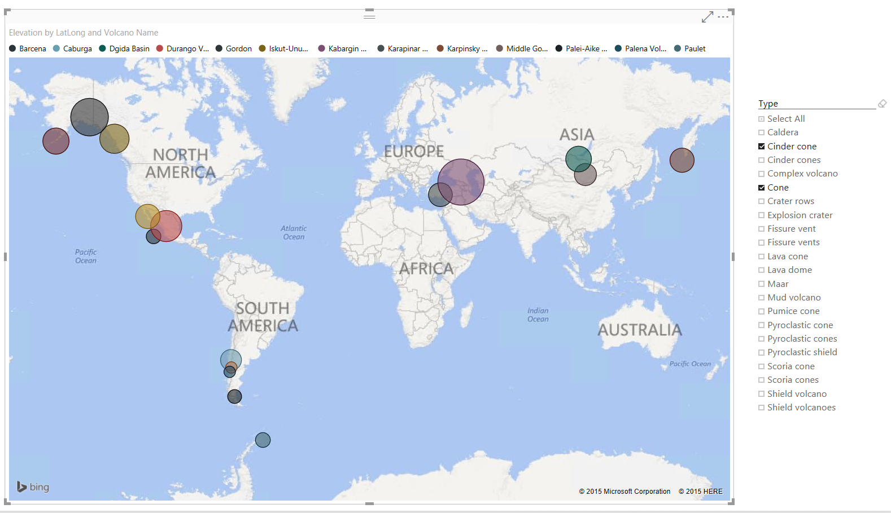
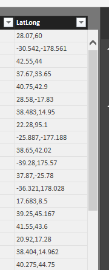
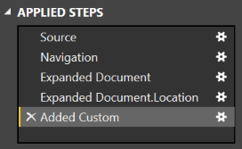
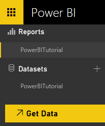
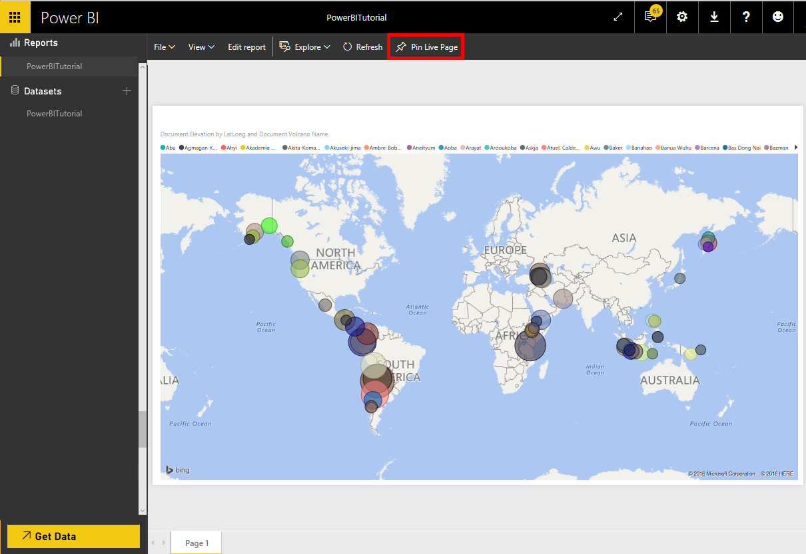

<properties
    pageTitle="Didacticiel de BI Power pour connecteur DocumentDB | Microsoft Azure"
    description="Utilisez ce didacticiel Power BI pour importer JSON, créer des rapports génèrent et visualiser des données à l’aide du connecteur DocumentDB et Power BI."
    keywords="Power bi didacticiel, visualiser des données, connecteur bi power"
    services="documentdb"
    authors="h0n"
    manager="jhubbard"
    editor="mimig"
    documentationCenter=""/>

<tags
    ms.service="documentdb"
    ms.workload="data-services"
    ms.tgt_pltfrm="na"
    ms.devlang="na"
    ms.topic="article"
    ms.date="09/22/2016"
    ms.author="hawong"/>

# Didacticiel de BI Power pour DocumentDB : visualiser des données à l’aide du connecteur Power BI

[PowerBI.com](https://powerbi.microsoft.com/) est un service en ligne où vous pouvez créer et partager des rapports et tableaux de bord avec les données importantes pour vous et votre organisation.  Power BI Desktop est un outil qui vous permet d’extraire des données à partir de diverses sources de données, fusionner et transformer les données, créer des rapports et visualisations et les publier sur Power BI de création de rapports dédié.  Avec la dernière version de Power BI Desktop, vous pouvez désormais être connecté à votre compte DocumentDB via le connecteur DocumentDB à Power BI.   

Dans ce didacticiel Power BI, nous les différentes étapes pour vous connecter à un compte DocumentDB dans Power BI Desktop, accédez à une collection de sites dans laquelle nous voulons pour extraire les données à l’aide du navigateur, transformer les données JSON sous forme de tableau à l’aide de Power BI éditeur de requête du bureau et créer et publier un rapport sur PowerBI.com.

Au terme de ce didacticiel Power BI, vous pourrez répondre aux questions suivantes :  

-   Comment puis-je créer des rapports avec des données à partir de DocumentDB à l’aide de Power BI Desktop ?
-   Comment puis-je me connecter à un compte DocumentDB dans Power BI Desktop ?
-   Comment puis-je récupérer les données à partir d’une collection de sites dans Power BI Desktop ?
-   Comment puis-je transformer les données JSON imbriquées dans Power BI Desktop ?
-   Comment puis-je publier et partager mes rapports dans PowerBI.com ?

## Conditions préalables

Avant de suivre les instructions dans ce didacticiel Power BI, assurez-vous que vous avez les éléments suivants :

- [La dernière version de Power BI Desktop](https://powerbi.microsoft.com/desktop).
- Accès à notre démo compte ou des données dans votre compte Azure DocumentDB.
    - Le compte de démonstration est rempli avec les données îles affichées dans ce didacticiel. Ce compte démo n’est pas lié par n’importe quel SLA et est destiné uniquement à des fins de démonstration.  Nous réserve le droit d’apporter des modifications à ce compte démo, y compris mais non limitée aux se terminant le compte, en modifiant la clé, restriction d’accès, modifier et supprimer les données, à tout moment sans préavis ni motif.
        - URL : https://analytics.documents.azure.com
        - Clé en lecture seule : MSr6kt7Gn0YRQbjd6RbTnTt7VHc5ohaAFu7osF0HdyQmfR + YhwCH2D2jcczVIR1LNK3nMPNBD31losN7lQ/fkw ==
    - Ou, pour créer votre propre compte, voir [créer un compte de base de données DocumentDB à l’aide du portail Azure](https://azure.microsoft.com/documentation/articles/documentdb-create-account/). Ensuite, pour obtenir îles exemple données similaire à ce qui sont utilisées dans ce didacticiel (mais ne contient pas les blocs GeoJSON), consultez le [site NOAA](https://www.ngdc.noaa.gov/nndc/struts/form?t=102557&s=5&d=5) et puis importer les données à l’aide de l' [outil de migration de données DocumentDB](https://azure.microsoft.com/documentation/articles/documentdb-import-data/).

Pour partager vos rapports dans PowerBI.com, vous devez disposer d’un compte dans PowerBI.com.  Pour en savoir plus sur Power BI pour Power BI Pro et gratuit, visitez le site [https://powerbi.microsoft.com/pricing](https://powerbi.microsoft.com/pricing).

## Prise en main
Dans ce didacticiel, imaginons que vous êtes un geologist étude des tableaux dans le monde entier.  Les données îles sont stockées dans un compte DocumentDB et les documents JSON ressemblent à celui qui suit.

    {
        "Volcano Name": "Rainier",
        "Country": "United States",
        "Region": "US-Washington",
        "Location": {
            "type": "Point",
            "coordinates": [
            -121.758,
            46.87
            ]
        },
        "Elevation": 4392,
        "Type": "Stratovolcano",
        "Status": "Dendrochronology",
        "Last Known Eruption": "Last known eruption from 1800-1899, inclusive"
    }

Vous voulez extraire les données îles à partir du compte DocumentDB et visualiser des données dans un rapport Power BI interactif comme celui ci-dessous.

Êtes-vous prêt à faire un essai ? Prise en main.

1. Exécutez Power BI Desktop sur votre poste de travail.
2. Une fois que Power BI Desktop est lancé, un écran *d’accueil* s’affiche.

    

3. Vous pouvez **Obtenir des données**, voir **Sources récentes**ou **Ouvrir un autre état** directement à partir de l’écran *d’accueil* .  Cliquez sur le X dans le coin supérieur droit pour fermer l’écran. L’affichage **rapport** de Power BI Desktop s’affiche.

    

4. Sélectionnez le ruban **accueil** , puis cliquez sur **Obtenir des données**.  La fenêtre **Obtenir des données** s’affiche.

5. Cliquez sur **Azure**, sélectionnez **Microsoft Azure DocumentDB (version bêta)**, puis cliquez sur **se connecter**.  La fenêtre **Microsoft Azure DocumentDB Connect** doit apparaître.

    

6. Spécifiez l’URL de point de terminaison de compte DocumentDB vous voulez extraire des données comme indiqué ci-dessous, puis cliquez sur **OK**. Vous pouvez obtenir l’URL de la zone URI dans la carte de **[clés](documentdb-manage-account.md#keys)** du portail Azure ou vous pouvez utiliser le compte démo, auquel cas l’URL est `https://analytics.documents.azure.com`. 

    Laissez le nom de la base de données, le nom de la collection de sites et l’instruction SQL vide car ces champs sont facultatifs.  À la place, nous allons utiliser le navigateur pour sélectionner la base de données et la collection de sites pour identifier d'où proviennent les données.

    

7. Si vous vous connectez à ce point de terminaison pour la première fois, vous devra pour la clé de compte.  Vous pouvez récupérer la clé dans la zone **Clé primaire** dans la carte de **[clés en lecture seule](documentdb-manage-account.md#keys)** du portail Azure, ou vous pouvez utiliser le compte démo, auquel cas la clé est `RcEBrRI2xVnlWheejXncHId6QRcKdCGQSW6uSUEgroYBWVnujW3YWvgiG2ePZ0P0TppsrMgscoxsO7cf6mOpcA==`. Entrez la clé de compte, puis cliquez sur **se connecter**.

    Nous vous recommandons d’utiliser la touche en lecture seule lors de la création de rapports.  Cela empêche l’exposition inutile de la clé principale à potentiellement dangereux. La touche en lecture seule est disponible à partir de la carte de [clés](documentdb-manage-account.md#keys) du portail Azure ou vous pouvez utiliser les informations de compte démo fournies ci-dessus.

    

8. Lorsque le compte est correctement connecté, le **navigateur** s’affiche.  Le **navigateur** affiche une liste des bases de données sous le compte.
9. Cliquez sur, puis développez sur la base de données dans lequel les données du rapport proviendra, si vous utilisez le compte démo, sélectionnez **volcanodb**.   

10. À présent, sélectionnez une collection de sites qui vous récupère les données à partir de. Si vous utilisez le compte démo, sélectionnez **volcano1**.

    Le volet de visualisation affiche une liste d’éléments de **l’enregistrement** .  Un Document est représenté par un type **d’enregistrement** dans Power BI. De même, un bloc JSON imbriqué à l’intérieur d’un document est également un **enregistrement**.

    

11. Cliquez sur **Modifier** pour lancer l’éditeur de requête afin que nous puissions transformer les données.

## Mise à plat et transformer les documents JSON
1. Dans l’éditeur de requête Power BI, vous devriez voir une colonne de **Document** dans le volet central.

2. Cliquez sur le développeur sur le côté droit de l’en-tête de colonne de **Document** .  Le menu contextuel contenant la liste des champs s’affichent.  Sélectionnez les champs que vous avez besoin pour votre rapport, par exemple, nom îles, pays, région, emplacement, élévation, Type, état et dernière savoir création, puis sur **OK**.

    

3. Le volet central affiche un aperçu du résultat avec les champs sélectionnés.

    

4. Dans notre exemple, la propriété emplacement est un bloc GeoJSON dans un document.  Comme vous pouvez le voir, emplacement est représenté par un type **d’enregistrement** dans Power BI Desktop.  
5. Cliquez sur le développeur sur le côté droit de l’en-tête de colonne emplacement.  Le menu contextuel avec les champs type et coordonnées s’affichent.  Nous allons, sélectionnez le champ coordonnées et cliquez sur **OK**.

    

6. Le volet central affiche maintenant une colonne de coordonnées de type de **liste** .  Comme indiqué au début de ce didacticiel, les données GeoJSON dans ce didacticiel sont de type Point avec les valeurs de Latitude et Longitude enregistrées dans le tableau de coordonnées.

    L’élément de coordonnées [0] représente Longitude tandis que coordonnées [1] représente Latitude.
    

7. Pour fusionner la matrice coordonnées, nous allons créer une **Colonne personnalisée** appelée LatLong.  Sélectionnez le ruban **d’Ajouter une colonne** , cliquez sur **Ajouter une colonne personnalisée**.  La fenêtre **Ajouter une colonne personnalisée** doit apparaître.

8. Indiquez un nom pour la nouvelle colonne, par exemple, LatLong.

9. Ensuite, spécifiez la formule personnalisée pour la nouvelle colonne.  Dans notre exemple, nous concatène les valeurs de Latitude et Longitude séparées par une virgule, comme indiqué ci-dessous à l’aide de la formule suivante : `Text.From([Document.Location.coordinates]{1})&","&Text.From([Document.Location.coordinates]{0})`. Cliquez sur **OK**.

    Pour plus d’informations sur les Expressions DAX (Data Analysis), y compris les fonctions DAX, visitez [Base DAX dans Power BI Desktop](https://support.powerbi.com/knowledgebase/articles/554619-dax-basics-in-power-bi-desktop).

    

10. À présent, le volet central affiche la nouvelle colonne LatLong remplie avec les valeurs de Latitude et Longitude séparées par une virgule.

    

    Si vous recevez un message d’erreur dans la nouvelle colonne, vérifiez que les étapes appliquées sous paramètres d’une requête correspond à l’illustration suivante :

    

    Si les étapes sont différents, supprimez les étapes supplémentaires et essayez d’ajouter à nouveau la colonne personnalisée. 

11. Nous avons terminé mise à plat les données au format tabulaire.  Vous pouvez tirer parti de toutes les fonctionnalités disponibles dans l’éditeur de requête à forme et transformer des données dans DocumentDB.  Si vous utilisez l’échantillon, modifier le type de données d’élévation au **nombre entier** en modifiant le **Type de données** dans le ruban **famille** .

    

12. Cliquez sur **Fermer et appliquer** pour enregistrer le modèle de données.

    

## Créer les rapports
Power BI Desktop rapport view est l’endroit où vous pouvez commencer la création de rapports pour visualiser des données.  Vous pouvez créer des rapports en les faisant glisser les champs dans la zone de dessin du **rapport** .

Dans l’affichage rapport, vous devriez trouver :

 1. Le volet **champs** , il s’agit de l’endroit où vous verrez une liste de modèles de données avec les champs que vous pouvez utiliser pour vos rapports.

 2. Le volet de **visualisation** . Un rapport peut contenir un ou plusieurs visualisations.  Choisissez les types visual ajustement vos besoins à partir du volet de **visualisation** .

 3. La zone de **rapport** , il s’agit de l’endroit où vous allez créer les effets visuels de votre rapport.

 4. La page de **rapport** . Vous pouvez ajouter plusieurs pages du rapport dans Power BI Desktop.

La figure suivante montre les principales étapes de création d’un rapport d’affichage carte interactif simple.

1. Dans notre exemple, nous allons créer un affichage de carte montrant l’emplacement de chaque îles.  Dans le volet de **visualisations** , cliquez sur le type de visual carte en surbrillance dans la capture d’écran ci-dessus.  Vous devriez voir du type visuels de mappage de peinture dans la zone de dessin du **rapport** .  Le volet de **visualisation** doit également afficher un ensemble de propriétés associées au type visual carte.

2. À présent, glisser-déplacer le champ LatLong à partir du volet **champs** dans la propriété **emplacement** dans le volet de **visualisation** .
3. Ensuite, faites glisser et déposez le champ nom îles la propriété **légende** .  

4. Puis, faites glisser et déposez le champ élévation à la propriété **taille** .  

5. Normalement, le mappage visuel affichant un ensemble de bulles indiquant l’emplacement de chaque îles avec la taille de la bulle corrélation à l’élévation de l’îles.

6. Vous avez maintenant créé un rapport de base.  Vous pouvez personnaliser davantage le rapport en ajoutant davantage de visualisations.  Dans notre exemple, nous avons ajouté un segment îles Type pour que le rapport interactive.  

    

## Publier et partager votre rapport
Pour partager votre rapport, vous devez disposer d’un compte dans PowerBI.com.

1. Dans Power BI Desktop, cliquez sur le ruban **famille** .
2. Cliquez sur **Publier**.  Vous devrez entrer le nom d’utilisateur et mot de passe pour votre compte PowerBI.com.
3. Une fois que les informations d’identification a été authentifiée, le rapport est publié sur votre destination que vous avez sélectionné.
4. Cliquez sur **Ouvrir 'PowerBITutorial.pbix' dans Power BI** pour afficher et partager votre rapport sur PowerBI.com.

    

## Créer un tableau de bord dans PowerBI.com

Maintenant que vous avez un rapport, vous permet de partager sur PowerBI.com

Lorsque vous publiez votre rapport à partir de Power BI Desktop pour PowerBI.com, il génère un **rapport** et un **jeu de données** dans votre client PowerBI.com. Par exemple, une fois que vous avez publié un rapport nommé **PowerBITutorial** à PowerBI.com, vous verrez PowerBITutorial dans les **rapports** et les **jeux de données** sections sur PowerBI.com.

   

Pour créer un tableau de bord qui peut être partagé, cliquez sur le bouton **Code confidentiel Live Page** dans votre rapport PowerBI.com.

   

Suivez ensuite les instructions de [code confidentiel une vignette à partir d’un rapport](https://powerbi.microsoft.com/documentation/powerbi-service-pin-a-tile-to-a-dashboard-from-a-report/#pin-a-tile-from-a-report) pour créer un tableau de bord. 

Vous pouvez également effectuer des modifications ad hoc au rapport avant de créer un tableau de bord. Toutefois, il est recommandé d’utiliser Power BI Desktop pour effectuer les modifications et republier le rapport à PowerBI.com.

## Actualiser les données dans PowerBI.com

Il existe deux manières d’actualiser les données, ad hoc et planifiées.

Pour une actualisation ad hoc, cliquez simplement sur eclipses (...) par le **jeu de données**, par exemple, PowerBITutorial. Vous devez voir une liste d’actions, y compris **Actualiser maintenant**. Cliquez sur **Actualiser maintenant** pour actualiser les données.

Pour l’actualisation planifiée, procédez comme suit.

1. Dans la liste des actions, cliquez sur **Planifier l’actualisation** . 
    

2. Dans la page **paramètres** , développez **les informations d’identification de source de données**. 

3. Cliquez sur **Modifier les informations d’identification**. 

    La fenêtre contextuelle configurer s’affiche. 

4. Entrez la clé pour vous connecter au compte DocumentDB pour cet ensemble de données, puis cliquez sur **se connecter**. 

5. Développez **Planifier l’actualisation** et configurer la planification que vous voulez actualiser le dataset. 
  
6. Cliquez sur **Appliquer** et que vous avez terminé la configuration de l’actualisation planifiée.

## Étapes suivantes
- Pour en savoir plus sur Power BI, voir [prise en main Power BI](https://powerbi.microsoft.com/documentation/powerbi-service-get-started/).
- Pour en savoir plus sur DocumentDB, consultez la [documentation DocumentDB page d’accueil](https://azure.microsoft.com/documentation/services/documentdb/).
