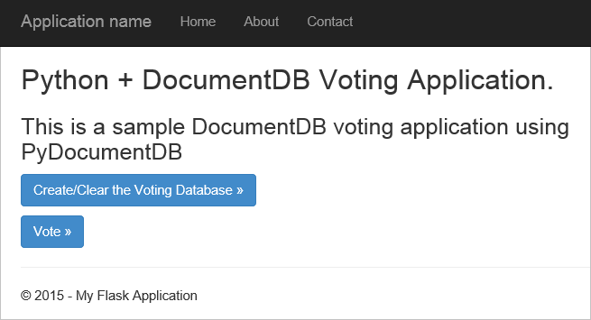
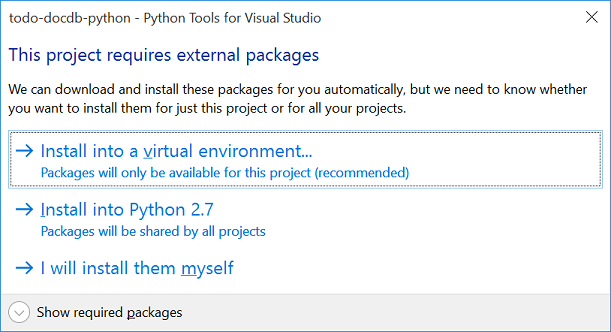
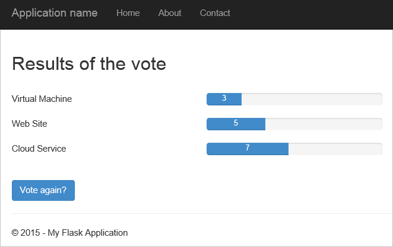
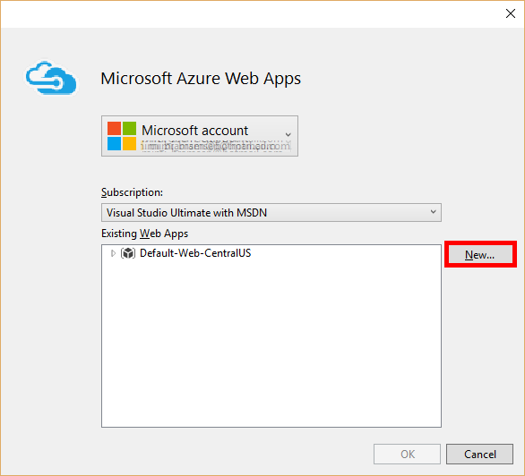

<properties
    pageTitle="Développement d’applications Web Python ballon avec DocumentDB | Microsoft Azure"
    description="Passez en revue un didacticiel de base de données sur l’utilisation de DocumentDB pour stocker et accéder aux données d’une application web Python ballon hébergée sur Azure. Trouvez des solutions de développement d’applications." 
    keywords="Développement d’applications, didacticiel de base de données, ballon python, application web python, développement web python, documentdb, azure, Microsoft azure"
    services="documentdb"
    documentationCenter="python"
    authors="syamkmsft"
    manager="jhubbard"
    editor="cgronlun"/>

<tags
    ms.service="documentdb"
    ms.workload="data-management"
    ms.tgt_pltfrm="na"
    ms.devlang="python"
    ms.topic="hero-article"
    ms.date="08/25/2016"
    ms.author="syamk"/>

# <a name="python-flask-web-application-development-with-documentdb"></a>Développement d’applications Web Python ballon avec DocumentDB

> [AZURE.SELECTOR]
- [.NET](documentdb-dotnet-application.md)
- [Node.js](documentdb-nodejs-application.md)
- [Java](documentdb-java-application.md)
- [Python](documentdb-python-application.md)

Ce didacticiel vous montre comment utiliser DocumentDB Azure pour stocker et accéder aux données à partir d’un Python web application hébergée sur Azure et suppose que vous avez certaines expérience antérieure à l’aide de Python et sites Web Azure.

Ce didacticiel de base de données couvre :

1. Création et la mise en service d’un compte DocumentDB.
2. Création d’une application MVC Python.
3. Connexion à et l’utilisation d’Azure DocumentDB à partir de votre application web.
4. Déploiement de l’application web à des sites Web Azure.

En suivant ce didacticiel, vous allez générer une application de vote simple qui vous permet de voter pour un sondage.




## <a name="database-tutorial-prerequisites"></a>Conditions préalables pour les didacticiels de base de données

Avant de suivre les instructions fournies dans cet article, vous devez vous assurer que vous avez les éléments suivants :

- Un compte Azure actif. Si vous n’avez pas un compte, vous pouvez créer un compte d’évaluation gratuit en quelques minutes. Pour plus d’informations, voir [Azure la version d’évaluation gratuite](https://azure.microsoft.com/pricing/free-trial/).
- [Visual Studio 2013](http://www.visualstudio.com/) ou une version ultérieure, ou [Visual Studio Express](), qui est la version gratuite. Les instructions présentées dans ce didacticiel sont créées spécialement pour Visual Studio 2015. 
- Python Tools pour Visual Studio à partir de [GitHub](http://microsoft.github.io/PTVS/). Ce didacticiel utilise Python outils VS 2015. 
- Azure SDK Python pour Visual Studio, version 2,4 ou une version ultérieure disponible à partir de [azure.com](https://azure.microsoft.com/downloads/). Nous avons utilisé le Kit de développement Microsoft Azure pour Python 2.7.
- Python 2.7 à partir de [python.org][2]. Nous avons utilisé Python 2.7.11. 

> [AZURE.IMPORTANT] Si vous installez 2.7 Python pour la première fois, veillez à que dans l’écran Personnaliser Python 2.7.11, sélectionner **Ajouter python.exe au chemin d’accès**.
> 
>    

- Microsoft Visual C++ compilateur pour Python 2.7 à partir du [Centre de téléchargement Microsoft][3].

## <a name="step-1-create-a-documentdb-database-account"></a>Étape 1 : Créer un compte de base de données DocumentDB

Nous allons commencer par créer un compte DocumentDB. Si vous possédez déjà un compte, vous pouvez passer à [étape 2 : créer une nouvelle application web ballon Python](#step-2:-create-a-new-python-flask-web-application).

[AZURE.INCLUDE [documentdb-create-dbaccount](../../includes/documentdb-create-dbaccount.md)]

<br/>
Nous allons maintenant découvrir comment créer une application web Python ballon notions fondamentales sur vers le haut.

## <a name="step-2-create-a-new-python-flask-web-application"></a>Étape 2 : Créer une nouvelle application web Python ballon

1. Dans Visual Studio, dans le menu **fichier** , pointez sur **Nouveau**, puis cliquez sur **projet**.

    La boîte de dialogue **Nouveau projet** s’affiche.

2. Dans le volet gauche, développez **modèles** , puis **Python**, puis cliquez sur **Web**. 

3. Sélectionnez **Ballon Web projet** dans le volet central, puis dans le **nom** boîte type **didacticiel**, puis sur **OK**. N’oubliez pas que les noms de package Python doivent être en minuscules l’ensemble, comme décrit dans le [Guide de Style pour le Code Python](https://www.python.org/dev/peps/pep-0008/#package-and-module-names).

    Pour les nouveaux ballon Python, il s’agit d’une infrastructure de développement d’application web qui vous permet de créer des applications web dans Python plus rapidement.

    

4. Dans la fenêtre **Python Tools pour Visual Studio** , cliquez sur **installer dans un environnement virtuel**. 

    

5. Dans la fenêtre **Ajouter un environnement virtuel** , vous pouvez accepter les paramètres par défaut et utiliser Python 2.7 comme environnement de base, car PyDocumentDB ne prend pas en charge les Python 3.x, puis cliquez sur **créer**. Il définit l’environnement virtuel Python requis pour votre projet.

    

    Affiche la fenêtre de sortie `Successfully installed Flask-0.10.1 Jinja2-2.8 MarkupSafe-0.23 Werkzeug-0.11.5 itsdangerous-0.24 'requirements.txt' was installed successfully.` lorsque l’environnement est correctement installé.

## <a name="step-3-modify-the-python-flask-web-application"></a>Étape 3 : Modifier l’application web Python ballon

### <a name="add-the-python-flask-packages-to-your-project"></a>Ajouter les packages Python ballon à votre projet

Une fois que votre projet est configuré, vous devez ajouter les packages ballon requis à votre projet, y compris pydocumentdb, le package Python pour DocumentDB.

1. Dans l’Explorateur de solutions, ouvrez le fichier nommé **requirements.txt** et remplacez le contenu avec les éléments suivants :

        flask==0.9
        flask-mail==0.7.6
        sqlalchemy==0.7.9
        flask-sqlalchemy==0.16
        sqlalchemy-migrate==0.7.2
        flask-whooshalchemy==0.55a
        flask-wtf==0.8.4
        pytz==2013b
        flask-babel==0.8
        flup
        pydocumentdb>=1.0.0

2. Enregistrez le fichier **requirements.txt** . 
3. Dans l’Explorateur, avec le bouton droit **environnement** et cliquez sur **installer à partir de requirements.txt**.

    

    Après l’installation réussie, la fenêtre de sortie affiche les éléments suivants :

        Successfully installed Babel-2.3.2 Tempita-0.5.2 WTForms-2.1 Whoosh-2.7.4 blinker-1.4 decorator-4.0.9 flask-0.9 flask-babel-0.8 flask-mail-0.7.6 flask-sqlalchemy-0.16 flask-whooshalchemy-0.55a0 flask-wtf-0.8.4 flup-1.0.2 pydocumentdb-1.6.1 pytz-2013b0 speaklater-1.3 sqlalchemy-0.7.9 sqlalchemy-migrate-0.7.2

    > [AZURE.NOTE] Rarement, vous pouvez voir un échec dans la fenêtre de sortie. Dans ce cas, vérifiez si l’erreur est liée à nettoyage de disque. Parfois, le nettoyage échoue, mais l’installation sera toujours réussie (défilement vers le haut dans la fenêtre de sortie à vérifier ceci). Vous pouvez vérifier votre installation en [vérifiant l’environnement virtuel](#verify-the-virtual-environment). Si l’installation a échoué, mais la vérification terminée, il est OK pour continuer.

### <a name="verify-the-virtual-environment"></a>Vérification de l’environnement virtuel

Nous allons Vérifiez que tout est installé correctement.

1. Générez la solution en appuyant sur **Ctrl**+**MAJ**+**B**.
2. Une fois la génération réussit, démarrez le site Web en appuyant sur **F5**. Cela lance le serveur de développement ballon et démarre votre navigateur web. Vous devez voir la page suivante.

    

3. Arrêter le débogage du site Web en appuyant sur **MAJ**+**F5** dans Visual Studio.

### <a name="create-database-collection-and-document-definitions"></a>Créer des définitions de document de base de données et collection de sites

Maintenant créer votre application vote en ajoutant des nouveaux fichiers de mise à jour d’autres personnes.

1. Dans l’Explorateur, droit sur le projet **didacticiel** , cliquez sur **Ajouter**, puis cliquez sur **Nouvel élément**. Sélectionnez **Fichier Python vide** et nommez le fichier **forms.py**.  
2. Ajoutez le code suivant dans le fichier forms.py et enregistrer le fichier.

```python
from flask.ext.wtf import Form
from wtforms import RadioField

class VoteForm(Form):
    deploy_preference  = RadioField('Deployment Preference', choices=[
        ('Web Site', 'Web Site'),
        ('Cloud Service', 'Cloud Service'),
        ('Virtual Machine', 'Virtual Machine')], default='Web Site')
```


### <a name="add-the-required-imports-to-viewspy"></a>Ajouter les importations requises à views.py

1. Dans l’Explorateur de solutions, développez le dossier **didacticiel** et ouvrez le fichier **views.py** . 
2. Ajoutez les éléments suivants importer les instructions dans la partie supérieure du fichier **views.py** , puis sur enregistrement le fichier. Importer les PythonSDK de DocumentDB et les packages ballon.

    ```python
    from forms import VoteForm
    import config
    import pydocumentdb.document_client as document_client
    ```


### <a name="create-database-collection-and-document"></a>Créer une base de données, de collection de sites et de document

- Toujours dans **views.py**, ajoutez le code suivant à la fin du fichier. Cette méthode s’occupe de la création de la base de données utilisée par le formulaire. Ne supprimez pas le code existant dans **views.py**. Simplement l’ajouter à la fin.

```python
@app.route('/create')
def create():
    """Renders the contact page."""
    client = document_client.DocumentClient(config.DOCUMENTDB_HOST, {'masterKey': config.DOCUMENTDB_KEY})

    # Attempt to delete the database.  This allows this to be used to recreate as well as create
    try:
        db = next((data for data in client.ReadDatabases() if data['id'] == config.DOCUMENTDB_DATABASE))
        client.DeleteDatabase(db['_self'])
    except:
        pass

    # Create database
    db = client.CreateDatabase({ 'id': config.DOCUMENTDB_DATABASE })

    # Create collection
    collection = client.CreateCollection(db['_self'],{ 'id': config.DOCUMENTDB_COLLECTION })

    # Create document
    document = client.CreateDocument(collection['_self'],
        { 'id': config.DOCUMENTDB_DOCUMENT,
          'Web Site': 0,
          'Cloud Service': 0,
          'Virtual Machine': 0,
          'name': config.DOCUMENTDB_DOCUMENT 
        })

    return render_template(
       'create.html',
        title='Create Page',
        year=datetime.now().year,
        message='You just created a new database, collection, and document.  Your old votes have been deleted')
```

> [AZURE.TIP] La méthode **CreateCollection** prend une facultatif **RequestOptions** comme troisième paramètre. Cela peut servir à spécifier le Type de proposer pour la collection de sites. Si aucune valeur offerType est fournie, puis la collection de sites est créée à l’aide de la valeur par défaut offrent Type. Pour plus d’informations sur les Types de proposer DocumentDB, voir [niveaux de performances dans DocumentDB](documentdb-performance-levels.md).


### <a name="read-database-collection-document-and-submit-form"></a>Lire la base de données, collection de sites, document et envoyez le formulaire

- Toujours dans **views.py**, ajoutez le code suivant à la fin du fichier. Cette méthode s’occupe de configuration de l’écran, en train de lire la base de données, la collection de sites et le document. Ne supprimez pas le code existant dans **views.py**. Simplement l’ajouter à la fin.

```python
@app.route('/vote', methods=['GET', 'POST'])
def vote(): 
    form = VoteForm()
    replaced_document ={}
    if form.validate_on_submit(): # is user submitted vote  
        client = document_client.DocumentClient(config.DOCUMENTDB_HOST, {'masterKey': config.DOCUMENTDB_KEY})

        # Read databases and take first since id should not be duplicated.
        db = next((data for data in client.ReadDatabases() if data['id'] == config.DOCUMENTDB_DATABASE))

        # Read collections and take first since id should not be duplicated.
        coll = next((coll for coll in client.ReadCollections(db['_self']) if coll['id'] == config.DOCUMENTDB_COLLECTION))

        # Read documents and take first since id should not be duplicated.
        doc = next((doc for doc in client.ReadDocuments(coll['_self']) if doc['id'] == config.DOCUMENTDB_DOCUMENT))

        # Take the data from the deploy_preference and increment our database
        doc[form.deploy_preference.data] = doc[form.deploy_preference.data] + 1
        replaced_document = client.ReplaceDocument(doc['_self'], doc)

        # Create a model to pass to results.html
        class VoteObject:
            choices = dict()
            total_votes = 0

        vote_object = VoteObject()
        vote_object.choices = {
            "Web Site" : doc['Web Site'],
            "Cloud Service" : doc['Cloud Service'],
            "Virtual Machine" : doc['Virtual Machine']
        }
        vote_object.total_votes = sum(vote_object.choices.values())

        return render_template(
            'results.html', 
            year=datetime.now().year, 
            vote_object = vote_object)

    else :
        return render_template(
            'vote.html', 
            title = 'Vote',
            year=datetime.now().year,
            form = form)
```


### <a name="create-the-html-files"></a>Créez les fichiers HTML

1. Dans l’Explorateur, dans le dossier **didacticiel** , cliquez avec le bouton droit sur le dossier **modèles** , cliquez sur **Ajouter**, puis cliquez sur **Nouvel élément**. 
2. Sélectionnez **Une HTML Page**et tapez **create.html**dans la zone Nom. 
3. Répétez les étapes 1 et 2 pour créer deux autres fichiers HTML : results.html et vote.html.
4. Ajouter le code suivant à **create.html** dans les `<body>` élément. Il affiche un message indiquant que nous avons créé une nouvelle base de données, la collection de sites et le document.

    ```html
    
    
    <h2>{{ title }}.</h2>
    <h3>{{ message }}</h3>
    <p><a href="{{ url_for('vote') }}" class="btn btn-primary btn-large">Vote &raquo;</a></p>
    
    ```

5. Ajouter le code suivant à **results.html** dans les `<body`> élément. Il affiche les résultats du sondage.

    ```html
    
    
    <h2>Results of the vote</h2>
        <br />
        
    
    <div class="row">
        <div class="col-sm-5">{{choice}}</div>
            <div class="col-sm-5">
                <div class="progress">
                    <div class="progress-bar" role="progressbar" aria-valuenow="{{vote_object.choices[choice]}}" aria-valuemin="0" aria-valuemax="{{vote_object.total_votes}}" style="width: {{(vote_object.choices[choice]/vote_object.total_votes)*100}}%;">
                                {{vote_object.choices[choice]}}
                </div>
            </div>
            </div>
    </div>
    
    
    <br />
    <a class="btn btn-primary" href="{{ url_for('vote') }}">Vote again?</a>
    
    ```

6. Ajouter le code suivant à **vote.html** dans les `<body`> élément. Il affiche le sondage et accepte les voix. Sur l’enregistrement de la voix, le contrôle est passé à views.py où nous reconnaît le cast de vote et ajouter le document en conséquence.

    ```html
    
    
    <h2>What is your favorite way to host an application on Azure?</h2>
    <form action="" method="post" name="vote">
        {{form.hidden_tag()}}
            {{form.deploy_preference}}
            <button class="btn btn-primary" type="submit">Vote</button>
    </form>
    
    ```

7. Dans le dossier **templates** , remplacez le contenu de **index.html** avec les éléments suivants. Il sert de la page d’accueil de votre application.
    
    ```html
    
    
    <h2>Python + DocumentDB Voting Application.</h2>
    <h3>This is a sample DocumentDB voting application using PyDocumentDB</h3>
    <p><a href="{{ url_for('create') }}" class="btn btn-primary btn-large">Create/Clear the Voting Database &raquo;</a></p>
    <p><a href="{{ url_for('vote') }}" class="btn btn-primary btn-large">Vote &raquo;</a></p>
    
    ```

### <a name="add-a-configuration-file-and-change-the-initpy"></a>Ajoutez un fichier de configuration et modifiez la \_ \_initialisation\_\_.py

1. Dans l’Explorateur, droit sur le projet **didacticiel** et cliquez sur **Ajouter**, cliquez sur **Nouvel élément**, sélectionnez **Fichier Python vide**, puis nommez le fichier **config.py**. Ce fichier de configuration de l’est requis par les formulaires dans ballon. Vous pouvez l’utiliser pour fournir une clé de secret. Cette touche n’est pas nécessaire pour ce didacticiel cependant.

2. Ajouter le code suivant à config.py, vous devez modifier les valeurs de **DOCUMENTDB\_hôte** et **DOCUMENTDB\_clé** dans l’étape suivante.

    ```python
    CSRF_ENABLED = True
    SECRET_KEY = 'you-will-never-guess'
    
    DOCUMENTDB_HOST = 'https://YOUR_DOCUMENTDB_NAME.documents.azure.com:443/'
    DOCUMENTDB_KEY = 'YOUR_SECRET_KEY_ENDING_IN_=='
    
    DOCUMENTDB_DATABASE = 'voting database'
    DOCUMENTDB_COLLECTION = 'voting collection'
    DOCUMENTDB_DOCUMENT = 'voting document'
    ```

3. Dans le [portail Azure](https://portal.azure.com/), accédez à la carte de **clés** en cliquant sur **Parcourir**, **DocumentDB comptes**, double-cliquez sur le nom du compte à utiliser, puis cliquez sur le bouton **clés** dans la zone **Essentials** . Dans la carte de **clés** , copiez la valeur **URI** et collez-le dans le fichier **config.py** , comme la valeur pour le **DOCUMENTDB\_hôte** propriété. 
4. Revenez dans le portail Azure, dans la carte de **clés** , copiez la valeur de la **Clé primaire** ou la **Clé secondaire**, puis collez-les dans le fichier **config.py** , comme la valeur pour le **DOCUMENTDB\_clé** propriété.
5. Dans la ** \_ \_initialisation\_\_.py** , ajoutez la ligne suivante. 

        app.config.from_object('config')

    Afin que le contenu du fichier est la suivante :

    ```python
    from flask import Flask
    app = Flask(__name__)
    app.config.from_object('config')
    import tutorial.views
    ```

6. Après avoir ajouté tous les fichiers, l’Explorateur de solutions doit ressembler à ceci :

    


## <a name="step-4-run-your-web-application-locally"></a>Étape 4 : Exécuter votre application web localement

1. Générez la solution en appuyant sur **Ctrl**+**MAJ**+**B**.
2. Une fois la génération réussit, démarrez le site Web en appuyant sur **F5**. Vous devriez voir les éléments suivants à l’écran.

    

3. Cliquez sur **Créer/Annuler la base de données de vote** pour générer la base de données.

    

4. Ensuite, cliquez sur **Vote** et sélectionnez votre option.

    

5. Pour chaque vote que vous castée, il incrémente le compteur approprié.

    

6. Arrêter le débogage du projet en appuyant sur MAJ + F5.

## <a name="step-5-deploy-the-web-application-to-azure-websites"></a>Étape 5 : Déploiement de l’application web à des sites Web Azure

Maintenant que vous avez l’application complète fonctionne correctement par rapport à DocumentDB, nous allons déployer à des sites Web Azure.

1. Droit sur le projet dans l’Explorateur (Vérifiez que vous n’êtes pas encore en cours d’exécution il localement) et sélectionnez **Publier**.  

    

2. Dans la fenêtre **Publier le site Web** , sélectionnez **Microsoft Azure Web Apps**, puis cliquez sur **suivant**.

    

3. Dans la fenêtre de la **Fenêtre d’applications Web Microsoft Azure** , cliquez sur **Nouveau**.

    

4. Dans la fenêtre **créer le site sur Microsoft Azure** , entrez un **nom de l’application Web**, **plan de services d’application**, **groupe de ressources**et **région**, puis cliquez sur **créer**.

    

5. Dans la fenêtre **Publier le site Web** , cliquez sur **Publier**.

    

3. En quelques secondes, Visual Studio terminer la publication de votre application web et lancer un navigateur dans laquelle vous pouvez voir votre travail pratique en cours d’exécution dans Azure !

## <a name="troubleshooting"></a>Résolution des problèmes

S’il s’agit de l’application Python première que vous avez exécuté sur votre ordinateur, vérifiez que les dossiers suivants (ou les emplacements d’installation équivalente) sont incluses dans votre variable PATH :

    C:\Python27\site-packages;C:\Python27\;C:\Python27\Scripts;

Si vous recevez un message d’erreur dans votre page de vote et que vous avez nommé votre projet autre chose que **didacticiel**, assurez-vous que ** \_ \_initialisation\_\_.py** fait référence au nom de projet approprié dans la ligne : `import tutorial.view`.

## <a name="next-steps"></a>Étapes suivantes

Félicitations ! Vous avez simplement terminé votre première application web Python à l’aide de DocumentDB Azure et publié à des sites Web Azure.

Nous mettre à jour et améliorer cette rubrique fréquemment en fonction de vos commentaires.  Une fois que vous avez terminé le didacticiel, veuillez en utilisant les boutons de vote en haut et bas de cette page et n’oubliez pas d’inclure vos commentaires sur ce que vous voulez voir améliorée. Si vous souhaitez que nous vous contacter directement, n’hésitez pas à inclure votre adresse de messagerie dans vos commentaires.

Pour ajouter des fonctionnalités supplémentaires à votre application web, passez en revue les API disponibles dans le [Kit de développement logiciel DocumentDB Python](documentdb-sdk-python.md).

Pour plus d’informations sur Azure, Visual Studio et Python, voir le [Centre de développement Python](https://azure.microsoft.com/develop/python/). 

Pour des didacticiels Python ballon supplémentaires, voir [le ballon méga-didacticiel, partie i : Bonjour, monde !](http://blog.miguelgrinberg.com/post/the-flask-mega-tutorial-part-i-hello-world). 

  [Visual Studio Express]: http://www.visualstudio.com/products/visual-studio-express-vs.aspx
  [2]: https://www.python.org/downloads/windows/
  [3]: https://www.microsoft.com/download/details.aspx?id=44266
  [Microsoft Web Platform Installer]: http://www.microsoft.com/web/downloads/platform.aspx
  [Azure portal]: http://portal.azure.com
