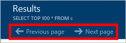
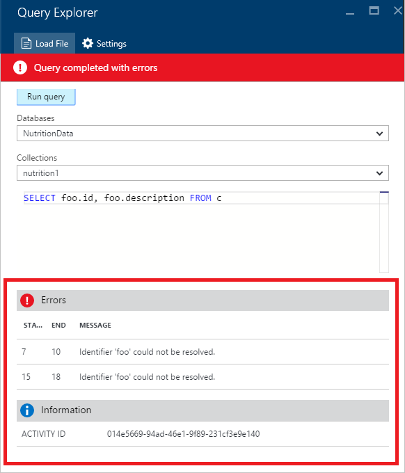

<properties
    pageTitle="Requête DocumentDB Explorer : Un éditeur de requête SQL | Microsoft Azure"
    description="En savoir plus sur l’Explorateur de requête DocumentDB, un éditeur de requête SQL dans le portail Azure pour l’écriture de requêtes SQL et leur exécution par rapport à une collection de sites NoSQL DocumentDB."
    keywords="écriture de requêtes sql, l’éditeur de requête sql"
    services="documentdb"
    authors="kirillg"
    manager="jhubbard"
    editor="monicar"
    documentationCenter=""/>

<tags
    ms.service="documentdb"
    ms.workload="data-services"
    ms.tgt_pltfrm="na"
    ms.devlang="na"
    ms.topic="article"
    ms.date="08/30/2016"
    ms.author="kirillg"/>

# Écrire, modifier et exécuter des requêtes SQL pour DocumentDB à l’aide de l’Explorateur de requête 

Cet article fournit une vue d’ensemble de l’Explorateur de requête [Microsoft Azure DocumentDB](https://azure.microsoft.com/services/documentdb/) , un outil portail Azure qui vous permet d’écrire, modifier et exécuter des requêtes SQL sur une [collection de sites DocumentDB](documentdb-create-collection.md).

1. Dans le portail Azure, dans le Jumpbar, cliquez sur **DocumentDB (NoSQL)**. Si **DocumentDB (NoSQL)** n’est pas visible, cliquez sur **Autres Services** , puis sur **DocumentDB (NoSQL)**.

2. Dans le menu de la ressource, cliquez sur **Explorateur de requête**. 

    

3. Dans la carte de **L’Explorateur de requête** , sélectionnez les **bases de données** et les **Collections** de requête dans les listes déroulantes, puis tapez la requête à exécuter. 

    Les **bases de données** et des **Collections de** listes déroulantes, sont renseignés en fonction du contexte dans lequel vous lancez l’Explorateur de requête. 

    Une requête par défaut de `SELECT TOP 100 * FROM c` est fourni.  Vous pouvez accepter la requête par défaut ou créez votre propre requête en utilisant le langage de requête SQL décrit dans la [requête SQL de la feuille de fraude](documentdb-sql-query-cheat-sheet.md) ou de l’article de la [requête SQL et syntaxe SQL](documentdb-sql-query.md) .

    Cliquez sur **exécuter la requête** pour afficher les résultats.

    

4. La carte de **résultats** affiche les résultats de la requête. 

    

## Utiliser des résultats

Par défaut, l’Explorateur de requête renvoie des résultats dans des ensembles de 100.  Si votre requête génère plus de 100 résultats, utilisez simplement les commandes de la **page suivante** et **page précédente** pour naviguer dans le jeu de résultats.

Pour les requêtes réussies, le volet **d’informations** contient des indicateurs tels que les frais de la demande, le nombre de boucles la requête effectuée, le jeu de résultats en cours de présentation, et s’il existe plus de résultats, puis accessible via la commande de la **page suivante** , comme mentionné précédemment.

## Utiliser plusieurs requêtes

Si vous utilisez plusieurs requêtes et que vous voulez basculer rapidement entre eux, vous pouvez entrez toutes les requêtes dans la zone de texte de requête de la cuillère **Explorer de requête** , puis sélectionnez celui que vous souhaitez exécuter, puis cliquez sur **exécuter la requête** pour afficher les résultats.

## Ajouter des requêtes à partir d’un fichier dans l’éditeur de requête SQL

Vous pouvez charger le contenu d’un fichier existant à l’aide de la commande **Charger le fichier** .

## Résoudre les problèmes

Si une requête est terminée avec des erreurs, requête Explorer affiche une liste des messages d’erreur qui peuvent vous aider avec vos efforts de dépannage.

## Exécuter des requêtes à l’extérieur du portail DocumentDB SQL

L’Explorateur de requête dans le portail Azure est juste une des façons d’exécuter des requêtes SQL sur DocumentDB. Vous pouvez également exécuter des requêtes SQL à l’aide de l' [API REST](https://msdn.microsoft.com/library/azure/dn781481.aspx) ou le [client SDK](documentdb-sdk-dotnet.md). Pour plus d’informations sur l’utilisation de ces autres méthodes, voir [SQL de l’exécution des requêtes](documentdb-sql-query.md#executing-sql-queries)

## Étapes suivantes

Pour en savoir plus sur la grammaire DocumentDB SQL pris en charge dans l’Explorateur de requête, voir l’article de la [requête SQL et syntaxe SQL](documentdb-sql-query.md) ou imprimer la [Fiche récapitulative requête SQL](documentdb-sql-query-cheat-sheet.md).
Vous pouvez aussi bénéficier d’expérimenter la [Requête laboratoire](https://www.documentdb.com/sql/demo) dans lequel vous pouvez tester les requêtes en ligne à l’aide d’un exemple de dataset.
