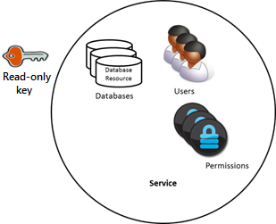
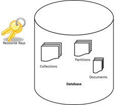

<properties 
    pageTitle="Découvrez comment sécuriser l’accès aux données dans DocumentDB | Microsoft Azure" 
    description="Découvrez les concepts de contrôle d’accès dans DocumentDB, y compris les clés principales, clés en lecture seule, les utilisateurs et autorisations." 
    services="documentdb" 
    authors="kiratp" 
    manager="jhubbard" 
    editor="monicar" 
    documentationCenter=""/>

<tags 
    ms.service="documentdb" 
    ms.workload="data-services" 
    ms.tgt_pltfrm="na" 
    ms.devlang="na" 
    ms.topic="article" 
    ms.date="09/19/2016" 
    ms.author="kipandya"/>

# Sécuriser l’accès aux données DocumentDB

Cet article fournit une vue d’ensemble de la sécurisation de l’accès aux données stockées dans [Microsoft Azure DocumentDB](https://azure.microsoft.com/services/documentdb/).

Après avoir lu cette présentation, vous pouvez répondre aux questions suivantes :  

-   Que sont les clés principales DocumentDB ?
-   Que sont les clés DocumentDB en lecture seule ?
-   Quelles sont les jetons ressource DocumentDB ?
-   Comment puis-je utiliser DocumentDB utilisateurs et autorisations pour sécuriser l’accès aux données DocumentDB ?

## Concepts de contrôle d’accès DocumentDB

DocumentDB fournit des concepts première classes afin de contrôler l’accès aux ressources DocumentDB.  Aux fins de cette rubrique, DocumentDB ressources sont regroupées en deux catégories :

- Ressources d’administration
    - Compte
    - Base de données
    - Utilisateur
    - Autorisation
- Ressources d’application
    - Collection de sites
    - Offre
    - Document
    - Pièce jointe
    - Procédure stockée
    - Déclencheur
    - Fonction définie par l’utilisateur

Dans le cadre de ces deux catégories, DocumentDB prend en charge trois types de personas de contrôle d’accès : administrateur, administrateur en lecture seule et utilisateur de base de données du compte.  Les droits nécessaires pour chaque personnage de contrôle d’accès sont :
 
- Administrateur de compte : l’accès complet à toutes les ressources (administration et d’application) au sein d’un compte DocumentDB donné.
- Administrateur en lecture seule : accès en lecture seule à toutes les ressources (administration et des applications au sein d’un compte DocumentDB donné. 
- Utilisateur de base de données : DocumentDB l’utilisateur une ressource associée à un ensemble spécifique de ressources de base de données DocumentDB (par exemple, collections de sites, des documents, des scripts).  Il peut s’agir ou davantage de ressources utilisateur associé à une base de données donnée et chaque ressource utilisateur peut-être associées une ou plusieurs des autorisations.

Les catégories ci-dessus et des ressources à l’esprit, le modèle de contrôle d’accès DocumentDB définit trois types de constructions access :

- Clés principales : lors de la création d’un compte DocumentDB, deux clés principales (principales et secondaires) sont créés.  Ces touches activer l’accès administratif complet à toutes les ressources dans le compte DocumentDB.

- Clés en lecture seule : lors de la création d’un compte DocumentDB, création des deux clés en lecture seule (principales et secondaires).  Ces touches activer l’accès en lecture seule à toutes les ressources dans le compte DocumentDB.

- Jetons ressource : un jeton de ressources est associé à une ressource d’autorisation DocumentDB et capture la relation entre l’utilisateur d’une base de données et l’autorisation cet utilisateur dispose d’une ressource d’application DocumentDB spécifique (par exemple, collection de sites, document).

## Utilisation des clés de masque et en lecture seule DocumentDB

Comme mentionné précédemment, des clés principales DocumentDB fournissent accès administratif complet à toutes les ressources au sein d’un compte DocumentDB, tandis que les clés en lecture seule activer l’accès en lecture à toutes les ressources dans le compte.  L’extrait de code suivant illustre comment utiliser un point de terminaison DocumentDB compte et la clé principale instanciation un DocumentClient et créer une nouvelle base de données. 

    //Read the DocumentDB endpointUrl and authorization keys from config.
    //These values are available from the Azure Classic Portal on the DocumentDB Account Blade under "Keys".
    //NB > Keep these values in a safe and secure location. Together they provide Administrative access to your DocDB account.
    
    private static readonly string endpointUrl = ConfigurationManager.AppSettings["EndPointUrl"];
    private static readonly SecureString authorizationKey = ToSecureString(ConfigurationManager.AppSettings["AuthorizationKey"]);
        
    client = new DocumentClient(new Uri(endpointUrl), authorizationKey);
    
    // Create Database
    Database database = await client.CreateDatabaseAsync(
        new Database
        {
            Id = databaseName
        });

## Vue d’ensemble des jetons de ressource DocumentDB

Vous pouvez utiliser un jeton de ressources (en créant DocumentDB utilisateurs et autorisations) lorsque vous souhaitez fournir un accès aux ressources dans votre compte DocumentDB à un client ne peut pas être approuvé avec la clé principale. Vos clés principales DocumentDB inclure à la fois une clé principale et secondaire, chacun d'entre eux accorde l’accès administratif à votre compte et toutes les ressources qu’il contient. Exposer une de vos clés principales s’ouvre votre compte à la possibilité d’utilisation malveillante ou négligence. 

De même, clés en lecture seule DocumentDB fournissent un accès en lecture à toutes les ressources - à l’exception des ressources d’autorisation, bien entendu - au sein d’un compte DocumentDB et ne peuvent pas être utilisés pour fournir un accès plus précis aux ressources DocumentDB spécifiques.

Jetons de ressources DocumentDB constituent un approuvés qui permet aux clients de lire, écrire et supprimer des ressources dans votre compte DocumentDB selon les autorisations et sans qu’il soit nécessaire pour un masque ou en lecture seule touche.

Voici un modèle de conception par défaut par lequel jetons ressource peuvent être demandés, génération et la livraison aux clients :

1. Un service milieu a été configurée pour répondre à une application mobile pour partager des photos de l’utilisateur.
2. Le service milieu possède la clé principale du compte DocumentDB.
3. L’application photo est installée sur des appareils mobiles de l’utilisateur final. 
4. Sur la connexion, l’application photo établit l’identité de l’utilisateur avec le service milieu. Ce mécanisme de mise en place identité est purement à l’application.
5. Une fois que l’identité est établie, le service milieu demande d’autorisations basées sur l’identité.
6. Le service milieu envoie un jeton de ressources revenir à l’application phone.
7. L’application phone pouvez continuer à utiliser le jeton de ressources pour accéder directement aux ressources DocumentDB avec les autorisations définies par le jeton de ressource et de l’intervalle autorisé par le jeton de ressources. 
8. Si le jeton ressource a expiré, les demandes suivantes recevront une exception 401 non autorisé.  À ce stade, l’application téléphone rétablit l’identité et les demandes d’un nouveau jeton de ressources.

## Utilisation des DocumentDB utilisateurs et autorisations
Un utilisateur DocumentDB une ressource est associée à une base de données DocumentDB.  Chaque base de données peut contenir zéro, un ou plusieurs utilisateurs DocumentDB.  L’extrait de code suivant montre comment créer un utilisateur DocumentDB une ressource.

    //Create a user.
    User docUser = new User
    {
        Id = "mobileuser"
    };

    docUser = await client.CreateUserAsync(UriFactory.CreateDatabaseUri("db"), docUser);

> [AZURE.NOTE] Chaque utilisateur DocumentDB possède une propriété PermissionsLink qui peut être utilisée pour récupérer la liste des autorisations associées à l’utilisateur.

Une ressource d’autorisation DocumentDB est associée à un utilisateur DocumentDB.  Chaque utilisateur peut contenir plusieurs autorisations ou aucune DocumentDB.  Une ressource d’autorisation donne accès à un jeton de sécurité que l’utilisateur doit lors de l’accès à une ressource d’application spécifique.
Il existe deux niveaux d’accès disponibles qui peuvent être fournies par une ressource d’autorisation :

- Toutes : L’utilisateur dispose des autorisations complètes sur la ressource
- Lire : L’utilisateur peut lire uniquement le contenu de la ressource, mais il ne peut pas effectuer écriture, mise à jour ou des suppressions sur la ressource.

> [AZURE.NOTE] Pour pouvoir exécuter DocumentDB stockées procédures que l’utilisateur doit disposer de l’autorisation All sur la collection de sites dans laquelle la procédure stockée sera exécutée.

L’extrait de code suivant montre comment créer une ressource d’autorisation, lisez le jeton de ressources de la ressource d’autorisation et associer les autorisations à l’utilisateur créé ci-dessus.

    // Create a permission.
    Permission docPermission = new Permission
    {
        PermissionMode = PermissionMode.Read,
        ResourceLink = documentCollection.SelfLink,
        Id = "readperm"
    };
            
  docPermission = attendre client. CreatePermissionAsync (UriFactory.CreateUserUri (« db », « utilisateurs »), docPermission) ; Console.WriteLine (docPermission.Id + » comporte un jeton de : "+ docPermission.Token) ;
  
Si vous avez défini une clé de partition pour votre collection de sites, puis l’autorisation pour la collection de sites, les ressources de document et pièce jointe doivent également inclure le ResourcePartitionKey outre le ResourceLink.

Pour obtenir facilement toutes les ressources d’autorisation associées à un utilisateur particulier, il convient DocumentDB met à disposition une autorisation de flux pour chaque objet utilisateur.  L’extrait de code suivant montre comment récupérer l’autorisation associée à l’utilisateur créé ci-dessus, créez une liste d’autorisation et instanciation d’un nouveau DocumentClient au nom de l’utilisateur.

    //Read a permission feed.
    FeedResponse<Permission> permFeed = await client.ReadPermissionFeedAsync(
      UriFactory.CreateUserUri("db", "myUser"));

    List<Permission> permList = new List<Permission>();
      
    foreach (Permission perm in permFeed)
    {
        permList.Add(perm);
    }
            
    DocumentClient userClient = new DocumentClient(new Uri(endpointUrl), permList);

> [AZURE.TIP] Ressource jetons comporter timespan valide par défaut d’une heure.  Durée de vie jeton, cependant, peut être explicitement spécifiée, avec un maximum de 5 heures.

## Étapes suivantes

- Pour en savoir plus sur DocumentDB, cliquez [ici](http://azure.com/docdb).
- Pour en savoir plus sur la gestion des clés de masque et en lecture seule, cliquez sur [ici](documentdb-manage-account.md).
- Pour savoir comment créer des jetons de l’autorisation DocumentDB, cliquez [ici](https://msdn.microsoft.com/library/azure/dn783368.aspx)
 
