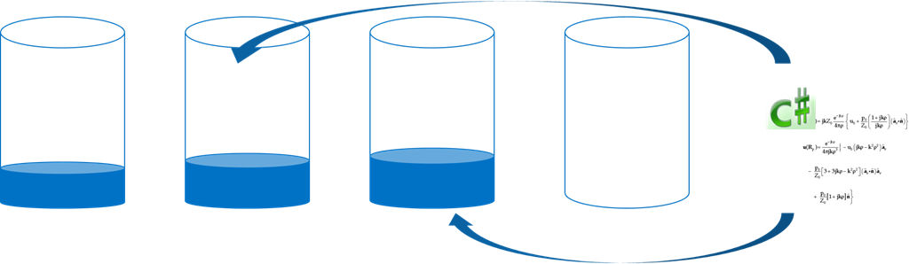

<properties 
    pageTitle="Comment mettre en œuvre partition de côté client avec les kits de développement | Microsoft Azure" 
    description="Découvrez comment utiliser le SDK DocumentDB Azure aux demandes de données et itinéraire partition (partagé) sur plusieurs collections" 
    services="documentdb" 
    authors="arramac" 
    manager="jhubbard" 
    editor="cgronlun" 
    documentationCenter=""/>

<tags 
    ms.service="documentdb" 
    ms.workload="data-services" 
    ms.tgt_pltfrm="na" 
    ms.devlang="na" 
    ms.topic="article" 
    ms.date="10/27/2016" 
    ms.author="arramac"/>

# <a name="how-to-partition-data-using-client-side-support-in-documentdb"></a>Mode de partition des données à l’aide de la prise en charge côté client dans DocumentDB

DocumentDB Azure prend en charge [automatique partition des collections de sites](documentdb-partition-data.md). Toutefois, il existe des exemples d’utilisation de l’endroit où il est intéressant de disposer d’un contrôle fin sur partition comportement. Afin de réduire le code contractuel réutilisable requis pour la partition tâches, nous avons ajouté des fonctionnalités .NET, Node.js et Java SDK qui facilite la création d’applications qui sont distribuées entre plusieurs collections.

Dans cet article, nous allons examiner les classes et interfaces dans le Kit de développement .NET et comment vous pouvez les utiliser pour développer des applications partitionnées. Autres SDK, tels que Java et Node.js Python prend en charge les méthodes similaires et interfaces de division côté client.

## <a name="client-side-partitioning-with-the-documentdb-sdk"></a>Partition côté client avec le Kit de développement DocumentDB

Avant de nous plus attentivement partition, nous allons résumer DocumentDB notions fondamentales relatives à la division. Chaque compte de base de données Azure DocumentDB est constitué d’un ensemble de bases de données, chacun contenant plusieurs collections de sites, chacun d'entre eux peut contenir des procédures stockées, déclencheurs, UDF, documents et les pièces jointes connexes. Collections de sites peuvent être partition unique ou séparées eux-mêmes et ont les propriétés suivantes :

- Collections offrent isolement performances. Il est donc un gain de performances en regroupant les documents similaires dans la même collection. Par exemple, pour les données de série de temps, vous souhaiterez peut-être placer les données pour le mois dernier, qui est fréquemment demandé, au sein d’une collection de sites avec débit généré alors que les données plus anciennes sont placées au sein des collections sans volumes importants mis en service.
- Transactions ACID c'est-à-dire les procédures stockées et déclencheurs ne comprennent pas une collection de sites. Transactions sont limitées au sein d’une valeur de clé partition unique au sein d’une collection de sites.
- Collections de sites n’appliquent pas un schéma, afin qu’ils puissent être utilisées pour les documents JSON du même type ou de différents types.

En commençant par la version [1.5.x de la SDK DocumentDB Azure](documentdb-sdk-dotnet.md), vous pouvez effectuer les opérations de document directement par rapport à une base de données. La [DocumentClient](https://msdn.microsoft.com/library/azure/microsoft.azure.documents.client.documentclient.aspx) utilise en interne PartitionResolver que vous avez spécifiée pour la base de données pour acheminer les requêtes à la collection appropriée.

>[AZURE.NOTE] [Partition côté serveur](documentdb-partition-data.md) introduite dans 1.6.0+ reste API 2015-12-16 et SDK deprecates l’approche vider partition côté client dans les cas d’utilisation simple. Partition côté client toutefois est plus flexible et vous permet de contrôler les isolement performances sur touches partition, contrôler le degré de parallélisme lors de la lecture des résultats à partir de plusieurs partitions et utiliser partition approches comparatif hachage spatiale/plage.

Par exemple, dans .NET, chaque classe PartitionResolver est une mise en œuvre concret d’une interface [IPartitionResolver](https://msdn.microsoft.com/library/azure/microsoft.azure.documents.client.ipartitionresolver.aspx) qui possède trois méthodes - [GetPartitionKey](https://msdn.microsoft.com/library/azure/microsoft.azure.documents.client.ipartitionresolver.getpartitionkey.aspx), [ResolveForCreate](https://msdn.microsoft.com/library/azure/microsoft.azure.documents.client.ipartitionresolver.resolveforcreate.aspx) et [ResolveForRead](https://msdn.microsoft.com/library/azure/microsoft.azure.documents.client.ipartitionresolver.resolveforread.aspx). Requêtes LINQ et itérateurs ReadFeed utilisent en interne la méthode ResolveForRead pour parcourir toutes les collections de sites qui correspondent à la clé de partition pour la demande. De même, créez utiliser opérations crée la méthode ResolveForCreate pour acheminer les messages vers la droite partition. Il n’y a aucune modification nécessaire pour remplacer, supprimer et lire, car ils utilisent les documents, déjà contient la référence à la collection correspondante.

Kits de développement logiciel inclut également des deux classes prenant en charge les deux techniques partition canoniques hachage et plage de recherches, via un [HashPartitionResolver](https://msdn.microsoft.com/library/azure/microsoft.azure.documents.partitioning.hashpartitionresolver.aspx) et un [RangePartitionResolver](https://msdn.microsoft.com/library/azure/mt126047.aspx). Vous pouvez utiliser ces classes pour ajouter facilement une partition logique à votre application.  

## <a name="add-partitioning-logic-and-register-the-partitionresolver"></a>Ajouter une logique de partition et enregistrer le PartitionResolver 

Voici un extrait de code montrant comment créer un [HashPartitionResolver](https://msdn.microsoft.com/library/azure/microsoft.azure.documents.partitioning.hashpartitionresolver.aspx) et enregistrer dans le DocumentClient pour une base de données.

```cs
// Create some collections to partition data.
DocumentCollection collection1 = await client.CreateDocumentCollectionAsync(...);
DocumentCollection collection2 = await client.CreateDocumentCollectionAsync(...);

// Initialize a HashPartitionResolver using the "UserId" property and the two collection self-links.
HashPartitionResolver hashResolver = new HashPartitionResolver(
    u => ((UserProfile)u).UserId, 
    new string[] { collection1.SelfLink, collection2.SelfLink });

// Register the PartitionResolver with the database.
this.client.PartitionResolvers[database.SelfLink] = hashResolver;

```

## <a name="create-documents-in-a-partition"></a>Créer des documents dans une partition  

Une fois la PartitionResolver est enregistré, vous pouvez effectuer crée et requêtes directement sur la base de données, comme illustré ci-dessous. Dans cet exemple, le Kit de développement utilise le PartitionResolver pour extraire le nom d’utilisateur, il hachage et ensuite utiliser cette valeur pour acheminer l’opération de création de la collection correcte.

```cs
Document johnDocument = await this.client.CreateDocumentAsync(
    database.SelfLink, new UserProfile("J1", "@John", Region.UnitedStatesEast));
Document ryanDocument = await this.client.CreateDocumentAsync(
    database.SelfLink, new UserProfile("U4", "@Ryan", Region.AsiaPacific, UserStatus.AppearAway));
```

## <a name="create-queries-against-partitions"></a>Créer des requêtes sur partitions  

Vous pouvez interroger à l’aide de la méthode [CreateDocumentQuery](https://msdn.microsoft.com/library/azure/microsoft.azure.documents.linq.documentqueryable.createdocumentquery.aspx) en passant dans la base de données et une clé de partition. La requête retourne un jeu de résultats unique sur toutes les collections de la base de données qui correspondent à la clé de partition.  

```cs
// Query for John's document by ID - uses PartitionResolver to restrict the query to the partitions 
// containing @John. Again the query uses the database self link, and relies on the hash resolver 
// to route the appropriate collection.
var query = this.client.CreateDocumentQuery<UserProfile>(
    database.SelfLink, null, partitionResolver.GetPartitionKey(johnProfile))
    .Where(u => u.UserName == "@John");
johnProfile = query.AsEnumerable().FirstOrDefault();
```

## <a name="create-queries-against-all-collections-in-the-database"></a>Créer des requêtes sur toutes les collections de la base de données 

Vous pouvez également interroger toutes les collections de la base de données et énumérer les résultats comme indiqué ci-dessous, en ignorant l’argument key partition.

```cs
// Query for all "Available" users. Here since there is no partition key, the query is serially executed 
// across each partition/collection and returns a single result-set. 
query = this.client.CreateDocumentQuery<UserProfile>(database.SelfLink)
    .Where(u => u.Status == UserStatus.Available);
foreach (UserProfile activeUser in query)
{
    Console.WriteLine(activeUser);
}
```

## <a name="hash-partition-resolver"></a>Hachage Partition vider
Avec hachage partition, partitions sont affectées en fonction de la valeur d’une fonction de hachage, ce qui vous répartir uniformément des demandes et des données entre un nombre de partitions. Cette approche est généralement utilisée pour partition données produites ou consommées à partir d’un grand nombre de clients distincts et sont utile pour stocker les profils utilisateur, les éléments du catalogue et les données de télémétrie IoT (« Internet des objets »). Partition hachage est également utilisée par le support de partition côté serveur de DocumentDB au sein d’une collection de sites.

**Hachage partitionnement :**


Un hachage simple partition jeu entre collections de *N* serait emporter n’importe quel document, calculer *hash(d) mod N* pour déterminer quelle collection il a placé dans. Mais un problème avec cette technique simple est qu’il ne fonctionne pas bien lorsque vous ajoutez de nouvelles collections, ou supprimez des collections comme cela nécessite presque toutes les données à obtenir reshuffled. [Hachage cohérentes] (http://citeseerx.ist.psu.edu/viewdoc/summary?doi=10.1.1.23.3738) est un algorithme connu répondant à ceci en mettant en œuvre d’un schéma de hachage qui limite la quantité de déplacement de données requis pendant ajoutant ou en supprimant des collections de sites.

La classe [HashPartitionResolver](https://msdn.microsoft.com/library/azure/microsoft.azure.documents.partitioning.hashpartitionresolver.aspx) met en œuvre une logique à créer une sonnerie hachage cohérente via la fonction de hachage spécifiée dans l’interface [IHashGenerator](https://msdn.microsoft.com/library/azure/microsoft.azure.documents.partitioning.ihashgenerator.aspx) . Par défaut, la HashPartitionResolver utilise une fonction de hachage MD5, mais vous pouvez échanger ce point par votre propre implémentation hachage. La HashPartitionResolver crée en interne 16 hachage ou « nœuds virtuels » au sein de l’anneau hachage pour chaque collection de sites afin d’obtenir une distribution uniforme, plus de documents sur les collections, mais vous pouvez modifier ce numéro pour un compromis asymétrie de données avec la quantité de calcul du côté client.

**Hachage cohérente avec HashPartitionResolver :**


## <a name="range-partition-resolver"></a>Plage Partition vider

Dans la plage partition, partitions affectées selon que la clé de partition est dans une certaine plage. Ceci est généralement utilisée pour la partition avec les propriétés de cachet d’heure (par exemple, eventTime entre le 1er avril 2015 et 14 avr 2015). La classe [RangePartitionResolver](https://msdn.microsoft.com/library/azure/mt126047.aspx) vous permet de conserver un mappage entre une plage\<T\> et collection de sites libre-service lier. 

[Plage\<T\> ](https://msdn.microsoft.com/library/azure/mt126048.aspx) est une classe simple qui gère les plages de tous les types implémentent IComparable\<T\> et IEquatable\<T\> comme des chaînes ou des nombres. Pour lit et crée, vous pouvez passer dans n’importe quelle plage arbitraire et l’utilitaire de résolution identifie toutes les collections de candidats en identifiant les plages des partitions qui se coupent avec la plage demandée. Cette fonctionnalité peut être utile lors de l’exécution des requêtes de plage sur des données de série de date.

**Plage partition :**  

  

Un cas spécial de plage partition est lorsque la plage est une seule discrète valeur, parfois appelée « recherche partition ». Elle est généralement utilisée pour la partition par région (par exemple, la partition pour Scandinavie contient Norvège, Danemark et Suède) ou de division clients dans une application cliente multiples.

## <a name="samples"></a>Exemples 

Examinons le [projet DocumentDB partition exemples Github](https://github.com/Azure/azure-documentdb-dotnet/tree/287acafef76ad223577759b0170c8f08adb45755/samples/code-samples/Partitioning) contenant extraits de code sur l’utilisation de ces PartitionResolvers et étendre les pour implémenter vos propres programmes de résolution pour l’ajuster à cas d’utilisation spécifiques, comme suit : 

* Comment spécifier une expression lambda arbitraire pour GetPartitionKey et utilisez-le pour implémenter clés partition composées ou pour différents types d’objets de partition différemment.
* Comment créer un simple [LookupPartitionResolver](https://github.com/Azure/azure-documentdb-dotnet/blob/287acafef76ad223577759b0170c8f08adb45755/samples/code-samples/Partitioning/Partitioners/LookupPartitionResolver.cs) qui utilise une table de choix manuel pour effectuer partition. Ce modèle est généralement utilisé pour la partition en fonction des valeurs distinctes comme région, ID de client ou application nom.
* Comment créer un [ManagedPartitionResolver](https://github.com/Azure/azure-documentdb-dotnet/blob/287acafef76ad223577759b0170c8f08adb45755/samples/code-samples/Partitioning/Partitioners/ManagedHashPartitionResolver.cs) qui crée des collections automatiquement basées sur un modèle qui définit un schéma d’appellation, IndexingPolicy et les procédures stockées qui doivent être enregistrés par rapport aux nouvelles collections.
* Comment créer un jeu de moins [SpilloverPartitionResolver](https://github.com/Azure/azure-documentdb-dotnet/blob/287acafef76ad223577759b0170c8f08adb45755/samples/code-samples/Partitioning/Partitioners/SpilloverPartitionResolver.cs) qui crée simplement nouvelles collections comme les collections d’anciens Recopier vers le haut.
* Découvrez comment sérialiser et désérialiser votre état PartitionResolver en tant que JSON, afin que vous puissiez partager entre les processus et les arrêts. Vous pouvez conserver dans les fichiers de configuration, ou même dans une collection de sites DocumentDB.
* Une classe [DocumentClientHashPartitioningManager](https://github.com/Azure/azure-documentdb-dotnet/blob/287acafef76ad223577759b0170c8f08adb45755/samples/code-samples/Partitioning/Util/DocumentClientHashPartitioningManager.cs) pour ajouter et supprimer des partitions à une base de données partitionnée dynamiquement basé sur hachage cohérentes. En interne elle utilise un [TransitionHashPartitionResolver](https://github.com/Azure/azure-documentdb-dotnet/blob/287acafef76ad223577759b0170c8f08adb45755/samples/code-samples/Partitioning/Partitioners/TransitionHashPartitionResolver.cs) à acheminer lectures et écrit lors de la migration à l’aide d’un des quatre modes - lire dans le modèle de partition ancien (ReadCurrent), celle (ReadNext), fusionner les résultats des deux (ReadBoth) ou ne pas être disponible lors de la migration (aucun).

Les exemples sont libres et nous vous invitons à envoyer des demandes d’extraction avec dons pouvant bénéficier des autres développeurs DocumentDB. Reportez-vous aux [instructions de Contribution](https://github.com/Azure/azure-documentdb-net/blob/master/Contributing.md) pour obtenir des instructions sur la façon de contribuer.  

>[AZURE.NOTE] Collection de sites crée sont taux-limité par DocumentDB, afin que certaines de ces méthodes exemple montrés ici peuvent prendre quelques minutes.

##<a name="faq"></a>FAQ
**DocumentDB ne prend en charge le côté serveur partition ?**

Oui, DocumentDB prend en charge [partition côté serveur](documentdb-partition-data.md). DocumentDB prend également en charge le côté client partition via les programmes de résolution de partition côté client pour le cas d’utilisation plus avancées.

**Quand dois-je utiliser côté serveur et côté client partition ?**
Pour la plupart des cas d’utilisation, nous vous recommandons de l’utilisation du côté serveur partition car elle gère les tâches d’administration de partition des données et l’acheminement des requêtes. Toutefois, si vous avez besoin de plage partition ou ont un exemple d’utilisation spécialisées isolement performances entre les différentes valeurs de clés, puis partition côté client peut-être être la meilleure approche.

**Comment ajouter ou supprimer une collection de sites Mon modèle de couleurs partition ?**

Examinons l’implémentation de DocumentClientHashPartitioningManager dans le projet exemples pour obtenir un exemple de comment vous pouvez implémenter un repartitionnement.

**Comment conserver ou partager ma configuration partition avec d’autres clients ?**

Vous pouvez sérialiser l’état partitionneur en tant que JSON et stocker dans les fichiers de configuration, ou même au sein de collections DocumentDB. Examinons la méthode RunSerializeDeserializeSample dans le projet exemples pour obtenir un exemple.

**Comment bicyclette différentes techniques partition ?**

Vous pouvez bicyclette PartitionResolvers en mettant en œuvre votre propre IPartitionResolver qui utilise en interne un ou plusieurs programmes de résolution existants. Consultez TransitionHashPartitionResolver dans le projet exemples pour obtenir un exemple.

##<a name="references"></a>Références
* [Partition dans DocumentDB côté serveur](documentdb-partition-data.md)
* [Collections de DocumentDB et les niveaux de performance](documentdb-performance-levels.md)
* [Exemples de code partition sur Github](https://github.com/Azure/azure-documentdb-dotnet/tree/287acafef76ad223577759b0170c8f08adb45755/samples/code-samples/Partitioning)
* [Documentation DocumentDB .NET SDK sur MSDN](https://msdn.microsoft.com/library/azure/dn948556.aspx)
* [Exemples de DocumentDB .NET](https://github.com/Azure/azure-documentdb-net)
* [Limites de DocumentDB](documentdb-limits.md)
* [Conseils de DocumentDB Blog sur les performances](https://azure.microsoft.com/blog/2015/01/20/performance-tips-for-azure-documentdb-part-1-2/)
 
