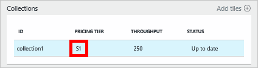

<properties 
    pageTitle="Améliorer votre compte DocumentDB S1 | Microsoft Azure" 
    description="Tirer parti de débit accru dans votre compte DocumentDB S1 en apportant quelques modifications dans le portail Azure." 
    services="documentdb" 
    authors="mimig1" 
    manager="jhubbard" 
    editor="monicar" 
    documentationCenter=""/>

<tags 
    ms.service="documentdb" 
    ms.workload="data-services" 
    ms.tgt_pltfrm="na" 
    ms.devlang="na" 
    ms.topic="article" 
    ms.date="08/25/2016" 
    ms.author="mimig"/>

# Améliorer votre compte DocumentDB

Suivez ces étapes pour tirer parti de débit accru pour votre compte Azure DocumentDB S1. Avec peu ou sans frais supplémentaires, vous pouvez augmenter le débit de votre compte S1 existant à partir de 250 [demandeur/s](documentdb-request-units.md) à 400 demandeur/s ou plus !  

> [AZURE.VIDEO changedocumentdbcollectionperformance]

## Modifier les performances définies par l’utilisateur dans le portail Azure

1. Dans votre navigateur, accédez au [**portail Azure**](https://portal.azure.com). 
2. Cliquez sur **Parcourir** -> **DocumentDB (NoSQL)**, puis sélectionnez le compte DocumentDB à modifier.   
3. Dans l’objectif de **bases de données** , sélectionnez la base de données à modifier, puis dans la carte de **base de données** , la collection de sites avec le niveau de tarification S1.

      

4. Dans la carte de la **collection de sites** , cliquez sur **plus**, puis cliquez sur **paramètres**.   
5. Dans la carte de **paramètres** , cliquez sur **Couche tarifs** et notez que l’estimation des coûts mensuel pour chaque plan est affichée. Dans la carte de **Choisir votre niveau de tarification** , cliquez sur **Standard**, puis cliquez sur **Sélectionner** pour enregistrer vos modifications.

      

6. Dans la carte de **paramètres** , le **Niveau de prix** est modifié en **Standard** et la zone de **débit (demandeur/s)** s’affiche avec une valeur par défaut de 400. Cliquez sur **OK** pour enregistrer vos modifications. 

    > [AZURE.NOTE] Vous pouvez définir le débit entre 10 000 et 400 [demande unités](../articles/documentdb/documentdb-request-units.md)/second (demandeur/s). **Synthèse des tarifs** en bas de la page met à jour automatiquement pour fournir une estimation de coût mensuel.
    
    

8. Dans la carte de **base de données** , vous pouvez vérifier le débit suralimenté de la collection de sites. 

    

Pour plus d’informations sur les modifications relatifs au débit prédéfini et définis par l’utilisateur, consultez le blog de publication [DocumentDB : tout ce que vous devez savoir sur l’utilisation de nouvelles options de tarification](https://azure.microsoft.com/blog/documentdb-use-the-new-pricing-options-on-your-existing-collections/).

## Étapes suivantes

Si vous estimez que vous avez besoin plus de débit (supérieur à 10 000 demandeur/s) ou plus de stockage (supérieur à 10 Go) vous pouvez créer une collection de sites partitionnées. Pour créer une collection de sites partitionnées, voir [créer une collection de sites](documentdb-create-collection.md).