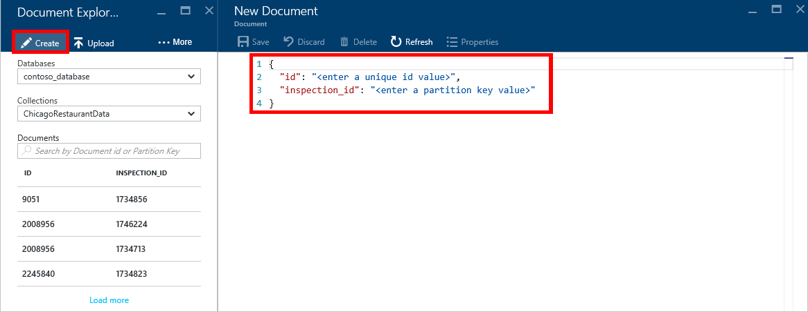
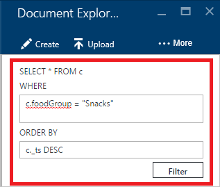
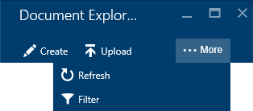
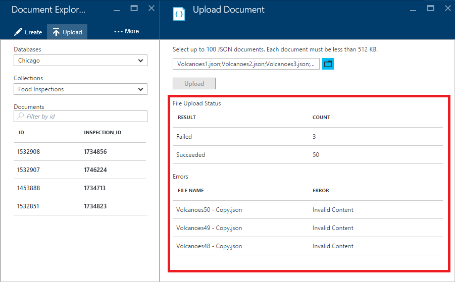

<properties
    pageTitle="Explorateur de Document DocumentDB, pour afficher JSON | Microsoft Azure"
    description="En savoir plus sur l’Explorateur de Document DocumentDB, un outil Azure portail pour afficher JSON, modifier, créer et télécharger des documents JSON avec DocumentDB, une base de données de documents NoSQL."
        keywords="Afficher json"
    services="documentdb"
    authors="kirillg"
    manager="jhubbard"
    editor="monicar"
    documentationCenter=""/>

<tags
    ms.service="documentdb"
    ms.workload="data-services"
    ms.tgt_pltfrm="na"
    ms.devlang="na"
    ms.topic="article"
    ms.date="08/30/2016"
    ms.author="kirillg"/>

# Afficher, modifier, créer et télécharger des documents JSON à l’aide de l’Explorateur de Document DocumentDB

Cet article fournit une vue d’ensemble de l’Explorateur de Document [Microsoft Azure DocumentDB](https://azure.microsoft.com/services/documentdb/) , un outil portail Azure qui vous permet d’afficher, modifier, créer, charger et filtrer les documents JSON avec DocumentDB. 

Notez que l’Explorateur de Document n’est pas activé sur les comptes DocumentDB avec prise en charge du protocole de MongoDB. Cette page est mise à jour lorsque cette fonctionnalité est activée.

## Lancer l’Explorateur de Document

1. Dans le portail Azure, dans le Jumpbar, cliquez sur **DocumentDB (NoSQL)**. Si **DocumentDB (NoSQL)** n’est pas visible, cliquez sur **Autres Services** , puis sur **DocumentDB (NoSQL)**.

2. Sélectionnez le nom du compte. 

3. Dans le menu de la ressource, cliquez sur **Explorateur de Document**. 
 
    

    Dans la carte de **L’Explorateur de Document** , les **bases de données** et des **Collections de** listes déroulantes, sont remplis au préalable en fonction du contexte dans lequel vous avez exécuté l’Explorateur de Document. 

## Créer un document

1. [Lancer l’Explorateur de Document](#launch-document-explorer).

2. Dans la carte de **L’Explorateur de Document** , cliquez sur **Créer un Document**. 

    Un extrait de JSON minimal est fourni dans la carte de **Document** .

    

2. Dans la carte de **Document** , tapez ou collez dans le contenu du document JSON pour créer et puis cliquez sur **Enregistrer** pour valider votre document de la base de données et de la collection de sites spécifiée dans la carte de **L’Explorateur de Document** .

    

    > [AZURE.NOTE] Si vous ne spécifiez pas une propriété « id », puis l’Explorateur de Document ajoute automatiquement une propriété id et génère un GUID en tant que la valeur id.

    Si vous avez déjà fichiers de données à partir de JSON, MongoDB, SQL Server, fichiers CSV, stockage de Table Azure, Amazon DynamoDB, HBase, ou dans d’autres collections DocumentDB, vous pouvez utiliser de DocumentDB [outil de migration de données](documentdb-import-data.md) pour importer rapidement vos données.

## Modifier un document

1. [Lancer l’Explorateur de Document](#launch-document-explorer).

2. Pour modifier un document existant, sélectionnez-le dans la carte de **L’Explorateur de Document** , modifiez le document dans la carte de **Document** , puis cliquez sur **Enregistrer**.

    

    Si vous modifiez un document et que vous décidez que vous souhaitez annuler l’ensemble actuel des modifications, cliquez sur **Annuler** dans la carte de **Document** , confirmer l’action Ignorer et l’état précédent du document est chargé à nouveau.

    

## Supprimer un document

1. [Lancer l’Explorateur de Document](#launch-document-explorer).

2. Sélectionnez le document dans **l’Explorateur de Document**et cliquez sur **Supprimer**, puis confirmez la suppression. Après avoir confirmé, le document est supprimé immédiatement dans la liste de l’Explorateur de Document.

    

## Utiliser des documents JSON

Document Explorer vérifie que n’importe quel document nouveau ou modifié contienne JSON valide.  Vous pouvez même afficher les erreurs de JSON en pointant sur la section incorrecte pour obtenir plus d’informations sur l’erreur de validation.

En outre, l’Explorateur de Document vous empêche d’enregistrer un document avec contenu JSON non valide.

Enfin, l’Explorateur de Document vous permet facilement afficher les propriétés du document actuellement chargé en cliquant sur la commande **Propriétés** .

> [AZURE.NOTE] La propriété d’horodatage (DTS) est représentée en interne comme heure d’origine, mais l’Explorateur de Document affiche la valeur dans un format lisible GMT.

## Filtrer les documents
Explorateur de document prend en charge un nombre d’options de navigation et paramètres avancés.

Par défaut, l’Explorateur de Document charge aux 100 premiers documents de la collection sélectionnée, par leur date de création de trier du plus récent au plus tard.  Vous pouvez charger autres documents (par lots de 100) en sélectionnant l’option **charger plus** en bas de la carte de l’Explorateur de Document. Vous pouvez choisir les documents à charger via la commande **filtrer** .

1. [Lancer l’Explorateur de Document](#launch-document-explorer).

2. En haut de la cuillère **Explorateur de Document** , cliquez sur **filtrer**.  

    
  
3.  Les paramètres de filtre s’affichent sous la barre de commandes. Dans les paramètres de filtre, fournissent une clause WHERE et/ou une clause ORDER BY, puis cliquez sur **filtre**.

    

    Explorateur de document actualise automatiquement les résultats des documents correspondant à la requête de filtre. Lire plus d’informations sur la grammaire DocumentDB SQL dans [requête SQL et syntaxe SQL](documentdb-sql-query.md) article ou imprimer une copie de la [requête SQL Fiche récapitulative](documentdb-sql-query-cheat-sheet.md).

    Les zones de liste déroulante **base de données** et de **collection de sites** peuvent servir à modifier facilement la collection de sites à partir de laquelle les documents sont actuellement affichées sans avoir à fermer puis lancez à nouveau l’Explorateur de Document.  

    Explorateur de document prend également en charge le filtrage de l’ensemble de documents actuellement chargé par leur propriété id.  Tapez simplement le filtre de Documents par zone id.

    

    Les résultats dans l’Explorateur de Document liste sont filtrées en fonction de vos critères fournis.

    

    > [AZURE.IMPORTANT] Explorateur de Document filtre fonctionnalité seuls filtres à partir de ***actuellement*** chargées ensemble de documents et n’effectue une requête sur la collection actuellement sélectionnée.

4. Pour actualiser la liste des documents chargés par l’Explorateur de Document, cliquez sur **Actualiser** dans la partie supérieure de la cuillère.

    

## Ajouter des documents en bloc

Explorateur de document prend en charge en bloc réception d’un ou plusieurs JSON documents existants, jusqu'à 100 fichiers JSON par une opération de téléchargement.  

1. [Lancer l’Explorateur de Document](#launch-document-explorer).

2. Pour démarrer le processus de téléchargement, cliquez sur **Télécharger un Document**.

    

    La carte de **Télécharger un Document** s’ouvre. 

2. Cliquez sur le bouton Parcourir pour ouvrir une fenêtre de l’Explorateur de fichiers, sélectionnez un ou plusieurs documents JSON à télécharger, puis cliquez sur **Ouvrir**.

    

    > [AZURE.NOTE] Explorateur de document prend actuellement en charge jusqu'à 100 documents JSON par une opération de téléchargement individuels.

3. Une fois que vous êtes satisfait de votre sélection, cliquez sur le bouton **Télécharger** .  Les documents sont automatiquement ajoutés à la grille de l’Explorateur de Document et les résultats de téléchargement sont affichent sous forme de l’exécution de l’opération. Erreurs d’importation sont signalés pour des fichiers individuels.

    

4. Une fois l’opération terminée, vous pouvez sélectionner jusqu'à une autre documents 100 pour la télécharger.

## Utiliser des documents JSON à l’extérieur du portail

L’Explorateur de documents dans le portail Azure est une façon de travailler avec des documents dans DocumentDB. Vous pouvez également utiliser des documents à l’aide de l' [API REST](https://msdn.microsoft.com/library/azure/mt489082.aspx) ou le [client SDK](documentdb-sdk-dotnet.md). Par exemple code, consultez les [exemples de documents .NET SDK](documentdb-dotnet-samples.md#document-examples) et les [exemples de documents Node.js SDK](documentdb-nodejs-samples.md#document-examples).

Si vous avez besoin importer ou déplacer des fichiers à partir d’une autre source (JSON fichiers, MongoDB, SQL Server, CSV fichiers, Azure Table storage, Amazon DynamoDB ou HBase), vous pouvez utiliser [l’outil de migration de données](documentdb-import-data.md) DocumentDB rapidement importer vos données dans DocumentDB.

## Résoudre les problèmes

**Problème**: l’Explorateur de Document ne renvoie **aucun document trouvé**.

**Solution**: Vérifiez que vous avez activé l’abonnement correct, la base de données et la collection de sites dans laquelle les documents ont été insérés. En outre, vérifiez que vous travaillez dans vos quotas de débit. Si vous êtes à votre débit maximal niveau et mise en route limitée, l’utilisation des applications inférieure à fonctionner sous le quota de débit maximal pour la collection de sites.

**Explication**: le portail est une application telle que tout autre, passer des appels à votre base de données DocumentDB et collection de sites. Si vos demandes sont actuellement limitées en raison d’appels sachant depuis une autre application, le portail peut également être limité, à l’origine de ressources ne pas faire apparaître dans le portail. Pour résoudre le problème, la raison de l’utilisation du haut débit d’adresses, puis actualisez la carte du portail. Vous trouverez des informations sur l’utilisation de débit inférieure et comment mesurer dans la section de [débit](documentdb-performance-tips.md#throughput) de l’article [optimiser les performances](documentdb-performance-tips.md) .

## Étapes suivantes

Pour en savoir plus sur la grammaire DocumentDB SQL pris en charge dans l’Explorateur de Document, voir l’article de la [requête SQL et syntaxe SQL](documentdb-sql-query.md) ou imprimer la [Fiche récapitulative requête SQL](documentdb-sql-query-cheat-sheet.md).

Les [rubriques d’apprentissage](https://azure.microsoft.com/documentation/learning-paths/documentdb/) est également une ressource utile pour vous guider pendant que vous en savoir plus sur DocumentDB. 
