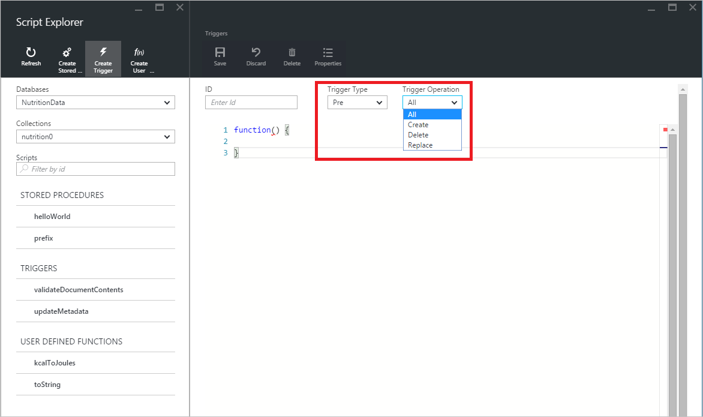
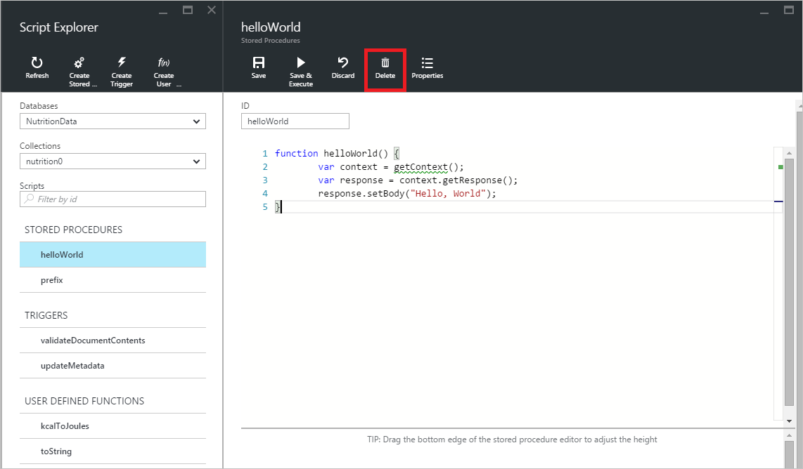
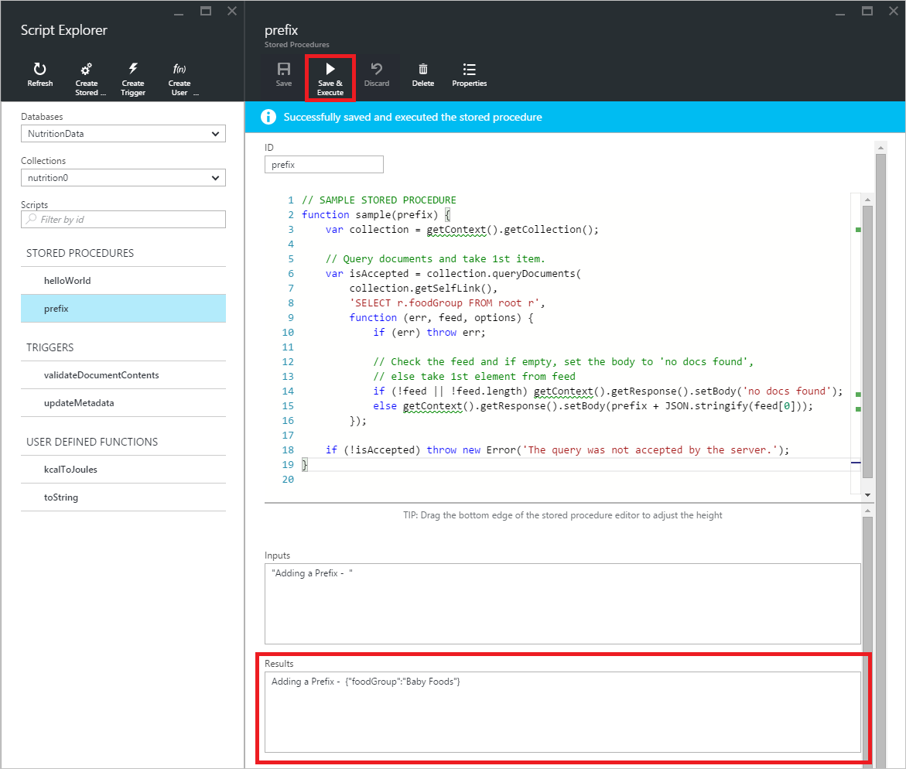

<properties
    pageTitle="Explorateur de scripts DocumentDB, un éditeur JavaScript | Microsoft Azure"
    description="En savoir plus sur l’Explorateur de Script DocumentDB, un outil Azure portail pour gérer les objets programmation côté serveur DocumentDB, y compris les procédures stockées, des déclencheurs et des fonctions définies par l’utilisateur."
    keywords="éditeur JavaScript"
    services="documentdb"
    authors="kirillg"
    manager="jhubbard"
    editor="monicar"
    documentationCenter=""/>

<tags
    ms.service="documentdb"
    ms.workload="data-services"
    ms.tgt_pltfrm="na"
    ms.devlang="na"
    ms.topic="article"
    ms.date="08/30/2016"
    ms.author="kirillg"/>

# Créer et exécuter des procédures stockées, des déclencheurs et des fonctions définies par l’utilisateur à l’aide de l’Explorateur de scripts DocumentDB

Cet article fournit une vue d’ensemble de l’Explorateur de Script [Microsoft Azure DocumentDB](https://azure.microsoft.com/services/documentdb/) , qui est un éditeur JavaScript dans le portail Azure qui vous permet de visualiser et d’exécuter les objets programmation côté serveur DocumentDB, y compris les procédures stockées, des déclencheurs et des fonctions définies par l’utilisateur. En savoir plus sur la programmation du côté serveur DocumentDB dans l’article de [procédures stockées, déclencheurs de base de données et les fichiers UDF](documentdb-programming.md) .

## Lancer l’Explorateur de Script

1. Dans le portail Azure, dans le Jumpbar, cliquez sur **DocumentDB (NoSQL)**. Si **Les comptes DocumentDB** n’est pas visible, cliquez sur **Autres Services** , puis sur **DocumentDB (NoSQL)**.

2. Dans le menu de ressources, cliquez sur **Explorateur de scripts**.

    
 
    Les zones de liste déroulante **base de données** et de **collection de sites** sont remplis au préalable en fonction du contexte dans lequel vous lancez l’Explorateur de Script.  Par exemple, si vous lancez à partir d’une carte de base de données, la base de données active est pré-rempli.  Si vous lancez à partir d’une carte de la collection de sites, la collection actuelle est pré-rempli.

4.  Utiliser les zones de liste déroulante **base de données** et de **collection de sites** pour facilement modifier la collection de sites à partir de laquelle les scripts sont actuellement affichées sans avoir à fermer puis lancez à nouveau Explorateur de scripts.  

5. Explorateur de scripts prennent également en charge le jeu de scripts actuellement chargé de filtrage par leur propriété id.  Simplement taper dans la zone de filtre et les résultats dans la liste de l’Explorateur de scripts sont filtrées en fonction de vos critères spécifiés.

    

    > [AZURE.IMPORTANT] L’Explorateur de scripts filtrer les seuls filtres de fonctionnalités dans l’ensemble ***actuellement*** chargée de scripts et ne pas s’actualise automatiquement la collection actuellement sélectionnée.

5. Pour actualiser la liste des scripts chargés par Script Explorer, cliquez simplement sur la commande **Actualiser** en haut de la carte.

    

## Créer, afficher et modifier des procédures stockées, des déclencheurs et des fonctions définies par l’utilisateur

Explorateur de scripts vous permet facilement effectuer les opérations sur les objets de programmation DocumentDB côté serveur.  

- Pour créer un script, il suffit de cliquer sur applicable Créer commande au sein de l’Explorateur de scripts, fournissent un id, entrez le contenu du script, puis cliquez sur **Enregistrer**.

    

- Lorsque vous créez un déclencheur, vous devez également spécifier l’opération de type et le déclencheur déclencheur

    

- Pour afficher un script, cliquez simplement sur le script qui vous intéressent.

    

- Pour modifier un script, simplement apportez les modifications souhaitées dans le code JavaScript éditeur, puis cliquez sur **Enregistrer**.

    

- Pour annuler les modifications en attente à un script, cliquez simplement sur la commande **Annuler** .

    

- Explorateur de scripts permet d’afficher facilement les propriétés du système du script actuellement chargé en cliquant sur la commande **Propriétés** .

    

    > [AZURE.NOTE] La propriété d’horodatage (DTS) est représentée en interne comme heure d’origine, mais Script Explorer affiche la valeur dans un format lisible GMT.

- Pour supprimer un script, sélectionnez-le dans l’Explorateur de Script et cliquez sur la commande **Supprimer** .

    

- Cliquez sur **Oui** pour confirmer l’action supprimer ou annuler l’action supprimer en cliquant sur **non**.

    

## Exécuter une procédure stockée

> [AZURE.WARNING] Exécuter des procédures stockées dans l’Explorateur de Script n’est pas encore pris en charge pour les collections de partition de côté serveur. Pour plus d’informations, consultez [partitionnement et échelle dans DocumentDB](documentdb-partition-data.md).

Explorateur de scripts vous permet d’exécuter des procédures stockées côté serveur à partir du portail Azure.

- Lorsque vous ouvrez une nouvelle carte de procédure créer stockées, un script par défaut (*préfixe*) sera déjà fourni. Pour exécuter le script *préfixe* ou votre propre script, ajoutez un *code* et les *entrées*. Pour les procédures stockées qui acceptent plusieurs paramètres, toutes les entrées doivent figurer dans un tableau (par exemple *[« foo », « barre »]*).

    

- Pour exécuter une procédure stockée, cliquez simplement sur la commande **Enregistrer et exécuter** dans le volet de l’éditeur de script.

    > [AZURE.NOTE] La commande **Enregistrer et exécuter** sera enregistrée votre procédure stockée avant d’exécuter, ce qui signifie qu’il remplace la version de la procédure stockée enregistrée précédemment.

- Exécutions de procédures stockées réussie aura un statut *correctement enregistrées et exécuté la procédure stockée* et les résultats renvoyés seront répercutées dans le volet des *résultats* .

    

- Si l’exécution rencontre une erreur, l’erreur est répercutée dans le volet des *résultats* .

    

## Travailler avec des scripts à l’extérieur du portail

L’Explorateur de Script dans le portail Azure est une façon de travailler avec des procédures stockées, des déclencheurs et des fonctions définies par l’utilisateur dans DocumentDB. Vous pouvez également travailler avec des scripts à l’aide de la l’API REST et le [client SDK](documentdb-sdk-dotnet.md). La documentation de l’API REST comprend des exemples pour travailler avec [utilisent reste des procédures stockées](https://msdn.microsoft.com/library/azure/mt489092.aspx), [à l’aide de reste de fonctions définies par l’utilisateur](https://msdn.microsoft.com/library/azure/dn781481.aspx)et [à l’aide de déclencheurs reste](https://msdn.microsoft.com/library/azure/mt489116.aspx). Exemples sont également disponible montrant comment [travailler avec des scripts à l’aide de c#](documentdb-dotnet-samples.md#server-side-programming-examples) et [travailler avec des scripts à l’aide de Node.js](documentdb-nodejs-samples.md#server-side-programming-examples).

## Étapes suivantes

En savoir plus sur la programmation du côté serveur DocumentDB dans l’article de [procédures stockées, déclencheurs de base de données et les fichiers UDF](documentdb-programming.md) .

Les [rubriques d’apprentissage](https://azure.microsoft.com/documentation/learning-paths/documentdb/) est également une ressource utile pour vous guider pendant que vous en savoir plus sur DocumentDB.  
