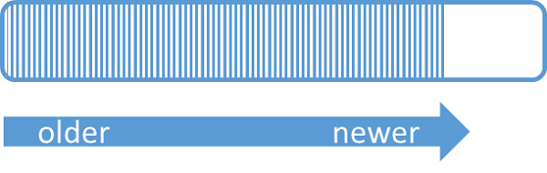
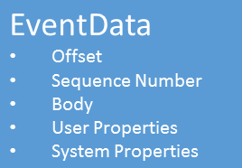

<properties 
    pageTitle="Vue d’ensemble des événements Azure Hubs | Microsoft Azure"
    description="Vue d’ensemble des Azure événement centraux et présentation."
    services="event-hubs"
    documentationCenter="na"
    authors="sethmanheim"
    manager="timlt"
    editor="" />
<tags 
    ms.service="event-hubs"
    ms.devlang="na"
    ms.topic="get-started-article"
    ms.tgt_pltfrm="na"
    ms.workload="na"
    ms.date="08/16/2016"
    ms.author="sethm" />

# Vue d’ensemble des événements Hubs Azure

L’intention de nombreuses solutions modernes pour fournir une expérience client adaptive ou pour améliorer les produits par le biais des commentaires en continu et télémétrie automatisé. Ces solutions sont confrontées au défi de la façon de façon sécurisée et fiable traiter très grandes quantités d’informations à partir de nombreux éditeurs simultanées. Microsoft Azure événement Hubs est un service plateforme managée qui fournit une base pour l’incorporation de données de grande taille dans un large éventail de scénarios. Exemples de scénarios de ce type sont comportement suivi dans les applications mobiles, informations sur le trafic de batteries de serveurs web, dans le jeu événement capture dans les jeux de console, ou données de télémétrie collectées à partir de machines industrielles ou connectés véhicules. Le rôle courantes qui événement Hubs est lu en architectures de solution est qu’il agit en tant que la « porte » pour un pipeline des événements, souvent appelée une *ingestor événement*. Un ingestor événement est un composant ou service qui se trouve entre les consommateurs d’événements et les éditeurs d’événements à dissocier la production d’un flux d’événements à partir de la consommation de ces événements.

Azure événement Hubs est un service qui fournit des événements et télémétrie pénétration dans le cloud à grande échelle, avec une latence faible et fiabilité de traitement des événements. Ce service, utilisé avec d’autres services en aval est particulièrement utile dans les scénarios Internet des objets (IoT), traitement des flux de travail ou expérience utilisateur et instrumentation de l’application. Événement Hubs fournit un flux de messages de gestion des capacités et si un concentrateur événement est une entité similaire aux files d’attente et rubriques, il dispose de caractéristiques sont très différentes de la messagerie d’entreprise traditionnel. Scénarios de messagerie d’entreprise nécessitent fréquemment des fonctionnalités, telles que classement, inactive lettres, la prise en charge et garanties de remise fort, tandis que le problème principal pour la sélection d’événement est haut débit et le traitement de souplesse pour les flux d’événements. Par conséquent, fonctionnalités événement Hubs diffèrent rubriques Bus des services dans la mesure où ils sont tronqués fortement vers le haut débit et scénarios de traitement des événements. Dès lors, événement Hubs n’implémentez pas certaines des fonctionnalités de messagerie qui sont disponibles pour les rubriques. Si vous avez besoin de ces fonctionnalités, rubriques restent le meilleur choix.

Un concentrateur événement est créé au niveau espace de noms événement Hubs, similaire aux rubriques et files d’attente Bus des services. Événement Hubs utilise AMQP et HTTP en tant que ses interfaces API principales. Le diagramme suivant illustre la relation entre événement Hubs et Bus des services.

## Vue d’ensemble conceptuelle

Événement Hubs fournit message en continu via un motif consommateur partitionnées. Files d’attente et les rubriques utilisent un modèle de [Consommateur en patinage](https://msdn.microsoft.com/library/dn568101.aspx) dans lequel chaque consommateur essaie de lire à partir de la même file d’attente ou la ressource. Cette compétition pour les ressources traduit la complexité et limites d’échelle pour les applications de traitement de flux. Événement Hubs utilise un modèle de consommateur partitionnées dans lequel chaque consommateur lit uniquement un sous-ensemble spécifique, ou une partition, de flux de messages. Ce modèle permet d’échelle horizontal pour traitement de l’événement et offre d’autres fonctionnalités en fonction des flux de données qui ne sont pas disponibles dans les rubriques et les files d’attente.

### Partitions

Une partition est une séquence ordonnée des événements qui se trouve dans un concentrateur de l’événement. Lorsque les événements plus récents arrivent, ils sont ajoutés à la fin de cet ordre. Une partition peut être considérée comme un « journal de valider ».

Partitions conservent les données pendant une période de rétention configurée est définie au niveau de l’événement concentrateur. Ce paramètre s’applique à toutes les partitions dans l’événement concentrateur. Expirant des événements sur une base de temps ; Vous ne pouvez pas explicitement supprimez-les. Un concentrateur événement contient plusieurs partitions. Chaque partition est indépendante et contient sa propre séquence de données. Par conséquent, partitions agrandir souvent à des taux différents.

Le nombre de partitions est spécifié à l’heure de création d’événement concentrateur et doit être comprise entre 2 et 32 (la valeur par défaut est 4). Les partitions permettent d’organisation des données et sont plus associées au degré de parallélisme en aval requis dans les applications et au débit Hubs événement par d’autres programmes. Ainsi, un concentrateur événement directement liés au nombre de lecteurs concurrents que vous prévoyez d’intégrer le choix du nombre de partitions. Après la création du concentrateur de l’événement, le nombre de partition n’est pas modifiable ; Vous devez prendre en compte ce nombre en termes d’échelle attendu à long terme. Vous pouvez augmenter la limite de 32 partition, contactez l’équipe du Service Bus.

Tandis que les partitions sont identifiables et peuvent être envoyées à directement, qu'il est préférable d’éviter d’envoyer des données à des partitions spécifiques. À la place, vous pouvez utiliser des constructions de niveau supérieures introduites dans les sections [Éditeur d’événements](#event-publisher) et [Stratégie de l’éditeur](#capacity-and-security) .

Dans le contexte d’événement Hubs, les messages sont appelées *données d’événement*. Données de l’événement contient le corps de l’événement, un utilisateur défini sac de propriétés et diverses métadonnées relatives à l’événement comme son décalage dans la partition et son numéro dans la séquence de flux de données. Partitions sont remplies avec une série de données de l’événement.

## Éditeur d’événements

Toute entité qui envoie des données ou des événements à un concentrateur événement est un *Éditeur d’événements*. Éditeurs d’événements peuvent publier des événements à l’aide de HTTPS ou AMQP 1.0. Éditeurs d’événements permet un jeton de Signature accès partagé (sa) identifient à un concentrateur événement et pouvez possède une identité unique ou utiliser un jeton de sa courantes, selon la configuration requise du scénario.

Pour plus d’informations sur l’utilisation des associations de sécurité, voir [Partagés Signature authentification de l’accès à Service](../service-bus-messaging/service-bus-shared-access-signature-authentication.md).

### Tâches courantes de publisher

Cette section décrit les tâches courantes pour éditeurs d’événements.

#### Acquérir un jeton associations de sécurité

Signature d’accès partagé (sa) est le mécanisme d’authentification pour Hubs événement. Service Bus fournit des stratégies d’associations de sécurité au niveau de l’événement concentrateur et espace de noms. Un jeton associations de sécurité est généré à partir d’une clé de sa et est un hachage ça d’une URL, codé dans un format spécifique. En utilisant le nom de la clé (stratégie) et le jeton, Bus des services peuvent régénérer le hachage et par conséquent authentifier l’expéditeur. En règle générale, les jetons associations de sécurité pour les éditeurs d’événements sont créées avec uniquement **Envoyer** des privilèges sur un concentrateur événement spécifique. Ce mécanisme URL jeton associations de sécurité est la base pour les identifier publisher introduite dans la stratégie de l’éditeur. Pour plus d’informations sur l’utilisation des associations de sécurité, voir [Partagés Signature authentification de l’accès à Service](../service-bus-messaging/service-bus-shared-access-signature-authentication.md).

#### Publication d’un événement

Vous pouvez publier un événement via AMQP 1.0 ou HTTPS. Bus des services fournit une classe [EventHubClient](https://msdn.microsoft.com/library/microsoft.servicebus.messaging.eventhubclient.aspx) pour publier des événements à un concentrateur d’événements à partir de clients .NET. Pour d’autres plateformes et exécutions, vous pouvez utiliser n’importe quel client AMQP 1.0, tels que [Apache Qpid](http://qpid.apache.org/). Vous pouvez publier des événements individuellement ou regroupés. Une seule publication (instance de données événement) a une limite de 256 Ko, qu’il s’agisse d’un seul événement ou un lot. Publication des événements plus grandes que cela génère une erreur. Il est recommandé de représenter pour éditeurs pour être au courant des partitions dans le Hub de l’événement et uniquement spécifier une *clé de partition* (introduite dans la section suivante), ou son identité via leur jeton d’associations de sécurité.

La possibilité d’utiliser AMQP ou HTTPS est spécifique pour le scénario d’utilisation. AMQP nécessite l’établissement d’un socket bidirectionnelle permanente en plus de la sécurité au niveau (TLS) ou SSL/TLS transport. Cela peut être une opération coûteuse en termes de trafic réseau, mais ne se produit au début d’une session AMQP. HTTPS propose un réduire les frais initiale, mais requiert SSL supplémentaire aérienne pour chaque demande. Pour les éditeurs qui publient fréquemment des événements, AMQP propose des économies de performances, la latence et débit.

### Clé de partition

Une clé de partition est une valeur qui est utilisée pour mapper des données entrantes d’événements en partitions spécifiques pour les besoins de l’organisation des données. La clé de partition est une valeur fournie par l’expéditeur passée à un concentrateur de l’événement. Il est traité par une fonction de hachage statique, le résultat qui crée le devoir partition. Si vous ne spécifiez pas une clé de partition lors de la publication d’un événement, une affectation alternées est utilisée. Lorsque vous utilisez les touches de partition, l’éditeur d’événements n’a connaissance de sa clé partition, et non la partition à laquelle les événements sont publiées. Ce découplage de clé et partition protège l’expéditeur d’avoir à connaître trop traitement en aval et de stockage des événements. Partition clés sont importants pour organiser les données pour le traitement en aval, mais ne sont pas fondamentalement liés aux partitions eux-mêmes. Un périphérique ou un utilisateur unique identité constitue une clé de bonne partition, mais également d’autres attributs tels que la géographie servir à grouper des événements associés en une seule partition. Voici une illustration expéditeurs événement en utilisant les touches de partition pour épingler à partitions.

Événement Hubs garantit que tous les événements partage la même valeur clé partition sont remis dans l’ordre et à la même partition. Par ailleurs, si les clés de partition sont utilisées avec les stratégies de publisher, décrites dans la section suivante, puis l’identité de l’éditeur et la valeur de la clé de partition doivent correspondre. Sinon, une erreur se produit.

### Consommateur d’événements

Toute entité qui lit les données événements à partir d’un concentrateur événement est un consommateur d’événements. Tous les consommateurs d’événements de lire le flux d’événements par le biais des partitions dans un groupe de fournisseurs. Chaque partition doit avoir qu’un seul lecteur actif à la fois. Tous les consommateurs d’événement Hubs se connecter via la session AMQP 1.0, dans lequel les événements sont remis dès qu’elles sont disponibles. Le client n’a pas besoin pour l’interrogation de disponibilité des données.

#### Groupes de consommateurs

Le mécanisme de publication / d’abonnement de Hubs événement est activé via les consommateurs. Un groupe consommateur est une vue (état, position ou décalage) d’un concentrateur événement entière. Consommateur groupes activer plusieurs applications beaucoup à chacun ont une vue séparée du flux d’événements, puis lire le flux indépendamment à leur propre rythme et avec leur propre décalage. Dans un architecture de traitement de flux, chaque application en aval équivaut à un groupe de fournisseurs. Si vous voulez écrire des données d’événement dans le stockage à long terme, cette application writer stockage est un groupe grand public. Traitement de l’événement complexes est effectuée par groupe consommateurs une autre, distincte. Vous pouvez uniquement accéder partitions via un groupe grand public. Il est toujours un groupe de fournisseurs par défaut dans un concentrateur de l’événement, et vous pouvez créer jusqu'à 20 groupes consommateur pour un événement concentrateur de niveau Standard.

Voici quelques exemples de la convention d’URI de groupe grand public :

    //<my namespace>.servicebus.windows.net/<event hub name>/<Consumer Group #1>
    //<my namespace>.servicebus.windows.net/<event hub name>/<Consumer Group #2>

L’image suivante montre les consommateurs d’événements au sein de groupes de consommateurs.

#### Flux décale

Un décalage correspond à la position d’un événement au sein d’une partition. Vous pouvez considérer un décalage comme un curseur côté client. Le décalage est un octet de numérotation de l’événement. Cela permet un consommateur d’événements (reader) indiquer un point dans le flux d’événements à partir de laquelle il souhaite commencer la lecture des événements. Vous pouvez spécifier le décalage sous forme d’un horodatage ou d’une valeur de décalage. Les clients sont responsables pour le stockage de leurs propres valeurs de décalage en dehors du service Hubs événement.

Au sein d’une partition, chaque événement inclut un décalage. Cet offset est utilisé par les consommateurs pour indiquer l’emplacement dans la séquence d’événements d’une partition donnée. Décalage peut être passé à l’événement concentrateur sous forme d’un nombre ou d’une valeur d’horodatage lorsqu’un lecteur de se connecte.

#### Point de contrôle

*Point de contrôle* est un processus par lequel lecteurs marquer ou leur position dans une séquence d’événements partition la validation. Point de contrôle est la responsabilité du consommateur et s’effectue par partition au sein d’un groupe de grand public. Cela signifie que pour chaque groupe consommateur, chaque lecteur partition doit effectuer le suivi de sa position actuelle de l’événement de flux et peut indiquer le service lorsqu’elle examine le flux de données complète. Si un lecteur de déconnecte d’une partition, lorsqu’il reconnecte elle commence la lecture au point de contrôle qui a été envoyé précédemment par le lecteur dernière de cette partition dans ce groupe grand public. Lorsque le lecteur se connecte, il passe cet offset au concentrateur événement pour spécifier l’emplacement à partir duquel commencer la lecture. De cette façon, vous pouvez utiliser le script de vérification pour les deux marquer les événements comme « terminé » par les applications en aval et de fournir la résilience en cas de basculement entre des lecteurs en cours d’exécution sur des ordinateurs différents. Comme événement données sont conservées pendant l’intervalle de rétention spécifié lors de la création du Hub de l’événement, il est possible de revenir aux anciennes données en spécifiant un décalage inférieur à partir de ce processus de vérification. Grâce à ce mécanisme, vérification permet basculement résilience et relecture de flux d’événement contrôlée.

#### Tâches courantes de consommateur

Cette section décrit les tâches courantes pour les consommateurs d’événements événement Hubs ou lecteurs. Tous les consommateurs d’événement Hubs se connecter via AMQP 1.0. AMQP 1.0 est une session de canal de communication bidirectionnelle prenant en charge les États. Chaque partition dispose d’une session de lien AMQP 1.0 qui facilite le transport des événements séparés par partition.

##### Se connecter à une partition

Afin d’utiliser des événements à partir d’un concentrateur de l’événement, un consommateur doit se connecter à une partition. Comme indiqué précédemment, vous toujours accédez à partitions via un groupe grand public. Dans le cadre du modèle consommateur partitionnées, seulement un seul lecteur doit être actif sur une partition à un moment donné au sein d’un groupe de grand public. Il est courant lorsque vous vous connectez directement aux partitions d’utiliser un mécanisme location afin de coordonner les connexions de lecteur aux partitions spécifiques. De cette façon, il est possible pour toutes les partitions dans un groupe consommateur à n'installer qu’un seul lecteur actif. Gestion de la position dans la séquence de lecteur est une tâche importante qui est obtenue via un point de contrôle. Cette fonctionnalité est simplifiée grâce à la classe [EventProcessorHost](https://msdn.microsoft.com/library/microsoft.servicebus.messaging.eventprocessorhost.aspx) pour les clients .NET. [EventProcessorHost](https://msdn.microsoft.com/library/microsoft.servicebus.messaging.eventprocessorhost.aspx) est un agent consommateur intelligent et est décrite dans la section suivante.

##### Lire les événements

Une fois une partition spécifique ouverture de session AMQP 1.0 et établir un lien, événements sont remis au client AMQP 1.0 par le service événement Hubs. Ce mécanisme de remise permet de débit et latence inférieure mécanismes extraire tels que HTTP GET. Comme événements sont envoyés au client, chaque instance de données événement contient des métadonnées importantes telles que le nombre de décalage et la séquence qui sont utilisés pour faciliter le point de contrôle sur la séquence d’événements.

Il est de votre responsabilité pour gérer cette décalage de façon que meilleures permet de gérer l’avancement dans traitement du flux.

## Capacité et la sécurité

Événement Hubs est une architecture hautement scalable parallèle pour pénétration de flux de données. Dès lors, il existe plusieurs aspects essentiels à considérer lors du redimensionnement et mise à l’échelle d’une solution basée sur événement Hubs. La première de ces contrôles capacité est appelée *unités de débit*, décrites dans la section suivante.

### Unités de débit

La capacité de débit d’événement Hubs dépend des unités de débit. Unités de débit achetées des unités de capacité. Une unité de débit unique comprend les éléments suivants :

- Pénétration : Jusqu'à 1 Mo par seconde ou 1 000 événements par seconde.

- Sortie : Jusqu'à 2 Mo par seconde.

Pénétration est limitée à la quantité de capacité offerte par le nombre d’unités de débit acheté. Envoi de données au-dessus des résultats de cette quantité dans une exception « quota dépassé ». Le montant est soit 1 Mo par seconde ou 1 000 événements par seconde, selon ce qui vient en premier. Sortie ne génère pas de limitation exceptions, mais est limitée à la quantité de transfert de données prévue par les unités achetées débit : 2 Mo par seconde par unité de débit. Si vous recevez des exceptions de taux publication ou attendez sortie supérieure n’oubliez pas de vérifier le nombre d’unités débit que vous avez acheté pour l’espace de noms dans laquelle le Hub de l’événement a été créé. Pour obtenir d’autres unités de débit, vous pouvez ajuster le paramètre dans la page **d’espaces de noms** sous l’onglet **échelle** dans le [portail classique Azure][]. Vous pouvez également modifier ce paramètre à l’aide de l’API Azure.

Tandis que les partitions sont un concept d’organisation des données, unités de débit sont purement un concept de la capacité. Unités de débit facturées par heure et sont avant que vous avez achetées. Une fois qu’acheté, unités de débit sont facturées pendant au moins une heure. Jusqu'à 20 débit unités peuvent être achetées pour un espace de noms événement Hubs, et il existe une limite de compte Azure de 20 unités de débit. Ces unités de débit sont partagées par tous les événements Hubs dans un espace de noms donné.

Unités de débit sont mis en service sur mieux et peuvent ne pas toujours être disponibles pour un achat immédiat. Si vous avez besoin d’une capacité spécifique, il est recommandé que vous achetez ces unités de débit à l’avance. Si vous avez besoin de plus de 20 unités de débit, vous pouvez contacter le support Azure pour acheter d’autres unités de débit sur une base de validation dans des blocs de 20, jusqu'à les premières unités 100 débit. En outre, vous pouvez également acheter des blocs de 100 unités de débit.

Il est recommandé d’équilibrer avec soin débit unités et partitions pour atteindre échelle optimale avec Hubs de l’événement. Une seule partition a une échelle maximale d’unité un débit. Le nombre d’unités de débit doit être inférieure ou égale au nombre de partitions dans un concentrateur de l’événement.

Pour d’informations sur les tarifs, voir [Événement Hubs tarifs](https://azure.microsoft.com/pricing/details/event-hubs/).

### Stratégie de l’éditeur

Événement Hubs permet un contrôle précis éditeurs d’événements par le biais *des stratégies de publisher*. Stratégies de Publisher sont un ensemble de fonctionnalités d’exécution destiné à faciliter les nombreux éditeurs d’événements indépendants. Les stratégies de publisher chaque publisher utilise son propre identificateur unique lors de la publication des événements à un concentrateur de l’événement, en utilisant le mécanisme suivant :

    //<my namespace>.servicebus.windows.net/<event hub name>/publishers/<my publisher name>

Vous n’êtes pas obligé de créer des noms de publisher avance, mais ils doivent correspondre le jeton de sa utilisé lors de la publication d’un événement, afin de garantir identités publisher indépendante. Pour plus d’informations sur les associations de sécurité, voir [Partagés Signature authentification de l’accès à Service](../service-bus-messaging/service-bus-shared-access-signature-authentication.md). Lorsque vous utilisez des stratégies de publisher, la valeur **PartitionKey** est définie sur le nom de publisher. Pour fonctionner correctement, ces valeurs doivent correspondre.

## Résumé

Azure Hubs événement fournit un événement hyper-échelle télémétrie service peut être utilisée pour courantes flux de travail d’utilisateur et d’applications de surveillance à n’importe quelle échelle de traitement. Avec la capacité à fournir publication abonnement fonctionnalités avec une faible latence et à grande échelle, Hubs événement constituent le « dégradé activé » pour Big Data. Avec l’identité par publisher et listes de révocation de certificats, ces fonctionnalités sont étendues dans des scénarios courants Internet des objets. Pour plus d’informations sur le développement d’applications Hubs d’événement, voir le [guide de programmation Hubs événement](event-hubs-programming-guide.md).

## Étapes suivantes

À présent que vous avez appris sur les concepts de Hubs d’événement, vous pouvez déplacer sur aux scénarios suivants :

- Commencer avec un [événement Hubs didacticiel].
- Un [exemple d’application qui utilise l’événement Hubs]complète.

[Portail classique Azure]: http://manage.windowsazure.com
[Didacticiel de Hubs d’événement]: event-hubs-csharp-ephcs-getstarted.md
[exemple d’application qui utilise l’événement Hubs]: https://code.msdn.microsoft.com/windowsazure/Service-Bus-Event-Hub-286fd097
