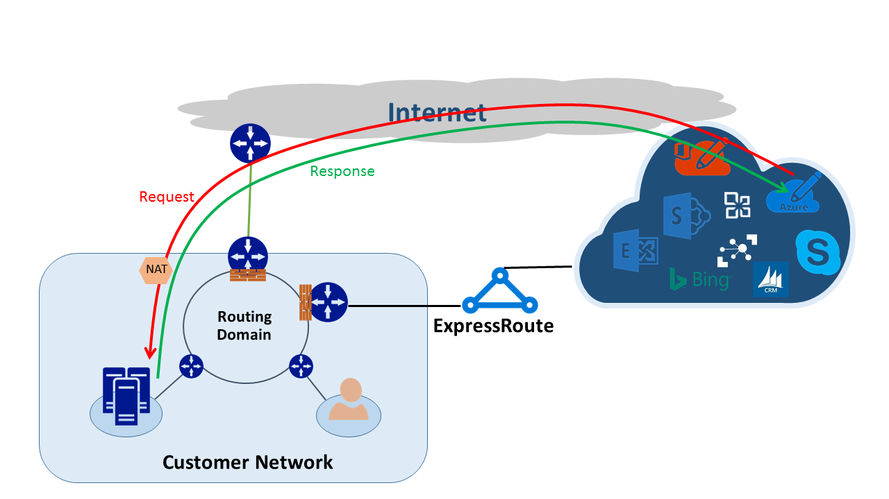

<properties
   pageTitle="Routage asymétriques | Microsoft Azure"
   description="Cet article décrit les problèmes de que client peut également être confronté avec le routage asymétriques dans un réseau qui comporte plusieurs liens vers une destination."
   documentationCenter="na"
   services="expressroute"
   authors="osamazia"
   manager="carmonm"
   editor=""/>
<tags
   ms.service="expressroute"
   ms.devlang="na"
   ms.topic="get-started-article"
   ms.tgt_pltfrm="na"
   ms.workload="infrastructure-services"
   ms.date="10/10/2016"
   ms.author="osamazia"/>

# Routage asymétriques avec plusieurs chemins d’accès réseau

Cet article explique comment transférer et renvoyer le trafic réseau peut prendre itinéraires différents lorsque plusieurs chemins sont disponibles entre destination et source réseau.

Il est important de comprendre deux concepts pour comprendre le routage asymétriques. Un est l’effet de plusieurs chemins d’accès réseau. L’autre est comment conserver l’état d’appareils, tel qu’un pare-feu. Ces types de périphériques sont appelés périphériques avec état. Une combinaison de ces deux facteurs crée des scénarios dans le réseau sur lequel le trafic est ignoré par un appareil avec état, car le périphérique avec état n’a pas été détecte que le trafic a été créée avec le périphérique lui-même.

## Plusieurs chemins d’accès réseau

Lorsqu’un réseau d’entreprise n'a qu’un seul lien à Internet via leur fournisseur de services Internet, tout le trafic vers et depuis Internet parcourt le même chemin d’accès. Souvent, sociétés achètent plusieurs circuits, en tant que chemins redondants, afin d’améliorer la disponibilité du réseau. Dans ce cas, il est possible que le trafic qui accède en dehors du réseau, à Internet, passe via un lien et le trafic de retour passent par un autre lien. Il s’agit généralement routage asymétriques. Dans Routage asymétriques, le trafic réseau inverse prend un chemin d’accès différent à partir du flux d’origine.

Même si elle se produit principalement sur Internet, routage asymétriques également s’applique aux autres combinaisons de chemins multiples. Par exemple, celui-ci est appliqué à la fois à un chemin d’accès Internet et un chemin d’accès privé, accédez à la même cible et plusieurs chemins d’accès de privé accédez à la même cible.

Chaque routeur tout au long du processus, à partir de la source vers la destination, calcule le meilleur chemin pour atteindre une destination. Détermination du routeur du chemin d’accès possible meilleures est basée sur deux facteurs principaux :

-   Routage entre les réseaux externes est basé sur un protocole de routage bordure BGP (Gateway Protocol). BGP prend publications extérieures et les exécute via une série d’étapes à suivre pour déterminer la meilleure option consiste à la destination prévue. Il stocke la meilleure option consiste dans sa table de routage.
-   La longueur d’un masque associé à un itinéraire influence chemins de routage. Si un routeur reçoit plusieurs publications pour la même adresse IP, mais avec les masques de sous-réseau différents, le routeur préfère la publication avec un masque de sous plus de temps, car il est considéré comme un itinéraire plus spécifique.

## Appareils avec état

Routeurs examiner l’en-tête IP d’un paquet pour le routage. Certains appareils aient un aspect encore plus grande contenues dans le paquet. En règle générale, ces appareils examiner Layer4 (Transmission Control Protocol, ou TCP ; ou UDP ou UDP), voire Layer7 en-têtes (Application Layer). Ces types d’appareils sont soit unités de sécurité ou l’optimisation de la bande passante. 

Un pare-feu est un exemple courant d’un appareil avec état. Un pare-feu permet ou interdit un paquet à passer via ses interfaces basés sur les différents champs comme protocole, les ports TCP/UDP et les en-têtes d’URL. Ce niveau d’inspection des paquets place importante charge sur le périphérique de traitement. Pour améliorer les performances, le pare-feu examine le premier paquet d’un flux. S’il autorise le paquet vouloir continuer, elle conserve les informations de flux dans sa table d’état. Tous les paquets suivants liés à ce flux sont autorisées en fonction de la première détermination. Un paquet qui fait partie d’un flux existant peut arriver au niveau du pare-feu. Si le pare-feu n’a aucune information d’état antérieur à ce sujet, le pare-feu ignore le paquet.

## Asymétriques routage avec ExpressRoute

Lorsque vous vous connectez à Microsoft via Azure ExpressRoute, votre réseau est modifié comme suit :

-   Vous avez plusieurs liens à Microsoft. Un lien est votre connexion Internet existante, et l’autre est via ExpressRoute. Certains types de trafic à Microsoft peuvent accéder via Internet mais y revenir via ExpressRoute, ou vice versa.
-   Vous recevrez plus spécifiques adresses IP via ExpressRoute. Par conséquent, pour le trafic de votre réseau à Microsoft pour les services proposés via ExpressRoute, routeurs préfèrent toujours ExpressRoute.

Pour mieux comprendre l’impact ces deux modifications sur un réseau, examinons quelques scénarios. Par exemple, vous n'avez qu’un seul circuit à Internet et utilisation de tous les services Microsoft via Internet. Le trafic de votre réseau à Microsoft et inversement parcourt la même liaison Internet et passe à travers le pare-feu. Le pare-feu enregistre le flux comme il voit le premier paquet et paquets retour sont autorisés, car le flux existe dans la table d’état.

Ensuite, vous activez ExpressRoute et consommer des services proposés par Microsoft sur ExpressRoute. Tous les autres services de Microsoft sont utilisées par le biais d’Internet. Vous déployez un pare-feu distinct à votre avantage est connecté à ExpressRoute. Microsoft annonce préfixes plus spécifiques à votre réseau sur ExpressRoute pour des services spécifiques. Votre infrastructure de routage choisit ExpressRoute comme le chemin d’accès par défaut pour ces préfixes. Si votre annonce pas vos adresses IP publics à Microsoft sur ExpressRoute, Microsoft communique avec vos adresses IP publics via Internet. Transférer le trafic de votre réseau à Microsoft utilise ExpressRoute et inverse le trafic de Microsoft Internet. Lorsque le pare-feu sur le bord voit un paquet de réponse d’un flux elle ne trouve pas dans la table d’état, il supprime le trafic de retour.

Si vous choisissez d’utiliser le même pool de traduction d’adresses réseau pour ExpressRoute et Internet, vous verrez des problèmes similaires avec les clients de votre réseau sur les adresses IP privées. Les demandes de services, tels que Windows Update accédez via Internet, car les adresses IP pour les services suivants ne sont pas publiés via ExpressRoute. Toutefois, le trafic de retour revient en utilisant ExpressRoute. Si Microsoft reçoit une adresse IP avec la même masque à partir d’Internet ExpressRoute, il préfère ExpressRoute via Internet. Si un pare-feu ou un autre périphérique avec état qui se trouve sur le bord de votre réseau et les en regard de ExpressRoute ne comporte aucune information préalable sur le flux, il supprime les paquets appartenant à ce flux.

## Solutions de routage asymétriques

Vous avez deux possibilités principales pour résoudre le problème de routage asymétriques. Une consiste à utiliser le routage et l’autre est à l’aide de NAT basée sur source (SNAT).

### Routage

Assurez-vous que votre publics adresses IP sont publiés vers des liaisons de réseau (étendu WAN) étendu approprié. Par exemple, si vous voulez utiliser Internet pour le trafic d’authentification et ExpressRoute pour le trafic de votre messagerie, vous devez annoncer pas vos adresses IP publics Services de fédération Active Directory (AD FS) sur ExpressRoute. De même, n’oubliez pas de ne pas exposer un local serveur AD FS aux adresses IP que le routeur reçoit via ExpressRoute. Itinéraires reçus via ExpressRoute sont plus spécifiques afin qu’ils prendre ExpressRoute le chemin d’accès par défaut pour le trafic d’authentification à Microsoft. Dans ce cas routage asymétriques.

Si vous voulez utilisent ExpressRoute pour l’authentification, assurez-vous que votre annonce adresses IP publiques AD FS sur ExpressRoute sans NAT. Ainsi, le trafic qui provient de Microsoft et accède à un local serveur AD FS dépasse ExpressRoute. Renvoyer le trafic client à Microsoft utilise ExpressRoute, car il est conseillé d’effectuer via Internet.

### NAT basée sur source

Une autre façon de résoudre les problèmes de routage asymétriques est à l’aide de SNAT. Par exemple, vous n'avez pas annoncé l’adresse IP d’un serveur SMTP Simple Mail Transfer Protocol () en local sur ExpressRoute parce que vous prévoyez d’utiliser Internet pour ce type de communication. Une requête qui est associée à Microsoft et puis accède à votre serveur SMTP local parcourt Internet. Vous SNAT la demande entrante à une adresse IP interne. Le trafic inversé à partir du serveur SMTP accède au bord pare-feu (que vous utilisez pour NAT) plutôt que par le biais ExpressRoute. Le trafic de retour remonte via Internet.

## Détection de routage asymétrique

Détermination d’itinéraire est la meilleure façon de s’assurer que le trafic réseau parcourt le chemin d’accès attendu. Si vous prévoyez le trafic de votre serveur SMTP local à Microsoft pour prendre le chemin d’accès Internet, la détermination d’itinéraire attendue est à partir du serveur SMTP vers Office 365. Le résultat valide que le trafic sortant de bien votre réseau vers Internet et non vers ExpressRoute.
