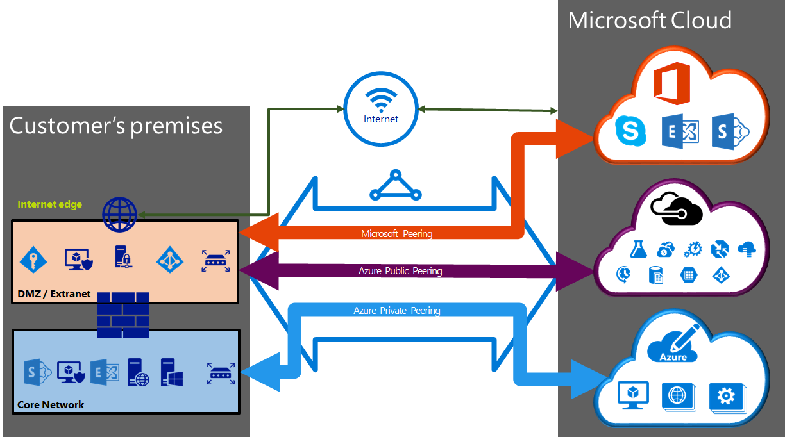

<properties 
   pageTitle="ExpressRoute circuits et les domaines de routage | Microsoft Azure"
   description="Cette page fournit une vue d’ensemble de ExpressRoute circuits et les domaines routage."
   documentationCenter="na"
   services="expressroute"
   authors="cherylmc"
   manager="carmonm"
   editor=""/>
<tags 
   ms.service="expressroute"
   ms.devlang="na"
   ms.topic="article" 
   ms.tgt_pltfrm="na"
   ms.workload="infrastructure-services" 
   ms.date="10/10/2016"
   ms.author="cherylmc"/>

# ExpressRoute circuits et les domaines de routage

 Vous devez vous procurer un *circuit ExpressRoute* pour vous connecter votre infrastructure en local à Microsoft via un fournisseur de connectivité. L’illustration suivante fournit une représentation logique de la connectivité entre votre WAN et Microsoft.

## Circuits ExpressRoute

Un *circuit ExpressRoute* représente une connexion entre votre infrastructure en local et services de cloud Microsoft via un fournisseur de connectivité logique. Vous pouvez commander plusieurs circuits ExpressRoute. Chaque circuit peut se trouver dans les mêmes ou différentes régions et pouvant être connecté à leur site via des fournisseurs de connectivité. 

Circuits ExpressRoute ne correspondent pas à n’importe quelle entité physique. Un circuit est identifié par une norme que GUID appelée qu’une clé de service (s-clé). La clé du service est la seule partie des informations échangées entre Microsoft, le fournisseur de connectivité et vous. La touche s n’est pas un code secret pour des raisons de sécurité. Il existe un mappage 1:1 entre un circuit ExpressRoute et la touche s.

Un circuit ExpressRoute peut avoir jusqu'à trois peerings indépendants : Azure public, Azure privé et Microsoft. Chaque peering est une paire de BGP indépendant sessions d'entre eux configuré redondants de disponibilité. Il y a un 1 : n (1 < = N < = 3) mappage entre un circuit ExpressRoute et le routage de domaines. Un circuit ExpressRoute peut avoir une, deux ou tous les trois peerings activés par circuit ExpressRoute.
 
Chaque circuit offre une bande passante fixe (50 Mbps, 100 Mbps, 200 Mbps, 500 Mbps, 1 Go/s, 10 Go/s) et est mappé à un fournisseur de connexion et un emplacement homologation. La bande passante que vous sélectionnez est être partagé entre tous les peerings pour le circuit. 

### Les quotas, les limites et limitations

Spécifications et limites quotas par défaut s’appliquent pour chaque circuit ExpressRoute. Reportez-vous à la page [abonnement Azure et limites de Service, les Quotas et contraintes](../azure-subscription-service-limits.md) pour obtenir des informations sur les quotas.

## ExpressRoute les domaines de routage

Un circuit ExpressRoute possède plusieurs domaines routage associés : Azure public, Azure privé et Microsoft. Chacun des domaines routage configuration est identique sur une paire de routeurs (dans actif ou le partage de charge configuration) de disponibilité. Services Azure classés comme *Azure public* et *Azure privé* pour représenter le modèles d’adressage IP.

### Peering privé

Azure calculer des services, à savoir les machines virtuelles (IaaS) et les services en nuage (PaaS), qui sont déployés dans un réseau virtuel pouvant être connectés via le domaine homologation privé. Le domaine homologation privé est considérée comme une extension de votre réseau principal dans Microsoft Azure approuvée. Vous pouvez configurer la connectivité bidirectionnelle entre votre réseau principal et réseaux virtuels Azure (VNets). Cette peering vous permet de vous connecter à des machines virtuelles et services directement sur les adresses IP privées en nuage.  

Vous pouvez vous connecter à plusieurs réseaux virtuel au domaine homologation privé. Examinez la [page du Forum aux questions](expressroute-faqs.md) pour plus d’informations sur les limites et limitations. Vous pouvez visiter la page [abonnement Azure et limites de Service, les Quotas et contraintes](../azure-subscription-service-limits.md) pour obtenir des informations sur les limites.  Reportez-vous à la page [routage](expressroute-routing.md) pour plus d’informations sur la configuration de routage.

### Peering public

Services tels que le stockage Azure, bases de données SQL et sites Web sont proposés dans les adresses IP publiques. Vous pouvez en privé se connecter aux services hébergés sur des adresses IP publiques, y compris les VIP de vos services cloud, via le domaine de routage homologation public. Vous pouvez connecter le domaine homologation public à votre DMZ et connectez-vous à tous les services Azure sur les adresses IP publiques à partir de votre réseau étendu sans avoir à vous connecter à internet. 

Connectivité est toujours initiée à partir de votre réseau étendu aux services Microsoft Azure. Services de Microsoft Azure ne seront pas en mesure d’établir des connexions à votre réseau à ce domaine de routage. Une fois peering public est activé, il se peut que vous ne pourrez pas vous connecter à tous les services Azure. Nous n’autorisent pas vous permet de choisir sélectivement des services dont nous annoncer itinéraires à. Vous pouvez consulter la liste des préfixes que nous annoncer à vous via cette peering dans la page de [Plages d’adresses IP centre de données Microsoft Azure](http://www.microsoft.com/download/details.aspx?id=41653) . La page est mis à jour toutes les semaines.

Vous pouvez définir des filtres de routage personnalisé au sein de votre réseau pour utiliser uniquement les itinéraires que vous avez besoin. Reportez-vous à la page [routage](expressroute-routing.md) pour plus d’informations sur la configuration de routage. Vous pouvez définir des filtres de routage personnalisé au sein de votre réseau pour utiliser uniquement les itinéraires que vous avez besoin. 

Consultez la [page du Forum aux questions](expressroute-faqs.md) pour plus d’informations sur les services pris en charge par le domaine de routage homologation public. 
 
### Microsoft peering

[AZURE.INCLUDE [expressroute-office365-include](../../includes/expressroute-office365-include.md)]

Connectivité à tous les autres Microsoft online services (par exemple, des services Office 365) sera via le Microsoft peering. Nous activer la connectivité bidirectionnelle entre vos services cloud WAN et Microsoft via le domaine de routage homologation Microsoft. Vous devez vous connecter aux services cloud Microsoft uniquement sur les adresses IP publiques appartenant à vous ou votre fournisseur de connectivité et vous devez respecter toutes les règles définies. Consultez la page [conditions préalables ExpressRoute](expressroute-prerequisites.md) pour plus d’informations.

Consultez la [page du Forum aux questions](expressroute-faqs.md) pour plus d’informations sur les services pris en charge, les coûts et détails de la configuration. Consultez la page [Emplacements ExpressRoute](expressroute-locations.md) pour plus d’informations sur la liste des fournisseurs de connectivité offrant homologation prise en charge de Microsoft.

## Routage de comparaison de domaine

Le tableau suivant compare les trois domaines routage.

||**Peering privé**|**Peering public**|**Microsoft Peering**|
|---|---|---|---|
|**Max. préfixes # pris en charge par peering**|et 4 000 par défaut, 10 000 avec ExpressRoute Premium|200|200|
|**Plages d’adresses IP pris en charge**|N’importe quelle adresse IPv4 valide au sein de votre réseau étendu.|Adresses IPv4 publiques appartenant à vous-même ou votre fournisseur de connectivité.|Adresses IPv4 publiques appartenant à vous-même ou votre fournisseur de connectivité.|
|**Nombre à la configuration requise**|Privée et publique sous forme de nombres. Vous devez être propriétaire du public en tant que nombre si vous choisissez d’utiliser une. | Privée et publique sous forme de nombres. Toutefois, vous devez prouver la propriété d’adresses IP publiques.| Privée et publique sous forme de nombres. Toutefois, vous devez prouver la propriété d’adresses IP publiques.|
|**Adresses IP de l’Interface routage**|Adresses IP public et RFC1918|Adresses IP publiques enregistrés pour vous dans les bureaux d’ordre routage.| Adresses IP publiques enregistrés pour vous dans les bureaux d’ordre routage.|
|**Prise en charge du hachage MD5**| Oui|Oui|Oui|

Vous pouvez choisir d’activer une ou plusieurs des domaines routage dans le cadre de leur circuit ExpressRoute. Vous pouvez choisir tous les domaines routage placer sur le réseau privé virtuel même si vous souhaitez les combiner dans un domaine de routage unique. Vous pouvez également les placer sur différents domaines routage, semblables au diagramme. La configuration recommandée est que peering privé est connecté directement au réseau principal, et le public et les liens d’homologation Microsoft sont connectés à votre DMZ.
 
Si vous souhaitez que toutes les sessions homologation trois, vous devez disposer des trois paires de sessions BGP (une paire pour chaque type homologation). Les paires de session BGP fournissent un lien hautement disponible. Si vous vous connectez via des fournisseurs de connectivité 2 calque, vous serez responsable de la configuration et la gestion du routage. Vous pouvez en savoir plus en consultant les [flux de travail](expressroute-workflows.md) de configuration de la ExpressRoute.

## Étapes suivantes

- Rechercher un fournisseur de services. Voir les [emplacements et les fournisseurs de services ExpressRoute](expressroute-locations.md).
- Assurez-vous que toutes les conditions préalables sont remplies. Voir [conditions préalables ExpressRoute](expressroute-prerequisites.md).
- Configurer votre connexion ExpressRoute.
    - [Créer un circuit ExpressRoute](expressroute-howto-circuit-classic.md)
    - [Configurer le routage (circuit peerings)](expressroute-howto-routing-classic.md)
    - [Lier un VNet à un circuit ExpressRoute](expressroute-howto-linkvnet-classic.md)
