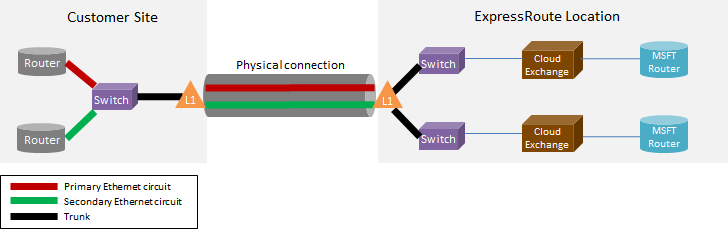

<properties
   pageTitle="ExpressRoute Forum aux questions"
   description="Le Forum aux questions ExpressRoute contient des informations sur la prise en charge des Services Azure, coût, données et connexions, SLA, fournisseurs et emplacements, la bande passante et des détails techniques supplémentaires."
   documentationCenter="na"
   services="expressroute"
   authors="cherylmc"
   manager="carmonm"
   editor=""/>
<tags
   ms.service="expressroute"
   ms.devlang="na"
   ms.topic="article" 
   ms.tgt_pltfrm="na"
   ms.workload="infrastructure-services"
   ms.date="10/10/2016"
   ms.author="cherylmc"/>

# ExpressRoute Forum aux questions

## Quelles sont les ExpressRoute ?
ExpressRoute est un service Azure qui vous permet de créer des connexions privées entre centres de données Microsoft et de l’infrastructure dans vos locaux ou dans une fonction d’un emplacement partagé. Connexions ExpressRoute ne pas passer en revue l’Internet public et offrent une sécurité renforcée, la fiabilité et vitesses avec latence inférieur que les connexions classiques via Internet.

### Quels sont les avantages de l’utilisation de connexions de réseau privé et ExpressRoute ?
Connexions ExpressRoute ne pas passer en revue l’Internet public et offrent une sécurité renforcée, la fiabilité et vitesses avec latence inférieur et cohérents que les connexions classiques via Internet. Dans certains cas, à l’aide de connexions ExpressRoute pour transférer des données entre local appareils et Azure peut générer des avantages des coûts de manière significative.

### À quels services cloud Microsoft sont pris en charge sur ExpressRoute ?
ExpressRoute prend en charge la plupart des services Microsoft Azure aujourd'hui, y compris Office 365.  Recherchez les mises à jour sur officielle plus rapidement.

### Où se trouve le service disponible ?
Consultez cette page pour l’emplacement du service et la disponibilité : [emplacements et partenaires ExpressRoute](expressroute-locations.md).

### Comment puis-je utiliser ExpressRoute pour vous connecter à Microsoft si je n’ai partenariat avec l’un des partenaires ExpressRoute-carrier ?
Vous pouvez sélectionner un opérateur régionaux et terre connexions Ethernet à un de l’échange pris en charge emplacements fournisseur. Vous pouvez ensuite homologue auprès de Microsoft à l’emplacement du fournisseur. Vérifier la dernière section du [emplacements et partenaires ExpressRoute](expressroute-locations.md) pour voir si votre fournisseur de services est présent dans un des emplacements exchange. Vous pouvez alors se procurer un circuit ExpressRoute via le fournisseur de services pour vous connecter à Azure.

### Combien coûte ExpressRoute coût ?
Vérifier le [tarifs plus](https://azure.microsoft.com/pricing/details/expressroute/) d’informations sur les tarifs.

### Si j’ai payer pour un circuit ExpressRoute d’une bande passante donnée, la connexion VPN que puis-je acheter à partir de mon fournisseur de services de réseau doit-il être la même vitesse ?
Non. Vous pouvez acheter une connexion VPN de n’importe quelle vitesse à partir de votre fournisseur de services. Toutefois, votre connexion à Azure est limités à la bande passante circuit ExpressRoute que vous achetez.

### Si j’ai payer pour un circuit ExpressRoute d’une bande passante donné, avez la possibilité de faire éclater jusqu'à vitesses supérieures si nécessaire ?
Oui. Circuits ExpressRoute sont configurés pour prendre en charge les cas où pouvez sélectionné jusqu'à deux fois la limite de bande passante que vous achetées pour sans frais supplémentaires. Contactez votre fournisseur de services si elles prend en charge cette fonctionnalité.

### Puis-je utiliser la même connexion de réseau privé virtuel réseau et d’autres services Azure simultanément ?
Oui. Un circuit ExpressRoute, une fois le programme d’installation vous permettra d’accéder aux services au sein d’un réseau virtuel et autres services Azure simultanément. Vous vous connectez à des réseaux virtuels sur le chemin d’accès homologation privé et d’autres services sur le chemin d’accès homologation public.

### ExpressRoute offre un contrat de niveau de Service (SLA) ?
Reportez-vous à la [page SLA ExpressRoute](https://azure.microsoft.com/support/legal/sla/) pour plus d’informations.

## Services pris en charge
Plus Azure services sont prises en charge sur ExpressRoute.

- Connectivité à machines virtuelles et services de cloud déployées dans les réseaux virtuels sont pris en charge sur le chemin d’accès homologation privé.
- Sites Web Azure sont pris en charge sur le chemin d’accès homologation public.
- Concentrateur IoT est pris en charge sur le chemin d’accès homologation public.
- Office 365 est pris en charge sur le chemin d’accès homologation Microsoft.
- Tous les autres services sont accessibles via le chemin d’accès homologation public. Les exceptions sont les suivantes :

    **Les services suivants ne sont pas prises en charge :**

    - CDN
    - Test de charge des Services équipe Visual Studio
    - Authentification multifacteur
    - Gestionnaire de trafic

## Données et connexions

### Existe-t-il des limites applicables à la quantité de données puis-je transférer à l’aide de ExpressRoute ?
Nous ne définissez pas une limite de la quantité de transfert de données. Reportez-vous aux [informations de tarification](https://azure.microsoft.com/pricing/details/expressroute/) pour plus d’informations sur les taux de bande passante.

### Quelles sont les vitesses connexion sont pris en charge par ExpressRoute ?
Pris en charge de la bande passante offres :

| Mbps 50, 100 Mbps, 200 Mbps, 500 Mbps, 1, 2 Go/s, 5 Go/s, 10 |

### Les fournisseurs de services sont disponibles ?
Voir les [emplacements et partenaires ExpressRoute](expressroute-locations.md) pour la liste des fournisseurs de services et emplacements.

## Détails techniques

### Quels sont les besoins techniques de connexion mon emplacement local vers Azure ?
Voir [page conditions préalables ExpressRoute](expressroute-prerequisites.md) pour les besoins.

### Les connexions au ExpressRoute redondantes ?
Oui. Chaque circuit itinéraire Express présente une paire de redondants croisée connexions configurées pour augmenter la disponibilité.

### Allez perdre connectivité si un de mes liens ExpressRoute échoue ?
Vous perdrez pas la connectivité si un des connexions croisées échoue. Une connexion redondante est disponible pour prendre en charge le chargement de votre réseau. Vous pouvez en outre créer plusieurs circuits dans un autre emplacement homologation atteindre tolérance de panne.

### Si je ne sais pas situé au niveau d’un échange de cloud et mon fournisseur de services offre connexion point à point, dois-je commander deux connexions physiques entre mon réseau local et Microsoft ? 
Non, vous devez uniquement une connexion physique si votre fournisseur de services peut créer deux circuits virtuels Ethernet sur la connexion physique. La connexion physique (par exemple, une fibre optique) se trouve à un calque 1 (L1) périphérique (voir l’image ci-dessous). Les deux circuits virtuels Ethernet sont marqués avec les ID de réseau local virtuel différents, une pour le circuit primaire et l’autre pour le moniteur secondaire. Les ID de réseau local virtuel se trouvent dans la 802. 1 q externe en-tête Ethernet. Le 802. 1 q interne en-tête Ethernet (non affichée) est mappé à un [domaine de routage ExpressRoute](expressroute-circuit-peerings.md)spécifique. 

### Puis-je prolonger un de mes réseaux virtuels vers Azure à l’aide de ExpressRoute ?
Non. Nous ne pas en charge des extensions de connectivité 2 couche dans Azure.

### Puis-je avoir plusieurs circuit ExpressRoute dans mon abonnement ?
Oui. Vous pouvez avoir plusieurs circuit ExpressRoute dans votre abonnement. La limite par défaut du nombre de circuits dédiés est définie sur 10. Vous pouvez contacter le Support Microsoft pour augmenter la limite si nécessaire.

### Puis-je avoir circuits ExpressRoute à partir des fournisseurs de services différente ?
Oui. Vous pouvez avoir ExpressRoute circuits avec nombreux fournisseurs de services. Chaque circuit ExpressRoute sera associé à un service fournisseur uniquement.

### Comment me connecter ma réseaux virtuels à un circuit ExpressRoute
Les étapes de base sont décrites ci-dessous.

- Vous devez établir un circuit ExpressRoute et le fournisseur de services activez-le.
- Vous ou le fournisseur doit configurer BGP homologation (s).
- Vous devez lier le réseau virtuel au circuit ExpressRoute.

Pour plus d’informations, voir [flux de travail ExpressRoute pour circuit États et de mise en service de circuit](expressroute-workflows.md) .

### Quels sont les limites de connectivité pour mon circuit ExpressRoute ?
Oui. Page [emplacements et partenaires ExpressRoute](expressroute-locations.md) fournit une vue d’ensemble des limites de connectivité pour un circuit ExpressRoute. Connectivité pour un circuit ExpressRoute est limitée à une seule région géopolitique. Connectivité peut être développée à l’intersection de régions géopolitiques en activant la fonctionnalité premium ExpressRoute.

### Puis-je créer un lien à plusieurs réseaux virtuel à un circuit ExpressRoute ?
Oui. Vous pouvez lier jusqu'à 10 réseaux virtuels à un circuit ExpressRoute.

### J’ai plusieurs abonnements Azure qui contiennent des réseaux virtuels. Puis-je me connecter réseaux virtuels qui se trouvent dans des abonnements distincts pour un seul circuit ExpressRoute ?
Oui. Vous pouvez autoriser jusqu'à 10 autres abonnements Azure à utiliser un seul circuit ExpressRoute. Cette limite peut être augmentée en activant la fonctionnalité premium ExpressRoute.

Pour plus d’informations, voir [partage un circuit ExpressRoute plusieurs abonnements](expressroute-howto-linkvnet-arm.md).

### Réseaux virtuels sont connectés à la même circuit isolé uns des autres ?
Non. Tous les réseaux virtuels liés à la même circuit ExpressRoute inclus dans le même domaine de routage et ne sont pas isolées du point de vue routage. Si vous devez router isolement, vous devez créer un circuit ExpressRoute distinct.

### Puis-je avoir un réseau virtuel connecté à plusieurs ExpressRoute circuit ?
Oui. Vous pouvez lier un seul réseau virtuel avec jusqu'à 4 circuits ExpressRoute. Ils doivent être classées parmi les différentes 4 [ExpressRoute emplacements](expressroute-locations.md).

### Puis-je accéder à internet à partir de mon virtuels réseaux connectés aux circuits ExpressRoute ?
Oui. Si vous avez publié pas itinéraires par défaut (0.0.0.0/0) ou préfixes d’itinéraire internet via la session BGP, il se peut que vous ne pourrez pas vous connecter à internet à partir d’un réseau virtuel lié à un circuit ExpressRoute.

### Puis-je empêcher la connectivité internet à virtuels réseaux connectés aux circuits ExpressRoute ?
Oui. Vous pouvez publier routes par défaut (0.0.0.0/0) pour bloquer toutes les connexions internet aux machines virtuelles déployée au sein d’un réseau virtuel et router tout le trafic arrière par le biais du circuit ExpressRoute. Notez que si vous publiez itinéraires par défaut, nous forcer le trafic aux services offerts sur public précédent homologation (par exemple, le stockage Azure et base de données SQL) dans vos locaux. Vous devrez configurer vos routeurs pour renvoyer le trafic vers Azure via le chemin d’accès homologation public ou via internet.

### Réseaux virtuels liés à la même circuit ExpressRoute peuvent communiquer avec eux ?
Oui. Machines virtuelles déployées dans virtuels réseaux connectés à la même circuit ExpressRoute puissent communiquer avec eux.

### Puis-je utiliser site à connectivité pour les réseaux virtuels conjointement avec ExpressRoute ?
Oui. ExpressRoute peut coexister avec VPN site à site.

### Puis-je déplacer un réseau virtuel de configuration de site à / point-à-site à utiliser ExpressRoute ?
Oui. Vous devrez créer une passerelle ExpressRoute au sein de votre réseau virtuel. Il y a un temps d’arrêt petite associée au processus.

### Que dois-je à se connecter au stockage Azure via ExpressRoute ?
Vous devez établir un circuit ExpressRoute et configurer des itinéraires pour peering public.

### Existe-t-il des limites sur le nombre d’itinéraires que je peux publier ?
Oui. Nous allons accepter jusqu'à 4000 préfixes itinéraire pour peering privé et 200 pour peering public et Microsoft peering. Vous pouvez l’augmenter à 10 000 itinéraires pour peering privé si vous activez la fonctionnalité premium ExpressRoute.

### Existe-t-il des restrictions sur les plages d’adresses IP que je peux publier sur la session BGP ?
Nous n’accepte pas préfixes privés (RFC1918) de la session BGP homologation Public et Microsoft.

### Que se passe-t-il si je dépasse le BGP limite ?
Sessions BGP seront supprimées. Une fois que le compte préfixe passe au-dessous de la limite, ils seront réinitialisés.

### Quelle est la durée ExpressRoute BGP ? Peut être ajusté ?
La durée est de 180. Les conservation messages sont envoyés toutes les 60 secondes. Ils sont résolus paramètres sur le côté de Microsoft qui ne peuvent pas être modifié.

### Une fois que j’ai annoncer l’itinéraire par défaut (0.0.0.0/0) à ma réseaux virtuels, je ne parviens pas à activer Windows s’exécutant sur mes machines virtuelles Azure. Comment pour résoudre ce problème ?
Les étapes suivantes permettent de Azure reconnaître la demande d’activation :

1. Établir le public peering pour votre circuit ExpressRoute.
2. Effectuer une recherche DNS et trouver l’adresse IP de **kms.core.windows.net**
3. Effectuez l’une des deux éléments suivants pour que le Service de gestion de clés vous reconnaisse que la requête d’activation provient d’Azure et respecte la demande.
    - Sur votre réseau local, acheminer le trafic destiné à l’adresse IP (obtenu à l’étape 2) en Azure via la peering public.
    - Avoir votre fournisseur NSP cheveux-épingler le trafic vers Azure via la peering public.

### Puis-je modifier la bande passante d’un circuit ExpressRoute ?
Oui. Vous pouvez augmenter la bande passante d’un circuit ExpressRoute sans avoir à supprimer vers le bas. Vous devrez assurer un suivi auprès de votre fournisseur de connectivité pour vous assurer qu’ils mettent à jour les limitations dans leurs réseaux pour prendre en charge de l’augmentation de la bande passante. Vous cependant pas seront en mesure de réduire la bande passante d’un circuit ExpressRoute. Avoir à recréer un circuit ExpressRoute et inférieure que la bande passante implique une destruction vers le bas.

### Comment modifier la bande passante d’un circuit ExpressRoute ?
Vous pouvez mettre à jour la bande passante du circuit ExpressRoute à l’aide de la mise à jour dédié circuit API et PowerShell applet de commande.

## ExpressRoute Premium

### Quelles sont les ExpressRoute premium ?
ExpressRoute premium est un ensemble de fonctionnalités ci-dessous.

 - Est augmenté routage limite de la table à partir de 4000 gammes à 10 000 itinéraires pour peering privé.
 - Augmenter le nombre de VNets pouvant être connectés au circuit ExpressRoute (valeur par défaut est 10). Reportez-vous au tableau ci-dessous pour plus d’informations.
 - Connectivité globale via le réseau principal de Microsoft. Vous pourrez maintenant lier un VNet dans une zone géographique géopolitique avec un circuit ExpressRoute dans une autre région. **Exemple :** Vous pouvez lier un VNet créé à l’Europe ouest dans un circuit ExpressRoute créé dans la Silicon Valley.
 - Connectivité à des services Office 365 et CRM Online.

### Combien VNets puis-je créer un lien à un circuit ExpressRoute si j’ai activé ExpressRoute premium ?
Les tableaux ci-dessous montrent les limites ExpressRoute et le nombre de VNets par circuit ExpressRoute.

[AZURE.INCLUDE [expressroute-limits](../../includes/expressroute-limits.md)]

### Comment faire pour activer ExpressRoute premium ?
Fonctionnalités premium ExpressRoute peuvent être activées lorsque la fonctionnalité est activée et peut être arrêtée en mettant à jour l’état de circuit. Vous pouvez activer premium ExpressRoute au moment de la création de circuit ou que vous pouvez appeler le circuit de mise à jour dédié API / applet de commande PowerShell pour activer ExpressRoute premium.

### Comment désactiver les ExpressRoute premium ?
Vous pouvez désactiver premium ExpressRoute en appelant la mise à jour dédié circuit API / applet de commande PowerShell vous devez vous assurer que vous avez mise à l’échelle votre connectivité doit respecter les limites par défaut avant de désactiver ExpressRoute premium. Nous ne pourra pas demande pour désactiver premium ExpressRoute si l’utilisation de votre utilise une échelle au-delà des limites par défaut.

### Puis-je puis-je sélectionner les fonctionnalités que je souhaite à partir de l’ensemble des fonctionnalités premium ?
Non. Vous ne serez pas en mesure de sélectionner les fonctionnalités que vous avez besoin. Nous activer toutes les fonctionnalités quand vous activez ExpressRoute premium.

### Combien coûte coût de premium ExpressRoute ?
Reportez-vous aux [informations de tarification](https://azure.microsoft.com/pricing/details/expressroute/) pour coût.

### Payer pour premium ExpressRoute outre standard ExpressRoute frais ?
Oui. ExpressRoute premium frais applicables en haut ExpressRoute circuit frais et requises par le fournisseur de connectivité.

## ExpressRoute et Services Office 365 et CRM en ligne

[AZURE.INCLUDE [expressroute-office365-include](../../includes/expressroute-office365-include.md)]

### Comment créer un circuit ExpressRoute pour vous connecter à des services Office 365 et CRM Online ?

1. Passez en revue la page de [conditions préalables ExpressRoute](expressroute-prerequisites.md) pour vous assurer que vous remplissez les conditions.
2. Passez en revue la liste des fournisseurs de services et emplacements [d’ExpressRoute partenaires et des emplacements](expressroute-locations.md) pour vous assurer que vos besoins de connectivité sont remplies.
3. Planifier vos besoins en passant en revue [planification réseau et optimisation des performances pour Office 365](http://aka.ms/tune/).
4. Suivez la procédure décrite dans les flux de travail ci-dessous pour configurer la connectivité [des flux de travail ExpressRoute pour circuit États et de mise en service de circuit](expressroute-workflows.md).

>[AZURE.IMPORTANT] Assurez-vous que vous avez activé composant additionnel premium ExpressRoute lors de la configuration de Business connectivity services Office 365 et CRM Online.

### Dois-je activer Azure Public Peering se connecter aux services Office 365 et CRM Online ?
Non, vous devez uniquement activer Microsoft Peering. Le trafic d’authentification pour Azure AD est envoyé à Microsoft Peering. 

### Mon circuits ExpressRoute existants peuvent prendre en charge les connexions à des services Office 365 et CRM Online ?
Oui. Votre circuit ExpressRoute existante peut être configuré pour prendre en charge de Business connectivity services Office 365. Assurez-vous d’avoir une capacité suffisante pour se connecter aux services Office 365 et vérifiez que vous avez activé le module complémentaire premium. [Planification réseau et optimisation des performances pour Office 365](http://aka.ms/tune/) vous aideront à planifier vos besoins. Consultez également [créer et modifier un circuit ExpressRoute](expressroute-howto-circuit-classic.md).

### Quels services sont accessibles via une connexion ExpressRoute Office 365 ?

Reportez-vous à la page [Office 365 URL et plages d’adresses IP](http://aka.ms/o365endpoints) pour une liste à jour des services pris en charge sur ExpressRoute.

### Combien coûte ExpressRoute pour les services Office 365 et coût CRM Online ?
Services Office 365 et CRM Online requiert complémentaire doit être activé. La [page Détails de tarification](https://azure.microsoft.com/pricing/details/expressroute/) fournit des détails des coûts pour ExpressRoute.

### Dans quelles régions ExpressRoute pour Office 365 en charge ?
Pour plus d’informations sur la liste des partenaires et des emplacements où ExpressRoute est pris en charge, voir [emplacements et partenaires ExpressRoute](expressroute-locations.md) .

### Puis-je accéder à Office 365 via internet même si ExpressRoute a été configurée pour mon organisation ?
Oui. Points de terminaison Office 365 service sont accessibles via internet, même si ExpressRoute a été configurée pour votre réseau. Si vous êtes dans un emplacement est configuré pour se connecter aux services Office 365 via ExpressRoute, vous vous connectez à ExpressRoute.

### Dynamics AX Online est accessible via une connexion ExpressRoute ?
Non, il n'est pas pris en charge.
