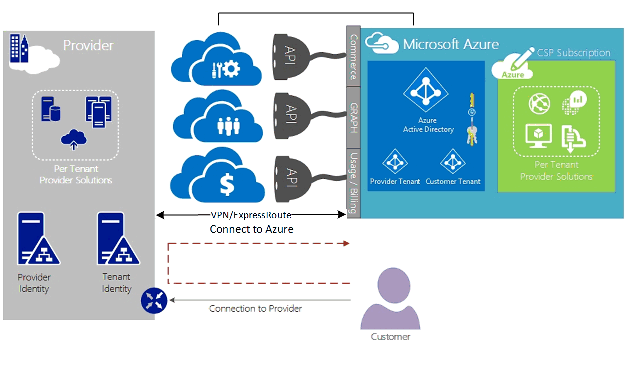
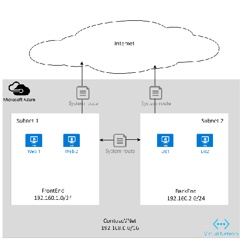
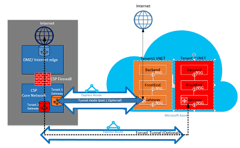

<properties
   pageTitle="Azure ExpressRoute pour les fournisseurs de solutions de Cloud | Microsoft Azure"
   description="Cet article fournit des informations pour les fournisseurs de services de Cloud choix pour intégrer des services Azure et ExpressRoute dans ses offres."
   documentationCenter="na"
   services="expressroute"
   authors="richcar"
   manager="carmonm"
   editor=""/>
<tags
   ms.service="expressroute"
   ms.devlang="na"
   ms.topic="get-started-article"
   ms.tgt_pltfrm="na"
   ms.workload="infrastructure-services"
   ms.date="10/10/2016"
   ms.author="richcar"/>

# ExpressRoute pour les fournisseurs de Solution Cloud (fournisseur)

Microsoft fournit des solutions et services Hyper-échelle aux revendeurs traditionnels et distributors (fournisseur) doivent pouvoir effectuer rapidement mise en service de nouveaux services pour vos clients sans avoir à investir dans le développement de ces nouveaux services. Pour autoriser le fournisseur de Solution Cloud (fournisseur) de gérer directement ces nouveaux services, Microsoft fournit des programmes et des API qui permettent le fournisseur gérer les ressources de Microsoft Azure au nom de vos clients. Un de ces ressources est ExpressRoute. ExpressRoute permet le fournisseur connecter ressources client existantes aux services Azure. ExpressRoute est un lien privé communications haut débit aux services dans Azure. 

ExpresRoute se compose de deux circuits de disponibilité qui sont joints à un seul client abonnements et ne peut pas être partagé par plusieurs clients. Chaque circuit devrait être interrompue dans un autre routeur conservent la disponibilité élevée.

>[AZURE.NOTE] Il existe VERR. MAJ la bande passante et connexion sur ExpressRoute qui signifie que mises en œuvre grande/complexe exigent plusieurs circuits ExpressRoute pour un seul client.

Microsoft Azure fournit un nombre croissant de services que vous pouvez offrir à vos clients.  Pour prendre meilleur parti de ces services exige l’utilisation des connexions de ExpressRoute pour fournir haut débit faible accès latence à l’environnement de Microsoft Azure.

## Gestion de Microsoft Azure
Microsoft fournit des fournisseurs avec API pour gérer les abonnements client Azure en autorisant programmation intégration avec vos propres systèmes de gestion du service. Fonctionnalités de gestion des pris en charge sont accessibles [ici](https://msdn.microsoft.com/library/partnercenter/dn974944.aspx).

## Gestion des ressources de Microsoft Azure
Selon le contrat avec votre client permet de déterminer le mode de gestion de l’abonnement. Le fournisseur permet de gérer directement la création et maintenance des ressources ou le client peut garder le contrôle de l’abonnement Microsoft Azure et de créer les ressources Azure dont elles ont besoin. Si votre client gère la création de ressources dans son abonnement Microsoft Azure ils utiliseront un des deux modèles : « Se connecter à » modèle, ou « Direct à ». Ces modèles sont décrites en détail dans les sections suivantes.  

### Modèle de se connecter à

  

Dans le modèle à se connecter, le fournisseur crée une connexion entre votre centre de données et d’abonnement Azure de votre client. La connexion directe est établie à l’aide de ExpressRoute, vous connectez votre réseau avec Azure. Votre client s’y connecte à votre réseau. Ce scénario requiert que le client passe à travers le réseau fournisseur pour accéder aux services Azure. 

Si votre client a autres abonnements Azure ne pas gérés par le vous, ils utiliseriez l’Internet public ou leur propre connexion privée pour vous connecter à ces services mis en service sous l’abonnement non fournisseur. 

Pour le fournisseur de gestion des services Azure, il est supposé que le fournisseur a un stockage d’identité établie précédemment qui doivent être dupliquée puis dans Azure Active Directory pour la gestion de son abonnement fournisseur via Administrate-On-Behalf-Of (AOBO). Pilotes clés pour ce scénario comprennent où un partenaire donné ou un fournisseur de services comporte une relation établie avec le client, le client utilise actuellement services fournisseur ou le partenaire a souhaite fournir une combinaison de solutions hébergé par un fournisseur et hébergé Azure pour offrir flexibilité et client adresse défis qui ne peut pas être satisfaites par fournisseur uniquement. Ce modèle est illustré dans **la Figure**, ci-dessous.

### Modèle de se connecter à

Dans le modèle à se connecter, le fournisseur de services crée une connexion entre le centre de données de leurs clients et l’abonnement Azure fournisseur sa mise en service à l’aide de ExpressRoute sur le client (client) réseau.

>[AZURE.NOTE] Le client nécessaires pour créer et gérer le circuit ExpressRoute pour ExpressRoute.  

Ce scénario de connectivité requiert que le client se connecte directement via un réseau des clients pour accéder aux abonnement Azure gérés par le fournisseur, en utilisant une connexion réseau directe qui est créée, appartenant à et gérée entièrement ou en partie par le client. Pour ces clients, qu'il est supposé que le fournisseur n’a pas actuellement un stockage d’identité établie, et le fournisseur pour aider au client réplication leur magasin identifier actuel dans Azure Active Directory pour la gestion de son abonnement via AOBO. Pilotes clés pour ce scénario comprennent où un partenaire donné ou un fournisseur de services comporte une relation établie avec le client, le client utilise actuellement services fournisseur, ou le partenaire a souhaite fournir des services basés sur des solutions hébergé Azure sans avoir besoin d’un centre de données fournisseur existant ou d’infrastructure.

Le choix entre ces deux option sont basées sur les besoins de vos clients et vos besoins en cours pour fournir des services Azure. Contrôlent les détails de ces modèles et l’accès basé sur un rôle associé, mise en réseau et les modèles de conception identité sont décrites en détail dans les liens suivants :
-   **Contrôle d’accès basé sur (rôle RBAC)** – RBAC est basé sur Azure Active Directory.  Pour plus d’informations sur RBAC Azure voir [ici](../active-directory/role-based-access-control-configure.md).
-   **Mise en réseau** – aborde les différentes rubriques de mise en réseau dans Microsoft Azure.
-   **Azure Active Directory (DAS)** – AAD fournit la gestion des identités pour Microsoft Azure et les applications de SaaS 3e partie. Pour plus d’informations sur, voir : Azure AD [ici](https://azure.microsoft.com/documentation/services/active-directory/).  

## Vitesses réseau
ExpressRoute prend en charge des vitesses réseau de 50 Mo/s à 10 Go/s. Cela permet aux clients d’acheter la quantité de bande passante requise pour leur environnement unique.

>[AZURE.NOTE] La bande passante réseau peut être augmentée selon vos besoins sans interrompre les communications, mais pour réduire le réseau vitesse requiert arrêt du circuit et recréer à la vitesse réseau.  

ExpressRoute prend en charge la connexion de plusieurs vNets à un seul circuit ExpressRoute pour une meilleure utilisation des connexions haut débit. Un seul circuit ExpressRoute peut être partagé entre plusieurs abonnements Azure appartenant au même client.

## Configuration de ExpressRoute
ExpressRoute peut être configuré pour prendre en charge trois types de trafic ([routage domaines](#ExpressRoute-routing-domains)) sur un seul circuit ExpressRoute. Ce trafic est séparée dans Microsoft peering, peering public Azure et peering privé. Vous pouvez choisir une ou toutes les types de trafic à être envoyé via un seul circuit ExpressRoute ou utiliser plusieurs circuits ExpressRoute selon la taille de la ExpressRoute circuit et isolement requis par votre client. La sécurisation de vos clients peut-être ne pas autoriser le trafic public et le trafic privé pour parcourir sur le même circuit.

### Modèle de se connecter à
Dans une configuration de se connecter à la vous serez responsable pour toutes les bases de mise en réseau pour vous connecter vos ressources de centre de données de clients pour les abonnements hébergés dans Azure. Chacun de vos clients qui souhaitent utiliser des fonctionnalités Azure devront leur propre connexion ExpressRoute, qui sera gérée par vous. Le vous allez utiliser les mêmes méthodes que le client utiliseriez pour se procurer le circuit ExpressRoute. Vous sera suivez la procédure décrite dans l’article de [flux de travail ExpressRoute](./expressroute-workflows.md) pour circuit mise en service et les États circuit. Le vous allez puis configurer les itinéraires bordure BGP (Gateway Protocol) pour contrôler le trafic entre le réseau local et vNet Azure.

### Modèle de se connecter à
Dans une configuration à se connecter, votre client a une connexion existante à Azure déjà ou se connecte au fournisseur de services internet liaison ExpressRoute à partir de votre centre de données du client directement vers Azure, au lieu de votre centre de données. Pour commencer le processus de configuration, votre client sera suivez les étapes comme décrit dans le modèle à se connecter, ci-dessus. Une fois que le circuit a été établi que votre client devra configurer les routeurs en local pour pouvoir accéder à votre réseau et le vNets Azure.

Vous pouvez vous aider à configurer la connexion et la configuration d’itinéraires pour autoriser les ressources dans vos centres de communiquer avec les ressources client dans votre centre de données, ou les ressources hébergés dans Azure.

## ExpressRoute les domaines de routage
ExpressRoute propose trois domaines routage : public, privé et Microsoft peering. Chacun des domaines routage sont configurés avec routeurs identiques dans configuration actif de disponibilité. Pour plus d’informations sur ExpressRoute domaines routage recherchez [ici](./expressroute-circuit-peerings.md).

Vous pouvez définir des filtres d’itinéraires personnalisés pour autoriser uniquement l’itinéraire parcouru que vous souhaitez autoriser ou vous avez besoin. Pour plus d’informations ou pour apprendre à effectuer ces modifications voir l’article : [créer et modifier la gamme pour un circuit ExpressRoute à l’aide de PowerShell](./expressroute-howto-routing-classic.md) pour plus d’informations sur les filtres de routage.

>[AZURE.NOTE] Pour Microsoft et Peering Public connectivité doit être via une adresse IP publique appartienne par le client ou fournisseur et doit respecter toutes les règles définies. Pour plus d’informations, consultez la page [Conditions préalables ExpressRoute](expressroute-prerequisites.md) .  

## Routage
ExpressRoute se connecte aux réseaux via la passerelle réseau virtuel Azure Azure. Les passerelles réseau offrent routage des réseaux virtuels Azure.

Créer des réseaux virtuels Azure également crée une table de routage par défaut pour le vNet diriger le trafic vers ou à partir de sous-réseaux de la vNet. Si la table d’itinéraires par défaut est insuffisante pour la solution personnalisée itinéraires peuvent être créés pour acheminer le trafic sortant pour appareils personnalisés ou en bloc itinéraires à sous-réseaux spécifiques ou des réseaux externes.

### Valeur par défaut de routage
La table d’itinéraires par défaut inclut les itinéraires suivants :

- Routage au sein d’un sous-réseau
- Sous-réseau-à-un au sein du réseau virtuel
- À Internet
- Réseau réseau-à-virtuel virtuel à l’aide de la passerelle VPN
- Virtuel réseau-à-réseau local à l’aide d’une passerelle VPN ou ExpressRoute

  

### Routage définies par l’utilisateur (UDR)
Itinéraires définis par l’utilisateur permettent le contrôle du trafic sortant à partir du sous-réseau affecté à d’autres sous-réseaux dans le réseau virtuel ou sur une des autres passerelles prédéfinies (ExpressRoute ; internet ou VPN). La table de routage système par défaut peut être remplacée par une table de routage définies par l’utilisateur qui remplace la table de routage par défaut par des itinéraires personnalisés. Avec le routage de définies par l’utilisateur, les clients peuvent créer des itinéraires spécifiques aux appareils tels que pare-feux ou appareils de détection des intrusions ou bloquer l’accès à des sous-réseaux spécifiques à partir du sous-réseau qui héberge l’itinéraire définies par l’utilisateur. Pour une vue d’ensemble des itinéraires définies par l’utilisateur recherchez [ici](../virtual-network/virtual-networks-udr-overview.md). 

## Sécurité
Selon le modèle est en cours d’utilisation, à se connecter ou se connecter à, votre client définit les stratégies de sécurité dans leur vNet ou fournit des exigences de la stratégie pour le fournisseur à définir pour leur vNets la sécurité. Les critères de sécurité suivants peuvent être définis :

1.  **Client isolement** — plateforme Azure le fournit isolement client en stockant des informations Réf client et vNet dans une base de données sécurisée, qui est utilisée pour encapsuler le trafic de chaque client dans un tunnel GRE.
2.  Règles de **Groupe de sécurité réseau (NSG)** permettent de définir le trafic autorisé vers et depuis les sous-réseaux de vNets dans Azure. Par défaut, la NSG contiennent des règles de bloc pour bloquer le trafic Internet vers le vNet et autoriser les règles pour le trafic au sein d’un vNet. Pour plus d’informations sur les groupes de sécurité réseau recherchez [ici](https://azure.microsoft.com/blog/network-security-groups/).
3.  **Forcer tunnel** : il s’agit d’une option de rediriger le trafic internet lié d’origine dans Azure soient redirigés via la connexion ExpressRoute au centre de données locale activé. Pour plus d’informations sur requis tunnel recherchez [ici](./expressroute-routing.md#advertising-default-routes).  

4.  **Chiffrement** , même si les circuits ExpressRoute sont réservés à un client donné, il est possible que le fournisseur du réseau peut être violation, permettant à un intrus d’examiner le trafic de paquets. Pour résoudre ce potentiel, un client ou fournisseur pouvez chiffrer le trafic via la connexion en définissant des stratégies de mode de tunnel IPSec pour tout le trafic circulant entre les ressources locaux et l’Azure ressources (reportez-vous au mode Tunnel facultatif IPSec pour le client 1 dans la Figure 5 : sécurité ExpressRoute, ci-dessus). La deuxième option serait d’utiliser un pare-feu à chaque le point de terminaison du circuit ExpressRoute. Cette opération requiert plu partie 3e du pare-feu machines virtuelles et des équipements soient installés sur les deux extrémités pour chiffrer le trafic via le circuit ExpressRoute.

  

## Étapes suivantes
Le service Cloud Solution fournisseur vous permet d’augmenter votre valeur à vos clients sans qu’il soit nécessaire pour des achats infrastructure et fonctionnalité coûteux, tout en conservant votre position comme fournisseur de sous-traitance principal. Intégration transparente avec Microsoft Azure peut être exécutée via l’API fournisseur, ce qui vous permet d’intégrer la gestion de Microsoft Azure vos structures de gestion existant.  

Vous trouverez des informations supplémentaires sur les liens suivants :

[Programme Microsoft Cloud Solution Provider](https://partner.microsoft.com/en-US/Solutions/cloud-reseller-overview).  
[Préparez-vous à transact comme un fournisseur de Solution Cloud](https://partner.microsoft.com/en-us/solutions/cloud-reseller-pre-launch).  
[Fournisseur de Solution Microsoft Cloud ressources](https://partner.microsoft.com/en-us/solutions/cloud-reseller-resources).
