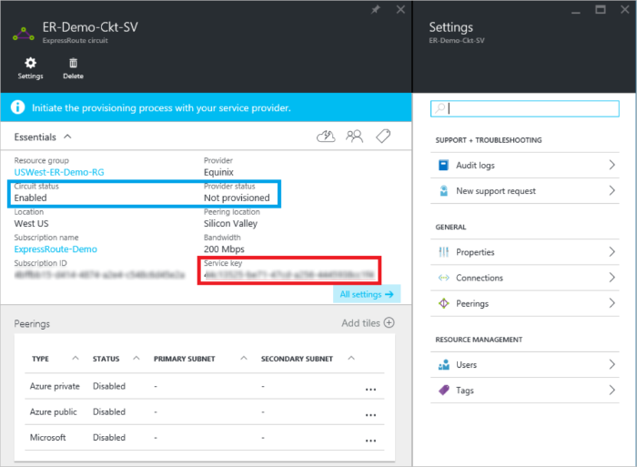
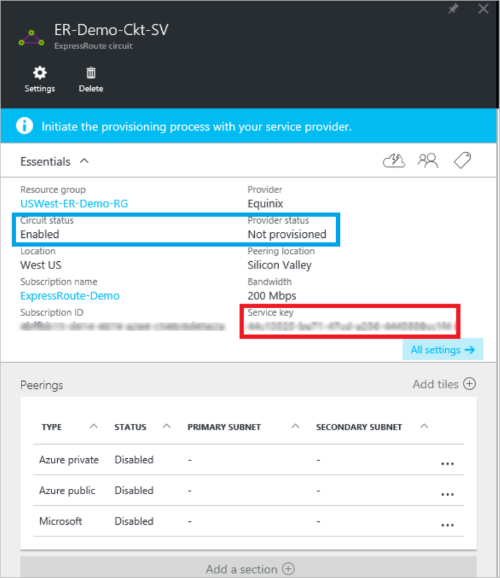
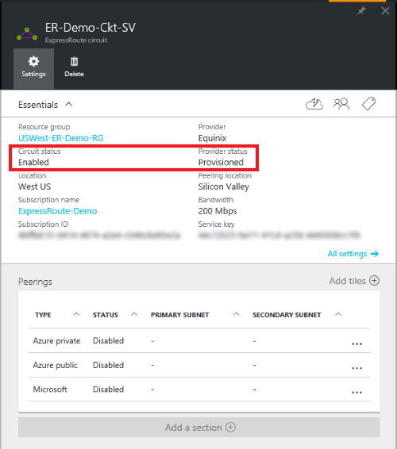

<properties
   pageTitle="Créer et modifier un circuit ExpressRoute en utilisant le Gestionnaire de ressources et le portail Azure | Microsoft Azure"
   description="Cet article décrit comment créer, mettre en service, vérifiez, mettre à jour, supprimer et deprovision un circuit ExpressRoute."
   documentationCenter="na"
   services="expressroute"
   authors="cherylmc"
   manager="carmonm"
   editor=""
   tags="azure-resource-manager"/>
<tags
   ms.service="expressroute"
   ms.devlang="na"
   ms.topic="article"
   ms.tgt_pltfrm="na"
   ms.workload="infrastructure-services"
   ms.date="10/10/2016"
   ms.author="cherylmc"/>

# Créer et modifier un circuit ExpressRoute

> [AZURE.SELECTOR]
[Portail Azure - Gestionnaire de ressources](expressroute-howto-circuit-portal-resource-manager.md)
[PowerShell - Gestionnaire de ressources](expressroute-howto-circuit-arm.md)
[PowerShell - classique](expressroute-howto-circuit-classic.md)

Cet article décrit comment créer un circuit Azure ExpressRoute à l’aide du portail Azure et le modèle de déploiement d’Azure le Gestionnaire de ressources. Les étapes suivantes montrent également comment vérifier l’état du circuit, mettre à jour, ou supprimer et deprovision il.

**À propos des modèles de déploiement d’Azure**

[AZURE.INCLUDE [vpn-gateway-clasic-rm](../../includes/vpn-gateway-classic-rm-include.md)] 

## Avant de commencer

- Passez en revue les [conditions requises](expressroute-prerequisites.md) et les [flux de travail](expressroute-workflows.md) avant de commencer la configuration.
- Vérifiez que vous avez accès au [portail Azure](https://portal.azure.com).
- Vérifiez que vous êtes autorisé à créer des ressources de mise en réseau. Contactez votre administrateur de compte si vous ne disposez pas des autorisations appropriées.

## Créer et mettre en service un circuit ExpressRoute

### 1. Connectez-vous au portail Azure

À partir d’un navigateur, accédez au [portail Azure](http://portal.azure.com) et connectez-vous avec votre compte Azure.

### 2. créer un nouveau circuit ExpressRoute

>[AZURE.IMPORTANT] Votre circuit ExpressRoute est facturé depuis le moment où qu'une clé de service est émise. Assurez-vous que vous effectuez cette opération lorsque le fournisseur de connectivité est prêt à mettre en service le circuit.

1. Vous pouvez créer un circuit ExpressRoute en sélectionnant l’option pour créer une nouvelle ressource. Cliquez sur **Nouveau** > **réseau** > **ExpressRoute**, comme le montre l’image suivante :

    

2. Après avoir cliqué sur **ExpressRoute**, vous verrez la carte **circuit ExpressRoute créer** . Lorsque vous êtes renseigner les valeurs de cette carte, assurez-vous que vous spécifiez la couche de référence (SKU) correct et de contrôle de données.

    - **Niveau** détermine si une norme ExpressRoute ou un module complémentaire premium ExpressRoute est activé. Vous pouvez spécifier **Standard** pour obtenir la référence (SKU) ou **Premium** standard pour le composant additionnel premium.

    - **Contrôle de données** détermine le type de facturation. Vous pouvez spécifier **limitées** pour un plan de données limitée et **illimitée** pour un plan de données illimité. Notez que vous pouvez modifier le type de facturation de **limitées** à **illimité**, mais vous ne pouvez pas modifier le type de **illimité** à **limitées**.

    

>[AZURE.IMPORTANT] Sachez que l’emplacement Peering indique l' [endroit](expressroute-locations.md) où vous soyez homologue avec Microsoft. Ce n’est **pas** lié à une propriété « Emplacement », qui fait référence à la géographie où se trouve le fournisseur de ressources réseau Azure. Pendant qu’ils ne sont pas liées, il est judicieux de choisir un fournisseur de ressources réseau géographiquement près de l’emplacement du circuit Peering. 

### 3. afficher les circuits et les propriétés

**Afficher tous les circuits**

Vous pouvez afficher tous les circuits que vous avez créé en sélectionnant **toutes les ressources** dans le menu de gauche.
    

**Afficher les propriétés**

    You can view the properties of the circuit by selecting it. On this blade, note the service key for the circuit. You must copy the circuit key for your circuit and pass it down to the service provider to complete the provisioning process. The circuit key is specific to your circuit.

### 4. envoyer la clé du service à votre fournisseur de connectivité de mise en service

Dans cette carte, **état du fournisseur** fournit des informations sur l’état actuel de mise en service sur le côté de fournisseur de services. **État circuit** fournit l’état sur le côté de Microsoft. Pour plus d’informations sur circuit mise en service des États, voir l’article de [flux de travail](expressroute-workflows.md#expressroute-circuit-provisioning-states) .

Lorsque vous créez un nouveau circuit ExpressRoute, le circuit sera dans l’état suivant :

État du fournisseur : ne pas sa mise en service 
État de circuit : activé

Le circuit changent à l’état suivant lorsque le fournisseur de connectivité est en train d’activation pour vous :

État du fournisseur : mise en service 
État de circuit : activé

Pour pouvoir être en mesure d’utiliser un circuit ExpressRoute, il doit être placé dans l’état suivant :

État du fournisseur : sa mise en service 
État de circuit : activé

### 5. régulièrement vérifier l’état et l’état de la touche circuit

Vous pouvez afficher les propriétés du circuit qui vous intéresse en le sélectionnant. Vérifier l' **état du fournisseur** et vérifiez qu’il est déplacé vers **Provisioned** avant de poursuivre.

### 6. créer votre configuration de routage

Pour obtenir des instructions étape par étape, reportez-vous à l’article [configuration du routage circuit ExpressRoute](expressroute-howto-routing-portal-resource-manager.md) pour créer et modifier des circuit peerings.

>[AZURE.IMPORTANT] Ces instructions s’appliquent uniquement à circuits créés avec les fournisseurs de services qui proposent des services de connectivité 2 calque. Si vous utilisez un fournisseur de services qui propose gérées layer 3 services (généralement un IP VPN, comme MPLS), votre fournisseur de connectivité configurer et gérer le routage pour vous.

### 7. lier un réseau virtuel à un circuit ExpressRoute

Ensuite, lier un réseau virtuel à votre circuit ExpressRoute. Utilisez l’article [réseaux virtuels Linking aux circuits ExpressRoute](expressroute-howto-linkvnet-arm.md) lorsque vous travaillez avec le modèle de déploiement du Gestionnaire de ressources.

## Obtention de l’état d’un circuit ExpressRoute

Vous pouvez afficher l’état d’un circuit en le sélectionnant. 

## Modifier un circuit ExpressRoute

Vous pouvez modifier certaines propriétés d’un circuit ExpressRoute sans ayant un impact sur la connectivité. Pour l’instant, vous ne pouvez pas modifier les propriétés de circuit ExpressRoute à l’aide du portail Azure. Toutefois, vous pouvez utiliser PowerShell pour modifier les propriétés de circuit. Pour plus d’informations, voir la section [modification un circuit ExpressRoute à l’aide de PowerShell](expressroute-howto-circuit-arm.md#modify).

Vous pouvez effectuer les opérations suivantes avec sans interruption de service :

- Activer ou désactiver un module complémentaire premium ExpressRoute pour votre circuit ExpressRoute.

- Augmenter la bande passante de votre circuit ExpressRoute. Notez que la bande passante d’un circuit de mise à niveau n’est pas pris en charge. 

- Modifier le plan de mesure à partir des données limitées aux données illimité. Notez que le plan de contrôle de la modification de données illimité aux données limitées n’est pas pris en charge.

-  Vous pouvez activer et désactiver **Autoriser les opérations classique**.

Pour plus d’informations sur les limites et limitations, consultez le [Forum aux questions sur ExpressRoute](expressroute-faqs.md).

## Annulation et suppression d’un circuit ExpressRoute

Vous pouvez supprimer votre circuit ExpressRoute en sélectionnant l’icône **Supprimer** . Notez les points suivants :

- Vous devez supprimer le lien tous les réseaux virtuels du circuit ExpressRoute. Si cette opération échoue, vérifiez si les réseaux virtuels sont liés au circuit.

- Si l’état de mise en service de fournisseur de service de circuit ExpressRoute est **Provisioning** ou **Provisioned** vous devez travailler avec votre fournisseur de services à deprovision le circuit sur leur côté. Nous continuent à réserver des ressources et vous les facturer jusqu'à ce que le fournisseur de services valide le circuit d’annulation et nous avertit.

- Si le fournisseur de services a annulé le circuit (l’état de mise en service de fournisseur de service est défini sur **non mis en service**) vous pouvez ensuite supprimer le circuit. Cette commande arrête de facturation pour le circuit

## Étapes suivantes

Après avoir créé votre circuit, vérifiez que vous effectuez le des opérations suivantes :

- [Créer et modifier la gamme pour votre circuit ExpressRoute](expressroute-howto-routing-portal-resource-manager.md)
- [Créer un lien vers votre circuit ExpressRoute votre réseau virtuel](expressroute-howto-linkvnet-arm.md)
