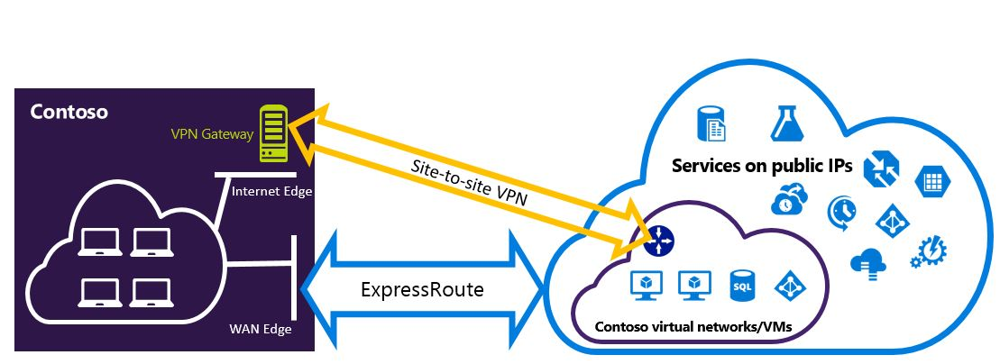

<properties
   pageTitle="Configurer des connexions VPN Expressroute et de Site à qui peuvent coexister | Microsoft Azure"
   description="Cet article vous guide dans la configuration ExpressRoute et une connexion VPN de Site à qui peut coexister pour le modèle de déploiement classique."
   documentationCenter="na"
   services="expressroute"
   authors="charwen"
   manager="carmonm"
   editor=""
   tags="azure-service-management"/>
<tags
   ms.service="expressroute"
   ms.devlang="na"
   ms.topic="get-started-article"
   ms.tgt_pltfrm="na"
   ms.workload="infrastructure-services"
   ms.date="10/10/2016"
   ms.author="charwen"/>

# Configurer les connexions pouvant coexistence ExpressRoute et Site-à-Site pour le modèle de déploiement classique

> [AZURE.SELECTOR]
- [PowerShell - Gestionnaire de ressources](expressroute-howto-coexist-resource-manager.md)
- [PowerShell - classique](expressroute-howto-coexist-classic.md)

La possibilité de configuration du Site à VPN et ExpressRoute présente plusieurs avantages. Vous pouvez configurer VPN de Site à comme un chemin d’accès de basculement sécurisé pour ExressRoute, ou utiliser VPN de Site à vous connecter aux sites qui ne sont pas connectés via ExpressRoute. Cet article aborde les étapes pour configurer les deux scénarios dans cet article. Cet article s’applique au modèle de déploiement classique. Cette configuration n’est pas disponible dans le portail.

**À propos des modèles de déploiement d’Azure**

[AZURE.INCLUDE [vpn-gateway-clasic-rm](../../includes/vpn-gateway-classic-rm-include.md)] 

>[AZURE.IMPORTANT] Circuits ExpressRoute doivent être préconfigurés avant de suivre les instructions ci-dessous. Vérifiez que vous avez suivi les repères pour [créer un circuit ExpressRoute](expressroute-howto-circuit-classic.md) et [configurer le routage](expressroute-howto-routing-classic.md) avant de suivre les étapes ci-dessous.

## Spécifications et limites

- **Routage de voies n’est pas pris en charge.** Vous ne pouvez pas Router (via Azure) entre votre réseau local connectée via VPN de Site à Site et votre réseau local connectée via ExpressRoute.
- **Point-à-site n’est pas pris en charge.** Vous ne pouvez pas activer les connexions de VPN point-à-site pour la même VNet qui est connecté à ExpressRoute. Point-à-site VPN et ExpressRoute ne peuvent pas coexister pour la même VNet.
- **Tunnel forcé ne peut pas être activé sur la passerelle VPN de Site à.** Vous pouvez uniquement « forcer « tout le trafic Internet liées aux revenir à votre réseau local via ExpressRoute.
- **Passerelle de référence (SKU) base n’est pas pris en charge.** Vous devez utiliser une passerelle base SKU pour la [passerelle ExpressRoute](expressroute-about-virtual-network-gateways.md) et la [passerelle VPN](../vpn-gateway/vpn-gateway-about-vpngateways.md).
- **Uniquement acheminer VPN passerelle est pris en charge.** Vous devez utiliser un itinéraire [Passerelle VPN](../vpn-gateway/vpn-gateway-about-vpngateways.md).
- **Itinéraire statique doit être configuré pour votre passerelle VPN.** Si votre réseau local est connecté à ExpressRoute et un réseau privé virtuel de Site à Site, vous devez disposer d’un itinéraire statique configuré dans votre réseau local pour acheminer la connexion VPN de Site à Site à l’Internet public.
- **ExpressRoute passerelle doit être configuré en premier.** Vous devez d’abord créer la passerelle ExpressRoute avant d’ajouter la passerelle VPN de Site à.

## Conceptions de configuration

### Configurer un réseau privé virtuel de Site à comme un chemin d’accès de basculement pour ExpressRoute

Vous pouvez configurer une connexion VPN de Site à comme une sauvegarde pour ExpressRoute. Cela s’applique uniquement aux réseaux virtuels lié au chemin homologation privé Azure. Il n’existe aucune solution de basculement basée sur VPN pour les services accessibles via Azure public et peerings Microsoft. Le circuit ExpressRoute est toujours le lien principal. Flux de données via le chemin d’accès de Site à Site VPN uniquement si le circuit ExpressRoute échoue. 

### Configurer un réseau privé virtuel de Site à vous connecter aux sites ne pas connectés à ExpressRoute

Vous pouvez configurer votre réseau où certains sites se connectent directement au Azure via VPN de Site à et certains sites se connectent via ExpressRoute. 

>[AZURE.NOTE] Vous ne pouvez pas configurer un réseau virtuel comme routeur lors des transferts.

## Sélection de la procédure à suivre

Il existe deux différents jeux de procédures pour choisir parmi afin de configurer les connexions peuvent coexister. La procédure de configuration que vous sélectionnez varie selon que vous avez un réseau virtuel que vous voulez vous connecter ou vous voulez créer un nouveau réseau virtuel.

- J’ai n’ont un VNet et avez besoin d’en créer un.
    
    Si vous n’avez pas un réseau virtuel, cette procédure vous guidera créez un réseau virtuel à l’aide du modèle de déploiement classique et création de connexions de VPN ExpressRoute et Site à nouveau. Pour configurer, suivez les étapes décrites dans la section de l’article [pour créer des connexions pouvant coexistence et un réseau virtuel](#new).

- J’ai déjà un modèle de déploiement classique VNet.

    Un réseau virtuel est peut-être déjà en place avec une connexion VPN de Site à Site existante ou ExpressRoute. La section de l’article [pour configurer les connexions coexsiting pour un VNet existant](#add) vous aidera à la suppression de la passerelle et puis en créant des connexions de VPN ExpressRoute et de Site à nouveau. Notez que lorsque vous créez les nouvelles connexions, les étapes doivent être effectuées dans un ordre spécifique très. Ne suivez les instructions dans d’autres articles pour créer vos passerelles et les connexions.

    Dans cette procédure, créer des connexions qui peuvent coexister sera nécessitent supprimer votre passerelle, puis configurez nouvelles passerelles. Cela signifie que vous n’avez temps d’arrêt pour vos connexions entre locaux tant que supprimer et recréer votre passerelle et les connexions, mais vous n’aurez pas à migrer vos ordinateurs virtuels ou les services à un nouveau réseau virtuel. Vos machines virtuelles et services seront en mesure de communiquer les via l’équilibrage de charge pendant que vous configurez votre passerelle s’ils sont configurés pour ce faire.

## Pour créer un nouveau réseau virtuel et connexions pouvant coexistence

Cette procédure sera vous aider à créer un VNet et créer des connexions ExpressRoute qui vont coexister et Site à.

1. Vous devez installer la dernière version des applets de commande PowerShell Azure. Découvrez [comment installer et configurer Azure PowerShell](../powershell-install-configure.md) pour plus d’informations sur l’installation les applets de commande PowerShell. Notez que les applets de commande que vous utiliserez pour cette configuration peut être légèrement différente de celle que vous connaissez peut-être. Veillez à utiliser les applets de commande spécifié dans ces instructions. 

2. Créez un schéma pour votre réseau virtuel. Pour plus d’informations sur le schéma de configuration, consultez le [schéma de configuration de réseau virtuel Azure](https://msdn.microsoft.com/library/azure/jj157100.aspx).

    Lorsque vous créez votre schéma, vérifiez que vous utilisez les valeurs suivantes :

    - Le sous-réseau passerelle pour le réseau virtuel doit être /27 ou un préfixe plus court (par exemple, /26 ou /25).
    - Le type de connexion passerelle est « dédié ».

              <VirtualNetworkSite name="MyAzureVNET" Location="Central US">
                <AddressSpace>
                  <AddressPrefix>10.17.159.192/26</AddressPrefix>
                </AddressSpace>
                <Subnets>
                  <Subnet name="Subnet-1">
                    <AddressPrefix>10.17.159.192/27</AddressPrefix>
                  </Subnet>
                  <Subnet name="GatewaySubnet">
                    <AddressPrefix>10.17.159.224/27</AddressPrefix>
                  </Subnet>
                </Subnets>
                <Gateway>
                  <ConnectionsToLocalNetwork>
                    <LocalNetworkSiteRef name="MyLocalNetwork">
                      <Connection type="Dedicated" />
                    </LocalNetworkSiteRef>
                  </ConnectionsToLocalNetwork>
                </Gateway>
              </VirtualNetworkSite>

3. Après avoir créé et configuré votre fichier de schéma xml, téléchargez le fichier. Cela créera votre réseau virtuel.

    Utiliser l’applet de commande suivante pour télécharger votre fichier, remplacez la valeur par votre propre.

        Set-AzureVNetConfig -ConfigurationPath 'C:\NetworkConfig.xml'

4. Créer une passerelle ExpressRoute. Veillez à spécifier la GatewaySKU comme *Standard*, *bien*, ou *UltraPerformance* et le GatewayType comme *DynamicRouting*.

    Utiliser l’exemple suivant, en remplaçant les valeurs de votre propre.

        New-AzureVNetGateway -VNetName MyAzureVNET -GatewayType DynamicRouting -GatewaySKU HighPerformance

5. Lien de la passerelle ExpressRoute au circuit ExpressRoute. Une fois cette étape terminée, la connexion entre votre réseau local et Azure, via ExpressRoute, est établie.

        New-AzureDedicatedCircuitLink -ServiceKey <service-key> -VNetName MyAzureVNET

6. Ensuite, créez votre passerelle VPN de Site à. La GatewaySKU doit être *Standard*, *bien*, ou *UltraPerformance* et le GatewayType doivent être *DynamicRouting*.

        New-AzureVirtualNetworkGateway -VNetName MyAzureVNET -GatewayName S2SVPN -GatewayType DynamicRouting -GatewaySKU  HighPerformance

    Pour récupérer les paramètres de la passerelle réseau virtuel, y compris l’ID de la passerelle et l’adresse IP publique, utilisez la `Get-AzureVirtualNetworkGateway` applet de commande.

        Get-AzureVirtualNetworkGateway

        GatewayId            : 348ae011-ffa9-4add-b530-7cb30010565e
        GatewayName          : S2SVPN
        LastEventData        :
        GatewayType          : DynamicRouting
        LastEventTimeStamp   : 5/29/2015 4:41:41 PM
        LastEventMessage     : Successfully created a gateway for the following virtual network: GNSDesMoines
        LastEventID          : 23002
        State                : Provisioned
        VIPAddress           : 104.43.x.y
        DefaultSite          :
        GatewaySKU           : HighPerformance
        Location             :
        VnetId               : 979aabcf-e47f-4136-ab9b-b4780c1e1bd5
        SubnetId             :
        EnableBgp            : False
        OperationDescription : Get-AzureVirtualNetworkGateway
        OperationId          : 42773656-85e1-a6b6-8705-35473f1e6f6a
        OperationStatus      : Succeeded

7. Créer un site local entité de passerelle VPN. Cette commande ne configurez votre passerelle VPN locale. Au lieu de cela, il vous permet de fournir les paramètres de la passerelle locale, comme l’adresse IP publique et le local adresse espace, de sorte que la passerelle VPN Azure peut se connecter en.

    >[AZURE.IMPORTANT] Le site local pour le réseau privé virtuel Site-à-Site n’est pas défini dans le netcfg. À la place, vous devez utiliser cette applet de commande pour spécifier les paramètres de site local. Vous ne pouvez pas définir à l’aide du portail ou le fichier netcfg.

    Utiliser l’exemple suivant, en remplaçant les valeurs par votre propre.

        New-AzureLocalNetworkGateway -GatewayName MyLocalNetwork -IpAddress <MyLocalGatewayIp> -AddressSpace <MyLocalNetworkAddress>

    > [AZURE.NOTE] Si votre réseau local possède plusieurs itinéraires, vous pouvez passer les sous forme de tableau.  $MyLocalNetworkAddress =@("10.1.2.0/24","10.1.3.0/24","10.2.1.0/24")  

    Pour récupérer les paramètres de la passerelle réseau virtuel, y compris l’ID de la passerelle et l’adresse IP publique, utilisez la `Get-AzureVirtualNetworkGateway` applet de commande. Voir l’exemple suivant.

        Get-AzureLocalNetworkGateway

        GatewayId            : 532cb428-8c8c-4596-9a4f-7ae3a9fcd01b
        GatewayName          : MyLocalNetwork
        IpAddress            : 23.39.x.y
        AddressSpace         : {10.1.2.0/24}
        OperationDescription : Get-AzureLocalNetworkGateway
        OperationId          : ddc4bfae-502c-adc7-bd7d-1efbc00b3fe5
        OperationStatus      : Succeeded

8. Configurer votre périphérique VPN local pour se connecter à la nouvelle passerelle. Utilisez les informations que vous avez récupérée à l’étape 6 lorsque vous configurez votre appareil VPN. Pour plus d’informations sur la configuration de l’appareil VPN, voir [Configuration du périphérique VPN](../vpn-gateway/vpn-gateway-about-vpn-devices.md).

9. Lier la passerelle VPN de Site à sur Azure à la passerelle locale.

    Dans cet exemple, connectedEntityId est l’ID de passerelle locale, vous pouvez rechercher en exécutant `Get-AzureLocalNetworkGateway`. Vous pouvez trouver virtualNetworkGatewayId à l’aide de la `Get-AzureVirtualNetworkGateway` applet de commande. Une fois cette étape, la connexion entre votre réseau local et Azure via la connexion VPN de Site à établie.

        New-AzureVirtualNetworkGatewayConnection -connectedEntityId <local-network-gateway-id> -gatewayConnectionName Azure2Local -gatewayConnectionType IPsec -sharedKey abc123 -virtualNetworkGatewayId <azure-s2s-vpn-gateway-id>

## Pour configurer les connexions coexsiting pour un VNet existant

Si vous avez un réseau virtuel, vérifiez la taille de sous-réseau passerelle. Si la passerelle constitue /28 ou /29, vous devez tout d’abord supprimer la passerelle réseau virtuel et augmenter la taille de sous-réseau passerelle. Les étapes dans cette section vous montrent comment procéder.

Si la passerelle constitue /27 ou supérieure et le réseau virtuel est connecté via ExpressRoute, vous pouvez ignorer les étapes suivantes et passez à l' [« Étape 6 : créer une passerelle VPN de Site à »](#vpngw) dans la section précédente.

>[AZURE.NOTE] Lorsque vous supprimez la passerelle existante, vos sites locaux est perdues la connexion à votre réseau virtuel pendant que vous travaillez sur cette configuration.

1. Vous devez installer la dernière version des applets de commande PowerShell de gestionnaire de ressources Azure. Découvrez [comment installer et configurer Azure PowerShell](../powershell-install-configure.md) pour plus d’informations sur l’installation les applets de commande PowerShell. Notez que les applets de commande que vous utiliserez pour cette configuration peut être légèrement différente de celle que vous connaissez peut-être. Veillez à utiliser les applets de commande spécifié dans ces instructions. 

2. Supprimer la passerelle ExpressRoute ou VPN de Site à Site existante. Utiliser l’applet de commande suivante, remplacer les valeurs par la vôtre.

        Remove-AzureVNetGateway –VnetName MyAzureVNET

3. Exporter le schéma de réseau virtuel. Utilisez la cmdlet PowerShell suivante, remplacer les valeurs par la vôtre.

        Get-AzureVNetConfig –ExportToFile “C:\NetworkConfig.xml”

4. Modifier le schéma de fichier de configuration de réseau afin que la passerelle constitue /27 ou un préfixe plus court (par exemple, /26 ou /25). Voir l’exemple suivant. 
>[AZURE.NOTE] Si vous n’avez pas suffisamment d’adresses IP à gauche de votre réseau virtuel pour augmenter la taille de sous-réseau passerelle, vous devez ajouter davantage d’espace adresse IP. Pour plus d’informations sur le schéma de configuration, consultez le [schéma de configuration de réseau virtuel Azure](https://msdn.microsoft.com/library/azure/jj157100.aspx).

          <Subnet name="GatewaySubnet">
            <AddressPrefix>10.17.159.224/27</AddressPrefix>
          </Subnet>

5. Si votre passerelle précédent était un réseau VPN Site à Site, vous devez également modifier le type de connexion à **dédié**.

                 <Gateway>
                  <ConnectionsToLocalNetwork>
                    <LocalNetworkSiteRef name="MyLocalNetwork">
                      <Connection type="Dedicated" />
                    </LocalNetworkSiteRef>
                  </ConnectionsToLocalNetwork>
                </Gateway>

6. À ce stade, vous aurez une VNet avec aucun des passerelles. Pour créer de nouvelles passerelles et compléter vos connexions, vous pouvez poursuivre [étape 4 : créer une passerelle ExpressRoute](#gw), figurant dans l’ensemble des étapes précédente.

## Étapes suivantes

Pour plus d’informations sur ExpressRoute, consultez le [Forum aux questions ExpressRoute](expressroute-faqs.md)
