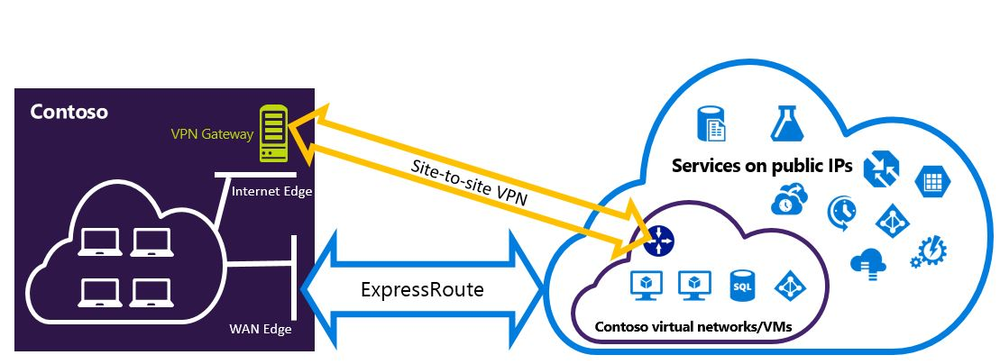

<properties
   pageTitle="Configurer des connexions VPN Expressroute et de Site à qui peuvent coexister pour le modèle de déploiement du Gestionnaire de ressources | Microsoft Azure"
   description="Cet article vous guide dans la configuration ExpressRoute et une connexion VPN de Site à qui peut coexister pour modèle du Gestionnaire de ressources."
   documentationCenter="na"
   services="expressroute"
   authors="charwen"
   manager="carmonm"
   editor=""
   tags="azure-resource-manager"/>
<tags
   ms.service="expressroute"
   ms.devlang="na"
   ms.topic="get-started-article"
   ms.tgt_pltfrm="na"
   ms.workload="infrastructure-services"
   ms.date="10/10/2016"
   ms.author="charleywen"/>

# Configurer les connexions pouvant coexistence ExpressRoute et Site-à-Site pour le modèle de déploiement du Gestionnaire de ressources

> [AZURE.SELECTOR]
- [PowerShell - Gestionnaire de ressources](expressroute-howto-coexist-resource-manager.md)
- [PowerShell - classique](expressroute-howto-coexist-classic.md)

La possibilité de configuration du Site à VPN et ExpressRoute présente plusieurs avantages. Vous pouvez configurer VPN de Site à comme un chemin d’accès de basculement sécurisé pour ExressRoute, ou utiliser VPN de Site à vous connecter aux sites qui ne sont pas connectés via ExpressRoute. Cet article aborde les étapes pour configurer les deux scénarios dans cet article. Cet article s’applique au modèle de déploiement de gestionnaire de ressources. Cette configuration n’est pas disponible dans le portail Azure.

**À propos des modèles de déploiement d’Azure**

[AZURE.INCLUDE [vpn-gateway-clasic-rm](../../includes/vpn-gateway-classic-rm-include.md)] 

>[AZURE.IMPORTANT] Circuits ExpressRoute doivent être préconfigurés avant de suivre les instructions ci-dessous. Vérifiez que vous avez suivi les repères pour [créer un circuit ExpressRoute](expressroute-howto-circuit-arm.md) et [configurer le routage](expressroute-howto-routing-arm.md) avant de suivre les étapes ci-dessous.

## Spécifications et limites

- **Routage de voies n’est pas pris en charge.** Vous ne pouvez pas Router (via Azure) entre votre réseau local connectée via VPN de Site à Site et votre réseau local connectée via ExpressRoute.
- **Passerelle de référence (SKU) base n’est pas pris en charge.** Vous devez utiliser une passerelle base SKU pour la [passerelle ExpressRoute](expressroute-about-virtual-network-gateways.md) et la [passerelle VPN](../vpn-gateway/vpn-gateway-about-vpngateways.md).
- **Uniquement acheminer VPN passerelle est pris en charge.** Vous devez utiliser un itinéraire [Passerelle VPN](../vpn-gateway/vpn-gateway-about-vpngateways.md).
- **Itinéraire statique doit être configuré pour votre passerelle VPN.** Si votre réseau local est connecté à ExpressRoute et un réseau privé virtuel de Site à Site, vous devez disposer d’un itinéraire statique configuré dans votre réseau local pour acheminer la connexion VPN de Site à Site à l’Internet public.
- **ExpressRoute passerelle doit être configuré en premier.** Vous devez d’abord créer la passerelle ExpressRoute avant d’ajouter la passerelle VPN de Site à.

## Conceptions de configuration

### Configurer un réseau privé virtuel de Site à comme un chemin d’accès de basculement pour ExpressRoute

Vous pouvez configurer une connexion VPN de Site à comme une sauvegarde pour ExpressRoute. Cela s’applique uniquement aux réseaux virtuels lié au chemin homologation privé Azure. Il n’existe aucune solution de basculement basée sur VPN pour les services accessibles via Azure public et peerings Microsoft. Le circuit ExpressRoute est toujours le lien principal. Flux de données via le chemin d’accès de Site à Site VPN uniquement si le circuit ExpressRoute échoue.
>[AZURE.NOTE] Alors que ExpressRoute circuit est préféré sur Site à VPN lorsque les deux itinéraires sont identiques, Azure utilisera le préfixe longuest correspondant pour choisir l’itinéraire vers la destination du paquet.

### Configurer un réseau privé virtuel de Site à vous connecter aux sites ne pas connectés à ExpressRoute

Vous pouvez configurer votre réseau où certains sites se connectent directement au Azure via VPN de Site à et certains sites se connectent via ExpressRoute. 

>[AZURE.NOTE] Vous ne pouvez pas configurer un réseau virtuel comme routeur lors des transferts.

## Sélection de la procédure à suivre

Il existe deux différents jeux de procédures pour choisir parmi afin de configurer les connexions peuvent coexister. La procédure de configuration que vous sélectionnez varie selon que vous avez un réseau virtuel que vous voulez vous connecter ou vous voulez créer un nouveau réseau virtuel.

- J’ai n’ont un VNet et avez besoin d’en créer un.
    
    Si vous n’avez pas un réseau virtuel, cette procédure vous guidera créez un réseau virtuel à l’aide du modèle de déploiement Gestionnaire de ressources et la création de connexions de VPN ExpressRoute et Site à nouveau. Pour configurer, suivez les étapes décrites dans la section de l’article [pour créer des connexions pouvant coexistence et un réseau virtuel](#new).

- J’ai déjà un modèle de déploiement du Gestionnaire de ressources VNet.

    Un réseau virtuel est peut-être déjà en place avec une connexion VPN de Site à Site existante ou ExpressRoute. La section [configurer les connexions coexsiting pour un VNet existant](#add) vous aidera à la suppression de la passerelle et puis en créant des connexions de VPN ExpressRoute et de Site à nouveau. Notez que lorsque vous créez les nouvelles connexions, les étapes doivent être effectuées dans un ordre spécifique très. Ne suivez les instructions dans d’autres articles pour créer vos passerelles et les connexions.

    Dans cette procédure, créer des connexions qui peuvent coexister sera nécessitent supprimer votre passerelle, puis configurez nouvelles passerelles. Cela signifie que vous n’avez temps d’arrêt pour vos connexions entre locaux tant que supprimer et recréer votre passerelle et les connexions, mais vous n’aurez pas à migrer vos ordinateurs virtuels ou les services à un nouveau réseau virtuel. Vos machines virtuelles et services seront en mesure de communiquer les via l’équilibrage de charge pendant que vous configurez votre passerelle s’ils sont configurés pour ce faire.

## Pour créer un nouveau réseau virtuel et connexions pouvant coexistence

Cette procédure sera vous aider à créer un VNet et créer des connexions ExpressRoute qui vont coexister et Site à.
    
1. Vous devez installer la dernière version des applets de commande PowerShell Azure. Découvrez [comment installer et configurer Azure PowerShell](../powershell-install-configure.md) pour plus d’informations sur l’installation les applets de commande PowerShell. Notez que les applets de commande que vous utiliserez pour cette configuration peut être légèrement différente de celle que vous connaissez peut-être. Veillez à utiliser les applets de commande spécifié dans ces instructions.

2. Connecter votre compte et configurer l’environnement.
    
        login-AzureRmAccount
        Select-AzureRmSubscription -SubscriptionName 'yoursubscription'
        $location = "Central US"
        $resgrp = New-AzureRmResourceGroup -Name "ErVpnCoex" -Location $location

3. Créer un réseau virtuel, y compris sous-réseau passerelle. Pour plus d’informations sur la configuration du réseau virtuel, voir [configuration du réseau virtuel Azure](../virtual-network/virtual-networks-create-vnet-arm-ps.md).

    >[AZURE.IMPORTANT] La passerelle sous-réseau doit être /27 ou un préfixe plus court (par exemple, /26 ou /25).
    
    Créer un nouveau VNet.

        $vnet = New-AzureRmVirtualNetwork -Name "CoexVnet" -ResourceGroupName $resgrp.ResourceGroupName -Location $location -AddressPrefix "10.200.0.0/16" 

    Ajouter des sous-réseaux.

        Add-AzureRmVirtualNetworkSubnetConfig -Name "App" -VirtualNetwork $vnet -AddressPrefix "10.200.1.0/24"
        Add-AzureRmVirtualNetworkSubnetConfig -Name "GatewaySubnet" -VirtualNetwork $vnet -AddressPrefix "10.200.255.0/24"

    Enregistrer la configuration VNet.

        $vnet = Set-AzureRmVirtualNetwork -VirtualNetwork $vnet

4. Créer une passerelle ExpressRoute. Pour plus d’informations sur la configuration de passerelle ExpressRoute, voir [configuration de la passerelle ExpressRoute](expressroute-howto-add-gateway-resource-manager.md). La GatewaySKU doit être *Standard*, *bien*ou *UltraPerformance*.

        $gwSubnet = Get-AzureRmVirtualNetworkSubnetConfig -Name "GatewaySubnet" -VirtualNetwork $vnet
        $gwIP = New-AzureRmPublicIpAddress -Name "ERGatewayIP" -ResourceGroupName $resgrp.ResourceGroupName -Location $location -AllocationMethod Dynamic
        $gwConfig = New-AzureRmVirtualNetworkGatewayIpConfig -Name "ERGatewayIpConfig" -SubnetId $gwSubnet.Id -PublicIpAddressId $gwIP.Id
        $gw = New-AzureRmVirtualNetworkGateway -Name "ERGateway" -ResourceGroupName $resgrp.ResourceGroupName -Location $location -IpConfigurations $gwConfig -GatewayType "ExpressRoute" -GatewaySku Standard 

5. Lien de la passerelle ExpressRoute au circuit ExpressRoute. Une fois cette étape terminée, la connexion entre votre réseau local et Azure, via ExpressRoute, est établie. Pour plus d’informations sur l’opération de liaison, voir [Lien VNets à ExpressRoute](expressroute-howto-linkvnet-arm.md).

        $ckt = Get-AzureRmExpressRouteCircuit -Name "YourCircuit" -ResourceGroupName "YourCircuitResourceGroup"
        New-AzureRmVirtualNetworkGatewayConnection -Name "ERConnection" -ResourceGroupName $resgrp.ResourceGroupName -Location $location -VirtualNetworkGateway1 $gw -PeerId $ckt.Id -ConnectionType ExpressRoute

6. Ensuite, créez votre passerelle VPN de Site à. Pour plus d’informations sur la configuration de passerelle VPN, consultez [configurer un VNet avec une connexion à un Site](../vpn-gateway/vpn-gateway-create-site-to-site-rm-powershell.md). La GatewaySKU doit être *Standard*, *bien*ou *UltraPerformance*. La VpnType doit être *RouteBased*.

        $gwSubnet = Get-AzureRmVirtualNetworkSubnetConfig -Name "GatewaySubnet" -VirtualNetwork $vnet
        $gwIP = New-AzureRmPublicIpAddress -Name "VPNGatewayIP" -ResourceGroupName $resgrp.ResourceGroupName -Location $location -AllocationMethod Dynamic
        $gwConfig = New-AzureRmVirtualNetworkGatewayIpConfig -Name "VPNGatewayIpConfig" -SubnetId $gwSubnet.Id -PublicIpAddressId $gwIP.Id
        New-AzureRmVirtualNetworkGateway -Name "VPNGateway" -ResourceGroupName $resgrp.ResourceGroupName -Location $location -IpConfigurations $gwConfig -GatewayType "Vpn" -VpnType "RouteBased" -GatewaySku "Standard"

    Azure passerelle VPN prend en charge le protocole BGP. Vous pouvez spécifier - EnableBgp dans la commande suivante.

        $azureVpn = New-AzureRmVirtualNetworkGateway -Name "VPNGateway" -ResourceGroupName $resgrp.ResourceGroupName -Location $location -IpConfigurations $gwConfig -GatewayType "Vpn" -VpnType "RouteBased" -GatewaySku "Standard" -EnableBgp $true

    Vous pouvez trouver le BGP peering IP et le nombre en tant qu’Azure utilise pour la passerelle VPN dans $azureVpn.BgpSettings.BgpPeeringAddress et $azureVpn.BgpSettings.Asn. Pour plus d’informations, voir [Configurer BGP](../vpn-gateway/vpn-gateway-bgp-resource-manager-ps.md) pour passerelle VPN Azure.

7. Créer un site local entité de passerelle VPN. Cette commande ne configurez votre passerelle VPN locale. Au lieu de cela, il vous permet de fournir les paramètres de la passerelle locale, comme l’adresse IP publique et le local adresse espace, de sorte que la passerelle VPN Azure peut se connecter en.

    Si votre périphérique VPN local prend uniquement en charge le routage statique, vous pouvez configurer les itinéraires statiques comme suit.

        $MyLocalNetworkAddress = @("10.100.0.0/16","10.101.0.0/16","10.102.0.0/16")
        $localVpn = New-AzureRmLocalNetworkGateway -Name "LocalVPNGateway" -ResourceGroupName $resgrp.ResourceGroupName -Location $location -GatewayIpAddress *<Public IP>* -AddressPrefix $MyLocalNetworkAddress

    Si votre périphérique VPN local prend en charge le protocole BGP et que vous voulez activer le routage dynamique, vous devez savoir la BGP peering IP et le numéro en tant que périphérique VPN local utilise.

        $localVPNPublicIP = "<Public IP>"
        $localBGPPeeringIP = "<Private IP for the BGP session>"
        $localBGPASN = "<ASN>"
        $localAddressPrefix = $localBGPPeeringIP + "/32"
        $localVpn = New-AzureRmLocalNetworkGateway -Name "LocalVPNGateway" -ResourceGroupName $resgrp.ResourceGroupName -Location $location -GatewayIpAddress $localVPNPublicIP -AddressPrefix $localAddressPrefix -BgpPeeringAddress $localBGPPeeringIP -Asn $localBGPASN

8. Configurer votre périphérique VPN local pour se connecter à la nouvelle passerelle VPN Azure. Pour plus d’informations sur la configuration de l’appareil VPN, voir [Configuration du périphérique VPN](../vpn-gateway/vpn-gateway-about-vpn-devices.md).

9. Lier la passerelle VPN de Site à sur Azure à la passerelle locale.

        $azureVpn = Get-AzureRmVirtualNetworkGateway -Name "VPNGateway" -ResourceGroupName $resgrp.ResourceGroupName
        New-AzureRmVirtualNetworkGatewayConnection -Name "VPNConnection" -ResourceGroupName $resgrp.ResourceGroupName -Location $location -VirtualNetworkGateway1 $azureVpn -LocalNetworkGateway2 $localVpn -ConnectionType IPsec -SharedKey <yourkey>

## Pour configurer les connexions coexsiting pour un VNet existant

Si vous avez un réseau virtuel, vérifiez la taille de sous-réseau passerelle. Si la passerelle constitue /28 ou /29, vous devez tout d’abord supprimer la passerelle réseau virtuel et augmenter la taille de sous-réseau passerelle. Les étapes dans cette section vous montrent comment procéder.

Si la passerelle constitue /27 ou supérieure et le réseau virtuel est connecté via ExpressRoute, vous pouvez ignorer les étapes suivantes et passez à l' [« Étape 6 : créer une passerelle VPN de Site à »](#vpngw) dans la section précédente. 

>[AZURE.NOTE] Lorsque vous supprimez la passerelle existante, vos sites locaux est perdues la connexion à votre réseau virtuel pendant que vous travaillez sur cette configuration. 

1. Vous devez installer la dernière version des applets de commande PowerShell Azure. Découvrez [comment installer et configurer Azure PowerShell](../powershell-install-configure.md) pour plus d’informations sur l’installation les applets de commande PowerShell. Notez que les applets de commande que vous utiliserez pour cette configuration peut être légèrement différente de celle que vous connaissez peut-être. Veillez à utiliser les applets de commande spécifié dans ces instructions. 

2. Supprimer la passerelle ExpressRoute ou VPN de Site à Site existante. 

        Remove-AzureRmVirtualNetworkGateway -Name <yourgatewayname> -ResourceGroupName <yourresourcegroup>

3. Supprimer la passerelle sous-réseau.
        
        $vnet = Get-AzureRmVirtualNetwork -Name <yourvnetname> -ResourceGroupName <yourresourcegroup> 
        Remove-AzureRmVirtualNetworkSubnetConfig -Name GatewaySubnet -VirtualNetwork $vnet

4. Ajouter un sous-réseau de passerelle est /27 ou supérieure.
    >[AZURE.NOTE] Si vous n’avez pas suffisamment d’adresses IP à gauche de votre réseau virtuel pour augmenter la taille de sous-réseau passerelle, vous devez ajouter davantage d’espace adresse IP.

        $vnet = Get-AzureRmVirtualNetwork -Name <yourvnetname> -ResourceGroupName <yourresourcegroup>
        Add-AzureRmVirtualNetworkSubnetConfig -Name "GatewaySubnet" -VirtualNetwork $vnet -AddressPrefix "10.200.255.0/24"

    Enregistrer la configuration VNet.

        $vnet = Set-AzureRmVirtualNetwork -VirtualNetwork $vnet

5. À ce stade, vous aurez une VNet avec aucun des passerelles. Pour créer de nouvelles passerelles et compléter vos connexions, vous pouvez poursuivre [étape 4 : créer une passerelle ExpressRoute](#gw), figurant dans l’ensemble des étapes précédente.

## Pour ajouter point-à-site configuration à la passerelle VPN
Vous pouvez suivre les étapes ci-dessous pour ajouter Point-à-Site configuration à votre passerelle VPN dans une configuration co-existence.

1. Ajouter un Client VPN adresse pool. 

        $azureVpn = Get-AzureRmVirtualNetworkGateway -Name "VPNGateway" -ResourceGroupName $resgrp.ResourceGroupName
        Set-AzureRmVirtualNetworkGatewayVpnClientConfig -VirtualNetworkGateway $azureVpn -VpnClientAddressPool "10.251.251.0/24"

2. Téléchargez le certificat racine VPN sur Azure pour votre passerelle VPN. Dans cet exemple, il est supposé que le certificat racine est stocké dans l’ordinateur local dans laquelle les applets de commande PowerShell suivants sont exécutés. 

        $p2sCertFullName = "RootErVpnCoexP2S.cer"
        $p2sCertMatchName = "RootErVpnCoexP2S"
        $p2sCertToUpload=get-childitem Cert:\CurrentUser\My | Where-Object {$_.Subject -match $p2sCertMatchName}
        if ($p2sCertToUpload.count -eq 1){
            write-host "cert found"
        } else {
            write-host "cert not found"
            exit
        } 
        $p2sCertData = [System.Convert]::ToBase64String($p2sCertToUpload.RawData)
        Add-AzureRmVpnClientRootCertificate -VpnClientRootCertificateName $p2sCertFullName -VirtualNetworkGatewayname $azureVpn.Name -ResourceGroupName $resgrp.ResourceGroupName -PublicCertData $p2sCertData

Pour plus d’informations sur le Point-à-Site VPN, voir [configurer une connexion Point-à-Site](../vpn-gateway/vpn-gateway-howto-point-to-site-rm-ps.md).

## Étapes suivantes

Pour plus d’informations sur ExpressRoute, consultez le [Forum aux questions sur ExpressRoute](expressroute-faqs.md).
