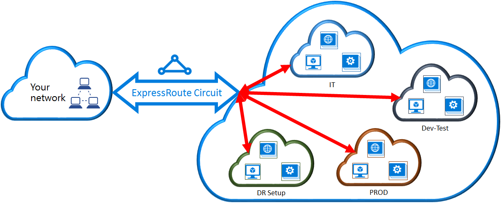

<properties
   pageTitle="Lier un réseau virtuel à un circuit ExpressRoute en utilisant le modèle de déploiement classique et PowerShell | Microsoft Azure"
   description="Ce document fournit une vue d’ensemble de la façon d’établir un lien réseaux virtuels (VNets) aux circuits ExpressRoute en utilisant le modèle de déploiement classique et PowerShell."
   services="expressroute"
   documentationCenter="na"
   authors="ganesr"
   manager="carmonm"
   editor=""
   tags="azure-service-management"/>
<tags
   ms.service="expressroute"
   ms.devlang="na"
   ms.topic="article"
   ms.tgt_pltfrm="na"
   ms.workload="infrastructure-services"
   ms.date="10/10/2016"
   ms.author="ganesr" />

# Lier un réseau virtuel à un circuit ExpressRoute

> [AZURE.SELECTOR]
- [Portail Azure - Gestionnaire de ressources](expressroute-howto-linkvnet-portal-resource-manager.md)
- [PowerShell - Gestionnaire de ressources](expressroute-howto-linkvnet-arm.md)
- [PowerShell - classique](expressroute-howto-linkvnet-classic.md)

Cet article vous aidera à lier des réseaux virtuels (VNets) à circuits Azure ExpressRoute en utilisant le modèle de déploiement classique et PowerShell. Réseaux virtuels peuvent être dans le même abonnement ou peuvent faire partie d’un autre abonnement.

**À propos des modèles de déploiement d’Azure**

[AZURE.INCLUDE [vpn-gateway-clasic-rm](../../includes/vpn-gateway-classic-rm-include.md)]

## Conditions préalables de configuration

1. Vous devez la dernière version des modules PowerShell Azure. Vous pouvez télécharger les modules PowerShell plus récentes à partir de la section PowerShell de la [page de téléchargements Azure](https://azure.microsoft.com/downloads/). Suivez les instructions dans [comment installer et configurer Azure PowerShell](../powershell-install-configure.md) pour des instructions détaillées sur la façon de configurer votre ordinateur pour utiliser les modules PowerShell Azure.
2. Vous devez passer en revue les [conditions préalables](expressroute-prerequisites.md), [exigences de gamme](expressroute-routing.md)et [flux de travail](expressroute-workflows.md) avant de commencer la configuration.
3. Vous devez avoir un circuit ExpressRoute actif.
    - Suivez les instructions pour [créer un circuit ExpressRoute](expressroute-howto-circuit-classic.md) et que votre fournisseur de connectivité à activer le circuit.
    - Assurez-vous d’avoir Azure peering privé configuré pour votre circuit. Voir l’article [configurer Routage](expressroute-howto-routing-classic.md) pour obtenir des instructions routage.
    - Vérifiez que Azure peering privé est configuré et la peering BGP entre votre réseau et Microsoft est l’afin que vous pouvez activer la connectivité de bout en bout.
    - Vous devez disposer d’un réseau virtuel et une passerelle réseau virtuel créé et entièrement mis en service. Suivez les instructions pour [configurer un réseau virtuel pour ExpressRoute](expressroute-howto-vnet-portal-classic.md).

Vous pouvez lier jusqu'à 10 réseaux virtuels à un circuit ExpressRoute. Tous les réseaux virtuels doivent être placé dans la même région géopolitique. Vous pouvez lier un grand nombre de réseaux virtuels à votre circuit ExpressRoute ou réseaux virtuels lien qui se trouvent dans les autres régions géopolitiques si vous avez activé le module complémentaire premium ExpressRoute. Consultez le [Forum aux questions](expressroute-faqs.md) pour plus d’informations sur le module complémentaire premium.

## Connectez un réseau virtuel dans le même abonnement à un circuit

Vous pouvez lier un réseau virtuel à un circuit ExpressRoute à l’aide de l’applet de commande suivante. Assurez-vous que la passerelle réseau virtuel est créée et est prête pour la liaison avant d’exécuter l’applet de commande.

    New-AzureDedicatedCircuitLink -ServiceKey "*****************************" -VNetName "MyVNet"
    Provisioned

## Connectez un réseau virtuel dans un autre abonnement à un circuit

Vous pouvez partager un circuit ExpressRoute entre plusieurs abonnements. La figure suivante illustre une simple principe de fonctionnement du partage de circuits ExpressRoute plusieurs abonnements.

Chacune des nuages plus petits au sein du cloud volumineux est utilisé pour représenter les abonnements appartenant à différents départements au sein d’une organisation. Chacun de ces services au sein de l’organisation peut utiliser leur propre abonnement pour déployer leurs services, mais les départements peut partager un seul circuit ExpressRoute pour vous connecter à votre réseau local. Un seul service (dans cet exemple : IT) peut être propriétaire du circuit ExpressRoute. Autres abonnements au sein de l’organisation peuvent utiliser le circuit ExpressRoute.

>[AZURE.NOTE] Frais de connectivité et la bande passante pour le circuit dédié est appliquées au propriétaire circuit ExpressRoute. Tous les réseaux virtuels partagent la même bande passante.

### Administration

Le *propriétaire de circuit* est l’administrateur/coadministrator de l’abonnement dans lequel le circuit ExpressRoute est créé. Le propriétaire circuit peut autoriser les administrateurs/coadministrators des autres abonnements, appelées *utilisateurs circuit*, pour utiliser le circuit dédié dont ils sont propriétaires. Utilisateurs de circuit qui sont autorisés à utiliser circuit ExpressRoute de l’organisation peuvent lier le réseau virtuel dans son abonnement au circuit ExpressRoute une fois qu’ils sont autorisés.

Le propriétaire de circuit a la possibilité de modifier ou révoquer des autorisations à tout moment. Révocation d’une autorisation se traduit par tous les liens en cours de suppression de l’abonnement dont l’accès a été révoqué.

### Opérations de propriétaire de circuit

#### Création d’une autorisation

Le propriétaire circuit n’autorise les administrateurs des autres abonnements à utiliser le circuit spécifié. Dans l’exemple suivant, l’administrateur du circuit (informatique de Contoso) permet à l’administrateur d’un autre abonnement (développement Test) pour lier jusqu'à deux réseaux virtuels au circuit. Permet aux administrateurs informatiques de Contoso cela en spécifiant l’ID de Test de développement Microsoft. L’applet de commande n’envoyer des messages électroniques à l’ID de Microsoft spécifié. Le propriétaire circuit doit explicitement avertir le propriétaire de l’abonnement autres que l’autorisation est terminée.

    New-AzureDedicatedCircuitLinkAuthorization -ServiceKey "**************************" -Description "Dev-Test Links" -Limit 2 -MicrosoftIds 'devtest@contoso.com'

    Description         : Dev-Test Links
    Limit               : 2
    LinkAuthorizationId : **********************************
    MicrosoftIds        : devtest@contoso.com
    Used                : 0

#### Examinez les autorisations

Le propriétaire circuit pouvez examiner toutes les autorisations qui sont émises sur un circuit particulier en exécutant l’applet de commande suivante :

    Get-AzureDedicatedCircuitLinkAuthorization -ServiceKey: "**************************"

    Description         : EngineeringTeam
    Limit               : 3
    LinkAuthorizationId : ####################################
    MicrosoftIds        : engadmin@contoso.com
    Used                : 1

    Description         : MarketingTeam
    Limit               : 1
    LinkAuthorizationId : @@@@@@@@@@@@@@@@@@@@@@@@@@@@@@@@@@@@
    MicrosoftIds        : marketingadmin@contoso.com
    Used                : 0

    Description         : Dev-Test Links
    Limit               : 2
    LinkAuthorizationId : &&&&&&&&&&&&&&&&&&&&&&&&&&&&&&&&&&&&
    MicrosoftIds        : salesadmin@contoso.com
    Used                : 2

#### Mise à jour des autorisations

Le propriétaire circuit peut modifier les autorisations à l’aide de l’applet de commande suivante :

    Set-AzureDedicatedCircuitLinkAuthorization -ServiceKey "**************************" -AuthorizationId "&&&&&&&&&&&&&&&&&&&&&&&&&&&&"-Limit 5

    Description         : Dev-Test Links
    Limit               : 5
    LinkAuthorizationId : &&&&&&&&&&&&&&&&&&&&&&&&&&&&&&&&&&&&&&
    MicrosoftIds        : devtest@contoso.com
    Used                : 0

#### Suppression d’autorisations

Le propriétaire de circuit pouvez révoquer/supprimer les autorisations pour l’utilisateur en exécutant l’applet de commande suivante :

    Remove-AzureDedicatedCircuitLinkAuthorization -ServiceKey "*****************************" -AuthorizationId "###############################"

### Opérations de l’utilisateur circuit

#### Examinez les autorisations

L’utilisateur circuit peut passer en revue les autorisations à l’aide de l’applet de commande suivante :

    Get-AzureAuthorizedDedicatedCircuit

    Bandwidth                        : 200
    CircuitName                      : ContosoIT
    Location                         : Washington DC
    MaximumAllowedLinks              : 2
    ServiceKey                       : &&&&&&&&&&&&&&&&&&&&&&&&&&&&&&&&&&&&
    ServiceProviderName              : equinix
    ServiceProviderProvisioningState : Provisioned
    Status                           : Enabled
    UsedLinks                        : 0

#### En utilisant les autorisations de lien

L’utilisateur circuit peut exécuter l’applet de commande suivante pour échanger une autorisation de lien :

    New-AzureDedicatedCircuitLink –servicekey "&&&&&&&&&&&&&&&&&&&&&&&&&&" –VnetName 'SalesVNET1'

    State VnetName
    ----- --------
    Provisioned SalesVNET1

## Étapes suivantes

Pour plus d’informations sur ExpressRoute, consultez le [Forum aux questions sur ExpressRoute](expressroute-faqs.md).
