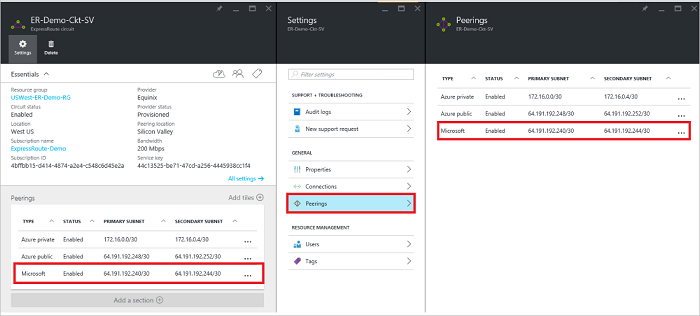

<properties
   pageTitle="Comment faire pour configurer le routage pour un circuit ExpressRoute à l’aide du portail Azure | Microsoft Azure"
   description="Cet article décrit les étapes de création et de mise en service privé, public et Microsoft peering d’un circuit ExpressRoute. Cet article vous indique également comment vérifier l’état, mettre à jour ou supprimer des peerings pour votre circuit."
   documentationCenter="na"
   services="expressroute"
   authors="cherylmc"
   manager="carmonm"
   editor=""
   tags="azure-resource-manager"/>
<tags
   ms.service="expressroute"
   ms.devlang="na"
   ms.topic="hero-article" 
   ms.tgt_pltfrm="na"
   ms.workload="infrastructure-services"
   ms.date="10/10/2016"
   ms.author="cherylmc"/>

# Créer et modifier la gamme pour un circuit ExpressRoute

> [AZURE.SELECTOR]
[Portail Azure - Gestionnaire de ressources](expressroute-howto-routing-portal-resource-manager.md)
[PowerShell - Gestionnaire de ressources](expressroute-howto-routing-arm.md)
[PowerShell - classique](expressroute-howto-routing-classic.md)

Cet article vous explique comment procéder pour créer et gérer la configuration du routage pour un circuit ExpressRoute à l’aide du portail Azure et le modèle de déploiement du Gestionnaire de ressources.

**À propos des modèles de déploiement d’Azure**

[AZURE.INCLUDE [vpn-gateway-clasic-rm](../../includes/vpn-gateway-classic-rm-include.md)] 

## Conditions préalables de configuration

- Vérifiez que vous avez vérifié la page [Configuration requise](expressroute-prerequisites.md) , la page [Configuration requise pour le routage](expressroute-routing.md) et la page [flux de travail](expressroute-workflows.md) avant de commencer la configuration.
- Vous devez avoir un circuit ExpressRoute actif. Suivez les instructions pour [créer un circuit ExpressRoute](expressroute-howto-circuit-arm.md) et avoir le circuit activé par votre fournisseur de connectivité avant de poursuivre. Le circuit ExpressRoute doit être placé dans un état généré et activé pour pouvoir exécuter les applets de commande décrite ci-dessous.

Ces instructions s’appliquent uniquement à circuits créés avec les fournisseurs de service proposant des services de connectivité Layer 2. Si vous utilisez un fournisseur de services proposant des services Layer 3 gérées (généralement un IPVPN, comme MPLS), votre fournisseur de connectivité sera configurer et gérer le routage pour vous. 

>[AZURE.IMPORTANT] Nous n’effectuent pas peerings configuré par les fournisseurs de service à partir du portail de gestion du service. Nous travaillons sur l’activation de cette fonctionnalité plus rapidement. Contactez votre fournisseur de services avant de configurer BGP peerings.

Vous pouvez configurer un, deux ou tous les trois peerings (public privé, Azure Azure et Microsoft) pour un circuit ExpressRoute. Vous pouvez configurer peerings dans n’importe quel ordre que vous choisissez. Toutefois, vous devez vous assurer que vous terminer la configuration de chacun d’eux homologation à la fois. 

## Azure peering privé

Cette section fournit des instructions sur la façon de créer, obtenir, mettre à jour et supprimer la configuration homologation privée Azure pour un circuit ExpressRoute. 

### Pour créer peering privé Azure

1. Configurer le circuit ExpressRoute. Assurez-vous que le circuit est entièrement mis en service par le fournisseur de connectivité avant de poursuivre.

    

2. Configurer peering privé Azure pour le circuit. Assurez-vous de disposer des éléments suivants avant de procéder aux étapes suivantes :

    - Un /30 sous-réseau pour le lien principal. Cela ne doit pas faire partie d’un espace d’adressage réservé pour les réseaux virtuels.
    - Un /30 sous-réseau du lien secondaire. Cela ne doit pas faire partie d’un espace d’adressage réservé pour les réseaux virtuels.
    - Un ID de réseau local virtuel valide pour établir cette peering sur. S’assurer qu’aucune peering du circuit n’utilise le même ID de réseau local virtuel.
    - En tant que nombre pour peering. Vous pouvez utiliser 2 octets et 4 octets sous forme de nombres. Vous pouvez utiliser un privé en tant que nombre pour cette peering. Vérifiez que vous n’utilisez pas 65515.
    - Un hachage MD5 si vous choisissez d’utiliser une. **Cette étape est facultative**.

3. Sélectionnez la ligne homologation Azure privé, comme illustré ci-dessous.
    
    
    

4. Configurer peering privé. L’image ci-dessous montre un exemple de configuration.

    

    
5. Enregistrer la configuration dès que vous avez spécifié tous les paramètres. Une fois la configuration a été acceptée avec succès, vous voyez doit ressembler à l’exemple ci-dessous.

    
    

### Pour afficher les détails homologation privés Azure

Vous pouvez afficher les propriétés d’Azure privé peering en sélectionnant la peering.

### Mettre à jour Azure configuration homologation privée

Vous pouvez sélectionner la ligne pour peering et modifier les propriétés homologation. 

### Pour supprimer peering privé Azure

Vous pouvez supprimer votre configuration homologation en sélectionnant l’icône de suppression, comme illustré ci-dessous.

## Peering public Azure

Cette section fournit des instructions sur la façon de créer, obtenir, mettre à jour et supprimer la configuration homologation publique Azure pour un circuit ExpressRoute. 

### Pour créer peering public Azure

1. Configurez circuit ExpressRoute. Assurez-vous que le circuit est entièrement mis en service par le fournisseur de connectivité avant de poursuivre plus.

    

2. Configurer peering public Azure pour le circuit. Assurez-vous de disposer des éléments suivants avant de procéder aux étapes suivantes :

    - Un /30 sous-réseau pour le lien principal. 
    - Un /30 sous-réseau du lien secondaire. 
    - Toutes les adresses IP utilisés pour installer ce peering doivent être des adresses IPv4 publiques valides.
    - Un ID de réseau local virtuel valide pour établir cette peering sur. S’assurer qu’aucune peering du circuit n’utilise le même ID de réseau local virtuel.
    - En tant que nombre pour peering. Vous pouvez utiliser 2 octets et 4 octets sous forme de nombres.
    - Un hachage MD5 si vous choisissez d’utiliser une. **Cette étape est facultative**.

3. Sélectionnez la ligne homologation publique Azure, comme illustré ci-dessous.
    
    
    

4. Configurer peering public. L’image ci-dessous montre un exemple de configuration.

    

    
5. Enregistrer la configuration dès que vous avez spécifié tous les paramètres. Une fois la configuration a été acceptée avec succès, vous voyez doit ressembler à l’exemple ci-dessous.

    
    

### Pour afficher les détails homologation publics Azure

Vous pouvez afficher les propriétés de peering public Azure en sélectionnant la peering.

### Mettre à jour configuration homologation publique Azure

Vous pouvez sélectionner la ligne pour peering et modifier les propriétés homologation. 

### Pour supprimer peering public Azure

Vous pouvez supprimer votre configuration homologation en sélectionnant l’icône de suppression, comme illustré ci-dessous.

## Microsoft peering

Cette section fournit des instructions sur la façon de créer, obtenir, mettre à jour et supprimer la configuration homologation Microsoft pour un circuit ExpressRoute. 

### Pour créer Microsoft peering

1. Configurez circuit ExpressRoute. Assurez-vous que le circuit est entièrement mis en service par le fournisseur de connectivité avant de poursuivre plus.

    

2. Configurer Microsoft peering pour le circuit. Assurez-vous que les informations suivantes avant de poursuivre.

    - Un /30 sous-réseau pour le lien principal. Cela doit être un préfixe de IPv4 public valide dont vous êtes propriétaire et enregistré dans un relative / tri.
    - Un /30 sous-réseau du lien secondaire. Cela doit être un préfixe de IPv4 public valide dont vous êtes propriétaire et enregistré dans un relative / tri.
    - Un ID de réseau local virtuel valide pour établir cette peering sur. S’assurer qu’aucune peering du circuit n’utilise le même ID de réseau local virtuel.
    - En tant que nombre pour peering. Vous pouvez utiliser 2 octets et 4 octets sous forme de nombres.
    - **Publiés doivent être respectées :** Vous devez fournir une liste de tous les préfixes que vous envisagez de publier sur la session BGP. Seuls les préfixes d’adresse IP publics sont acceptées. Vous pouvez envoyer une liste séparée par des virgules si vous envisagez d’envoyer un jeu de préfixes. Ces préfixes doivent être enregistrés pour vous dans un relative / tri.
    - **Client ASN :** Si vous êtes préfixes publicitaires qui ne sont pas enregistrés pour la peering sous forme de nombre, vous pouvez spécifier le nombre en tant qu’auquel ils sont enregistrés. **Cette étape est facultative**.
    - **Nom de Registre routage :** Vous pouvez spécifier la relative / tri par rapport à laquelle le nombre et les préfixes sont enregistrés. **Cette étape est facultative.**
    - Un hachage MD5, si vous choisissez d’utiliser une. **Cette étape est facultative.**
    
3. Vous pouvez sélectionner la peering que vous souhaitez configurer comme illustré ci-dessous. Sélectionnez la ligne homologation Microsoft.
    
    
    

4.  Configurer Microsoft peering. L’image ci-dessous montre un exemple de configuration.

    

    
5. Enregistrer la configuration dès que vous avez spécifié tous les paramètres. 

    Si votre circuit obtient vers une validation nécessaire état (comme illustré ci-dessous), vous devez ouvrir une demande d’assistance pour prouver que la propriété des préfixes à notre équipe de support technique.  
    
    

    Vous pouvez ouvrir un tickets de support directement à partir du portail comme indiqué ci-dessous   
    
    

6. Une fois la configuration a été acceptée avec succès, vous voyez doit ressembler à l’exemple ci-dessous.

    
    

### Pour afficher les détails homologation Microsoft

Vous pouvez afficher les propriétés de peering public Azure en sélectionnant la peering.

### Mettre à jour Microsoft homologation configuration

Vous pouvez sélectionner la ligne pour peering et modifier les propriétés homologation. 

### Pour supprimer Microsoft peering

Vous pouvez supprimer votre configuration homologation en sélectionnant l’icône de suppression, comme illustré ci-dessous.

## Étapes suivantes

Étape suivante, [lien un VNet à un circuit ExpressRoute](expressroute-howto-linkvnet-arm.md).

-  Pour plus d’informations sur les flux de travail ExpressRoute, voir [flux de travail ExpressRoute](expressroute-workflows.md).

-  Pour plus d’informations sur circuit peering, voir [ExpressRoute circuits et les domaines de routage](expressroute-circuit-peerings.md).

-  Pour plus d’informations sur l’utilisation des réseaux virtuels, voir [vue d’ensemble du réseau virtuel](../virtual-network/virtual-networks-overview.md).

