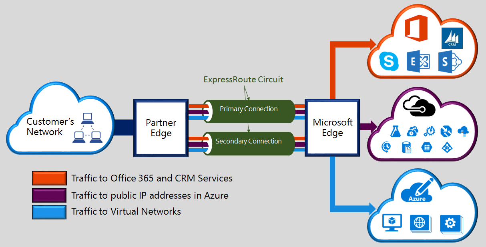

<properties 
   pageTitle="Présentation des ExpressRoute | Microsoft Azure"
   description="Cette page fournit une vue d’ensemble du service ExpressRoute, y compris comment fonctionne une connexion ExpressRoute."
   documentationCenter="na"
   services="expressroute"
   authors="cherylmc"
   manager="carmonm"
   editor=""/>
<tags 
   ms.service="expressroute"
   ms.devlang="na"
   ms.topic="get-started-article" 
   ms.tgt_pltfrm="na"
   ms.workload="infrastructure-services" 
   ms.date="10/10/2016"
   ms.author="cherylmc"/>

# Présentation technique ExpressRoute

Microsoft Azure ExpressRoute vous permet d’étendre vos réseaux locaux dans le cloud Microsoft via une connexion privée dédiée facilitée par un fournisseur de connectivité. ExpressRoute, vous pouvez établir des connexions aux services cloud Microsoft, tels que Microsoft Azure, Office 365 et CRM Online. Connectivité peut être à partir d’un réseau (IP VPN) pour tout, un réseau Ethernet point à point ou une connexion cross virtuelle via un fournisseur de connectivité chez un autre site. ExpressRoute connexions ne passent pas sur l’Internet public. Cela permet de connexions ExpressRoute à offrent davantage de fiabilité, vitesses plus rapides, latence inférieur et sécurité plus élevée que connexions classiques via Internet.

**Principaux avantages :**

- Layer 3 connectivité entre votre réseau local et le Cloud Microsoft via un fournisseur de connectivité. Connectivité peut être à partir d’un réseau (IPVPN) pour tout, une connexion Ethernet point à point, ou via une connexion cross virtuelle via un échange Ethernet.
- Connexion aux services de cloud Microsoft dans toutes les régions dans la région géopolitique.
- Connectivité globale aux services Microsoft dans toutes les régions avec composant additionnel ExpressRoute premium.
- Dynamique routage entre votre réseau et Microsoft sur les protocoles standard (BGP).
- Redondance intégrée à chaque emplacement homologation pour optimiser la fiabilité.
- Disponibilité de connexion [SLA](https://azure.microsoft.com/support/legal/sla/).
- Qualité de service et la prise en charge de plusieurs classes de service pour les applications spéciale, tels que Skype entreprise.

Consultez le [Forum aux questions sur ExpressRoute](expressroute-faqs.md) pour plus d’informations.

## Comment puis-je me connecter mon réseau à Microsoft à l’aide de ExpressRoute ?

Vous pouvez créer une connexion entre votre réseau local et le cloud Microsoft de trois façons différentes :

### Co-création situé à un échange de cloud

Si vous résidez co-création dans un emplacement avec un exchange cloud, vous pouvez trier des connexions entre virtuelles sur le cloud Microsoft via exchange de Ethernet du fournisseur emplacement co-création. Fournisseurs de localisation co-création peuvent proposer de connexions entre Layer 2 ou gérées Layer 3 entre-connexions entre votre infrastructure dans la fonctionnalité de co-création emplacement et le cloud Microsoft.

### Connexions Ethernet point à point 

Vous pouvez vous connecter à vos centres de données locale/bureaux dans le cloud Microsoft par le biais des liens Ethernet point à point. Fournisseurs de Ethernet point à point peuvent proposer des connexions Layer 2, ou géré Layer 3 connexions entre votre site et le cloud Microsoft.

### Réseaux (IPVPN) pour tout

Vous pouvez intégrer votre réseau étendu avec le cloud Microsoft. Des fournisseurs IPVPN (généralement MPLS VPN) offrent une connectivité à tout entre vos succursales et centres de données. Le cloud Microsoft peut être interconnecté à votre réseau étendu pour lui donner un aspect comme n’importe quel autre succursale. ACCÉLÉRATEURS fournisseurs offrent généralement gérée connectivité Layer 3. Fonctionnalités et fonctions ExpressRoute sont toutes identiques dans l’ensemble des modèles de connectivité ci-dessus. 

Fournisseurs de connectivité peuvent proposer un ou plusieurs modèles de connectivité. Vous pouvez travailler avec votre fournisseur de connectivité choisir le modèle qui vous convient le mieux.

## Fonctionnalités ExpressRoute

ExpressRoute prend en charge les fonctionnalités suivantes : 

### Connectivité Layer 3

Microsoft utilise dynamique routage protocole standard (BGP) pour échanger des positionne entre votre réseau local, les instances dans Azure et Microsoft adresses publiques.  Nous établir plusieurs sessions BGP avec votre réseau pour les profils de trafic différent. Vous trouverez plus d’informations dans l’article [ExpressRoute circuit et le routage de domaines](expressroute-circuit-peerings.md) .

### Redondance

Chaque circuit ExpressRoute se compose de deux connexions à deux routeurs Microsoft Enterprise (MSEEs) à partir du fournisseur de connectivité / votre réseau bord. Microsoft nécessite deux BGP connexion à partir du fournisseur de connectivité / votre côté – un pour chaque MSEE. Vous pouvez choisir ne pas de déployer des périphériques redondants / Ethernet circuits à votre fin. Cependant, les fournisseurs de connectivité utilisent appareils redondants pour vous assurer que vos connexions sont remises à Microsoft d’une manière redondante. Une configuration de connectivité Layer 3 redondante est une obligation pour notre [SLA](https://azure.microsoft.com/support/legal/sla/) soit valide. 

### Connectivité aux services cloud Microsoft

[AZURE.INCLUDE [expressroute-office365-include](../../includes/expressroute-office365-include.md)]

Connexions ExpressRoute activer l’accès aux services suivants :

- Services Microsoft Azure
- Services Microsoft Office 365
- Microsoft CRM Online services 
 
Vous pouvez visiter la page [Forum aux questions ExpressRoute](expressroute-faqs.md) pour une liste détaillée des services pris en charge sur ExpressRoute.

### Connectivité à toutes les régions au sein d’une région géopolitique

Vous pouvez vous connecter à Microsoft dans un de nos [emplacements homologation](expressroute-locations.md) et avoir accès à toutes les zones dans la zone géopolitique. 

Par exemple, si vous connecté à Microsoft à Amsterdam via ExpressRoute, vous aurez accès à tous les services de cloud Microsoft hébergé dans Europe du Nord et en Europe. Consultez l’article [ExpressRoute partenaires et des emplacements homologation](expressroute-locations.md) pour une vue d’ensemble des régions géopolitiques, les zones de cloud Microsoft associés et emplacements homologation ExpressRoute correspondants.

### Connectivité globale avec composant additionnel ExpressRoute premium

Vous pouvez activer la fonctionnalité de modules complémentaires premium ExpressRoute étendre la connectivité au-delà des limites géopolitiques. Par exemple, si vous êtes connecté à Microsoft à Amsterdam via ExpressRoute, vous aurez accès à tous les services de cloud Microsoft hébergé dans toutes les régions du monde entier (nuages nationaux sont exclus). Vous pouvez accéder aux services déployées en Amérique du Sud ou Australie la même façon que vous accédez les régions Amérique du Nord et Europe ouest.

### Partenaires de connectivité enrichi

ExpressRoute a un réseau de fournisseurs de connectivité et SI partenaires constamment. Vous pouvez faire référence à l’article [emplacements et fournisseurs ExpressRoute](expressroute-locations.md) pour obtenir les dernières informations.

### Connectivité à nuages nationales

Microsoft utilise les environnements de cloud isolé pour les régions géopolitiques spéciales et segments de clientèle. Reportez-vous à la page [emplacements et fournisseurs ExpressRoute](expressroute-locations.md) pour obtenir la liste des nuages nationaux et fournisseurs.

### Options de bande passante pris en charge

Vous pouvez acheter circuits ExpressRoute pour un large éventail de bande passante. Voici la liste de bande passante pris en charge. Veillez à vérifier auprès de votre fournisseur de connectivité pour déterminer la liste de bande passante pris en charge qu’ils fournissent.

- 50 Mbps
- 100 Mbps
- 200 Mbps
- 500 Mbps
- 1 Go/s
- 2 Go/s
- 5 Go/s
- 10 Go/s

### Mise à l’échelle dynamique de bande passante

Vous avez la possibilité pour augmenter la bande passante circuit ExpressRoute (selon le meilleur effort) sans avoir à supprimer vos connexions. 

### Modèles de facturation flexibles

Vous pouvez choisir un modèle de facturation qui vous convient le mieux. Choisir entre les modèles de facturation ci-dessous. Reportez-vous à la page [Forum aux questions sur ExpressRoute](expressroute-faqs.md) pour plus d’informations. 

- **Données illimité**. Le circuit ExpressRoute est facturé selon un abonnement mensuel, et tous les transferts de données entrant et sortant sont inclus gratuitement. 
- **Données limitées**. Le circuit ExpressRoute est facturé selon un abonnement mensuel. Tous les transferts de données entrante sont gratuit. Transfert de données sortant est facturé par Go de transfert de données. Taux de transfert de données varient selon la région.
- **Module complémentaire ExpressRoute premium**. La prime ExpressRoute est un composant additionnel sur le circuit ExpressRoute. Le module complémentaire premium ExpressRoute fournit les fonctionnalités suivantes : 
    - Limites d’itinéraire accrue pour Azure public et Azure privé peering de 4 000 itinéraires à 10 000 itinéraires.
    - Connectivité globale pour les services. Un circuit ExpressRoute créé dans n’importe quelle région (à l’exception de nuages nationales) a accès aux ressources sur n’importe quelle autre région dans le monde. Par exemple, un réseau virtuel créé en Europe ouest sont accessibles via un circuit ExpressRoute sa mise en service dans la Silicon Valley.
    - Augmentation du nombre de liens VNet par circuit ExpressRoute comprise entre 10 à une limite supérieure, en fonction de la bande passante du circuit.

## Étapes suivantes

- Découvrez les connexions ExpressRoute et les domaines de routage. Voir [ExpressRoute circuits et les domaines de routage](expressroute-circuit-peerings.md).
- Rechercher un fournisseur de services. Voir [ExpressRoute partenaires et des emplacements homologation](expressroute-locations.md).
- Assurez-vous que toutes les conditions préalables sont remplies. Voir [conditions préalables ExpressRoute](expressroute-prerequisites.md).
- Reportez-vous à la configuration requise pour le [routage](expressroute-routing.md), [NAT](expressroute-nat.md) et [qualité de service](expressroute-qos.md).
- Configurer votre connexion ExpressRoute.
    - [Créer un circuit ExpressRoute](expressroute-howto-circuit-classic.md)
    - [Configurer le routage](expressroute-howto-routing-classic.md)
    - [Lier un VNet à un circuit ExpressRoute](expressroute-howto-linkvnet-classic.md)
