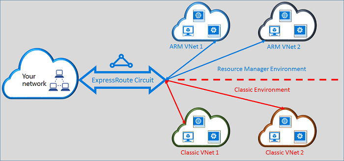

<properties
   pageTitle="Déplacement de circuits ExpressRoute de classique au Gestionnaire de ressources | Microsoft Azure"
   description="Cette page fournit un aperçu de ce que vous devez savoir sur la transition standard et les modèles de déploiement Gestionnaire de ressources."
   documentationCenter="na"
   services="expressroute"
   authors="ganesr"
   manager="carmonm"
   editor=""/>
<tags
   ms.service="expressroute"
   ms.devlang="na"
   ms.topic="get-started-article"
   ms.tgt_pltfrm="na"
   ms.workload="infrastructure-services"
   ms.date="10/10/2016"
   ms.author="ganesr"/>

# Déplacement de circuits ExpressRoute de la classique au modèle de déploiement de gestionnaire de ressources

Cet article fournit une vue d’ensemble de ce que cela signifie pour déplacer un circuit Azure ExpressRoute de la classique vers le modèle de déploiement d’Azure le Gestionnaire de ressources.

[AZURE.INCLUDE [vpn-gateway-sm-rm](../../includes/vpn-gateway-classic-rm-include.md)]

Vous pouvez utiliser un seul circuit ExpressRoute pour vous connecter à des réseaux virtuels sont déployés à la fois dans la classique et les modèles de déploiement Gestionnaire de ressources. Un circuit ExpressRoute, quelle que soit la manière dont il est créé, pouvez maintenant lier à des réseaux virtuels entre les deux modèles de déploiement.

## Circuits ExpressRoute créés dans le modèle de déploiement classique

Circuits ExpressRoute créés dans le modèle de déploiement classique doivent être déplacés vers le modèle de déploiement du Gestionnaire de ressources tout d’abord pour activer la connectivité standard et les modèles de déploiement Gestionnaire de ressources. Il n’est pas une perte de connectivité ou interruption lorsqu’une connexion est déplacée. Tous les liens de réseau circuit-à-virtuel dans le modèle de déploiement classique (au sein de la même abonnement et croisée abonnement) sont conservés.

Une fois que le déplacement a réussi, le circuit ExpressRoute ressemble, exécute et estime exactement comme un circuit ExpressRoute qui a été créé dans le modèle de déploiement du Gestionnaire de ressources. Vous pouvez désormais créer des connexions à des réseaux virtuels dans le modèle de déploiement du Gestionnaire de ressources.

Après une ExpressRoute circuit a été déplacée vers le modèle de déploiement Gestionnaire de ressources, vous pouvez gérer le cycle de vie du circuit ExpressRoute uniquement à l’aide du modèle de déploiement du Gestionnaire de ressources. Cela signifie que vous pouvez effectuer les opérations telles que l’ajout, mise à jour/supprimer peerings, mise à jour des propriétés de circuit (tels que la bande passante référence (SKU) et type de facturation) et la suppression de circuits uniquement dans le modèle de déploiement du Gestionnaire de ressources. Reportez-vous à la section ci-dessous sur circuits créés dans le modèle de déploiement Gestionnaire de ressources pour plus d’informations sur comment vous pouvez gérer l’accès aux deux modèles de déploiement.

Vous n’avez pas d’impliquer votre fournisseur de connectivité pour effectuer le déplacement.

## Circuits ExpressRoute créés dans le modèle de déploiement du Gestionnaire de ressources

Vous pouvez activer circuits ExpressRoute créés dans le modèle de déploiement Gestionnaire de ressources pour être accessibles à partir de deux modèles de déploiement. Aucun circuit ExpressRoute dans votre abonnement peut être activée accessible à partir de deux modèles de déploiement.

- Circuits ExpressRoute qui ont été créés dans le modèle de déploiement du Gestionnaire de ressources n’ont pas accès au modèle de déploiement classique par défaut.
- Circuits ExpressRoute qui ont été déplacés à partir du modèle de déploiement classique vers le modèle de déploiement de gestionnaire de ressources sont accessibles à partir de deux modèles de déploiement par défaut.
- Un circuit ExpressRoute a toujours accès au modèle de déploiement du Gestionnaire de ressources, indépendamment de si elle a été créée dans le Gestionnaire de ressources ou au modèle de déploiement classique. Cela signifie que vous pouvez créer des connexions à des réseaux virtuels créés dans le modèle de déploiement du Gestionnaire de ressources en suivant les instructions sur la [façon de créer un lien réseaux virtuels](expressroute-howto-linkvnet-arm.md).
- Accès au modèle de déploiement classique est contrôlé par le paramètre **allowClassicOperations** dans le circuit ExpressRoute.

>[AZURE.IMPORTANT] Tous les quotas qui sont présentées dans la page [service limites](../azure-subscription-service-limits.md) s’appliquent. Par exemple, un circuit standard peut avoir au maximum 10 liens/connexions de réseau virtuel sur le standard et les modèles de déploiement Gestionnaire de ressources.

## Contrôler l’accès au modèle de déploiement classique

Vous pouvez activer un seul circuit ExpressRoute créer un lien vers des réseaux virtuels dans les deux modèles de déploiement en définissant le paramètre **allowClassicOperations** du circuit ExpressRoute.

Définition **allowClassicOperations** True permet à lier des réseaux virtuels dans les deux modèles de déploiement au circuit ExpressRoute. Vous pouvez lier à des réseaux virtuels dans le modèle de déploiement classique en suivant les instructions sur [la lier des réseaux virtuels dans le modèle de déploiement classique](expressroute-howto-linkvnet-classic.md). Vous pouvez lier à des réseaux virtuels dans le modèle de déploiement du Gestionnaire de ressources en suivant les instructions sur [la lier des réseaux virtuels dans le modèle de déploiement du Gestionnaire de ressources](expressroute-howto-linkvnet-arm.md).

Paramétrer **l’allowClassicOperations** FALSE bloque l’accès au circuit à partir du modèle de déploiement classique. Cependant, tous les liens de réseau virtuel dans le modèle de déploiement classique sont conservés. Dans ce cas, le circuit ExpressRoute n’est pas visible dans le modèle de déploiement classique.

## Opérations prises en charge dans le modèle de déploiement classique

Les opérations classiques suivantes sont prises en charge sur un circuit ExpressRoute lorsque **allowClassicOperations** est défini sur TRUE :

 - Obtenir des informations de circuit ExpressRoute
 - Liens de réseau virtuel créer/mise à jour/get/supprimer à des réseaux virtuels classiques
 - Autorisations de lien de réseau virtuel créer/mise à jour/get/supprimer pour la connectivité entre-abonnement

Vous ne pouvez pas effectuer les opérations classiques suivantes lorsque **allowClassicOperations** est défini sur TRUE :

 - Créer/mettre à jour/get/supprimer bordure BGP (Gateway Protocol) peerings public privé, Azure Azure et peerings Microsoft
 - Supprimer des circuits ExpressRoute

## Communication entre le classique et les modèles de déploiement Gestionnaire de ressources

Le circuit ExpressRoute se comporte comme un pont entre le classique et les modèles de déploiement Gestionnaire de ressources. Trafic entre ordinateurs virtuels dans des réseaux virtuels dans le modèle de déploiement classique et celles des réseaux virtuels dans les flux de modèle de déploiement Gestionnaire de ressources via ExpressRoute si les deux réseaux virtuels est liés à la même circuit ExpressRoute.

Débit total est limité par la capacité de débit de la passerelle réseau virtuel. Le trafic n’entre pas du fournisseur connectivité ou vos réseaux dans ce cas. Flux de trafic entre les réseaux virtuels est entièrement contenu au sein du réseau Microsoft.

## Accès au public Azure et ressources Microsoft homologation

Vous pouvez continuer à accéder aux ressources qui sont généralement accessibles via peering public Azure et Microsoft peering sans aucune interruption.  

## Qu’est pris en charge

Cette section décrit les sont pris en charge pour circuits ExpressRoute :

 - Vous pouvez utiliser un seul circuit ExpressRoute pour accéder à des réseaux virtuels déployées dans le classique et les modèles de déploiement Gestionnaire de ressources.
 - Vous pouvez déplacer un circuit ExpressRoute à partir de la classique vers le modèle de déploiement du Gestionnaire de ressources. Une fois que celui-ci est déplacé, le circuit ExpressRoute ressemble, estime et effectue comme n’importe quel autre circuit ExpressRoute qui est créé dans le modèle de déploiement du Gestionnaire de ressources.
 - Vous pouvez déplacer uniquement le circuit ExpressRoute. CIRCUIT des liens, des réseaux virtuels et des passerelles VPN ne peuvent pas être déplacés par le biais cette opération.
 - Après une ExpressRoute circuit a été déplacée vers le modèle de déploiement Gestionnaire de ressources, vous pouvez gérer le cycle de vie du circuit ExpressRoute uniquement à l’aide du modèle de déploiement du Gestionnaire de ressources. Cela signifie que vous pouvez effectuer les opérations telles que l’ajout, mise à jour/supprimer peerings, mise à jour des propriétés de circuit (tels que la bande passante référence (SKU) et type de facturation) et la suppression de circuits uniquement dans le modèle de déploiement du Gestionnaire de ressources.
 - Le circuit ExpressRoute se comporte comme un pont entre le classique et les modèles de déploiement Gestionnaire de ressources. Trafic entre ordinateurs virtuels dans des réseaux virtuels dans le modèle de déploiement classique et celles des réseaux virtuels dans les flux de modèle de déploiement Gestionnaire de ressources via ExpressRoute si les deux réseaux virtuels est liés à la même circuit ExpressRoute.
 - Connectivité entre abonnement est pris en charge dans le classique et les modèles de déploiement Gestionnaire de ressources.

## Ce qui n’est pas pris en charge

Cette section décrit ce qui n’est pas pris en charge pour circuits ExpressRoute :

 - Déplacement des liens circuit, les passerelles et les réseaux virtuels à partir de la classique au modèle de déploiement de gestionnaire de ressources.
 - Gérer le cycle de vie d’un circuit ExpressRoute à partir du modèle de déploiement classique.
 - Support de contrôle d’accès (RBAC) basée sur les rôles pour le modèle de déploiement classique. Vous ne pouvez pas effectuer un circuit des contrôles RBAC dans le modèle de déploiement classique. Tout administrateur/coadministrator de l’abonnement peuvent lier ou dissocier des réseaux virtuels au circuit.

## Configuration

Suivez les instructions qui sont décrites dans [déplacer un circuit ExpressRoute à partir de la classique au modèle de déploiement de gestionnaire de ressources](expressroute-howto-move-arm.md).

## Étapes suivantes

- Pour plus d’informations de flux de travail, voir [circuit ExpressRoute mise en service circuit États et flux de travail](expressroute-workflows.md).
- Pour configurer votre connexion ExpressRoute :

    - [Créer un circuit ExpressRoute](expressroute-howto-circuit-arm.md)
    - [Configurer le routage](expressroute-howto-routing-arm.md)
    - [Lier un réseau virtuel à un circuit ExpressRoute](expressroute-howto-linkvnet-arm.md)
