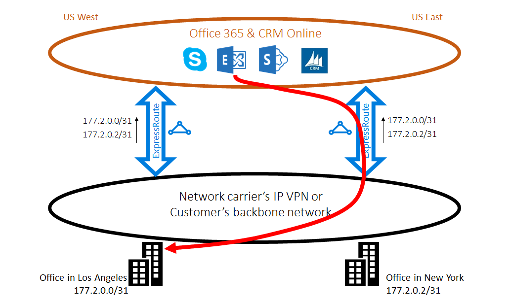

<properties
   pageTitle="Optimiser le routage ExpressRoute | Microsoft Azure"
   description="Cette page fournit des détails sur la façon d’optimiser le routage lorsqu’un client a plusieurs circuits ExpressRoute qui se connectent entre Microsoft et le réseau du client corp."
   documentationCenter="na"
   services="expressroute"
   authors="charwen"
   manager="carmonm"
   editor=""/>
<tags
   ms.service="expressroute"
   ms.devlang="na"
   ms.topic="get-started-article"
   ms.tgt_pltfrm="na"
   ms.workload="infrastructure-services"
   ms.date="10/10/2016"
   ms.author="charwen"/>

# Optimiser le routage des ExpressRoute
Lorsque vous avez plusieurs circuits ExpressRoute, vous avez plusieurs chemins d’accès pour vous connecter à Microsoft. Par conséquent, routage non optimaux peut se produire - autrement dit, le trafic de votre peut prendre un chemin d’accès plus longue pour accéder à Microsoft et Microsoft à votre réseau. Plus le chemin d’accès réseau, la latence élevée. Latence a impact direct sur application performances et l’expérience utilisateur. Cet article illustrent ce problème et explique comment optimiser le routage en utilisant les technologies de routage standards.

## Cas routage non optimaux 1
Jetons un coup fermer au problème routage par exemple. Imaginons que vous disposez de deux bureaux aux États-Unis, un dans Los Angeles et Saint-Étienne en un seul. Vos sites sont connectés sur une large zone réseau étendu (WAN), qui peut être votre propre réseau principal ou IP VPN votre fournisseur de services. Vous avez deux circuits ExpressRoute, un à nous ouest, le nous Moyen-Orient, qui sont également connectés sur le réseau étendu. Bien entendu, vous avez deux chemins d’accès pour vous connecter au réseau Microsoft. Maintenant Supposons que vous disposiez déploiement d’Azure (par exemple, Azure Application Service) dans nous ouest et nous orientale. Votre intention consiste à connecter vos utilisateurs à Los Angeles à Azure nous ouest et vos utilisateurs à New York à Azure nous est parce que votre administrateur de service publie que les utilisateurs dans chaque office accéder aux services Azure à proximité pour une expérience optimale. Malheureusement, le plan fonctionne également pour les utilisateurs côte est mais pas pour les utilisateurs ouest. La cause du problème est la suivante. Sur chaque circuit ExpressRoute, nous annoncer vous le préfixe dans Azure nous Orient (23.100.0.0/16) et le préfixe à Azure nous Ouest (13.100.0.0/16). Si vous ne connaissez pas le préfixe est les régions, vous n’êtes pas en mesure de traiter différemment. Le réseau WAN peut considérer à la fois des préfixes sont plus proches à nous est que nous ouest et donc acheminer les utilisateurs d’office au circuit ExpressRoute dans nous orientale. Mais au final, vous aurez recevons grand nombre d’utilisateurs dans le bureau de Los Angeles.

### Solution : utilisez BGP Communautés
Pour optimiser le routage pour les utilisateurs d’office, vous devez connaître le préfixe proviennent d’Azure nous ouest et qui est Azure nous. Nous coder ces informations à l’aide de [valeurs BGP communautaires](expressroute-routing.md). Nous avons affecté une valeur unique de la Communauté BGP à chaque région Azure, par exemple, « 12076:51004 » pour nous Orient, « 12076:51006 » pour nous ouest. Maintenant que vous connaissez le préfixe est les régions Azure, vous pouvez configurer le circuit ExpressRoute doit être préféré. Étant donné que nous utilisons la BGP pour échanger des informations de routage, vous pouvez utiliser préférences locales de BGP pour influencer le routage. Dans notre exemple, vous pouvez affecter une valeur supérieure préférences locales à 13.100.0.0/16 à nous ouest que dans contactez-nous Extrême-Orient et même, une valeur supérieure préférences locales à 23.100.0.0/16 dans contactez-nous Extrême-Orient qu’à nous ouest. Cette configuration va s’assurer que, lorsque les chemins d’accès à Microsoft sont disponibles, vos utilisateurs à Los Angeles prendra le circuit ExpressRoute à nous ouest pour vous connecter à Azure nous ouest alors que vos utilisateurs à New York prennent la ExpressRoute dans nous orientale dans Azure nous orientale. Routage est optimisé des deux côtés. 

## Cas routage non optimaux 2
Voici un autre exemple où les connexions depuis Microsoft ont un chemin d’accès plus de temps d’atteindre votre réseau. Dans ce cas, vous utilisez des serveurs Exchange en local et Exchange Online dans un [environnement hybride](https://technet.microsoft.com/library/jj200581%28v=exchg.150%29.aspx). Vos sites sont connectés à un réseau étendu. Vous annoncer les préfixes de vos serveurs locale de celle de vos sites à Microsoft dans les deux circuits ExpressRoute. Exchange Online lancera connexions aux serveurs en local dans les cas tels que de migration des boîtes aux lettres. Malheureusement, la connexion à votre bureau de Los Angeles est routée vers le circuit ExpressRoute dans nous orientale avant de parcourir l’arrière continent entier à la côte ouest. La cause du problème est similaire à la première partie. Sans tout indicateur, le réseau Microsoft ne peut pas déterminer quel préfixe client est près nous Moyen-Orient et celui près nous ouest. Ce problème survient choisir le mauvais chemin d’accès à votre Bureau à Los Angeles.

### Solution : utilisez ajoutant au début du chemin d’accès en tant que
Il existe deux solutions à ce problème. Le premier est que vous annoncer simplement votre préfixe local pour votre installation d’office Toulouse, 177.2.0.0/31, sur le circuit ExpressRoute à nous ouest et vos localement préfixe pour votre bureau de New York, 177.2.0.2/31, sur le circuit ExpressRoute dans Extrême-Orient contactez-nous. Par conséquent, il n'est qu’un seul chemin d’accès de Microsoft pour vous connecter à chacun de vos sites. Il n’y a aucune ambiguïté et routage est optimisé. Avec ce modèle, vous devez réfléchir à votre stratégie de basculement. Au cas où le chemin d’accès à Microsoft via ExpressRoute est interrompue, vous devez vous assurer qu’Exchange Online peuvent toujours se connecter à vos serveurs locale. 

La deuxième solution est que vous continuez à publier à la fois des préfixes sur les deux circuits ExpressRoute, et en outre que vous donnez vos une indication du préfixe est éloigné de laquelle l’une de vos sites. Étant donné que nous prenons en charge ajoutant au début du chemin d’accès de BGP en tant que, vous pouvez configurer le chemin d’accès en tant que pour votre préfixe pour influencer le routage. Dans cet exemple, vous pouvez augmenter le chemin d’accès en tant que 172.2.0.0/31 dans orientale nous afin que nous préféreront le circuit ExpressRoute à nous ouest pour le trafic destiné à ce préfixe (comme notre réseau pense que le chemin d’accès à ce préfixe est plus courte dans l’ouest). De même, vous pouvez augmenter le chemin d’accès en tant que 172.2.0.2/31 à nous ouest afin que nous allons vous préférez le circuit ExpressRoute dans nous orientale. Routage est optimisé pour ces deux bureaux. Avec ce modèle, si un seul circuit ExpressRoute est interrompue, Exchange Online peuvent toujours vous joindre via un autre circuit ExpressRoute et votre réseau étendu. 

>[AZURE.IMPORTANT] Nous supprimer privé sous forme de nombres dans le chemin d’accès en tant que pour les préfixes reçus sur Peering Microsoft. Vous devez ajouter public sous forme de nombres dans le chemin d’accès en tant qu’influencer routage pour Microsoft Peering.

>[AZURE.IMPORTANT] Tandis que les exemples sont pour Microsoft et peerings Public, nous prennent en charge les mêmes fonctionnalités la peering privé. Le chemin d’accès en tant qu’ajoutant fonctionne également, au sein d’un même circuit ExpressRoute, pour influencer la sélection des chemins d’accès principaux et secondaires.
