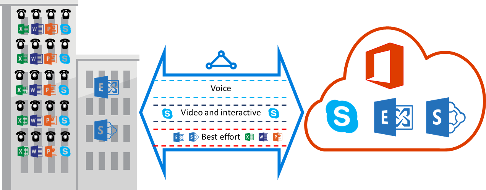

<properties
   pageTitle="Configuration requise de qualité de service pour ExpressRoute | Microsoft Azure"
   description="Cette page contient des exigences en détail pour la configuration et la gestion de qualité de service pour circuits ExpressRoute."
   documentationCenter="na"
   services="expressroute"
   authors="cherylmc"
   manager="carmonm"
   editor=""/>
<tags
   ms.service="expressroute"
   ms.devlang="na"
   ms.topic="get-started-article"
   ms.tgt_pltfrm="na"
   ms.workload="infrastructure-services"
   ms.date="10/10/2016"
   ms.author="cherylmc"/>

# Exigences ExpressRoute QoS

Skype entreprise a diverses charges de travail qui nécessitent le traitement différencié de qualité de service. Si vous envisagez d’utiliser des services voix via ExpressRoute, vous devez respecter les exigences décrites ci-dessous.

>[AZURE.NOTE] Configuration requise de qualité de service s’appliquent à Microsoft peering uniquement. Les valeurs DSCP dans votre trafic réseau reçu sur peering public Azure et Azure peering privé seront remises à 0. 

Le tableau suivant fournit la liste des marques DSCP utilisé par Skype entreprise. Pour plus d’informations, reportez-vous à [Gestion de la qualité de service pour Skype entreprise](https://technet.microsoft.com/library/gg405409.aspx) .

| **Classe de trafic** | **Traitement (marquage DSCP)** | **Skype pour les charges de travail métier** |
|---|---|---|
| **Voix** | FE (46) | Skype / Lync voix |
| **Interactif** | AF41 (34) | Vidéo |
|   | AF21 (18) | Partage d’application | 
| **Par défaut** | AF11 (10) | Transfert de fichiers|
|   | CS0 (0) | Autre chose| 

- Vous devez classer les charges de travail et marquer les valeurs DSCP. Suivez les instructions fournies [ici](https://technet.microsoft.com/library/gg405409.aspx) sur la configuration des marques DSCP dans votre réseau.

- Vous devez configurer et prend en charge plusieurs files d’attente de qualité de service au sein de votre réseau. Voix doit être une classe autonome et recevoir des soins FE spécifié dans RFC 3246. 

- Vous pouvez choisir le mécanisme files d’attente, la stratégie de détection encombrement et allocation de bande passante par classe de trafic. Toutefois, le marquage DSCP pour Skype pour les charges de travail métier doit être conservé. Si vous utilisez les marques DSCP non répertoriés ci-dessus, par exemple, AF31 (26), vous devez la réécriture de cette valeur DSCP 0 avant de l’envoyer à Microsoft. Microsoft envoie uniquement des paquets marquées avec la valeur DSCP indiquée dans le tableau ci-dessus. 

## Étapes suivantes

- Reportez-vous à la configuration requise pour le [routage](expressroute-routing.md) et [NAT](expressroute-nat.md).
- Consultez les liens suivants pour configurer votre connexion ExpressRoute.

    - [Créer un circuit ExpressRoute](expressroute-howto-circuit-classic.md)
    - [Configurer le routage](expressroute-howto-routing-classic.md)
    - [Lier un VNet à un circuit ExpressRoute](expressroute-howto-linkvnet-classic.md)
