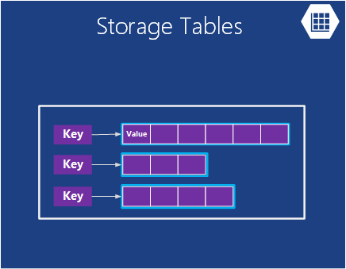
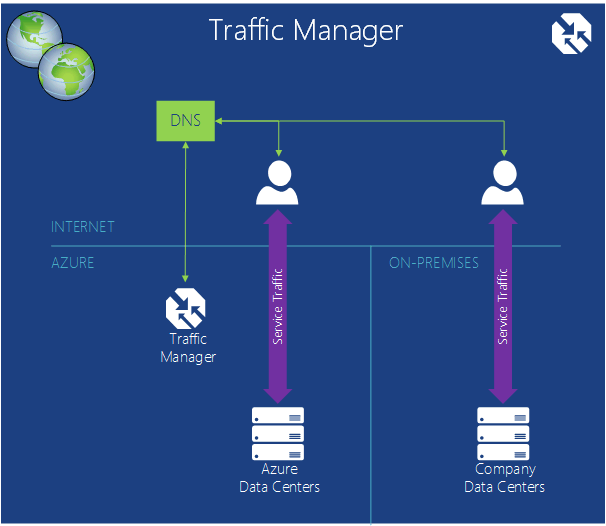
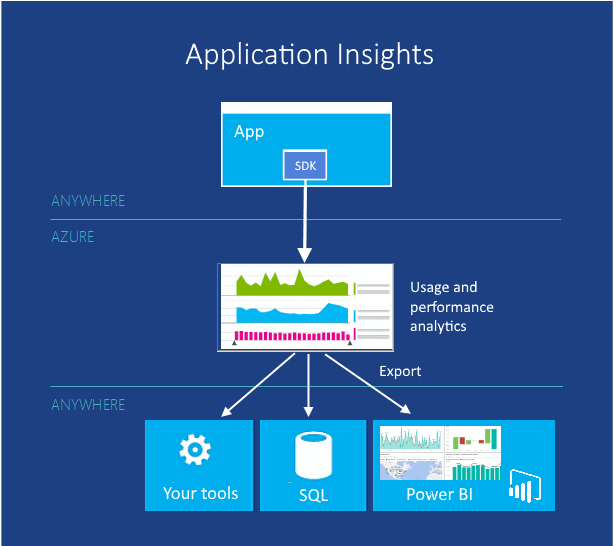
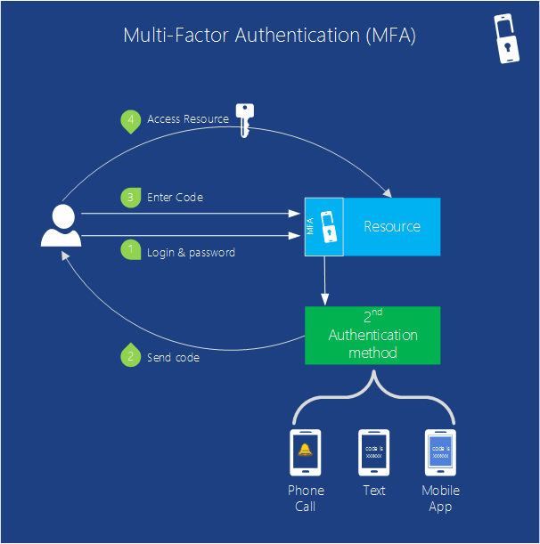
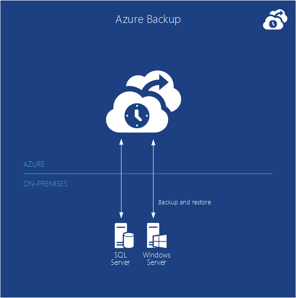
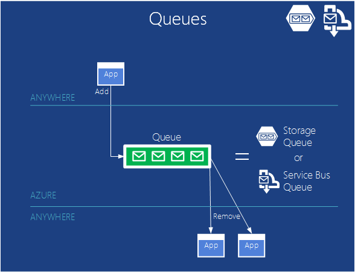

<properties
    pageTitle="Introduction à Microsoft Azure | Microsoft Azure"
    description="Vous débutez avec Microsoft Azure ? Obtenir une vue d’ensemble des services qu’il propose des exemples de comment ils sont utiles."
    services=" "
    documentationCenter=".net"
    authors="rboucher"
    manager="carolz"
    editor=""/>

<tags
    ms.service="multiple"
    ms.workload="multiple"
    ms.tgt_pltfrm="na"
    ms.devlang="na"
    ms.topic="article"
    ms.date="06/30/2015"  
    ms.author="robb"/>

# Présentation de Microsoft Azure

Microsoft Azure est une application plate-forme Microsoft pour le nuage public.  L’objectif de cet article est vous donner une base pour comprendre les concepts fondamentaux de Azure, même si vous ne connaissez cloud computing.

**Comment lire cet article**

Azure se développe tout le temps afin qu’elle soit facile à surchargé.  Commencer avec les services de base, qui apparaissent en premier dans cet article, puis passez à des services supplémentaires. Cela ne que vous ne pouvez pas utiliser uniquement les services supplémentaires en tant que telles, mais les services de base constituent le cœur d’une application en cours d’exécution dans Azure.

**Envoyer des commentaires**

Vos commentaires sont importants. Cet article devrait vous donner une présentation efficace de Azure. Si elle n’est pas le cas, dites-nous dans la section commentaires en bas de la page. Donner des détails sur ce que vous pensiez trouver et comment faire pour améliorer l’article.  

## Composants d’Azure

Azure regroupe les services en catégories dans le portail de gestion et diverses aides visuelles comme [Qu’est Azure Infographic](https://azure.microsoft.com/documentation/infographics/azure/) . Le portail de gestion est ce que vous permet de gérer la plupart des (mais pas toutes) services dans Azure.

Cet article va utiliser un **autre organisation** parler services basés sur fonction similaire et pour faire ressortir des services sous-adresse importants qui font partie de plus importants.  

   
 *Figure : Azure fournit des services d’application accessibles sur Internet en cours d’exécution dans Azure centres de données.*

## Portail de gestion
Azure dispose d’une interface web appelée le [Portail de gestion](http://manage.windowsazure.com) qui permet aux administrateurs d’accès et la gestion de plus, mais pas toutes les fonctionnalités Azure.  Microsoft publie généralement le portail d’interface utilisateur plus récent dans la version bêta avant de retirer un ancien. L’option plus récente est appelée [« Azure Preview portail »](https://portal.azure.com/).

Il est généralement un chevauchement long lorsque les deux portails sont actives. Tandis que les services de base seront affichent dans les deux portails, certaines fonctionnalités peuvent être disponibles dans les deux. Services plus récents susceptibles d’apparaître dans les services de premières et systèmes plus anciens portail plus récentes et fonctionnalités peuvent exister uniquement dans l’ancienne.  Le message ici est que si vous ne trouvez pas quelque chose dans le portail plus ancien, vérifiez la plus récente et vice versa.

## Cluster

L’une des choses plus simples qu'est une plateforme en nuage est exécuter les applications. Chacun des modèles de calcul Azure a son propre rôle à lire.

Vous pouvez utiliser ces technologies séparément ou associez-les que nécessaire pour créer la structure appropriée pour votre application. L’approche que vous choisissez dépend de problèmes que vous tentez de résoudre.

### Machines virtuelles Azure

   
*Figure : Azure Machines virtuelles vous donne un contrôle total sur des instances de machine virtuelle dans le cloud.*

La possibilité de créer une machine virtuelle à la demande, si à partir d’une image standard ou à partir d’un que vous fournissez, peut être très utile. Cette approche, souvent appelée Infrastructure en tant que Service (IaaS), est possibilités offertes par Machines virtuelles Azure. Figure 2 présente une combinaison de l’exécution d’une Machine virtuelle (machine virtuelle) et comment en créer un à partir d’un disque dur virtuel.  

Pour créer une machine virtuelle, vous spécifiez le disque dur virtuel à utiliser et la taille de la mémoire virtuelle.  Ensuite, vous payer pour le temps que la machine virtuelle est en cours d’exécution. Vous payez par les minutes et uniquement lorsqu’il est en cours d’exécution, bien qu’il existe une charge de stockage minimes pour tout en conservant le disque dur virtuel disponible. Azure offre une galerie du stock durs (appelées « images ») contenant un système d’exploitation de démarrage pour démarrer à partir de. Ces incluent les options Microsoft et du partenaire, tels que Windows Server et Linux, SQL Server, Oracle et bien d’autres encore. Vous pouvez créer des images et des disques durs virtuels et les télécharger vous-même. Vous pouvez même télécharger des disques durs virtuels qui contiennent uniquement des données et puis y accéder à partir de vos ordinateurs virtuels en cours d’exécution.

À l’endroit où le disque dur virtuel provient, vous pouvez stockez les modifications apportées pendant l’exécution d’une machine virtuelle. La prochaine fois que vous créez une machine virtuelle à partir de ce disque dur virtuel, éléments décrochez l’endroit où vous vous étiez arrêté. Les disques durs virtuels qui sauvegarder les Machines virtuelles sont stockés dans des objets BLOB Azure stockage, dont nous parlons ultérieurement.  Que signifie que vous obtenez redondance pour garantir la que vos ordinateurs virtuels ne disparaissent en raison de pannes matérielles et disque. Il est également possible de copier le disque dur virtuel modifié déconnecter Azure, puis exécutez-le.

Votre application est exécutée dans une ou plusieurs Machines virtuelles, en fonction de comment vous avez créé auparavant ou décidez de créer votre document à partir de zéro.

Cette approche assez générale vers le cloud computing peut être utilisée pour résoudre de nombreux problèmes différents.

**Scénarios de Machine virtuelle**

1.  **Développement/Test** - vous pouvez les utiliser pour créer une plateforme de développement et de test bon que vous pouvez arrêter lorsque vous avez terminé. Vous pouvez également créer et exécuter des applications qui utilisent toutes les langues et bibliothèques que vous le souhaitez. Ces applications peuvent utiliser les options de gestion des données Azure fournit, et vous pouvez également choisir d’utiliser SQL Server ou toute autre SGBD en cours d’exécution sur un ou plusieurs des machines virtuelles.
2.  **Déplacer les Applications vers Azure (levée et MAJ)** - « Levée et MAJ » fait référence à déplacer votre application bien que vous utiliseriez un chariot pour déplacer un objet volumineux.  Vous « levez » sur le disque dur virtuel à partir de votre centre de données locale et « MAJ » vers Azure et exécutez à cet emplacement.  En règle générale, vous devrez effectuer certaines tâches pour supprimer des dépendances sur d’autres systèmes. Si ils sont trop nombreux, vous pouvez choisir l’option 3 à la place.  
3.  **Prolonger votre centre de données** - machines virtuelles de Azure utiliser comme une extension de votre centre de données locale, SharePoint ou autres applications en cours d’exécution. Pour cela, il est possible de créer des domaines Windows dans le nuage en exécutant Active Directory dans Azure machines virtuelles. Vous pouvez utiliser le réseau virtuel Azure (mentionnée ultérieurement) réunir votre réseau local et votre réseau dans Azure.

### Applications Web

   
 *Figure : Azure Web Apps exécute une application de site Web dans le cloud sans avoir à gérer le serveur web sous-jacente.*

Une des actions les plus courantes que que les personnes effectuent dans le nuage est exécuter des applications web et sites Web. Machines virtuelles Azure l’autorise, mais toujours laisse vous avec la responsabilité de l’administration un ou plusieurs ordinateurs virtuels et les systèmes d’exploitation sous-jacente. Rôles de web services cloud pour ce faire, mais déploiement et leur mise à jour toujours prend travail administratif.  Que se passe-t-il si vous voulez simplement un site Web lorsque quelqu'un d’autre prend en charge le travail administratif à votre place ?

Il s’agit exactement ce que fournit des applications Web. Ce modèle de cluster offre un environnement web gérées à l’aide du portail de gestion Azure ainsi que des API. Vous pouvez déplacer une application Web existante dans les applications Web inchangée, ou vous pouvez créer un nouvel identifiant directement dans le cloud. Une fois qu’un site Web est en cours d’exécution, vous pouvez ajouter ou supprimer des instances dynamiquement, compter sur Azure Web Apps pour charger des demandes de solde entre eux. Applications Azure propose une option partagée, où votre site Web s’exécute sur une machine virtuelle avec d’autres sites, et une option standard qui permet à un site à s’exécuter dans sa propre machine virtuelle. L’option standard vous permet également d’augmenter la taille (puissance informatique) de vos instances si nécessaire.

Pour le développement d’applications Web prend en charge .NET, PHP, Node.js, Java et Python ainsi que la base de données SQL et MySQL (à partir de ClearDB, un partenaire Microsoft) pour le stockage relationnel. Il fournit également prise en charge intégrée pour plusieurs applications courantes, y compris WordPress, Joomla et Drupal. L’objectif est de proposer une plateforme économique, scalable et être utile pour la création d’applications web et sites Web dans le cloud public.

**Scénarios d’applications Web**

Applications Web est destiné à être utile pour les entreprises, les développeurs et agences de conception web. Pour les entreprises, il est une solution facile à gérer, format SVG, hautement sécurisée et hautement disponible pour les sites Web de présence en cours d’exécution. Lorsque vous avez besoin de configurer un site Web, il est préférable de commencer avec Azure Web Apps et procéder aux Services Cloud une fois que vous avez besoin d’une fonctionnalité qui n’est pas disponible. Reportez-vous à la fin de la section « Cluster » pour les liens supplémentaires qui peuvent vous aider à choisir entre les options.

### Services en nuage
   
*Figure : Services de Cloud Azure propose un emplacement pour exécuter du code personnalisé hautement scalable sur une plateforme comme un environnement de Service (PaaS)*

Supposons que vous voulez créer une application en nuage qui peut prendre en charge un nombre important d’utilisateurs simultanément, ne nécessite pas occuper de l’administration et jamais s’arrête. Vous serez peut être un fournisseur de logiciel établie, par exemple, qui a décidé d’adopter logiciel en tant que Service (SaaS) en créant une version d’un de vos applications dans le cloud. Ou vous serez peut être un démarrage création d’une application consommateur que vous attendez augmentera rapidement. Si vous créez sur Azure, le modèle de l’exécution devez-vous utiliser ?

Azure Web Apps permet de créer ce type d’application web, mais il existe certaines contraintes. Vous n’avez pas accès administratif, par exemple, ce qui signifie que vous ne pouvez pas installer des logiciels. Machines virtuelles Azure vous offre une grande souplesse, y compris l’accès administratif et vous certainement s’en servir pour créer une application très scalable, mais vous devez gérer de nombreux aspects de la fiabilité et administration vous-même. Vous voulez est une option qui vous donne le contrôle que vous avez besoin, mais gère également la plupart du travail nécessaire à la fiabilité et l’administration.

Il s’agit exactement ce qui est fourni par les Services en nuage Azure. Cette technologie est conçue expressément pour prendre en charge le format SVG, fiable et applications d’administration faible et il est un exemple de ce qui a généralement appelé plateforme en tant que Service (PaaS). Pour l’utiliser, vous créez une application à l’aide de la technologie choisie, tels que c#, Java, PHP, Python, Node.js ou autre chose. Votre code s’exécute puis machines virtuelles (appelées instances) exécute une version de Windows Server.

Mais ces machines virtuelles sont différentes de celles que vous créez avec le Machines virtuelles Azure. Pour le seul endroit, Azure lui-même gère les effectuant des éléments tels que l’installation de correctifs de système d’exploitation et automatiquement déploiement de nouveau corrigé images. Cela signifie que votre application ne doit pas conserver l’état dans les instances de rôle web ou de travail ; Il doit être maintenu à la place d’une des options de gestion des données Azure décrites dans la section suivante. Azure surveille également ces ordinateurs virtuels, le redémarrage tout qui échouent. Vous pouvez définir des services cloud pour créer automatiquement des instances plus ou moins en réponse à la demande. Ainsi, vous permettent de gérer l’utilisation accrue et puis mettre à l’échelle pour que vous n’êtes pas un abonnement payant autant lorsqu’il y a une utilisation moindre.

Vous avez deux rôles choisir lorsque vous créez une instance, tous les deux basés sur Windows Server. La différence entre les deux principale est qu’une instance d’un rôle web s’exécute IIS, n’est pas le cas d’une instance d’un rôle de collaborateur. Les deux sont gérées de la même façon, cependant, et cette pratique est courante pour une application à utiliser les deux. Par exemple, une instance de rôle web peut-être accepter des demandes d’utilisateurs, puis les passer à une instance de rôle de collaborateur pour traitement. Pour redimensionner votre application vers le haut ou vers le bas, vous pouvez demander qu’Azure créer plusieurs instances de chaque rôle ou arrêter les instances existantes. Et similaires au Machines virtuelles Azure, vous êtes facturées uniquement l’heure que chaque instance de rôle web ou de travail s’exécute.

**Scénarios de Services de cloud**

Services en nuage sont idéales prendre en charge de grande échelle arrière lorsque vous devez davantage de contrôle sur la plateforme que prévu par les applications Web Azure mais que vous n’avez pas besoin de contrôle sur le système d’exploitation sous-jacent.

#### Choix d’un modèle de calcul
La page [Azure Web Apps, de Services de Cloud et de comparaison des Machines virtuelles](./app-service-web/choose-web-site-cloud-service-vm.md) fournit des informations plus détaillées sur la façon de choisir un modèle de calcul.

## Gestion des données

Applications ont besoin de données et différents types d’applications doivent différents types de données. Pour cette raison, Azure propose différentes façons de stocker et gérer les données. Azure offre de nombreuses options de stockage, mais toutes sont conçues pour le stockage très fiable.  Avec n’importe lequel de ces options, il existe toujours 3 copies de vos données synchronisées entre un centre de données Azure--6 si vous autorisez Azure utiliser geo redondance pour sauvegarder vers un autre centre de données au moins 300 miles absent (e).     

### Machines virtuelles
La fonctionnalité permettant d’exécuter SQL Server ou toute autre SGBD une machine virtuelle créée avec le Machines virtuelles Azure a déjà été mentionnée. Réaliser que cette option n’est pas limitée aux systèmes relationnelles ; Vous pouvez également exécuter des technologies d’assistance NoSQL comme MongoDB et Cassandra. Fonctionne avec votre propre système de base de données est simple informatique réplique que nous êtes habitués dans nos propres centres de données- mais elle nécessite également la gestion de l’administration de SGBD en cours.  Dans les autres options, Azure gère la plus grande partie de l’administration pour vous.

Là encore, l’état de la Machine virtuelle et n’importe quel disque des données supplémentaires vous créez ou téléchargez bénéficient de stockage d’objets blob (dont nous parlons ultérieurement).  

### Base de données SQL Azure
   

*Figure : Base de données SQL Azure fournit un service de base de données relationnelle gérées dans le cloud.*

Espace de stockage relationnelles, Azure fournit la fonctionnalité de base de données SQL. Ne laissez pas l’appellation vous tromper. C’est différent à une base de données SQL classique fournie par SQL Server s’exécutant sur Windows Server.  

Anciennement appelé SQL Azure, base de données SQL Azure fournit toutes les principales fonctionnalités d’un base de données relationnelle système de gestion, notamment les transactions atomiques, accès aux données simultanée par plusieurs utilisateurs avec l’intégrité des données, des requêtes SQL ANSI et un modèle de programmation familier. À l’image SQL Server, base de données SQL sont accessibles à l’aide de Framework entité, ADO.NET, JDBC et autres données familier accès technologies d’assistance. Il prend également en charge la plupart du langage T-SQL, ainsi que des outils SQL Server telles que SQL Server Management Studio. Pour tout le monde familiarisé avec SQL Server (ou une autre base de données relationnelle), à l’aide de la base de données SQL est simple.

Base de données SQL n’est pas simplement un SGBD dans le cloud-it d’un service PaaS. Vous toujours Contrôlez vos données et qui peut y accéder, mais base de données SQL prend en charge le travail d’administration, telles que la gestion de l’infrastructure matérielle et automatiquement tout en conservant le logiciel de base de données et le système d’exploitation à jour. Base de données SQL assure également une grande disponibilité, sauvegardes automatiques, point-à-temps des capacités de restauration et peuvent répliquer des copies sur régions géographiques.  

**Scénarios de base de données SQL**

Si vous créez une application Azure (à l’aide d’un des modèles de cluster) qui doit stockage relationnel, base de données SQL peut être une bonne solution. Applications en cours d’exécution en dehors du cloud peuvent également utiliser ce service, cependant, il n’y en a beaucoup d’autres scénarios. Par exemple, les données stockées dans la base de données SQL sont accessibles à partir de systèmes autre client, y compris les ordinateurs de bureau, ordinateurs portables, tablettes et téléphones. Et, car il offre haute disponibilité intégrée grâce à la réplication, à l’aide de la base de données SQL peut aider à réduire les temps d’arrêt.

### Tables
  

*Figure : Tables Azure offre un moyen NoSQL plat pour stocker les données.*

Cette fonctionnalité est parfois appelée différents termes comme il est partie d’une plus grande fonctionnalité appelée « Stockage Azure ». Si vous voyez « tables », « tables Azure » ou « tables de stockage », il est la même chose.  

Et ne vous inquiétez pas selon le nom : cette technologie ne fournit pas de stockage relationnel. En fait, il est un exemple d’une approche NoSQL appelée magasin de clé/valeur. Les Tables Azure permettent une application à stocker des propriétés de types différents, tels que des chaînes, des dates et des nombres entiers. Une application peut ensuite extraire un groupe de propriétés en fournissant une clé unique pour le groupe. Tandis que vous les opérations complexes telles que les jointures ne sont pas pris en charge, tables offrent un accès rapide aux données tapées. Ils sont également très extensible, avec une seule table peut stocker jusqu'à un To de données. Et mise en correspondance leur simplicité, tables sont généralement moins coûteuses à utiliser que stockage relationnel de base de données SQL.

**Scénarios pour les tableaux**

Supposons que vous voulez créer une application Azure nécessitant un accès rapide aux tapé des données, peut-être beaucoup de, mais n’a pas besoin pour effectuer des requêtes SQL complexes sur ces données. Imaginons, par exemple, que vous créez une application consommateur qui doit stocker les informations de profil client pour chaque utilisateur. Votre application va agir en très populaire, afin que vous devez autoriser de grandes quantités de données, mais vous ne suffit pas ces données au-delà de stockage, puis l’extraction dans méthodes simples. Il s’agit exactement le type de scénario où Tables Azure a du sens.

### Objets BLOB
    
*Figure : Objets BLOB Azure fournit des données binaires non structurées.*  

Objets BLOB Azure (à nouveau « Stockage d’objets Blob » et simplement « stockage BLOB » sont identiques en fait) est conçu pour stocker des données binaires non structurées. Tels que des Tables, des objets BLOB offre un stockage économique et blob unique peut être aussi élevée que 1 To (un to). Applications Azure peuvent également utiliser les lecteurs Azure, qui permettent à des objets BLOB de fournir un stockage permanent pour un système de fichiers Windows monté dans une instance Azure. L’application voit les fichiers Windows ordinaires, mais le contenu est stocké dans un blob.

Stockage d’objets BLOB est utilisé par plusieurs autres Azure fonctionnalités (y compris les Machines virtuelles), afin de pouvoir certainement traiter vos charges de travail trop.

**Scénarios d’objets BLOB**

Une application qui stocke les fichiers vidéo, massives ou autres informations binaires peut utiliser des objets BLOB pour le stockage simple et peu coûteux. Objets BLOB sont également fréquemment utilisées en association avec d’autres services, tels que le réseau de distribution de contenu, qui nous allons aborder ultérieurement.  

### Importer / exporter
  

*Figure : Azure importation / exportation offre la possibilité d’envoyer un disque dur physique ou à partir d’Azure pour les données en bloc plus rapide et plus économique importer ou exporter.*  

Parfois, vous souhaitez déplacer un grand nombre de données dans Azure. Qui serait prendre un certain temps, peut-être jours et utiliser une grande quantité de bande passante. Dans ce cas, vous pouvez utiliser Azure importer/exporter, qui vous permet d’envoyer chiffrées Bitlocker 3,5" disques durs SATA directement aux centres de données Azure, où Microsoft transférera les données dans le stockage blob pour vous.  Une fois que le téléchargement est terminé, Microsoft fournie avec les lecteurs avec vous.  Vous pouvez également demander que grandes quantités de données à partir du stockage Blob être exportées sur disques durs et envoyées par le biais courrier.

**Scénarios d’importer / exporter**

- **Migration de données volumineux** - dès que vous avez de grandes quantités de données (To) que vous voulez télécharger dans Azure, le service d’importation/exportation est souvent beaucoup plus rapide et peut-être plus économique que le transfert via internet. Une fois les données dans des objets BLOB, vous pouvez le traiter dans d’autres formats tels que le stockage de Table ou une base de données SQL.

- **Récupération des données archivées** : vous pouvez utiliser importer/exporter pour a Microsoft transfert de grandes quantités de données stockées dans le stockage Blob Azure à un dispositif de stockage que vous envoyez et puis cet appareil ont remis à un emplacement de votre choix. Étant donné que cela prend un certain temps, il n’est pas une bonne option récupération d’urgence. Il est préférable pour les données que vous n’avez pas besoin d’un accès rapide aux archivées.

### Service de fichiers
    
*Figure : Fournit des Services de fichiers Azure PME \\ \\chemins serveur\partage soit disponible pour les applications qui s’exécutent dans le cloud.*

En local, il est courant d’avoir des grandes quantités de stockage de fichiers accessible via le protocole de serveur Message bloc (PME) à l’aide une \\ \\format serveur\partage soit disponible. Azure comporte maintenant un service qui vous permet d’utiliser ce protocole dans le cloud. Applications qui s’exécutent dans Azure peuvent l’utiliser pour partager des fichiers entre machines virtuelles à l’aide du système de fichiers familiers API comme ReadFile et WriteFile. En outre, les fichiers sont également accessibles en même temps via une interface reste, qui vous permet d’accéder aux partages locales lorsque vous configurez également un réseau virtuel. Fichiers Azure est basé sur le service blob, afin qu’il hérite même disponibilité, durabilité, extensibilité élevées et geo-redondance de stockage Azure.

**Scénarios d’Azure fichiers**

- **Migration des applications existantes dans le cloud** - son plus faciles à migrer locale applications dans le cloud qui utilisent des partages de fichiers pour partager des données entre des composants de l’application. Chaque machine virtuelle se connecte au partage de fichiers et puis il peut lire et écrire des fichiers comme il faites par rapport à un fichier en local sur le partage.

- **Paramètres de l’Application partagée** - un motif courantes pour les applications distribuées est d’avoir des fichiers de configuration dans un emplacement centralisé où ils sont accessibles à partir de différentes machines virtuelles. Ces fichiers de configuration peuvent être stockés dans un partage de fichiers Azure et lus par toutes les instances de l’application. Les paramètres peuvent également être gérés via l’interface REST, qui permet d’accéder aux fichiers de configuration dans le monde.

- **Partager des diagnostics** - vous pouvez enregistrer et partager des fichiers, tels que les images complètes blocage, journaux et indicateurs de diagnostic. Présence de ces fichiers disponibles via la PME et le reste interface permet aux applications d’utiliser un éventail d’outils d’analyse pour traitement et analyser les données de diagnostic.

- **Développement/Test/débogage** - développeurs ou les administrateurs travaillent sur machines virtuelles dans le cloud, ils doivent souvent un ensemble d’outils ou utilitaires. L’installation et la distribution de ces utilitaires sur chaque ordinateur virtuel prend beaucoup de temps. Fichiers Azure, un développeur ou un administrateur peut stocker leurs outils favorites sur un partage de fichiers et s’y connecter à partir de n’importe quelle machine virtuelle.

## Mise en réseau

Azure s’exécute aujourd'hui dans nombreux centres de données du globe. Lorsque vous exécutez une application ou stockez des données, vous pouvez sélectionner une ou plusieurs de ces centres de données à utiliser. Vous pouvez également vous connecter à ces centres de données de différentes manières en utilisant les services ci-dessous.

### Réseau virtuel
   

*Figure : Réseaux virtuels fournit un réseau privé dans le cloud afin que différents services peuvent communiquer entre eux, ou à des ressources locales si vous avez configuré un réseau VPN entre locaux connexion.*  

Une manière utile d’utiliser un nuage public consiste à considérer comme une extension de votre propre centre de données.

Étant donné que vous pouvez créer des ordinateurs virtuels à la demande, puis supprimez-les (et arrêter payer) lorsqu’ils ne sont plus nécessaires, vous pouvez avoir puissance informatique uniquement lorsque vous le souhaitez. Et dans la mesure où Machines virtuelles Azure vous permet de créer des machines virtuelles exécutant SharePoint, Active Directory et autres logiciels familiers en local, cette approche peut fonctionner avec les applications que vous avez déjà.

Pour effectuer cette opération vraiment utile, cependant, vos utilisateurs doivent être en mesure de traiter ces applications comme s’ils ont été en cours d’exécution dans votre propre centre de données. Il s’agit exactement ce qui permet de réseau virtuel Azure. À l’aide d’une passerelle VPN, un administrateur peut configurer un réseau privé virtuel (VPN) entre votre réseau local et vos ordinateurs virtuels déployés sur un réseau virtuel dans Azure. Car vous attribuer votre propre v4 des adresses IP dans le cloud machines virtuelles, ils apparaissent sur votre propre réseau. Utilisateurs de votre organisation peuvent accéder aux applications ces machines virtuelles contiennent comme s’ils ont été exécuté localement.

Pour plus d’informations sur la planification et création d’un réseau virtuel qui vous convient, voir [Réseau virtuel](./virtual-network/virtual-networks-overview.md).

### Voie Express

   

*Figure : ExpressRoute utilise un réseau virtuel Azure, mais achemine les connexions des plus rapidement des lignes dédiées au lieu de l’Internet public.*  

Si vous avez besoin de plus de bande passante ou de sécurité à un réseau virtuel Azure connexion peut fournir, vous pouvez envisager d’ExpressRoute. Dans certains cas, ExpressRoute peut également économiser de l’argent. Vous devez toujours un réseau virtuel dans Azure, mais le lien entre Azure et votre site utilise une connexion dédiée qui ne sont pas acheminés via Internet public. Pour pouvoir utiliser ce service, vous devez disposer d’un contrat avec un fournisseur de services de réseau ou un fournisseur d’exchange.

La configuration d’un ExpressRoute connexion requiert plus de temps et de planification, vous souhaiterez donc commencer avec un réseau privé virtuel de site à, puis migrer vers une connexion ExpressRoute.

Pour plus d’informations sur ExpressRoute, voir [Présentation technique ExpressRoute](./expressroute/expressroute-introduction.md).

### Gestionnaire de trafic

   

*Figure : Azure le trafic Manager vous permet à acheminer le trafic global à votre service en fonction des règles intelligents.*

Si votre application Azure s’exécute dans plusieurs centres de données, vous pouvez utiliser le Gestionnaire de trafic Azure pour acheminer les demandes d’utilisateurs intelligemment pour plusieurs instances de l’application. Vous pouvez également acheminer le trafic vers services s’exécutent ne pas dans Azure dans la mesure où ils sont accessibles à partir d’internet.  

Une application Azure avec des utilisateurs dans une seule partie du monde peut s’exécuter dans le centre de données Azure qu’un seul. Toutefois, une application avec des utilisateurs répartis dans le monde, est censée pour s’exécuter en plusieurs centres de données, peut-être même chacun d'entre eux. Dans ce cas deuxième, vous rencontrez un problème lié : comment traiter vous intelligemment directement aux utilisateurs d’instances de l’application ? La plupart du temps, vous voudrez probablement chaque utilisateur d’accéder au centre de données le plus proche de lui, étant donné que c’est probablement lui donnera le meilleur moment de réponse. Mais que se passe-t-il si cette instance de l’application est surchargée ou non disponible ? Dans ce cas, il est intéressant de diriger son demande automatiquement vers un autre centre de données. Il s’agit exactement ce qui est fait par le Gestionnaire de trafic Azure.

Le propriétaire d’une application définit les règles qui spécifient comment les demandes des utilisateurs doivent être adressées aux centres de données, puis repose sur le Gestionnaire de trafic pour effectuer ces règles. Par exemple, les utilisateurs peuvent normalement dirigés vers le centre de données Azure le plus proche, mais envoyés à une autre lorsque le temps de réponse à partir de leur centre de données par défaut dépasse le temps de réponse à partir d’autres centres de données. Pour les applications globalement distribuées avec plusieurs utilisateurs, il est utile de disposer d’un service pour traiter les problèmes comme ceux-ci intégré.

Le trafic Gestionnaire utilise Directory Name Service (DNS) pour acheminer les utilisateurs aux points de terminaison de service, mais davantage le trafic ne sont pas acheminés via le Gestionnaire de trafic une fois que cette connexion est établie. Cela empêche le trafic gestionnaire ne soient une critique peut ralentir vos communications service.

## Services pour les développeurs
Azure offre un certain nombre d’outils pour aider les développeurs et les professionnels de l’informatique créer et gérer des applications dans le cloud.  

### Kit de développement logiciel Azure
Revenez dans 2008, vous devez commencer par pré-version de Azure pris en charge uniquement le développement .NET. Aujourd'hui, cependant, vous pouvez créer des applications Azure dans pratiquement n’importe quelle langue. Microsoft fournit actuellement SDK spécifiques à une langue pour .NET, Java, PHP, Node.js, Ruby et Python. Il existe également un SDK Azure général qui prend en charge base n’importe quelle langue, tel que C++.  

Ces SDK vous aide à générer, déployer et gérer les applications Azure. Qu’elles sont disponibles à partir de [www.microsoftazure.com](https://azure.microsoft.com/downloads/) ou GitHub, et ils peuvent être utilisés avec Visual Studio et Eclipse. Azure offre également les outils de ligne de commande qui permet aux développeurs avec n’importe quel environnement éditeur ou le développement, y compris les outils de déploiement des applications à Azure des systèmes Linux et Macintosh.

Ainsi que vous aider à créer des applications Azure, ces kits offrent également les bibliothèques client pour vous aider à créent des logiciels qui utilise des services Azure. Par exemple, vous est peut-être créer une application qui lit et écrit des objets BLOB Azure ou créer un outil qui déploie des applications Azure via l’interface de gestion Azure.

### Visual Studio Team Services

Visual Studio Team Services est un nom marketing couvrant un nombre services qui aident à développer des applications dans le Azure.

Pour éviter toute confusion - il ne fournit pas une version hébergée ou sur le Web de Visual Studio. Vous avez encore besoin votre copie locale en cours d’exécution de Visual Studio. Mais il propose de nombreux autres outils qui peuvent être très utiles.

Il inclut un système de contrôle de code source hébergé appelé Team Foundation Service, qui offre le contrôle de version et suivi des éléments de travail.  Vous pouvez même utiliser Git contrôle de version si vous préférez que. Et vous pouvez varier du système de contrôle de source utilisé par project. Vous pouvez créer des projets d’équipe privé illimité accessibles à partir de n’importe où dans le monde.  

Visual Studio Team Services fournit un service de test de charge. Vous pouvez exécuter les tests de charge créés dans Visual Studio sur machines virtuelles dans le cloud. Vous indiquez le nombre total d’utilisateurs que vous voulez charger test avec et Visual Studio Team Services détermine automatiquement le nombre d’agents est nécessaires, tourner les machines virtuelles requis et exécuter les tests de charge. Si vous êtes abonné à MSDN, vous obtenez des milliers de minutes d’utilisateur gratuits de chaque mois de test de charge.

Visual Studio Team Services prend également en charge pour le développement agile avec des fonctionnalités telles que l’intégration continue crée, tableaux Kanban et salles équipe virtuelle.

**Scénarios de Services équipe Visual Studio**

Visual Studio Team Services est un bon choix pour les entreprises qui doivent collaborer dans le monde entier et n’est déjà l’infrastructure en place pour le faire. Vous pouvez obtenir le programme d’installation en quelques minutes, choisissez un système de contrôle de code source et démarrer écrire du code et la création de ce jour.  Les outils d’équipe fournissent un emplacement pour débute et collaboration et les outils supplémentaires fournissent l’analyse nécessaire pour tester et régler rapidement votre application.

Mais organisations qui ont déjà un système local peuvent tester les nouveaux projets Visual Studio Team Services pour déterminer si elle est plus efficace.   

### Analyse de l’application

  

*Figure : Application Insights moniteurs performances et l’utilisation de votre application web ou un appareil live.*

Lorsque vous avez publié votre application - si elle s’exécute sur les appareils mobiles, ordinateurs de bureau ou navigateurs web - Application Insights vous indique comment elle s’exécute et ce que font les utilisateurs avec lui. Il permet de solidariser un nombre d’incidents et de réponse lente, alerte vous si les chiffres dépasser seuils inacceptables et vous aideront à diagnostiquez les problèmes.

Lorsque vous développez une nouvelle fonctionnalité, pensez à mesurer son succès avec des utilisateurs. En analysant des modèles d’utilisation, vous comprenez ce qui convient le mieux à vos clients et améliorer votre application dans chaque cycle de développement.

Bien que s’il est hébergé dans Azure, Insights Application fonctionne pour une large gamme d’applications, internes ou externes Azure à croissante. J2EE et ASP.NET web applications couverts, ainsi qu’iOS, Android, OSX et les applications Windows. Télémétrie est envoyé à partir d’un kit de développement créé avec l’application, pour être analysé et affiché dans le service d’Application Insights dans Azure.

Si vous voulez plus spécialisées analytique, exporter le flux de données de télémétrie pour une base de données, ou pour Power BI, ou d’autres outils.

**Scénarios d’analyse des applications**

Vous développez une application. Il peut être une application web ou une application d’appareil ou d’une application de périphérique avec une principale web.

* Optimiser les performances de votre application après sa publication, ou bien qu’il soit dans charger le test.  Application Insights regroupe télémétrie toutes les instances installés et vous propose des graphiques de temps de réponse, demande et le nombre d’exception, temps de réponse de dépendance et d’autres indicateurs de performance. Il vous aident à optimiser les performances de votre application. Vous pouvez insérer du code pour générer un rapport en plus des données spécifiques si vous en avez besoin.
* Détecter et diagnostiquer les problèmes dans votre application live. Vous pouvez recevoir des alertes par courrier électronique si des indicateurs de performance dépasser seuils acceptables. Vous pouvez rechercher des sessions utilisateur spécifique, par exemple afficher la requête qui a provoqué une exception.
* Effectuer le suivi de l’utilisation d’évaluer le succès de chaque nouvelle fonctionnalité. Lorsque vous créez un nouveau récit utilisateur, pensez à mesurer combien il est utilisé, et indique si les utilisateurs leurs objectifs attendus. Analyse de l’application vous propose des données de l’utilisation de base telles que des affichages de page web, et vous pouvez insérer du code pour effectuer le suivi de l’expérience utilisateur plus en détail.

### Automatisation
Personne n’aime perdre de temps à faire continuellement les mêmes processus manuels. Automatisation Azure offre un moyen vous permettant de créer, surveiller, gérer et déployer des ressources dans votre environnement Azure.  

Automation utilise les procédures « opérationnelles », qui utilise des flux de travail Windows PowerShell (par opposition à PowerShell habituels) en coulisses. Procédures opérationnelles sont destinés à être exécuté sans interaction de l’utilisateur. Flux de travail PowerShell permet l’état d’un script doit être enregistré auprès de points de contrôle. En cas de panne, vous n’est pas nécessaire démarrer un script à partir du début. Vous pouvez le redémarrer au dernier point de contrôle. Cela vous évite beaucoup de travail essaie de rendre le script gérer chaque défaillance possible.

**Scénarios d’automatisation**

Automatisation Azure constitue un bon choix pour automatiser les tâches manuelles, longue, des erreurs et si vous effectuez souvent dans Azure.

### Gestion des API

Créer et publier des Interfaces de programmation d’Application (API) sur internet sont une pratique courante pour fournir des services aux applications. Si ces services sont revendable (par exemple, les données météorologiques), une organisation peut autoriser d’autres tiers pour accéder à ces mêmes services pour un abonnement. Mise à l’échelle pour les partenaires de plus, vous devez généralement optimiser et contrôler l’accès.  Certains partenaires devrez même les données dans un format différent.

Gestion des API Azure facilite les organisations publier des API aux partenaires, employés et les développeurs tiers en toute sécurité et à l’échelle. Il fournit un point de terminaison API différent et se comporte comme un proxy pour appeler le point de terminaison réel tout en fournissant des services tels que la mise en cache, la transformation, la limitation, le contrôle d’accès et d’agrégation analytique.

**Scénarios de gestion de l’API**

Supposons que votre entreprise utilise un ensemble de périphériques qu’il faut alors rappeler à un service central pour obtenir des données, par exemple, une société de transport qui comporte des appareils dans chaque chariot en déplacement.  La société souhaiterez certainement définir un système pour effectuer le suivi de son propre chariots afin de pouvoir fiable prédire et mettre à jour les délais de livraison. Il sachent chariots combien il a et planifier correctement.  Chaque chariot devront un appareil rappelle vers un emplacement central avec ses données la position et la vitesse et qui est peut-être plus.

Un client de la société de livraison la plus fréquente également bénéficier de l’obtention de ces données positionnement.  Le client peut l’utiliser pour savoir combien produits aient à, où ils êtes bloqués, combien ils plutôt que sur certains des routes (si combiné avec qu’ils payant à livrer). Si la société de transport regroupe ces données déjà, de nombreux clients peuvent payer.  Mais, la société de transport doit permettent de fournir aux clients les données. Une fois qu’ils permettent d’accéder aux clients, ils ne disposez ne peut-être pas de contrôler la fréquence à laquelle les données sont demandées. Ils devront fournir les règles quant à qui peut accéder à quelles données. Toutes ces règles devra être intégré à leur API externe. Il s’agit de l’endroit où l’API gestion peuvent vous aider.  

## Identité et accès

Utilisation des identités fait partie de la plupart des applications. Savoir qui est un utilisateur permet à une application de déterminer comment il doit interagir avec cet utilisateur. Azure fournit des services pour aider à effectuer le suivi d’identité ainsi que l’intégration de banques d’identités que vous utilisiez déjà.

### Active Directory

Comme la plupart des services d’annuaire, Azure Active Directory stocke des informations sur les utilisateurs et les organisations qu'auquel ils appartiennent. Il permet aux utilisateurs de se connecter, puis les fournit avec jetons qu’ils peuvent présenter aux applications pour prouver son identité. Il permet également de synchroniser les informations utilisateur et Active Directory Windows Server en cours d’exécution en local dans votre réseau local. Tandis que les mécanismes et les formats de données utilisés par Azure Active Directory ne sont pas identiques à ceux qui sont utilisés dans Active Directory de Windows Server, les fonctions qu'elle effectue sont très similaires.

Il est important de comprendre que Azure Active Directory est conçu principalement pour une utilisation par les applications cloud. Il peut être utilisé par les applications en cours d’exécution sur Azure, par exemple, ou sur d’autres plateformes cloud. Il est également utilisé par les applications de cloud de Microsoft, tels que ceux dans Office 365. Si vous souhaitez étendre votre centre de données dans le cloud à l’aide de Machines virtuelles Azure et réseau virtuel Azure, cependant, Azure Active Directory n’est pas le bon choix. À la place, vous souhaiterez exécuter Windows Server Active Directory dans des Machines virtuelles.

Pour permettre les applications à accéder aux informations qu’il contient, Azure Active Directory fournit une API RESTful appelé Azure Active Directory Graph. Cette API permet aux applications en cours d’exécution sur les objets de répertoire plateforme access et les relations entre eux.  Par exemple, une application autorisée peut-être utiliser cette API pour en savoir plus sur un utilisateur, les groupes auxquels qu'il appartient et autres informations. Applications peuvent également afficher les relations entre les utilisateurs leurs sociale graph-vous permettant de les utiliser plus intelligemment les connexions entre les personnes.

Une autre fonctionnalité de ce service, le contrôle d’accès Azure Active Directory, facilite pour une application à accepter les informations d’identité de Facebook, Google, Windows Live ID et d’autres fournisseurs d’identité populaires. Plutôt que d’exiger l’application de comprendre les divers formats de données et les protocoles utilisés par chacun de ces fournisseurs, le contrôle d’accès tous les traduit par un format courant unique. Il vous permet également d’une application accepte la connexion à partir d’un ou plusieurs domaines Active Directory. Par exemple, un fournisseur offrant une application SaaS peut-être utiliser contrôle d’accès Azure Active Directory pour accorder aux utilisateurs dans chacun de ses clients de l’authentification unique à l’application.

Services d’annuaire sont un sous-jacente core en local informatique. Il ne doit pas être étonnant qu’ils sont également importantes dans le cloud.

### Authentification multifacteur
   

*Figure : L’authentification multifacteur fournit les fonctionnalités pour votre application pour vérifier plusieurs formulaires d’identification*

Sécurité est toujours importante. L’authentification multifacteur (MFA) vous permet de vous assurer que seuls les utilisateurs eux-mêmes accéder à leurs comptes. L’authentification Multifacteur (également appelé deux facteurs d’authentification ou « 2FA ») nécessite deux de ces trois méthodes de vérification d’identité pour les transactions et compléments d’authentification utilisateur fournissent des utilisateurs.

- Quelque chose que vous connaissez (généralement un mot de passe)
- Ce que vous avez (un périphérique de confiance n’est pas facilement dupliqué, par exemple un téléphone)
- Quelque chose que vous soyez (biométrie)

Donc lorsqu’un utilisateur se connecte, vous pouvez leur demander également vérifier son identité avec une application mobile, un appel téléphonique ou un message en texte en combinaison avec son mot de passe. Par défaut, Azure Active Directory prend en charge l’utilisation de mots de passe comme méthode d’authentification uniquement pour les compléments d’authentification utilisateur. Vous pouvez utiliser l’authentification Multifacteur avec Azure AD ou avec des applications personnalisées et des répertoires à l’aide du SDK MFA. Vous pouvez également l’utiliser avec les applications locales à l’aide de serveur d’authentification multifacteur.

**Scénarios de l’authentification Multifacteur**

Protection de connexion pour les comptes sensibles telles que les connexions bancaire et d’accès de code source où entrée non autorisé peut avoir une propriété intellectuelle ou financière haute de coût.   

## Mobile

Si vous créez une application pour un appareil mobile, Azure permettent de stocker les données dans le cloud, authentification des utilisateurs et envoyer des notifications de transmission sans avoir à écrire une grande quantité de code personnalisé.

Pendant que vous puissiez certainement créer le serveur principal pour une application mobile à l’aide de Machines virtuelles, des Services en nuage ou des applications Web, vous pouvez passer beaucoup moins de temps écriture les composants du service sous-jacent à l’aide services de Azure.

### Applications mobiles

*Figure : Applications mobiles fournit les fonctionnalités fréquemment requises par les applications qui interfacent avec des appareils mobiles.*

Azure applications Mobile fournit de nombreuses fonctions qui permettent de gagner du temps lors de la création d’un serveur principal pour une application Mobile. Il permet de vous permettent d’effectuer la mise en service simple et la gestion des données stockées dans une base de données SQL. Avec un code côté serveur, vous pouvez facilement utiliser les options de stockage des données supplémentaires, tels que stockage blob ou MongoDB. Applications Mobile prend en charge les notifications, bien que dans certains cas, vous pouvez utiliser Notification Hubs comme décrit ci-après.  Le service a également une API REST que votre application mobile peut appeler pour travailler. Applications Mobile offre également la possibilité pour l’authentification des utilisateurs via Microsoft et Active Directory, ainsi que d’autres fournisseurs d’identité connu, tels que Facebook et Twitter, Google.   

Vous pouvez utiliser d’autres Services Azure comme Bus de Service et les rôles de travail et se connecter aux systèmes locaux. Vous pouvez même consommer 3e partie modules complémentaires à partir du magasin Azure (par exemple, SendGrid pour la messagerie électronique) pour fournir des fonctionnalités supplémentaires.

Bibliothèques native client pour Android, iOS, HTML/JavaScript, Windows Phone et Windows Store facilement le développement d’applications sur toutes les principales plates-formes mobiles. Une API REST vous permet d’utiliser des fonctionnalités de données et l’authentification de Services mobiles avec applications sur différentes plateformes. Un seul service mobile permet de sauvegarder plusieurs applications client afin que vous pouvez fournir une expérience utilisateur cohérente sur plusieurs périphériques.

Azure prenant en charge grande échelle déjà, vous pouvez gérer le trafic comme votre application devient plus populaire.  Surveillance et journalisation sont prises en charge pour aider à résoudre les problèmes et gérer les performances.

### Notification Hubs

  

*Figure : Notification Hubs fournit les fonctionnalités fréquemment requises par les applications qui interfacent avec des appareils mobiles.*

Pendant que vous pouvez écrire du code pour effectuer des notifications dans les applications Mobile Azure, Hubs de Notification est optimisé pour la diffusion des millions de notifications de transmission personnalisés quelques minutes.  Vous n’avez pas à vous soucier des détails tels que les opérateurs mobiles ou fabricant. Vous pouvez cibler individuels ou des millions d’utilisateurs avec un seul appel d’API.

Notification Hubs est conçu pour fonctionner avec un serveur principal. Vous pouvez utiliser les applications Mobile Azure, un serveur principal personnalisé dans le cloud s’exécutant sur n’importe quel fournisseur ou un serveur principal local.

**Scénarios de concentrateur de notification** Si vous écrivez un jeu mobile où joueurs a eu se transforme, vous devrez avertir joueur 2 que joueur 1 terminé son tour. Si c’est tout ce que vous devez faire, vous pouvez simplement utiliser applications Mobile. Mais si vous aviez 100 000 utilisateurs lire votre jeu et que vous voulez envoyer une fois sensible offre d’abonnement gratuit à tout le monde, Hubs de Notification est le meilleur choix.

Vous pouvez envoyer des informations de dernière minute, événements et notifications d’annonce produit à des millions d’utilisateurs de sport avec une faible latence. Les entreprises peuvent informer leurs employés sur les nouvelles communications sensibles heure, tels que les prospects, afin que les employés n’êtes pas obligé de vérifier constamment messagerie ou autres applications pour rester informé. Vous pouvez également envoyer une-mots de passe requise pour l’authentification multifacteur.

## Sauvegarder
Chaque entreprise a besoin sauvegarder et restaurer des données. Vous pouvez utiliser Azure pour sauvegarder et restaurer votre application dans le nuage ou sur site. Azure offre plusieurs options pour aider selon le type de sauvegarde.

### Récupération de site

Récupération de Site Azure (anciennement Gestionnaire de récupération Hyper-V) peut vous aider à protéger les applications importantes à coordonner la réplication et la restauration sur sites. Récupération de site permet de protéger les applications basées sur Hyper-v, VMWare ou SAN à votre propre site secondaire au site d’un hébergeur ou au Azure et d’éviter les coûts et la complexité de la création et la gestion de votre propre site secondaire. Azure chiffre des données et les communications et que vous avez la possibilité d’activer le chiffrement pour les données au repos trop.

Il surveille l’état de vos services en permanence et aident à automatiser la récupération ordonnée des services en cas de panne site auprès du centre de données principale. Machines virtuelles peut être mis en mode orchestré afin de restaurer le service rapidement, même pour les charges de travail à plusieurs niveaux complexes.

Récupération de site fonctionne avec les technologies d’assistance existants comme réplica Hyper-V, System Center et SQL Server toujours sur. Consultez [Présentation de la récupération de Site Azure](site-recovery/site-recovery-overview.md) pour plus d’informations.

### Sauvegarde Azure
  

*Figure : Azure sauvegarde les données à partir de serveurs Windows en local dans le nuage.*  

Azure sauvegarde les données à partir de serveurs locale exécutant Windows Server dans le cloud. Vous pouvez gérer vos sauvegardes directement depuis les outils de sauvegarde dans Windows Server 2012, Windows Server 2012 Essentials ou System Center 2012 - Gestionnaire de Protection des données. Vous pouvez également utiliser un agent de sauvegarde spécialisé.

Données sont plus sûres car les sauvegardes sont chiffrés avant la transmission et stockées chiffré dans Azure et protégé par un certificat que vous téléchargez. Le service utilise la protection des données redondantes et hautement disponible même figurant dans le stockage Azure.  Vous pouvez sauvegarder des fichiers et dossiers à intervalles réguliers ou immédiatement, sauvegardes complètes ou incrémentielles en cours d’exécution. Une fois que les données sont sauvegardées sur le nuage, les utilisateurs autorisés peuvent récupérer facilement des sauvegardes à n’importe quel serveur. Il propose également des stratégies de rétention des données configurable, compression de données et transfert de données la limitation de sorte que vous pouvez gérer le coût pour stocker et transférer des données.

**Scénarios d’Azure sauvegarde**

Si vous utilisez déjà Windows Server ou System Center, sauvegarde Azure est une solution naturelle pour sauvegarder votre système de fichiers de serveurs, machines virtuelles et des bases de données SQL Server.  Il fonctionne avec les fichiers chiffrés, incomplets et compressés. Il existe certaines limitations, afin que vous devez [vérifier les conditions préalables Azure sauvegarde](http://technet.microsoft.com/library/dn296608.aspx) .

## Messagerie et l’intégration

Quel que soit son activité, code fréquemment doit interagir avec un autre code.  Dans certains cas, tout ce qui est nécessaire est base des messages en file d’attente. Dans les autres cas, les interactions plus complexes sont nécessaires. Azure offre différents moyens vous permettent de résoudre ces problèmes. Figure 5 illustre les choix.

### Files d’attente

*Figure : Files d’attente autoriser libres coupler entre des composants d’une application et facilitent la mise à l’échelle.*  

Queuing est une idée simple : une application place un message dans une file d’attente, et ce message est lu finalement par une autre application. Si votre application doit simplement ce service simple, files d’attente Azure peut être le meilleur choix.

En raison de la façon dont le Azure ont connu une hausse au fil du temps, Azure stockage files d’attente et Service Bus proposent des services files d’attente similaires. Les raisons pourquoi vous pouvez utiliser une au-dessus de l’autre sont décrites dans le document technique relativement [Azure files d’attente et files d’attente de Service Bus - comparaison et Contrasted](http://msdn.microsoft.com/library/azure/hh767287.aspx).  Dans de nombreux scénarios, des options sont prises en charge.

**Scénarios de file d’attente**

Nous sommes aujourd'hui l’une utilisation courante des files d’attente pour permettre à une instance de rôle web de communiquer avec une instance de rôle de collaborateur dans l’application de Services de Cloud même.

Par exemple, supposons que vous créez une application Azure de partage vidéo. L’application est composée de code PHP en cours d’exécution dans un rôle web qui vous permet de télécharger les utilisateurs et regardez des vidéos, avec un rôle de collaborateur activée dans c# qui vidéo téléchargée se traduit par différents formats.

Lorsqu’une instance de rôle web reçoit une nouvelle vidéo d’un utilisateur, il peut stocker la vidéo dans un blob, puis envoyer un message à un rôle de collaborateur via une file d’attente lui indiquant où trouver cette nouvelle vidéo. Un rôle de collaborateur instance-it n’a pas d’importance qui vous un puis lisez le message de la file d’attente et procéder aux traductions vidéo requises en arrière-plan.

Structuration d’une application de cette manière permet d’un traitement asynchrone, et il facilite également l’application à l’échelle, étant donné que le nombre d’instances de rôle web et instances de rôle de collaborateur peut être modifiée séparément. Vous pouvez également utiliser la taille de la file d’attente comme un déclencheur à l’échelle le nombre de rôles de travail vers le haut ou vers le bas. Trop élevée, et ajouter d’autres rôles. Lorsqu’il arrive inférieur, vous pouvez réduire le nombre de rôles à économiser de l’argent en cours d’exécution.  

Vous pouvez utiliser ce modèle même entre plusieurs différentes parties de votre application même s’ils n’utilisent des rôles web et collaborateur.  Il vous permet de mettre à l’échelle les parties de chaque côté de la file d’attente vers le haut ou vers le bas en tant que demande et nécessite des temps de traitement.

### Bus des services
Si elles s’exécutent dans le cloud, dans votre centre de données, sur un appareil mobile ou un autre endroit, applications devront interagir. L’objectif de Bus des services Azure est pour permettre aux applications qui s’exécutent à peu près n’importe où échanger des données.

Outre les files d’attente (une) décrits plus haut, Bus des services fournit également à d’autres méthodes de communication.

#### Service Bus relais

*Figure : Service Bus relais permet la communication entre les applications de chaque côté d’un pare-feu.*

Bus des services permet de communication directe via son service de relais, un moyen sécurisé pour interagir à travers les pare-feu. Relais Bus des services permettent aux applications de communiquer en échangeant des messages à un point de terminaison hébergé dans le nuage, plutôt que localement.

**Scénarios de relais Bus de service**

Applications communiquent par le biais Bus des services peuvent être applications Azure ou des logiciels s’exécutant sur certaines autres plateforme cloud. Ils peuvent également être applications qui s’exécutent à l’extérieur du cloud, cependant. Par exemple, considérez une compagnie aérienne qui mettent en œuvre, services réservation dans ordinateurs au sein de son propre centre de données. La compagnie aérienne doit exposent ces services pour de nombreux clients, y compris les bornes d’archivage dans les aéroports, terminaux de l’agent de réservation et même les téléphones de clients. Il peut utiliser Bus des services pour ce faire, création souple interactions entre les différentes applications.

#### Abonnements et les rubriques de Bus de Service
   
 *Figure : Service Bus rubriques permet à plusieurs applications publier des messages et autres applications pour vous inscrire pour recevoir les messages qui répondent à des critères spécifiques.*

Service Bus fournit un mécanisme de publication et d’abonnement appelé rubriques et abonnements. Avec publish-subscribe, une application peut envoyer des messages à un sujet, tandis que d’autres applications peuvent créer des abonnements dans cette rubrique. Cela permet de communication un-à-plusieurs entre un ensemble d’applications, ce qui permet du même message d’être lu par plusieurs destinataires.

**Service Bus rubriques et abonnements scénarios**

À tout moment vous configurez où il existe plusieurs messages qui se trouvent tous importants, mais différents systèmes en aval ont uniquement besoin d’écouter à différents sous-ensembles de ces communications, Service Bus rubrique et abonnements sont un bon choix.

### Services BizTalk
   
 *Figure : Services BizTalk permet de transformer des formats de messages XML dans le cloud.*

Parfois, vous devez vous connecter systèmes de communiquent au moyen de différents formats de messagerie. Cette pratique est courante pour les entreprises pour que les schémas de base de données différente et XML messagerie formats, même si une norme commune est disponible. Plutôt que d’écrire un grand nombre de code personnalisé, que vous pouvez utiliser BizTalk Server en local pour intégrer différents systèmes.  Les Services BizTalk Azure fournit le même type de service, mais dans le cloud. Vous pouvez régler uniquement ce que vous utilisez et ne vous inquiétez pas sur échelle que vous devez en local.

**Scénarios de Services BizTalk**

Interactions entreprises (B2B) nécessitent généralement ce type de traduction.  Par exemple, une société création avions doit commander les pièces à partir de différents composants fournisseurs. Il aura de nombreux fournisseurs de composants.  Ces commandes doivent être automatisés pour accéder directement à partir des systèmes générateurs avion dans les systèmes de fournisseurs.  Aucune entreprise souhaite modifier les systèmes de base et les formats de message, et il est peu probable que ces formats sont identiques. Services BizTalk peut prendre de messages et traduire entre les nouveaux formats de deux façons. Soit le fournisseur avion peut faire le travail traduction ou différents fournisseurs peuvent, en fonction de qui souhaite plus de contrôle et la quantité de traduction nécessaire.     

## Calculer l’Assistance
Azure propose une assistance pour les services qui n’ont pas besoin pour exécuter tout le temps.  

### Planificateur

   
*Figure : Azure Scheduler permet de planifier des tâches à un moment donné pendant une durée spécifique.*

Parfois applications suffit exécuter à un moment donné. Sur Azure, vous pouvez enregistrer argent avec ce type d’application au lieu de laisser une application simplement continuer à fonctionner 24 x 7 en attente pour traiter les données. Planificateur Azure permet de planifier lorsqu’une application doit s’exécuter en fonction d’intervalle de temps ou un calendrier. Il est fiable et que vous allez vérifier qu’un processus s’exécute même s’il existe des échecs de centre réseau, ordinateur et les données. L’API REST planificateur vous permet de gérer ces actions.

En cas d’une alerte planifiée, planificateur envoie des messages HTTP ou HTTPS à un point de terminaison spécifique ou peut placer un message dans la file d’espace de stockage.  Vous devez donc que votre application ont un point de terminaison accessible ou qu’il surveiller une file d’attente de stockage. Puis une fois qu’il reçoit le message, il peut effectuer toute action il est programmé pour.

**Scénarios de planificateur**

- Les actions d’applications périodique : par exemple, un service peut régulièrement obtenir des données depuis twitter et collecter les données dans un flux normal.
- Maintenance quotidienne : journal de traitement ou de nettoyage, exécution des sauvegardes et autre façon intermittente planifier des tâches.
- Tâches qui s’exécutent pendant la nuit.
- Tâches des applications Web comme quotidienne nettoyage des journaux, effectuer des sauvegardes et autres tâches de maintenance. Un administrateur peut choisir de sa base de données de sauvegarde à 01 : 00 quotidiennement pour les 9 mois à venir, par exemple.

L’API du planificateur vous permet de créer, mettre à jour, supprimer, afficher et gérer les collections de travail et les tâches planifiées par programme.

## Performances

Performances sont toujours important pour une application. Applications tendent à accéder à plusieurs reprises les mêmes données. Une des façons d’améliorer les performances consiste à conserver une copie de ces données rapprocher à l’application, en réduisant le temps nécessaire pour la récupérer. Azure fournit différents services pour cela.

### La mise en cache Azure

   
 **Figure : Une application Azure peut en cache les données en mémoire et diviser même au sein de nombreux rôles de travail**

Accéder aux données stockées dans n’importe quel de gestion des données de Azure base de données services SQL, des tableaux ou des objets BLOB-est relativement rapide. Encore l’accès aux données stockées dans la mémoire est encore plus rapide. Pour cette raison, tout en conservant une copie en mémoire des données fréquemment consultées améliorer les performances de l’application. Vous pouvez utiliser la mise en cache en mémoire d’Azure pour effectuer cette action.

Une application de Services de Cloud, vous pouvez stocker les données dans ce cache, puis récupérer directement, sans avoir besoin d’accéder au stockage permanent. Le cache peut être mis à jour à l’intérieur machines virtuelles de votre application ou être fourni par machines virtuelles exclusivement destinés à la mise en cache. Dans les deux cas, le cache peut être distribué, avec les données qu’il contient double sur plusieurs ordinateurs virtuels dans un centre de données Azure.

Azure comporte un certain nombre de technologies d’assistance cache différent qui ont déplacé au fil du temps. Dans l’ordre qu’ils ont été introduites, il est partagé, rôles, gérée et Redis du cache. La mise en cache partagé est une technologie plus ancienne et vous ne doivent pas créer de nouvelles mises en œuvre avec lui. Le Cache géré a les mêmes fonctionnalités du cache de rôle, mais en tant que service géré en dehors du portail de gestion Azure. Le Cache Redis est dans l’aperçu. L’implémentation Redis comporte le plus grand nombre de fonctionnalités et est recommandée lorsque vous écrivez du nouveau code de mise en cache.

**Scénarios de Cache Azure**

Une application qui lit à plusieurs reprises un catalogue produit peut-être bénéficier de l’utilisation de ce type de mise en cache, par exemple, depuis les données qu’il a besoin seront disponible plus rapidement. La technologie prend également en charge le verrouillage, laisser être utilisé avec en lecture/écriture ainsi que les données en lecture seule. Et applications ASP.NET peuvent utiliser le service pour stocker les données de session avec simplement une modification de configuration.

### Réseau de distribution de contenu
   
 **Figure : Copies d’un objet blob peuvent être mis en cache sur les sites dans le monde entier.**

Supposons que vous avez besoin stocker des données blob qui seront accessibles par les utilisateurs dans le monde entier. Il est peut-être une vidéo de la dernière correspondance coupe du monde, par exemple, mises à jour du pilote ou un livre électronique populaires. Stocker une copie des données dans plusieurs centres de données Azure aidera, mais si un grand nombre d’utilisateurs, il est probablement pas suffisamment. Pour encore améliorer les performances, vous pouvez utiliser le CDN Azure.

Le CDN comporte des douzaines de sites dans le monde entier, chacune capable de stockage de copies des objets BLOB Azure. La première fois qu’un utilisateur dans une partie du monde accède à un blob donné, les informations qu’elle contient sont copiées à partir d’un centre de données Azure dans stockage CDN local dans cette zone géographique. Après cela, accès à partir de cette partie du monde utilise la copie d’objets blob mis en cache dans le CDN-qu’ils n’aurez pas besoin accéder à l’extrême au centre de données Azure le plus proche. Le résultat est un accès plus rapide aux données fréquemment consultées par les utilisateurs n’importe où dans le monde.

**Scénarios CDN**

Il est généralement utilisée CDN avec Media Services pour diffuser des vidéos dans le monde. Vidéo est généralement volumineux et nécessite un grand nombre de bande passante.  Media Services est parlé ailleurs dans cette page.

## Big Data et cluster volumineux

### HDInsight (Hadoop)
   
 **Figure : HDInsight permet le traitement en bloc de grandes quantités de données**

De nombreuses années, la majeure partie de l’analyse de données a été effectuée à des données relationnelles stockées dans un data warehouse créé avec un SGBD. Ce type d’analytique entreprise est toujours important, et il sera pendant une longue période à venir. Mais que se passe-t-il si les données que vous voulez analyser est tellement large que bases de données relationnelles simplement ne peuvent pas gérer ? Et supposons que les données n’est pas relationnelles ? Il peut être serveur consigne dans un centre de données, par exemple, ou données historiques événement de capteurs ou autre chose. Dans ce cas, vous avez ce qui est appelé un problème de données volumineux. Vous avez besoin d’une autre approche.

La technologie principal aujourd'hui pour l’analyse des données volumineux est Hadoop. Un Apache ouvrir projet source, cette technologie stocke les données à l’aide du système de fichier distribué Hadoop (HDFS), puis permet aux développeurs de créer des travaux MapReduce pour analyser des données. HADOOP double des données sur plusieurs serveurs, segments s’exécute de la tâche MapReduce sur chacun d’eux, ce qui permet des données volumineux alors être traité en parallèle.

HDInsight est le nom de service d’Azure Hadoop Apache. HDInsight vous permet de HADOOP stocker des données sur le cluster et les distribuer parmi plusieurs ordinateurs virtuels. Il répartit également la logique d’un travail MapReduce sur ces machines virtuelles. Comme avec Hadoop en local, les données sont traitée logique localement l’et les données qu’il fonctionne sur se trouvent dans la même machine virtuelle- et en parallèle pour améliorer les performances. HDInsight peut également stocker des données dans Azure stockage l’archivage sécurisé situer, qui utilise des objets BLOB.  ASV permet de réaliser des économies, car vous pouvez supprimer votre cluster HDInsight lorsqu’elles pas en cours d’utilisation, mais tout en conservant vos données dans le cloud.

HDinsight prend en charge les autres composants de l’écosystème Hadoop ainsi, y compris Hive et cochon. Microsoft a également créé composants qui facilitent utiliser des données obtenues par HDInsight à l’aide des outils de décisionnel traditionnels, par exemple, la carte HiveODBC et Explorer des données qui fonctionnent avec Excel.

### High Performance Computing (cluster volumineux)

Une des façons d’utiliser une plateforme cloud plus attrayants consiste à exécuter haute performance computing (HPC) et autres applications « Calculer volumineux ». Les exemples sont des applications d’ingénierie spécialisées conçues pour utiliser la norme passant Interface MPI (Message), ainsi que les dites ces applications, ces modèles de risque financier.

L’essence même de calculer volumineux est l’exécution de code sur plusieurs ordinateurs en même temps. Sur Azure, cela signifie exécutant plupart virtuel ordinateurs simultanément, tout en parallèle pour résoudre un problème. Cela nécessite une façon quelconque aux ressources et planifier les applications, c'est-à-dire, à distribuer leur travail sur ces instances. Pack HPC gratuit de Microsoft et autres solutions de cluster cluster peuvent fonctionner correctement dans Azure, profiter de services de cluster et de l’infrastructure Azure pour ajouter la capacité à la demande à un cluster de calcul locale ou exécuter volumineux calculer vos applications entièrement dans le cloud.

Azure fournit une plage de machine virtuelle tailles instance avec des configurations différentes de processeur cœurs, mémoire, capacité du disque et autres caractéristiques pour répondre aux exigences de différentes applications. Le travail d’instances A8 et A9 récemment introduit également pour un grand nombre de calcul intensives charges de travail et applications MPI parallèles en particulier, parce qu’ils ont haut débit, processeurs voie et grandes quantités de mémoire. Dans certaines configurations les instances de tirer parti d’un réseau de faible latence et haut débit application dans le nuage qui inclut la technologie d’accès (RDMA) à distance direct à la mémoire pour une efficacité maximale des applications MPI parallèles.

Azure offre également calculer volumineux les développeurs d’applications et partenaires un ensemble complet de fonctionnalités cluster, services, les options d’architecture et outils de développement. Azure prend en charge calculer volumineux flux de travail personnalisés impliquant des flux de travail données spécialisées et projet et la tâche planification des motifs pouvant évoluer à des milliers de calculent cœurs.

## Éléments multimédias

   
 **Figure : Media Services est une plate-forme pour les applications qui fournissent des vidéos et autres éléments multimédias aux clients du monde entier.**

Vidéo constitue une grande partie du trafic Internet aujourd'hui, et ce pourcentage sera encore plu demain. Tout en fournissant vidéo sur le web n’est pas simple. Il existe un nombre important de variables, telles que l’algorithme de codage et la résolution d’écran de l’écran de l’utilisateur. Vidéo s’avère également avoir rupture de la demande, comme un pic samedi soir lorsque grand nombre de personnes décidez qu'il souhaite regarder une vidéo en ligne.

Étant donné sa popularité, il est sécurisé bien sûr que de nombreuses nouvelles applications seront créées ce utiliser la vidéo. Encore celles-ci devrez ne résoudre les problèmes similaires et ses effectuer chacun d'entre eux à résoudre les problèmes dans sa propre facilite n’a aucun sens. Une meilleure approche consiste à créer une plateforme qui propose des solutions courantes pour de nombreuses applications à utiliser. Et création cette plate-forme dans le cloud comporte certains avantages effacer. Il peut être largement disponible par répartition, et il peut également gérer la variabilité à la demande sont souvent des applications vidéo.

Azure Media Services résout ce problème. Il propose un ensemble de composants de cloud qui facilitent la vie des personnes en créant et en exécutant des applications à l’aide de la vidéo et autres supports.

Comme le montre la figure, Media Services propose un ensemble de composants pour les applications qui fonctionnent avec des vidéos et autres fichiers multimédias. Par exemple, il inclut un support d’acquisition composant pour télécharger la vidéo dans Media Services (où il est stocké dans des objets BLOB Azure), un composant de codage qui prend en charge différents formats audio et vidéo, un composant de protection du contenu qui fournit la gestion des droits numériques, un composant d’insertion d’annonces dans un flux vidéo, composants de diffusion en continu et plus. Les partenaires Microsoft peuvent également fournir des composants pour la plateforme, puis demander à Microsoft de distribuer des composants et nomenclature en leur nom.

Applications qui utilisent ce plate-forme peuvent s’exécuter sur Azure ou ailleurs. Par exemple, une application de bureau pour une maison de production vidéo peut laisser ses utilisateurs Téléchargez vidéo sur Media Services, traitez-le de différentes manières. Par ailleurs, un service de gestion de contenu sur le cloud s’exécutant sur Azure peut-être compter sur Media Services pour traiter et distribuer vidéo. À l’endroit où elle s’exécute et ce que c’est le cas, chaque application choisit les composants elle doit utiliser, y accéder au moyen d’interfaces RESTful.

Pour distribuer le produit, une application peut utiliser Azure CDN, un autre fournisseur, ou simplement envoyer bits directement aux utilisateurs. Cependant, il arrive, vidéo créée à l’aide de Media Services peut être utilisé par les différents systèmes de clients, y compris Windows, Macintosh, HTML 5, iOS, Android, Windows Phone, Flash et Silverlight. L’objectif consiste à rendre plus facile de créer des applications multimédias moderne.

**Références**

Pour un affichage plus visuels du fonctionnement des Services de support, téléchargez l' [Azure Media Services affiche][Azure Media Services Poster].

## Commerce

L’augmentation du logiciel en tant que Service transforme comment nous créer des applications. Il est également vous permettra de transformer comment nous vendre applications. Dans la mesure où une application SaaS sont situées dans le cloud, il est préférable que ses clients potentiels doivent ressembler des solutions en ligne. Et cette modification s’applique également aux données en ce qui concerne les applications. Pourquoi personnes ne doivent pas rechercher dans le cloud pour des groupes de données disponibles sur le marché ? Microsoft aborde les deux de ces problèmes grâce à la [Azure Marketplace](https://azure.microsoft.com/marketplace/).

   
 **Figure : Azure Marketplace et Azure sécurisée vous permettent de trouver et acheter des applications Azure et des datasets professionnelle et les utiliser dans le cadre de vos applications Azure.**

La différence entre les deux est que le portail de gestion Azure Marketplace ne respecte, mais le magasin sont accessibles à partir à l’intérieur du portail. Les clients potentiels peuvent effectuer une recherche pour trouver les applications Azure qui répondent à leurs besoins. Clients peuvent rechercher des jeux de données professionnelle, notamment des données démographiques, données financières, les données géographiques et plus encore. Lorsqu’elle trouve quelque chose qu’ils aiment, ils peuvent y parvenir de des options du fournisseur, directement via les emplacements web Marketplace ou Store ou dans certains cas, à partir du portail de gestion. Applications peuvent également utiliser l’API de recherche Bing via le marché, qu’ils puissent accéder aux résultats des recherches sur le web.

**Scénarios de Commerce**

SendGrid est une application dans le magasin Azure qui vous permet d’envoyer des messages. Il propose des fonctionnalités supplémentaires telles que la remise fiable et statistiques.  Vous pouvez acheter cette application et les services connexes plutôt qu’élaborer une telle infrastructure vous-même.  

## Prise en main

Maintenant que vous avez une vision-, l’étape suivante consiste à écrire votre première application Azure. Choisir votre langue, [obtenir le Kit de développement appropriée](/downloads/), composition à emporter pour lui. Cloud computing est la nouvelle valeur par défaut : Préparez-vous maintenant.

[Azure Media Services Poster]: http://azure.microsoft.com/documentation/infographics/media-services/
