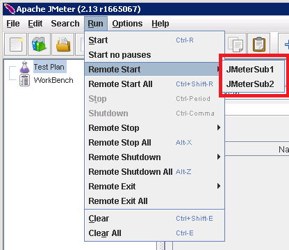

<properties
   pageTitle="Création d’un environnement de test pour Elasticsearch de performances | Microsoft Azure"
   description="Comment configurer un environnement de test les performances d’un cluster Elasticsearch."
   services=""
   documentationCenter="na"
   authors="dragon119"
   manager="bennage"
   editor=""
   tags=""/>

<tags
   ms.service="guidance"
   ms.devlang="na"
   ms.topic="article"
   ms.tgt_pltfrm="na"
   ms.workload="na"
   ms.date="09/22/2016"
   ms.author="masashin"/>
   
# <a name="creating-a-performance-testing-environment-for-elasticsearch-on-azure"></a>Création d’un environnement de test pour Elasticsearch sur Azure de performances

[AZURE.INCLUDE [pnp-header](../../includes/guidance-pnp-header-include.md)]

Cet article fait [partie d’une série](guidance-elasticsearch.md). 

Ce document décrit comment configurer un environnement de test les performances d’un cluster Elasticsearch. Cette configuration permet de tester les performances de charges de réception et de requête de données, comme décrit dans les [performances de réception de données de réglage pour Elasticsearch sur Azure][].

Le processus de test de performances utilisé [JMeter Apache](http://jmeter.apache.org/), avec le [jeu standard](http://jmeter-plugins.org/wiki/StandardSet/) de plug-ins installés dans une configuration maître/subalterne en utilisant un ensemble de machines virtuelles dédiés (n’appartenant pas au cluster Elasticsearch) spécifiquement configuré à cet effet. 

L' [Analyseur de performances Server Agent](http://jmeter-plugins.org/wiki/PerfMonAgent/) a été installé sur chaque nœud Elasticsearch. Les sections suivantes fournissent des instructions pour recréer l’environnement de test et vous permettent de diriger vos propres tests de performances avec JMeter. Ces instructions part du principe que vous avez déjà créé un cluster Elasticsearch avec les nœuds connectés à l’aide d’un réseau virtuel Azure. 

Notez que l’environnement de test fonctionne également comme un ensemble de machines virtuelles Azure géré à l’aide d’un groupe de ressources Azure unique.

[Marvel](https://www.elastic.co/products/marvel) a été également installé et configuré pour activer les aspects internes du cluster Elasticsearch pour surveiller et analyser plus facilement. Si les statistiques de JMeter a montré une pointe ou bac de performances, les informations disponibles via Marvel peuvent être très utiles pour aider à déterminer la cause des variations.

L’image suivante montre la structure de l’ensemble du système. 


Notez les points suivants :

- Le masque des JMeter machine virtuelle s’exécute Windows Server pour offrir l’environnement graphique pour la console JMeter. La VM JMeter maître fournit l’interface utilisateur (application *jmeter* ) pour activer un tester à créer des tests, des tests et visualiser les résultats. Cet ordinateur virtuel coordonnées avec le serveur JMeter machines virtuelles qui en fait envoyer les demandes qui constituent les tests.

- Les ordinateurs virtuels subordonnées JMeter exécutent Ubuntu serveur (Linux), il est inutile de l’interface utilisateur pour ces machines virtuelles. Le serveur JMeter machines virtuelles exécuter le logiciel de serveur (l’application de *jmeter serveur* ) pour envoyer des demandes au cluster Elasticsearch JMeter.

- Les nœuds clients dédié n’étaient pas utilisés, bien que les nœuds maîtres dédiés ont été.

- Le nombre de nœuds de données dans le cluster peut varier, selon le scénario testé.

- Tous les nœuds du cluster Elasticsearch exécuter Marvel d’observer les performances lors de l’exécution et l’Agent de serveur JMeter pour collecter les données d’analyse pour analyser ultérieurement.

- Lorsque vous testez Elasticsearch 2.0.0 et version ultérieure, un des nœuds de données s’exécute également Kibana. Il s’agit requises par la version de Marvel qui s’exécute sur Elasticsearch 2.0.0 et versions ultérieures.

## <a name="creating-an-azure-resource-group-for-the-virtual-machines"></a>Création d’un groupe de ressources Azure pour les ordinateurs virtuels

Le masque des JMeter doivent être en mesure de se connecter directement à chacun des nœuds dans le cluster Elasticsearch pour collecter les données de performance. Si la JMeter VNet est différent du cluster Elasticsearch VNet, cela implique configuration chaque nœud Elasticsearch avec une adresse IP publique. Si cela est un problème de configuration Elasticsearch, puis implémenter les ordinateurs virtuels JMeter dans le même VNet que le cluster Elasticsearch en utilisant le même groupe de ressources, auquel cas, vous pouvez ignorer cette procédure première.

Tout d’abord, [créez un groupe de ressources](../resource-group-template-deploy-portal.md). Ce document suppose que votre groupe de ressources se nomme *JMeterPerformanceTest*. Si vous souhaitez exécuter les ordinateurs virtuels JMeter dans le même VNet que le cluster Elasticsearch, utilisez le même groupe de ressources en tant que ce dernier au lieu de créer un nouvel identifiant.

## <a name="creating-the-jmeter-master-virtual-machine"></a>Création de la machine virtuelle maître JMeter

Suivant [créer une machine virtuelle Windows](../virtual-machines/virtual-machines-windows-hero-tutorial.md) à l’aide de l’image de *Windows Server 2008 R2 SP1* .  Nous vous recommandons de sélectionner une taille de mémoire virtuelle suffisant cœurs et de mémoire pour exécuter les tests de performances. Dans l’idéal il s’agit d’un ordinateur avec au moins 2 cœurs et 3,5 Go de RAM (A2 Standard ou plus grand).

<!-- TODO add info on why disabling diagnostics is positive --> 

Nous vous recommandons de désactiver les Diagnostics de vérification. Lorsque vous créez la machine virtuelle dans le portail, cela sur la carte de *paramètres* dans la section *analyse* sous *Diagnostics*. Conservez les autres paramètres des valeurs par défaut.

Vérifiez que la machine virtuelle et toutes les ressources associées ont été créés correctement en [examiner le groupe de ressources](../azure-portal/resource-group-portal.md#manage-resource-groups) dans le portail. Les ressources répertoriées doivent comporter une machine virtuelle, un groupe de sécurité réseau et une adresse IP publique tout portant le même nom et compte interface et du stockage réseau avec des noms basés sur celui de la machine virtuelle.

## <a name="creating-the-jmeter-subordinate-virtual-machines"></a>Création de machines virtuelles subordonnées JMeter

À présent [créer une machine virtuelle Linux](../virtual-machines/virtual-machines-linux-quick-create-portal.md) à l’aide de l’image *Ubuntu Server 14.04 LTS* .  Comme avec la machine virtuelle maître JMeter, sélectionnez une taille de mémoire virtuelle suffisant cœurs et de mémoire pour exécuter les tests de performances. Dans l’idéal il s’agit d’un ordinateur avec au moins 2 cœurs et au moins 3,5 Go de RAM (A2 Standard ou plus grand).

Là encore, nous vous recommandons de désactiver les Diagnostics de vérification.

Vous pouvez créer des machines virtuelles subordonnées autant que vous le souhaitez. 

## <a name="installing-jmeter-server-on-the-jmeter-subordinate-vms"></a>Installation de server JMeter sur les ordinateurs virtuels subordonnées JMeter

Les ordinateurs virtuels subordonnées JMeter exécutent Linux et par défaut ne peut pas vous connecter à via une connexion Bureau à distance (RDP). À la place, vous pouvez [utiliser PuTTY pour ouvrir une fenêtre de ligne de commande](../virtual-machines/virtual-machines-linux-mac-create-ssh-keys.md) sur chaque ordinateur virtuel.

Une fois que vous avez connectés à un des ordinateurs virtuels subordonnées, nous allons utiliser Bash configuration JMeter.

Tout d’abord, installez l’environnement d’exécution Java requis pour exécuter JMeter.

```bash
sudo add-apt-repository ppa:webupd8team/java
sudo apt-get update
sudo apt-get install oracle-java8-installer
```

À présent, téléchargez le logiciel JMeter présente sous la forme d’un fichier zip.

```bash
wget http://apache.mirror.anlx.net/jmeter/binaries/apache-jmeter-2.13.zip
```

Installez la commande Unzip (décompresser), puis utilisez-le pour développer le logiciel JMeter. Le logiciel est copié dans un dossier nommé **apache-jmeter-2.13**.

```bash
sudo apt-get install unzip
unzip apache-jmeter-2.13.zip
```

Modifier dans le répertoire *bin* contenant les exécutables JMeter, puis effectuez les programmes *jmeter server* et *jmeter* exécutable.

```bash
cd apache-jmeter-2.13/bin
chmod u+x jmeter-server
chmod u+x jmeter
```

À présent, nous avons besoin de modifier le fichier `jmeter.properties` situé dans le dossier actif (utilisez l’éditeur de texte que vous êtes plus familiers tels que *vi* ou *vim*). Recherchez les lignes suivantes :

```yaml
...
client.rmi.localport=0
...
server.rmi.localport=4000
...
```

Supprimez les commentaires (supprimer l’interligne \#caractères #) et modifier ces lignes comme indiqué ci-dessous, puis enregistrez le fichier et fermez l’éditeur :

```yaml
...
client.rmi.localport=4441
...
server.rmi.localport=4440
```

À présent, exécutez les commandes suivantes pour ouvrir le port 4441 pour le trafic entrant TCP (c’est le port que vous venez de configurer *jmeter server* pour écouter) :

```bash
sudo iptables -A INPUT -m state --state NEW -m tcp -p tcp --dport 4441 -j ACCEPT
```

Téléchargez le fichier zip contenant la collection standard de plug-ins pour JMeter (ces plug-ins fournissent des compteurs d’analyse performances) et puis décompressez le fichier dans le dossier **apache-jmeter-2.13** . Décompresser le fichier à cet emplacement nb_car n’en spécifie les plug-ins dans le dossier approprié.

Si vous êtes invité à remplacer le fichier de licence, tapez A (pour tous) :

```bash
wget http://jmeter-plugins.org/downloads/file/JMeterPlugins-Standard-1.3.0.zip
unzip JMeterPlugins-Standard-1.3.0.zip
```

Utiliser `nohup` pour lancer le serveur JMeter en arrière-plan. Il doit répondre en affichant un ID de processus et un message indiquant qu’il a créé un objet distant et est prêt à commencer à recevoir des commandes.  Exécutez la commande suivante dans le répertoire ~/apache-jmeter-2.13/bin. 

```bash
nohup jmeter-server &
```

> [AZURE.NOTE]Si la machine virtuelle est arrêté le programme serveur JMeter est terminé. Vous devez vous connecter à la machine virtuelle et redémarrez à nouveau manuellement. Par ailleurs, vous pouvez configurer le système pour exécuter la commande *jmeter server* automatiquement au démarrage en ajoutant les commandes suivantes pour la `/etc/rc.local` fichier (avant la commande *quitter 0* ) :

```bash
sudo -u <username> bash << eoc
cd /home/<username>/apache-jmeter-2.13/bin
nohup ./jmeter-server &
eoc
```

Remplacer `<username>` avec votre nom d’utilisateur.

Vous trouverez peut-être utile de laisser la fenêtre du terminal ouverte afin que vous pouvez surveiller l’avancement du serveur JMeter alors que le test est en cours.

Vous devrez Répétez ces étapes pour chaque machine virtuelle subordonnée JMeter.

## <a name="installing-the-jmeter-server-agent-on-the-elasticsearch-nodes"></a>Installation de l’Agent de serveur JMeter sur les nœuds Elasticsearch

Cette procédure suppose que vous avez accès aux nœuds Elasticsearch. Si vous avez créé le cluster en utilisant le modèle de gestionnaire de ressources, vous pouvez vous connecter à chaque nœud via la zone passer machine virtuelle, comme illustré dans la section topologie Elasticsearch de [Elasticsearch en cours d’exécution sur Azure](guidance-elasticsearch-running-on-azure.md). Vous pouvez vous connecter à la zone de passer à l’aide de PuTTY également. 

À partir de là, vous pouvez utiliser la commande *ssh* pour vous connecter à chacun des nœuds dans le cluster Elasticsearch.

Connectez-vous à un des nœuds Elasticsearch en tant qu’administrateur.  À l’invite de commande Bash, entrez les commandes suivantes pour créer un dossier de suspension l’Agent de serveur JMeter et déplacer dans ce dossier :

```bash
mkdir server-agent
cd server-agent
```

Exécutez les commandes suivantes pour installer la commande *unzip* (s’il n’est pas déjà installé), télécharger le logiciel de l’Agent JMeter Server et décompressez :

```bash
sudo apt-get install unzip
wget http://jmeter-plugins.org/downloads/file/ServerAgent-2.2.1.zip
unzip ServerAgent-2.2.1.zip
```
 
Exécutez la commande suivante pour configurer le pare-feu et activer le trafic TCP via le port 4444 (c’est le port utilisé par l’Agent de serveur JMeter) :

```bash
sudo iptables -A INPUT -m state --state NEW -m tcp -p tcp --dport 4444 -j ACCEPT
```

Exécutez la commande suivante pour démarrer l’Agent de serveur JMeter en arrière-plan :

```bash
nohup ./startAgent.sh &
```

L’Agent de serveur JMeter doit répondre aux messages indiquant qu’il a démarré et est à l’écoute sur le port 4444.  Appuyez sur ENTRÉE pour obtenir une invite de commandes, puis exécutez la commande suivante.

```bash
telnet <nodename> 4444
```

Remplacer `<nodename>` avec le nom de votre nœud. (Vous pouvez trouver le nom de votre nœud en exécutant la `hostname` commande.) Cette commande ouvre une connexion telnet sur le port 4444 sur votre ordinateur local. Vous pouvez utiliser cette connexion pour vérifier que l’Agent de serveur JMeter s’exécute correctement.

Si l’Agent de serveur JMeter ne fonctionne pas, vous recevrez la réponse 

`*telnet: Unable to connect to remote host: Connection refused*.`

Si l’Agent de serveur JMeter s’exécute et le port 4444 a été configuré correctement, vous devriez voir la réponse suivante :


> [AZURE.NOTE] Présents n’offre pas d’invite quelconque une fois qu’il a connecté.

Dans présents, tapez la commande suivante :

``` 
test
```

Si l’Agent de serveur JMeter est configuré et écoute correctement, elle doit indiquer qu’elle reçu la commande et y répondre avec le message *Yep*.

> [AZURE.NOTE]Vous pouvez taper dans d’autres commandes d’obtenir des données d’analyse des performances. Par exemple, la commande `metric-single:cpu:idle` vous donne la proportion en cours de l’heure de l’UC est inactif (il s’agit d’un instantané). Pour obtenir une liste complète des commandes, visitez la page de [L’Agent Server Analyseur de performances](http://jmeter-plugins.org/wiki/PerfMonAgent/) . : Revenir à l’appel de l’Analyseur de performances Server Agent. >>

Dans présents, tapez la commande suivante pour quitter la session et revenir à l’invite de commandes Bash :

``` 
exit
```

> [AZURE.NOTE]Comme avec la JMeter subordonnés machines virtuelles, si vous fermez votre session, ou si cet ordinateur est arrêté et redémarré puis l’Agent de serveur JMeter devra être redémarré manuellement à l’aide de la `startAgent.sh` commande. Si vous souhaitez que l’Agent de serveur JMeter pour un démarrage automatique, ajoutez la commande suivante à la fin de la `/etc/rc.local` fichier, avant la commande *quitter 0* . 
> Remplacer `<username>` avec votre nom d’utilisateur :

```bash
sudo -u <username> bash << eoc
cd /home/<username>/server-agent
nohup ./startAgent.sh &
eoc
```

Vous pouvez maintenant soit répéter ce processus pour tous les autres nœuds dans le cluster Elasticsearch, ou vous pouvez utiliser la `scp` commande copier le dossier agent server et le contenu à tous les autres nœud et utiliser la `ssh` commande Démarrer l’Agent de serveur JMeter comme illustré ci-dessous. e remplacer `<username>` avec votre nom d’utilisateur et `<nodename>` avec le nom du nœud où vous souhaitez copier et exécuter le logiciel (vous devrez peut-être entrer votre mot de passe pendant que vous exécutez chaque commande) :

```bash
scp -r \~/server-agent <username>@<nodename>:\~
ssh <nodename> sudo iptables -A INPUT -m state --state NEW -m tcp -p tcp --dport 4444 -j ACCEPT
ssh <nodename> -n -f 'nohup \~/server-agent/startAgent.sh'
```

## <a name="installing-and-configuring-jmeter-on-the-jmeter-master-vm"></a>Installer et configurer JMeter sur la machine virtuelle maître JMeter

Dans le portail Azure, cliquez sur **groupes de ressources**. Dans la carte de **groupes de ressources** , cliquez sur le groupe de ressources contenant le masque des JMeter et machines virtuelles subordonnées.  Dans la carte du **groupe de ressources** , cliquez sur la **machine virtuelle maître JMeter**. Dans la carte de machine virtuelle, dans la barre d’outils, cliquez sur **se connecter**. Ouvrez le fichier RDP lorsque vous y êtes invité par le navigateur web. Windows crée une connexion Bureau à distance sur votre ordinateur virtuel.  Entrez le nom d’utilisateur et mot de passe pour la machine virtuelle lorsque vous y êtes invité.

Dans la machine virtuelle, à l’aide d’Internet Explorer, accédez à la page de [Téléchargement Java pour Windows](http://www.java.com/en/download/ie_manual.jsp) . Suivez les instructions pour télécharger et exécuter le programme d’installation Java.

Dans le navigateur web, accédez à la page de [Téléchargement Apache JMeter](http://jmeter.apache.org/download_jmeter.cgi) et téléchargez le zip contenant le fichier binaire plus récent. Enregistrez le zip dans un emplacement sur votre ordinateur virtuel.

Accédez au site [Personnalisée des plug-ins JMeter](http://jmeter-plugins.org/) et téléchargez le jeu Standard de plug-ins. Enregistrer le zip dans le même dossier que le téléchargement JMeter à partir de l’étape précédente.

Dans l’Explorateur Windows, accédez au dossier contenant l’apache-jmeter - fichier zip*xxx* , où *xxx* est la version actuelle de JMeter. Extraire les fichiers dans le dossier actif.

Extraire les fichiers dans le JMeterPlugins-Standard - fichier .zip*yyy*, où *yyy* est la version actuelle des plug-ins dans apache-jmeter -*xxx* dossier. Cela ajoutera les plug-ins dans le dossier approprié pour JMeter. Vous pouvez en toute sécurité fusionner les dossiers de bibliothèque, puis remplacez les fichiers Lisez-moi et licence si vous y êtes invité.

Accédez à l’apache-fichier dossier/bin*xxx*jmeter et modifier la jmeter.properties en utilisant le bloc-notes.  Dans la `jmeter.properties` de fichiers, recherchez la section intitulée *hôtes distants et configuration RMI*.  Dans cette section du fichier, recherchez la ligne suivante :

```yaml
remote_hosts=127.0.0.1
```

Modifiez cette ligne et remplacer la liste d’adresses 127.0.0.1 avec une virgule séparées IP d’adresses IP ou les noms d’hôtes pour chacun des serveurs subordonnés JMeter. Par exemple :

```yaml
remote_hosts=JMeterSub1,JMeterSub2
```

Recherchez la ligne suivante, puis supprimez la `#` caractère au début de cette ligne et modifiez la valeur des paramètres de client.rmi.localport :

```yaml
#client.rmi.localport=0
```

À :

```yaml
client.rmi.localport=4440
```

Enregistrez le fichier et fermez le bloc-notes. 

Dans la barre des tâches Windows, cliquez sur **Démarrer**, cliquez sur **Outils d’administration**, puis cliquez sur **Pare-feu Windows avec fonctions avancées de sécurité**.  Dans la fenêtre Pare-feu Windows avec fonctions avancées de sécurité, dans le volet gauche, cliquez sur **Règles de trafic entrant**, puis cliquez sur **Nouvelle règle**.

Dans l' **Assistant Nouvelle règle de trafic entrant**, dans la page **Type de règle** , sélectionnez **Port**, puis cliquez sur **suivant**.  Dans la page Ports et protocoles, sélectionnez **TCP**, sélectionnez **ports locaux spécifiques**, dans la zone texte `4440-4444`, puis cliquez sur **suivant**.  Dans la page Action, sélectionnez **Autoriser la connexion**, puis cliquez sur **suivant**. Dans la page de profil, laissez toutes les options activées, puis sur **suivant**.  Dans la page Nom, dans le **nom** de la zone de texte Tapez *JMeter*, puis cliquez sur **Terminer**.  Fermez la fenêtre Pare-feu Windows avec fonctions avancées de sécurité.

Dans l’Explorateur Windows, dans l’apache-jmeter**xx/bin dossier, double-cliquez sur le fichier de commandes *jmeter* Windows pour démarrer l’interface utilisateur. L’interface utilisateur doit s’afficher :


Dans la barre de menus, cliquez sur **exécuter**, cliquez sur **Démarrer à distance**et vérifiez que les deux machines subordonnées JMeter sont répertoriés :



Vous êtes maintenant prêt à commencer à tester les performances.

## <a name="installing-and-configuring-marvel"></a>Installation et configuration Marvel

Le modèle de démarrage rapide Elasticsearch pour Azure s’installer et configurer la version appropriée de Marvel automatiquement si vous définissez les paramètres MARVEL et KIBANA sur true (« Oui ») lors de la création d’un cluster :


Si vous ajoutez Marvel à un cluster existant, vous devez effectuer une installation manuelle, et que le processus est différent selon que vous utilisiez Elasticsearch version 1.7.x ou 2.x, comme décrit dans les procédures suivantes.

### <a name="installing-marvel-with-elasticsearch-173-or-earlier"></a>L’installation Marvel avec 1,73 Elasticsearch ou une version antérieure

Si vous utilisez Elasticsearch 1.7.3 ou version antérieure, effectuez la suivant étapes *sur tous les nœuds* dans le cluster :

- Se connecter au nœud et accéder au répertoire de base Elasticsearch.  Sous Linux, le répertoire racine par défaut est `/usr/share/elasticsearch`.

-  Exécutez la commande suivante pour télécharger et installer le plug-in Marvel pour Elasticsearch :

```bash
sudo bin/plugin -i elasticsearch/marvel/latest
```

- Arrêter et redémarrer Elasticsearch sur le nœud :

```bash
sudo service elasticsearch restart
```

- Pour vérifier que Marvel a été installé correctement, ouvrez un navigateur web et accédez à l’URL `http://<server>:9200/_plugin/marvel`. Remplacer `<server>` avec le nom ou l’adresse IP de n’importe quel serveur Elasticsearch dans le cluster.  Vérifiez qu’une page similaire à celui illustré ci-dessous s’affiche :


### <a name="installing-marvel-with-elasticsearch-200-or-later"></a>L’installation Marvel avec Elasticsearch 2.0.0 ou version ultérieure

Si vous utilisez Elasticsearch 2.0.0 ou une version ultérieure, effectuez la suivant tâches *sur tous les nœuds* du cluster :

Se connecter au nœud et accéder au répertoire de base Elasticsearch (généralement `/usr/share/elasticsearch`) exécuter les commandes suivantes pour télécharger et installer le plug-in Marvel pour Elasticsearch :

```bash
sudo bin/plugin install license
sudo bin/plugin install marvel-agent
```

Arrêter et redémarrer Elasticsearch sur le nœud :

```bash
sudo service elasticsearch restart
```

Dans la procédure suivante, remplacez `<kibana-version>` avec 4.2.2 si vous utilisez Elasticsearch 2.0.0 ou Elasticsearch 2.0.1 ou 4.3.1 si vous utilisez Elasticsearch 2.1.0 ou version ultérieure.  Remplacer `<marvel-version>` avec 2.0.0 si vous utilisez Elasticsearch 2.0.0 ou Elasticsearch 2.0.1 ou 2.1.0 si vous utilisez Elasticsearch 2.1.0 ou version ultérieure.  Effectuer le suivant tâches *sur un nœud* du cluster :

Se connecter au nœud et télécharger la version appropriée de Kibana pour votre version d’Elasticsearch à partir de [Elasticsearch site web de téléchargement](https://www.elastic.co/downloads/past-releases), puis extrayez le package :

```bash
wget https://download.elastic.co/kibana/kibana/kibana-<kibana-version>-linux-x64.tar.gz
tar xvzf kibana-<kibana-version>-linux-x64.tar.gz
```

Ouvrir le port 5601 pour accepter des demandes entrantes :

```bash
sudo iptables -A INPUT -m state --state NEW -m tcp -p tcp --dport 5601 -j ACCEPT
```

Déplacer vers le dossier de configuration de la Kibana (`kibana-<kibana-version>-linux-x64/config`), modifier le `kibana.yml` et ajoutez la ligne suivante. Remplacer `<server>` avec le nom ou l’adresse IP d’un serveur Elasticsearch dans le cluster :

```yaml
elasticsearch.url: "http://<server>:9200"
```

Déplacer vers le dossier bin Kibana (`kibana-<kibana-version>-linux-x64/bin`), puis exécutez la commande suivante pour intégrer le plug-in Marvel Kibana :

```bash
sudo ./kibana plugin --install elasticsearch/marvel/<marvel-version>
```

Démarrez Kibana :

```bash
sudo nohup ./kibana &
```

Pour vérifier l’installation Marvel, ouvrez un navigateur web et accédez à l’URL `http://<server>:5601/app/marvel`. Remplacer `<server>` avec le nom ou l’adresse IP du serveur exécutant Kibana.

Vérifiez qu’une page similaire à celui illustré ci-dessous s’affiche (le nom de votre cluster varient probablement de celui illustré dans l’image).


Cliquez sur le lien correspondant à votre cluster (elasticsearch210 dans l’image ci-dessus). Une page similaire à celui illustré ci-dessous doit s’afficher :


[Réglage des performances de réception de données pour Elasticsearch sur Azure]: guidance-elasticsearch-tuning-data-ingestion-performance.md  