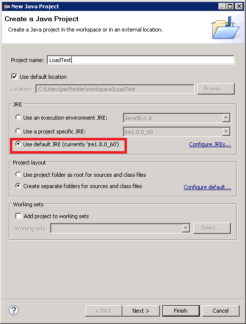
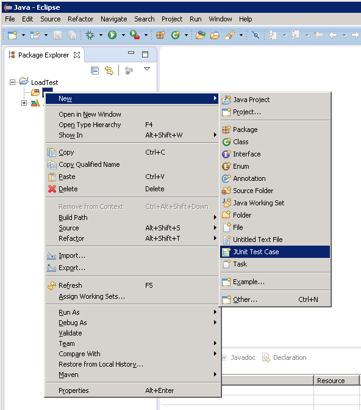
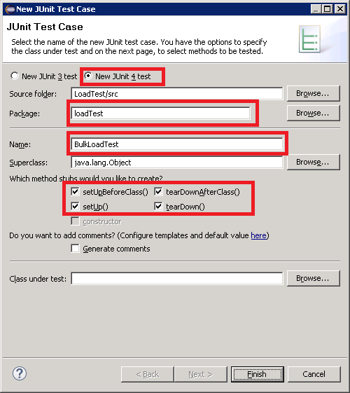
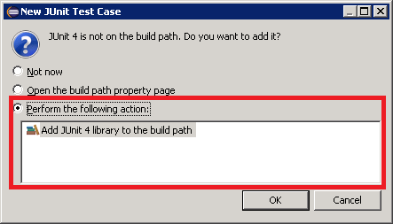
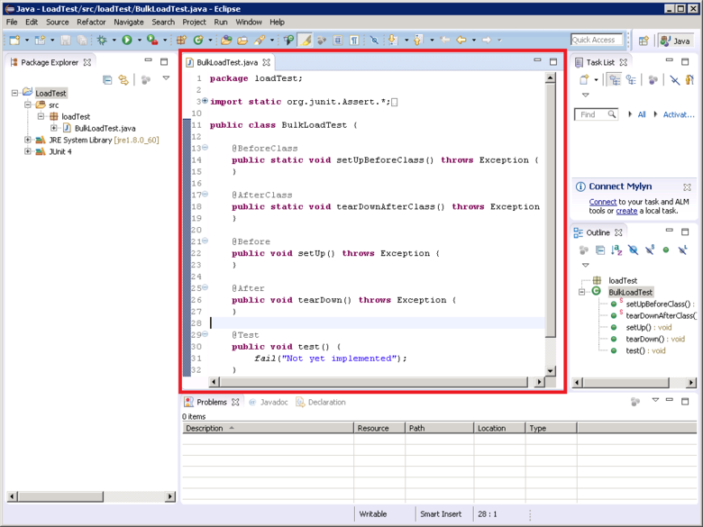
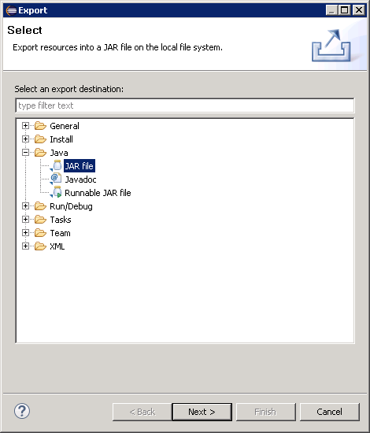
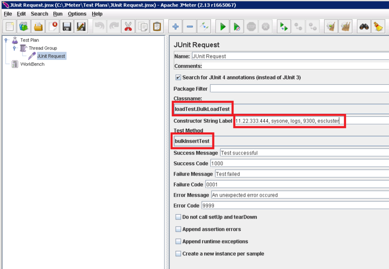

<properties
   pageTitle="Déploiement d’un échantillon de JMeter JUnit pour tester les performances de Elasticsearch | Microsoft Azure"
   description="Découvrez comment utiliser un échantillon de JUnit pour générer et télécharger des données sur un cluster Elasticsearch."
   services=""
   documentationCenter="na"
   authors="dragon119"
   manager="bennage"
   editor=""
   tags=""/>

<tags
   ms.service="guidance"
   ms.devlang="na"
   ms.topic="article"
   ms.tgt_pltfrm="na"
   ms.workload="na"
   ms.date="09/22/2016"
   ms.author="masashin"/>
   
# Déploiement d’un échantillon de JMeter JUnit pour tester les performances de Elasticsearch

[AZURE.INCLUDE [pnp-header](../../includes/guidance-pnp-header-include.md)]

Cet article fait [partie d’une série](guidance-elasticsearch.md). 

Ce document décrit comment créer et utiliser un échantillon de JUnit qui peut générer et télécharger des données à un cluster Elasticsearch dans le cadre d’un plan de test JMeter. Cette approche fournit une approche hautement flexible pour charger le test qui peut générer de grandes quantités de données de test sans en fonction des fichiers de données externes.

> [AZURE.NOTE] Les tests de charge utilisées pour évaluer les performances de réception de données décrite [réglage](guidance-elasticsearch-tuning-data-ingestion-performance.md) des performances de réception de données pour Elasticsearch créés à l’aide de cette approche. Les détails du code JUnit sont décrites dans ce document.

Pour des performances de réception de données test, le code JUnit a été développer à l’aide d’Éclipse (Mars) et dépendances ont été résolus à l’aide de Maven. Les procédures suivantes décrivent le processus étape par étape de l’installation Eclipse, configuration Maven, création d’un test JUnit et déploiement ce test en tant qu’un échantillon de demande de JUnit dans un test JMeter.

> [AZURE.NOTE] Pour plus d’informations sur la structure et la configuration de l’environnement de test, voir [Création d’un environnement de test de performance pour Elasticsearch sur Azure][].

## Conditions préalables à l’installation

Vous aurez besoin de l' [Environnement d’exécution Java](http://www.java.com/en/download/ie_manual.jsp) sur votre ordinateur de développement.
Vous devrez également installer l' [IDE Eclipse pour les développeurs Java](https://www.eclipse.org/downloads/index.php?show_instructions=TRUE).

> [AZURE.NOTE] Si vous utilisez la machine virtuelle maître JMeter décrite dans la [Création d’un environnement de test de performance pour Elasticsearch sur Azure][] en tant que votre environnement de développement, télécharger la version Windows 32 bits du programme d’installation Eclipse.

## Créer un projet de test JUnit pour charger le test Elasticsearch

Démarrez l’IDE Eclipse s’il n’est pas déjà ouvert, puis fermez la page **d’accueil** .  Dans le menu **fichier** , cliquez sur, puis cliquez sur **Projet Java**.

Dans la fenêtre **Nouveau projet Java** , entrez un nom de projet et sélectionnez **JRE par défaut**, puis cliquez sur **Terminer**.

Dans la fenêtre **Explorateur de Package** , développez le nœud nommé d’après votre projet. Vérifiez qu’il contient un dossier nommé **src** et une référence à l’environnement que vous avez spécifié.

Cliquez sur le dossier **src** , cliquez sur **Nouveau**, puis cliquez sur **cas de Test JUnit**.

Dans la fenêtre **Nouveau cas de Test JUnit** , sélectionnez **Nouveau Junit 4 test**, entrez un nom pour le package (Cela peut être identique au nom du projet, bien que par convention son nom doit commencer par une lettre minuscules), un nom pour la classe de test, puis sélectionnez les options de génèrent le stub de méthode requises pour votre test. Laissez vide la zone **cours sous test** , puis cliquez sur **Terminer**.

Si la boîte de dialogue **Nouveau cas de Test JUnit** s’affiche, sélectionnez l’option pour ajouter la bibliothèque 4 JUnit le chemin d’accès de créer, puis cliquez sur **OK**. 

Vérifiez que le code de structure pour le test JUnit est généré et affiché dans la fenêtre de l’éditeur Java.

Dans l' **Explorateur de Package**, droit sur le nœud de votre projet, cliquez sur **configurer**, puis cliquez sur **convertir en projet Maven**.

> [AZURE.NOTE]Un projet à l’aide de Maven vous permet de plus facilement gérer les dépendances externes (par exemple, les bibliothèques de client Elasticsearch Java) dépend.

Dans la boîte de dialogue **Créer nouveau POM** , dans la liste déroulante **emballage** , sélectionnez **jar**, puis cliquez sur **Terminer**.

Le volet qui apparaît en dessous de l’éditeur de modèle (POM) objet project peut afficher l’avertissement « chemin d’accès de Build Spécifie l’environnement d’exécution J2SE 1.5. Il n’existe aucun JRE installés dans l’espace de travail strictement compatibles avec cet environnement », en fonction de la version de Java est installé sur votre ordinateur de développement. Si vous avez une version de Java est postérieure à la version 1,5 vous pouvez ignorer ce message d’avertissement.

Dans l’éditeur POM, développez **Propriétés** , puis sur **créer**.

Dans la boîte de dialogue **Ajouter une propriété** dans la zone **nom** , tapez *es.version*, dans la zone **valeur** , tapez *1.7.2*, puis sur **OK**. Il s’agit de la version de la bibliothèque de client Elasticsearch Java à utiliser (cette version peut-être être remplacée par la suite, et définir la version comme une propriété POM et faisant référence à cette propriété ailleurs dans le projet permettent de la version à modifier rapidement).

Cliquez sur l’onglet **dépendances** à la base de l’éditeur POM, puis cliquez sur **Ajouter** en regard de la liste des **dépendances** .

Dans la boîte de dialogue **Sélectionner la dépendance** dans la zone **Id du groupe** , tapez *org.elasticsearch*, dans la zone **Objet Id** *elasticsearch*, dans la zone **Version** * \${es.version}*, puis cliquez sur **OK**. Informations sur la bibliothèque de client Java Elasticsearch sont contenues dans le référentiel Central Maven en ligne, et cette configuration télécharge automatiquement la bibliothèque et ses dépendances lorsque le projet est généré.

Dans le menu **fichier** , cliquez sur **Enregistrer tout**. Cette action Enregistrer et générer le projet, le téléchargement les dépendances spécifiés par Maven. Vérifiez que le dossier dépendances Maven apparaît dans l’Explorateur de Package. Développer le dossier pour afficher les fichiers jar téléchargés pour prendre en charge de la bibliothèque de client Elasticsearch Java.

## L’importation d’un projet de test JUnit existant dans Éclipse

Cette procédure suppose que vous avez téléchargé un projet Maven précédemment créé à l’aide de Eclipse.

Démarrer la Eclipse IDE. Dans le menu **fichier** , cliquez sur **Importer**.

Dans la fenêtre **Sélectionnez** , développez le dossier **Maven** et cliquez sur **Projets Maven existants**, puis cliquez sur **suivant**.

Dans la fenêtre **Projets Maven** , spécifiez le dossier contenant le projet (le dossier contenant le fichier pom.xml), cliquez sur **Sélectionner tout**, puis cliquez sur **Terminer**.

Dans la fenêtre **Explorateur de Package** , développez le nœud correspondant à votre projet. Vérifiez que le projet contient un dossier nommé **src**. Ce dossier contient le code source pour le test JUnit. Le projet peut être compilé et déployé en suivant les instructions ci-dessous.

## Déployer un test JUnit JMeter

Cette procédure suppose que vous avez créé un projet nommé LoadTest contenant une classe JUnit Test nommée `BulkLoadTest.java` qui accepte les paramètres de configuration passées comme une seule chaîne à un constructeur (c’est le mécanisme qui attend JMeter).

Dans l’IDE Eclipse, dans l' **Explorateur de Package**, cliquez sur le nœud de projet, puis cliquez sur **Exporter**.

Dans l' **Assistant Exportation**, dans la page **Sélectionnez** , développez le nœud **Java** et cliquez sur **un fichier JAR**, puis cliquez sur **suivant**.

Dans la page **Spécification de fichier JAR** , dans la zone **Sélectionner les ressources à exporter** , développez le projet désélectionnez **.project**et désactivez l’option **pom.xml**. Dans la zone **un fichier JAR** , fournir un nom de fichier et un emplacement pour le fichier JAR (il convient de l’extension de fichier .jar), puis cliquez sur **Terminer**.

À l’aide de l’Explorateur Windows, copiez le fichier JAR que vous venez de créer à la machine virtuelle Java maître JMeter et enregistrez celui-ci au apache-jmeter-2.13\\bibliothèque\\dossier junit sous le dossier où vous avez installé JMeter (voir la procédure « Création de la machine virtuelle maître JMeter » lors de la [Création d’un environnement de test de performance pour Elasticsearch sur Azure](guidance-elasticsearch-creating-performance-testing-environment.md) pour plus d’informations).

Revenir à Eclipse, développer la fenêtre **Explorateur de Package** et prenez note de tous les fichiers JAR et leur emplacement répertoriée dans le dossier Maven dépendances pour le projet. Notez que les fichiers affichés dans l’image ci-dessous peuvent varier, selon la version de Elasticsearch que vous utilisez :

À l’aide de l’Explorateur Windows, copiez chaque fichierJAR référencée dans le dossier dépendances Maven pour apache-jmeter-2.13\\bibliothèque\\dossier junit sur l’ordinateur JMeter maître virtuel.

Si la bibliothèque\\junit dossier contient des versions antérieures de ces fichiers JAR déjà puis supprimez-les. Si vous les laissez en place le test JUnit peut ne pas fonctionne comme références peuvent être résolus vers les fichiers JAR incorrects.

Sur le masque JMeter machine virtuelle, arrêtez JMeter s’est en cours d’exécution.  Démarrez JMeter.  Dans JMeter, avec le bouton droit de **Plan de Test**, cliquez sur **Ajouter**, cliquez sur **Threads (utilisateurs)**, puis cliquez sur **Groupe Thread**.

Sous le nœud de **Plan de Test** , **Groupe de threads**d’avec le bouton droit, cliquez sur **Ajouter**, sur **un échantillon de**, puis cliquez sur **Demande JUnit**.

Dans la page **Demande JUnit** , sélectionnez **Rechercher des annotations JUnit4 (au lieu de 3 JUnit)**. Dans la liste déroulante **NomClasse** , sélectionnez votre classe de test de charge JUnit (elle apparaît sous la forme * &lt;package&gt;.&lt; classe&gt;*), dans la **Méthode Test** de liste déroulante, sélectionnez la JUnit méthode d’essai (il s’agit de la méthode qui effectue le travail associé au test et doit avoir été marqué avec la *@test* annotation dans le projet Eclipse) et entrez les valeurs à passer au constructeur dans la zone **Étiquette de chaîne de constructeur** . Les détails affichés dans l’image ci-dessous quelques exemples seulement ; votre **NomClasse**, * *Méthode de Test*, et * *Étiquette de chaîne de constructeur** sera probablement différent de ceux indiqués.

Si votre cours n’apparaît pas dans la liste déroulante **NomClasse** , cela signifie probablement que le fichier JAR n’a pas été correctement exporté ou n’a pas été placé dans la bibliothèque\\junit dossier ou parmi les fichiers JAR dépendantes sont manquantes à partir de la bibliothèque\\junit dossier. Dans ce cas, exporter à nouveau le projet à partir de Eclipse et vérifiez que vous avez sélectionné la ressource **src** , copiez le fichier JAR dans la bibliothèque\\junit dossier, puis vérifiez que vous avez copié tous les fichiers JAR dépendantes répertoriés par Maven vers le dossier de bibliothèque.

Fermez JMeter. Il est inutile d’enregistrer le plan de test.  Copiez le fichier JAR contenant la classe de test JUnit à la /home/&lt;nom d’utilisateur&gt;dossier /apache-jmeter-2.13/lib/junit sur chacun des ordinateurs virtuels subordonnées JMeter (*&lt;nom d’utilisateur&gt; * est le nom de l’utilisateur d’administration que vous avez spécifié lors de la création de la machine virtuelle, consultez la procédure « Créez les machines virtuelles subordonnées JMeter » lors de la [Création d’un environnement de test de performance pour Elasticsearch sur Azure](guidance-elasticsearch-creating-performance-testing-environment.md) pour plus d’informations.)

Copiez les fichiers JAR dépendantes requis par la classe de test JUnit pour la /home/&lt;nom d’utilisateur&gt;dossier /apache-jmeter-2.13/lib/junit sur chacun des ordinateurs virtuels subordonnées JMeter. Veillez à supprimer tout d’abord les anciennes versions de fichiers JAR de ce dossier.

Vous pouvez utiliser la `pscp` utilitaire afin de copier des fichiers à partir d’un ordinateur Windows vers Linux.

[Création d’un environnement de test pour Elasticsearch sur Azure de performances]: guidance-elasticsearch-creating-performance-testing-environment.md
