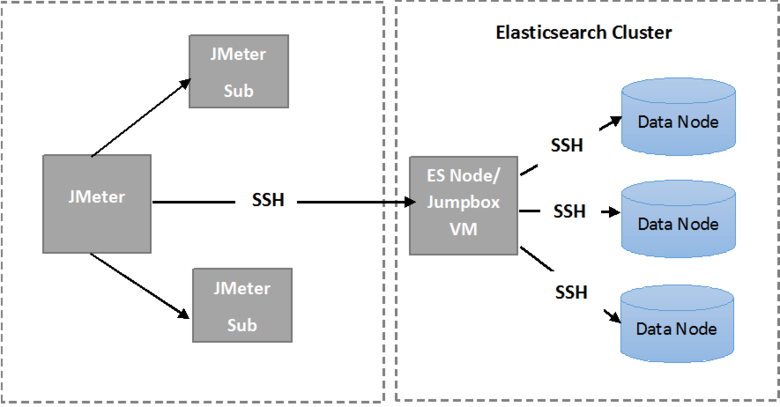

<properties
   pageTitle="Exécution des tests résilience Elasticsearch automatisés | Microsoft Azure"
   description="Description de la façon dont vous pouvez exécuter les tests de résilience dans votre environnement."
   services=""
   documentationCenter="na"
   authors="dragon119"
   manager="bennage"
   editor=""
   tags=""/>

<tags
   ms.service="guidance"
   ms.devlang="na"
   ms.topic="article"
   ms.tgt_pltfrm="na"
   ms.workload="na"
   ms.date="09/22/2016"
   ms.author="masashin"/>

# <a name="running-the-automated-elasticsearch-resiliency-tests"></a>Exécution des tests résilience Elasticsearch automatisés

[AZURE.INCLUDE [pnp-header](../../includes/guidance-pnp-header-include.md)]

Cet article fait [partie d’une série](guidance-elasticsearch.md).

Dans la [résilience de configuration et de récupération sur Elasticsearch sur Azure][elasticsearch-resilience-recovery], nous avons décrit une série de tests qui ont été effectuées par rapport à un cluster de Elasticsearch exemple pour déterminer quelle mesure le système répondu à certaines formes courantes d’échec d’et degré de récupérés. Les tests ont été un script pour leur permettre de s’exécuter dans une façon automatisée. Ce document décrit comment vous pouvez répéter les tests dans votre environnement. 

Les scénarios suivants ont été testés :

- **Échec du nœud et redémarrer avec aucune perte de données**. Un nœud de données est arrêté et redémarré après 5 minutes.
Elasticsearch a été configuré pour ne pas pour réaffecter milieu des fragments manquants dans cet intervalle, afin qu’aucune e/s supplémentaires n’est prévu en déplacement milieu des fragments. Lorsque le nœud redémarre, le processus de récupération affiche au milieu des fragments sur ce nœud à jour.

- **Échec du nœud sans perte de données grave**. Un nœud de données est arrêté et les données qu’il contient sont permanente pour simuler défaillance grave du disque. Le nœud a puis redémarré (après 5 minutes), efficacement agissant en tant que texte de remplacement souhaité pour le nœud d’origine. Le processus de récupération nécessite une reconstruction les données manquantes pour ce nœud et peut impliquer déplacement milieu des fragments conservées sur d’autres nœuds.

- **Échec du nœud et redémarrer avec aucune perte de données, mais avec réaffectation partagé**. Un nœud de données est arrêté et au milieu des fragments qu’il contient sont réaffectées à d’autres nœuds. Le nœud est puis redémarré et réaffectation plus se produit pour rééquilibrer le cluster.

- **Mises à jour des yeux**. Chaque nœud du cluster est arrêté puis redémarré après un court intervalle pour simuler machines redémarrés après une mise à jour logicielle. Un seul nœud est arrêté à un moment donné.
Milieu des fragments ne sont pas réaffectées pendant un nœud vers le bas.

## <a name="prerequisites"></a>Conditions préalables

Les tests automatisés requièrent les éléments suivants :

- Un cluster Elasticsearch.

- Une configuration environnement JMeter comme indiqué par les [conseils pour tester les performances]. 

- Les ajouts suivants installés sur la JMeter maître machine virtuelle uniquement.

    - Environnement d’exécution Java 7.

    - Versions4.x.x Nodejs ou version ultérieure.

    - Les outils de ligne de commande Git.

## <a name="how-the-scripts-work"></a>Comment fonctionnent les scripts

Les scripts de test sont conçues pour fonctionner sur le masque des JMeter VM. Lorsque vous sélectionnez un test à exécuter, les scripts effectuer l’ordre des opérations suivante :

1.  Démarrer un plan de test JMeter en passant les paramètres que vous avez spécifié.

2.  Copier un script qui effectue les opérations requises par le test pour une machine virtuelle spécifiée dans le cluster. Cela peut être n’importe quel ordinateur virtuel qui comporte une adresse IP publique, ou la machine virtuelle *Jumpbox* si vous avez créé le cluster en utilisant le [modèle de démarrage rapide Elasticsearch Azure](https://github.com/Azure/azure-quickstart-templates/tree/master/elasticsearch).

3.  Exécuter le script sur la machine virtuelle (ou Jumpbox).

L’image suivante montre la structure de l’environnement de test et cluster Elasticsearch. Notez que les scripts de test utilisent SSH (secure shell) pour vous connecter à chaque nœud du cluster pour effectuer diverses opérations Elasticsearch telles que l’arrêt ou le redémarrage d’un nœud.



## <a name="setting-up-the-jmeter-tests"></a>Teste la configuration de la JMeter

Avant la résilience en cours d’exécution des tests vous devez compiler et déployer les tests JUnit situés dans le dossier résilience/jmeter/tests. Ces tests sont référencées par le plan de test JMeter. Pour plus d’informations, consultez la procédure « Importation d’un projet de test JUnit existant dans Eclipse » du [déploiement d’un échantillon de JMeter JUnit pour tester les performances de Elasticsearch][].

Il existe deux versions des tests JUnit contenus dans les dossiers suivants :

- **Elasticsearch17.** Le projet dans ce dossier génère le fichier Elasticsearch17.jar. Utilisez cette JAR pour tester les versions Elasticsearch 1.7.x

- **Elasticsearch20**. Le projet dans ce dossier génère le fichier Elasticsearch20.jar. Utiliser cette JAR Elasticsearch version 2.0.0 de test et versions ultérieures

Copiez le fichier JAR approprié ainsi que le reste des dépendances sur vos ordinateurs JMeter. Le processus est décrite par la procédure « Déploiement d’un test JUnit à JMeter » dans le [déploiement d’un échantillon de JMeter JUnit pour tester les performances Elasticsearch].

## <a name="configuring-vm-security-for-each-node"></a>Configuration de la sécurité de machine virtuelle pour chaque nœud

Les scripts de test requièrent un certificat d’authentification soit installé sur chaque nœud Elasticsearch dans le cluster. Ainsi, les scripts de s’exécuter automatiquement sans demander un nom d’utilisateur ou mot de passe lorsqu’ils se connectent aux ordinateurs virtuels différents.

Démarrez en vous connectant à une des nœuds dans le cluster Elasticsearch (ou la Jumpbox VM), puis exécutez la commande suivante pour générer une clé d’authentification :

```Shell
ssh-keygen -t rsa
```

Lorsque vous êtes connecté au nœud Elasticsearch (ou Jumpbox), exécutez les commandes suivantes pour tous les nœuds dans il Elasticsearch cluster. Remplacer `<username>` avec le nom d’un utilisateur valide sur chaque machine virtuelle et remplacer `<nodename>` avec le nom DNS ou l’adresse IP de la machine virtuelle qui héberge le nœud Elasticsearch.
Notez que vous êtes invité le mot de passe de l’utilisateur lors de l’exécution de ces commandes.
Pour plus d’informations, voir [ouverture de session SSH sans mot de passe](http://www.linuxproblem.org/art_9.html):

```Shell
ssh <username>@<nodename> mkdir -p .ssh (
cat .ssh/id\_rsa.pub | ssh <username>*@<nodename> 'cat &gt;&gt; .ssh/authorized\_keys'
```

## <a name="downloading-and-configuring-the-test-scripts"></a>Le téléchargement et la configuration les scripts de test

Les scripts de test sont fournies dans un référentiel Git. Utilisez la procédure suivante pour télécharger et configurer les scripts.

Sur l’ordinateur maître JMeter l’endroit où vous allez exécuter les tests, ouvrez une fenêtre de bureau Git (Git Bash) et cloner le référentiel qui contient les scripts, comme suit :

```Shell
git clone https://github.com/mspnp/azure-guidance.git
```

Déplacer vers le dossier résilience tests et exécutez la commande suivante pour installer les dépendances requises pour exécuter les tests :

```Shell
npm install
```

Si le masque des JMeter sont exécute sur Windows, téléchargez [Plink](http://www.chiark.greenend.org.uk/~sgtatham/putty/download.html), qui est une interface de ligne de commande au client Telnet PuTTY. Copiez l’exécutable Plink dans le dossier résilience-tests/bibliothèque.

Si le masque des JMeter sont exécute sur Linux, vous n’avez pas besoin de télécharger Plink, mais vous devrez configurer SSH sans mot de passe entre le masque des JMeter et le nœud de Elasticsearch ou Jumpbox vous avez utilisé en suivant les étapes décrites dans la procédure « configuration machine virtuelle sécurité pour chaque nœud. » 

Modifier les paramètres de configuration suivants dans le `config.js` fichier pour correspondre à votre environnement de test et cluster Elasticsearch. Ces paramètres sont communes à tous les tests :

| Nom | Description | Valeur par défaut |
| ---- | ----------- | ------------- |
| `jmeterPath` | Chemin d’accès local dans lequel se trouve JMeter. | `C:/apache-jmeter-2.13` |
| `resultsPath` | Répertoire relatif où le script exporte le résultat. | `results` |
| `verbose` | Indique si le script sorties en mode détaillé ou non. | `true` |
| `remote` | Indique si les tests JMeter exécuté localement ou sur les serveurs distants. | `true` |
| `cluster.clusterName` | Le nom du cluster Elasticsearch. | `elasticsearch` |
| `cluster.jumpboxIp`         | L’adresse IP de l’ordinateur Jumpbox.                 |-|
| `cluster.username`          | L’utilisateur d’administration que vous avez créé lors du déploiement du cluster. |-|
| `cluster.password`          | Le mot de passe pour l’utilisateur d’administration.                        |-|
| `cluster.loadBalancer.ip`   | L’adresse IP de l’équilibrage de charge Elasticsearch.    |-|
| `cluster.loadBalancer.url`  | URL de base de l’équilibrage de charge.                          |-|

## <a name="running-the-tests"></a>L’exécution des tests

Déplacer vers le dossier résilience tests et exécutez la commande suivante :

```Shell
node app.js
```

Le menu suivant doit apparaître :


Entrez le nombre du scénario que vous souhaitez exécuter : `11`, `12`, `13` ou `21`. 

Une fois que vous sélectionnez un scénario, le test s’exécutera automatiquement. Les résultats sont stockés dans un jeu de fichiers de valeurs séparées par des virgules (CSV) dans un dossier créé sous le répertoire de résultats. Chaque exécution possède son propre dossier de résultats.
Vous pouvez utiliser Excel pour analyser et représenter ces données.

[Running Elasticsearch on Azure]: guidance-elasticsearch-running-on-azure.md
[Tuning Data Ingestion Performance for Elasticsearch on Azure]: guidance-elasticsearch-tuning-data-ingestion-performance.md
[conseils pour tester les performances]: guidance-elasticsearch-creating-performance-testing-environment.md
[JMeter guidance]: guidance-elasticsearch-implementing-jmeter.md
[Considerations for JMeter]: guidance-elasticsearch-deploying-jmeter-junit-sampler.md
[Query aggregation and performance]: guidance-elasticsearch-query-aggregation-performance.md
[elasticsearch-resilience-recovery]: guidance-elasticsearch-configuring-resilience-and-recovery.md
[Resilience and Recovery Testing]: guidance-elasticsearch-running-automated-resilience-tests.md
[Déploiement d’un échantillon de JMeter JUnit pour tester les performances de Elasticsearch]: guidance-elasticsearch-deploying-jmeter-junit-sampler.md
