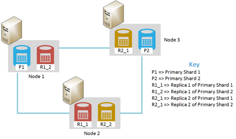
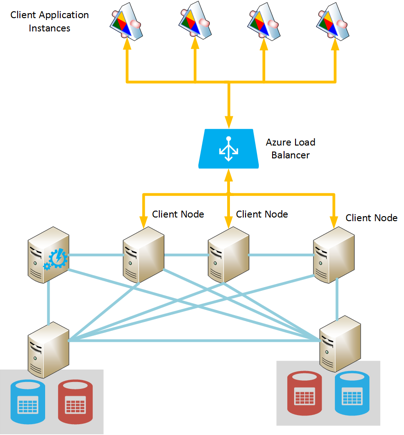
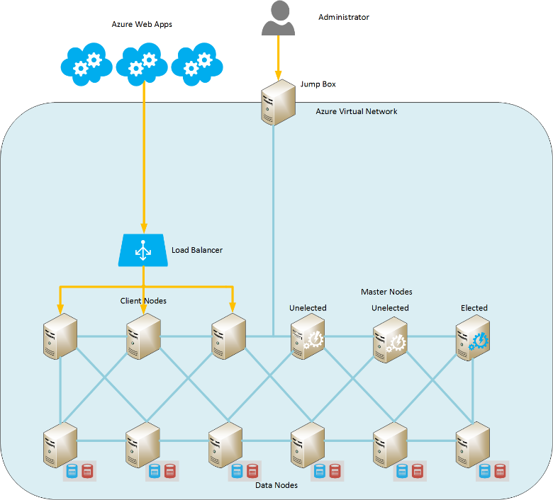

<properties
   pageTitle="En cours d’exécution Elasticsearch sur Azure | Microsoft Azure"
   description="Découvrez comment installer, configurer et exécuter Elasticsearch sur Azure."
   services=""
   documentationCenter="na"
   authors="dragon119"
   manager="bennage"
   editor=""
   tags=""/>

<tags
   ms.service="guidance"
   ms.devlang="na"
   ms.topic="article"
   ms.tgt_pltfrm="na"
   ms.workload="na"
   ms.date="09/22/2016"
   ms.author="masashin"/>

# <a name="running-elasticsearch-on-azure"></a>Elasticsearch en cours d’exécution sur Azure

[AZURE.INCLUDE [pnp-header](../../includes/guidance-pnp-header-include.md)]

Cet article fait [partie d’une série](guidance-elasticsearch.md). 

## <a name="overview"></a>Vue d’ensemble

Ce document fournit une brève introduction à la structure générale des Elasticsearch et puis explique comment vous pouvez implémenter un cluster de Elasticsearch à l’aide d’Azure. Elle touche sur les meilleures pratiques pour le déploiement d’un cluster Elasticsearch, concentrer sur les différents performances fonctionnelles et en matière de gestion de votre système et en fonction de la façon dont vos besoins doivent être élaborée en la configuration et la topologie que vous sélectionnez.

> [AZURE.NOTE] Ce guide connaissance base de [Elasticsearch][].

## <a name="the-structure-of-elasticsearch"></a>La structure de Elasticsearch 

Elasticsearch est une base de données de document optimisé pour agir comme un moteur de recherche. Documents sont sérialisés au format JSON. Données sont conservées dans les index, implémentées à l’aide de [Apache Lucene][], bien que les détails sont extraits de l’affichage et qu’il n’est pas nécessaire de comprendre entièrement Lucene pour pouvoir utiliser Elasticsearch.

### <a name="clusters-nodes-indexes-and-shards"></a>Clusters, les nœuds, index et milieu des fragments

Elasticsearch met en œuvre une architecture groupée qui utilise ont distribuer les données dans plusieurs nœuds et augmenter la disponibilité de la réplication. Documents stockés dans l’index. L’utilisateur peut spécifier les champs dans un document sont utilisés pour identifier de façon unique au sein d’un index, ou le système peut générer automatiquement un champ de clé et les valeurs. L’index est utilisé pour physiquement organiser vos documents et est que le principal signifie pour trouver des documents. 

Un index contient un ensemble de milieu des fragments. Documents uniformément par rapport au sein du milieu des fragments à l’aide d’un mécanisme hachage basé sur les valeurs clés d’index et le nombre de milieu des fragments dans l’index. 

À partir d’index peut être répliquées. Dans ce cas, chaque partagé dans l’index est copiée. Elasticsearch garantit que chaque éclater d’origine pour un index (appelé un « éclater principal ») et son réplica résident toujours sur des nœuds différents. Lorsqu’un document est ajouté ou modifié, toutes les d’écriture pour les opérations sur l’éclater principal, puis dans chaque réplica. 

L’illustration suivante montre les aspects essentiels d’un cluster Elasticsearch qui contient trois nœuds. Un index composé de deux milieu des fragments principales avec deux réplica pour chaque partagé (milieu des six fragments dans l’ensemble) a été créé.



*Un cluster Elasticsearch simple contenant deux nœuds principaux et deux ensembles de réplicas*

Dans ce cluster, éclater primaire 1 et Éclater principal 2 se trouvent sur des nœuds distincts pour aider à équilibrer la charge. Les réplicas sont réparties de la même manière. Si un seul nœud échoue, les nœuds restants ont des informations suffisantes pour activer le système continue de fonctionner. Si nécessaire, Elasticsearch élève un éclater réplica pour devenir un éclater primaire si l’éclater primaire correspondante n’est pas disponible.

### <a name="node-roles"></a>Rôles des nœuds

Les nœuds dans un cluster Elasticsearch peuvent effectuer les rôles suivants :

- **Nœud de données** qui peut contenir un ou plusieurs milieu des fragments qui contiennent des données d’index.

- Un **nœud de client** qui ne contient pas de données de l’index, mais qui gère les demandes entrantes effectuées par les applications clientes vers le nœud de données appropriées.
 
- **Nœud maître** qui ne contient pas de données de l’index, mais qui effectue les opérations de gestion de cluster, telles que la conservation et de distribution des informations de routage autour du cluster (la liste dont les nœuds contiennent les milieu des fragments), déterminer les nœuds qui sont disponibles, déplacement milieu des fragments comme nœuds apparaissent et disparaissent et de coordonner la récupération après défaillance de nœud. Plusieurs nœuds peuvent être configurés comme formes de base, mais qu’un seul sera réellement être choisi pour exécuter les fonctions de base. Si ce nœud échoue, un autre élections a lieu et un des autres nœuds maîtres éligibles sera choisi et prendre le contrôle.

> [AZURE.NOTE]Le nœud maître choisi repose le bien-être du cluster. Les autres nœuds ping régulièrement pour vous assurer qu’il est toujours disponible. Si le nœud maître choisi sert également un nœud de données, il est une chance que le nœud peut devenir occupé et fail pour répondre à ces commandes ping. Dans ce cas, la forme de base est considérée comme un échec et un des autres nœuds maîtres est sélectionné dans son emplacement. 

 L’illustration ci-dessous présente une topologie contenant un mélange de masque dédié, le client et des nœuds de données dans un cluster Elasticsearch.


*Un cluster Elasticsearch avec les types de nœuds*

### <a name="costs-and-benefits-of-using-client-nodes"></a>Les coûts et les avantages de l’utilisation des nœuds de client

Lorsqu’une application envoie une requête à un cluster Elasticsearch, le nœud auquel se connecte l’application est chargé de diriger le processus de requête. Le nœud transfère la demande à chaque nœud de données et regroupe les résultats, renvoyant les informations cumulées à l’application. Si une requête implique agrégations et les autres calculs, le nœud auquel se connecte l’application effectue les opérations nécessaires après l’extraction des données de chacun des autres nœuds. Ce processus en nuages de points/recueillez peut consommer des ressources de traitement et la mémoire considérables.

À l’aide des nœuds de client dédié pour effectuer ces tâches permet aux nœuds de données pour vous concentrer sur la gestion et le stockage de données. Le résultat est que nombreux scénarios qui impliquent agrégations et requêtes complexes peuvent bénéficier de l’utilisation de nœuds client dédié. Toutefois, l’impact du client dédié nœuds probablement varient selon votre scénario, la charge de travail et la taille de cluster. 

> [AZURE.NOTE] Pour plus d’informations sur le processus de réglage, voir [réglage agrégation des données et les performances des requêtes pour Elasticsearch sur Azure][] .

### <a name="connecting-to-a-cluster"></a>Connexion à un cluster

Elasticsearch expose une série d’API REST pour créer des applications clientes et envoyer des demandes à un cluster. Si vous développez des applications à l’aide du .NET Framework, deux niveaux supérieurs API sont disponibles : [Elasticsearch.Net & imbriquer][].

Si vous créez des applications clientes à l’aide de Java, vous pouvez utiliser l' [API Client nœud][] créer dynamiquement des nœuds de client et les ajouter au cluster. Créer des nœuds client dynamiquement est pratique si votre système utilise un petit nombre de connexions à long terme. Les nœuds client créés à l’aide de l’API nœud sont fournies avec le cluster routage mapper (les détails dont les nœuds contiennent les milieu des fragments) par le nœud maître. Ces informations permettent à l’application Java pour se connecter directement à des nœuds lors de l’indexation et interrogation de données, réduire le nombre de sauts peut s’avérer nécessaire lors de l’utilisation d’autres API.

Le coût de cette approche est la charge d’inscription le nœud client dans le cluster. Si un grand nombre de nœuds clients apparaisse et disparaisse rapidement, l’impact de la conservation et de distribution de la carte de routage cluster peut devenir importante.

L’illustration suivante montre une configuration qui utilise un équilibrage de charge pour acheminer les requêtes à un ensemble de nœuds de clients, même si la stratégie même peut être utilisée pour se connecter directement à des nœuds de données si les nœuds clients ne sont pas utilisés.



*Instances de l’application client se connecter à un cluster Elasticsearch via l’équilibrage de charge Azure*

> [AZURE.NOTE]Vous pouvez utiliser l' [Équilibrage de charge Azure][] pour exposer le cluster à l’Internet public, ou vous pouvez utiliser un [programme d’équilibrage de charge interne][] si les applications clientes et le cluster sont contenues entièrement à l’intérieur du réseau privé virtuel (VNet) de même.

### <a name="node-discovery"></a>Découverte de nœud

Elasticsearch est basée sur les communications égal à égal, afin d’identifier d’autres nœuds dans un cluster est essentiel du cycle de vie d’un nœud. Découverte de nœud permet de nouveaux nœuds de données soit dynamiquement ajoutée à un cluster, qui à son tour permet le cluster à évoluer en toute transparence. En outre, si un nœud de données ne parvient pas à répondre aux demandes de communications à partir d’autres nœuds, un nœud maître peut décider que le nœud de données a échoué et les mesures nécessaires pour réaffecter au milieu des fragments qu’il a été contient à d’autres nœuds de données opérationnelles.

Découverte de nœud Elasticsearch est gérée en utilisant un module de découverte. Le module de découverte est un plug-in qui peut être changé pour utiliser un mécanisme de découverte différents. Le module de découverte par défaut ([simplicité][]) entraîne un nœud émettre des requêtes ping pour trouver d’autres nœuds sur le même réseau. Si d’autres nœuds répondent, ils ragots pour échanger des informations. Un nœud maître peut distribuer milieu des fragments vers le nouveau nœud (si elle est un nœud de données) et rééquilibrer le cluster. Le module de découverte simplicité gère également le processus élections maître et le protocole de détection de panne de nœud.

En outre, si vous exécutez Elasticsearch nœuds comme des machines virtuelles Azure (machines virtuelles), messagerie multidiffusion n'est pas pris en charge. Pour des raisons de cette, vous devez configurer la découverte simplicité pour utiliser la messagerie monodiffusion et fournir une liste des nœuds de contact valides dans le fichier de configuration elasticsearch.yml.

Si vous hébergez un cluster Elasticsearch au sein d’un réseau virtuel Azure, vous pouvez spécifier privé IP affectée DHCP adressé donné à chaque machine virtuelle du cluster doit rester alloué (statique). Vous pouvez configurer la simplicité découverte monodiffusion messagerie à l’aide de ces adresses IP statiques. Si vous utilisez des machines virtuelles avec des adresses IP dynamiques, n’oubliez pas que si une machine virtuelle s’arrête et redémarre il pourrait être affecté une nouvelle adresse IP et découverte de difficulté. Pour gérer ce scénario, vous pouvez échanger le module de découverte simplicité pour le [Plug-in de Cloud Azure][]. Ce plug-in utilise l’API Azure pour implémenter le mécanisme de découverte, qui est basé sur des informations sur l’abonnement Azure.

> [AZURE.NOTE]La version actuelle du plug-in du Cloud Azure, vous devez installer le certificat de gestion de votre abonnement Azure dans la combinaison de touches Java sur le nœud Elasticsearch et indiquez l’emplacement et les informations d’identification pour accéder à la combinaison de touches dans le fichier elasticsearch.yml. Ce fichier est conservé en texte clair, il est essentiel de vérifier que ce fichier est accessible uniquement par le compte exécutant le service Elasticsearch. 
> 
> Par ailleurs, cette approche peut ne pas être compatible avec les déploiements du Gestionnaire de ressources Azure. Pour ces raisons, il est recommandé que vous utilisez des adresses IP statiques pour les nœuds maîtres et utilisez ces nœuds pour implémenter simplicité découverte monodiffusion messagerie au sein du cluster. Dans la configuration suivante (prise à partir du fichier elasticsearch.yml pour un nœud de données exemple), les adresses IP hôte référencent maîtres nœuds du cluster :

```yaml
discovery.zen.ping.multicast.enabled: false  
discovery.zen.ping.unicast.hosts: ["10.0.0.10","10.0.0.11","10.0.0.12"]
```

## <a name="general-system-guidelines"></a>Instructions relatives au système général

Elasticsearch peuvent s’exécuter sur divers ordinateurs, allant vers un cluster de serveurs haut de gamme à partir d’un seul ordinateur portable. Toutefois, les ressources plus en termes de mémoire, computing power et rapide disques qui sont disponibles améliore les performances. Les sections suivantes synthétisent configuration matérielle et logicielle minimale requise pour l’exécution de Elasticsearch.

### <a name="memory-requirements"></a>Configuration requise de mémoire 

Elasticsearch tente de stocker les données en mémoire pour la vitesse. Un serveur de production hébergeant un nœud pour un standard de l’entreprise ou taille moyenne professionnelle déploiement sur Azure doit avoir entre 14 et 28 Go de RAM (D3 ou machines virtuelles D4). **Répartir la charge sur plusieurs nœuds au lieu de créer des nœuds avec plus de mémoire** (Expériences ont montré que l’utilisation de nœuds plus grande avec davantage de mémoire peut entraîner des heures de récupération étendue en cas de panne.) Toutefois, bien que la création de clusters avec un grand nombre de nœuds de petite taille augmenter la disponibilité et débit, il transmet également les efforts nécessaires pour la gestion et la maintenance de ce système.

**Allouer 50 % de la quantité de mémoire disponible sur un serveur pour le segment Elasticsearch**. Si vous utilisez Linux définir la variable d’environnement ES_HEAP_SIZE avant d’exécuter Elasticsearch. Par ailleurs, si vous utilisez Windows ou Linux, vous pouvez spécifier la taille de la mémoire dans le `Xmx` et `Xms` paramètres lorsque vous démarrez Elasticseach. Définir ces deux paramètres à la même valeur pour éviter la Machine virtuelle Java (JVM) redimensionner le segment en cours d’exécution. Toutefois, **n’affectez pas plus de 30 Go**. Utiliser le reste de la mémoire pour le cache de fichier système d’exploitation.

> [AZURE.NOTE]Elasticsearch utilise la bibliothèque Lucene pour créer et gérer des index. Les structures Lucene utilisent un format basé sur le disque et la mise en cache ces structures dans le cache du système de fichiers offriront une meilleure performance.

Notez que la taille maximale de segment optimale pour Java sur un ordinateur 64 bits est située juste au-dessus de 30 Go. Au-dessus de cette taille que Java bascule vers l’utilisation d’un mécanisme étendu pour faire référence à des objets dans le segment, qui augmente la mémoire nécessaire pour chaque objet et réduit les performances. 

Nettoyage par défaut Java (marque simultanées et balayage) peut également optimal de sous-adresse si la taille du segment est supérieure à 30 Go. Il n’est pas actuellement recommandé pour basculer vers une autre poubelle comme Elasticsearch et Lucene ont été uniquement testé sur la valeur par défaut.

Overcommit pas mémoire comme échange mémoire principale sur le disque strictement influe sur les performances. Si possible, désactivez le remplacement complètement (les détails dépendent du système d’exploitation). Si ce n’est pas possible puis activez-le *mlockall* dans le fichier de configuration Elasticsearch (elasticsearch.yml) comme suit :

```yaml
bootstrap.mlockall: true
```

Ce paramètre de configuration entraîne la machine virtuelle Java verrouiller la mémoire et l’empêche remplacés par le système d’exploitation.

### <a name="disk-and-file-system-requirements"></a>Disque et un fichier de configuration système requise

Utiliser des disques de données sauvegardées par le stockage premium pour le stockage milieu des fragments. Disques doivent être dimensionnés pour mettre en attente la quantité maximale de données prévues dans votre milieu des fragments, bien qu’il soit possible d’ajouter des disques supplémentaires ultérieurement. Vous pouvez étendre un partagé sur plusieurs disques sur un nœud.

> [AZURE.NOTE]Elasticsearch compresse les données pour les champs stockées à l’aide de l’algorithme LZ4 et dans Elasticsearch 2.0, vous pouvez modifier le type de compression. Vous pouvez basculer de l’algorithme de compression à DEFLATE comme utilisée par les utilitaires *zip* et *gzip* . Cette technique de compression peut être plus de ressources, mais que vous envisagez d’utiliser pour les données journal archivées. Cette approche peut vous aider à réduire la taille de l’index.

Il n’est pas indispensable que tous les nœuds dans un cluster ont la même disposition du disque et à la capacité. Toutefois, un nœud avec une très grande capacité par rapport aux autres nœuds dans un cluster Attirez davantage de données et nécessite une puissance de traitement accrue pour gérer ces données. Par conséquent le nœud peut devenir « actif » par rapport aux autres nœuds, et ce, à son tour, affecter les performances.

Si possible, utilisez RAID 0 (répartition). Autres formes de RAID mettant en œuvre disparités qui existent et la mise en miroir ne sont pas nécessaires comme Elasticsearch fournit sa propre solution haute disponibilité sous la forme de réplicas.

> [AZURE.NOTE]Avant Elasticsearch 2.0.0, vous pouvez également implémenter répartition au niveau du logiciel en spécifiant plusieurs annuaires dans le paramètre de configuration *path.data* . Dans Elasticsearch 2.0.0, cet écran de la répartition n’est plus pris en charge. En revanche, milieu des différents fragments peuvent être alloués à différents chemins d’accès, mais tous les fichiers dans un seul éclater seront écrites dans le même chemin d’accès. Si vous avez besoin de répartition, vous devez répartir les données au niveau du système d’exploitation ou matériel. 

Pour optimiser le stockage débit, chaque **machine virtuelle doit avoir un compte de stockage dédié premium**.

La bibliothèque Lucene peut utiliser un grand nombre de fichiers pour stocker les données d’index et Elasticsearch pouvez ouvrir un nombre important de sockets de communication entre les nœuds et avec les clients. Vérifiez que le système d’exploitation est configuré pour prendre en charge d’un nombre suffisant de descripteurs d’ouvrir le fichier (jusqu'à 64000 si la mémoire disponible). Notez que la configuration par défaut pour nombreux éditions Linux limite le nombre de descripteurs d’ouvrir le fichier à 1024, qui est bien trop petit.

Elasticsearch utilise une combinaison de mémoire mappée (mmap) e/s et e/s tel (Java nouveau gestionnaire) afin d’optimiser l’accès simultané aux fichiers de données et index. Si vous utilisez Linux, vous devez configurer le système d’exploitation pour vous assurer que suffisamment de mémoire virtuelle est disponible avec espace pour les zones de carte de mémoire 256 Ko.

> [AZURE.NOTE]Nombreuses Linux répartitions par défaut à l’aide du planificateur (CFQ) files d’attente complètement juste lors de l’organisation pour écrire des données sur le disque. Ce planificateur n’est pas optimisé pour SSDs. Vous pouvez reconfigurer le système d’exploitation pour utiliser le planificateur NOOP ou le Planificateur de date d’échéance, qui sont tous deux Optimisez SSDS.

### <a name="cpu-requirements"></a>Configuration requise du processeur

Machines virtuelles Azure sont disponibles dans une grande variété de configurations de processeur, entre 1 et 32 cœurs de prise en charge. Pour un nœud de données, un bon point de départ est une machine virtuelle série DS standard, puis sélectionnez soit la DS3 (4 cœurs) ou références SKU D4 (8 cœurs). La DS3 fournit également 14 Go de RAM, tandis que la DS4 inclut 28 Go. 

La GS-séries (pour le stockage de premium) et G (pour le stockage standard) utilisent processeurs Xeon E5 V3 qui peuvent être utiles pour les charges de travail qui sont très cluster accrue, tels que les agrégations à grande échelle. Pour les dernières informations, consultez [formats pour les machines virtuelles][].

### <a name="network-requirements"></a>Configuration requise de réseau

Elasticsearch nécessite une bande passante réseau de compris entre 1 et 10, selon la taille et la volatilité des groupes il mettent en œuvre. Elasticsearch migre milieu des fragments entre les nœuds lorsque plusieurs nœuds sont ajoutés à un cluster. Elasticsearch suppose que l’heure de communication entre tous les nœuds équivaut à peu près et ne tient pas compte les emplacements relatifs du milieu des fragments conservées sur les nœuds. En outre, réplication peut rencontrer e/s réseau importantes entre milieu des fragments. Pour ces raisons, **Évitez de créer des clusters sur les nœuds qui se trouvent dans différentes régions**.

### <a name="software-requirements"></a>Configuration logicielle requise

Vous pouvez exécuter Elasticsearch sur Windows ou Linux. Le service Elasticsearch est déployé dans une bibliothèque de jar Java et comporte des dépendances sur d’autres bibliothèques Java qui sont inclus dans le package Elasticsearch. Vous devez installer le Java 7 (mise à jour 55 ou version ultérieure) ou Java 8 (mise à jour 20 ou version ultérieure) machine virtuelle Java pour exécuter Elasticsearch.

> [AZURE.NOTE]Autres que les paramètres de mémoire *Xmx* et *Xms* (spécifié en tant que les options de ligne de commande au moteur Elasticsearch – voir [Configuration requise de mémoire][]) ne modifiez pas les paramètres de configuration de machine virtuelle Java par défaut. Elasticsearch a été conçue en utilisant les valeurs par défaut ; Modifiez les peut entraîner Elasticsearch devenir detuned et effectuer mal.

### <a name="deploying-elasticsearch-on-azure"></a>Déploiement Elasticsearch sur Azure

Bien qu’il n’est pas difficile à déployer une seule instance de Elasticsearch, la création d’un nombre de nœuds et l’installation et configuration Elasticsearch sur chacun d’eux peut être un processus beaucoup de temps et source d’erreurs. Si vous envisagez d’exécuter Elasticsearch sur machines virtuelles Azure, vous disposez de trois options qui peuvent vous aider à réduire les risques d’erreurs.

- Utiliser le Gestionnaire de ressources Azure [modèle](https://azure.microsoft.com/marketplace/partners/elastic/elasticsearchelasticsearch/) dans Azure marketplace. Ce modèle est créé par élastique. Il vous permet d’ajouter professionnelle améliorations telles que protection, Marvel, l’observateur et ainsi de suite.

- À l’aide du démarrage rapide Azure [modèle](https://github.com/Azure/azure-quickstart-templates/tree/master/elasticsearch) pour créer le cluster. Ce modèle peut créer un cluster basé sur Windows Server 2012 ou Ubuntu Linux 14.0.4. Il vous permet d’utiliser expériences fonctionnalités telles que de stockage de fichiers Azure. Ce modèle est utilisé pour la recherche et les tâches de test dans ce document.

- Utiliser des scripts pouvant être automatique ou être lue. Les scripts qui peuvent créer et déployer un cluster Elasticsearch sont disponibles sur le [référentiel GitHub][elasticsearch-scripts]

## <a name="cluster-and-node-sizing-and-scalability"></a>Cluster et redimensionnement de nœud et extensibilité élevées 

Elasticsearch permet à un certain nombre de topologies de déploiement, conçu pour prendre en charge des exigences différentes et niveaux d’échelle. Cette section présente certaines des topologies courantes et décrit les considérations d’implémentation clusters en fonction de ces topologies.

### <a name="elasticsearch-topologies"></a>Topologies Elasticsearch

L’illustration ci-dessous présente un point de départ pour la conception d’une topologie Elasticsearch pour Azure :



*Suggérées point de départ pour créer un cluster Elasticsearch avec Azure*

Cette topologie contient six nœuds de données avec trois nœuds clients et trois nœuds maîtres (seul nœud maître est choisi, l’autre deux sont disponibles pour élections cas d’échec de la forme de base choisi.) Chaque nœud est implémenté comme une machine virtuelle distincte. Applications web Azure sont dirigées vers les nœuds clients via un programme d’équilibrage de charge. 

Dans cet exemple, tous les nœuds et les applications web résident dans le même réseau virtuel qui les isole efficacement depuis l’extérieur. Si le cluster doit être disponibles à l’extérieur (éventuellement dans le cadre d’une solution hybride incorporant clients en local), vous pouvez utiliser l’équilibrage de charge Azure pour fournir une adresse IP publique, mais vous devez prendre les précautions de sécurité supplémentaires pour empêcher tout accès non autorisé pour le cluster. 

La facultatif « accéder boîte » est un ordinateur virtuel qui n’est disponible que pour les administrateurs. Cette machine virtuelle dispose d’une connexion réseau au réseau virtuel, mais également un vers l’extérieur les en regard de la connexion de réseau pour autoriser l’ouverture de session administrateur à partir d’un réseau externe (cette connexion doit être protégée à l’aide d’un mot de passe fort ou un certificat). Un administrateur peut se connecter à la zone raccourcis et puis se connecter à partir de là directement à un des nœuds dans le cluster. 

Autres approches incluent à l’aide d’un réseau privé virtuel de site à entre une organisation et le réseau virtuel, ou circuits [ExpressRoute][] pour vous connecter au réseau virtuel. Ces mécanismes autorisent l’accès administratif au cluster sans exposer le cluster à l’internet public.

Pour maintenir la disponibilité de la machine virtuelle, les nœuds de données sont regroupées dans le même jeu de disponibilité Azure. De même, les nœuds client sont conservés dans un autre jeu de disponibilité et les nœuds maîtres sont stockées dans un ensemble de disponibilité tiers.

Cette topologie est relativement facile à évoluer, simplement ajouter plus de nœuds du type approprié et vous assurer qu’ils sont configurés avec le même nom cluster dans le fichier elasticsearch.yml. Les nœuds clients doivent également être ajoutés au pool de serveur principal pour l’équilibrage de charge Azure.

**GÉOLOCALISATION clusters**

**Ne pas faire passer nœuds dans un cluster au sein de régions cela peut affecter les performances de communication nœud entre** (voir [Configuration requise de réseau][]). GÉOLOCALISATION de données à proximité des utilisateurs dans différentes régions requièrent la création multi-clusters. Dans ce cas, vous devez prendre en considération comment (ou même si) pour synchroniser les clusters. Les solutions possibles sont les suivantes :

[Nœuds humanitaire][] sont semblables à un nœud client sauf qu’elle puisse participer dans plusieurs clusters Elasticsearch et les afficher tout comme un cluster volumineux. Données sont toujours gérées localement par chaque cluster (mises à jour ne sont pas propagées au-delà des limites de cluster), mais toutes les données sont visibles. Un nœud humanitaire peut interroger, créer et gérer des documents dans un cluster. 

Les restrictions primaires sont qu’un nœud humanitaire ne peuvent pas être utilisé pour créer un nouvel index, et les noms d’index doivent être uniques dans tous les clusters. Par conséquent, il est important que vous considérez comme façon de nommer des index lors de la création de clusters destinées à être accessible à partir des nœuds humanitaire.

Grâce à ce mécanisme, chaque cluster peut contenir les données qui sont susceptibles d’être accessible par les applications clientes local, mais ces clients puissent accéder et modifier des données à distance avec malgré tout étendues latence. L’illustration suivante montre un exemple de cette topologie. Le nœud humanitaire dans Cluster 1 est mis en surbrillance ; les autres groupes peuvent également avoir nœuds humanitaire même si celles-ci ne sont pas affichés sur le diagramme :


*Une application cliente de l’accès à plusieurs clusters via un nœud humanitaire*

Dans cet exemple, l’application cliente se connecte au nœud humanitaire dans Cluster 1 (co-création situé dans la même région), mais ce nœud est configuré pour être en mesure d’accès Cluster 2 et 3 Cluster, qui peuvent se trouver dans différentes régions. L’application cliente peut envoyer des demandes qui extraient ou modifient des données dans un des groupes.

> [AZURE.NOTE]Nœuds humanitaire nécessitent découverte multidiffusion pour vous connecter à clusters, qui peuvent présenter un problème de sécurité. Consultez la section [découverte nœud][] pour plus d’informations.

- Implémentation de la réplication geo entre les groupes. Dans cette approche, les modifications apportées à chaque cluster sont propagées en temps presque en temps réel aux clusters situés dans d’autres centres de données. Plug-ins tiers sont disponibles pour Elasticsearch qui prennent en charge de cette fonctionnalité, tels que le [Plug-in de modifications PubNub][].

- À l’aide de [capture instantanée Elasticsearch et restaurer module][]. Si les données sont très lente et modifiées uniquement par un seul cluster, vous pouvez envisager d’utiliser des instantanés pour prendre une copie périodiquement des données, puis restaurer ces instantanés dans autre cluster (instantanés pouvant être stockés dans le stockage Blob Azure si vous avez installé le [Plug-in de Azure Cloud][]). Toutefois, cette solution ne fonctionne pas correctement pour changer rapidement des données ou si les données peuvent être modifiées dans plusieurs cluster.

**Topologies de petite taille**

Grande topologies comprenant des groupes de nœuds maître, le client et données dédiés n’est peut-être pas appropriés pour chaque scénario. Si vous créez un système de développement ou de production de petite taille, vous pouvez le cluster à 3 nœuds montré dans l’illustration ci-dessous.

Les applications clientes se connectent directement à n’importe quel nœud de données disponibles dans le cluster. Le cluster contient trois milieu des fragments étiquetés P1-P3 (afin de permettre la croissance) plus réplicas étiquetés R1-R3. À l’aide de trois nœuds permet Elasticsearch répartir le milieu des fragments et réplicas afin que si un seul nœud échoue aucune donnée ne seront perdues.


*Un cluster de 3 nœuds avec 3 milieu des fragments et réplicas*

Si vous exécutez une installation de développement sur un ordinateur autonome, vous pouvez configurer un cluster avec un nœud unique qui sert de stockage principal, le client et données. Vous pouvez également démarrer plusieurs nœuds qui fonctionnent comme un cluster sur le même ordinateur en démarrant plusieurs instances de Elasticsearch. L’illustration suivante montre un exemple.


*Une configuration de développement plusieurs nœuds Elasticsearch en cours d’exécution sur le même ordinateur*

Notez qu’aucune de ces configurations autonome sont recommandés pour un environnement de production qu’ils peuvent provoquer des conflits, à moins que votre ordinateur de développement comporte une quantité importante de mémoire et plusieurs disques rapides. En outre, ils ne fournissent pas que garantit une grande disponibilité. Si l’ordinateur échoue, tous les nœuds sont perdues.

### <a name="scaling-a-cluster-and-data-nodes"></a>Mise à l’échelle un nœuds cluster et données

Elasticsearch pouvez mettre à l’échelle à deux dimensions : verticalement (à l’aide de plus gros, plus puissantes machines) et horizontalement (répartition de la charge sur les ordinateurs).

**Mise à l’échelle des nœuds de données Elasticsearch verticalement**

Si vous hébergez un cluster Elasticsearch à l’aide de machines virtuelles Azure, chaque nœud peut correspondre à une machine virtuelle. La limite d’extensibilité élevées verticale pour un nœud est largement régie par la référence (SKU) de la machine virtuelle et les restrictions globales appliqués aux comptes de stockage individuels et abonnements Azure. 

La page [abonnement Azure et les limites de service, les quotas et les contraintes](../azure-subscription-service-limits.md) décrit ces limites en détail, mais aussi création d’un cluster Elasticsearch est concerné, les éléments dans la liste suivante sont les plus pertinentes. 

- Chaque compte de stockage est limité à 20 000 sorties par. Chaque ordinateur virtuel dans le cluster doit exploiter un dédié (préférence premium) compte de stockage.

- Le nombre de nœuds de données dans un réseau virtuel. Si vous n’utilisez pas le Gestionnaire de ressources Azure, il existe une limite de 2048 instances machine virtuelle par réseau virtuel. Si cela doit s’avérer suffisant pour la plupart des cas, si vous avez une configuration très grande avec des milliers de nœuds cela peut être une limitation.

- Nombre de comptes de stockage par abonnement par région. Vous pouvez créer jusqu'à 100 comptes de stockage par abonnement Azure dans chaque région. Comptes de stockage servent à stocker des disques virtuels et chaque compte de stockage a une limite de 500 To d’espace.

- Nombre de cœurs par abonnement. La limite par défaut est 20 cœurs par abonnement, mais elle peut être augmentée jusqu'à 10 000 cœurs en demandant une augmentation limite via une demande d’assistance. 

- La quantité de mémoire par taille de mémoire virtuelle. Plus petite taille machines virtuelles sont limitée quantités de mémoire disponible (machines D1 disposer 3,5 Go et D2 machines ont 7 Go). Ces ordinateurs ne peuvent pas convenir pour des scénarios qui requièrent Elasticsearch pour mettre en cache importantes quantités de données pour obtenir de bonnes performances (agréger des données, ou l’analyse d’un grand nombre de documents au cours de la réception de données, par exemple).

- Le nombre maximal de disques par la taille de mémoire virtuelle. Cette restriction peut limiter la taille et les performances d’un cluster. Moins de disques signifie que peut contenir moins de données, et les performances peuvent être réduites en avoir moins de disques disponibles pour la répartition.

- Le nombre de domaines par jeu de disponibilité de défaillance / mettre à jour les domaines. Si vous créez des machines virtuelles à l’aide du Gestionnaire de ressources Azure, chaque jeu de disponibilité peut allouer jusqu'à 3 défaillance les domaines et 20 mise à jour. Cette limitation peut avoir un impact sur la résilience d’un grand cluster est soumis à fréquents mises à jour successives.

En outre, vous devez envisager probablement pas à l’aide de machines virtuelles avec plus de 64 Go de mémoire. Comme décrit dans la section [besoins en mémoire][], vous ne devez pas allouer plus de 30 Go de RAM sur chaque ordinateur virtuel pour la machine virtuelle Java et autoriser le système d’exploitation d’utiliser le reste de la mémoire pour la mise en mémoire tampon e/s.

Avec ces restrictions à l’esprit, vous devez toujours les disques virtuels pour les ordinateurs virtuels dans un cluster réparti sur toute comptes de stockage pour réduire les risques de limitation e/s. Dans un cluster très volumineux, vous devrez peut-être redéfinir votre infrastructure logique et fractionner en partitions fonctionnelles distinctes. Par exemple, vous devrez peut-être répartir le cluster sur abonnements, bien que ce processus peut affecter les autres problèmes en raison de la nécessité de se connecter à des réseaux virtuels.

**Mise à l’échelle un cluster Elasticsearch horizontalement**

En interne dans Elasticsearch, la limite d’extensibilité élevées horizontale est déterminée par le nombre de milieu des fragments défini pour chaque index. Au départ, milieu des fragments nombre peuvent être affectées à la même nœud dans un cluster, mais que le volume de données se développe supplémentaire nœuds peuvent être ajoutés et milieu des fragments peuvent être distribuées sur ces nœuds. Dans les principes, uniquement lorsque le nombre de nœuds atteint le nombre de milieu des fragments le système cesseront à l’échelle horizontalement.

Comme avec la mise à l’échelle verticale, il existe certains problèmes que vous devez examiner poins implémentation d’échelle horizontale, y compris :

- Le nombre maximal de machines virtuelles que vous pouvez connecter dans un réseau virtuel Azure. Cela peut limiter l’extensibilité élevées horizontale pour un cluster de très grande. Vous pouvez créer un cluster de nœuds étendues supérieure à un réseau virtuel pour contourner cette limite, mais cette approche peut affecter les performances réduites en raison de l’absence de localisation de chaque nœud avec ses pairs.

- Le nombre de disques par la taille de mémoire virtuelle. Différentes séries et références SKU prennent en charge différents nombres de disques connectés.
En outre, vous pouvez également envisager d’utiliser le stockage éphémère inclus avec la machine virtuelle à fournir un peu plus rapide de stockage des données, bien qu’il existe des implications résilience et de récupération vous devez tenir compte (voir [configuration résilience et récupération sur Elasticsearch sur Azure] [ elasticsearch-resilience-recovery] pour plus d’informations). La série D, série DS, Dv2, GS-séries et machines virtuelles utilisent SSDs pour le stockage éphémère.

Vous pouvez envisager d’utiliser des [Jeux d’échelle Machine virtuelle] [ vmss] pour démarrer et arrêter machines virtuelles détermine des demandes. Toutefois, cette approche peut ne pas être appropriée pour un cluster Elasticsearch pour les raisons suivantes :

- Cette approche est idéale pour les machines virtuelles sans état. Chaque fois que vous ajoutez ou supprimez un nœud d’un cluster Elasticsearch, milieu des fragments sont réaffectées pour équilibrer la charge, et ce processus peut générer considérable volume de trafic réseau et e/s disque et peut altérer de taux de réception de données. Vous devez évaluer si cette surcharge vaut l’avantage du traitement supplémentaire et des ressources de mémoire qui sont disponibles en démarrant dynamiquement davantage d’ordinateurs virtuels.

- Démarrage de la machine virtuelle n’a pas lieu instantanément et peut prendre plusieurs minutes avant que les ordinateurs virtuels supplémentaires sont disponibles ou qu’ils ne sont pas arrêtés. Mise à l’échelle de cette façon doit uniquement être utilisé pour gérer des modifications prolongées dans la demande.

- Après l’évolution horizontale, réellement devez-vous à prendre en considération diminuant ? Suppression d’un ordinateur virtuel d’un cluster Elasticsearch peut être un processus intensive ressource nécessitant que Elasticsearch récupère le milieu des fragments et réplicas qui sont trouvent sur cet ordinateur virtuel et les recrée sur un ou plusieurs des nœuds restants. Suppression de plusieurs machines virtuelles en même temps peut compromettre l’intégrité du cluster, ce qui rend difficile la récupération. En outre, nombreuses mises en œuvre Elasticsearch évoluer au fil du temps, mais la nature des données est telle qu’elle est généralement ne pas pour réduire le volume. Il est possible de supprimer manuellement des documents et documents peuvent également être configurés avec un TTL (durée de vie) après laquelle ils arrive à expiration et suppression, mais dans la plupart des cas, qu'il est probable que l’espace précédemment alloué sera rapidement réutilisée par documents nouveaux ou modifiés. La fragmentation au sein d’un index peut se produire lorsque les documents sont supprimés ou modifiés, auquel cas vous pouvez utiliser l' HTTP Elasticsearch [optimiser][] API (Elasticsearch 2.0.0 et les versions antérieures) ou le [Fusionner forcer][] API (Elasticsearch 2.1.0 et versions ultérieures) pour effectuer une défragmentation.

### <a name="determining-the-number-of-shards-for-an-index"></a>Déterminer le nombre de milieu des fragments pour un index

Le nombre de nœuds dans un cluster peut varier au fil du temps, mais le nombre de milieu des fragments dans un index est résolu une fois que l’index a été créé. Pour ajouter ou supprimer le milieu des fragments requiert réindexation des données – un processus de création d’un nouvel index avec le nombre requis de milieu des fragments et puis copiez les données à partir de l’ancien index vers le nouveau (vous pouvez utiliser alias à isoler les utilisateurs du fait que les données a été réindexées : pour plus d’informations, consultez [agrégation réglage des données et performances des requêtes pour Elasticsearch sur Azure][] ).
Par conséquent, il est important de déterminer le nombre de milieu des fragments que vous êtes susceptible de demander à l’avance pour la création du premier index dans votre cluster. Vous pouvez effectuer les étapes suivantes pour établir ce numéro :

- Créer un cluster à nœud unique à l’aide de la même configuration matérielle que vous voulez déployer en production.

- Créer un index qui correspond à la structure que vous prévoyez d’utiliser en production. Donnez à cet index une seule partagé et aucun réplica.

- Ajouter une quantité spécifique de données de production plausible à l’index.

- Exécuter des requêtes par défaut, les agrégations et les autres charges de travail par rapport à l’index et mesurer la durée de débit et de réponse.

- Si les heures de débit et réponse dans dépassent limites acceptables, puis répétez le processus de l’étape 3 (ajouter davantage de données).

- Lorsque vous semblez arrivés à la capacité de l’éclater (temps de réponse et débit démarrer devenir inacceptable), notez le volume de documents.

- Extrapoler à partir de la capacité d’un seul éclater sur le nombre de documents en production pour calculer le nombre requis de milieu des fragments (vous devez inclure une marge d’erreur dans ces calculs comme extrapolation n’est pas une science précise).

> [AZURE.NOTE]N’oubliez pas que chaque partagé est implémentée sous forme d’un index Lucene qui utilise la mémoire, puissance de l’UC et les poignées de fichier. Au milieu des fragments plus avoir, plus de ces ressources vous aurez besoin.

En outre, création milieu des fragments plus peut augmenter extensibilité élevées (selon votre charges de travail et le scénario) et peut accroître le débit de réception de données, mais elle peut diminuer l’efficacité de nombreuses requêtes. Par défaut, une requête sera interroger chaque éclater utilisé par un index (vous pouvez utiliser [le routage personnalisé][] pour modifier ce comportement si vous savez quels milieu des fragments les données que vous avez besoin sont trouve sur). 

Cette procédure ne peut générer une estimation pour le nombre de milieu des fragments et le volume de documents prévu en production ne peut pas être désigné. Dans ce cas, vous devez déterminer le volume initial (voir ci-dessus) et le taux de croissance prévue. Créer un nombre de milieu des fragments capables de gérer la croissance de données pour la période jusqu'à ce que vous êtes prêt à réindexer la base de données approprié. 

Autres stratégies utilisés pour des scénarios tels que la gestion des événements et journalisation incluent l’utilisation d’index générique.
Créer un nouvel index pour les données ingérés chaque jour et accéder à cet index via un alias qui est activé quotidiennement pour pointer vers l’index de la plus récente. Cette approche vous permet de données plus facilement l’âge indépendante anciennes (vous pouvez supprimer des index contenant des informations qui n’exigeant plus nécessaires) et laisse le volume de données gérables.

N’oubliez pas que le nombre de nœuds n’a pas à correspondre au nombre de milieu des fragments. Par exemple, si vous créez 50 milieu des fragments, les répartir initiale sur 10 postes et ensuite ajouter des nœuds plus pour ajuster la taille du système absence en tant que le volume de travail augmente. Évitez de créer un titre exceptionnel grand nombre de milieu des fragments sur un petit nombre de nœuds (1000 milieu des fragments répartis sur 2 nœuds, par exemple). Bien que le système peut théoriquement évoluer jusqu'à 1000 nœuds avec cette configuration, en cours d’exécution 500 milieu des fragments sur un risques seul nœud entrave les performances du nœud.

> [AZURE.NOTE]Pour les systèmes qui sont données réception dense, envisagez d’utiliser un nombre premier du milieu des fragments. L’algorithme par défaut Elasticsearch utilise pour le routage de documents au milieu des fragments génère plus se propager même dans ce cas.

### <a name="security"></a>Sécurité

Par défaut, Elasticsearch mettent en œuvre, une sécurité minimale et ne fournit aucun moyen d’authentification et d’autorisation. Ces aspects nécessitent configuration le système d’exploitation et le réseau sous-jacent et utilisation des plug-ins et utilitaires tiers. [Protection][]et [Assure votre protection de la recherche][]sont des exemples.

> [AZURE.NOTE]Protection est un plug-in fourni par élastique pour l’authentification des utilisateurs, chiffrement des données, le contrôle d’accès basé sur un rôle, le filtrage IP et audit. Il peut être nécessaire configurer le système d’exploitation sous-jacent pour mettre en œuvre des mesures de sécurité, tels que le chiffrement des disques.

Dans un système de production, vous devez prendre en compte comment :

- Empêcher tout accès non autorisé pour le cluster.
- Identifier et authentifier les utilisateurs.
- Autoriser les opérations que les utilisateurs authentifiés peuvent effectuer.
- Protégez le cluster non fiables ou opérations dangereuses.
- Protéger les données à partir de tout accès non autorisé.
- Répondre aux exigences réglementaires pour la sécurité de données professionnelle (le cas échéant).

### <a name="securing-access-to-the-cluster"></a>Sécurisation de l’accès au cluster

Elasticsearch est un service de réseau. Les nœuds dans un cluster Elasticsearch écoutent les demandes des clients à l’aide de HTTP et communiquent avec eux à l’aide d’un canal TCP. Vous devez effectuer les opérations pour empêcher les clients non autorisés ou des services de la possibilité d’envoyer des demandes par le biais des chemins TCP et HTTP. Prendre en considération les éléments suivants. 

- Définir des groupes de sécurité de réseau pour limiter le trafic réseau entrant et sortant pour un réseau virtuel ou machine virtuelle vers des ports spécifiques.

- Changer les ports par défaut pour les clients web access (9200) et accéder au réseau de programmation (9300). Utiliser un pare-feu pour protéger chaque nœud du trafic Internet malveillant.

- Selon l’emplacement et la connectivité des clients, placez le cluster sur un sous-réseau privé sans accès direct à Internet. Si le cluster doit être exposé l’extérieur du sous, Router toutes les requêtes via un serveur bastion ou un proxy suffisamment renforcé pour protéger le cluster.

Si vous devez fournir un accès direct aux nœuds, utiliser un serveur proxy [nginx](http://nginx.org/en/) configurer et l’authentification HTTPS.

> [AZURE.NOTE]À l’aide d’un serveur proxy tel que nginx, vous pouvez également limiter l’accès aux fonctionnalités. Par exemple, vous pouvez configurer nginx pour autoriser uniquement les requêtes à la \_rechercher le point de terminaison si vous avez besoin empêcher les clients d’exécuter d’autres opérations.

Si vous avez besoin de sécurité d’accès au réseau plus complète, utilisez les plug-ins protection ou recherche assure votre protection.

### <a name="identifying-and-authenticating-users"></a>Identification et l’authentification des utilisateurs

Toutes les demandes apportées par les clients au cluster doivent être authentifiés. En outre, vous devez empêcher les nœuds non autorisés de rejoindre le cluster comme celles-ci peuvent fournir une Troie dans le système qui permet d’éviter d’authentification.

Plug-ins Elasticsearch sont disponibles qui peuvent effectuer différents types d’authentification, y compris :

- **Authentification de base HTTP**. Les noms d’utilisateur et mots de passe sont incluses dans chaque demande. Toutes les demandes doivent être chiffrés à l’aide de SSL/TLS ou un niveau de protection équivalent.

- **Intégration LDAP et Active Directory**. Cette approche requiert que les rôles dans des groupes LDAP ou AD sont attribuées aux clients.

- **Authentification native**. Utilise des identités définies dans le cluster Elasticsearch lui-même.

- **L’authentification TLS**. Utiliser l’authentification TLS au sein d’un cluster pour authentifier tous les nœuds.

- **Filtrage des adresses IP**. Utiliser des filtres pour empêcher les clients de sous réseaux non autorisés de se connecter et qui empêche également des nœuds de ces sous réseaux rejoindre le cluster IP.

### <a name="authorizing-client-requests"></a>Autoriser les demandes des clients

L’autorisation dépend le plug-in Elasticsearch utilisé pour fournir ce service. Par exemple, un plug-in qui fournit l’authentification de base en règle générale des fonctionnalités qui définissent le niveau d’authentification, tandis qu’un plug-in qui utilise LDAP ou AD est généralement associer clients rôles, puis affectez-leur des droits d’accès à ces rôles. Lorsque vous utilisez un plug-in, vous devez prendre en compte les points suivants :

- Avez-vous besoin limiter les opérations qu’un client peut effectuer ? Par exemple, un client doit être en mesure de contrôler le statut du cluster, ou créer et supprimer des index ?

- Le client doit être limité aux index spécifiques ? Ceci est utile dans une pouvant être partagée : aucun trait d’union par style guide. >> situation où clients peuvent être affectées leur propre ensemble spécifique d’index, et ces index doit être inaccessibles aux autres clients.

- Doit client par en mesure de lire et écrire des données dans un index ? Un client peut être en mesure d’effectuer des recherches de récupérer des données à l’aide d’un index mais doivent être empêchés l’ajout ou suppression de données à partir de cet index, par exemple.

Pour l’instant, la plupart des plug-ins de sécurité étendue opérations à un niveau cluster ou l’index et non à des sous-ensembles des documents au sein de l’index. Il s’agit pour des raisons de l’efficacité. Il n’est donc pas facile limiter les requêtes à des documents spécifiques au sein d’un index unique. Si vous avez besoin de ce niveau de précision, enregistrer des documents dans l’index séparés et utilisez des alias qui index groupe ensemble. 

Par exemple, dans un système personnel, si utilisateur A besoin d’accéder à tous les documents qui contiennent des informations sur les employés dans Service X, l’utilisateur B requiert l’accès à tous les documents qui contiennent des informations relatives aux employés de service Y et utilisateur C requiert l’accès à tous les documents qui contiennent des informations sur les employés dans les deux services, créez deux index (par département X et Y) et un alias qui fait référence à la fois à partir d’index. Accorder l’accès en lecture utilisateur A le premier index, accorder l’accès en lecture de l’utilisateur B dans le deuxième indice et accorder l’accès en lecture utilisateur C pour les deux index via l’alias. Pour plus d’informations, voir [Index émulant par utilisateur avec des alias][].

### <a name="protecting-the-cluster"></a>Protéger le cluster

Le cluster peut devenir concerné par utilisation abusive si elle n’est pas protégé avec soin. 

**Désactiver l’écriture de script dans Elasticsearch de requête dynamique** requêtes qu’elles peuvent entraîner des problèmes de sécurité. Utiliser les scripts natifs plutôt que l’écriture de script requête ; un script natif est un plug-in Elasticsearch écrites dans Java et compilées dans un fichier JAR.

L’écriture de script requête dynamique est maintenant désactivée par défaut ; le réactivez pas à moins d’avoir une bonne raison pour le faire.

**Évitez d’exposer des recherches de chaîne de requête pour les utilisateurs** en tant que ce type de recherche permet aux utilisateurs d’exécuter des requêtes beaucoup de ressources non-journalisation. Ces recherches pourraient altérer les performances du cluster et peuvent rendre le système ouvert afin de refus de service. En outre, la recherche de chaîne de requête peut exposer des informations potentiellement confidentielles.

**Empêcher les opérations de consommer une grande quantité de mémoire** que celles-ci peuvent entraîner des exceptions de mémoire insuffisante résultant dans Elasticsearch défectueux sur un nœud. Ressource longue intensive peuvent également être utilisées pour implémenter attaques DOS. Voici quelques exemples :

Éviter les requêtes de recherche qui tentent de se charger des champs de très grande taille en mémoire (si une requête trie, des scripts ou facettes sur ces champs), telles que :

- Recherche des index multiples dans cette requête en même temps.

- Recherches de récupérer un grand nombre de champs. Ces recherches peuvent d’échappement mémoire par à l’origine d’une grande quantité de données du champ à mettre en cache. Par défaut, le cache de données du champ est une taille illimité, mais vous pouvez définir les propriétés [indices.fielddata.cache.*](https://www.elastic.co/guide/en/elasticsearch/reference/current/modules-fielddata.html) dans le fichier de configuration elasticsearch.yml pour limiter les ressources disponibles. Vous pouvez également configurer le [champ données circuit séparateur][] afin d’éviter les données à partir d’un seul champ à partir de la mémoire épuiser et le [séparateur de circuit demande][] pour arrêter les requêtes individuelles de monopoliser mémoire mis en cache. Le coût de la définition de ces paramètres est le risque accru de certaines requêtes ignore ou arriver à expiration.
 
> [AZURE.NOTE]En utilisant les [Valeurs de document][] peut réduire les exigences de mémoire d’index en enregistrant les données du champ sur disque plutôt que de charger en mémoire. Cela peut vous aider à réduire les risques d’épuisement sur un nœud, mais avec une réduction de la vitesse de la mémoire.

> Elasticsearch suppose toujours qu’il a mémoire insuffisante pour exécuter sa charge de travail en cours. Si ce n’est pas le cas, le service Elasticsearch peut se bloquer. Elasticsearch fournit les points de terminaison qui retournent des informations sur l’utilisation des ressources (HTTP [Chat API][]), et vous devez analyser attentivement ces informations.

**En attente de trop long pour vider un segment de mémoire en cours**. Cela peut d’échappement en mémoire tampon.
Si nécessaire, [Configurez le translog][] pour réduire les seuils de données est vidé sur le disque.

**Créer des index de grandes quantités de métadonnées**. Un index qui contient des documents avec une grande variation de noms de champs peut consommer une grande quantité de mémoire. Pour plus d’informations, voir [Mappage d’Explosion][].
  
La définition d’une longue ou opération intensive de requête est très spécifiques au scénario. La charge de travail prévu généralement par un cluster peut-être avoir un profil complètement différent à partir de la charge de travail sur un autre. Déterminer les opérations qui ne sont pas acceptables nécessite significative recherche et test de vos applications.

Être proactif, détecter et arrêter activités malveillantes avant qu’ils entraînent des dommages importants ou perte de données.
Envisagez d’utiliser un système de surveillance et la notification de sécurité permettant de détecter rapidement des motifs inhabituels de données accéder et émettre des alertes lorsque, par exemple, les demandes de connexion utilisateur échoueront, nœuds inattendus rejoindre ou quitter le cluster ou opérations durent plus longtemps que prévu. Outils que peuvent effectuer les tâches suivantes sont Elasticearch [l’Observateur][].

### <a name="protecting-the-data"></a>Protection des données

Vous pouvez protéger METEOROLOGIQUE de données en utilisant SSL/TLS, mais Elasticsearch ne fournit pas quelque intégré de chiffrement des données pour plus d’informations qui sont stockées sur le disque. N’oubliez pas que ces informations sont trouve dans les fichiers de disque ordinaire, et tout utilisateur ayant accès à ces fichiers peut-être être en mesure de compromettre les données qu’ils détiennent, par exemple en les copiant dans leur propre cluster. Tenez compte des points suivants :

- Protéger les fichiers utilisés par Elasticsearch pour stocker les données. N’autorisez pas arbitraire accès en lecture ou écriture avec les identités autre que le service Elasticsearch.

- Chiffrer les données contenues dans ces fichiers à l’aide d’un système.

> [AZURE.NOTE]Azure prend désormais en charge le chiffrement des disques pour Linux et machines virtuelles Windows. Pour plus d’informations, voir [Azure disque chiffrement pour Windows et Linux IaaS machines virtuelles Preview][].

### <a name="meeting-regulatory-requirements"></a>Répondre aux exigences réglementaires

Exigences réglementaires concernent principalement l’audit opérations pour conserver un historique des événements, et garantir la confidentialité de ces opérations afin d’éviter les étant contrôlées (et relire) par une agence externe. En particulier, vous devez prendre en compte comment :

- Effectuer le suivi de toutes les requêtes (réussie ou non) et toutes les tentatives d’accéder au système.

- Chiffrer les communications effectuées par les clients pour le cluster, ainsi que les communications nœud à nœud effectuées par le cluster. Vous devez implémenter SSL/TLS pour toutes les communications cluster. Elasticsearch également en charge le chiffrement enfichable si votre organisation possède des exigences différentes de celles disponibles via SSL/TLS.

- Stocker toutes les données d’audit en toute sécurité. Le volume d’informations d’audit peut très rapidement augmenter et doit être protégé stricte pour empêcher la falsification des informations d’audit.

- En toute sécurité des données d’audit archive.

### <a name="monitoring"></a>Surveillance des mots clés

Il est important de surveillance à la fois au niveau du système d’exploitation et au niveau de la Elasticsearch.

Vous pouvez effectuer la surveillance au niveau du système d’exploitation à l’aide des outils spécifiques du système d’exploitation. Sous Windows, cela inclut les éléments tels que l’Analyseur de performances avec les compteurs de performance appropriées sous Linux, vous pouvez utiliser les outils tels que *vmstat* *iostat*et *haut*. Les éléments clés à surveiller au niveau du système d’exploitation incluent l’utilisation du processeur, volumes d’e/s disque, temps d’attente e/s disque et le trafic réseau.
Dans un cluster Elasticsearch bien réglé, de l’UC par le processus Elasticsearch doit être élevé et disque e/s d’attente doit être réduit.

Au niveau du logiciel, vous devez analyser les heures de débit et réponse de requêtes, ainsi que les détails des requêtes qui échouent. Elasticsearch fournit un certain nombre d’API que vous pouvez utiliser pour examiner les performances de différents aspects d’un cluster. Les deux API les plus importantes sont *_cluster/santé* et *_nodes/statistiques*. La *_cluster/santé* API peuvent servir à fournir un instantané de l’état du cluster, ainsi que fournissant des informations détaillées pour chaque index, comme le montre l’exemple suivant :

`GET _cluster/health?level=indices`

L’exemple de sortie ci-dessous a été généré à l’aide de cette API :

```json
{
    "cluster_name": "elasticsearch",
    "status": "green",
    "timed_out": false,
    "number_of_nodes": 6,
    "number_of_data_nodes": 3,
    "active_primary_shards": 10,
    "active_shards": 20,
    "relocating_shards": 0,
    "initializing_shards": 0,
    "unassigned_shards": 0,
    "delayed_unassigned_shards": 0,
    "number_of_pending_tasks": 0,
    "number_of_in_flight_fetch": 0,
    "indices": {
        "systwo": {
            "status": "green",
            "number_of_shards": 5,
            "number_of_replicas": 1,
            "active_primary_shards": 5,
            "active_shards": 10,
            "relocating_shards": 0,
            "initializing_shards": 0,
            "unassigned_shards": 0
        },
        "sysfour": {
            "status": "green",
            "number_of_shards": 5,
            "number_of_replicas": 1,
            "active_primary_shards": 5,
            "active_shards": 10,
            "relocating_shards": 0,
            "initializing_shards": 0,
            "unassigned_shards": 0
        }
    }
}
```

Ce cluster contient deux index appelés *systwo* et *sysfour*. Statistiques clés pour surveiller pour chaque index sont l’état, active_shards et unassigned_shards. L’état doit être vert, le nombre d’active_shards doit refléter les number_of_shards et number_of_replicas et unassigned_shards doivent être égal à zéro. 

Si le statut est rouge, la partie de l’index est manquant ou a été endommagée. Vous pouvez vérifier si le paramètre *active_shards* est inférieur à *number_of_shards* - (*number_of_replicas* + 1) et unassigned_shards est différente de zéro. Notez qu’un état jaune indique qu’un index est en cours de transition, en tant que le résultat de l’ajout de plusieurs duplications ou milieu des fragments déplacées. L’état doit passer au vert lors de la transition est terminée. 

Si ce dernier reste jaune pour une période prolongée ou se transforme en rouge, vérifiez si tous les événements d’e/s significatives (par exemple, une panne de disque ou réseau) ont été apportées au niveau du système d’exploitation.

La \_API nœuds/statistiques émet des informations détaillées sur chaque nœud du cluster :

`GET _nodes/stats`

La sortie générée inclut plus d’informations sur la façon dont les index sont stockés sur chaque nœud (y compris la taille et le nombre de documents), temps passé à effectuer l’indexation de la, interroger, recherche, fusion, la mise en cache, système d’exploitation et informations de processus, statistiques de la machine virtuelle Java (y compris performances du garbage collection), ainsi que des pools de threads. Pour plus d’informations, voir [Analyse des nœuds individuels][].

Si une partie significative des demandes de Elasticsearch échouent avec les messages d’erreur *EsRejectedExecutionException* , Elasticsearch ne parvient pas à suivre le travail envoyé son passage. Dans ce cas, vous devez identifier critique à l’origine Elasticsearch à prendre du retard. Prenez en compte les éléments suivants :

- Si la critique est dû à des contraintes de ressources, tels que mémoire insuffisante allouée à la machine virtuelle Java à l’origine d’un nombre trop de nettoyages, puis envisagez d’affectation de ressources supplémentaires (dans ce cas, configurez la machine virtuelle Java pour utiliser plus de mémoire, vers le haut à 50 % de l’espace de stockage sur le nœud – voir [Configuration requise de mémoire][]).

- Si le cluster s’affiche grand e/s d’attente et les statistiques de fusion collectées pour un index à l’aide de la \_nœud/statistiques API contiennent des valeurs élevées, puis l’index est écriture lourds. Revoir les points élevés de [ressources d’optimisation pour les opérations d’indexation](guidance-elasticsearch-tuning-data-ingestion-performance.md#optimizing-resources-for-indexing-operations) pour optimiser les performances d’indexation.

- Limiter les applications clientes qui exécutent des opérations de réception de données et déterminer l’effet que cela a sur les performances. Si cette approche montre significative d’amélioration du produit, vous pouvez en conservant la limitation, soit évoluer en étalant la charge pour les index comportant beaucoup de l’écriture sur d’autres nœuds.
Pour plus d’informations, consultez [réglage des performances de réception de données pour Elasticsearch sur Azure][].

- Si les statistiques d’index de recherche indiquent que requêtes sont met beaucoup de temps, puis prendre en considération la façon dont les requêtes sont optimisés. Notez que vous pouvez utiliser les valeurs *query_time_in_millis* et *query_total* indiquées par les statistiques de recherche pour calculer des instructions générales pour l’efficacité des requêtes ; l' équation *query_time_in_millis* / *query_total* vous donne une durée moyenne pour chaque requête.

### <a name="tools-for-monitoring-elasticsearch"></a>Outils d’analyse Elasticsearch

Une série d’outils sont disponibles pour effectuer la surveillance quotidiennes de Elasticsearch en production. Ces outils utilisent généralement les APIs Elasticsearch sous-jacentes pour recueillir des informations et présenter les détails d’une manière qui est plus facile à observer que les données brutes. Exemples courants incluent [Elasticsearch-tête][], [Bigdesk][], [Kopf][]et [Marvel][].

Elasticsearch-tête, Bigdesk et Kopf exécutent en tant que plug-ins du logiciel Elasticsearch. Versions plus récentes de Marvel peuvent exécuter séparément, mais nécessitent [Kibana][] à fournir un capture des données et l’environnement d’hébergement. L’avantage de l’utilisation de Marvel avec Kibana, que vous pouvez implémenter la surveillance dans un environnement séparé du cluster Elasticsearch, qui vous permet de découvrir les problèmes avec Elasticsearch qui ne sont pas possible si les outils d’analyse exécutent dans le cadre du logiciel Elasticsearch. Par exemple, si Elasticsearch échoue à plusieurs reprises ou est très lent, outils qui s’exécutent en tant que plug-ins Elasticsearch seront également affectés, effectuer une analyse et diagnostic plus difficile.

Au niveau du système d’exploitation, vous pouvez utiliser les outils tels que la fonction Log Analytique de [Azure opérations Management Suite][] ou [Diagnostics Azure à l’aide du portail Azure][] pour capturer les données de performance pour les machines virtuelles Elasticsearch nœuds d’hébergement. Une autre consiste à utiliser [Logstash][] pour capturer les performances et les données du journal, stocker ces informations dans un cluster Elasticsearch distinct (n’utilisez pas le même cluster que vous utilisez ou votre application), puis utilisez Kibana pour visualiser les données. Pour plus d’informations, voir [Microsoft Azure Diagnostics avec ELK][].

### <a name="tools-for-testing-elasticsearch-performance"></a>Outils pour tester les performances de Elasticsearch

Autres outils sont disponibles si vous êtes comparative Elasticsearch ou soumettre un cluster pour tester les performances. Ces outils sont destinés à être utilisés dans un développement ou test environnement plutôt que de production.
Un exemple fréquemment utilisés est [JMeter Apache][].

JMeter a été utilisé pour effectuer des tests d’évaluation et d’autres tests de charge décrites dans des documents liés à ce guide. [Création d’un environnement de test de performance pour Elasticsearch sur Azure][] explique en détail comment JMeter a été configuré et utilisé.

[Running Elasticsearch on Azure]: guidance-elasticsearch-running-on-azure.md
[Réglage des performances de réception de données pour Elasticsearch sur Azure]: guidance-elasticsearch-tuning-data-ingestion-performance.md
[Création d’un environnement de test pour Elasticsearch sur Azure de performances]: guidance-elasticsearch-creating-performance-testing-environment.md
[Implementing a JMeter Test Plan for Elasticsearch]: guidance-elasticsearch-implementing-jmeter-test-plan.md
[Deploying a JMeter JUnit Sampler for Testing Elasticsearch Performance]: guidance-elasticsearch-deploying-jmeter-junit-sampler.md
[Réglage d’agrégation des données et des performances des requêtes pour Elasticsearch sur Azure]: guidance-elasticsearch-tuning-data-aggregation-and-query-performance.md
[Configuring Resilience and Recovery on Elasticsearch on Azure]: guidance-elasticsearch-configuring-resilience-and-recovery.md
[Running the Automated Elasticsearch Resiliency Tests]: guidance-elasticsearch-configuring-resilience-and-recovery

[Apache JMeter]: http://jmeter.apache.org/
[Apache Lucene]: https://lucene.apache.org/
[Chiffrement de disque Azure pour Windows et Linux IaaS machines virtuelles Preview]: ../azure-security-disk-encryption.md
[Équilibrage de charge Azure]: ../load-balancer/load-balancer-overview.md
[ExpressRoute]: ../expressroute/expressroute-introduction.md
[équilibrage de charge interne]:  ../load-balancer/load-balancer-internal-overview.md
[Formats pour les Machines virtuelles]: ../virtual-machines/virtual-machines-linux-sizes.md

[Configuration requise de mémoire]: #memory-requirements
[Configuration requise de réseau]: #network-requirements
[Découverte de nœud]: #node-discovery
[Query Tuning]: #query-tuning

[elasticsearch-scripts]: https://github.com/mspnp/azure-guidance/tree/master/scripts/ps
[A Highly Available Cloud Storage Service with Strong Consistency]: http://blogs.msdn.com/b/windowsazurestorage/archive/2011/11/20/windows-azure-storage-a-highly-available-cloud-storage-service-with-strong-consistency.aspx
[Plug-in Azure Cloud]: https://www.elastic.co/blog/azure-cloud-plugin-for-elasticsearch
[Diagnostics Azure à l’aide du portail Azure]: https://azure.microsoft.com/blog/windows-azure-virtual-machine-monitoring-with-wad-extension/
[Suite de gestion des opérations Azure]: https://www.microsoft.com/server-cloud/operations-management-suite/overview.aspx
[Azure Quickstart Templates]: https://azure.microsoft.com/documentation/templates/
[Bigdesk]: http://bigdesk.org/
[Chat API]: https://www.elastic.co/guide/en/elasticsearch/reference/1.7/cat.html
[configurer la translog]: https://www.elastic.co/guide/en/elasticsearch/reference/current/index-modules-translog.html
[routage personnalisé]: https://www.elastic.co/guide/en/elasticsearch/reference/current/mapping-routing-field.html
[Valeurs de document]: https://www.elastic.co/guide/en/elasticsearch/guide/current/doc-values.html
[Elasticsearch]: https://www.elastic.co/products/elasticsearch
[Elasticsearch-tête]: https://mobz.github.io/elasticsearch-head/
[Elasticsearch.Net & imbriquer]: http://nest.azurewebsites.net/
[elasticsearch-resilience-recovery]: guidance-elasticsearch-configuring-resilience-and-recovery.md
[Instantané Elasticsearch et le module de restauration]: https://www.elastic.co/guide/en/elasticsearch/reference/current/modules-snapshots.html
[Index émulant par utilisateur avec des alias]: https://www.elastic.co/guide/en/elasticsearch/guide/current/faking-it.html
[séparateur de circuit de données de champ]: https://www.elastic.co/guide/en/elasticsearch/reference/current/circuit-breaker.html#fielddata-circuit-breaker
[Forcer la fusion]: https://www.elastic.co/guide/en/elasticsearch/reference/2.1/indices-forcemerge.html
[gossiping]: https://en.wikipedia.org/wiki/Gossip_protocol
[Kibana]: https://www.elastic.co/downloads/kibana
[Kopf]: https://github.com/lmenezes/elasticsearch-kopf
[Logstash]: https://www.elastic.co/products/logstash
[Mappage d’Explosion]: https://www.elastic.co/blog/found-crash-elasticsearch#mapping-explosion
[Marvel]: https://www.elastic.co/products/marvel
[Diagnostics Microsoft Azure avec ELK]: http://aka.ms/AzureDiagnosticsElk
[Surveillance des nœuds individuels]: https://www.elastic.co/guide/en/elasticsearch/guide/current/_monitoring_individual_nodes.html#_monitoring_individual_nodes
[nginx]: http://nginx.org/en/
[Nœud Client API]: https://www.elastic.co/guide/en/elasticsearch/client/java-api/current/client.html
[Optimiser]: https://www.elastic.co/guide/en/elasticsearch/reference/1.7/indices-optimize.html
[Plug-in de modifications PubNub]: http://www.pubnub.com/blog/quick-start-realtime-geo-replication-for-elasticsearch/
[séparateur de circuit demande]: https://www.elastic.co/guide/en/elasticsearch/reference/current/circuit-breaker.html#request-circuit-breaker
[Recherche assure votre protection]: https://github.com/floragunncom/search-guard
[Protection]: https://www.elastic.co/products/shield
[Transport Client API]: https://www.elastic.co/guide/en/elasticsearch/client/java-api/current/transport-client.html
[nœuds humanitaire]: https://www.elastic.co/blog/tribe-node
[vmss]: https://azure.microsoft.com/documentation/services/virtual-machine-scale-sets/
[Observateur]: https://www.elastic.co/products/watcher
[Simplicité]: https://www.elastic.co/guide/en/elasticsearch/reference/current/modules-discovery-zen.html
