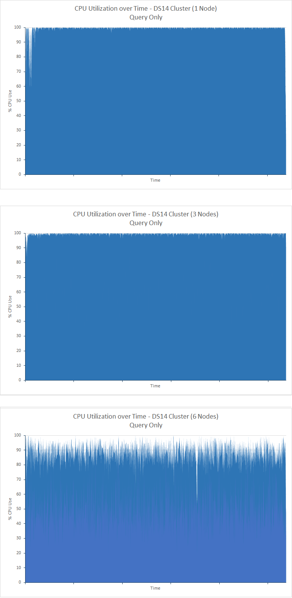
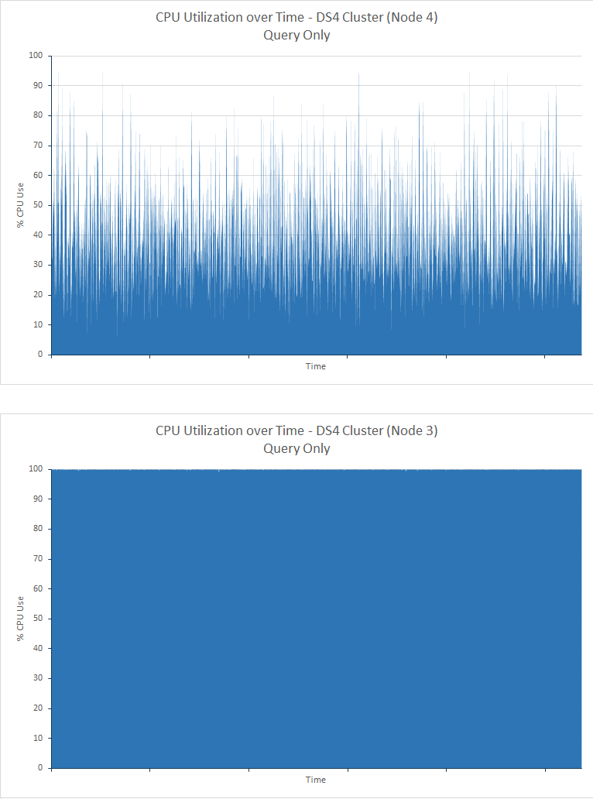
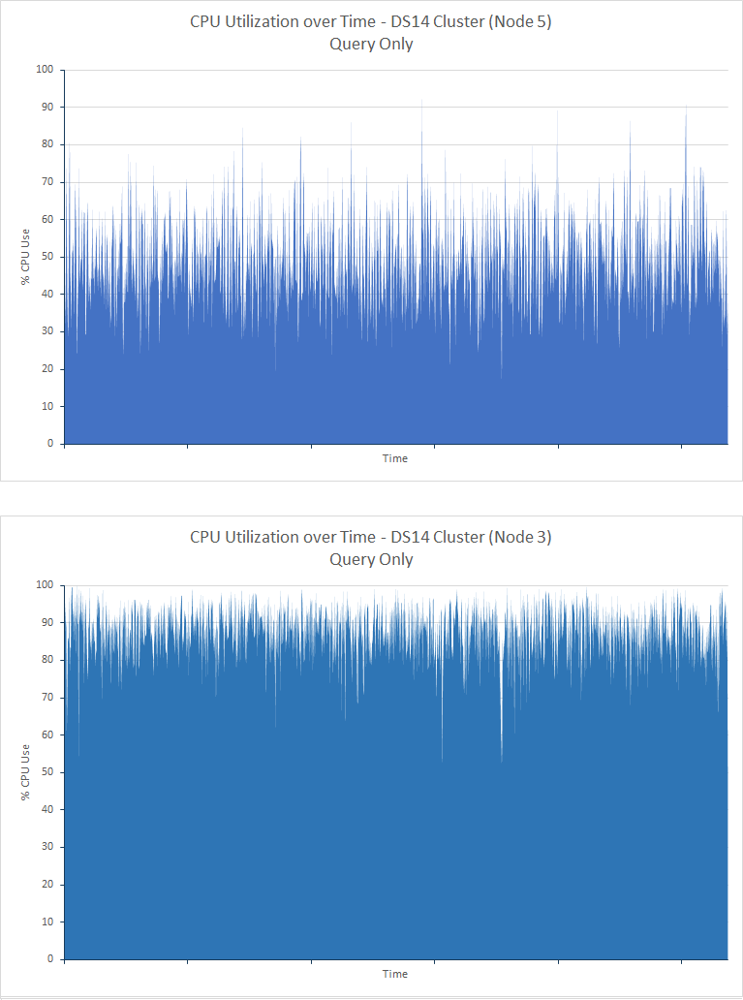
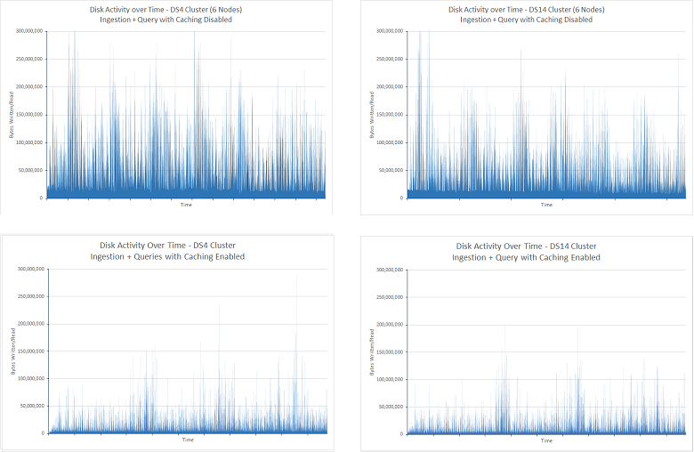
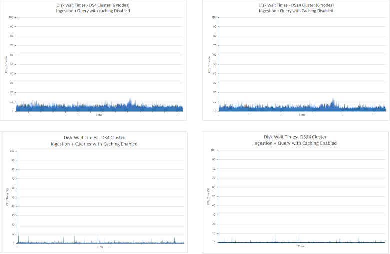

<properties
   pageTitle="Réglage des performances d’agrégation et de requête de données avec Elasticsearch sur Azure | Microsoft Azure"
   description="Un résumé des points à considérer lors de l’optimisation des performances de requête et de recherche pour Elasticsearch."
   services=""
   documentationCenter="na"
   authors="dragon119"
   manager="bennage"
   editor=""
   tags=""/>

<tags
   ms.service="guidance"
   ms.devlang="na"
   ms.topic="article"
   ms.tgt_pltfrm="na"
   ms.workload="na"
   ms.date="09/22/2016"
   ms.author="masashin"/>
   
# <a name="tuning-data-aggregation-and-query-performance-with-elasticsearch-on-azure"></a>Réglage des performances d’agrégation et de requête de données avec Elasticsearch sur Azure

[AZURE.INCLUDE [pnp-header](../../includes/guidance-pnp-header-include.md)]

Cet article fait [partie d’une série](guidance-elasticsearch.md). 

Principale raison pour à l’aide de Elasticsearch consiste à prendre en charge les recherches dans les données. Les utilisateurs doivent pouvoir trouver rapidement les informations qu’ils recherchent. En outre, le système doit permettre aux utilisateurs de poser des questions des données, corrélations de recherche et fournis aux conclusions peuvent conduire à des décisions commerciales. Ce traitement est ce qui différencie des données à partir des informations.

Ce document résume les options que vous pouvez prendre en compte lorsque vous déterminez la meilleure façon d’afin d’optimiser votre système de performances des requêtes et recherche.

Toutes les recommandations relatives aux performances dépendent largement les scénarios qui s’appliquent à votre situation, le volume de données que vous indexez et la fréquence à laquelle les utilisateurs et applications Interrogez vos données. Vous devez tester avec soin les résultats de toute modification apportée dans configuration ou la structure d’indexation à l’aide de vos propres données et les charges de travail afin d’évaluer les avantages à vos scénarios spécifiques. À cet effet, ce document décrit également un certain nombre de critères d’évaluation qui ont été effectuées pour un scénario spécifique implémenté à l’aide des configurations différentes. Vous pouvez l’adapter la démarche à suivre pour évaluer les performances de votre propre systèmes. Les détails de ces tests sont décrites dans l' [appendice](#appendix-the-query-and-aggregation-performance-test).

## <a name="index-and-query-performance-considerations"></a>Considérations relatives aux performances index et requête

Cette section décrit certains facteurs courants que vous devez réfléchir sur lorsque conception index ce qu’il soit nécessaire pour prendre en charge l’interrogation et la recherche rapide.

### <a name="storing-multiple-types-in-an-index"></a>Stockage de plusieurs types dans un index

Un index Elasticsearch peut contenir plusieurs types. Il peut être préférable d’éviter cette approche et créer un index distinct pour chaque type. Tenez compte des points suivants :

- Différents types peuvent spécifier différents analyseurs, et il n’est pas toujours effacer l’analyzer Elasticsearch doit utiliser si une requête est exécutée au niveau de l’index plutôt qu’au niveau du type. Pour plus d’informations, voir [Éviter les problèmes de Type](https://www.elastic.co/guide/en/elasticsearch/guide/current/mapping.html#_avoiding_type_gotchas) .

- Milieu des fragments pour les index qui contiennent plusieurs types de sera probablement plus grande que celles des index qui contiennent un seul type. Plus grande sera a partagé, plus l’effort est requis par Elasticsearch pour filtrer les données lors de l’exécution des requêtes.

- S’il existe une incompatibilité de significative entre les volumes de données pour les types de, informations pour un seul type peuvent devenir peu réparties sur nombreux milieu des fragments réduire l’efficacité des recherches qui extraient ces données.

    

    ***Les effets du partage d’un index entre types*** 

    Dans la partie supérieure du diagramme, le même index est partagé par les documents de type A et b de type. Il existe bien d’autres documents de type A à type que b. recherche type n’impliquent l’interrogation de tous les quatre milieu des fragments. La partie inférieure du diagramme montre l’effet si index séparés sont créés pour chaque type. Dans ce cas, recherche type ne nécessite uniquement l’accès à deux milieu des fragments.

- Milieu des fragments petites peuvent être plus réparties au milieu des fragments volumineux, ce qui facilite Elasticsearch répartir la charge sur les nœuds.

- Différents types il est possible que la période de rétention différente. Il peut être difficile d’archiver les données anciennes qui partage milieu des fragments avec des données actives.


Toutefois, dans certaines circonstances partage un index parmi les différents types peut être efficace si :

- Recherches couvrant régulièrement les types de contenus dans le même index.

- Les types ont uniquement un petit nombre de documents que chacun. Maintenir un ensemble de milieu des fragments pour chaque type distinct risque de devenir une charge significative dans ce cas.


### <a name="optimizing-index-types"></a>Optimisation des types d’index

Un index Elasticsearch contient une copie des documents JSON d’origine ayant servi à remplir. Ces informations sont trouve dans le [* \_source*](https://www.elastic.co/guide/en/elasticsearch/reference/current/mapping-source-field.html#mapping-source-field) champ de chaque élément indexé. Ces données ne sont pas disponible pour la recherche, mais par défaut sont renvoyées par requêtes *get* et de *recherche* . Toutefois, ce champ entraîne une surcharge et occupe de stockage, agrandissant milieu des fragments et augmenter le volume d’e/s effectuée. Vous pouvez désactiver la * \_source* champ sur une base par type :

```http
PUT my_index
{
  "mappings": {
    "my_type": {
      "_source": {
        "enabled": false
      }
    }
  }
}
```
La désactivation de ce champ supprime également la possibilité d’effectuer les opérations suivantes :

- Mise à jour des données dans l’index à l’aide de la *mise à jour* API.

- Effectuant des recherches qui renvoient des données mises en surbrillance.

- Réindexation à partir d’un index Elasticsearch directement à un autre.

- Modification des mappages ou les paramètres d’analyse.

- Déboguer des requêtes en affichant le document d’origine.


### <a name="reindexing-data"></a>Données réindexation

Le nombre de milieu des fragments disponibles pour un index détermine la capacité de l’index. Vous pouvez prendre une estimation initiale (et informée) au milieu des fragments combien il faudra, mais vous devez toujours envisager votre document réindexation stratégie avance. Dans de nombreux cas, la réindexation peut être une tâche initial fur et à des données. Vous souhaiterez ne peut-être pas à allouer au départ, un grand nombre de milieu des fragments à un index pour des raisons de l’optimisation de recherche, mais allouer les nouveaux milieu des fragments développe le volume de données. Dans les autres cas réindexation devront être exécutées sur une base ad hoc plus si vos estimations sur la croissance des volumes de données simplement s’avérer inexactes.

> [AZURE.NOTE] Réindexation n’est peut-être pas nécessaire pour les données ans rapidement. Dans ce cas, une application peut créer un nouvel index pour chaque période de temps. Exemples incluent les journaux de performance ou les données qui peuvent être stockées dans un index actualisé chaque jour d’audit.

<!-- -->

Réindexation efficacement implique la création d’un nouvel index à partir des données dans un ancien, puis la suppression de l’ancien index. Si un index est volumineux, ce processus peut prendre un temps et vous devrez peut-être faire en sorte que les données restent disponible pour la recherche pendant cette période. Pour cette raison, vous devez créer un [alias pour chaque index](https://www.elastic.co/guide/en/elasticsearch/reference/current/indices-aliases.html), et requêtes doivent récupérer des données via ces alias. Lors de la réindexation, conservez l’alias pointant sur l’ancien index, puis connectez-le pour faire référence au nouvel index une fois la réindexation terminée. Cette approche est également utile pour accéder aux données temporelles qui crée un nouvel index chaque jour. Pour accéder en cours données utilisent un alias bascule vers le nouvel index telle qu’elle est créée.

### <a name="managing-mappings"></a>Gestion des mappages

Elasticsearch utilise des mappages pour déterminer comment interpréter les données qui se produisent dans chaque champ dans un document. Chaque type possède son propre mappage qui efficacement définit un schéma pour ce type. Elasticsearch utilise ces informations pour générer des index inversées pour chaque champ dans les documents dans un type. Dans n’importe quel document, chaque champ a un type de données (par exemple, *chaîne*, *date*ou *longue*) et une valeur. Vous pouvez spécifier les mappages pour un index lorsque l’index est créé tout d’abord, ou qu’ils peuvent être déduites en Elasticsearch lorsque des documents sont ajoutés à un type. Toutefois, tenez compte des points suivants :

- Mappages générés dynamiquement peuvent provoquer des erreurs en fonction de la façon dont les champs sont interprétés lorsque des documents sont ajoutés à un index. Par exemple, document 1 peut contenir un champ A contenant un nombre et causes Elasticsearch pour ajouter un mappage qui indique que ce champ est une *durée*. Si un document ultérieur est ajouté dans le champ A contienne des données non numériques, puis il ne fonctionnera pas. Dans ce cas, le champ A doit probablement été interprété comme une chaîne lorsque le premier document a été ajouté. Spécification ce mappage lors de la création de l’index peut vous aider à éviter des problèmes.

- Concevez vos documents pour éviter de générer des mappages trop volumineux que cela peut ajouter significative aérienne lorsque vous effectuez des recherches, utiliser une quantité importante de mémoire et également entraîner l’échec trouver des données des requêtes. Arrêter une convention d’appellation cohérente pour les champs dans les documents qui partagent le même type. Par exemple, ne pas utiliser des noms de champ tels que « Prénom » « Prénom » et « prénom » dans différents documents. Utiliser le même nom de champ dans chaque document. En outre, n’essayez pas d’utiliser des valeurs en tant que clés (cela est une approche commune dans les bases de données de colonne famille, mais peuvent entraîner des problèmes d’efficacité et les échecs avec Elasticsearch.) Pour plus d’informations, voir [Mappage d’Explosion](https://www.elastic.co/blog/found-crash-elasticsearch#mapping-explosion).

- Utilisez *not_analyzed* pour éviter la création de jetons le cas échéant. Par exemple, si un document comporte un champ de type chaîne nommé *données* qui contient la valeur « ABC définition » vous pouvez essayer d’effectuer une recherche pour tous les documents qui correspondent à cette valeur comme suit :

  ```http
  GET /myindex/mydata/_search
  {
    "query" : {
      "filtered" : {
        "filter" : {
          "term" : {
            "data" : "ABC-DEF"
          }
        }
      }
    }
  }
  ```

 Toutefois, cette recherche ne fonctionnera pas renvoyer les résultats attendus en raison de la façon dont les jetons dans lequel la chaîne ABC définition lorsqu’il est indexé. Il sera efficacement fractionnée en deux jetons, ABC et définition, par le trait d’union. Cette fonctionnalité est conçue pour prendre en charge la recherche de texte complet, mais si vous souhaitez que la chaîne est interprété comme étant un seul élément atomique vous devez désactiver la création de jetons lorsque le document est ajouté à l’index. Vous pouvez utiliser un mappage telles que :

  ```http
  PUT /myindex
  {
    "mappings" : {
      "mydata" : {
        "properties" : {
          "data" : {
            "type" : "string",
            "index" : "not_analyzed"
          }
        }
      }
    }
  }
  ```

  Pour plus d’informations, voir [Trouver les valeurs exactes](https://www.elastic.co/guide/en/elasticsearch/guide/current/_finding_exact_values.html#_term_filter_with_text).


### <a name="using-doc-values"></a>En utilisant les valeurs d’un document

Plusieurs requêtes et les agrégations requièrent que les données sont triées dans le cadre de l’opération de recherche. Tri nécessite de pouvoir mapper un ou plusieurs termes à une liste de documents. Pour vous aider dans ce processus, Elasticsearch peut charger toutes les valeurs d’un champ utilisé comme clé de tri en mémoire. Ces informations sont appelées *fielddata*. L’objectif est que la mise en cache fielddata en mémoire entraîne moins d’e/s et peut être plus rapide que la lecture à plusieurs reprises les mêmes données à partir du disque. Toutefois, si un champ a cardinalité élevée puis stockant le fielddata en mémoire peut consommer beaucoup d’espace de segment, éventuellement ayant un impact sur la fonctionnalité permettant d’effectuer d’autres opérations simultanées ou même épuiser à l’origine Elasticsearch Échec de stockage.

En guise d’alternative, Elasticsearch prend également en charge les *valeurs d’un document*. Une valeur de document est semblable à un élément de fielddata en mémoire mais il est stocké sur le disque et créée lorsque les données sont stockées dans un index (fielddata est généré dynamiquement lorsqu’une requête est exécutée.) Les valeurs de document ne nécessitent pas l’utilisation d’espace segment et donc sont utiles pour les requêtes que trier ou regrouper des données dans l’ensemble champs qui peuvent contenir un grand nombre de valeurs uniques. En outre, la pression réduite sur le segment peut vous aider à décaler les différences de performances entre récupération des données à partir du disque et la lecture de la mémoire. Nettoyage est susceptible de se produire moins souvent, et d’autres opérations simultanées qui utilisent la mémoire sont moins susceptibles d’être effectuées.

Pour activer ou désactiver les valeurs d’un document sur une base par propriété dans un index à l’aide de l’attribut *doc_values* , comme le montre l’exemple suivant :

```http
PUT /myindex
{
  "mappings" : {
    "mydata" : {
      "properties" : {
        "data" : {
          ...
          "doc_values": true
        }
      }
    }
  }
}
```
> [AZURE.NOTE] Valeurs de document sont activées par défaut avec Elasticsearch version 2.0.0 compter.

L’impact exacte en utilisant les valeurs d’un document est susceptible d’être très spécifiques à vos propres scénarios de données et la requête, préparez-vous à effectuer des tests de performance pour établir leur utilité. Vous devez également noter ce document valeurs ne fonctionnent pas avec les champs de type chaîne analysée. Pour plus d’informations, voir [Les valeurs de document](https://www.elastic.co/guide/en/elasticsearch/guide/current/doc-values.html#doc-values).

### <a name="using-replicas-to-reduce-query-contention"></a>Utilisation de duplications pour réduire les conflits de requête

Une stratégie commune pour améliorer les performances des requêtes consiste à créer plusieurs copies de chaque index. Opérations de récupération de données peuvent être satisfaites par la lecture de données à partir d’un réplica. Toutefois, cette stratégie peut altérer les performances des opérations de réception de données, afin qu’il doit être utilisé avec soin dans les scénarios qui impliquent les charges de travail mixtes. Par ailleurs, cette stratégie est uniquement des avantages si réplicas sont réparties sur nœuds et ne pas compétition pour les ressources avec milieu des fragments principales qui font partie du même index. N’oubliez pas qu’il est possible d’augmenter ou diminuer le nombre de réplica pour un index dynamiquement.

### <a name="using-the-shard-request-cache"></a>Utilisation du cache de demande partagé

Elasticsearch peut mettre en cache les données locales demandées par les requêtes sur chaque partagé en mémoire. Cette recherche vous permettent de conserver qui extraient les mêmes données s’exécutent plus rapidement, données peuvent être lus à partir du stockage mémoire plutôt que sur disque. Mise en cache de données de cette façon pouvez donc améliorer les performances de certaines opérations de recherche, au prix réduit la quantité de mémoire disponible pour les autres tâches en cours d’exécution simultanément. Il existe également le risque que pris en charge du cache de données est obsolète. Les données dans le cache sont annulées uniquement lorsque le partagé est actualisé et les données a changé. La fréquence des mises à jour est régie par la valeur du paramètre *refresh_interval* de l’index.

La demande de mise en cache pour un index est désactivée par défaut, mais vous pouvez l’activer comme suit :

```http
PUT /myindex/_settings
{
  "index.requests.cache.enable": true
}
```

Le cache de demande éclater convient le mieux pour plus d’informations restent relativement statiques, tels que les données historiques ou que l’enregistrement.

### <a name="using-client-nodes"></a>L’utilisation des nœuds de client

Toutes les requêtes sont traitées par le nœud qui reçoit d’abord la demande. Ce nœud envoie des requêtes davantage à tous les autres nœuds contenant milieu des fragments pour les indices interrogés et puis sont additionnés les résultats pour renvoyer la réponse. Si une requête implique agréger des données ou d’effectuer des calculs complexes, le nœud initial est responsable de l’exécution du traitement approprié. Si votre système doit prendre en charge un petit nombre de requêtes complexes, envisagez de créer un pool de client nœuds pour alléger la charge des nœuds de données. En revanche, si votre système possède gérer un grand nombre de requêtes simples, puis à soumettre ces requêtes directement dans les nœuds de données et un équilibrage de charge permet de distribuer les requêtes de manière égale.

### <a name="tuning-queries"></a>Optimisation des requêtes

Conseils pour optimiser les performances des requêtes Elasticsearch résument les les points suivants :

- Éviter les requêtes qui impliquent les caractères génériques dès que possible.

- Si le même champ est soumis à exacte et recherche de texte intégral mise en correspondance, vous pouvez stocker les données pour le champ dans les formulaires analysés et nonanalyzed. Effectuer des recherches en texte intégral dans le champ analysé et correspondances exactes dans le champ nonanalyzed.

- Renvoyer uniquement les données nécessaires. Si vous disposez de documents volumineux, mais une application requiert uniquement les informations contenues dans un sous-ensemble des champs, puis retourner ce sous-ensemble de requêtes plutôt que des documents entiers. Cette stratégie peut réduire la bande passante réseau du cluster.

- Si possible, utilisez les filtres au lieu de requêtes lorsque vous recherchez des données. Un filtre détermine simplement si un document correspond à un critère donné qu’une requête calcule également comment fermer une correspondance un document est (notation). En interne, les valeurs générées par un filtre sont stockées sous forme de bitmap indiquant correspondance/aucune correspondance pour chaque document, et ils peuvent être mis en cache par Elasticsearch. Si le même critère de filtre se produit par la suite, l’image bitmap peut être récupérée à partir du cache et utilisée pour récupérer rapidement les documents correspondants. Pour plus d’informations, voir [Fonctionnement de filtre interne](https://www.elastic.co/guide/en/elasticsearch/guide/current/_finding_exact_values.html#_internal_filter_operation).

- Utiliser des filtres de *bool* permettant d’effectuer des comparaisons statiques et utiliser uniquement *et*, *ou*et *pas* des filtres pour les filtres calculés dynamiquement, tels que ceux qui impliquent l’écriture de script ou le *geo -\* * filtres.

- Si une requête combine *bool* filtres avec *et*, *ou*, ou *non* avec *geo -* * filtres, placez le *et*/*ou*/*pas geo-** filtres dernière afin qu’ils opèrent sur la plus petite possible de jeu de données.

    De même, utiliser un *post_filter* pour exécuter des opérations de filtrage coûteux. Ces filtres sont effectués dernière.

- Utilisez les agrégations plutôt que facettes. Éviter le calcul des agrégats qui sont analysées ou qui ont plusieurs valeurs possibles.

    > **Remarque**: facettes ont été supprimées dans Elasticsearch version 2.0.0.

- Utiliser l’agrégation *cardinalité* plutôt que l’agrégation *value_count* , à moins que votre application requiert un nombre exact de correspondance des éléments. Un nombre exact peut devenir rapidement obsolète, et de nombreuses applications nécessitent uniquement une approximation raisonnablement.

- Éviter l’écriture de script. Les scripts dans les requêtes et les filtres peuvent être coûteux et les résultats ne sont pas mises en cache. Les scripts longue peuvent consommer threads recherche indéfiniment, à l’origine de demandes suivantes à mettre en attente. Si la file d’attente est pleine, plus demandes seront rejetées.

## <a name="testing-and-analyzing-aggregation-and-search-performance"></a>Test et analyse des performances d’agrégation et de recherche

Cette section décrit les résultats d’une série de tests qui ont été exécutées sur cluster varié et configurations index. Deux types de tests ont été effectuées, comme suit :

- *Requête et *la *réception* test **. Ce test en main avec un index vide qui a été rempli comme le test précédés d’effectuer les opérations d’insertion en bloc (chaque opération ajoutée documents 1000). En même temps, un certain nombre de requêtes conçu pour rechercher des documents ajoutés au cours de la période de 15 minutes précédente et générer des agrégations ont été répété à intervalles de 5 secondes. Ce test a été généralement autorisé à s’exécuter pendant 24 heures, pour reproduire les effets d’une charge de travail complexe comprenant réception de données de grande taille avec près de requêtes en temps réel.

- **La *requête seule* **de test. Ce test est similaire à la *réception et requête* tester sauf que le composant de réception est omis, et l’index sur chaque nœud est prérempli avec 100 millions de documents. Un ensemble de requêtes modifié est effectué ; l’élément heure limitation des documents à ceux ajoutés dans depuis 15 minutes a été supprimé que les données ont été maintenant statiques. Les tests s’est exécutée pendant 90 minutes, il est moins de temps nécessaire pour établir un modèle de performances en raison de la quantité de données fixe.

---

Chaque document dans l’index a le même schéma. Le tableau suivant résume les champs dans le schéma :

Nom                          | Type         | Notes |
  ----------------------------- | ------------ | -------------------------------------------------------- |
  Organisation                  | Chaîne      | Le test génère 200 organisations uniques. |
  CustomField1 - champ personnalisé 5   |Chaîne       |Il s’agit des cinq champs de type chaîne qui sont définis pour une chaîne vide.|
  DateTimeRecievedUtc           |Horodatage    |La date et l’heure à laquelle le document a été ajouté.|
  Hôte                          |Chaîne       |Ce champ est défini sur une chaîne vide.|
  HttpMethod                    |Chaîne       |Ce champ est défini sur une des valeurs suivantes : « Publier », « Obtenir », « Placer ».|
  HttpReferrer                  |Chaîne       |Ce champ est défini sur une chaîne vide.|
  HttpRequest                   |Chaîne       |Ce champ est renseigné à l’aide d’un texte aléatoire compris entre 10 et 200 caractères.|
  HttpUserAgent                 |Chaîne       |Ce champ est défini sur une chaîne vide.|
  HttpVersion                   |Chaîne       |Ce champ est défini sur une chaîne vide.|
  Nom_organisation              |Chaîne       |Ce champ est défini sur la même valeur que le champ organisation.|
  SourceIp                      |IP           |Ce champ contient une adresse IP indiquant « origine » des données. |
   SourceIpAreaCode              |Long         |Ce champ est défini sur 0.|
  SourceIpAsnNr                 |Chaîne       |Ce champ est défini sur « en tant que\#\#\#\#\#».|
  SourceIpBase10                |Long         |Ce champ est défini à 500.|
  SourceIpCountryCode           |Chaîne       |Ce champ affiche un code de caractère 2 pays. |
  SourceIpCity                  |Chaîne       |Ce champ contient une chaîne qui identifie une ville dans un pays. |
  SourceIpLatitude              |Double       |Ce champ contient une valeur aléatoire.|
  SourceIpLongitude             |Double       |Ce champ contient une valeur aléatoire.|
  SourceIpMetroCode             |Long         |Ce champ est défini sur 0.|
  SourceIpPostalCode            |Chaîne       |Ce champ est défini sur une chaîne vide.|
  SourceLatLong                 |Point geo   |Ce champ est défini sur un point geo aléatoires.|
  PortSource                    |Chaîne       |Ce champ est rempli avec la chaîne représentant un nombre aléatoire.|
  TargetIp                      |IP           |Il est rempli avec une adresse IP aléatoire dans la plage 0.0.100.100 à 255.9.100.100.|
  SourcedFrom                   |Chaîne       |Ce champ est défini sur la chaîne « MonitoringCollector ».|
  Port cible                    |Chaîne       |Ce champ est rempli avec la chaîne représentant un nombre aléatoire.|
  Évaluation                        |Chaîne       |Ce champ est rempli avec l’un des 20 différentes valeurs de chaîne sélectionnées de manière aléatoire.|
  UseHumanReadableDateTimes     |Valeur booléenne      |Ce champ est défini sur false.|
 
Les requêtes suivantes ont été effectuées en tant que lot par chaque itération des tests. Les noms en italique sont utilisés pour faire référence à ces requêtes dans le reste de ce document. Notez que le critère de temps (documents ajoutés dans depuis 15 minutes) a été omis dans la *requête seule* tests :

- Le nombre de documents avec chaque valeur de *niveau* ont été entré dans depuis 15 minutes (*nombre en notation*) ? 

- Le nombre de documents ont été ajouté dans chaque intervalle de 5 minutes pendant depuis 15 minutes (*NB au fil du temps*) ?

- Le nombre de documents de chaque valeur *évaluation* ont été ajouté pour chaque pays dans depuis 15 minutes (*nombre d’accès par pays*) ?

- Quelles 15 organisations se documents fréquemment dans la plupart des ajoutés dans depuis 15 minutes (*15 premières organisations*) ?

- Combien de différentes organisations se produisent dans les documents ajoutés dans depuis 15 minutes (*organisations nombre uniques*) ?

- Le nombre de documents ont été ajouté dans les dernières 15 minutes (*nombre Total d’accès au*) ?

- Nombre de valeurs *SourceIp* différent se produire dans les documents ajoutés dans depuis 15 minutes (*Nb IP Unique*) ?


La définition de l’index et les détails des requêtes sont décrites dans l' [appendice](#appendix-the-query-and-aggregation-performance-test).

Les tests ont été conçues pour comprendre les effets des variables suivantes :

- **Type de disque**. Les tests ont été effectuées sur un cluster de 6-nœud de D4 machines virtuelles à l’aide de stockage standard (disques durs) et répétées sur un cluster de 6-nœud de DS4 machines virtuelles à l’aide de stockage premium (SSDs).

- **Taille de l’ordinateur - mise à l’échelle vers le haut**. Tests ont été effectuées sur un cluster de 6-nœud comprenant des machines virtuelles DS3 (désigné comme le cluster *petite* ), répétées sur un cluster de machines virtuelles DS4 (le cluster *support* ) et répétées à nouveau sur un cluster de machines DS14 ( *grand* cluster). Le tableau suivant résume les caractéristiques de chaque VM SKU la clé :

 Cluster | MACHINE VIRTUELLE RÉFÉRENCE (SKU)        | Nombre de cœurs | Nombre de disques de données | RAM (GO) |
---------|---------------|-----------------|----------------------|----------|
 MINUSCULE   | DS3 standard  | 4               | 8                    | 14       |
 Moyenne  | DS4 standard  | 8               | 16                   | 28       |
 Grande taille   | DS14 standard | 16              | 32                   | 112      |

- **Taille de cluster - mise à l’échelle**. Tests ont été effectués sur les groupes de machines virtuelles DS14 contenant 1, 3 et 6 nœuds.

- **Nombre de réplicas index**. Tests ont été effectuées à l’aide d’index configurés avec réplicas 1 et 2.

- **Valeurs de document**. Au départ les tests ont été effectués avec l’index définition *doc_values* la valeur *true* (valeur par défaut). Tests sélectionnés ont été répétés avec *doc_values* la valeur *false*.

- **La mise en cache**. Tests ont été effectués avec le cache de demande éclater activé sur l’index.

- **Nombre de milieu des fragments**. Tests ont été répétés à l’aide des nombres de milieu des fragments variables d’établir si requêtes a exécuté plus efficacement sur index contenant milieu des fragments moins, plus grands ou plus petits, plus milieu des fragments.


## <a name="performance-results---disk-type"></a>Résultats des performances - type de disque

Les performances du disque a été évaluée en exécutant le test de *réception et requête* sur le cluster 6 nœuds de machines virtuelles D4 (à l’aide de disques durs) et sur le cluster 6 nœuds de machines virtuelles DS4 (à l’aide de SSDs). La configuration de Elasticsearch dans les deux clusters était le même. Les données étaient réparties sur 16 disques sur chaque nœud et chaque nœud avait 14 Go de RAM alloué à la machine virtuelle (machine virtuelle Java) en cours d’exécution Elasticsearch, la mémoire restante (également 14 Go) laissée pour le système d’exploitation. Chaque test s’est exécuté un délai de 24 heures. Cette période a été activée pour que les effets de la hausse du volume de données pour apparu et autoriser le système à placez son. Le tableau ci-dessous résume les résultats de la mise en surbrillance les temps de réponse de diverses opérations qui comprenant le test.

 Cluster | Requête d’opération            | Temps de réponse moyen (ms) |
---------|----------------------------|----------------------------|
 D4      | Réception                  | 978                        |
         | Compter en définissant une classification            | 103                        |
         | Nombre de temps            | 134                        |
         | Nombre d’accès par pays            | 199                        |
         | 15 premiers organisations       | 137                        |
         | Organisations nombre uniques | 139                        |
         | Nombre d’adresses IP uniques            | 510                        |
         | Nombre total d’accès au           | 89                         |
 DS4     | Réception                  | 511                        |
         | Compter en définissant une classification            | 187                        |
         | Nombre de temps            | 411                        |
         | Nombre d’accès par pays            | 402                        |
         | 15 premiers organisations       | 307                        |
         | Organisations nombre uniques | 320                        |
         | Nombre d’adresses IP uniques            | 841                        |
         | Nombre total d’accès au           | 236                        |

À première vue, il semblerait que le cluster DS4 effectué requêtes moins bonnes que celles de cluster D4, parfois doubler (ou pire) le temps de réponse. Cela n’indique pas mais le tableau complet. Le tableau suivant indique le nombre d’opérations de réception effectué par chaque cluster (n’oubliez pas que chaque opération du chargement de documents 1000) :

 Cluster | Nombre d’opérations de réception |
---------|---------------------------|
 D4      | 264769                    |
 DS4     | 503157                    |

Le cluster DS4 a été en mesure de charger presque deux fois plus de données que le cluster D4 pendant le test. Par conséquent, lorsque vous analysez les temps de réponse pour chaque opération, vous devez également tenir compte le nombre de documents chaque requête a pour analyser et le nombre de documents est retourné. Il s’agit des chiffres dynamiques le volume de documents dans l’index est toujours plus grande. Vous ne pouvez pas simplement diviser 503137 par 264769 (nombre d’opérations de réception effectuées par chaque cluster) et puis multipliez le résultat par le temps de réponse moyen pour chaque requête effectuée par le cluster D4 pour accorder une information comparative comme ceci ignore la quantité d’e/s en cours d’exécution simultanément par l’opération de réception. À la place, vous devez mesurer la quantité de données écrites à mémoire et lire à partir du disque au fur et le test. Le plan de test JMeter capture ces informations pour chaque nœud. Les résultats résumés sont :

 Cluster | Moyenne des octets écrit/lu par chaque opération |
---------|----------------------------------------------|
 D4      | 13471557                                     |
 DS4     | 24643470                                     |

Ces données indiquent que le cluster DS4 a été en mesure de maintenir un taux d’e/s environ 1,8 fois qui du cluster D4. Étant donné que, en dehors de la nature des disques, toutes les autres ressources sont identiques, la différence doit être liée à l’utilisation de SSDs plutôt disques durs.

Pour aider à justifier cette conclusion, les graphiques suivants illustrent la façon dont les e/s a été effectuée au fil du temps en chaque cluster :


<!-- -->

***Activité du disque pour les groupes D4 et DS4***

Le graphique pour le cluster D4 présente des variantes significative, en particulier pendant la première moitié du test. Il s’agissait probablement en raison de la limitation pour réduire le taux d’e/s. Dans les étapes initiales du test, les requêtes sont en mesure d’exécuter rapidement comme il est peu de données à analyser. Les disques du cluster D4 sont donc susceptibles d’agir près de leurs entrées/sorties par seconde capacité (sorties par), bien que chaque opération e/s peut-être être ne renvoyant pas quantité de données. Le cluster DS4 peut prendre en charge une fréquence plus élevée sorties par et pas subi du même niveau de limitation, le taux d’e/s sont plus régulière. Pour prendre en charge cette hypothèse, la paire suivante de graphiques montrent comment l’UC a été bloqué par e/s disque au fil du temps (les temps d’attente disque indiqués dans les graphiques sont la proportion du temps passé par l’UC à attendre e/s) :


***E/s de disque du processeur d’attente pour les groupes D4 et DS4***

Il est important de comprendre qu’il existe deux raisons prédominance pour les opérations d’e/s bloquer du processeur :

- Le sous-système e/s est en train de lire ou écrire des données vers ou à partir du disque.

- Le sous-système e/s pourrait être limité par l’environnement hôte. Azure disques implémentés à l’aide de disques durs ont un débit maximal de sorties 500 par et SSDs ont un débit maximal de sorties 5000 par.


Pour le cluster D4, l’intervalle de temps passé à attendre e/s pendant la première moitié de la corrélation test près d’une manière inversée avec le graphique indiquant le taux d’e/s. Périodes de faible e/s correspondent aux périodes de temps bloqués par l’unité centrale, cela signifie qu’e/s est limitée. En plus de données sont ajoutés au cluster les modifications situation, et dans la deuxième moitié des sommets de test e/s temps d’attente correspondent avec pointes dans débit e/s. À ce stade, l’UC est bloqué lors de l’exécution d’e/s réel. Là encore, avec le cluster DS4, le temps passé en attente d’e/s est beaucoup plus égale. Chaque pointe correspond à un pic équivalent dans les performances au lieu d’un bac, cela signifie qu’il y a peu ou pas la limitation se produisant.

Il existe un des autres facteurs à prendre en compte. Pendant le test, le cluster D4 généré 10584 réception les erreurs et 21 requête. Le test sur le cluster DS4 ne produit aucune erreur.

## <a name="performance-results---scaling-up"></a>Résultats des performances - mise à l’échelle vers le haut

Échelle avec des tests a été effectuée par effectuer des tests avec 6 nœuds de DS3 DS4 et des machines virtuelles DS14. Ces références SKU ont été sélectionnées, car une machine virtuelle DS4 fournit deux fois nombreux cœurs du processeur et la mémoire comme un DS3 et un ordinateur DS14 double à nouveau les ressources du processeur tout en fournissant quatre fois la quantité de mémoire. Le tableau suivant compare les aspects clés de chaque référence (SKU) :

 RÉFÉRENCE (SKU)  | \#Cœurs de processeur | Mémoire (Go) | Disque max sorties par | Bande passante max (Mo/s)|
------|-------------|-------------|---------------|--------------|
 DS3  | 4           | 14          | 12,800| 128 |
 DS4  | 8           | 28          | 25,600| 256 |
 DS14 | 16          | 112         | 50 000| 512 |

Le tableau suivant résume les résultats de l’exécution des tests sur les PME (DS3), (DS4), des clusters de grande taille (DS14). Chaque ordinateur virtuel utilisé SSDs pour stocker les données. Chaque test s’est exécuté un délai de 24 heures.

Le tableau indique le nombre de demandes réussies pour chaque type de requête (échecs ne sont pas inclus). Le nombre de requêtes a tenté pour chaque type de requête est approximativement la même pendant l’exécution du test. C’est parce que le plan de test JMeter s’exécute une seule occurrence de chaque requête (nombre en notation Nb Over, accès par pays, haut 15 organisations, organisations Nb Unique, nombre IP uniques et heure nombre Total de correspondances) ensemble dans une seule unité appelée d’une *transaction de test* (cette opération est indépendamment de la tâche qui effectue l’opération de réception, qui est exécutée par un thread distinct). Chaque itération au plan de test effectue une transaction de test unique. Le nombre de transactions test terminées est donc une mesure de l’heure de réponse de la requête plus lente dans chaque transaction.

| Cluster      | Requête d’opération            | Nombre de requêtes | Temps de réponse moyen (ms) |
|--------------|----------------------------|--------------------|----------------------------|
| Minuscule (DS3)  | Réception                  | 207284             | 3328                       |
|              | Compter en définissant une classification            | 18444              | 268                        |
|              | Nombre de temps            | 18444              | 340                        |
|              | Nombre d’accès par pays            | 18445              | 404                        |
|              | 15 premiers organisations       | 18439              | 323                        |
|              | Organisations nombre uniques | 18437              | 338                        |
|              | Nombre d’adresses IP uniques            | 18442              | 468                        |
|              | Nombre total d’accès au           | 18428              | 294   
|||||
| Moyenne (DS4) | Réception                  | 503157             | 511                        |
|              | Compter en définissant une classification            | 6958               | 187                        |
|              | Nombre de temps            | 6958               | 411                        |
|              | Nombre d’accès par pays            | 6958               | 402                        |
|              | 15 premiers organisations       | 6958               | 307                        |
|              | Organisations nombre uniques | 6956               | 320                        |
|              | Nombre d’adresses IP uniques            | 6955               | 841                        |
|              | Nombre total d’accès au           | 6958               | 236                        |
|||||
| Grande (DS14) | Réception                  | 502714             | 511                        |
|              | Compter en définissant une classification            | 7041               | 201                        |
|              | Nombre de temps            | 7040               | 298                        |
|              | Nombre d’accès par pays            | 7039               | 363                        |
|              | 15 premiers organisations       | 7038               | 244                        |
|              | Organisations nombre uniques | 7037               | 283                        |
|              | Nombre d’adresses IP uniques            | 7037               | 681                        |
|              | Nombre total d’accès au           | 7038               | 200                        |

Ces données montrent que, pour ce test, les performances du cluster DS4 et DS14 étaient raisonnablement similaires. Le temps de réponse pour les opérations de requête pour le cluster DS3 apparaissent également comparer favorablement initiale, et le nombre de requête opérations effectuées est bien dépassent les valeurs pour le cluster DS4 et DS14. Toutefois, une doit également prendre en compte fort du taux réception et le nombre de documents en cours de recherche qui en résulte. Dans le cluster DS3 réception est beaucoup plus restreinte, et à la fin du test de la base de données ne contenait environ 40 % des documents lus dans chacune des deux autres groupes. Il s’agit peut être dû à des ressources de traitement, du réseau et de la bande passante disque disponible pour une machine virtuelle DS3 par rapport à un DS4 ou DS14 machine virtuelle. Étant donné qu’une machine virtuelle DS4 a à deux reprises nombreuses ressources disponibles comme une machine virtuelle DS3 et un DS14 a à deux reprises (quatre fois pour mémoire) les ressources d’un ordinateur virtuel DS4, il reste une question : Pourquoi est la différence de taux de réception entre les groupes DS4 et DS14 sensiblement inférieure à celle qui se produit entre les groupes DS3 et DS4 ? Cela peut être dû à l’utilisation de réseau et les limites de bande passante de machines virtuelles Azure. Les graphiques suivants affichent ces données pour tous les trois clusters :


**Utilisation du réseau pour les groupes DS3, DS4 et DS14 effectuer le test de réception et requête** 

<!-- -->

Les limites de bande passante réseau disponible avec Azure machines virtuelles ne sont pas publiées et peuvent varier, mais le fait qu’activité réseau ont placer à une moyenne d’environ 2.75GBps pour les deux le DS4 et tests DS14 vous propose qu’une telle limite a été atteinte et est devenu le facteur principal dans restriction de débit. Dans le cas le cluster DS3, l’activité du réseau a été considérablement plus bas afin que les performances inférieur sont censée en raison des contraintes de la disponibilité d’autres ressources.

Pour isoler les effets des opérations de réception et illustrent comment les performances des requêtes selon les nœuds évoluer, un ensemble de tests requête seule a été effectué à l’aide des mêmes nœuds. Le tableau suivant résume les résultats obtenus sur chaque cluster :

> [AZURE.NOTE] Vous ne devez pas comparer les performances et le nombre de requêtes exécutées par les requêtes dans la *requête seule* test avec celles exécuter par le test de *réception et requête* . C’est parce que les requêtes ont été modifiés et le volume de documents liés est différent.

| Cluster      | Requête d’opération            | Nombre de requêtes | Réponse moyen Ttme (ms) |
|--------------|----------------------------|--------------------|----------------------------|
| Minuscule (DS3)  | Compter en définissant une classification            | 464                | 11758                      |
|              | Nombre de temps            | 464                | 14699                      |
|              | Nombre d’accès par pays            | 463                | 14075                      |
|              | 15 premiers organisations       | 464                | 11856                      |
|              | Organisations nombre uniques | 462                | 12314                      |
|              | Nombre d’adresses IP uniques            | 461                | 19898                      |
|              | Nombre total d’accès au           | 462                | 8882  
|||||
| Moyenne (DS4) | Compter en définissant une classification            | 1045               | 4489                       |
|              | Nombre de temps            | 1045               | 7292                       |
|              | Nombre d’accès par pays            | 1053               | 7564                       |
|              | 15 premiers organisations       | 1055               | 5066                       |
|              | Organisations nombre uniques | 1051               | 5231                       |
|              | Nombre d’adresses IP uniques            | 1051               | 9228                       |
|              | Nombre total d’accès au           | 1051               | 2180                       |
|||||
| Grande (DS14) | Compter en définissant une classification            | 1842               | 1927                       |
|              | Nombre de temps            | 1839               | 4483                       |
|              | Nombre d’accès par pays            | 1838               | 4761                       |
|              | 15 premiers organisations       | 1842               | 2117                       |
|              | Organisations nombre uniques | 1837               | 2393                       |
|              | Nombre d’adresses IP uniques            | 1837               | 7159                       |
|              | Nombre total d’accès au           | 1837               | 642                        |

Cette fois, les tendances dans les temps de réponse moyens entre les différents groupes est plus clair. L’utilisation du réseau est bien en dessous du 2.75GBps requises précédemment clusters DS4 et DS14 (qui probablement saturation du réseau dans les tests de réception et requête) et le 1.5GBps pour le cluster DS3. En fait, il est plus proche de 200MBps dans tous les cas, telle qu’indiquée par les graphiques suivants :


***Utilisation pour DS3, de réseau DS4 et DS14 clusters effectuer le test de requête*** 

Le facteur de limitation dans les groupes DS3 et DS4 apparaît désormais être UC, qui est près de 100 % pour la plupart du temps. Dans la DS14 l’utilisation de l’UC de calcul des moyennes mobiles peu plus 80 %. Cela est toujours élevé, mais clairement met en évidence les avantages d’avoir plus de cœurs du processeur disponibles. L’image suivante montre les modèles d’utilisation du processeur pour les groupes DS3, DS4 et DS14.


***Utilisation du processeur pour les groupes DS3 et DS14 effectuer le test de requête*** 

## <a name="performance-results---scaling-out"></a>Résultats des performances - mise à l’échelle

Pour illustrer la façon dont le système peut évoluer avec le nombre de nœuds, les tests ont été exécutés à l’aide de clusters DS14 contenant 1, 3 et 6 nœuds. Cette fois-ci, seulement la *requête seule* test a été effectué à l’aide de 100 millions de documents et en cours d’exécution pour les 90 minutes :

| Cluster | Requête d’opération            | Nombre de requêtes | Temps de réponse moyen (ms) |
|---------|----------------------------|--------------------|----------------------------|
| 1 nœud  | Compter en définissant une classification            | 288                | 6216                       |
|         | Nombre de temps            | 288                | 28933                      |
|         | Nombre d’accès par pays            | 288                | 29455                      |
|         | 15 premiers organisations       | 288                | 9058                       |
|         | Organisations nombre uniques | 287                | 19916                      |
|         | Nombre d’adresses IP uniques            | 284                | 54203                      |
|         | Nombre total d’accès au           | 287                | 3333                       |
|||||
| 3 nœuds | Compter en définissant une classification            | 1194               | 3427                       |
|         | Nombre de temps            | 1194               | 5381                       |
|         | Nombre d’accès par pays            | 1191               | 6840                       |
|         | 15 premiers organisations       | 1196               | 3819                       |
|         | Organisations nombre uniques | 1190               | 2938                       |
|         | Nombre d’adresses IP uniques            | 1189               | 12516                      |
|         | Nombre total d’accès au           | 1191               | 1272                       |
|||||
| 6 nœuds | Compter en définissant une classification            | 1842               | 1927                       |
|         | Nombre de temps            | 1839               | 4483                       |
|         | Nombre d’accès par pays            | 1838               | 4761                       |
|         | 15 premiers organisations       | 1842               | 2117                       |
|         | Organisations nombre uniques | 1837               | 2393                       |
|         | Nombre d’adresses IP uniques            | 1837               | 7159                       |
|         | Nombre total d’accès au           | 1837               | 642                        |

Le nombre de nœuds a une influence significative dans les performances des requêtes du cluster, bien que d’une manière non linéaire. Le cluster 3 nœuds termine environ 4 heures nombreuses requêtes comme cluster à nœud unique, tandis que le cluster 6 nœud traite 6 heures en tant que nombre. Pour vous aider à comprendre ce non-linéarité, les graphiques suivants illustrent comment l’UC a été utilisée par les trois groupes :



***Utilisation de l’UC pour 1, 3 et 6 nœuds effectuer le test de requête***

Les groupes à un seul nœud et 3 nœuds sont liées aux UC, bien que l’utilisation de l’UC est élevée dans le cluster 6 nœuds capacité de traitement disponible est disponible. Dans ce cas, les autres facteurs sont susceptibles d’être limitant le débit. Cela peut être confirmé par réalisés avec des nœuds 9 et 12, qui seraient probablement afficher d’autres capacité de traitement disponible.

Les données dans le tableau ci-dessus indiquent également la manière dont les temps de réponse moyens les requêtes peuvent varier. Il s’agit de l’élément est plus instructif lorsque vous testez la façon dont un système nuances pour certains types de requête. Certaines recherches sont clairement beaucoup plus efficaces lorsque vous étendez des nœuds plus que d’autres. Cela peut être dû le rapport entre le nombre de nœuds et le nombre de documents par le cluster croissant, chaque cluster contenait 100 millions de documents. Lorsque vous effectuez des recherches qui impliquent agréger des données, Elasticsearch traitera et les données extraites dans le cadre du processus d’agrégation en mémoire sur chaque nœud de la mémoire tampon. S’il existe plus de nœuds, il est moins de données à récupérer, mémoire tampon et comment traiter sur chaque nœud.

## <a name="performance-results---number-of-replicas"></a>Résultats des performances - nombre de réplicas

Les tests de *réception et requête* ont été exécutées sur un index avec un seul réplica. Les tests ont été répétées sur les 6 DS4 et DS14 nœuds à l’aide d’un index configuré avec deux réplicas. Tous les tests avez exécuté le délai de 24 heures. Le tableau ci-dessous indique les résultats comparés pour les réplicas une ou deux :

| Cluster | Requête d’opération            | Temps de réponse moyen (ms) - 1 réplica | Temps de réponse moyen (ms) - 2 réplicas | différence en % dans le temps de réponse |
|---------|----------------------------|----------------------------------------|-----------------------------------------|-------------------------------|
| DS4     | Réception                  | 511                                    | 655                                     | + 28 %                          |
|         | Compter en définissant une classification            | 187                                    | 168                                     | -10 %                          |
|         | Nombre de temps            | 411                                    | 309                                     | -25 %                          |
|         | Nombre d’accès par pays            | 402                                    | 562                                     | + 40 %                          |
|         | 15 premiers organisations       | 307                                    | 366                                     | + 19 %                          |
|         | Organisations nombre uniques | 320                                    | 378                                     | + 18 %                          |
|         | Nombre d’adresses IP uniques            | 841                                    | 987                                     | + 17 %                          |
|         | Nombre total d’accès au           | 236                                    | 236                                     | + 0 %                           |
||||||
| DS14    | Réception                  | 511                                    | 618                                     | + 21 %                          |
|         | Compter en définissant une classification            | 201                                    | 275                                     | + 37 %                          |
|         | Nombre de temps            | 298                                    | 466                                     | + 56 %                          |
|         | Nombre d’accès par pays            | 363                                    | 529                                     | + 46 %                          |
|         | 15 premiers organisations       | 244                                    | 407                                     | + 67 %                          |
|         | Organisations nombre uniques | 283                                    | 403                                     | + 42 %                          |
|         | Nombre d’adresses IP uniques            | 681                                    | 823                                     | + 21 %                          |
|         | Nombre total d’accès au           | 200                                    | 221                                     | + 11 %                          |

Le taux de réception réduite comme étant le nombre de duplications accrue. Cela doit comme Elasticsearch écrit plus de copies de chaque document, d’e/s disque supplémentaire.  Ceci est visible dans les graphiques pour le cluster DS14 pour les index avec 1 et 2 réplicas illustrés dans l’image ci-dessous. Dans le cas d’index avec 1 réplica, le taux d’e/s moyen était 16896573 octets/seconde. Pour l’index avec 2 réplicas, le taux d’e/s moyen était 33986843 octets/seconde, juste au-dessus de deux fois.


***Taux d’e/s disque des nœuds de 1 et 2 réplicas effectuer le test de réception et requête***

| Cluster | Requête                      | Temps de réponse moyen (ms) - 1 réplica | Temps de réponse moyen (ms) - 2 réplicas |
|---------|----------------------------|----------------------------------------|-----------------------------------------|
| DS4     | Compter en définissant une classification            | 4489                                   | 4079                                    |
|         | Nombre de temps            | 7292                                   | 6697                                    |
|         | Nombre d’accès par pays            | 7564                                   | 7173                                    |
|         | 15 premiers organisations       | 5066                                   | 4650                                    |
|         | Organisations nombre uniques | 5231                                   | 4691                                    |
|         | Nombre d’adresses IP uniques            | 9228                                   | 8752                                    |
|         | Nombre total d’accès au           | 2180                                   | 1909                                    |
|||||
| DS14    | Compter en définissant une classification            | 1927                                   | 2330                                    |
|         | Nombre de temps            | 4483                                   | 4381                                    |
|         | Nombre d’accès par pays            | 4761                                   | 5341                                    |
|         | 15 premiers organisations       | 2117                                   | 2560                                    |
|         | Organisations nombre uniques | 2393                                   | 2546                                    |
|         | Nombre d’adresses IP uniques            | 7159                                   | 7048                                    |
|         | Nombre total d’accès au           | 642                                    | 708                                     |

Ces résultats montrent une amélioration dans le temps de réponse moyen pour le cluster DS4, mais une augmentation pour le cluster DS14. Pour vous aider à interpréter ces résultats, vous devez prendre en compte également le nombre de requêtes effectuées par chaque test :

| Cluster | Requête                      | Nombre effectuées - 1 réplica | Nombre effectuées - 2 réplicas |
|---------|----------------------------|------------------------------|-------------------------------|
| DS4     | Compter en définissant une classification            | 1054                         | 1141                          |
|         | Nombre de temps            | 1054                         | 1139                          |
|         | Nombre d’accès par pays            | 1053                         | 1138                          |
|         | 15 premiers organisations       | 1055                         | 1141                          |
|         | Organisations nombre uniques | 1051                         | 1136                          |
|         | Nombre d’adresses IP uniques            | 1051                         | 1135                          |
|         | Nombre total d’accès au           | 1051                         | 1136                          |
|||||
| DS14    | Compter en définissant une classification            | 1842                         | 1718                          |
|         | Nombre de temps            | 1839                         | 1716                          |
|         | Nombre d’accès par pays            | 1838                         | 1714                          |
|         | 15 premiers organisations       | 1842                         | 1718                          |
|         | Organisations nombre uniques | 1837                         | 1712                          |
|         | Nombre d’adresses IP uniques            | 1837                         | 1712                          |
|         | Nombre total d’accès au           | 1837                         | 1712                          |

Ces données indiquent que le nombre de requêtes effectuées par le cluster DS4 augmenter grâce à la diminution des temps de réponse moyen, mais à nouveau l’inverse est vrai du cluster DS14. Facteur important est que l’utilisation de l’UC de la DS4 cluster dans les tests réplica de 1 et 2-réplica a été inégale de diffusion. Certains nœuds présenté près de l’utilisation de 100 % tandis que d’autres personnes ont la capacité de traitement disponible. L’amélioration des performances est probablement en raison de la possibilité de distribuer le traitement entre les nœuds du cluster accrue. L’image suivante montre la variation d’UC de traitement entre les ordinateurs virtuels plus légèrement et intensément utilisés (nœuds 4 et 3) :



***Utilisation de l’UC pour les nœuds moins utilisés et les plus utilisés dans le cluster DS4 effectuer le test de requête***

Pour le cluster DS14 cela n’était pas le cas. Utilisation du processeur pour les deux tests était inférieur sur tous les nœuds, et la disponibilité d’un deuxième réplica est devenu inférieure de le des avantages et bien plus encore une surcharge :



***Utilisation de l’UC pour les nœuds moins utilisés et les plus utilisés dans le cluster DS14 effectuer le test de requête***

Ces résultats montrent la nécessité d’évaluer avec soin votre système de décider d’utiliser des doubles plusieurs. Vous devez toujours au moins une copie de chaque index (sauf si vous êtes prêt à risquez de perdre des données si un nœud échoue), mais réplicas supplémentaires peuvent imposer une charge sur le système pour peu d’intérêt, en fonction de vos charges de travail et les ressources matérielles disponibles pour le cluster.

## <a name="performance-results---doc-values"></a>Résultats des performances - valeurs d’un document

*Réception et requête* effectués avec des valeurs de document, ce qui entraîne Elasticsearch stocker les données utilisées pour le tri des champs sur le disque. Les tests ont été répétés avec des valeurs d’un document désactivés, afin que Elasticsearch généré fielddata dynamiquement et mises en mémoire cache. Tous les tests avez exécuté le délai de 24 heures. Le tableau suivant compare les temps de réponse pour les tests pour exécuter des groupes de 6 nœuds créés à l’aide de D4, DS4 et machines virtuelles DS14 (le cluster D4 utilise des disques durs régulières, alors que les groupes DS4 et DS14 utilisent SSDs).

| Cluster | Requête d’opération            | Temps de réponse moyen (ms -) des valeurs de document activées | Temps de réponse moyen (ms -) des valeurs de document désactivés | différence en % dans le temps de réponse |
|---------|----------------------------|-------------------------------------------------|--------------------------------------------------|-------------------------------|
| D4      | Réception                  | 978                                             | 835                                              | -15 %                          |
|         | Compter en définissant une classification            | 103                                             | 132                                              | + 28 %                          |
|         | Nombre de temps            | 134                                             | 189                                              | + 41 %                          |
|         | Nombre d’accès par pays            | 199                                             | 259                                              | + 30 %                          |
|         | 15 premiers organisations       | 137                                             | 184                                              | + 34 %                          |
|         | Organisations nombre uniques | 139                                             | 197                                              | + 42 %                          |
|         | Nombre d’adresses IP uniques            | 510                                             | 604                                              | + 18 %                          |
|         | Nombre total d’accès au           | 89                                              | 134                                              | + 51 %                          |
||||||
| DS4     | Réception                  | 511                                             | 581                                              | + 14 %                          |
|         | Compter en définissant une classification            | 187                                             | 190                                              | + 2 %                           |
|         | Nombre de temps            | 411                                             | 409                                              | -0,5 %                         |
|         | Nombre d’accès par pays            | 402                                             | 414                                              | + 3 %                           |
|         | 15 premiers organisations       | 307                                             | 284                                              | -7 %                           |
|         | Organisations nombre uniques | 320                                             | 313                                              | -2 %                           |
|         | Nombre d’adresses IP uniques            | 841                                             | 955                                              | + 14 %                          |
|         | Nombre total d’accès au           | 236                                             | 281                                              | + 19 %                          |
||||||
| DS14    | Réception                  | 511                                             | 571                                              | + 12 %                          |
|         | Compter en définissant une classification            | 201                                             | 232                                              | + 15 %                          |
|         | Nombre de temps            | 298                                             | 341                                              | + 14 %                          |
|         | Nombre d’accès par pays            | 363                                             | 457                                              | + 26 %                          |
|         | 15 premiers organisations       | 244                                             | 338                                              | + 39 %                          |
|         | Organisations nombre uniques | 283                                             | 350                                              | + 24 %                          |
|         | Nombre d’adresses IP uniques            | 681                                             | 909                                              | + 33 %                          |
|         | Nombre total d’accès au           | 200                                             | 245                                              | + 23 %                          |

Le tableau suivant compare le nombre d’opérations de réception effectuée par les tests :

| Cluster | Nombre d’opérations de réception - valeurs de document activées | Nombre d’opérations de réception - désactivé des valeurs de document | différence en % dans \number d’opérations de réception |
|---------|----------------------------------------------|-----------------------------------------------|-----------------------------------------|
| D4      | 264769                                       | 408690                                        | + 54 %                                    |
| DS4     | 503137                                       | 578237                                        | + 15 %                                    |
| DS14    | 502714                                       | 586472                                        | + 17 %                                    |

Les taux de réception améliorée se produisent avec les valeurs d’un document désactivés comme moins de données sont écrits sur le disque comme documents sont insérés. L’amélioration des performances sont particulièrement visible avec la machine virtuelle D4 à l’aide de disques durs pour stocker les données. Dans ce cas, le temps de réponse pour les opérations de réception également réduite par 15 % (voir la première table dans cette section). Cela peut en raison de la pression réduite sur les disques durs qui étaient susceptibles d’exécuter près de leurs limites sorties par dans le test avec un document valeurs activés, voir le test de Type de disque pour plus d’informations. Le graphique suivant compare les performances d’e/s des ordinateurs virtuels D4 avec des valeurs de document activés (valeurs stockées sur le disque) et désactivé (valeurs contenues en mémoire) des valeurs de document :


***Activité du disque pour le cluster D4 avec des valeurs de document activé et désactivé***

En revanche, les valeurs de réception pour les ordinateurs virtuels à l’aide de SSDs indiquent une petite augmentation du nombre de documents, mais également d’augmenter le temps de réponse des opérations de réception. Avec un ou deux exceptions petites, les temps de réponse ont été également pire. Les SSDs sont moins susceptibles d’être en cours d’exécution près de leurs limites sorties par avec des valeurs de document activés, afin que les modifications des performances sont plus probablement dû à une traitement accrues activité et implique de gérer le segment machine virtuelle Java. Ceci est évident en comparant l’utilisation du processeur avec des valeurs de document activé et désactivé. Le graphique suivant met en surbrillance ces données pour le cluster DS4, où la majeure partie de l’utilisation du processeur se déplace à partir de la bande de 30-40 % avec des valeurs de document activés, à la bande de 40 à 50 % avec des valeurs d’un document désactivé (le cluster DS14 montré une tendance similaire) :


***Utilisation de l’UC pour le cluster DS4 avec les valeurs de document activé et désactivé***

Pour distinguer les effets des valeurs d’un document sur les performances de requête à partir de la réception de données, paires de requête seule tests ont été effectuées pour les groupes DS4 et DS14 avec les valeurs de document activé et désactivé. Le tableau ci-dessous résume les résultats des tests :

| Cluster | Requête d’opération            | Temps de réponse moyen (ms -) des valeurs de document activées | Temps de réponse moyen (ms -) des valeurs de document désactivés | différence en % dans le temps de réponse |
|---------|----------------------------|-------------------------------------------------|--------------------------------------------------|-------------------------------|
| DS4     | Compter en définissant une classification            | 4489                                            | 3736                                             | -16 %                          |
|         | Nombre de temps            | 7293                                            | 5459                                             | -25 %                          |
|         | Nombre d’accès par pays            | 7564                                            | 5930                                             | -22 %                          |
|         | 15 premiers organisations       | 5066                                            | 3874                                             | -14 %                          |
|         | Organisations nombre uniques | 5231                                            | 4483                                             | -2 %                           |
|         | Nombre d’adresses IP uniques            | 9228                                            | 9474                                             | + 3 %                           |
|         | Nombre total d’accès au           | 2180                                            | 1218                                             | -44 %                          |
||||||
| DS14    | Compter en définissant une classification            | 1927                                            | 2144                                             | + 11 %                          |
|         | Nombre de temps            | 4483                                            | 4337                                             | -3 %                           |
|         | Nombre d’accès par pays            | 4761                                            | 4840                                             | + 2 %                           |
|         | 15 premiers organisations       | 2117                                            | 2302                                             | + 9 %                           |
|         | Organisations nombre uniques | 2393                                            | 2497                                             | + 4 %                           |
|         | Nombre d’adresses IP uniques            | 7159                                            | 7639                                             | + 7 %                           |
|         | Nombre total d’accès au           | 642                                             | 633                                              | -1 %                           |

N’oubliez pas que, avec 2.0 Elasticsearch compter, les valeurs de document sont activées par défaut. Dans les tests portant sur le cluster DS4, la désactivation des valeurs de document semble ont un effet positif global, tandis que l’inverse est généralement vrai pour le cluster DS14 (les deux cas où les performances sont mieux avec les valeurs d’un document désactivés sont très faibles).

Pour le cluster DS4, de l’UC dans les deux cas a été près de 100 % pour la durée des deux tests indiquant que le cluster est lié au processeur. Toutefois, le nombre de requêtes traitées est passé de 7369 à 5894 (20 %). N’oubliez pas que si les valeurs de document sont désactivés Elasticsearch générera dynamiquement fielddata en mémoire, et ceci consomme puissance de l’UC. Cette configuration a réduit le taux d’e/s disque mais accrue contraintes sur les processeurs déjà en cours d’exécution près de leurs capacités maximales, dans ce cas requêtes sont plus rapides avec les valeurs d’un document désactivés mais il y a moins d’eux.

Dans les tests DS14 avec et sans valeurs document processeur activité a été haute, mais pas 100 %. Le nombre de requêtes effectuées a été légèrement plus élevé (environ 4 %) dans les tests avec des valeurs de document activés :

| Cluster | Requête                      | Nombre effectuées - valeurs de document activées | Nombre effectué - document valeurs désactivé |
|---------|----------------------------|---------------------------------------|----------------------------------------|
| DS4     | Compter en définissant une classification            | 1054                                  | 845                                    |
|         | Nombre de temps            | 1054                                  | 844                                    |
|         | Nombre d’accès par pays            | 1053                                  | 842                                    |
|         | 15 premiers organisations       | 1055                                  | 846                                    |
|         | Organisations nombre uniques | 1051                                  | 839                                    |
|         | Nombre d’adresses IP uniques            | 1051                                  | 839                                    |
|         | Nombre total d’accès au           | 1051                                  | 839  
|||||                                  |
| DS14    | Compter en définissant une classification            | 1772                                  | 1842                                   |
|         | Nombre de temps            | 1772                                  | 1839                                   |
|         | Nombre d’accès par pays            | 1770                                  | 1838                                   |
|         | 15 premiers organisations       | 1773                                  | 1842                                   |
|         | Organisations nombre uniques | 1769                                  | 1837                                   |
|         | Nombre d’adresses IP uniques            | 1768                                  | 1837                                   |
|         | Nombre total d’accès au           | 1769                                  | 1837                                   |

## <a name="performance-results---shard-request-cache"></a>Résultats des performances - cache de demande partagé

Pour vous montrer comment les données d’index mise en cache dans la mémoire de chaque nœud peuvent affecter les performances, le test *de requêtes et de réception* a été effectué sur un DS4 et un cluster de 6-nœuds DS14 avec la mise en cache index activé : voir la section [à l’aide du cache de demande éclater](#using-the-shard-request-cache) pour plus d’informations. Les résultats ont été comparés à ceux qui sont générés par les tests antérieures à l’aide de l’index même, mais avec la mise en cache des index désactivé. Le tableau ci-dessous résume les résultats. Notez que les données a été diminuées pour couvrir uniquement les premières minutes 90 du test, à ce stade la tendance comparative a été apparente et poursuivre le test aurait probablement pas produit les idées supplémentaires :

| Cluster | Requête d’opération            | Temps de réponse moyen (ms) - mise en cache index désactivée | Temps de réponse moyen (ms) - cache d’index | différence en % dans le temps de réponse |
|---------|----------------------------|---------------------------------------------------|--------------------------------------------------|-------------------------------|
| DS4     | Réception                  | 504                                               | 3260                                             | + 547 %                         |
|         | Compter en définissant une classification            | 218                                               | 273                                              | + 25 %                          |
|         | Nombre de temps            | 450                                               | 314                                              | -30 %                          |
|         | Nombre d’accès par pays            | 447                                               | 397                                              | -11 %                          |
|         | 15 premiers organisations       | 342                                               | 317                                              | -7 %                           |
|         | Organisations nombre uniques | 370                                               | 324                                              | -12 %%                         |
|         | Nombre d’adresses IP uniques            | 760                                               | 355                                              | -53 %                          |
|         | Nombre total d’accès au           | 258                                               | 291                                              | + 12 %                          |
||||||
| DS14    | Réception                  | 503                                               | 3365                                             | + 569 %                         |
|         | Compter en définissant une classification            | 234                                               | 262                                              | + 12 %                          |
|         | Nombre de temps            | 357                                               | 298                                              | -17 %                          |
|         | Nombre d’accès par pays            | 416                                               | 383                                              | -8 %                           |
|         | 15 premiers organisations       | 272                                               | 324                                              | -7 %                           |
|         | Organisations nombre uniques | 330                                               | 321                                              | -3 %                           |
|         | Nombre d’adresses IP uniques            | 674                                               | 352                                              | -48 %                          |
|         | Nombre total d’accès au           | 227                                               | 292                                              | + 29 %                          |

Ces données montrent deux points d’intérêt :

-  Taux de réception de données semblent être réduite considérablement en activant le cache d’index.

-  Index mise en cache n’améliore pas nécessairement le temps de réponse de tous les types de requête et peut avoir un effet négatif sur certaines des opérations d’agrégation telles que celles effectuées par les requêtes nombre en notation et le nombre Total de correspondances.
 

Pour mieux comprendre pourquoi le système ayant ce comportement, vous devez prendre en compte le nombre de requêtes correctement effectuée dans chaque cas pendant l’exécution du test. Le tableau suivant résume ces données :

| Cluster | Requête d’opération            | Compter le nombre d’opérations/requêtes - Mise en cache index désactivée | Compter le nombre d’opérations/requêtes - cache d’index |
|---------|----------------------------|-------------------------------------------------|------------------------------------------------|
| DS4     | Réception                  | 38611                                           | 13232                                          |
|         | Compter en définissant une classification            | 524                                             | 18704                                          |
|         | Nombre de temps            | 523                                             | 18703                                          |
|         | Nombre d’accès par pays            | 522                                             | 18702                                          |
|         | 15 premiers organisations       | 521                                             | 18706                                          |
|         | Organisations nombre uniques | 521                                             | 18700                                          |
|         | Nombre d’adresses IP uniques            | 521                                             | 18699                                          |
|         | Nombre total d’accès au           | 521                                             | 18701                                          |
||||                                        |
| DS14    | Réception                  | 38769                                           | 12835                                          |
|         | Compter en définissant une classification            | 528                                             | 19239                                          |
|         | Nombre de temps            | 528                                             | 19239                                          |
|         | Nombre d’accès par pays            | 528                                             | 19238                                          |
|         | 15 premiers organisations       | 527                                             | 19240                                          |
|         | Organisations nombre uniques | 524                                             | 19234                                          |
|         | Nombre d’adresses IP uniques            | 524                                             | 19234                                          |
|         | Nombre total d’accès au           | 527                                             | 19236                                          |

Vous pouvez voir que bien que le taux de réception lorsque la mise en cache a été activé était environ 1/3 de ce lors de la mise en cache a été désactivé, le nombre de requêtes effectuées augmenté par un facteur de 34. Requêtes n’est plus subir autant e/s disque et n’ont pas à la compétition pour les ressources. Ceci est visible dans les graphiques dans l’illustration ci-dessous qui permettent de comparer l’activité e/s pour tous les quatre cas :



***Activité du disque e/s pour le test de requête et de réception avec la mise en cache index désactivé et activé***

La diminution des e/s disque vouliez également que l’UC passe moins de temps en attente des e/s. Voici une illustration par l’illustration suivante :



***Processeur délai d’attente pour e/s disque à effectuer pour le test de requête et de réception avec la mise en cache des index désactivé et activé***

La réduction de disque e/s vouliez que Elasticsearch pourrait passer une proportion beaucoup plus grande de son temps à traiter des requêtes à partir des données contenues dans la quantité de mémoire. Ceci est augmenté de l’UC, qui apparaît, si vous examinez l’utilisation du processeur pour tous les quatre cas. Les graphiques suivants illustrent l’utilisation de l’UC est survenue plus avec une mise en cache :


***Utilisation du processeur pour la réception et la requête de test avec la mise en cache des index désactivé et activé***

Le volume d’e/s réseau dans les deux scénarios pendant la durée des tests a été globalement similaire. Les tests sans mise en cache ont montré une dégradation progressive pendant la période d’essai, mais le plus de 24 heures s’exécute de ces tests ont montré que cette statistique placer à environ 2.75GBps. L’image ci-dessous montre ces données pour les groupes de DS4 (les données pour les groupes DS14 étaient très similaires) :


***Volume de trafic réseau pour le test de requête et de réception avec la mise en cache des index désactivé et activé***

Comme décrit dans le test de [mise à l’échelle vers le haut](#performance-results-scaling-up) , les restrictions de bande passante grâce à Azure machines virtuelles ne sont pas publiées et peuvent varier, mais les niveaux de l’activité du processeur et de disque qui aura suggère que l’utilisation du réseau peut être le facteur de limitation dans ce scénario.

La mise en cache est plus naturellement adapté aux scénarios dans lequel les données changent fréquemment. Pour mettre en surbrillance l’impact de la mise en cache dans ce scénario, la *requête seule* tests ont été effectués avec une mise en cache. Les résultats sont affichés en dessous (ces tests s’est exécutée pendant 90 minutes, et les index testée contenait 100 millions de documents) :

| Cluster | Requête                      | Temps de réponse moyen (ms) | Nombre de requêtes effectuées |
|---------|----------------------------|----------------------------|-------------------------|
|         |                            | **Mise en cache désactivée**         | **Cache activé**       |
| DS4     | Compter en définissant une classification            | 4489                       | 210                     |
|         | Nombre de temps            | 7292                       | 211                     |
|         | Nombre d’accès par pays            | 7564                       | 231                     |
|         | 15 premiers organisations       | 5066                       | 211                     |
|         | Organisations nombre uniques | 5231                       | 211                     |
|         | Nombre d’adresses IP uniques            | 9228                       | 218                     |
|         | Nombre total d’accès au           | 2180                       | 210                     |
|         |                            |                            |                         |
| DS14    | Compter en définissant une classification            | 1927                       | 211                     |
|         | Nombre de temps            | 4483                       | 219                     |
|         | Nombre d’accès par pays            | 4761                       | 236                     |
|         | 15 premiers organisations       | 2117                       | 212                     |
|         | Organisations nombre uniques | 2393                       | 212                     |
|         | Nombre d’adresses IP uniques            | 7159                       | 220                     |
|         | Nombre total d’accès au           | 642                        | 211                     |

La variance dans l’exécution des tests un est la différence de ressources disponibles entre les machines virtuelles DS14 DS4. Dans les deux cas du test mis en cache temps de réponse moyen supprimées de manière significative en tant que données a été récupérée directement à partir de la quantité de mémoire. Il est également à noter que le temps de réponse pour la mise en cache DS4 et DS14 cluster tests ont été très similaires malgré les disparités avec les résultats un. Il est également très peu de différences entre les temps de réponse pour chaque requête au sein de chaque essai, ils sont tous prennent environ 220ms. Les taux d’e/s disque et l’utilisation du processeur pour les deux clusters ont été peu comme une fois toutes les données sont en mémoire peu e/s ou traitement est requis. Le taux d’e/s réseau a été similaire à celui des tests non mis en cache, confirmant que la bande passante réseau peut être un facteur de limitation dans ce test. Les graphiques suivants présentent ces informations pour le cluster DS4. Le profil du cluster DS14 était très similaire :


***E/s disque, l’utilisation du processeur et l’utilisation du réseau pour le test de requête seule avec index une mise en cache***

Les chiffres dans le tableau ci-dessus suggérant qu’à l’aide de l’architecture DS14 présente peu d’intérêt rapport à l’utilisation de la DS4. En fait, le nombre d’échantillons générés par le cluster DS14 était environ 5 % inférieur à celui du cluster DS4, mais cela pourrait également être dû à des restrictions de réseau qui peuvent varier légèrement au fil du temps.

## <a name="performance-results---number-of-shards"></a>Résultats des performances - nombre de milieu des fragments

L’objectif de ce test a été pour déterminer si le nombre de milieu des fragments créés pour un index a une incidence sur les performances de requête d’index.

Essais distinctes affichait que la configuration partagé d’un index peut avoir un impact sur le taux de réception de données. Les tests menés pour déterminer les performances des requêtes suivi une méthodologie similaire, mais étaient limités à un cluster de 6-nœud s’exécutant sur DS14 matériel. Cette approche permet de réduire le nombre de variables, et des différences de performances doivent être dû à du volume du milieu des fragments.

La *requête seule* test a été effectué sur des copies de l’index même configuré avec 7, 13, 23, 37 et 61 milieu des fragments principales. L’index contenus 100 millions de documents et avait un seul réplica, doublez le nombre de milieu des fragments au sein du cluster. Chaque test s’est exécuté pendant 90 minutes. Le tableau suivant résume les résultats. Temps de réponse moyen indiqué est le temps de réponse pour la transaction de test JMeter qui englobe l’ensemble des requêtes exécuté par chaque itération du test. Voir la remarque dans la section [résultats de performances - mise à l’échelle vers le haut](#performance-results-scaling-up) pour plus d’informations :

| Nombre de milieu des fragments          | Disposition partagé (milieu des fragments par nœud, y compris réplicas) | Nombre de requêtes effectuées | Temps moyen de réponse (ms) |
|---------------------------|----------------------------------------------------|-----------------------------|------------------------|
| 7 (y compris les réplicas 14) | 3-2-2-2-2-3                                        | 7461                        | 40524                  |
| 13 (26)                   | 5-4-5-4-4-4                                        | 7369                        | 41055                  |
| 23 (46)                   | 7-8-8-7-8-8                                        | 14193                       | 21283                  |
| 37 (74)                   | 13-12-12-13-12-12                                  | 13399                       | 22506                  |
| 61 (122)                  | 20-21-20-20-21-20                                  | 14743                       | 20445                  |

Ces résultats indiquent qu’il existe une différence significative les performances entre le 13(26) partagé et le cluster le 23,(46) partagé, débit double presque et diviser en deux temps de réponse. Ceci est probablement en raison de la configuration des ordinateurs virtuels et les structures Elasticsearch utilise pour traiter les demandes de recherche. Requêtes de recherche sont en attente, et chaque demande de recherche est géré par un thread de zone de recherche unique. Le nombre de threads de recherche créés par un nœud Elasticsearch est une fonction du nombre de processeurs disponibles sur l’ordinateur qui héberge le nœud. Les résultats indiquent qu’avec milieu des fragments uniquement 4 ou 5 sur un nœud, des ressources de traitement ne sont pas entièrement utilisées. Ceci est pris en charge en recherchant dans l’utilisation du processeur pendant l’exécution de ce test. L’image suivante est un instantané de Marvel tout en effectuant le test éclater 13(26) :


***Utilisation de l’UC pour le test de requête uniquement sur le cluster éclater 7(14)***

Comparer ces chiffres avec celles du test 23(46) partagé :


***Utilisation de l’UC pour le test de requête uniquement sur le cluster éclater 23(46)***

Dans le test d’éclater 23(46), utilisation de l’UC est beaucoup plus élevée. Chaque nœud contient milieu des fragments 7 ou 8. L’architecture DS14 fournit 16 processeurs et Elasticsearch mieux est en mesure d’exploiter ce nombre de cœurs au milieu des fragments supplémentaires. Les chiffres dans le tableau ci-dessus suggérant qu’augmenter le nombre de milieu des fragments au-delà de ce point peut améliorer les performances légèrement, mais vous devez décaler ces chiffres contre les frais supplémentaires de maintenance un volume élevé de milieu des fragments. Ces tests impliquent que le nombre de milieu des fragments par nœud optimal est moitié du nombre de cœurs disponibles sur chaque nœud. Toutefois, n’oubliez pas que ces résultats ont été obtenus lors de l’exécution uniquement les requêtes. Si votre système importe des données, vous devez également envisager comment ont peut avoir un impact sur les performances des opérations de réception de données. 

## <a name="summary"></a>Résumé

Elasticsearch offre de nombreuses options que vous pouvez utiliser pour structurer index et régler les pour prendre en charge les opérations de requête à grande échelle. Ce document compte indiquées des techniques que vous pouvez utiliser pour votre base de données à des fins de requête et configurations courantes. Toutefois, vous devez reconnaître qu’il existe un compromis entre l’optimisation d’une base de données pour prendre en charge une extraction rapide et non prise en charge de la réception de données volumineux. Parfois ce qui est bon pour l’interrogation peut avoir un impact négatif sur les opérations d’insertion et vice versa. Dans un système qui est exposé aux charges de travail mixtes, vous devez évaluer où se trouve le solde et ajuster les paramètres système en conséquence.

En outre, l’application des configurations différentes et des techniques peut varier en fonction de la structure des données et les limitations (ou autre) du matériel, le système est construit sur. Un grand nombre des tests repris dans ce document illustrent comment la sélection de la plate-forme matérielle peut avoir un impact sur débit, mais également comment certaines stratégies peuvent être utiles dans certains cas, mais nuit dans d’autres personnes. Le point important consiste à comprendre les options disponibles, puis effectuez comparative rigoureux avec vos propres données pour déterminer la combinaison optimale.

Enfin, n’oubliez pas qu’une base de données Elasticsearch n’est pas nécessairement un élément statique. Elle augmentera probablement au fil du temps et les stratégies utilisés pour structurer les données devront éventuellement être mis à jour régulièrement. Par exemple, il peut être nécessaire pour évoluer, évoluer ou réindexer données avec milieu des fragments supplémentaires. Lorsque le système augmente taille et la complexité, préparez-vous à tester en permanence des performances pour vous assurer que vous répondez toujours les SLA garantie à vos clients.

## <a name="appendix-the-query-and-aggregation-performance-test"></a>Appendice : la requête et agrégation test de performances

Elle décrit le test de performances exécutée sur le cluster Elasticsearch. Les tests ont été exécutés à l’aide de JMeter en cours d’exécution sur un ensemble de machines virtuelles distinct. Détails de la configuration de l’environnement de test sont décrites dans la [Création d’un environnement pour Elasticsearch sur Azure de test de performances](guidance-elasticsearch-creating-performance-testing-environment.md). Pour effectuer votre propre le test, vous pouvez créer votre propre plan de test JMeter manuellement suivant les instructions dans cette annexe, ou vous pouvez utiliser les scripts de test automatisé disponibles séparément. Pour plus d’informations, voir [l’exécution des tests de performances Elasticsearch automatisés](guidance-elasticsearch-running-automated-performance-tests.md).

La charge de travail de requête de données effectué le jeu de requêtes décrit ci-dessous lors de l’exécution d’un grande téléchargement de documents en même temps. L’objectif de cette charge de travail a été pour simuler un environnement de production où nouvelles données sont continuellement ajoutées pendant l’exécutent des recherches. Les requêtes ont été structurés pour récupérer uniquement les données les plus récentes à partir de documents ajoutés dans depuis 15 minutes.

Chaque document a été stockée dans un index unique nommé *idx*et avait le type *document*. Vous pouvez utiliser la requête HTTP suivante pour créer l’index. Les paramètres *number_of_replicas* et *number_of_shards* varient des valeurs ci-dessous dans la plupart des tests. En outre, pour les tests utilisé fielddata plutôt que des valeurs de document, chaque propriété a été annotées avec l’attribut *« doc_values » : false*.

**Important**: l’index a été supprimé puis recréé avant chaque exécution de test. 

``` http
PUT /idx
{  
    "settings" : {
        "number_of_replicas": 1,
        "refresh_interval": "30s",
        "number_of_shards": "5",
        "index.translog.durability": "async"    
    },
    "doc": {
        "mappings": {
            "event": {
                "_all": {
                    "enabled": false
                },
                "_timestamp": {
                    "enabled": true,
                    "store": true,
                    "format": "date_time"
                },
                "properties": {
                    "Organization": {
                        "type": "string",
                        "index": "not_analyzed"
                    },
                    "CustomField1": {
                        "type": "string",
                        "index": "not_analyzed"
                    },
                    "CustomField2": {
                        "type": "string",
                        "index": "not_analyzed"
                    },
                    "CustomField3": {
                        "type": "string",
                        "index": "not_analyzed"
                    },
                    "CustomField4": {
                        "type": "string",
                        "index": "not_analyzed"
                    },
                    "CustomField5": {
                        "type": "string",
                        "index": "not_analyzed"
                    },
                    "DateTimeReceivedUtc": {
                        "type": "date",
                        "format": "dateOptionalTime"
                    },
                    "Host": {
                        "type": "string",
                        "index": "not_analyzed"
                    },
                    "HttpMethod": {
                        "type": "string",
                        "index": "not_analyzed"
                    },
                    "HttpReferrer": {
                        "type": "string",
                        "index": "not_analyzed"
                    },
                    "HttpRequest": {
                        "type": "string",
                        "index": "not_analyzed"
                    },
                    "HttpUserAgent": {
                        "type": "string",
                        "index": "not_analyzed"
                    },
                    "HttpVersion": {
                        "type": "string",
                        "index": "not_analyzed"
                    },
                    "OrganizationName": {
                        "type": "string",
                        "index": "not_analyzed"
                    },
                    "SourceIp": {
                        "type": "ip"
                    },
                    "SourceIpAreaCode": {
                        "type": "long"
                    },
                    "SourceIpAsnNr": {
                        "type": "string",
                        "index": "not_analyzed"
                    },
                    "SourceIpBase10": {
                        "type": "long"
                    },
                    "SourceIpCity": {
                        "type": "string",
                        "index": "not_analyzed"
                    },
                    "SourceIpCountryCode": {
                        "type": "string",
                        "index": "not_analyzed"
                    },
                    "SourceIpLatitude": {
                        "type": "double"
                    },
                    "SourceIpLongitude": {
                        "type": "double"
                    },
                    "SourceIpMetroCode": {
                        "type": "long"
                    },
                    "SourceIpPostalCode": {
                        "type": "string",
                        "index": "not_analyzed"
                    },
                    "SourceIpRegion": {
                        "type": "string",
                        "index": "not_analyzed"
                    },
                    "SourceLatLong": {
                        "type": "geo_point",
                        "doc_values": true,
                        "lat_lon": true,
                        "geohash": true
                    },
                    "SourcePort": {
                        "type": "string",
                        "index": "not_analyzed"
                    },
                    "SourcedFrom": {
                        "type": "string",
                        "index": "not_analyzed"
                    },
                    "TargetIp": {
                        "type": "ip"
                    },
                    "TargetPort": {
                        "type": "string",
                        "index": "not_analyzed"
                    },
                    "Rating": {
                        "type": "string",
                        "index": "not_analyzed"
                    },
                    "UseHumanReadableDateTimes": {
                        "type": "boolean"
                    }
                }
            }
        }
    }
}
```

Les requêtes suivantes ont été effectuées par le test :
* Le nombre de documents avec chaque valeur de niveau ont été entré dans depuis 15 minutes ?

  ```http
  GET /idx/doc/_search
  {
    "query": {
      "bool": {
        "must": [
          {
            "range": {
              "DateTimeReceivedUtc": {
                "gte": "now-15m",
                "lte": "now"
              }
            }
          }
        ],
        "must_not": [],
        "should": []
      }
    },
    "from": 0,
    "size": 0,
    "aggs": {
      "2": {
        "terms": {
          "field": "Rating",
          "size": 5,
          "order": {
            "_count": "desc"
          }
        }
      }
    }
  }
  ```

* Le nombre de documents ont été ajouté dans chaque intervalle de 5 minutes pendant depuis 15 minutes ?

  ```http
  GET /idx/doc/_search
  {
    "query": {
      "bool": {
        "must": [
          {
            "range": {
              "DateTimeReceivedUtc": {
                "gte": "now-15m",
                "lte": "now"
              }
            }
          }
        ],
        "must_not": [],
        "should": []
      }
    },
    "from": 0,
    "size": 0,
    "sort": [],
    "aggs": {
      "2": {
        "date_histogram": {
          "field": "DateTimeReceivedUtc",
          "interval": "5m",
          "time_zone": "America/Los_Angeles",
          "min_doc_count": 1,
          "extended_bounds": {
            "min": "now-15m",
            "max": "now"
          }
        }
      }
    }
  }
  ```

* Le nombre de documents de chaque valeur évaluation ont été ajouté pour chaque pays dans depuis 15 minutes ?

  ```HTTP
  GET /idx/doc/_search
  {
    "query": {
      "filtered": {
        "query": {
          "query_string": {
            "query": "*",
            "analyze_wildcard": true
          }
        },
        "filter": {
          "bool": {
            "must": [
              {
                "query": {
                  "query_string": {
                    "query": "*",
                    "analyze_wildcard": true
                  }
                }
              },
              {
                "range": {
                  "DateTimeReceivedUtc": {
                    "gte": "now-15m",
                    "lte": "now"
                  }
                }
              }
            ],
            "must_not": []
          }
        }
      }
    },
    "size": 0,
    "aggs": {
      "2": {
        "terms": {
          "field": "Rating",
          "size": 5,
          "order": {
            "_count": "desc"
          }
        },
        "aggs": {
          "3": {
            "terms": {
              "field": "SourceIpCountryCode",
              "size": 15,
              "order": {
                "_count": "desc"
              }
            }
          }
        }
      }
    }
  }
  ```

* Quelles 15 organisations se produisent généralement dans les documents ajoutés dans depuis 15 minutes ?

  ```http
  GET /idx/doc/_search
  {
    "query": {
      "filtered": {
        "query": {
          "query_string": {
            "query": "*",
            "analyze_wildcard": true
          }
        },
        "filter": {
          "bool": {
            "must": [
              {
                "query": {
                  "query_string": {
                    "query": "*",
                    "analyze_wildcard": true
                  }
                }
              },
              {
                "range": {
                  "DateTimeReceivedUtc": {
                    "gte": "now-15m",
                    "lte": "now"
                  }
                }
              }
            ],
            "must_not": []
          }
        }
      }
    },
    "size": 0,
    "aggs": {
      "2": {
        "terms": {
          "field": "Organization",
          "size": 15,
          "order": {
            "_count": "desc"
          }
        }
      }
    }
  }
  ```

* Combien de différentes organisations se produisent dans les documents ajoutés dans depuis 15 minutes ?

  ```http
  GET /idx/doc/_search
  {
    "query": {
      "filtered": {
        "query": {
          "query_string": {
            "query": "*",
            "analyze_wildcard": true
          }
        },
        "filter": {
          "bool": {
            "must": [
              {
                "query": {
                  "query_string": {
                    "query": "*",
                    "analyze_wildcard": true
                  }
                }
              },
              {
                "range": {
                  "DateTimeReceivedUtc": {
                    "gte": "now-15m",
                    "lte": "now"
                  }
                }
              }
            ],
            "must_not": []
          }
        }
      }
    },
    "size": 0,
    "aggs": {
      "2": {
        "cardinality": {
          "field": "Organization"
        }
      }
    }
  }
  ```

* Le nombre de documents ont été ajouté dans depuis 15 minutes ?

  ```http
  GET /idx/doc/_search
  {
    "query": {
      "filtered": {
        "query": {
          "query_string": {
            "query": "*",
            "analyze_wildcard": true
          }
        },
        "filter": {
          "bool": {
            "must": [
              {
                "query": {
                  "query_string": {
                    "analyze_wildcard": true,
                    "query": "*"
                  }
                }
              },
              {
                "range": {
                  "DateTimeReceivedUtc": {
                    "gte": "now-15m",
                    "lte": "now"
                  }
                }
              }
            ],
            "must_not": []
          }
        }
      }
    },
    "size": 0,
    "aggs": {}
  }
  ```

* Nombre de valeurs SourceIp différent se produire dans les documents ajoutés dans depuis 15 minutes ?

  ```http
  GET /idx/doc/_search
  {
    "query": {
      "filtered": {
        "query": {
          "query_string": {
            "query": "*",
            "analyze_wildcard": true
          }
        },
        "filter": {
          "bool": {
            "must": [
              {
                "query": {
                  "query_string": {
                    "query": "*",
                    "analyze_wildcard": true
                  }
                }
              },
              {
                "range": {
                  "DateTimeReceivedUtc": {
                    "gte": "now-15m",
                    "lte": "now"
                  }
                }
              }
            ],
            "must_not": []
          }
        }
      }
    },
    "size": 0,
    "aggs": {
      "2": {
        "cardinality": {
          "field": "SourceIp"
        }
      }
    }
  }
  ```
