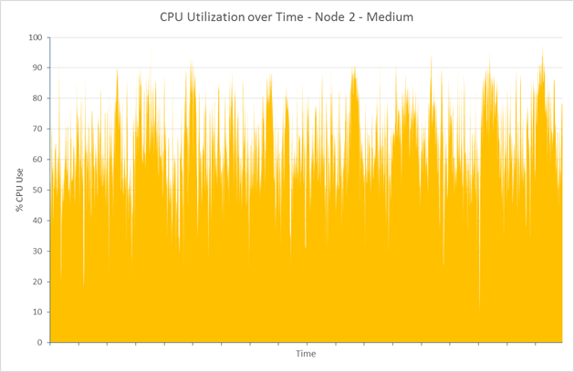
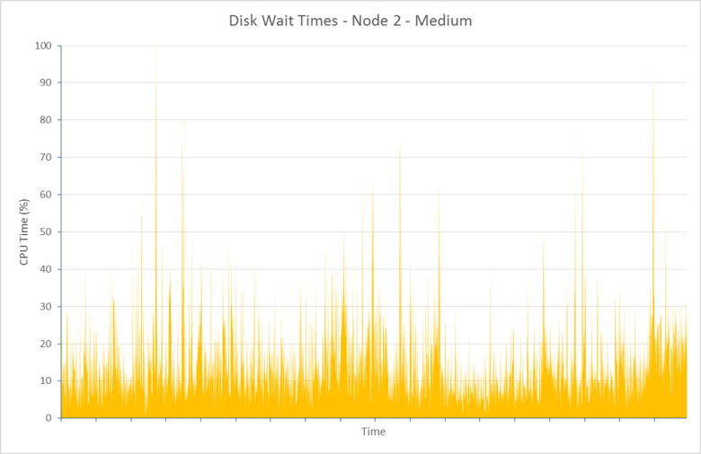
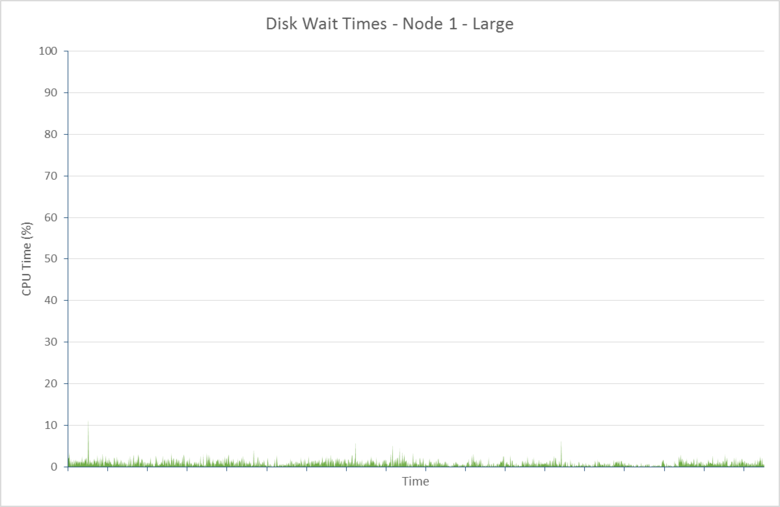
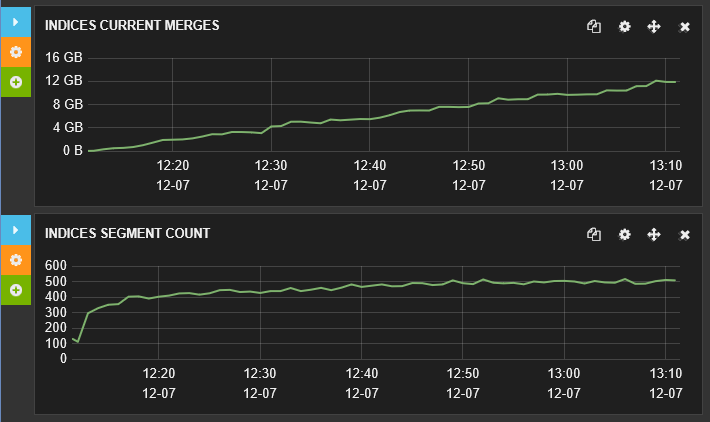
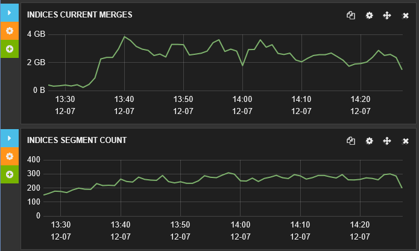

<properties
   pageTitle="Réglage des performances de réception de données pour Elasticsearch sur Azure | Microsoft Azure"
   description="Comment optimiser les performances de réception de données avec Elasticsearch sur Azure."
   services=""
   documentationCenter="na"
   authors="dragon119"
   manager="bennage"
   editor=""
   tags=""/>

<tags
   ms.service="guidance"
   ms.devlang="na"
   ms.topic="article"
   ms.tgt_pltfrm="na"
   ms.workload="na"
   ms.date="09/22/2016"
   ms.author="masashin"/>

# <a name="tuning-data-ingestion-performance-for-elasticsearch-on-azure"></a>Réglage des performances de réception de données pour Elasticsearch sur Azure

[AZURE.INCLUDE [pnp-header](../../includes/guidance-pnp-header-include.md)]

Cet article fait [partie d’une série](guidance-elasticsearch.md). 

## <a name="overview"></a>Vue d’ensemble

Un aspect important lors de la création d’une base de données de recherche consiste à déterminer la meilleure façon de structure du système pour les données que vous pourrez recherches d’acquisition rapidement et efficacement. Les considérations qui l’entoure cette exigence ne concernent pas seulement le choix de l’infrastructure sur lequel vous implémentez le système, mais également les optimisations différentes que vous pouvez utiliser pour vous assurer que le système peut maintenir le contrats de niveau de flux de données. 

Ce document décrit les options de déploiement et la configuration que vous devez prendre en compte pour implémenter un cluster Elasticsearch qui attend un taux élevé de réception de données. Pour fournir des données unies à titre d’exemple, ce document présente également les résultats de l’évaluation des configurations différentes à l’aide d’une charge de travail de réception de données volumineux simple. Les détails de la charge de travail sont décrites dans l' [appendice](#appendix-the-bulk-load-data-ingestion-performance-test) à la fin de ce document.

L’objectif de référence a été ne pas pour générer les chiffres de performances absolues pour l’exécution de Elasticsearch ou même à recommander une topologie particulier, mais préférez afin d’illustrer les méthodes que vous pouvez utiliser pour évaluer les performances, dimensionnement des nœuds de données et mise en œuvre clusters répondant à vos besoins de performances. 

Lorsque vos propres systèmes de dimensionnement, il est important de tester les performances de détail en fonction de vos propres charges de travail. Rassemblez télémétrie qui vous permet d’obtenir des informations sur la configuration matérielle optimale à utiliser et les facteurs d’échelle horizontales que vous devez prendre en compte. En particulier, vous devez :

- Pensez à la taille de la charge utile envoyée et pas seulement le nombre d’éléments dans chaque demande d’insertion en bloc. Un petit nombre d’éléments de grande taille en bloc dans chaque demande peut être plus efficace qu’un grand nombre, en fonction de la ressource disponible pour traiter chaque requête.

Vous pouvez surveiller l’impact des variations de la demande d’insertion en bloc à l’aide de [Marvel](https://www.elastic.co/products/marvel), à l’aide de la *readbytes*/e/s*writebytes* compteurs avec [JMeter](https://jmeter.apache.org/), et outils de système d’exploitation comme *iostat* et *vmstat* sur Ubuntu. 

- Effectuer des tests de performances et collecte de télémétrie à mesure du processeur et e/s temps d’attente, latence de disque, débit et du traitement des temps de réponse. Ces informations peuvent vous aider à identifier les éventuels goulots et évaluer les coûts et les avantages de l’utilisation du stockage premium. N’oubliez pas que l’utilisation du processeur et de disque ne peut-être même sur tous les nœuds selon la façon dont dans lequel les milieu des fragments et réplicas sont réparties sur le cluster (certains nœuds peuvent contenir plus milieu des fragments supérieurs aux autres).

- Essayez du nombre de demandes simultanées pour votre charge de travail est distribué à travers le cluster en évalue l’impact de l’utilisation de différents nombres de nœuds pour gérer cette charge de travail.

- Prendre en compte comment les charges de travail peuvent agrandir accompagner la croissance de l’entreprise. Évaluer l’impact de cette croissance sur les coûts des machines virtuelles et du stockage utilisé par les nœuds.

- Reconnaissent que peut être plus économique d’à l’aide d’un cluster avec un grand nombre de nœuds avec disques normales si votre scénario requiert un grand nombre de requêtes et de l’infrastructure de disque conserve débit répondant à vos services accords niveau (). Toutefois, augmenter le nombre de nœuds peut introduire charge, sous la forme de communications nœuds entre supplémentaires et la synchronisation.

- Comprendre qu’un nombre plus élevé de cœurs par nœud peut générer davantage de trafic disque plusieurs documents peuvent être traités. Mesurez dans ce cas, l’utilisation du disque afin de déterminer si le sous-système e/s peut devenir une critique et déterminer les avantages de l’utilisation du stockage premium.

- Tester et analyser les compromis avec un plus grand nombre de nœuds avec cœurs moins par rapport à moins de nœuds avec plus de cœurs. N’oubliez pas que l’augmentation du nombre de réplicas transmet les demandes de sur le cluster et peut-être nécessiter vous permet d’ajouter des nœuds.

- Prendre en compte que l’utilisation de disques éphémères peut nécessiter qu’index doivent être récupérés plus fréquemment.

- Mesurez l’utilisation du volume de stockage afin d’évaluer la capacité et sous utilisation du stockage. Par exemple, dans notre scénario, nous avons stocké 1,5 milliards de documents à l’aide de stockage 350 Go.

- Mesurer le taux de transfert pour vos charges de travail et en considération combien vous êtes susceptible d’accéder à la limite de transfert d’e/s taux total pour tous les comptes de stockage donnée dans lequel vous avez créé des disques virtuels.

## <a name="node-and-index-design"></a>Conception nœud et index

Dans un système qui doit prendre en charge réception de données de grande taille, vous posez les questions suivantes :

- **Sont les données se déplacent rapidement ou relativement statiques ?** Plus dynamique les données, plu la mise à jour aérienne pour Elasticsearch. Si les données sont répliquées, chaque réplica est conservée synchrone. Mouvement rapide des données qui contient uniquement une durée de vie limitée ou qui peut être recréé facilement bénéficier de désactivation de la réplication complètement. Cette option est décrite dans la section [réglage réception de données de grande taille.](#tuning-large-scale-data-ingestion)

- **Comment à jour avez-vous besoin les données découvertes en effectuant une recherche à être ?** Pour maintenir des performances, Elasticsearch tampons autant de données en mémoire que possible. Cela signifie que toutes les modifications sont immédiatement disponibles pour les demandes de recherche. Elasticsearch utilise pour conserver les modifications et les rendre visible le processus est décrite dans [Effectuer les modifications permanente](https://www.elastic.co/guide/en/elasticsearch/guide/current/translog.html#translog). 

    Les données de taux devient visibles est régi par le *Actualiser\_intervalle* définition de l’index pertinent. Par défaut, cet intervalle est défini à 1 seconde. Toutefois, pas toutes les situations requiert actualisations cela rapidement. Par exemple, index l’enregistrement de données du journal devrez faire face à un flux rapide et continue des informations qui devant être ingérée rapidement, mais ne nécessitent pas les informations soient immédiatement disponibles pour les requêtes. Dans ce cas, envisagez de réduire la fréquence des mises à jour. Cette fonctionnalité est également décrite dans la section [réglage réception de données de grande taille.](#tuning-large-scale-data-ingestion)

- **Est la rapidité avec laquelle les données susceptibles de croissance ?** Capacité index est déterminée par le nombre de milieu des fragments spécifié lors de la création de l’index. Pour permettre la croissance, spécifiez un nombre adéquat de milieu des fragments (la valeur par défaut est cinq). Si l’index est créé sur un seul nœud, tous les cinq milieu des fragments seront situées sur ce nœud, mais que le volume de données se développe supplémentaire nœuds peuvent être ajoutés et Elasticsearch distribue dynamiquement milieu des fragments sur les nœuds. Toutefois, chaque éclater a une surcharge. Toutes les recherches dans un index interrogent milieu des fragments toutes les, afin de créer un grand nombre de milieu des fragments pour une petite quantité de données peut ralentir les extractions de données (évitez le scénario [milieu des fragments Kagillion](https://www.elastic.co/guide/en/elasticsearch/guide/current/kagillion-shards.html) ).

    Certaines charges de travail (par exemple, journalisation) peuvent créer un nouvel index chaque jour, et si vous constatez que le nombre de milieu des fragments est insuffisant pour le volume de données, vous devez le modifier avant de créer l’index suivant (index existants ne sont pas affectés). Si vous devez distribuer des données existantes sur milieu des fragments plus, une option consiste à réindexer les informations. Créer un nouvel index avec la configuration appropriée et copiez les données. Ce processus peut être transparente aux applications à l’aide des [alias d’index](https://www.elastic.co/guide/en/elasticsearch/reference/current/indices-aliases.html).

- **Données doit-il sera réparti entre les utilisateurs dans un scénario de multitenancy ?** Vous pouvez créer des index distinctes pour chaque utilisateur, mais cela peut être coûteux si chaque utilisateur possède uniquement une quantité moyenne de données. À la place, envisager de créer [à partir d’index partagé](https://www.elastic.co/guide/en/elasticsearch/guide/current/shared-index.html) et utilisez [alias basé sur des filtres](https://www.elastic.co/guide/en/elasticsearch/guide/current/faking-it.html) pour diriger les requêtes vers les données par utilisateur. Pour conserver les données d’un utilisateur simultanément la même éclater, ignorer la configuration du routage par défaut pour les données d’index et itinéraire en fonction de certains attribut d’identification de l’utilisateur.

- **Sont les données courtes ou longues ?** Si vous utilisez un ensemble de machines virtuelles Azure pour implémenter un cluster Elasticsearch, vous pouvez stocker des données éphémères sur un disque de système de ressources locales plutôt qu’un lecteur connecté.
À l’aide d’un SKU VM qui utilise un SSD pour le disque de la ressource peut améliorer les performances. Toutefois, toutes les informations conservées sur le disque de la ressource sont temporaires et peuvent être perdues si la machine virtuelle redémarre (voir la section lorsque les données sur un temporaire lecteur être perdues à [comprendre le lecteur temporaire Microsoft Azure machines virtuelles en fonctionnement](http://blogs.msdn.com/b/mast/archive/2013/12/07/understanding-the-temporary-drive-on-windows-azure-virtual-machines.aspx) pour plus d’informations). Si vous avez besoin de conservation des données entre chaque redémarrage, créer des disques de données pour stocker ces informations et associez-les à la machine virtuelle.

- **Comment actives sont les données ?** Disques durs virtuels Azure sont couvertes par la limitation si la quantité d’activité en lecture/écriture dépasse paramètres spécifiés (actuellement 500 entrées/sorties par seconde (sorties par) pour un disque connecté à un ordinateur virtuel couche Standard et sorties 5000 par pour un disque de stockage Premium). 

    Pour réduire les risques de limitation et améliorer les performances, envisagez de créer plusieurs disques de données pour chaque machine virtuelle et configurez Elasticsearch pour enregistrer les données sur ces disques comme indiqué dans le [disque et le fichier requise](guidance-elasticsearch-running-on-azure.md#disk-and-file-system-requirements).

    Vous devez sélectionner une configuration matérielle qui permet de réduire le nombre d’opérations de lecture en veillant à ce que suffisamment de mémoire est disponible en cache fréquemment des données d’e/s. Cela est décrit dans la section [Configuration requise de la mémoire](guidance-elasticsearch-running-on-azure.md#memory-requirements) de Elasticsearch en cours d’exécution sur Azure.

- **Quels types de charge de travail chaque nœud doit prendre en charge ?** Elasticsearch avantages d’avoir de mémoire disponible pour le cache des données dans (sous la forme du cache du système de fichiers) et pour le segment machine virtuelle Java comme décrit dans la section [Configuration requise de la mémoire](guidance-elasticsearch-running-on-azure.md#memory-requirements) de Elasticsearch en cours d’exécution sur Azure. 

    La quantité de mémoire, le nombre de cœurs du processeur et la quantité de disques disponibles sont définies par la référence (SKU) de la machine virtuelle. Pour plus d’informations, voir [Tarifs Machines virtuelles](http://azure.microsoft.com/pricing/details/virtual-machines/) sur le site Web Azure.

### <a name="virtual-machine-options"></a>Options de machine virtuelle

Vous pouvez configurer des ordinateurs virtuels dans Azure à l’aide d’un nombre de références SKU autre. Les ressources disponibles pour une machine virtuelle Azure dépendent de référence (SKU) sélectionné. Chaque référence (SKU) offre une autre combinaison de cœurs, mémoire et de stockage. Vous devez sélectionner une taille appropriée de machine virtuelle qui gérera la charge de travail, mais qui s’avère également économique.
Commencer avec une configuration répondant à vos exigences actuelles (exécuter comparative pour tester, comme décrit plus loin dans ce document). Vous pouvez ajuster ultérieurement un cluster en ajoutant davantage d’ordinateurs virtuels Elasticsearch nœuds en cours d’exécution.

[Formats pour les Machines virtuelles](../virtual-machines/virtual-machines-linux-sizes.md) sur le site Web Azure documents différentes options et références SKU disponibles pour les machines virtuelles.

Vous devez faire correspondre la taille et les ressources d’un ordinateur virtuel pour le rôle qui effectue des nœuds en cours d’exécution sur l’ordinateur virtuel.

Pour un nœud de données :

- Allouer jusqu'à 30 Go ou 50 % de la mémoire RAM disponible pour Java de segment, selon ce qui est la plus faible. Conservez le reste du système d’exploitation à utiliser pour la mise en cache des fichiers. Si vous utilisez Linux, vous pouvez spécifier la quantité de mémoire à allouer au segment Java en définissant la ES\_segment\_variable d’environnement taille avant d’exécuter Elasticsearch. Par ailleurs, si vous utilisez Windows ou Linux, vous pouvez prévoir la taille de la mémoire avec les paramètres *Xmx* et *Xms* lorsque vous démarrez Elasticsearch.

    Selon la charge de travail, moins machines virtuelles volumineux peuvent ne pas être aussi efficaces pour performances comme à l’aide d’un grand nombre de machines virtuelles taille moyenne. Vous devez effectuer des tests mesurant les compromis entre l’augmentation du trafic réseau et la maintenance impliquées et les coûts d’augmenter le nombre de cœurs disponibles et les conflits de disque réduit sur chaque nœud.

- Utilisez le stockage premium pour le stockage de données Elasticsearch. Cela est décrit plus en détail dans la section [options de stockage](#storage-options) .

- Utiliser plusieurs disques du mêmes taille et répartition des données sur ces disques. La référence (SKU) de vos ordinateurs virtuels détermine le nombre maximal de disques de données que vous pouvez joindre. Pour plus d’informations, voir configuration [requise de disque et le fichier](guidance-elasticsearch-running-on-azure.md#disk-and-file-system-requirements).

- Utiliser une référence SKU processeur multi-core avec au moins 2 cœurs, préférence 4 ou plus. 

Pour un nœud client :

- Affectez pas du stockage de disque pour les données Elasticsearch, clients dédiés ne stockent pas les données sur le disque.

- Vérifiez que la mémoire adéquate est disponible pour gérer les charges de travail. Demandes d’insertion en bloc sont lues en mémoire avant les données envoyées à différents nœuds de données et les résultats des agrégations et des requêtes sont cumulées en mémoire avant d’être renvoyé à l’application cliente. Évaluer votre propre charges de travail et surveiller l’utilisation de la mémoire à l’aide d’un outil comme Marvel ou les [informations de la machine virtuelle Java](https://www.elastic.co/guide/en/elasticsearch/guide/current/_monitoring_individual_nodes.html#_jvm_section) renvoyé à l’aide du *nœud/statistiques* API (`GET _nodes/stats`) pour évaluer les exigences optimales.  En particulier, surveiller le *segment\_utilisé\_pourcentage* métrique pour chaque nœud et objectif pour conserver la taille de segment inférieures à 75 % de l’espace disponible.

- Vérifiez que suffisamment cœurs d’UC sont disponibles pour recevoir et traiter le volume attendu de requêtes.
Demandes sont en attente comme elles sont reçues avant traitement, et le volume des articles qui peuvent être mis en attente est une fonction du nombre de cœurs d’UC sur chaque nœud. Vous pouvez surveiller les files d’attente en utilisant les données dans les [informations du pool](https://www.elastic.co/guide/en/elasticsearch/guide/current/_monitoring_individual_nodes.html#_threadpool_section) retournées à l’aide de l’API nœud/statistiques. 

    Si le nombre *rejeté* pour une file d’attente indique que les demandes sont refusées, cela signifie que le cluster commence à goulot d’étranglement. Cela peut être dû à la bande passante processeur, mais peut également être dû à d’autres facteurs tels qu’un manque de mémoire ou de baisse des performances d’e/s, afin d’utiliser ces informations en association avec les autres statistiques pour aider à déterminer l’origine du problème.

    Nœuds client peuvent être ou non nécessaires, en fonction de vos charges de travail. Charges de travail données réception tendent à ne pas bénéficier de l’utilisation de clients dédiés, alors que certaines recherches et les agrégations peuvent s’exécuter plus rapidement. Préparez-vous à évaluer vos propres scénarios.

    Les nœuds clients sont principalement utiles pour les applications qui utilisent l’API de Client Transport pour vous connecter au cluster. Vous pouvez également utiliser l’API Client nœud qui crée dynamiquement un client dédié pour l’application, en utilisant les ressources de l’environnement d’application hôte. Si vos applications utilisent l’API de Client nœud, il peut ne pas être nécessaire pour que votre cluster contiennent des nœuds préconfigurés client dédié. 
    
    Toutefois, n’oubliez pas qu’un nœud créé à l’aide de l’API de nœud Client est un membre de première classe du cluster et en tant que tel participe à la chatter réseau avec d’autres nœuds. Forum démarrer et arrêter les nœuds clients peuvent créer bruit inutile pour l’ensemble du cluster.

Pour un nœud maître :

- Affectez pas du stockage de disque pour les données Elasticsearch, nœuds maîtres dédiés ne pas stockent des données sur disque.

- Configuration requise du processeur doit être minimale.

- Besoins en mémoire dépendent de la taille du cluster. Informations sur l’état du cluster sont conservées en mémoire. Pour les petits groupes la quantité de mémoire requise est minime, mais pour un cluster de grande taille, très actif où index sont créés fréquemment et milieu des fragments déplacement, la quantité d’informations sur l’état peut augmenter considérablement la taille. Contrôler la taille de segment machine virtuelle Java pour déterminer si vous avez besoin ajouter plus de mémoire.

> [AZURE.NOTE]Pour la fiabilité cluster, toujours créer plusieurs nœuds maîtres pour et configurer les nœuds restants pour éviter la possibilité d’un avis de brain fractionnement se produisant. Dans l’idéal, il doit être un nombre de nœuds maîtres impair. Cette rubrique décrit plus en détail dans [configuration résilience et récupération sur Elasticsearch sur Azure][].

### <a name="storage-options"></a>Options de stockage

Un nombre d’options de stockage sont disponibles sur les ordinateurs de virtuels Azure avec différents compromis affecter les coûts, performances, la disponibilité et récupération que vous devez prendre en considération avec soin.

Notez que vous devez stocker des données Elasticsearch sur disques de données dédié.  Cela vous aidera à réduire les conflits avec le système d’exploitation et vérifiez que les volumes importants d’e/s Elasticsearch concurrence pas avec les fonctions de système d’exploitation pour les ressources e/s.

Disques Azure sont à des contraintes de performance. Si vous constatez qu’un cluster est soumis périodiques Records d’activité requêtes peuvent être limitées. Pour éviter ce problème, réglez votre conception pour équilibrer la taille du document dans Elasticsearch contre le volume de requêtes susceptibles d’être reçue par chaque disque.

Disques basés sur le stockage standard prennent en charge un taux maximale d’une demande de sorties 500 par alors que disques basés sur le stockage premium peuvent fonctionner à sorties par jusqu'à 5 000, selon la taille des disques de données. Disques de stockage Premium sont uniquement disponibles pour la série DS et GS de machines virtuelles. Pour trouver le disque maximal sorties par en taille de mémoire virtuelle, voir [formats pour les machines virtuelles dans Azure](../virtual-machines/virtual-machines-linux-sizes.md). Performances sur le stockage premium sont déterminé par la taille de la mémoire virtuelle avec allocation de taille de disque. Pour plus d’informations, voir [stockage Premium : stockage High Performance pour charges de travail Azure Machine virtuelle](../storage/storage-premium-storage.md).

**Disques de données permanente**

Données permanente disques sont durs sauvegardées par le stockage Azure. Si la machine virtuelle doit être recréés après une défaillance majeure, disques durs virtuels existantes peuvent être facilement reliées à la nouvelle machine virtuelle. Disques durs virtuels peuvent être créés en fonction de stockage standard (tournant media) ou stockage premium (SSDs). Si vous souhaitez utiliser SSDs, vous devez créer des ordinateurs virtuels à l’aide de la série DS ou mieux. Machines DS le même prix que les ordinateurs virtuels D série équivalents, mais vous êtes chargé supplémentaires pour l’utilisation du stockage premium.

Dans les cas où la vitesse de transfert par disque est insuffisante pour prendre en charge la charge de travail, envisagez de créer soit plusieurs disques de données et autorisez Elasticsearch pour [Enregistrer les données sur ces disques](guidance-elasticsearch-running-on-azure.md#disk-and-file-system-requirements)ou implémenter niveau système [RAID 0 répartition à l’aide de disques virtuels](../virtual-machines/virtual-machines-linux-configure-raid.md).

> [AZURE.NOTE]Expérience au sein de Microsoft a montré qu’à l’aide de RAID 0 est particulièrement utile pour les effets d’e/s de lissage *spiky* charges de travail qui génèrent fréquents Records d’activité.

Premium utiliser localement redondante (ou localement redondants pour gamme ou charges de travail dans q & a) espace de stockage pour le compte de stockage en maintenant les disques ; réplication dans les zones géographiques et zones n’est pas nécessaire de disponibilité Elasticsearch. 

**Disques éphémères**

À l’aide de disques permanentes basées sur SSDs requiert la création d’ordinateurs virtuels qui prennent en charge le stockage premium. Cela a une implication de prix. L’utilisation du disque local éphémère pour conserver les données Elasticsearch peut être une solution rentable pour les nœuds taille moyenne nécessitant jusqu'à environ 800 Go de stockage. Dans la série Standard-D de machines virtuelles, disques éphémères sont implémentées à l’aide de SSDs qui fournissent des performances beaucoup plus élevées et quantité latence inférieure disques ordinaires

Lorsque vous utilisez Elasticsearch, les performances peuvent être équivalent à l’utilisation du stockage premium sans entraîner le coût : consultez la section [problèmes de latence de disque adressage](#addressing-disk-latency-issues) pour plus d’informations.

La taille de la machine virtuelle limite la quantité d’espace disponible dans le stockage éphémère comme décrit dans le billet de blog [Attentes de Performance série D](https://azure.microsoft.com/blog/d-series-performance-expectations/).

Par exemple, une norme\_machine virtuelle D1 fournit 50 Go de stockage éphémère, une norme\_machine virtuelle D2 a 100 Go de stockage éphémère et une norme\_machine virtuelle D14 fournit 800 Go d’espace éphémère. Pour les clusters où les nœuds requièrent uniquement cette quantité d’espace, à l’aide d’une machine virtuelle série D avec stockage éphémère peut être rentable.

Vous devez régler le débit accru disponible avec stockage éphémère par rapport à l’heure et les coûts liés à la récupération de ces données après redémarrage de l’ordinateur. Le contenu du disque éphémère est perdu si la machine virtuelle est déplacée vers un serveur hôte différent, si l’hôte est mis à jour, ou si l’hôte rencontre une défaillance matérielle. Si les données lui-même ont une durée de vie limitée cette perte de données n’est peut-être pas autorisée. Données être changées, il est possible de recréer un index ou récupérer les informations manquantes à partir d’une sauvegarde. Il est possible de réduire le risque de perte de l’utilisation de duplications conservées sur d’autres machines virtuelles.

> [AZURE.NOTE]N’utilisez pas un **seul** ordinateur virtuel pour stocker les données de production critiques. Si le nœud échoue, toutes les données n’est pas disponible. Pour plus d’informations critiques, assurez-vous que les données sont répliquées sur au moins un autre nœud.

**Fichiers Azure**

Le [Service de fichiers Azure](http://blogs.msdn.com/b/windowsazurestorage/archive/2014/05/12/introducing-microsoft-azure-file-service.aspx) offre un accès de fichier partagé à l’aide de stockage Azure. Vous pouvez créer des partages de fichiers que vous pouvez monter puis sur machines virtuelles Azure. Machines virtuelles plusieurs peuvent monter le même partage de fichiers, leur permettant d’accéder aux données mêmes.

Pour des raisons de performances, il n'est pas recommandé que vous utilisez partages de fichiers pour contenant des données Elasticsearch ne sont pas besoin d’être partagé entre les nœuds, disques de données régulières sont plus adaptés à cet effet. Partages de fichiers peuvent être utilisées pour créer des Elasticsearch [index réplica secondaires](https://www.elastic.co/guide/en/elasticsearch/reference/current/indices-shadow-replicas.html). Toutefois, cette fonctionnalité est actuellement expérience et ne doit pas être implémentée dans un environnement de production pour le moment. Pour cette raison, index secondaires ne sont pas considérées plus en détail dans ce guide.

**Options de réseau**

Azure met en œuvre un schéma de réseau partagé. Machines virtuelles utilisant le même matériel racks compétition pour les ressources réseau. Par conséquent, la bande passante réseau disponibles peut varier en fonction de l’heure du jour et la journalière cycle de travail en cours d’exécution sur machines virtuelles partage la même infrastructure réseau physique. Vous avez peu de contrôle sur ces facteurs. Il est important de comprendre que les performances du réseau sont susceptible de varier au fil du temps, donc définie en conséquence attentes des utilisateurs.

## <a name="scaling-up-nodes-to-support-large-scale-data-ingestion"></a>Mise à l’échelle des nœuds pour prendre en charge de la réception de données de grande taille

Vous pouvez créer clusters Elasticsearch à l’aide de matériel raisonnablement modéré et puis évoluer ou évoluer que le volume de données se développe et augmente le nombre de requêtes. Avec Azure, vous échelle à distance en exécutant sur machines virtuelles plus grands et plus chers, ou vous pouvez horizontale à l’aide supplémentaires machines virtuelles plus petites et plus économique. 

Vous pouvez également effectuer une combinaison de deux stratégies. Il n’existe aucune solution unique pour tous les scénarios, afin d’évaluer la meilleure approche pour toute situation donnée, que vous devez être souscrire un performances série teste.

Cette section concerne l’approche échelle en haut, l’évolution horizontale est décrite dans la section [Ajouter : conclusions](#scaling-out-conclusions).
Cette section décrit les résultats d’une série de tests d’évaluation qui ont été effectuées par rapport à un ensemble de clusters Elasticsearch contenant des machines virtuelles de différentes tailles. Les groupes ont été désignés en tant que petite, moyenne et grands. Le tableau suivant résume les ressources affectées aux ordinateurs virtuels dans chaque cluster.

| Cluster | MACHINE VIRTUELLE RÉFÉRENCE (SKU)      | Nombre de cœurs | Nombre de disques de données | RAM  |
|---------|-------------|-----------------|----------------------|------|
| MINUSCULE   | D2 standard | 2               | 4                    | 7 GO  |
| Moyenne  | D3 standard | 4               | 8                    | 14 GO |
| Grande taille   | D4 standard | 8               | 16                   | 28 GO |

Chaque cluster Elasticsearch contenait 3 nœuds de données. Les nœuds de ces données traitées demandes des clients ainsi que de traitement de gestion des données. Nœuds clients distincts ont été pas utilisés, car elles proposées peu d’intérêt pour le scénario de réception de données utilisé par les tests. Le cluster contenait également trois nœuds maîtres, d'entre eux a été choisi par Elasticsearch pour coordonner le cluster.

Les tests ont été effectuées à l’aide de Elasticsearch 1.7.3. Les tests ont été effectuées initialement sur clusters exécutant Ubuntu Linux 14.0.4 et puis répétées à l’aide de Windows Server 2012. Les détails de la charge de travail effectuée par les tests sont décrites dans l' [appendice](#appendix-the-bulk-load-data-ingestion-performance-test).

### <a name="data-ingestion-performance--ubuntu-linux-1404"></a>Performances de réception des données – Ubuntu Linux 14.0.4

Le tableau suivant résume les résultats de l’exécution des tests de deux heures pour chaque configuration :

| Configuration | Nombre d’échantillons | Temps de réponse moyen (ms) | Débit (opérations/s) |
|---------------|--------------|----------------------------|---------------------------|
| MINUSCULE         | 67057        | 636                        | 9.3                       |
| Moyenne        | 123482       | 692                        | 17.2                      |
| Grande taille         | 197085       | 839                        | 27.4                      |

Le débit et le nombre d’échantillons traitement pour les trois configurations sont dans le rapport approximatif 1:2:3. Toutefois, les ressources disponibles en termes de mémoire cœurs du processeur et des disques ont du rapport 1:2:4. Il a été jugé est conseillé de rechercher les détails des performances faisceau des nœuds dans le cluster pour évaluer la raison pour laquelle il peut s’agir de la casse. Ces informations peuvent vous aider à déterminer s’il existe des limites de l’évolution et il peut être préférable à prendre en considération l’évolution horizontale. 

### <a name="determining-limiting-factors-network-utilization"></a>Facteurs déterminant limitation : utilisation du réseau

Elasticsearch dépendant sur la présence d’une bande passante réseau suffisante pour prendre en charge le flux des demandes des clients, ainsi que les informations de synchronisation entre les nœuds du cluster. En surbrillance plus tôt, vous avez limité de contrôle sur la disponibilité de bande passante, qui dépend de plusieurs variables telles que le centre de données utilisés et la charge réseau d’autres ordinateurs virtuels partage la même infrastructure réseau. Toutefois, il est toujours intéressant d’examiner l’activité du réseau pour chaque cluster afin de vérifier que le volume de trafic n’est pas excessif. Le graphique ci-dessous présente une comparaison du trafic réseau reçu par le nœud 2 dans chacune des groupes (les volumes pour les autres nœuds dans chaque cluster était très similaire).


Le moyen d’octets reçu par seconde pour le nœud 2 dans chaque configuration cluster pendant la période de deux heures ont été comme suit :

| Configuration | Nombre moyen d’octets reçus/s |
|---------------|--------------------------------------|
| MINUSCULE         | 3993640.3                            |
| Moyenne        | 7311689.9                            |
| Grande taille         | 11893874.2                           |

Les tests ont été effectués alors que le système a été exécuté en **état stable**. Dans les situations où indexer rééquilibrage ou nœud récupération est en cours, transmission des données entre les nœuds maintenant principal et milieu des fragments réplica peut générer un trafic réseau significatif. Les effets de ce processus sont décrites plus dans le document [configuration résilience et récupération sur Elasticsearch sur Azure][].

### <a name="determining-limiting-factors-cpu-utilization"></a>Facteurs déterminant limitation : utilisation de l’UC

Taux de traitement des demandes sont est au moins partiellement régi par la capacité de traitement disponible. Elasticsearch accepte les demandes d’insertion en bloc sur le gros insérer file d’attente. Chaque nœud possède un ensemble de bloc insérer files d’attente déterminés par le nombre de processeurs disponibles. Par défaut, il existe une file d’attente pour chaque processeur et chaque file d’attente jusqu'à 50 demandes en attente avant qu’ils commenceront à être rejeté. 

Applications doivent envoyer des demandes à un taux qui n’entraîne pas les files d’attente à overspill. Le nombre d’éléments dans chaque file d’attente à un moment donné va agir en fonction du taux auquel les demandes sont envoyés par les applications clientes et la fréquence à laquelle ces mêmes requêtes sont récupérées et traitées par Elasticsearch. Pour cette raison, une statistique importantes capturé ce qui concerne le taux d’erreur répertoriés dans le tableau suivant.

| Configuration | Nombre total d’exemples | Nombre d’erreurs  | Taux d’erreur |
|---------------|---------------|--------------|------------|
| MINUSCULE         | 67057         | 0            | 0,00 %      |
| Moyenne        | 123483        | 1            | 0.0008 %    |
| Grande taille         | 200702        | 3617         | 1,8 %      |

Chacune de ces erreurs a été due à l’exception de Java suivante :

```
org.elasticsearch.action.support.replication.TransportShardReplicationOperationAction$PrimaryPhase$1@75a30c1b]; ]
[219]: index [systembase], type [logs], id [AVEAioKb2TRSNcPa_8YG], message [RemoteTransportException[[esdatavm2][inet[/10.0.1.5:9300]][indices:data/write/bulk[s]]]; nested: EsRejectedExecutionException[rejected execution (queue capacity 50)
```

Augmenter le nombre de files d’attente et/ou la longueur de chaque file d’attente peut-être réduire le nombre d’erreurs, mais cette approche peut gérer uniquement les rupture de courte durée. Cette opération pendant l’exécution d’une série de tâches de réception de données prolongée sera retardé simplement le point auquel erreurs commencer se produisant. Par ailleurs, cette modification améliore pas le débit et probablement de nuire le temps de réponse des applications clientes comme demandes seront mises en attente pour plus avant d’être traité.

La structure d’index par défaut de 5 milieu des fragments de résultats de (10 milieu des fragments dans l’ensemble), 1 réplica dans une petite mauvaise répartition de charge entre les nœuds dans un cluster, deux nœuds contient trois milieu des fragments tandis que l’autre nœud contiendra quatre. Le nœud le plus occupé est très probablement lié à l’élément qui limite débit le meilleur, c’est pourquoi ce nœud a été activée dans chaque cas. 

L’ensemble de graphiques suivant illustrent l’utilisation du processeur pour le nœud le plus occupé dans chaque cluster.





Pour les petites, moyennes et clusters de grande taille, la moyenne de l’UC pour ces nœuds a été 75.01 %, 64.93 % et 64.64 %. Rarement signifie utilisation réellement atteint 100 %, et l’utilisation du supprime en tant que la taille des nœuds et les augmentations de disponible power UC disponibles. Puissance de l’UC n’est donc probablement pas un facteur limitant les performances du cluster volumineux.

### <a name="determining-limiting-factors-memory"></a>Facteurs déterminant limitation : mémoire

Utilisation de la mémoire est un autre aspect important qui peut influencer les performances. Pour les essais, Elasticsearch a été attribué à 50 % de la quantité de mémoire disponible. Il s’agit aligné sur le [présentées recommandations](https://www.elastic.co/guide/en/elasticsearch/guide/current/heap-sizing.html#_give_half_your_memory_to_lucene). Tandis que les tests ont été en cours d’exécution, la machine virtuelle Java a été contrôlé pour l’activité de collection de sites garbage excès (une indication de manque de mémoire de segment). Dans tous les cas, la taille du segment a été stable et la machine virtuelle Java exposés activité de collection de sites garbage faible. La capture d’écran ci-dessous montre un instantané de Marvel, mise en surbrillance de la touche statistiques machine virtuelle Java pour une période courte pendant l’exécution de test sur le cluster de grande taille.


***Machine virtuelle Java mémoire et garbage collection l’activité sur le cluster de grande taille.***

### <a name="determining-limiting-factors-disk-io-rrates"></a>Facteurs déterminant limitation : disque rRates e/s

La fonctionnalité physique restante sur le côté serveur qui peut-être limiter les performances est les performances du disque sous-système e/s. Le graphique ci-dessous compare l’activité du disque en termes d’octets écrites pour les nœuds plus chargées dans chaque cluster.

 

Le tableau suivant indique les octets moyennes écrits par seconde pour chaque configuration cluster pendant la période de deux heures nœud 2 :

| Configuration | Nombre moyen d’octets écrits/sec |
|---------------|-------------------------------------|
| MINUSCULE         | 25502361.94                         |
| Moyenne        | 48856124.5                          |
| Grande taille         | 88137675.46                         |

Le volume de données écrites augmente avec le nombre de requêtes traitées par un cluster, mais que le taux d’e/s sont dans les limites de stockage Azure (disques créés à l’aide de stockage Azure prend en charge un taux prolongée 10 s à 100 s de Mo/s, selon que le stockage Standard ou Premium est utilisé). Examiner l’intervalle de temps passé en attente d’e/s disque contribue à expliquer pourquoi le débit du disque est largement inférieur au maximum théorique. Les graphiques et le tableau ci-dessous affichent ces statistiques pour les trois nœuds de mêmes :

> [AZURE.NOTE]Le délai d’attente disque est mesuré en contrôlant le pourcentage de temps processeur pendant laquelle processeurs bloqués en attente pour les opérations d’e/s terminer.





| Configuration | Moyenne disque attendre temps processeur (%) |
|---------------|--------------------------------|
| MINUSCULE         | 21.04                          |
| Moyenne        | 14.48                          |
| Grande taille         | 15.84                          |

Ces données indiquent qu’une proportion significative du temps UC (entre environ 16 % et 21 %) est passé à attendre l’e/s disque terminer. Ceci est limiter la capacité de Elasticsearch pour traiter les demandes et stocker des données.

Pendant le test, le cluster grand inséré plus de **cinq cent millions de documents**. Autoriser le test continuer a montré que temps d’attente augmenté de manière significative lorsque la base de données contenus six cent millions documents. Les raisons de ce comportement ont été pas entièrement soumis à l’enquête, mais peut être en raison de disque fragmentation à l’origine de latence accrues de disques. 

Augmenter la taille du cluster sur plusieurs nœuds peut-être vous aider à atténuer les effets de ce comportement. Dans certains cas, il peut être nécessaire défragmenter un disque qui est montrant un excès d’e/s. Toutefois, défragmentation d’un disque de grande taille peut prendre un temps considérable (éventuellement plus de 48 heures pour un lecteur de disque dur virtuel 2 To), et il vous suffit reformater le disque et en autorisant Elasticsearch récupérer les données manquantes du milieu des fragments réplica peuvent être une approche plus économique.

### <a name="addressing-disk-latency-issues"></a>Résoudre les problèmes de latence disque

Les tests ont été initialement effectuées à l’aide de machines virtuelles configurés avec des disques standards. Un disque standard est basé sur tournant multimédia et par conséquent est soumis à latence de rotation et autres engorgements qui peuvent limiter les taux d’e/s. Azure fournit également un stockage premium dans lequel disques créés à l’aide d’appareils SSD. Les appareils suivants n’ont aucune latence de rotation et par conséquent doivent fournir améliorés vitesses e/s. 

Le tableau suivant compare les résultats de remplacement de disques standards avec disques premium dans le grand cluster (les ordinateurs virtuels D4 Standard dans le grand cluster ont été remplacés par machines virtuelles DS4 Standard ; le nombre de cœurs, mémoire et des disques était le même dans les deux cas, la seule différence étant que les ordinateurs virtuels DS4 utilisé SSDs).

| Configuration    | Nombre d’échantillons | Temps de réponse moyen (ms) | Débit (opérations/s) |
|------------------|--------------|----------------------------|---------------------------|
| Grande - Standard | 197085       | 839                        | 27.4                      |
| Grande - Premium  | 255985       | 581                        | 35,6                      |

Temps de réponse ont été sensiblement mieux, ce qui entraîne un débit moyen beaucoup plus proche à 4 x qui du cluster petit. Il s’agit plus en conformité avec les ressources disponibles sur un ordinateur virtuel DS4 Standard. Utilisation moyenne du processeur sur le nœud le plus occupé dans le cluster (nœud 1 dans le cas présent) augmenté comme il passe moins de temps en attente des e/s :


La réduction du délai d’attente disque devient évident lorsque vous étudiez le graphique suivant, qui indique que pour le nœud le plus occupé cette statistique supprimés à environ 1 % en moyenne :



Il existe un prix à payer pour cette d’amélioration du produit, cependant. Le nombre d’erreurs de réception est augmenté par un facteur de 10 à 35797 (12.3 %). Là encore, la plupart de ces erreurs ont été le résultat de la plus grande partie insérer débordement file d’attente. Étant donné que le matériel apparaît désormais s’exécute près de capacité, il peut être nécessaire ajouter plus de nœuds ou annuler la limitation le taux d’insertions en bloc pour réduire le volume d’erreurs. Ces problèmes sont abordés plus loin dans ce document.

### <a name="testing-with-ephemeral-storage"></a>Tests de stockage éphémère

Les mêmes tests ont été répétés sur un cluster de machines virtuelles D4 à l’aide de stockage éphémère. Sur machines virtuelles D4, stockage éphémère est implémenté comme un 400 Go SSD unique. Le nombre d’exemples traitées, temps de réponse et débit ont été très similaire aux chiffres reportées pour le cluster selon machines virtuelles DS14 avec stockage premium.

| Configuration                     | Nombre d’échantillons | Temps de réponse moyen (ms) | Débit (opérations/s) |
|-----------------------------------|--------------|----------------------------|---------------------------|
| Grande - Premium                   | 255985       | 581                        | 35,6                      |
| Grand – Standard (disque éphémère) | 255626       | 585                        | 35,5                      |

Le taux d’erreur a été également similaires (33862 échecs déconnecter 289488 demandes au total – 11.7 %).

Les graphiques suivant indiquent l’utilisation du processeur et disque attendre statistiques pour le nœud plus chargée dans le cluster (nœud 2 cette fois) :


! [] (media/guidance-elasticsearch/data-ingestion-image13.png

Dans ce cas, en termes de performances uniquement, l’utilisation du stockage éphémère pouvant être considérés comme une solution plus économique que l’utilisation du stockage premium.

### <a name="data-ingestion-performance--windows-server-2012"></a>Performances de réception des données – Windows Server 2012

Les mêmes tests ont été répétés à l’aide d’un ensemble de clusters Elasticsearch avec nœuds exécutant Windows Server 2012. L’objectif de ces tests était d’établir quels sont les effets, le cas échéant, le choix du système d’exploitation peut avoir sur les performances de cluster.

Pour illustrer l’extensibilité élevées de Elasticsearch sous Windows, le tableau suivant indique les heures de débit et réponse obtenus pour les petites, moyennes et configurations grand cluster. Notez que ces tests ont été effectués avec Elasticsearch configurée pour utiliser le stockage éphémère SSD, comme les tests avec Ubuntu avaient montré que latence de disque était susceptible d’être un facteur critique dans la réalisation des performances optimales :

| Configuration | Nombre d’échantillons | Temps de réponse moyen (ms) | Débit (opérations/s) |
|---------------|--------------|----------------------------|---------------------------|
| MINUSCULE         | 90295        | 476                        | 12.5                      |
| Moyenne        | 169243       | 508                        | 23,5                      |
| Grande taille         | 257115       | 613                        | 35,6                      |

Ces résultats indiquent comment Elasticsearch évoluent avec la taille de mémoire virtuelle et des ressources disponibles sous Windows.

Le tableau suivant compare les résultats pour le cluster volumineux sur Ubuntu et Windows :

| Système d'exploitation | Nombre d’échantillons | Temps de réponse moyen (ms) | Débit (opérations/s) | Taux d’erreur (%) |
|------------------|--------------|----------------------------|---------------------------|----------------|
| Ubuntu           | 255626       | 585                        | 35,5                      | 11.7           |
| Windows          | 257115       | 613                        | 35,6                      | 7.2            |

Le débit était cohérent avec celles pour les grands groupes Ubuntu, bien que le temps de réponse a été légèrement plus élevé. Cela peut être pris en compte par le taux d’erreur inférieur (les erreurs sont signalées plus rapidement que les opérations réussies, donc un délai de réponse inférieur).

L’utilisation du processeur signalé par les outils d’analyse Windows a été légèrement supérieur à celui des Ubuntu. Toutefois, vous devez considérer les comparaisons directes de mesures tels que sur des systèmes d’exploitation avec prudence en raison de la façon de différents systèmes d’exploitation signaler ces statistiques. En outre, informations sur la latence de disque en termes de temps processeur passé en attente d’e/s ne sont pas disponibles dans la même façon qu’il est Ubuntu. Il est important que l’UC a été haute, indiquant que temps passé en attente d’entrée/sortie était faible :


### <a name="scaling-up-conclusions"></a>Mise à l’échelle vers le haut : conclusions

Les performances de Elasticsearch pour un cluster bien réglé sont susceptibles d’être équivalent sous Windows et Ubuntu, et qu’il échelles à distance dans un modèle similaire sur les deux systèmes d’exploitation. Pour de meilleures performances, **Utilisez le stockage premium de suspension des données Elasticsearch**.

## <a name="scaling-out-clusters-to-support-large-scale-data-ingestion"></a>Mise à l’échelle clusters pour prendre en charge de la réception de données de grande taille

Mise à l’échelle est l’approche gratuite l’évolution enquête dans la section précédente. Une fonctionnalité importante de Elasticsearch est l’intrinsèque à extensibilité horizontale du intégrées au logiciel. Augmenter la taille d’un cluster est simplement une question d’ajout d’autres nœuds. Vous n’avez pas besoin effectuer les opérations manuelles pour redistribuer index ou milieu des fragments en tant que ces tâches sont traitées automatiquement, bien qu’il existe un nombre d’options de configuration disponibles que vous pouvez utiliser pour influencer ce processus. 

Ajoutant des nœuds supplémentaires contribue à améliorer les performances en étalant la charge sur plusieurs ordinateurs. Lorsque vous ajoutez des nœuds de plus, vous devrez également à prendre en considération réindexation des données pour augmenter le nombre de milieu des fragments disponibles. Vous pouvez préemption ce processus dans une certaine mesure en créant des index qui ont plus milieu des fragments qu’il n’ont a initialement nœuds disponibles. Lorsque des nœuds sont ajoutés, au milieu des fragments peuvent être distribuées.

En plus de tirer parti de l’extensibilité élevées horizontale de Elasticsearch, il existe d’autres raisons de la mise en œuvre d’index qui ont plus milieu des fragments de nœuds. Chaque partagé est implémentée comme une structure de données distinct (index [Lucene](https://lucene.apache.org/) ) et dispose de sa propre mécanismes internes pour maintenir la cohérence et la gestion des accès concurrentiels au. Création de plusieurs milieu des fragments permet d’améliorer parallélisme au sein d’un nœud et améliorer les performances. 

Toutefois, la conservation de performances lors de la mise à l’échelle est un acte d’équilibrage. Les nœuds plus et milieu un cluster contient des fragments, plus l’effort est nécessaire pour synchroniser le travail effectué par le cluster, qui peut réduire débit. Pour les charges de travail donnée, il existe une configuration optimale optimiser les performances de réception et en limitant les coûts de maintenance. Cette configuration est très dépendante de la nature de la charge de travail et le cluster ; plus précisément, le volume, la taille et le contenu des documents, la fréquence à laquelle la réception a lieu et le matériel sur lequel s’exécute le système.  

Cette section résume les résultats des enquêtes portant sur dimensionnement des clusters destinés à prendre en charge la charge de travail utilisé par les tests de performances décrits précédemment. Le même test est effectué sur les clusters avec machines virtuelles basées sur les grands machine virtuelle taille (D4 Standard avec 8 cœurs de processeur, disques de 16 données et 28 Go de RAM) en cours d’exécution Ubuntu Linux 14.0.4, mais configuré avec différents nombres de nœuds et milieu des fragments. Les résultats ne sont pas destinés à être définitif qu’elles s’appliquent uniquement à l’un des scénarios spécifiques, mais ils peuvent agir en tant qu’un bon point de départ pour vous aider à analyser l’extensibilité élevées horizontale de vos clusters et générer des numéros pour le rapport optimal du milieu des fragments de nœuds qui le mieux à vos besoins.

### <a name="baseline-results--3-nodes"></a>Résultats de référence – 3 nœuds

Pour obtenir une figure de référence, le test de performances de réception de données a été exécuté sur un cluster 3 nœud à 5 milieu des fragments et 1 réplica. Il s’agit de la configuration par défaut pour un index Elasticsearch. Dans cette configuration, Elasticsearch distribue 2 milieu des fragments principales à 2 des nœuds et le restant éclater principal se trouve sur le troisième nœud. Le tableau ci-dessous résume le débit en termes d’opérations de réception en bloc par seconde et le nombre de documents qui ont été stockées avec succès par le test.

> [AZURE.NOTE] Dans les tableaux qui suivent dans cette section, la distribution au milieu des fragments primaires présentée sous la forme d’un nombre pour chaque nœud séparé par des tirets. Par exemple, la mise en page de nœud 3-5-partagé est décrite comme 2-2-1. La disposition du milieu des fragments réplica n’est pas incluse. Clients à suivre un modèle similaire au milieu des fragments principales.

| Configuration | Nombre de document | Débit (opérations/s)   | Mise en page partagé |
|---------------|----------------|-----------------------------|--------------|
| 5 milieu des fragments      | 200560412      | 27.86                       | 2-2-1        |

### <a name="6-node-results"></a>6-nœud résultats

Le test a été répété sur un cluster 6 nœuds. L’objectif de ces tests était pour essayer de déterminer les plus précisément les effets de stocker plusieurs partagé sur un nœud.

| Configuration | Nombre de document | Débit (opérations/s)   | Mise en page partagé |
|---------------|----------------|-----------------------------|--------------|
| 4 milieu des fragments      | 227360412      | 31.58                       | 1-1-0-1-1-0  |
| 7 milieu des fragments      | 268013252      | 37.22                       | 2-1-1-1-1-1  |
| 10 milieu des fragments     | 258065854      | 35.84                       | 1-2-2-2-1-2  |
| 11 milieu des fragments     | 279788157      | 38.86                       | 2-2-2-1-2-2  |
| 12 milieu des fragments     | 257628504      | 35.78                       | 2-2-2-2-2-2  |
| 13 milieu des fragments     | 300126822      | 41.68                       | 2-2-2-2-2-3  |

Ces résultats apparaissent pour indiquer les tendances suivantes :

* Milieu des fragments plus par nœud améliore la vitesse. Avec un petit du milieu des fragments par nœud créée pour ces tests, ce phénomène a été prévu, pour des raisons décrites plus haut.

* Un nombre impair de milieu des fragments donne des performances supérieures à celles d’un nombre pair. Les raisons pour ceci sont moins clair, mais elle *peut* être que l’algorithme de routage qui utilise Elasticsearch peut mieux répartir dans ce cas, les données sur milieu des fragments et causer une charge plus régulier par nœud.

Pour tester ces hypothèses, plusieurs tests supplémentaires ont été effectuées nombre plus élevé de milieu des fragments. Sur les recommandations des Elasticsearch, il a été décidé d’utiliser un nombre premier du milieu des fragments pour chaque test comme elles donnent une distribution raisonnablement des nombres impairs de la plage en question.

| Configuration | Nombre de document | Débit (opérations/s)   | Mise en page partagé      |
|---------------|----------------|-----------------------------|-------------------|
| 23 milieu des fragments     | 312844185      | 43.45                       | 4-4-4-3-4-4       |
| 31 milieu des fragments     | 309930777      | 43.05                       | 5-5-5-5-6-5       |
| 43 milieu des fragments     | 316357076      | 43.94                       | 8-7-7-7-7-7       |
| 61 milieu des fragments     | 305072556      | 42.37                       | 10-11-10-10-10-10 |
| 91 milieu des fragments     | 291073519      | 40.43                       | 15-15-16-15-15-15 |
| 119 milieu des fragments    | 273596325      | 38.00                       | 20-20-20-20-20-19 |

Ces résultats suggéré qu’un point de basculement a été contacté environ 23 milieu des fragments. Après ce point, augmenter le nombre de milieu des fragments a provoqué une dégradation petite dans performances (le débit pour 43 milieu des fragments est peut-être une anomalie).

### <a name="9-node-results"></a>résultats 9 nœud

Les tests ont été répétés à l’aide d’un cluster de 9 nœuds, en utilisant un nombre premier du milieu des fragments.

| Configuration | Nombre de document | Débit (opérations/s)   | Mise en page partagé               |
|---------------|----------------|-----------------------------|----------------------------|
| 17 milieu des fragments     | 325165364      | 45.16                       | 2-2-2-2-2-2-2-2-1          |
| 19 milieu des fragments     | 331272619      | 46.01                       | 2-2-2-2-2-2-2-2-3          |
| 29 milieu des fragments     | 349682551      | 48.57                       | 3-3-3-4-3-3-3-4-3          |
| 37 milieu des fragments     | 352764546      | 49,00                       | 4-4-4-4-4-4-4-4-5          |
| 47 milieu des fragments     | 343684074      | 47.73                       | 5-5-5-6-5-5-5-6-5          |
| 89 milieu des fragments     | 336248667      | 46.70                       | 10-10-10-10-10-10-10-10-9  |
| 181 milieu des fragments    | 297919131      | 41.38                       | 20-20-20-20-20-20-20-20-21 |

Ces résultats ont montré un modèle similaire, avec un point de basculement environ 37 milieu des fragments.

### <a name="scaling-out-conclusions"></a>L’évolution horizontale : conclusions

À l’aide d’une extrapolation brute, les résultats des tests 6-nœud et 9-nœud indiqué que, dans ce scénario spécifique, le nombre idéal de milieu des fragments pour optimiser les performances était 4n +/-1, où n est le nombre de nœuds. Ce *peut* être une fonction du nombre de threads d’insertion en bloc disponibles, qui à son tour dépend le nombre de cœurs du processeur, la raison d’être en cours comme suit (voir [Modèles Multidocument](https://www.elastic.co/guide/en/elasticsearch/guide/current/distrib-multi-doc.html#distrib-multi-doc) pour plus d’informations) :

- Chaque demande d’insertion en bloc envoyé par l’application cliente est reçue par un nœud de données unique.

- Le nœud de données crée une nouvelle demande d’insertion en bloc pour chaque éclater primaire affecté par la demande d’origine et les transfère vers les autres nœuds, en parallèle.

- Chaque éclater primaire écrit, une autre requête est envoyée à chaque réplica pour cette partagé. Le principal éclater attend de la requête envoyée au réplica se termine avant de terminer.

Par défaut, Elasticsearch crée un thread d’insertion en bloc pour chaque cœur UC disponible dans une machine virtuelle. Dans le cas d’ordinateurs virtuels D4 utilisés par ce test, chaque UC contenu 8 cœurs, afin de l’insérer en bloc 8 threads ont été créés. L’index utilisé fractionnés 4 (dans certains cas 5) principales milieu des fragments sur chaque nœud, mais il existe également 4 (5) réplicas sur chaque nœud. Insertion de données dans ces milieu des fragments et réplicas pourrait consommer jusqu'à 8 threads sur chaque nœud par demande, correspond au nombre disponible. Augmenter ou réduire le nombre de milieu des fragments peut-être provoquer des problèmes d’efficacité threads comme threads restent éventuellement libres ou demandes sont en attente. Toutefois, sans essais supplémentaires il s’agit simplement une principes et il n’est pas possible d’être définitive.

Les tests illustré également autre point important. Dans ce scénario, augmenter le nombre de nœuds peut améliorer le débit de réception de données, mais les résultats ne pas nécessairement échelle linéaire. À des tests supplémentaires avec 12 et 15 nœuds peuvent afficher le point à la mise à l’échelle apporte peu d’avantages supplémentaire. Si ce nombre de nœuds fournit un espace de stockage insuffisant, il peut être nécessaire revenir à l’échelle de la stratégie et commencer à utiliser disques plus ou supérieure en fonction de stockage premium.

> [AZURE.IMPORTANT] Ne prennent pas la 4n ratio +/-1 comme une formule magique qui ne fonctionnera toujours pour chaque cluster. Si vous avez plus ou moins cœurs UC disponibles, la configuration optimale partagé peut être différente. Les résultats étaient basés sur un travail spécifiques qui seulement s’est chargée de réception de données. Pour les charges de travail qui incluent également un mélange des requêtes et des agrégations les résultats peuvent être très centralisées.

> En outre, la charge de travail de réception de données utilisé un index unique. Dans de nombreux cas, les données sont susceptibles d’être réparties entre plusieurs index menant à différents modèles ou utilisation des ressources.

> Le point important de cet exercice consiste à comprendre la méthode utilisée plutôt que les résultats obtenus. Vous devez savoir pour effectuer votre propre évaluation extensibilité élevées en fonction de vos propres charges de travail pour obtenir des informations qui sont applique le mieux à votre propre scénario.

## <a name="tuning-large-scale-data-ingestion"></a>Optimisation de réception de données de grande taille

Elasticsearch est configurable, avec de nombreux commutateurs et paramètres que vous pouvez utiliser pour optimiser les performances de scénarios et cas d’utilisation spécifiques. Cette section décrit quelques exemples. N’oubliez pas que la flexibilité Elasticsearch contient à ce sujet est fourni avec un message d’avertissement, il est très facile pour detune Elasticsearch et le rendre moins bonnes performances. Lors du réglage, uniquement effectuer une modifier à un moment et toujours mesurer l’impact des modifications pour vous assurer qu’elles ne sont pas nuire à votre système.

### <a name="optimizing-resources-for-indexing-operations"></a>Optimisation des ressources pour les opérations d’indexation

La liste suivante décrit quelques points que vous devez prendre en considération au adapter un cluster Elasticsearch pour prendre en charge de la réception de données de grande taille. Les deux premiers éléments sont plus susceptibles d’avoir un impact sur les performances évidente alors que le reste est plus marginal, selon la charge de travail :

*  Nouveaux documents ajoutés à un index deviennent visible aux recherches uniquement lorsque l’index est actualisé. Actualiser un index est une opération coûteuse, elle est exécutée uniquement régulièrement plutôt qu’à mesure que chaque document est créé. L’intervalle d’actualisation par défaut est 1 seconde. Si vous exécutez des opérations en bloc, vous devez prendre en compte désactiver temporairement les actualisations index. Définir l’index *Actualiser\_intervalle* -1.

    ```http
    PUT /my_busy_index
    {
        "settings" : {
            "refresh_interval": -1
        }
    }
    ```

    Déclencher la lecture d’une actualisation manuellement à l’aide de la [* \_actualiser*](https://www.elastic.co/guide/en/elasticsearch/reference/current/indices-refresh.html) API à la fin de l’opération afin de les rendre visible. Pour plus d’informations, voir [Utilisation de l’indexation en bloc](https://www.elastic.co/guide/en/elasticsearch/reference/current/indices-update-settings.html#bulk) . Plus d’informations sur l' [impact du changement de l’intervalle d’actualisation sur réception de données](#the-impact-of-changing-the-index-refresh-interval-on-data-ingestion-performance) sont décrites plus loin.

* Si un index est répliqué, chacun le d’opération d’indexation (document créer, mettre à jour ou supprimer) est répétée sur au milieu des fragments réplica qu’ils se produisent dans l’éclater principal. Envisagez de désactivation de la réplication au cours des opérations d’importation en bloc, puis réactiver une fois l’importation terminée :

    ```http
    PUT /my_busy_index
    {
        "settings" : {
            "number_of_replicas": 0
        }
    }
    ```

    Lorsque vous réactivez la réplication, Elasticsearch effectue un transfert octet-réseau de données à partir de l’index de chaque réplica. Cela est plus efficace que répéter le processus d’indexation document par document sur chaque nœud. Le risque existe que les données peuvent être perdues du nœud principal échoue lors de l’importation en bloc, mais la récupération peut être simplement une question de commencer l’importation à nouveau. L' [impact de la réplication sur les performances de réception de données](#the-impact-of-replicas-on-data-ingestion-performance) est décrit plus en détail ultérieurement.

* Elasticsearch tente d’équilibrer les ressources disponibles entre requis pour les requêtes et celles requis pour traiter les données. Par conséquent, il peut limitent les performances de réception de données (événements limitation sont enregistrés dans le journal Elasticsearch). Cette limitation permet d’empêcher un grand nombre de segments de l’index d’être créées simultanément nécessitant une fusion et l’enregistrer sur disque dur, un processus qui peut monopoliser les ressources. Si votre système ne fonctionne pas actuellement des requêtes, vous pouvez désactiver la limitation de réception de données. Cela devrait permettre de l’indexation optimiser les performances. Vous pouvez désactiver la limitation pour l’ensemble d’un cluster comme suit :

    ```http
    PUT /_cluster/settings
    {
        "transient" : {
            "indices.store.throttle.type": "none"
        }
    }
    ```

    Définir le type de limitation du cluster revenir à *« fusion »* lors de la réception est terminée. Également Notez que la désactivation de la limitation peut entraîner une instabilité dans le cluster, assurez-vous que vous disposez des procédures en place qui peut récupérer le cluster si nécessaire.

* Elasticsearch se réserve une partie de la mémoire de segment pour les opérations d’indexation, le reste est utilisé principalement par les requêtes et les recherches. L’objectif de ces tampons consiste à réduire le nombre d’opérations e/s, dans le but d’effectuer des écritures moins, plus grande que d’autres, plus petites écritures. La proportion par défaut de segment mémoire affectée est de 10 %. Si vous indexez un grand volume de données cette valeur peut être insuffisante. Pour les systèmes qui prennent en charge de la réception de données volumineux, vous devez autoriser jusqu'à 512 Mo de mémoire pour chaque éclater active dans le nœud. Par exemple, si vous exécutez Elasticsearch sur machines virtuelles D4 (28 Go de RAM) et que vous avez alloué 50 % de la quantité de mémoire disponible pour la machine virtuelle Java (14 Go), puis 1,4 Go sera disponible pour une utilisation par opérations d’indexation. Si un nœud contient 3 milieu des fragments actives, cette configuration est probablement suffisante. Toutefois, si un nœud contient plus milieu des fragments que cela, envisagez d’augmenter la valeur de la *indices.memory.index\_tampon\_taille* paramètre dans le fichier de configuration elasticsearch.yml. Pour plus d’informations, voir [Considérations relatives aux performances d’indexation Elasticsearch](https://www.elastic.co/blog/performance-considerations-elasticsearch-indexing).

    Affectation de plus de 512 Mo par éclater active pour améliorer probablement pas les performances d’indexation et peut réellement être nuit que moins de mémoire est disponible pour effectuer d’autres tâches. Sachez également qu’allocation davantage d’espace segment pour les tampons d’index supprime la mémoire pour d’autres opérations, telles que la recherche et agréger des données et peut ralentir les performances d’opérations de requête.

* Elasticsearch limite le nombre de threads (la valeur par défaut est 8) qui peut effectuer simultanément les opérations d’indexation dans un partagé. Si un nœud ne contient qu’un petit nombre de milieu des fragments, puis augmentez la *index\_concurrence* configuration pour un index qui est couvertes par un grand nombre de l’indexation opérations ou qui est la cible d’une insertion en bloc, comme suit :

    ```http
    PUT /my_busy_index
    {
        "settings" : {
            "index_concurrency": 20
        }
    }
    ```

* Si vous effectuez un grand nombre d’opérations d’indexation et en bloc pour un laps de temps, vous pouvez augmenter le nombre de threads de *fonctions index* et *en bloc* disponibles dans le pool et augmenter la taille de la file d’attente *Insérer en bloc* pour chaque nœud de données. Cela permet de plus de requêtes en file d’attente plutôt que d’être supprimé. Pour plus d’informations, voir [Du Pool de threads](https://www.elastic.co/guide/en/elasticsearch/reference/current/modules-threadpool.html). Si vous effectuez prolongées élevés de réception de données, puis augmenter le nombre de threads en bloc n’est pas recommandé. À la place créer des nœuds supplémentaires et ont permet de distribuer la charge d’indexation sur ces nœuds. Par ailleurs, pensez à l’envoi en bloc insertion lots en série plutôt que d’en parallèle comme celle-ci servira un mécanisme de limitation naturel qui peut réduire les risques des messages d’erreur en raison d’un bloc insérer débordement file d’attente.

### <a name="the-impact-of-changing-the-index-refresh-interval-on-data-ingestion-performance"></a>Intervalle sur les performances de réception de données d’actualisation de l’impact du changement de l’index

L’intervalle d’actualisation régit la fréquence à laquelle données ingérées devient visibles pour les requêtes et les agrégations, mais les actualisations fréquentes peuvent affecter les performances des opérations de réception de données. L’intervalle d’actualisation par défaut est 1 seconde. Vous pouvez désactiver l’actualisation complètement, mais cela peut ne pas convenir à votre charge de travail. Vous pouvez essayer en essayer différents intervalles et en établissant la solution idéale qui équilibre les performances de réception par rapport au besoin de présenter les informations à jour.

Par exemple de l’impact, le test de performances de réception de données a été répété sur un cluster Elasticsearch composée de 7 milieu des fragments répartir les nœuds de 3 données. L’index avait un seul réplica. Chaque nœud de données a été basé sur une machine virtuelle D4 (28 Go de RAM, 8 cœurs) à l’aide de secours SSD éphémère stockage pour stocker les données. Chaque test s’est exécuté pour une heure.

Dans ce test, l’actualisation a été définie sur la valeur par défaut 1 seconde. Le tableau suivant indique les heures de débit et de réponse pour ce test par rapport à une exécution distincte dans laquelle le taux d’actualisation a été réduit à toutes les 30 secondes.

| Taux d’actualisation | Nombre d’échantillons | Temps de réponse moyen – opérations réussies (ms) | Débit – opérations réussies (opérations/s) |
|--------------|--------------|----------------------------------------------------|---------------------------------------------------|
| 1 seconde     | 93755        | 460                                                | 26.0                                              |
| 30 secondes   | 117758       | 365                                                | 32,7                                              |

Dans ce test, déplacer le taux d’actualisation a donné lieu à une amélioration des 18 % de débit et une diminution de 21 % des temps de réponse moyen. Les graphiques suivants générés à l’aide de Marvel illustrent la raison principale de cette différence. Les figures ci-dessous montrent l’activité de fusion d’index qui se sont produites avec l’intervalle d’actualisation définie sur 1 seconde et 30 secondes. 

Fusions index sont effectuées pour éviter que le nombre de segments de l’index en mémoire ne trop nombreux. Seconde 1 intervalle d’actualisation génère un grand nombre de petits segments qui doivent être fusionnées fréquemment, alors que la seconde 30 intervalle d’actualisation génère moins grandes de segments qui peuvent être fusionnées de façon plus optimale.



***Activité de fusion d’index pour un taux d’actualisation index 1 seconde***



***Activité de fusion d’index pour un taux d’actualisation index de 30 secondes***

### <a name="the-impact-of-replicas-on-data-ingestion-performance"></a>L’impact des réplicas sur les performances de réception de données

Doubles sont une fonctionnalité essentielle d’un cluster résistant et sans utiliser les vous risquez de perdre des informations si un nœud échoue. Toutefois, réplicas augmentent la quantité de disque et de réseau e/s en cours d’exécution et peuvent être nuire à la fréquence à laquelle les données sont intégrées. Pour des raisons décrites précédemment, il peut être utile de désactiver temporairement réplicas pendant la durée d’opérations de téléchargement de données de grande taille.

Tests de performances de réception de données ont été répétés à l’aide de trois configurations :

* Utilisation d’un cluster avec aucun réplica.

* Utilisation d’un cluster avec 1 réplica.

* Utilisation d’un cluster avec 2 réplicas.

Dans tous les cas, le cluster contenues 7 milieu des fragments réparties sur 3 nœuds et exécuté sur machines virtuelles configurés comme décrit dans l’ensemble des tests précédente. L’index de test utilisé un intervalle d’actualisation de 30 secondes.

Le tableau suivant résume le temps de réponse et le débit de chaque essai pour les comparaisons :

| Configuration | Nombre d’échantillons | Temps de réponse moyen – opérations réussies (ms) | Débit – opérations réussies (opérations/s) | Erreurs de réception de données |
|---------------|--------------|----------------------------------------------------|---------------------------------------------------|--------------------------|
| 0 réplicas    | 215451       | 200                                                | 59.8                                              | 0                        |
| 1 réplica     | 117758       | 365                                                | 32,7                                              | 0                        |
| 2 réplicas    | 94218        | 453                                                | 26.1                                              | 194262                   |


La baisse des performances lorsque le nombre de duplications augmente est désactivée, mais vous pouvez également constater le volume important des erreurs de réception des données dans le troisième essai. Les messages générés par ces erreurs indiqué qu’ils ont été en raison du débordement de file d’attente insertion en bloc à l’origine demandes à rejeter. Ces refus d’invitation s’est produite très rapidement, c’est pourquoi le nombre est élevé.

> [AZURE.NOTE] Mettez en surbrillance les résultats de la troisième essai l’importance d’utiliser une stratégie de nouvelles tentatives intelligent cas d’erreurs transitoires telles que : interruption pendant une période courte à autoriser la file d’attente en bloc insertion résiduelle avant de réessayer de répéter la plus grande partie opération d’insertion.

Les ensembles de graphiques suivantes comparer les temps de réponse au cours des tests. Dans chaque cas que le premier graphique affiche les temps de réponse générale, tandis que la seconde graph agrandit le temps de réponse pour les opérations plus rapides (Notez que l’échelle du premier graphique est dix fois celle de la seconde). Vous pouvez voir comment le profil de la réactivité varie dans tous les trois tests.

Avec aucun réplica, la plupart des opérations a eu entre 75ms et 750ms, avec la réponse plus rapide des heures environ 25 ms :


Avec 1 réplica le temps de réponse opérationnelles plus rempli était dans la plage 125ms à 1250ms. Les réponses le plus rapide a pris environ 75ms, bien que moins de ces réponses rapides que dans le cas de 0 réplicas. Il existe également les réponses beaucoup plus ayant beaucoup plus de scénarios les plus courants, supérieure à 1250ms :


Avec 2 réplicas, la plage horaire réponse plus remplie était 200 ms à 1500ms, mais il existe des résultats beaucoup moins en dessous de la plage minimale que dans le test 1 réplica. Toutefois, le modèle de résultats au-dessus de la limite supérieure ont été très similaire à celle du test 1 réplica. Ceci est probablement en raison des effets de la file d’insertion en bloc débordement (supérieure à une file d’attente de 50 requêtes). Le travail supplémentaire requis pour la maintenance 2 réplicas entraîne la file d’attente dépassement de capacité plus fréquemment, empêchent le fonctionnement de réception d’avoir le temps de réponse excessive. Opérations sont rejetées rapidement plutôt que d’en tenant une longue période de temps, éventuellement à l’origine d’exceptions d’expiration ou ayant un impact sur la réactivité des applications clientes (il s’agit de l’objectif du mécanisme file d’attente en bloc insertion) :


Marvel, vous pouvez voir l’effet du nombre de réplicas dans la file d’index en bloc. L’illustration suivante montre les données à partir de Marvel qui décrit comment la plus grande partie insérer pleine pendant le test. La file d’attente moyenne a été autour de 40 demandes, mais rupture périodique dû pour dépassement de capacité et demandes ont été refusées ainsi :


***Taille de file d’attente en bloc index et le nombre de requêtes refusées avec 2 réplicas.***

Vous devez le comparer avec l’illustration suivante affiche les résultats pour un seul réplica. Le moteur Elasticsearch a été en mesure de traiter les demandes assez rapidement pour conserver la file d’attente moyenne à environ 25 et en aucun point n’ait la file d’attente dépassé 50 requêtes afin aucun travail a été rejeté.


***Taille de file d’attente en bloc index et le nombre de requêtes refusées avec 1 réplica.***

## <a name="best-practices-for-clients-sending-data-to-elasticsearch"></a>Meilleures pratiques pour les clients qui envoient des données à Elasticsearch

Plusieurs aspects des performances concernent pas seulement en interne au sein du système, mais avec la façon dont le système est utilisé par les applications clientes. Elasticsearch fournit de nombreuses fonctionnalités qui peuvent être utilisées par le processus d’acquisition de données ; génération d’identificateurs uniques pour les documents, l’analyse de document et même en utilisant l’écriture de script pour transformer les données qu’il est stocké sont des exemples. Toutefois, ces fonctions que toutes les ajouter à la charge sur le moteur Elasticsearch et dans de nombreux cas peuvent être exécutées plus efficacement par les applications clientes avant la transmission. 

> [AZURE.NOTE] Cette liste des meilleures pratiques concerne principalement traiter les nouvelles données plutôt modifier les données existantes déjà stockées dans un index. Charges de travail de réception sont effectuées qu’ajoutent opérations par Elasticsearch, alors que les modifications de données sont effectuées en tant qu’opérations Ajouter/supprimer. C’est parce que des documents dans un index sont immuables, afin de modifier un document implique de remplacer l’ensemble du document avec une nouvelle version. Vous pouvez exécuter une requête HTTP placer à remplacer un document existant, ou vous pouvez utiliser la Elasticsearch *mettre à jour* l’API qui résume une requête pour extraire un document existant, fusionne les modifications, puis effectue une place pour stocker le nouveau document.

En outre, envisagez d’implémenter les pratiques suivantes le cas échéant :

* Désactiver l’analyse du texte pour les champs d’index qui ne doivent pas être analysés. Analyse implique jetons de texte pour activer les requêtes que vous peuvent rechercher des termes spécifiques. Toutefois, il peut être une tâche intensive du processeur, donc sélective. Si vous utilisez Elasticsearch pour stocker les données du journal, il peut être utile réinitialiser les messages du journal détaillées pour permettre à des recherches complexes. Autres champs, tels que ceux qui contiennent des codes d’erreur ou identificateurs doivent probablement pas être sous forme de jetons (la fréquence à laquelle vous êtes susceptible de demander les détails de tous les messages dont le code d’erreur contient un « 3 » pour example?) le code suivant désactive l’analyse pour les champs *nom* et *hostip* dans le type de *journaux* de l’index *systembase* .

    ```http
    PUT /systembase
    {
        "settings" : {
            ...
        },
        "logs" : {
            ...
            "name": {
                "type": "string",
                "index" : "not_analyzed"
            },
            "hostip": {
                "type": "string",
                "index" : "not_analyzed"
            },
            ...
        }
    }
    ```

* Désactiver le champ *_all* d’un index si elle n’est pas nécessaire. La * \_tous les* champ concatène les valeurs des autres champs dans le document pour l’analyse et l’indexation. Il est utile d’effectuer des requêtes que vous pouvant établir une correspondance avec n’importe quel champ dans un document. Si les clients doivent faire correspondre les champs nommés, puis en activant * \_tous les* simplement entraîne une surcharge de stockage et de processeur. L’exemple suivant montre comment désactiver le * \_tous les* champ pour le type de *journaux* dans l’index *systembase* .

    ```http
    PUT /systembase
    {
        "settings" : {
            ...
        },
        "logs" : {
            "_all": {
                "enabled" : false
            },
            ...,
        ...
        }
    }
    ```

    Notez que vous pouvez créer une version sélective de * \_tous les* qui contient uniquement des informations à partir des champs spécifiques. Pour plus d’informations, voir [désactivation du \_champ tout](https://www.elastic.co/guide/en/elasticsearch/reference/current/mapping-all-field.html#disabling-all-field).

* Éviter les mappages dynamiques dans les index. Le mappage dynamique est une fonctionnalité puissante, mais ajout de nouveaux champs dans un index existant exige de coordonner des modifications apportées à la structure d’index sur les nœuds et peut entraîner temporairement l’index à verrouiller. Mappage dynamique peut également entraîner une explosion dans le nombre de champs et le volume qui en résulte des métadonnées de l’index si ce n’est pas utilisé avec soin. À son tour, cela entraîne besoins de stockage accrue et e/s, pour traiter les données et lors de l’exécution des requêtes. Ces deux problèmes influe sur les performances. Envisager la désactivation de mappage dynamique et définir des structures de votre index explicitement. Pour plus d’informations, voir [Mappage des champs dynamiques](https://www.elastic.co/guide/en/elasticsearch/reference/current/dynamic-field-mapping.html#dynamic-field-mapping).

* Comprendre comment équilibrer la charge de travail pour répondre aux exigences en conflit. Vous devez toujours envisager que réception de données peut avoir un impact sur les performances d’autres opérations simultanées, telles que les utilisateurs de l’exécution des requêtes. Réception de données peut-être être facturés rupture soudain et si le système tente d’utiliser toutes les données arrivant immédiatement le flux peut provoquer des taux de requête à ralentir un Percoler. Elasticsearch tente d’éviter que cette situation ne se produise par la réglementation de la vitesse à laquelle il traite les demandes de réception via la plus grande partie insérer file d’attente (reportez-vous à la section [détermination limites facteurs – de l’UC](#determining-limiting-factors-cpu-utilization) pour plus d’informations), mais ce mécanisme vraiment doit être considéré comme un dernier recours. Si votre code de l’application n’est pas prêt à gérer rejeté demandes que vous risquez de perdre des données. À la place, envisagez d’utiliser un modèle tel que [basée sur la file d’attente de chargement Levelling](https://msdn.microsoft.com/library/dn589783.aspx) pour contrôler la fréquence à laquelle les données sont passées à Elasticsearch.

* Assurez-vous que votre cluster dispose des ressources suffisantes pour gérer la charge de travail, surtout si index sont configurés avec plusieurs réplicas.

* Utilisez la plus grande partie insertion API télécharger des grandes quantités de documents. En bloc taille les demandes de manière appropriée. Lots parfois plus grande ne sont pas meilleures performances et peuvent entraîner threads Elasticsearch et autres ressources à être surchargée, retarder d’autres opérations simultanées. Les documents dans un lot d’insertion en bloc sont conservés en mémoire au niveau du nœud coordonner tandis que l’opération est effectuée. La taille physique de chaque lot est plus importante que le nombre de document. Il n’existe aucune règle absolues en ce qui concerne ce qui constitue la taille du lot idéale, bien que le point d’Elasticsearch recommande de documentation en utilisant entre 5 et 15 Mo comme de départ pour vos propres investigations. Effectuer des tests pour établir la taille de lot optimale pour votre propre combinaison de charge de travail et les scénarios de performances.

* Vérifiez que les demandes d’insertion en bloc sont réparties entre plusieurs nœuds plutôt que dirigés vers un seul nœud. Dirigeant toutes les requêtes à un seul nœud peut épuiser la mémoire que chaque demande d’insertion en bloc en cours de traitement est stocké en mémoire dans le nœud. Il peut améliorer la latence du réseau comme demandes sont redirigés vers d’autres nœuds.

* Elasticsearch utilise un quorum de la majorité des nœuds principal et réplica lors de l’écriture de données. Une opération d’écriture n’est pas terminée jusqu'à ce que le quorum signale de réussite. Cette approche vous aide à vous assurer que les données soient enregistrées pas si la majorité des nœuds ne sont pas disponibles en raison d’un événement de partition (échec) réseau. À l’aide d’un quorum peut ralentir les performances des opérations d’écriture. Vous pouvez désactiver l’écriture basée sur quorum en définissant le paramètre de *cohérence* à *un seul* lors de l’écriture de données. L’exemple suivant ajoute un nouveau document, mais se termine dès l’écriture à l’éclater principal est terminée.

    ```http
    PUT /my_index/my_data/104?consistency=one
    {
        "name": "Bert",
        "age": 23
    }
    ```

    Notez que comme avec la réplication asynchrone, désactivation de la rédaction basée sur quorum peut entraîner des incohérences entre l’éclater primaire et chaque réplica.

* Lorsque vous utilisez quorums, Elasticsearch attend si nœuds insuffisants sont disponibles avant de déterminer qu’une opération d’écriture doit être annulée, car un quorum ne peuvent pas être atteintes. Cette période d’attente est déterminée par le paramètre de requête de délai d’expiration (la valeur par défaut est 1 minute). Vous pouvez modifier ce paramètre en utilisant le paramètre de requête de délai d’attente. L’exemple suivant crée un nouveau document et attend un maximum de 5 secondes pour le quorum répondre avant d’annuler :

    ```http
    PUT /my_index/my_data/104?timeout=5s
    {
        "name": "Sid",
        "age": 27
    }
    ```

    Elasticsearch vous permet également d’utiliser vos propres numéros de version [généré avec l’extérieur](https://www.elastic.co/guide/en/elasticsearch/reference/current/docs-index_.html#_version_types).

* Veillez à désactiver la * \_source* champ d’un index. Ce champ contient une copie du document d’origine JSON ayant servi lorsqu’un document est stocké. L’enregistrement de ce champ entraîne des coûts de stockage supplémentaire et e/s disque. Toutefois, ces coûts peuvent être marginal selon la structure du document, et vous devez être également connaître cette désactivation de la * \_source* champ empêche un client d’être en mesure d’effectuer les opérations suivantes :

    * À l’aide de l’API de mise à jour pour modifier un document.
    * Exécution sur la mise en surbrillance le faire entrer brusquement lors de l’exécution des requêtes.
    * Réindexation des données.
    * Débogage des requêtes et des agrégations en affichant le document d’origine.

    L’exemple suivant désactive la * \_source* champ pour le type de *journaux* dans l’index *systembase* .

  ```http
  PUT /systembase
  {
        "settings" : {
            ...
        },
        "logs" : {
            "_source": {
                "enabled": false
            },
            ...,
        ...
        }
  }
  ```

## <a name="general-guidelines-for-conducting-data-ingestion-performance-testing-with-elasticsearch"></a>Instructions générales pour la réalisation des performances de réception de données réalisés avec Elasticsearch

Les points suivants soulignent certains des éléments que vous devez prendre en compte lorsque des tests de performances en cours d’exécution avec Elasticsearch et analyser les résultats.

* Tester les performances est nécessairement beaucoup de temps et coûteuses. Au minimum, rassembler des statistiques mesurant taux de transfert sur le disque et le réseau, de l’UC, temps d’attente du processeur et latence de disque (si possible). Cela peut vous fournir des commentaires rapide de vos efforts de test avec bon retour d’investissement.

* Exploiter les fonctionnalités de script fournies par votre charge outil de test pour recueillir des indicateurs dans le cas contraire peut-être pas disponible. Par exemple, Linux a divers fiable des statistiques de performances que vous pouvez recueillir avec cette méthode utilitaires comme *vmstat* et *iostat*. Vous pouvez utiliser l’écriture de scripts avec JMeter à capturer ces données dans le cadre d’un plan de test.

* Ingénierie des performances est principalement sur l’analyse des statistiques en fonction des données fiables et renouvelable. N’arrêtez pas en haut niveau métriques qui donne pas les informations nécessaires. Informez-vous avec les données et apportez les performances ingénierie un processus d’opérations de développement avec une boucle de retour rapide. Toujours consulter les statistiques de comparaison des tendances et résultats/configurations passées. Cela que vous générera des données, vous saurez régulièrement, qui est répétitif avec vos charges de travail et avec laquelle vous pourrez afin d’évaluer les effets des modifications apportées à la configuration et déploiement.

* Utilisez un outil comme Marvel pour surveiller les performances du cluster et nœud lors des tests pour obtenir des informations supplémentaires. JMeter peut être efficace pour capturer les données brutes pour une analyse ultérieure, mais à l’aide de Marvel peut vous donner un aspect en temps réel pour fonctionnement performances et rentabilité et les causes possibles de problèmes et ralentir légende. Par ailleurs, plusieurs outils de test de charge ne fournissent pas visibilité pour les mesures de Elasticsearch internes. Utiliser et comparer les indexation débit, le nombre de segment de fusion, les statistiques de nettoyage (catalogue global) et la limitation heures disponibles dans les statistiques d’index. Répétez cette analyse régulièrement.

* Comparer vos statistiques charge test outil avec des statistiques nœud dans Marvel (disque et réseau le trafic, l’utilisation du processeur, mémoire et thread utilisation du pool) pour comprendre le modèle de corrélation entre les chiffres indiqué par l’infrastructure et les statistiques Elasticsearch spécifiques.

* En règle générale considérer *un un éclater nœud* comme le planning de référence pour tester les performances et évaluer les coûts des applications en ajoutant des nœuds. Toutefois, ne dépendent pas complètement performances extrapolant basé sur un petit nombre de nœuds et milieu des fragments. Les coûts de communication et de synchronisation dans le cluster peuvent avoir des effets inattendus plus le nombre de nœuds et milieu des fragments.

* Examiner la répartition partagé entre les nœuds pour comparer les statistiques. Certains nœuds ont moins doubles et milieu des fragments qui créeront un déséquilibre de l’utilisation des ressources.

* Si vous effectuez des tests de charge, augmenter le nombre de threads votre outil de test utilise pour soumettre un travail au cluster jusqu'à ce que des erreurs se produisent. Débit durable de test, vous pouvez maintenant votre niveau de test en dessous de la charge maximale attendue. Si le taux d’erreur dépasse le plafond, erreurs entraînera coût des ressources de serveur principal en raison de récupérabilité. Dans ce cas, débit diminuera inévitablement.

* Pour simuler la manière dont votre système réagit à un plus larges rupture de l’activité, envisager d’exécuter les tests qui génèrent un taux d’erreur qui dépasse votre charge pointe attendu. Cela vous donne des valeurs de débit non seulement en termes de capacité, mais aussi le coût de récupération.

* Utiliser un nombre de document pour évaluer votre profil de performances et Corbeille documents à la suite de vos habitudes de charge de travail. Prendre en considération lorsque plusieurs documents sont ajoutés, le profil de performances peut changer.

* N’oubliez pas de pour les limites de taux sorties par et de transfert pour le stockage que vous utilisez. Différents types de stockage (SSD, tournant media) ont des taux de transfert différents.

* N’oubliez pas que performances de l’UC peuvent supprimer non seulement en raison d’activité disque et de réseau, mais étant donné que les applications serveur principal peuvent utiliser mécanismes de verrouillage et de communication avec le traitement distribué qui peuvent entraîner une sous-utilisation du processeur.

* Exécuter les tests de performances d’au moins deux heures (pas quelques minutes). L’indexation peut affecter les performances de manières qui ne peuvent pas être visibles immédiatement. Par exemple, machine virtuelle Java garbage collecte de statistiques et l’indexation fusions peuvent modifier le profil de performance au fil du temps.

* Prendre en compte comment les actualisations index peuvent grand impact réception débit et la limitation avec un cluster.

## <a name="summary"></a>Résumé

Il est important de comprendre comment adapter votre solution que les volumes de données et le nombre de requêtes augmente. Elasticsearch s’exécutant sur Azure active mise à l’échelle verticale et horizontale. Vous pouvez exécuter sur machines virtuelles plus grandes avec davantage de ressources, et vous pouvez distribuer un cluster Elasticsearch sur un réseau de machines virtuelles. La plage d’options peut prêter à confuse. Il est plus économique d’implémenter un cluster sur un grand nombre de petites machines virtuelles, sur un cluster avec un petit nombre de machines virtuelles volumineux, ou quelque part au milieu ? En outre, milieu des fragments combien chaque index doit contenir et quels sont les compromis concernant la réception de données par rapport aux performances des requêtes ? Dans celle dans laquelle le milieu des fragments sont réparties sur nœuds peut avoir un impact sur le débit de réception de données. À l’aide du milieu des fragments plus peut réduire la quantité de conflit interne qui se produit au sein d’un partagé, mais vous devez comparer cet avantage avec la charge à l’aide de nombreux milieu des fragments pouvez imposer dans un cluster. Pour répondre à ces questions efficace, vous devez savoir pour tester votre système pour déterminer la stratégie plus appropriée.

Pour les charges de réception de données, les performances du disque sous-système e/s sont un facteur critique. À l’aide de SSDs peut améliorer l’aspect de débit en réduisant la latence du disque d’opérations d’écriture. Si vous n’avez pas besoin grandes quantités d’espace disque sur un nœud, envisagez d’utiliser des machines virtuelles standards avec stockage éphémère à la place plus chers machines virtuelles qui prennent en charge le stockage premium.

## <a name="appendix-the-bulk-load-data-ingestion-performance-test"></a>Appendice : le bloc charge données réception test de performances

Elle décrit le test de performances exécutée sur le cluster Elasticsearch. Les tests ont été exécutés à l’aide de JMeter en cours d’exécution sur un ensemble de machines virtuelles distinct. Détails de la configuration de l’environnement de test sont décrites dans la [Création d’un environnement pour Elasticsearch sur Azure de test de performances][]. Pour effectuer votre propre le test, vous pouvez créer votre propre plan de test JMeter manuellement, ou vous pouvez utiliser les scripts de test automatisé disponibles séparément. Pour plus d’informations, voir [l’exécution des tests de performances Elasticsearch automatisés][] .

La charge de travail de réception de données effectué un grande téléchargement de documents à l’aide de l’API d’insertion en bloc. L’objectif de cet index a été pour simuler un référentiel de recevoir des données de journal représentant des événements du système de recherche suivante et d’analyse. Chaque document a été stockée dans un index unique nommé *systembase*et avait les *journaux*de type. Tous les documents ont le même schéma fixe décrit par le tableau suivant :

| Champ         | Type de données            | Exemple                           |
|---------------|---------------------|-----------------------------------|
| @timestamp    | date/heure            | 2013-12-11T08:01:45.000Z          |
| nom          | chaîne              | Checkout.Payment                  |
| Message       | chaîne              | Message de demande entrant          |
| severityCode  | nombre entier             | 1                                 |
| gravité      | chaîne              | informations                              |
| nom d’hôte      | chaîne              | sixshot                           |
| hostip        | chaîne (adresse ip) | 10.0.0.4                          |
| PID           | ent                 | 123                               |
| TID           | ent                 | 4325                              |
| Identificateur         | chaîne (uuid)       | {00000000-0000-0000-type "000000000000"} |
| appName       | chaîne              | mytestapp                         |
| appVersion    | chaîne              | 0.1.0.1234                        |
| type          | ent                 | 5                                 |
| sous-type       | ent                 | 1                                 |
| ID de corrélation | GUID                | {00000000-0000-0000-type "000000000000"} |
| système d’exploitation            | chaîne              | Linux                             |
| osVersion     | chaîne              | 4.1.1                             |
| paramètres    | [ ]                | {clé :, valeur clé :}             |

Vous pouvez utiliser la requête suivante pour créer l’index. La *numéro\_de\_réplicas*, *Actualiser\_intervalle*, et *numéro\_de\_milieu des fragments* paramètres varient parmi les valeurs ci-dessous dans la plupart des tests.

> [AZURE.IMPORTANT] L’index a été supprimé puis recréé avant chaque exécution des tests.

```http
PUT /systembase
{
    "settings" : {
        "number_of_replicas": 1,
        "refresh_interval": "30s",
        "number_of_shards": "5"
    },
    "logs" : {
        "properties" : {
            "@timestamp": {
            "type": "date",
            "index" : "not_analyzed"
            },
            "name": {
                "type": "string",
                "index" : "not_analyzed"
            },
            "message": {
                "type": "string",
                "index" : "not_analyzed"
            },
            "severityCode": {
                "type": "integer",
                "index" : "not_analyzed"
            },
            "severity": {
                "type": "string",
                "index" : "not_analyzed"
            },
            "hostname": {
                "type": "string",
                "index" : "not_analyzed"
            },
            "hostip": {
                "type": "string",
                "index" : "not_analyzed"
            },
            "pid": {
                "type": "integer",
                "index" : "not_analyzed"
            },
            "tid": {
                "type": "integer",
                "index" : "not_analyzed"
            },
            "appId": {
                "type": "string",
                "index" : "not_analyzed"
            },
            "appName": {
                "type": "string",
                "index" : "not_analyzed"
            },
            "appVersion": {
                "type": "integer",
                "index" : "not_analyzed"
            },
            "type": {
                "type": "integer",
                "index" : "not_analyzed"
            },
            "subtype": {
                "type": "integer",
                "index" : "not_analyzed"
            },
            "correlationId": {
                "type": "string",
                "index" : "not_analyzed"
            },
            "os": {
                "type": "string",
                "index" : "not_analyzed"
            },
            "osVersion": {
                "type": "string",
                "index" : "not_analyzed"
            },
            "parameters": {
                "type": "string",     
                "index" : "not_analyzed"
            }
        }
    }
}
```

Chaque lot d’insertion en bloc contenus 1000 documents. Chaque document a été généré basés sur une combinaison de valeurs aléatoires pour *la *severityCode*, *nom d’hôte*, *hostip*, *pid*, *tid*, *appVersion*, champs *type*, *sous-type*et *correlationId* Nom module et une sélection de texte à partir d’un ensemble de termes pour les champs *nom*, *un message*, *gravité*, *système d’exploitation*, *osVersion*, *paramètres*, *données 1*et *données 2* fixe aléatoires*. Le nombre d’instances de l’application client utilisé pour charger des données a été activé avec soin afin d’optimiser le volume d’entrée réussie. Exécutaient les tests de deux heures activer le cluster régler et réduire l’influence de n’importe quel problèmes temporaires dans les résultats globaux. Pendant ce temps, certains tests téléchargement presque 1,5 milliards de documents.

Les données a été générées dynamiquement à l’aide d’un échantillon de demande JUnit personnalisé qui a été ajouté à un groupe de threads dans un plan de test JMeter. Le code JUnit a été créé à l’aide du modèle de cas de test JUnit dans Eclipse IDE.

> [AZURE.NOTE] Pour plus d’informations sur la création d’un test JUnit pour JMeter, consultez [déploiement d’un échantillon de JMeter JUnit pour tester les performances de Elasticsearch][].

L’extrait suivant montre le code Java Elasticsearch 1.7.3 de test. Notez que la classe de test JUnit dans cet exemple est nommée *ElasticsearchLoadTest2*:

```java
/* Java */
package elasticsearchtest2;

    import static org.junit.Assert.*;

    import org.junit.*;

    import java.util.*;

    import java.io.*;

    import org.elasticsearch.action.bulk.*;
    import org.elasticsearch.common.transport.*;
    import org.elasticsearch.client.transport.*;
    import org.elasticsearch.common.settings.*;
    import org.elasticsearch.common.xcontent.*;

    public class ElasticsearchLoadTest2 {

        private String [] names={"checkout","order","search","payment"};
        private String [] messages={"Incoming request from code","incoming operation succeeded with code","Operation completed time","transaction performed"};
        private String [] severity={"info","warning","transaction","verbose"};
        private String [] apps={"4D24BD62-20BF-4D74-B6DC-31313ABADB82","5D24BD62-20BF-4D74-B6DC-31313ABADB82","6D24BD62-20BF-4D74-B6DC-31313ABADB82","7D24BD62-20BF-4D74-B6DC-31313ABADB82"};

        private String hostname = "";
        private String indexstr = "";
        private String typestr = "";
        private int port = 0;
        private int itemsPerInsert = 0;
        private String clustername = "";
        private static Random rand=new Random();

        @Before
        public void setUp() throws Exception {
        }

        public ElasticsearchLoadTest2(String paras) {
        \* Paras is a string containing a set of comma separated values for:
            hostname
            indexstr
            typestr
            port
            clustername
            node
            itemsPerInsert
        */

            // Note: No checking/validation is performed

            String delims = "[ ]*,[ ]*"; // comma surrounded by zero or more spaces
            String[] items = paras.split(delims);

            hostname = items[0];
            indexstr = items[1];
            typestr = items[2];
            port = Integer.parseInt(items[3]);
            clustername = items[4];
            itemsPerInsert = Integer.parseInt(items[5]);

            if (itemsPerInsert == 0)
                itemsPerInsert = 1000;
            }

        @After
        public void tearDown() throws Exception {
        }

        @Test
        public void BulkBigInsertTest() throws IOException {

            Settings settings = ImmutableSettings.settingsBuilder().put("cluster.name", clustername).build();

            TransportClient client;
            client = new TransportClient(settings);

            try {
                client.addTransportAddress(new InetSocketTransportAddress(hostname, port));
                BulkRequestBuilder bulkRequest = client.prepareBulk();
                Random random = new Random();
                char[] exmarks = new char[12000];
                Arrays.fill(exmarks, 'x');
                String dataString = new String(exmarks);

                for(int i=1; i &lt; itemsPerInsert; i++){
                    random.nextInt(10);
                    int host=random.nextInt(20);

                    bulkRequest.add(client.prepareIndex(indexstr, typestr).setSource(XContentFactory.jsonBuilder().startObject()
                        .field("@timestamp", new Date())
                        .field("name", names[random.nextInt(names.length)])
                        .field("message", messages[random.nextInt(messages.length)])
                        .field("severityCode", random.nextInt(10))
                        .field("severity", severity[random.nextInt(severity.length)])
                        .field("hostname", "Hostname"+host)
                        .field("hostip", "10.1.0."+host)
                        .field("pid",random.nextInt(10))
                        .field("tid",random.nextInt(10))
                        .field("appId", apps[random.nextInt(apps.length)])
                        .field("appName", "application" + host)
                        .field("appVersion", random.nextInt(5))
                        .field("type", random.nextInt(6))
                        .field("subtype", random.nextInt(6))
                        .field("correlationId", UUID.randomUUID().toString())
                        .field("os", "linux")
                        .field("osVersion", "14.1.5")
                        .field("parameters", "{key:value,key:value}")
                        .field("data1",dataString)
                        .field("data2",dataString)
                    .endObject()));
                }

                BulkResponse bulkResponse = bulkRequest.execute().actionGet();
                assertFalse(bulkResponse.hasFailures());
            }
            finally {
                client.close();
            }
        }

        @Test
        public void BulkDataInsertTest() throws IOException {
            Settings settings = ImmutableSettings.settingsBuilder().put("cluster.name", clustername).build();

            TransportClient client;
            client = new TransportClient(settings);

            try {
                client.addTransportAddress(new InetSocketTransportAddress(hostname, port));
                BulkRequestBuilder bulkRequest = client.prepareBulk();

                for(int i=1; i&lt; itemsPerInsert; i++){
                    rand.nextInt(10);
                    int host=rand.nextInt(20);

                    bulkRequest.add(client.prepareIndex(indexstr, typestr).setSource(XContentFactory.jsonBuilder().startObject()
                        .field("@timestamp", new Date())
                        .field("name", names[rand.nextInt(names.length)])
                        .field("message", messages[rand.nextInt(messages.length)])
                        .field("severityCode", rand.nextInt(10))
                        .field("severity", severity[rand.nextInt(severity.length)])
                        .field("hostname", "Hostname" + host)
                        .field("hostip", "10.1.0."+host)
                        .field("pid",rand.nextInt(10))
                        .field("tid",rand.nextInt(10))
                        .field("appId", apps[rand.nextInt(apps.length)])
                        .field("appName", "application"+host)
                        .field("appVersion", rand.nextInt(5))
                        .field("type", rand.nextInt(6))
                        .field("subtype", rand.nextInt(6))
                        .field("correlationId", UUID.randomUUID().toString())
                        .field("os", "linux")
                        .field("osVersion", "14.1.5")
                        .field("parameters", "{key:value,key:value}")
                    .endObject()));
                }

                BulkResponse bulkResponse = bulkRequest.execute().actionGet();
                assertFalse(bulkResponse.hasFailures());
            }
            finally {
                client.close();
            }
        }
    }
```

Les tableaux privés *chaîne* *noms*, *messages*, *gravité*et *applications* contiennent un ensemble réduit de valeurs éléments sont sélectionnés à partir de manière aléatoire. Les éléments de données restant pour chaque document sont générées lors de l’exécution.

Le constructeur qui prend le paramètre de *chaîne* est appelé JMeter et les valeurs passées dans la chaîne sont spécifiées dans le cadre de la configuration d’échantillon JUnit demande. Ce test JUnit, le paramètre de *chaîne* est censé contiennent les informations suivantes :

* **Nom d’hôte**. Il s’agit du nom ou l’adresse IP de l’équilibrage de charge Azure. L’équilibrage de charge tente de distribuer la demande dans les nœuds de données dans le cluster. Si vous n’utilisez pas un équilibrage de charge, vous pouvez spécifier l’adresse d’un nœud dans le cluster, mais toutes les demandes seront dirigés vers que nœud et qui peut entraîner il devient un élément critique.

* **Indexstr**. Il s’agit du nom de l’index que les données générées par le test JUnit sont ajoutées à. Si vous avez créé l’index comme décrit ci-dessus, cette valeur doit être *systembase*.

* **Typestr**. C’est le type de l’index dans lequel les données sont stockées. Si vous avez créé l’index comme décrit ci-dessus, cette valeur doit être *journaux*.

* **Port**. C’est le port pour vous connecter à sur l’hôte. Dans la plupart des cas elle doit être définie à 9300 (le port utilisé par Elasticsearch pour écouter les demandes des clients API, port 9200 est utilisé uniquement pour les requêtes HTTP).

* **Nomducluster**. Il s’agit du nom du cluster Elasticsearch contenant l’index.

* **ItemsPerInsert**. Il s’agit d’un paramètre numérique qui indique le nombre de documents à ajouter dans chaque lot insertion en bloc. La taille du lot par défaut est de 1 000.

Vous spécifiez les données de la chaîne du constructeur dans la page demande JUnit utilisée pour configurer l’échantillon JUnit dans JMeter. L’image suivante montre un exemple :


Les méthodes *BulkInsertTest* et *BigBulkInsertTest* effectuent le travail réel de génération et télécharger les données. Ces deux méthodes sont très semblables. Ils se connecter au cluster Elasticsearch, puis créent un lot de documents (comme déterminé par le paramètre de chaîne de constructeur *ItemsPerInsert* ). Les documents sont ajoutés à l’index à l’aide de l’API en bloc Elasticsearch. La différence entre les deux méthodes est que les champs de chaîne *données 1* et *données 2* dans chaque document sont omis à partir du chargement de la méthode *BulkInsertTest* , mais sont remplis à l’aide de chaînes de 12000 caractères dans la méthode *BigBulkInsertTest* . Notez que vous sélectionnez laquelle des méthodes suivantes pour exécuter à l’aide de la zone *Méthode de Test* dans la page demande JUnit JMeter (mis en surbrillance dans l’illustration précédente).

> [AZURE.NOTE] L’exemple de code présentée ici utilise la bibliothèque de Transport Client Elasticsearch 1.7.3. Si vous utilisez Elasticsearch 2.0.0 ou versions ultérieures, vous devez utiliser la bibliothèque appropriée pour la version sélectionnée. Pour plus d’informations sur la bibliothèque de Transport Client Elasticsearch 2.0.0, consultez la page de [Transport Client](https://www.elastic.co/guide/en/elasticsearch/client/java-api/2.0/transport-client.html) sur le site Web Elasticsearch.

[Configuration de résilience et récupération sur Elasticsearch sur Azure]: guidance-elasticsearch-configuring-resilience-and-recovery.md
[Création d’un environnement de test pour Elasticsearch sur Azure de performances]: guidance-elasticsearch-creating-performance-testing-environment.md
[Exécution des Tests de performances Elasticsearch automatisé]: guidance-elasticsearch-running-automated-performance-tests.md
[Déploiement d’un échantillon de JMeter JUnit pour tester les performances de Elasticsearch]: guidance-elasticsearch-deploying-jmeter-junit-sampler.md
