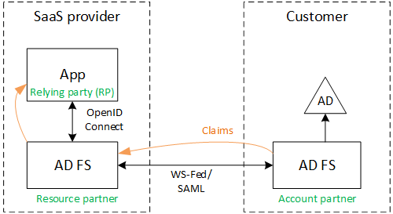

<properties
   pageTitle="Fédérer avec AD FS un client | Microsoft Azure"
   description="Comment federate avec un client de AD FS dans une application partagée"
   services=""
   documentationCenter="na"
   authors="JohnPWSharp"
   manager="roshar"
   editor=""
   tags=""/>

<tags
   ms.service="guidance"
   ms.devlang="dotnet"
   ms.topic="article"
   ms.tgt_pltfrm="na"
   ms.workload="na"
   ms.date="06/02/2016"
   ms.author="v-josha"/>

# <a name="federating-with-a-customers-ad-fs-for-multitenant-apps-in-azure"></a>Fédérer avec AD FS un client pour les applications partagées dans Azure

[AZURE.INCLUDE [pnp-header](../../includes/guidance-pnp-header-include.md)]

Cet article fait [partie d’une série]. Vous trouverez également un [exemple d’application] complète qui accompagne cette série.

Cet article décrit comment une application SaaS cliente multiples peut prendre en charge l’authentification via les Services de fédération Active Directory (AD FS), afin de fédérer avec AD FS un client.

## <a name="overview"></a>Vue d’ensemble

Azure Active Directory (AD Azure) facilite la connexion des utilisateurs à partir d’Azure AD clients, y compris les clients Office 365 et Dynamics CRM Online. Mais qu’en est-il des clients qui utilisent sur site Active Directory sur un réseau intranet ?

Une option consiste à ces clients synchroniser leur publicité locales avec Azure Active Directory, à l’aide [d’Azure AD Connect]. Toutefois, certains clients peuvent être impossible d’utiliser cette approche, en raison de la stratégie informatique d’entreprise ou autres raisons. Dans ce cas, une autre option consiste à fédérer via les Services de fédération Active Directory (AD FS).

Pour activer ce scénario :

-   Le client doit disposer d’une batterie de serveurs via Internet AD FS.
-   Le fournisseur SaaS déploie leur propre batterie de serveurs AD FS.
-   Le client et le fournisseur SaaS doivent configurer [approbation de fédération]. Il s’agit d’un processus manuel.

Il existe trois rôles principales dans la relation de gestion de la confidentialité :

-   AD FS du client est le [partenaire de compte], responsable de l’authentification des utilisateurs à partir du client de AD et la création de jetons de sécurité avec les déclarations de l’utilisateur.
-   AD FS le fournisseur de SaaS est le [partenaire de ressource], qui approuve le partenaire de compte et reçoit les demandes d’utilisateur.
-   L’application est configurée comme une partie de confiance (RP) dans AD FS du fournisseur SaaS.

    

> [AZURE.NOTE] Dans cet article, nous part du principe l’application utilise OpenID se connecter en tant que le protocole d’authentification. Une autre option consiste à utiliser la fédération Web.

> OpenID de connexion, le fournisseur SaaS doit utiliser AD FS 4.0 en cours d’exécution dans Windows Server 2016, qui se trouve actuellement dans la version d’évaluation technique. AD FS 3.0 ne prend pas en charge OpenID se connecter.

> Core ASP.NET 1.0 n’inclut pas de prise en charge de prédéfinies de la fédération Web.

Pour obtenir un exemple de l’utilisation de la fédération Web avec ASP.NET 4, voir l' [exemple wsfederation du webapp dotnet active directory][active-directory-dotnet-webapp-wsfederation].

## <a name="authentication-flow"></a>Flux d’authentification

1.  Lorsque l’utilisateur clique sur « Connectez-vous », l’application redirige vers un point de terminaison OpenID se connecter sur AD FS du fournisseur SaaS.
2.  L’utilisateur entre son nom d’utilisateur d’organisation («`alice@corp.contoso.com`»). AD FS utilise la découverte d’accueil de domaine pour rediriger vers AD FS du client, où l’utilisateur entre ses informations d’identification.
3.  AD FS du client envoie revendications d’utilisateur pour AD FS du fournisseur SaaS, à l’aide de la fédération WF (ou SAML).
4.  Flux des revendications dans ADFS à l’application, à l’aide de OpenID se connecter. Cette fonctionnalité nécessite une transition de protocole à partir de la fédération Web.

## <a name="limitations"></a>Limitations

Au moment de la rédaction, l’application reçoit un ensemble limité de revendications dans l’id_token OpenID, comme indiqué dans le tableau suivant. AD FS 4.0 est en mode Aperçu avant toujours, afin que cet ensemble peut changer. Il n’est pas actuellement possible de définir d’autres plaintes :

Réclamer   | Description
------|-------------
AUD | Audience. L’application pour laquelle la les revendications ont été émises.
AuthenticationInstant   | [Authentification instantanée]. L’heure d’authentification s’est produite.
c_hash  | Valeur de hachage de code. Il s’agit d’un hachage du contenu du jeton.
EXP | [Délai d’expiration]. Heure après laquelle le jeton est ne sont plus accepté.
IAT | [Délivré à]. L’heure d’émission du jeton.
ISS | Émetteur. La valeur de cet argument est toujours AD FS du partenaire ressource.
nom    | Nom d’utilisateur. Exemple : `john@corp.fabrikam.com`.
NameIdentifier | [Identificateur de nom]. L’identificateur pour le nom de l’entité pour laquelle le jeton a été émis.
valeur à usage unique   | Valeur unique de session. Une valeur unique générée par AD FS afin d’éviter les attaques de relecture.
UPN | Nom d’utilisateur principal (UPN). Exemple :john@corp.fabrikam.com
pwd_exp | Période d’expiration du mot de passe. Le nombre de secondes jusqu'à ce que le mot de passe de l’utilisateur ou un code secret d’authentification similaires, par exemple un code confidentiel. arrive à expiration.

> [AZURE.NOTE] Les « iss » réclamer contient la AD FS du partenaire (en règle générale, cette demande identifie le fournisseur SaaS en tant que l’émetteur). Il n’identifie pas AD FS du client. Vous pouvez trouver le domaine du client dans le cadre de l’UPN.

Le reste de cet article décrit comment configurer la relation d’approbation entre le RP (l’application) et le partenaire de compte (le client).

## <a name="ad-fs-deployment"></a>Déploiement FS AD

Le fournisseur SaaS pouvez déployer ADFS locales ou sur machines virtuelles Azure. Pour la sécurité et disponibilité, les instructions suivantes sont importantes :

-   Déployer au moins deux serveurs AD FS et deux serveurs proxy AD FS pour obtenir la meilleure disponibilité du service AD FS.
-   Domaine et serveurs AD FS ne doivent jamais être exposées directement à Internet et doivent se trouver dans un réseau virtuel avec un accès direct.
-   Proxys d’application Web (précédemment proxy AD FS) doivent être utilisées pour publier des serveurs AD FS sur Internet.

Pour configurer une topologie similaire dans Azure nécessite l’utilisation de réseaux virtuels, du NSG, azure machines virtuelles et ensembles de disponibilité. Pour plus d’informations, voir [instructions de déploiement d’Active Directory Windows Server Azure machines virtuelles en fonctionnement][active-directory-on-azure].

## <a name="configure-openid-connect-authentication-with-ad-fs"></a>Configurer l’authentification OpenID se connecter avec AD FS

Le fournisseur SaaS doit activer OpenID connecter entre l’application et AD FS. Pour ce faire, ajoutez un groupe d’applications dans AD FS.  Vous trouverez des instructions détaillées dans ce [billet de blog], sous « La configuration d’une application Web pour se connecter OpenId connectez-vous AD FS. » 

Ensuite, configurez les logiciels intermédiaires OpenID se connecter. Le point de terminaison de métadonnées est `https://domain/adfs/.well-known/openid-configuration`, où domaine est AD FS domaine du fournisseur SaaS.

En règle générale cela peut combiner avec d’autres points de terminaison OpenID se connecter (par exemple, AAD). Vous devez deux connexion boutons différents ou un autre moyen de distinguer, afin que l’utilisateur est envoyé au point de terminaison authentification correcte.

## <a name="configure-the-ad-fs-resource-partner"></a>Configurez le partenaire de ressource FS AD

Le fournisseur SaaS procédez comme suit pour chaque client qui souhaite se connecter via AD FS :

1.  Ajouter une fournisseur de revendications la confidentialité.
2.  Ajouter des règles de revendications.
3.  Activer la découverte de domaine-accueil.

Voici les étapes décrites plus en détail.

### <a name="add-the-claims-provider-trust"></a>Ajouter l’approbation de fournisseur de revendications

1.  Dans le Gestionnaire de serveur, cliquez sur **Outils**, puis sélectionnez puis **AD FS Management**.
2.  Dans l’arborescence, sous **AD FS**, le bouton droit sur **Approuve le fournisseur de revendications**. Sélectionnez **Ajouter une approbation de fournisseur de revendications**.
3.  Cliquez sur **Démarrer** pour démarrer l’Assistant.
4.  Sélectionnez l’option « Importer des données sur le fournisseur de revendications publié en ligne ou sur un réseau local ». Entrez l’URI du point de terminaison de métadonnées de fédération du client. (Exemple : `https://contoso.com/FederationMetadata/2007-06/FederationMetadata.xml`.) Vous devrez obtenir ceci du client.
5.  Exécuter l’Assistant en utilisant les options par défaut.

### <a name="edit-claims-rules"></a>Modifier les règles de revendications

1.  Avec le bouton droit de l’approbation de fournisseur de revendications nouvellement ajouté, puis sélectionnez **Modifier les règles de revendications**.
2.  Cliquez sur **Ajouter une règle**.
3.  Sélectionnez « Passer via ou filtrer une entrants réclamer », puis cliquez sur **suivant**.
    
4.  Entrez un nom pour la règle.
5.  Sous « Entrant réclamer type », sélectionnez **UPN**.
6.  Sélectionnez « Transférer toutes les valeurs des revendications ».
  
7.  Cliquez sur **Terminer**.
8.  Répétez les étapes 2 à 7 et spécifiez **D’ancrage réclamer Type** pour le type de réclamer entrants.
9.  Cliquez sur **OK** pour fermer l’Assistant.

### <a name="enable-home-realm-discovery"></a>Activer la découverte de domaine-accueil
Exécuter le script PowerShell suivant :

```
Set-ADFSClaimsProviderTrust -TargetName "name" -OrganizationalAccountSuffix @("suffix")
```

où « nom » est le nom convivial de l’approbation de fournisseur de revendications, et « suffixe » est le suffixe UPN pour le client de l’annonce (par exemple, « corp.fabrikam.com »).

Avec cette configuration, les utilisateurs finaux peuvent taper dans leur propre compte d’organisation et AD FS sélectionne automatiquement le fournisseur de revendications correspondant. Consultez [personnalisation AD FS de Pages], sous la section « Fournisseur d’identité configurer à utiliser certaines suffixes messagerie ».

## <a name="configure-the-ad-fs-account-partner"></a>Configurer AD FS compte partenaire

Le client doit procédez comme suit :

1.  Ajouter une confiance approbation de fête (RP).
2.  Ajoute des règles de revendications.

### <a name="add-the-rp-trust"></a>Ajouter l’approbation RP

1.  Dans le Gestionnaire de serveur, cliquez sur **Outils**, puis sélectionnez puis **AD FS Management**.
2.  Dans l’arborescence, sous **AD FS**, le bouton droit sur **Approbations des parties de confiance**. Sélectionnez **Ajouter une partie de confiance**.
3.  Sélectionnez **L’existence de revendications** , puis cliquez sur **Démarrer**.
4.  Dans la page **Sélectionner la Source de données** , sélectionnez l’option « Importer des données sur le fournisseur de revendications publié en ligne ou sur un réseau local ». Entrez l’URI du point de terminaison de métadonnées du fournisseur SaaS fédération.
  
5.  Dans la page **Spécifier le nom complet** , entrez un nom.
6.  Dans la page **Sélectionnez Stratégie de contrôle d’accès** , sélectionnez une stratégie. Vous pourriez autoriser tout le monde dans votre organisation, ou choisissez un groupe de sécurité spécifique.
  
7.  Entrez les paramètres requis dans la zone de **stratégie** .
8.  Cliquez sur **suivant** pour terminer l’Assistant.

### <a name="add-claims-rules"></a>Ajouter des règles de revendications

1.  Avec le bouton droit de l’approbation des parties de confiance nouvellement ajouté, puis sélectionnez **Modifier la stratégie d’émission réclamer**.
2.  Cliquez sur **Ajouter une règle**.
3.  Sélectionnez « Envoyer LDAP attributs en tant que revendications », puis cliquez sur **suivant**.
4.  Entrez un nom pour la règle, telles que « UPN ».
5.  Sous l' **attribut stocker**, sélectionnez **Active Directory**.
  
6.  Dans la section **attributs de mappage de LDAP** :
  - Sous **Attribut LDAP**, sélectionnez le **Nom d’utilisateur Principal**.
  - Sous **Type de réclamer sortant**, sélectionnez **UPN**.
  
7.  Cliquez sur **Terminer**.
8.  Cliquez à nouveau sur **Ajouter une règle** .
9.  Sélectionnez « Envoyer revendications à l’aide une règle personnalisée », puis cliquez sur **suivant**.
10. Entrez un nom pour la règle, par exemple « D’ancrage réclamer Type ».
11. Sous **règle personnalisée**, entrez les informations suivantes :

    ```
    EXISTS([Type == "http://schemas.microsoft.com/ws/2014/01/identity/claims/anchorclaimtype"])=>
      issue (Type = "http://schemas.microsoft.com/ws/2014/01/identity/claims/anchorclaimtype",
             Value = "http://schemas.xmlsoap.org/ws/2005/05/identity/claims/upn");
    ```

    Cette règle envoie une demande de remboursement de type `anchorclaimtype`. La demande indique la partie de confiance à utiliser UPN comme l’ID immuable. d’utilisateur

12. Cliquez sur **Terminer**.
13. Cliquez sur **OK** pour fermer l’Assistant.

## <a name="next-steps"></a>Étapes suivantes

- Consultez l’article suivant de cette série : [assertion de client à l’aide pour obtenir des jetons d’accès à partir d’Azure AD][client assertion]

<!-- Links -->
[partie d’une série]: guidance-multitenant-identity.md
[Azure AD Connect]: ../active-directory/active-directory-aadconnect.md
[approbation de fédération]: https://technet.microsoft.com/library/cc770993(v=ws.11).aspx
[partenaire de compte]: https://technet.microsoft.com/library/cc731141(v=ws.11).aspx
[partenaire de ressource]: https://technet.microsoft.com/library/cc731141(v=ws.11).aspx
[Authentification instantanée]: https://msdn.microsoft.com/library/system.security.claims.claimtypes.authenticationinstant%28v=vs.110%29.aspx
[Délai d’expiration]: http://tools.ietf.org/html/draft-ietf-oauth-json-web-token-25#section-4.1.4
[Délivré à]: http://tools.ietf.org/html/draft-ietf-oauth-json-web-token-25#section-4.1.6
[Identificateur de nom]: https://msdn.microsoft.com/library/system.security.claims.claimtypes.nameidentifier(v=vs.110).aspx
[active-directory-on-azure]: https://msdn.microsoft.com/library/azure/jj156090.aspx
[billet de blog]: http://www.cloudidentity.com/blog/2015/08/21/OPENID-CONNECT-WEB-SIGN-ON-WITH-ADFS-IN-WINDOWS-SERVER-2016-TP3/
[Personnalisation des AD FS connexion Pages]: https://technet.microsoft.com/library/dn280950.aspx
[exemple d’application]: https://github.com/Azure-Samples/guidance-identity-management-for-multitenant-apps
[client assertion]: guidance-multitenant-identity-client-assertion.md
[active-directory-dotnet-webapp-wsfederation]: https://github.com/Azure-Samples/active-directory-dotnet-webapp-wsfederation
