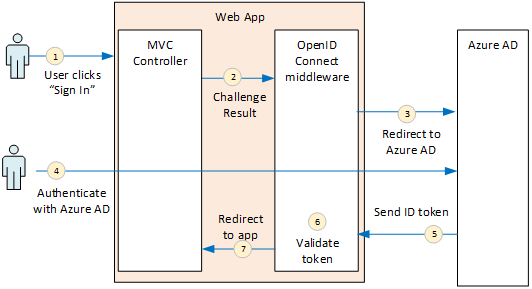
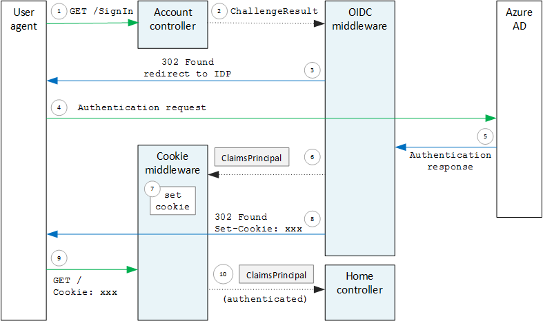

<properties
   pageTitle="Authentification dans les applications partagées | Microsoft Azure"
   description="Comment une application partagée peut authentifier les utilisateurs à partir d’Azure AD"
   services=""
   documentationCenter="na"
   authors="MikeWasson"
   manager="roshar"
   editor=""
   tags=""/>

<tags
   ms.service="guidance"
   ms.devlang="dotnet"
   ms.topic="article"
   ms.tgt_pltfrm="na"
   ms.workload="na"
   ms.date="05/23/2016"
   ms.author="mwasson"/>

# <a name="authentication-in-multitenant-apps-using-azure-ad-and-openid-connect"></a>Authentification dans les applications partagées, à l’aide d’Azure AD et OpenID se connecter

[AZURE.INCLUDE [pnp-header](../../includes/guidance-pnp-header-include.md)]

Cet article fait [partie d’une série](guidance-multitenant-identity.md). Vous trouverez également un [exemple d’application] complète qui accompagne cette série.

Cet article décrit comment une application partagée peut authentifier des utilisateurs à partir d’Azure Active Directory (AD Azure), à l’aide de se connecter OpenID (OIDC) s’authentifier.

## <a name="overview"></a>Vue d’ensemble

Notre [implémentation de référence](guidance-multitenant-identity-tailspin.md) est une application Web ASP.NET Core 1.0. L’application utilise intégrés OpenID connecter logiciels intermédiaires pour effectuer le flux d’authentification OIDC. Le diagramme suivant illustre que se passe-t-il lorsque l’utilisateur se connecte, à un niveau élevé.



1.  L’utilisateur clique sur le bouton « Connectez-vous » dans l’application. Cette action est gérée par un contrôleur MVC.
2.  Le contrôleur MVC renvoie une action **ChallengeResult** .
3.  Logiciels intermédiaires intercepte la **ChallengeResult** et crée une réponse 302 qui redirige l’utilisateur vers la page de connexion Azure AD.
4.  L’utilisateur s’authentifie avec Azure AD.
5.  Azure AD envoie un jeton ID à l’application.
6.  Logiciels intermédiaires valide le jeton ID. À ce stade, il est authentifié maintenant à l’intérieur de l’application.
7.  Logiciels intermédiaires redirige l’utilisateur à l’application.

## <a name="register-the-app-with-azure-ad"></a>Enregistrer l’application avec Azure AD

Pour activer OpenID se connecter, le fournisseur SaaS enregistre l’application à l’intérieur de leur propre client Azure AD.

Pour enregistrer l’application, suivez les étapes de l' [Intégration des Applications avec Azure Active Directory](../active-directory/active-directory-integrating-applications.md), dans la section [Ajout d’une Application](../active-directory/active-directory-integrating-applications.md#adding-an-application).

Dans la page **configurer** :

-   Notez l’ID de client.
-   Sous **Application est partagée**, sélectionnez **Oui**.
-   Définissez **URL de réponse** à une URL où Azure AD vous envoie la réponse d’authentification. Vous pouvez utiliser l’URL de base de votre application.
  - Remarque : Le chemin d’URL peut être rien, dans la mesure où le nom d’hôte correspond à votre application déployée.
  - Vous pouvez définir plusieurs URL de réponse. Pendant le développement, vous pouvez utiliser un `localhost` adresse, pour l’exécution de l’application localement.
-   Générer un code secret client : sous **clés**, cliquez sur la liste déroulante qui indique **Sélectionnez durée** , puis sélectionnez 1 ou 2 ans. La clé sera visible lorsque vous cliquez sur **Enregistrer**. Veillez à copier la valeur, car il n’est pas visible à nouveau lorsque vous chargez à nouveau la page de configuration.

## <a name="configure-the-auth-middleware"></a>Configurer les logiciels intermédiaires auth

Cette section décrit comment configurer l’authentification logiciels intermédiaires dans ASP.NET Core 1.0 pour l’authentification partagée avec OpenID se connecter.

Dans votre cours démarrage, ajoutez logiciels intermédiaires OpenID connecter :

```csharp
app.UseOpenIdConnectAuthentication(options =>
{
    options.AutomaticAuthenticate = true;
    options.AutomaticChallenge = true;
    options.ClientId = [client ID];
    options.Authority = "https://login.microsoftonline.com/common/";
    options.CallbackPath = [callback path];
    options.PostLogoutRedirectUri = [application URI];
    options.SignInScheme = CookieAuthenticationDefaults.AuthenticationScheme;
    options.TokenValidationParameters = new TokenValidationParameters
    {
        ValidateIssuer = false
    };
    options.Events = [event callbacks];
});
```

> [AZURE.NOTE] Voir [Startup.cs](https://github.com/Azure-Samples/guidance-identity-management-for-multitenant-apps/blob/master/src/Tailspin.Surveys.Web/Startup.cs).

Pour plus d’informations sur la classe de démarrage, voir [Démarrage de l’Application](https://docs.asp.net/en/latest/fundamentals/startup.html) dans la documentation ASP.NET Core 1.0.

Définir les options de logiciels intermédiaires suivantes :

- **Identifiant du client**. ID de client de l’application, qui vous a été fourni lorsque vous avez enregistré l’application dans Azure AD.
- **Autorité**. Pour une application partagée, indiquez ce `https://login.microsoftonline.com/common/`. Il s’agit de l’URL du point de terminaison courantes Azure AD, qui permet aux utilisateurs à partir d’un client Azure AD pour vous connecter. Pour plus d’informations sur le point de terminaison courant, voir [ce billet de blog](http://www.cloudidentity.com/blog/2014/08/26/the-common-endpoint-walks-like-a-tenant-talks-like-a-tenant-but-is-not-a-tenant/).
- Dans **TokenValidationParameters**, définissez **ValidateIssuer** sur false. Cela signifie que l’application est responsable de la validation de la valeur de l’émetteur du jeton ID. (Logiciels intermédiaires valide toujours le jeton elle-même.) Pour plus d’informations sur la validation de l’émetteur, consultez [la validation émetteur](guidance-multitenant-identity-claims.md#issuer-validation).
- **CallbackPath**. Définissez cette sur le chemin d’accès dans l’URL de réponse que vous avez enregistré dans Azure AD. Par exemple, si l’URL de réponse est `http://contoso.com/aadsignin`, **CallbackPath** doit être `aadsignin`. Si vous ne définissez pas cette option, la valeur par défaut est `signin-oidc`.
- **PostLogoutRedirectUri**. Spécifiez une URL pour rediriger les utilisateurs lorsque la déconnexion. Cela doit être une page qui permet aux requêtes anonymes &mdash; généralement la page d’accueil.
- **SignInScheme**. Cette valeur `CookieAuthenticationDefaults.AuthenticationScheme`. Ce paramètre signifie qu’une fois l’utilisateur authentifié, les revendications utilisateur sont stockées localement dans des cookies. Cette cookies est comment l’utilisateur reste connecté pendant la session de navigation.
- **Événements.** Rappels d’événements ; voir [les événements d’authentification](#authentication-events).

Ajouter l’authentification par cookies logiciels intermédiaires pour le pipeline de. Cette logiciels intermédiaires est responsable pour écrire les demandes d’utilisateur à des cookies et puis lire les cookies pendant le chargement des pages suivantes.

```csharp
app.UseCookieAuthentication(options =>
{
    options.AutomaticAuthenticate = true;
    options.AutomaticChallenge = true;
    options.AccessDeniedPath = "/Home/Forbidden";
});
```

## <a name="initiate-the-authentication-flow"></a>Démarrer le flux d’authentification

Pour démarrer le flux d’authentification dans ASP.NET MVC, renvoyer un **ChallengeResult** le contrôleur :

```csharp
[AllowAnonymous]
public IActionResult SignIn()
{
    return new ChallengeResult(
        OpenIdConnectDefaults.AuthenticationScheme,
        new AuthenticationProperties
        {
            IsPersistent = true,
            RedirectUri = Url.Action("SignInCallback", "Account")
        });
}
```

Dans ce cas logiciels intermédiaires renvoyer une réponse 302 (trouvé) qui redirige vers le point de terminaison d’authentification.

## <a name="user-login-sessions"></a>Sessions de connexion utilisateur

Comme mentionné, lorsque l’utilisateur se connecte tout d’abord, l’authentification par cookies logiciels intermédiaires écrit les revendications utilisateur à des cookies. Après cela, les requêtes HTTP sont authentifiés en lisant les cookies.

Par défaut, logiciels intermédiaires des cookies écrit un [des cookies session][session-cookie], qui obtient supprimé une fois l’utilisateur ferme le navigateur. La prochaine fois que l’utilisateur visite ensuite le site, ils doivent se connecter à nouveau. Cependant, si vous définissez **IsPersistent** sur true dans le **ChallengeResult**, logiciels intermédiaires écrit des cookies permanente, afin que l’utilisateur reste connecté après la fermeture du navigateur. Vous pouvez configurer l’expiration des cookies ; voir [les options des cookies Controlling][cookie-options]. Les cookies permanents sont plus pratiques pour l’utilisateur, mais peuvent être inappropriés pour certaines applications (par exemple, d’une application bancaire) où vous souhaitez que l’utilisateur pour vous connecter à chaque fois.

## <a name="about-the-openid-connect-middleware"></a>À propos des logiciels intermédiaires OpenID se connecter

Logiciels intermédiaires OpenID se connecter dans ASP.NET masque la plupart des détails du protocole. Cette section contient quelques notes concernant l’implémentation, qui peuvent vous être utiles pour comprendre le flux de protocole.

Tout d’abord, nous allons examiner le flux d’authentification en termes d’ASP.NET (en ignorant les détails du flux de protocole OIDC entre l’application et Azure AD). Le diagramme suivant illustre le processus.



Dans ce diagramme, il existe deux contrôleurs MVC. Le contrôleur de compte gère les demandes de connexion et le contrôleur Home gère la page d’accueil.

Voici le processus d’authentification :

1. L’utilisateur clique sur le bouton « Se connecter » et le navigateur envoie une requête GET. Par exemple : `GET /Account/SignIn/`.
2. Les retours contrôleur compte un `ChallengeResult`.
3. Logiciels intermédiaires OIDC renvoie une réponse HTTP 302 rediriger vers Azure Active Directory.
4. Le navigateur envoie la demande d’authentification Azure AD
5. L’utilisateur se connecte à Azure Active Directory, et Azure AD renvoie une réponse d’authentification.
6. Logiciels intermédiaires OIDC crée une entité revendications et passe à l’authentification par cookies logiciels intermédiaires.
7. Logiciels intermédiaires des cookies sérialise l’entité de revendications et définit des cookies.
8. Logiciels intermédiaires OIDC redirige vers l’URL de rappel de l’application.
10. Le navigateur suit la redirection, en envoyant les cookies dans la demande.
11. Logiciels intermédiaires des cookies désérialise les cookies à un revendications principal et jeux de `HttpContext.User` égal à l’utilisateur principal revendications. La demande est acheminée vers un contrôleur MVC.

### <a name="authentication-ticket"></a>Tickets d’authentification

Si l’authentification réussit, logiciels intermédiaires OIDC crée un tickets d’authentification, qui contient une entité de revendications contenant des demandes de l’utilisateur. Vous pouvez accéder à la tickets à l’intérieur de l’événement **AuthenticationValidated** ou **TicketReceived** .

> [AZURE.NOTE] Jusqu'à ce que le flux d’authentification est terminé, `HttpContext.User` conserve un anonyme principal, _pas_ l’utilisateur authentifié. L’utilisateur principal anonyme possède une collection de revendications vide. Après l’exécution de l’authentification et les redirections application, logiciels intermédiaires des cookies désérialise les cookies d’authentification et les ensembles `HttpContext.User` à une entité de revendications qui représente l’utilisateur authentifié.

### <a name="authentication-events"></a>Événements d’authentification

Pendant le processus d’authentification, logiciels intermédiaires OpenID connecter génère une série d’événements :

- **RedirectToAuthenticationEndpoint**. Appelée juste avant que logiciels intermédiaires redirige vers le point de terminaison d’authentification. Vous pouvez utiliser cet événement pour modifier l’URL de redirection ; par exemple, pour ajouter des paramètres de la demande. Pour obtenir un exemple, voir [Ajout de consentement d’administration](guidance-multitenant-identity-signup.md#adding-the-admin-consent-prompt) .

- **AuthorizationResponseReceived**. Appelé après que logiciels intermédiaires reçoit la réponse de l’authentification par le fournisseur d’identité (IDP), mais avant logiciels intermédiaires valide la réponse.  

- **AuthorizationCodeReceived**. Appelée avec le code d’autorisation.

- **TokenResponseReceived**. Appelée après que logiciels intermédiaires Obtient un accès jetons à partir de la IDP. S’applique uniquement aux flux de code d’autorisation.

- **AuthenticationValidated**. Appelée après que logiciels intermédiaires valide le jeton ID. À ce stade, l’application a un ensemble de revendications validées relatives à l’utilisateur. Vous pouvez utiliser cet événement pour effectuer une validation supplémentaire sur les revendications, ou pour transformer les revendications. Voir [utilisation de revendications](guidance-multitenant-identity-claims.md).

- **UserInformationReceived**. Appelée si logiciels intermédiaires Obtient le profil utilisateur du point de terminaison informations utilisateur. S’applique uniquement aux flux de code d’autorisation et uniquement lorsque `GetClaimsFromUserInfoEndpoint = true` dans les options de logiciels intermédiaires.

- **TicketReceived**. Appelée lorsque l’authentification est terminée. Il s’agit du dernier événement, en supposant que l’authentification a réussi. Une fois que cet événement est géré, l’utilisateur est connecté à l’application.

- **AuthenticationFailed**. Appelé si l’authentification échoue. Utilisez cet événement pour gérer les échecs d’authentification &mdash; par exemple, en redirigeant vers une page d’erreur.

Pour fournir des rappels pour ces événements, définissez l’option **événements** logiciels intermédiaires. Il existe deux façons différentes pour déclarer les gestionnaires d’événements : en ligne à des expressions lambda, ou dans une classe qui est dérivée de **OpenIdConnectEvents**.

Aligné à des expressions lambda :

```csharp
app.UseOpenIdConnectAuthentication(options =>
{
    // Other options not shown.

    options.Events = new OpenIdConnectEvents
    {
        OnTicketReceived = (context) =>
        {
             // Handle event
             return Task.FromResult(0);
        },
        // other events
    }
});
```

Dérivation à partir de **OpenIdConnectEvents**:

```csharp
public class SurveyAuthenticationEvents : OpenIdConnectEvents
{
    public override Task TicketReceived(TicketReceivedContext context)
    {
        // Handle event
        return base.TicketReceived(context);
    }
    // other events
}

// In Startup.cs:
app.UseOpenIdConnectAuthentication(options =>
{
    // Other options not shown.

    options.Events = new SurveyAuthenticationEvents();
});
```

La deuxième approche est recommandée si votre rappels d’événement ont une logique de significative, afin qu’ils n’encombrent votre cours de démarrage. Notre implémentation de référence utilise cette approche ; voir [SurveyAuthenticationEvents.cs](https://github.com/Azure-Samples/guidance-identity-management-for-multitenant-apps/blob/master/src/Tailspin.Surveys.Web/Security/SurveyAuthenticationEvents.cs).

### <a name="openid-connect-endpoints"></a>OpenID connecter des points de terminaison

Azure AD prend en charge la [Découverte de se connecter OpenID](https://openid.net/specs/openid-connect-discovery-1_0.html), dans laquelle le fournisseur d’identité (IDP) renvoie un document de métadonnées JSON à partir d’un [point de terminaison connu](https://openid.net/specs/openid-connect-discovery-1_0.html#ProviderConfig). Le document de métadonnées contient des informations telles que :

-   L’URL du point de terminaison d’autorisation. Il s’agit de l’endroit où l’application redirige pour authentifier l’utilisateur.
-   L’URL du point de terminaison « terminer la session », dans lequel l’application accède à l’utilisateur.
-   L’URL pour obtenir les clés de signature, qui utilise le client pour valider les jetons OIDC qu’il obtient de la IDP.

Par défaut, logiciels intermédiaires OIDC sait comment récupérer ces métadonnées. Définissez l’option **autorité** des logiciels intermédiaires et logiciels intermédiaires construit l’URL pour les métadonnées. (Vous pouvez ignorer l’URL des métadonnées en définissant l’option **MetadataAddress** .)

### <a name="openid-connect-flows"></a>OpenID connectez flux

Par défaut, logiciels intermédiaires OIDC utilise flux hybride avec le mode de réponse post de formulaire.

-   _Flux hybride_ signifie que le client accessible un jeton ID et un code d’autorisation dans la même aller-retour sur le serveur d’autorisation.
-   _Mode de réponse de publication de formulaire_ signifie que le serveur d’autorisation utilise une demande HTTP publier pour envoyer le code d’identification jeton et d’autorisation à l’application. Les valeurs sont formulaire urlencoded (type de contenu = « application/x-www-form-urlencoded »).

Lorsque les logiciels intermédiaires OIDC redirige vers le point de terminaison d’autorisation, l’URL de redirection inclut tous les paramètres de chaîne de requête requis par OIDC. Pour le flux hybride :

-   identifiant_client. Cette valeur est définie dans l’option **identifiant du client**
-   étendue = « openid profil », ce qui signifie qu’il s’agit d’une demande OIDC et nous voulons du profil utilisateur.
-   response_type = « code id_token ». Cette option spécifie flux hybride.
-   response_mode = « form_post ». Cette option spécifie réponse post de formulaire.

Pour spécifier un autre flux, définissez la propriété **ResponseType** sur les options. Par exemple :

```csharp
app.UseOpenIdConnectAuthentication(options =>
{
    options.ResponseType = "code"; // Authorization code flow

    // Other options
}
```

## <a name="next-steps"></a>Étapes suivantes

- Consultez l’article suivant de cette série : [utilisation des identités basée sur les revendications dans les applications partagées][claims]


[claims]: guidance-multitenant-identity-claims.md
[cookie-options]: https://docs.asp.net/en/latest/security/authentication/cookie.html#controlling-cookie-options
[session-cookie]: https://en.wikipedia.org/wiki/HTTP_cookie#Session_cookie
[exemple d’application]: https://github.com/Azure-Samples/guidance-identity-management-for-multitenant-apps
