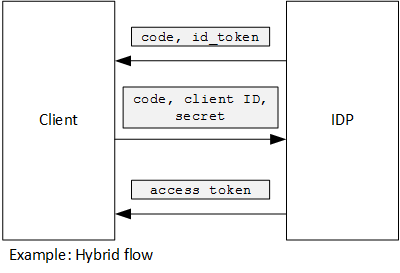

<properties
   pageTitle="À l’aide d’assertion client pour obtenir des jetons d’accès à partir d’Azure AD | Microsoft Azure"
   description="Comment utiliser assertion client pour obtenir des jetons d’accès à partir d’Azure AD."
   services=""
   documentationCenter="na"
   authors="MikeWasson"
   manager="roshar"
   editor=""
   tags=""/>

<tags
   ms.service="guidance"
   ms.devlang="dotnet"
   ms.topic="article"
   ms.tgt_pltfrm="na"
   ms.workload="na"
   ms.date="05/23/2016"
   ms.author="mwasson"/>

# <a name="using-client-assertion-to-get-access-tokens-from-azure-ad"></a>À l’aide d’assertion client pour obtenir des jetons d’accès à partir d’Azure AD

[AZURE.INCLUDE [pnp-header](../../includes/guidance-pnp-header-include.md)]

Cet article fait [partie d’une série]. Vous trouverez également un [exemple d’application] complète qui accompagne cette série.

## <a name="background"></a>Arrière-plan

Lorsque vous utilisez le flux de code de l’autorisation ou flux hybride dans OpenID se connecter, le client échange un code d’autorisation pour un jeton d’accès. Au cours de cette étape, le client doit s’authentifier auprès du serveur.



À l’aide d’un code secret client constitue un moyen pour authentifier le client. C’est la façon dont les [Enquêtes Tailspin] [ Surveys] application est configurée par défaut.

Voici un exemple de demande à partir du client pour IDP, demander un jeton d’accès. Remarque la `client_secret` paramètre.

```
POST https://login.microsoftonline.com/b9bd2162xxx/oauth2/token HTTP/1.1
Content-Type: application/x-www-form-urlencoded

resource=https://tailspin.onmicrosoft.com/surveys.webapi
  &client_id=87df91dc-63de-4765-8701-b59cc8bd9e11
  &client_secret=i3Bf12Dn...
  &grant_type=authorization_code
  &code=PG8wJG6Y...
```

Le code secret est juste une chaîne, afin que vous deviez veillez ne pas à perdre la valeur. La meilleure solution consiste à garder le secret client se déconnecter de contrôle de code source. Lorsque vous déployez Azure, stocker le mot de passe dans un [paramètre d’application][configure-web-app].

Toutefois, toute personne ayant accès à l’abonnement Azure peut afficher les paramètres de l’application. Par ailleurs, il est toujours tentant vérifier secrets dans le contrôle de source (par exemple, dans les scripts de déploiement), les partager par courrier électronique, et ainsi de suite.

Pour renforcer la sécurité, vous pouvez utiliser [client assertion] au lieu d’un code secret client. Avec assertion client, le client utilise un certificat X.509 pour prouver que la demande de jeton fourni par le client. Le certificat client est installé sur le serveur web. En règle générale, il sera plus facile à limiter l’accès au certificat, que pour vous assurer que personne ne par inadvertance révèle un secret client. Pour plus d’informations sur la configuration de certificats dans une application web, voir [Utilisation des certificats dans les Applications de sites Web Azure][using-certs-in-websites]

Voici une demande de jeton à l’aide d’assertion client :

```
POST https://login.microsoftonline.com/b9bd2162xxx/oauth2/token HTTP/1.1
Content-Type: application/x-www-form-urlencoded

resource=https://tailspin.onmicrosoft.com/surveys.webapi
  &client_id=87df91dc-63de-4765-8701-b59cc8bd9e11
  &client_assertion_type=urn:ietf:params:oauth:client-assertion-type:jwt-bearer
  &client_assertion=eyJhbGci...
  &grant_type=authorization_code
  &code= PG8wJG6Y...
```

Notez que la `client_secret` paramètre n’est plus utilisée. En revanche, le `client_assertion` paramètre contient un jeton JWT qui a été signé à l’aide du certificat client. La `client_assertion_type` paramètre spécifie le type d’assertion &mdash; dans ce cas, jeton JWT. Le serveur valide le jeton JWT. Si le jeton JWT n’est pas valide, la demande de jeton retourne une erreur.

> [AZURE.NOTE] Les certificats X.509 ne sont pas la seule forme d’assertion client ; nous concentrer sur celui-ci ici, car il est pris en charge par Azure AD.

## <a name="using-client-assertion-in-the-surveys-application"></a>À l’aide d’assertion client dans l’application enquêtes

Cette section montre comment configurer l’application Tailspin enquêtes pour utiliser assertion client. Dans ces étapes, vous allez générer un certificat auto-signé qui convient pour le développement, mais pas pour l’utilisation de production.

1. Exécuter le script de PowerShell [/Scripts/Setup-KeyVault.ps1] [ Setup-KeyVault] comme suit :

    ```
    .\Setup-KeyVault.ps -Subject [subject]
    ```

    Pour le `Subject` paramètre, entrez un nom, tel que « surveysapp ». Le script génère un certificat auto-signé et qu’il stocke dans le magasin de certificats « utilisateur/personnel en cours ».

2. La sortie à partir du script est un fragment JSON. Ajoutez cette au manifeste d’application de l’application web, comme suit :

    1. Connectez-vous au [portail de gestion Azure] [ azure-management-portal] et accédez à votre répertoire Azure AD.

    2. Cliquez sur **Applications**.

    3. Sélectionnez l’application d’enquêtes.

    4.  Cliquez sur **Gérer le manifeste** et sélectionnez **Télécharger manifeste**.

    5.  Ouvrez le fichier JSON manifeste dans un éditeur de texte. Coller la sortie à partir du script dans le `keyCredentials` propriété. Il doit ressembler à ce qui suit :

        ```    
        "keyCredentials": [
            {
              "type": "AsymmetricX509Cert",
              "usage": "Verify",
              "keyId": "29d4f7db-0539-455e-b708-....",
              "customKeyIdentifier": "ZEPpP/+KJe2fVDBNaPNOTDoJMac=",
              "value": "MIIDAjCCAeqgAwIBAgIQFxeRiU59eL.....
            }
          ],
         ```

    6.  Enregistrer vos modifications dans le fichier JSON.

    7.  Revenez au portail. Cliquez sur **Gérer le manifeste** > **Télécharger manifeste** et télécharger le fichier JSON.

3. Exécutez la commande suivante pour obtenir l’empreinte numérique du certificat.

    ```
    certutil -store -user my [subject]
    ```

    où `[subject]` est la valeur que vous avez spécifiée pour objet le script PowerShell. L’empreinte numérique est répertorié sous « Certificat hachage (SHA1) ». Supprimer les espaces entre les nombres nombre hexadécimales.

4. Mettre à jour les secrets de votre application. Dans l’Explorateur, droit sur le projet Tailspin.Surveys.Web et sélectionnez **Gérer les Secrets utilisateur**. Ajouter une entrée pour « Asymétriques » sous « AzureAd », comme indiqué ci-dessous :

    ```
    {
      "AzureAd": {
        "ClientId": "[Surveys application client ID]",
        // "ClientSecret": "[client secret]",  << Delete this entry
        "PostLogoutRedirectUri": "https://localhost:44300/",
        "WebApiResourceId": "[App ID URI of your Survey.WebAPI application]",
        // new:
        "Asymmetric": {
          "CertificateThumbprint": "[certificate thumbprint]",  // Example: "105b2ff3bc842c53582661716db1b7cdc6b43ec9"
          "StoreName": "My",
          "StoreLocation": "CurrentUser",
          "ValidationRequired": "false"
        }
      },
      "Redis": {
        "Configuration": "[Redis connection string]"
      }
    }
    ```

    Vous devez définir `ValidationRequired` sur false, car le certificat n’était pas un signé par une autorité de certification racine. En production, utilisez un certificat est signé par une autorité de certification et définissez `ValidationRequired` sur true.

    Supprimez également l’entrée de `ClientSecret`, car celui-ci n’est pas nécessaire avec assertion client.

5. Dans Startup.cs, recherchez le code qui enregistre la `ICredentialService`. Supprimez les commentaires de la ligne qui utilise `CertificateCredentialService`et commentez la ligne qui utilise `ClientCredentialService`:

    ```csharp
    // Uncomment this:
    services.AddSingleton<ICredentialService, CertificateCredentialService>();
    // Comment out this:
    //services.AddSingleton<ICredentialService, ClientCredentialService>();
    ```

En cours d’exécution, l’application web lit le certificat dans le magasin de certificats. Le certificat doit être installé sur le même ordinateur que l’application web.

## <a name="next-steps"></a>Étapes suivantes

- Consultez l’article suivant de cette série : [À l’aide de l’archivage sécurisé de clé Azure pour protéger la confidentialité de l’application][key vault]


<!-- Links -->
[configure-web-app]: ../app-service-web/web-sites-configure.md
[azure-management-portal]: https://manage.windowsazure.com
[assertion client]: https://tools.ietf.org/html/rfc7521
[key vault]: guidance-multitenant-identity-keyvault.md
[Setup-KeyVault]: https://github.com/Azure-Samples/guidance-identity-management-for-multitenant-apps/blob/master/scripts/Setup-KeyVault.ps1
[Surveys]: guidance-multitenant-identity-tailspin.md
[using-certs-in-websites]: https://azure.microsoft.com/blog/using-certificates-in-azure-websites-applications/
[partie d’une série]: guidance-multitenant-identity.md
[exemple d’application]: https://github.com/Azure-Samples/guidance-identity-management-for-multitenant-apps
