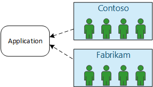
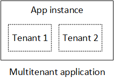
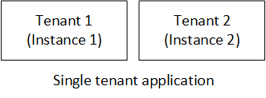

<properties
   pageTitle="Gestion des identités pour les applications partagées | Microsoft Azure"
   description="Introduction à la gestion des identités dans les applications partagées"
   services=""
   documentationCenter="na"
   authors="MikeWasson"
   manager="roshar"
   editor=""
   tags=""/>

<tags
   ms.service="guidance"
   ms.devlang="dotnet"
   ms.topic="article"
   ms.tgt_pltfrm="na"
   ms.workload="na"
   ms.date="06/02/2016"
   ms.author="mwasson"/>

# Introduction à la gestion des identités pour les applications partagées dans Microsoft Azure

[AZURE.INCLUDE [pnp-header](../../includes/guidance-pnp-header-include.md)]

Cet article fait [partie d’une série]. Vous trouverez également un [exemple d’application] complète qui accompagne cette série.

Supposons que vous rédigez une entreprise application SaaS devant figurer dans le cloud. Bien entendu, l’application aura utilisateurs :

Mais ces utilisateurs appartiennent à des organisations :

Exemple : Tailspin vend abonnements à son application SaaS. Contoso et Fabrikam s’inscrire pour l’application. Lorsque Alice (`alice@contoso`) signes dans l’application utiles que Alice fait partie de Contoso.

- Alice _doit_ avoir accès aux données de Contoso.
- Alice _ne doit pas_ avoir accès aux données Fabrikam.

Ce guide vous montrent comment gérer les identités utilisateur dans une application partagée, à l’aide [d’Azure Active Directory] [ AzureAD] (Azure AD) pour gérer la connexion et l’authentification.

## Qu’est multitenancy ?

Un _client_ est un groupe d’utilisateurs. Dans une application SaaS, le client est un abonné ou un client de l’application. _Donc le partage_ est une architecture dans laquelle plusieurs clients partagent la même instance physique de l’application. Bien que les clients partagent les ressources physiques (par exemple, machines virtuelles ou stockage), chaque client dispose de sa propre instance logique de l’application.

En règle générale, les données d’application sont partagées par les utilisateurs au sein d’un client, mais pas avec d’autres clients.

Comparez cette architecture avec une architecture unique client, où chaque client a une instance physique dédiée. Dans une architecture unique client, vous ajoutez des clients en faisant pivoter les nouvelles instances de l’application.

### Mise à l’échelle multitenancy horizontaux et verticaux

Pour atteindre échelle dans le cloud, il est courant d’ajouter des instances physiques supplémentaires. Il s’agit _échelle horizontale_ ou _horizontale_. Envisagez d’une application web. Pour gérer davantage de trafic, vous pouvez ajouter plusieurs serveur machines virtuelles et les placer derrière un équilibrage de charge. Chaque machine virtuelle s’exécute une instance physique distincte de l’application web.

Toutes les requêtes peuvent être routés vers n’importe quelle instance. Ensemble, le système fonctionne comme une instance logique unique. Vous pouvez supprimer une machine virtuelle ou tourner une machine virtuelle, sans toucher aux utilisateurs. Dans cette architecture, chaque instance physique est client multiples, et vous mettre à l’échelle en ajoutant plusieurs instances. Une instance s’arrête, elle ne doit pas d’incidence sur n’importe quel client.

## Identité dans une application partagée

Dans une application partagée, vous devez prendre en compte les utilisateurs dans le contexte de clients.

**Authentification**

- Les utilisateurs se connectent à l’application avec leurs informations d’identification de l’organisation. Ils n’êtes pas obligé de créer de nouveaux profils utilisateur pour l’application.
- Utilisateurs au sein de la même organisation font partie du même client.
- Lorsqu’un utilisateur se connecte, l’application ne sait quel client appartient l’utilisateur.

**Autorisation**

- Lors de l’autorisation des actions d’un utilisateur (par exemple, l’affichage d’une ressource), l’application doit prendre en compte client de l’utilisateur.
- Les utilisateurs peuvent être affectées rôles au sein de l’application, tel que « Administrateur » ou « Utilisateurs Standard ». Attributions de rôle doivent être gérées par le client, pas par le fournisseur SaaS.

**Exemple.** Alice, un employé chez Contoso, accède à l’application dans son navigateur et clique sur le bouton « Se connecter ». Il est redirigée vers un écran de connexion à l’endroit où elle entre ses informations d’identification d’entreprise (nom d’utilisateur et mot de passe). À ce stade, elle est connectée à l’application en tant que `alice@contoso.com`. L’application ne sait également qu’Alice est un utilisateur d’administration de cette application. Car elle est un administrateur, elle peut afficher la liste de toutes les ressources appartiennent à Contoso. Toutefois, elle ne peut pas afficher les ressources de Fabrikam, car elle se trouve un administrateur uniquement dans son client.

Dans ce guide, nous allons aborder spécifiquement à l’aide d’Azure AD pour la gestion des identités.

- Nous part du principe stocké par le client leurs profils utilisateur dans Active Directory Azure (y compris les clients Office 365 et Dynamics CRM)
- Les clients avec locales Active Directory (AD) peuvent utiliser [Azure AD Connect] [ ADConnect] synchroniser leur publicité locales avec Azure AD.

Si un client avec AD sur site ne peut pas utiliser Azure AD Connect (en raison de stratégie informatique d’entreprise ou d’autres raisons), la SaaS fournisseur pouvez fédérer avec le client est AD via les Services de fédération Active Directory (AD FS). Cette option est décrite dans [sa fédération avec AD FS un client].

Ce guide ne tient pas compte d’autres aspects du donc le partage telles que la division des données, par client la configuration et ainsi de suite.

## Étapes suivantes

- Consultez l’article suivant de cette série : [à propos des enquêtes Tailspin l’application][tailpin]

<!-- Links -->
[ADConnect]: ../active-directory/active-directory-aadconnect.md
[AzureAD]: https://azure.microsoft.com/documentation/services/active-directory/
[partie d’une série]: guidance-multitenant-identity.md
[Fédérer avec AD FS un client]: guidance-multitenant-identity-adfs.md
[exemple d’application]: https://github.com/Azure-Samples/guidance-identity-management-for-multitenant-apps
[tailpin]: guidance-multitenant-identity-tailspin.md
