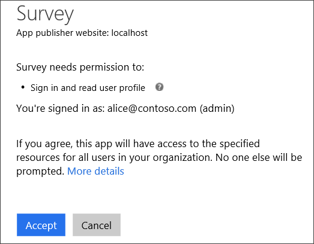
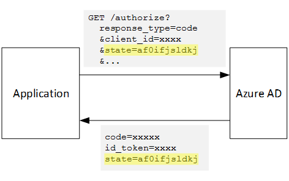

<properties
   pageTitle="Inscription et d’intégration dans les applications partagées du client | Microsoft Azure"
   description="Comment les clients intégrés dans une application partagée"
   services=""
   documentationCenter="na"
   authors="MikeWasson"
   manager="roshar"
   editor=""
   tags=""/>

<tags
   ms.service="guidance"
   ms.devlang="dotnet"
   ms.topic="article"
   ms.tgt_pltfrm="na"
   ms.workload="na"
   ms.date="05/23/2016"
   ms.author="mwasson"/>

# <a name="sign-up-and-tenant-onboarding-in-a-multitenant-application"></a>Inscription et d’intégration dans une application partagée du client

[AZURE.INCLUDE [pnp-header](../../includes/guidance-pnp-header-include.md)]

Cet article fait [partie d’une série]. Vous trouverez également un [exemple d’application] complète qui accompagne cette série.

Cet article décrit comment mettre en œuvre un _abonnement à un_ processus dans une application cliente multiples, qui permet à un client pour vous inscrire leur organisation pour votre application.
Il existe plusieurs raisons pour mettre en œuvre d’un processus d’inscription :

-   Autoriser l’administrateur AD consentement pour l’organisation du client entier à utiliser l’application.
-   Collecte de paiement par carte de crédit ou autres informations client.
-   Installer client ponctuel nécessaires à votre application.

## <a name="admin-consent-and-azure-ad-permissions"></a>Consentement d’administration et Azure AD autorisations

Pour vous authentifier avec Azure AD, une application doit avoir accès au répertoire de l’utilisateur. Au minimum, l’application doit droits de lecture du profil utilisateur. La première fois qu’un utilisateur se connecte, Azure AD affichant une page consentement qui répertorie les autorisations qui est demandées. En cliquant sur **Accepter**, l’utilisateur accorde l’autorisation de l’application.

Par défaut, consentement est octroyée sur par utilisateur. Chaque utilisateur qui se connecte voit la page consentement. Toutefois, Azure AD prend également en charge _d’administration consentement_, qui permet à un administrateur AD de consentement pour une organisation entière.

Lorsque le flux de consentement d’administration est utilisé, la page consentement indique que l’administrateur AD est l’attribution de l’autorisation de l’intégralité du client :



Une fois que l’administrateur clique sur **Accepter**, de se connecter aux autres utilisateurs dans le même client et Azure AD ignore l’écran consentement.

Uniquement un administrateur AD peut accorder consentement d’administration, car il accorde l’autorisation au nom de l’ensemble de votre organisation. Si un utilisateur non administrateur tente de vous authentifier avec le flux de consentement d’administration, Azure AD affiche une erreur :


Si l’application nécessite des autorisations supplémentaires à un point ultérieur, le client devra s’inscrire à nouveau et acceptez les autorisations mis à jour.  

## <a name="implementing-tenant-sign-up"></a>Mise en œuvre d’abonnement à un client

Pour les [Enquêtes Tailspin] [ Tailspin] application, nous avons défini plusieurs conditions requises pour le processus d’inscription :

-   Un client doit s’inscrire avant que les utilisateurs de se connecter.
-   Inscription utilise le flux de consentement d’administration.
-   Inscription ajoute client de l’utilisateur à la base de données de l’application.
-   Une fois un client s’inscrit, l’application affiche une page d’intégration.

Dans cette section, nous allons notre implémentation de la procédure d’inscription.
Il est important de comprendre que « de connexion » et « se connecter » est un concept d’application. Pendant le flux d’authentification, Azure AD pas fondamentalement détermine-t-il si l’utilisateur est en cours d’inscription. C’est à l’application pour suivre le contexte.

Lorsqu’un utilisateur anonyme visite l’application enquêtes, l’utilisateur est affichées deux boutons, un pour vous connecter et un « inscrire votre société » (s’inscrire).


Ces boutons appellent des actions de la classe [AccountController] .

La `SignIn` action renvoie un **ChallegeResult**, qui provoque des logiciels intermédiaires OpenID se connecter rediriger vers le point de terminaison d’authentification. Il s’agit de la manière par défaut de déclencheur d’authentification dans ASP.NET Core 1.0.  

```csharp
[AllowAnonymous]
public IActionResult SignIn()
{
    return new ChallengeResult(
        OpenIdConnectDefaults.AuthenticationScheme,
        new AuthenticationProperties
        {
            IsPersistent = true,
            RedirectUri = Url.Action("SignInCallback", "Account")
        });
}
```

Reprenons la `SignUp` action :

```csharp
[AllowAnonymous]
public IActionResult SignUp()
{
    // Workaround for https://github.com/aspnet/Security/issues/546
    HttpContext.Items.Add("signup", "true");

    var state = new Dictionary<string, string> { { "signup", "true" }};
    return new ChallengeResult(
        OpenIdConnectDefaults.AuthenticationScheme,
        new AuthenticationProperties(state)
        {
            RedirectUri = Url.Action(nameof(SignUpCallback), "Account")
        });
}
```

Comme `SignIn`, la `SignUp` action renvoie également un `ChallengeResult`. Mais cette fois, nous ajoutons une information d’état pour la `AuthenticationProperties` dans la `ChallengeResult`:

-   inscription : un indicateur booléen indiquant que l’utilisateur a démarré le processus d’inscription.

Les informations d’état dans `AuthenticationProperties` est ajouté au paramètre [état] OpenID se connecter, boucles pendant le flux d’authentification.



Une fois que l’utilisateur s’authentifie dans Azure AD et redirigé vers l’application, les tickets d’authentification contient l’état. Nous utilisons ce fait pour vous assurer que la valeur « inscription » persiste à travers le flux d’authentification.

## <a name="adding-the-admin-consent-prompt"></a>Ajout de l’invite de consentement d’administration

Dans Azure Active Directory, le flux de consentement d’administration est déclenché en ajoutant un paramètre « invite » dans la chaîne de requête dans la demande d’authentification :

```
/authorize?prompt=admin_consent&...
```

L’application enquêtes ajoute l’invite pendant la `RedirectToAuthenticationEndpoint` événement. Cet événement est appelé juste avant de logiciels intermédiaires redirige vers le point de terminaison d’authentification.

```csharp
public override Task RedirectToAuthenticationEndpoint(RedirectContext context)
{
    if (context.IsSigningUp())
    {
        context.ProtocolMessage.Prompt = "admin_consent";
    }

    _logger.RedirectToIdentityProvider();
    return Task.FromResult(0);
}
```

> [AZURE.NOTE] Voir [SurveyAuthenticationEvents.cs].

Définition de` ProtocolMessage.Prompt` indique les logiciels intermédiaires pour ajouter le paramètre « invite » à la demande d’authentification.

Notez que l’invite est nécessaire uniquement pendant l’inscription. Connexion régulière doit inclut pas. Pour faire la distinction entre eux, nous recherchez la `signup` valeur dans l’état d’authentification. Cette condition vérifie la méthode d’extension suivante :

```csharp
internal static bool IsSigningUp(this BaseControlContext context)
{
    Guard.ArgumentNotNull(context, nameof(context));

    string signupValue;
    object obj;
    // Check the HTTP context and convert to string
    if (context.HttpContext.Items.TryGetValue("signup", out obj))
    {
        signupValue = (string)obj;
    }
    else
    {
        // It's not in the HTTP context, so check the authentication ticket.  If it's not there, we aren't signing up.
        if ((context.AuthenticationTicket == null) ||
            (!context.AuthenticationTicket.Properties.Items.TryGetValue("signup", out signupValue)))
        {
            return false;
        }
    }

    // We have found the value, so see if it's valid
    bool isSigningUp;
    if (!bool.TryParse(signupValue, out isSigningUp))
    {
        // The value for signup is not a valid boolean, throw                
        throw new InvalidOperationException($"'{signupValue}' is an invalid boolean value");
    }

    return isSigningUp;
}
```

> [AZURE.NOTE] Voir [BaseControlContextExtensions.cs].

> [AZURE.NOTE] Remarque : Ce code inclut une solution de contournement pour un problème connu dans ASP.NET Core 1.0 RC1. Dans la `RedirectToAuthenticationEndpoint` événement, il n’existe aucun moyen pour obtenir les propriétés d’authentification qui contient l’état « inscription ». Pour résoudre ce problème, la `AccountController.SignUp` méthode met également à l’état « inscription » dans la `HttpContext`. Cela fonctionne car `RedirectToAuthenticationEndpoint` intervient avant la redirection, ce qui nous toujours avoir le même `HttpContext`.

## <a name="registering-a-tenant"></a>Enregistrement d’un client

L’application enquêtes stocke des informations sur chaque client et utilisateur dans la base de données de l’application.


Dans la table client, IssuerValue est la valeur de la demande de l’émetteur pour le client. Pour Azure AD, il s’agit `https://sts.windows.net/<tentantID>` et renvoie une valeur unique par client.

Lorsqu’un nouveau client s’inscrit, l’application enquêtes écrit un enregistrement client dans la base de données. Cela se produit à l’intérieur de la `AuthenticationValidated` événement. (Ne pas faire avant de cet événement, car le jeton ID ne validé encore, vous ne pouvez pas approuvent les valeurs réclamer. Consultez [l’authentification].

Voici le code approprié à partir de l’application enquêtes :

```csharp
public override async Task AuthenticationValidated(AuthenticationValidatedContext context)
{
    var principal = context.AuthenticationTicket.Principal;
    var userId = principal.GetObjectIdentifierValue();
    var tenantManager = context.HttpContext.RequestServices.GetService<TenantManager>();
    var userManager = context.HttpContext.RequestServices.GetService<UserManager>();
    var issuerValue = principal.GetIssuerValue();
    _logger.AuthenticationValidated(userId, issuerValue);

    // Normalize the claims first.
    NormalizeClaims(principal);
    var tenant = await tenantManager.FindByIssuerValueAsync(issuerValue)
        .ConfigureAwait(false);

    if (context.IsSigningUp())
    {
        // Originally, we were checking to see if the tenant was non-null, however, this would not allow
        // permission changes to the application in AAD since a re-consent may be required.  Now we just don't
        // try to recreate the tenant.
        if (tenant == null)
        {
            tenant = await SignUpTenantAsync(context, tenantManager)
                .ConfigureAwait(false);
        }

        // In this case, we need to go ahead and set up the user signing us up.
        await CreateOrUpdateUserAsync(context.AuthenticationTicket, userManager, tenant)
            .ConfigureAwait(false);
    }
    else
    {
        if (tenant == null)
        {
            _logger.UnregisteredUserSignInAttempted(userId, issuerValue);
            throw new SecurityTokenValidationException($"Tenant {issuerValue} is not registered");
        }

        await CreateOrUpdateUserAsync(context.AuthenticationTicket, userManager, tenant)
            .ConfigureAwait(false);
    }
}
```

> [AZURE.NOTE] Voir [SurveyAuthenticationEvents.cs].

Ce code effectue les opérations suivantes :

1.  Vérifiez si valeur de l’émetteur du client est déjà dans la base de données. Si le client n’a pas inscrit, `FindByIssuerValueAsync` renvoie la valeur null.
2.  Si l’utilisateur est en cours d’inscription :
  1.    Ajouter le client à la base de données (`SignUpTenantAsync`).
  2.    Ajouter l’utilisateur authentifié à la base de données (`CreateOrUpdateUserAsync`).
3.  Dans le cas contraire terminer le flux de connexion normal :
  1.    Si l’émetteur du client non trouvé dans la base de données, cela signifie le client n’est pas enregistré et le client doit s’inscrire. Dans ce cas, une exception pour entraîner l’échec de l’authentification.
  2.    Sinon, créez un enregistrement de base de données pour cet utilisateur, si il n’existe pas déjà (`CreateOrUpdateUserAsync`).

Voici la méthode [SignUpTenantAsync] qui ajoute le client à la base de données.

```csharp
private async Task<Tenant> SignUpTenantAsync(BaseControlContext context, TenantManager tenantManager)
{
    Guard.ArgumentNotNull(context, nameof(context));
    Guard.ArgumentNotNull(tenantManager, nameof(tenantManager));

    var principal = context.AuthenticationTicket.Principal;
    var issuerValue = principal.GetIssuerValue();
    var tenant = new Tenant
    {
        IssuerValue = issuerValue,
        Created = DateTimeOffset.UtcNow
    };

    try
    {
        await tenantManager.CreateAsync(tenant)
            .ConfigureAwait(false);
    }
    catch(Exception ex)
    {
        _logger.SignUpTenantFailed(principal.GetObjectIdentifierValue(), issuerValue, ex);
        throw;
    }

    return tenant;
}
```

Voici un résumé du flux d’abonnement à un ensemble dans l’application enquêtes :

1.  L’utilisateur clique sur le bouton **S’inscrire** .
2.  La `AccountController.SignUp` action renvoie un résultat mise.  L’état d’authentification inclut la valeur « inscription ».
3.  Dans la `RedirectToAuthenticationEndpoint` événement, ajoutez la `admin_consent` invite de commandes.
4.  Se connecter OpenID logiciels intermédiaires redirige vers Azure AD et l’utilisateur s’authentifie.
5.  Dans la `AuthenticationValidated` événement, recherchez l’état « inscription ».
6.  Ajouter le client à la base de données.

## <a name="next-steps"></a>Étapes suivantes

- Consultez l’article suivant de cette série : [les rôles d’Application dans les applications partagées][app roles]


<!-- Links -->
[app roles]: guidance-multitenant-identity-app-roles.md
[Tailspin]: guidance-multitenant-identity-tailspin.md
[partie d’une série]: guidance-multitenant-identity.md
[AccountController]: https://github.com/Azure-Samples/guidance-identity-management-for-multitenant-apps/blob/master/src/Tailspin.Surveys.Web/Controllers/AccountController.cs
[état]: http://openid.net/specs/openid-connect-core-1_0.html#AuthRequest
[SurveyAuthenticationEvents.cs]: https://github.com/Azure-Samples/guidance-identity-management-for-multitenant-apps/blob/master/src/Tailspin.Surveys.Web/Security/SurveyAuthenticationEvents.cs
[BaseControlContextExtensions.cs]: https://github.com/Azure-Samples/guidance-identity-management-for-multitenant-apps/blob/master/src/Tailspin.Surveys.Web/Security/BaseControlContextExtensions.cs
[Authentification]: guidance-multitenant-identity-authenticate.md
[SignUpTenantAsync]: https://github.com/Azure-Samples/guidance-identity-management-for-multitenant-apps/blob/master/src/Tailspin.Surveys.Web/Security/SurveyAuthenticationEvents.cs
[exemple d’application]: https://github.com/Azure-Samples/guidance-identity-management-for-multitenant-apps
