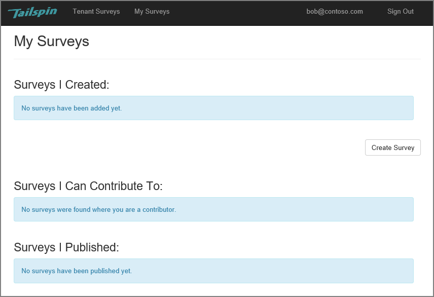

<properties
   pageTitle="À propos de l’application Tailspin enquêtes | Microsoft Azure"
   description="Présentation de l’application Tailspin enquêtes"
   services=""
   documentationCenter="na"
   authors="MikeWasson"
   manager="roshar"
   editor=""
   tags=""/>

<tags
   ms.service="guidance"
   ms.devlang="dotnet"
   ms.topic="article"
   ms.tgt_pltfrm="na"
   ms.workload="na"
   ms.date="05/23/2016"
   ms.author="mwasson"/>

# À propos de l’application Tailspin enquêtes

[AZURE.INCLUDE [pnp-header](../../includes/guidance-pnp-header-include.md)]

Cet article fait [partie d’une série]. Vous trouverez également un [exemple d’application] complète qui accompagne cette série.

Tailspin est fictif société qui développe une application SaaS nommée enquêtes. Cette application permet aux organisations de créer et publier des enquêtes en ligne.

- Une organisation peut s’inscrire pour l’application.
- Une fois que l’organisation est inscrit, les utilisateurs peuvent vous connecter à l’application avec leurs informations d’identification d’organisation.
- Les utilisateurs peuvent créer, modifier et publier des enquêtes.

> [AZURE.NOTE] Pour commencer à utiliser l’application, voir [l’exécution de l’application d’enquêtes].

## Les utilisateurs peuvent créer, modifier et afficher les enquêtes

Un utilisateur authentifié peut afficher tous les visites qu’il a créé ou dispose des droits de collaboration sur et créer de nouvelles enquêtes. Notez que l’utilisateur est connecté avec son identité d’organisation, `bob@contoso.com`.

Cette capture d’écran montre la page Modifier une enquête :

Les utilisateurs peuvent également afficher les enquêtes créées par d’autres utilisateurs dans le même client.

## Propriétaires d’enquête peuvent inviter des collaborateurs

Lorsqu’un utilisateur crée une enquête, il peut inviter d’autres personnes à définir comme collaborateurs sur l’enquête. Les collaborateurs peuvent modifier l’enquête, mais ne peut pas supprimer ou publiez-le.  

Un utilisateur peut ajouter des collaborateurs à partir d’autres clients, qui permet de client de manière croisée partage des ressources. Dans cette capture d’écran, Bob (`bob@contoso.com`) consiste à ajouter Alice (`alice@fabrikam.com`) en tant que collaborateur à une enquête Alexandre créé.

Lorsque Alice se connecte, elle voit l’enquête répertorié sous « Je peux contribuer à des enquêtes ».

Notez que Alice signe dans son propre client, pas en tant qu’invité du client Contoso. Alice dispose des autorisations de collaboration uniquement pour cette enquête &mdash; elle ne peut pas afficher d’autres enquêtes à partir du client de Contoso.

## Architecture

L’application enquêtes comprend un site web frontal et un serveur principal API web. Les deux sont implémentées à l’aide de [ASP.NET Core 1.0].

L’application web utilise Azure Active Directory (AD Azure) pour l’authentification des utilisateurs. L’application web appelle également Azure AD pour obtenir des jetons d’accès OAuth 2 pour l’API Web. Les jetons d’accès sont mises en cache dans le Cache Redis Azure. Le cache permet plusieurs instances partager le cache de jetons même (par exemple, dans une batterie de serveurs).

## Étapes suivantes

- Consultez l’article suivant de cette série : [authentification dans les applications partagées, à l’aide de Azure Active Directory et OpenID se connecter][authentication]

<!-- Links -->

[authentication]: guidance-multitenant-identity-authenticate.md
[partie d’une série]: guidance-multitenant-identity.md
[Exécution de l’application enquêtes]: https://github.com/Azure-Samples/guidance-identity-management-for-multitenant-apps/blob/master/docs/running-the-app.md
[Core ASP.NET 1.0]: https://docs.asp.net/en/latest/
[exemple d’application]: https://github.com/Azure-Samples/guidance-identity-management-for-multitenant-apps
