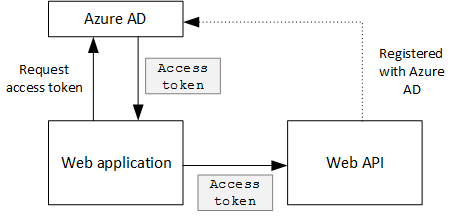
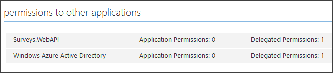

<properties
   pageTitle="Sécurisation d’un site web et API dans une application partagé | Microsoft Azure"
   description="Comment faire pour sécuriser un site web et API"
   services=""
   documentationCenter="na"
   authors="MikeWasson"
   manager="roshar"
   editor=""
   tags=""/>

<tags
   ms.service="guidance"
   ms.devlang="dotnet"
   ms.topic="article"
   ms.tgt_pltfrm="na"
   ms.workload="na"
   ms.date="06/02/2016"
   ms.author="mwasson"/>

# <a name="securing-a-backend-web-api-in-a-multitenant-application"></a>Sécurisation d’un site web et API dans une application partagé

[AZURE.INCLUDE [pnp-header](../../includes/guidance-pnp-header-include.md)]

Cet article fait [partie d’une série]. Vous trouverez également un [exemple d’application] complète qui accompagne cette série.

L’application [Tailspin enquêtes] utilise un site web et API pour gérer les opérations sur les enquêtes. Par exemple, lorsqu’un utilisateur clique sur « Mes enquêtes », l’application web envoie une demande HTTP sur le web API :

```
GET /users/{userId}/surveys
```

L’API web renvoie un objet JSON :

```
{
  "Published":[],
  "Own":[
    {"Id":1,"Title":"Survey 1"},
    {"Id":3,"Title":"Survey 3"},
    ],
  "Contribute": [{"Id":8,"Title":"My survey"}]
}
```

L’API web n’autorise pas les demandes anonymes, afin que l’application web doit s’authentifier à l’aide des jetons de porteur OAuth 2.

> [AZURE.NOTE] Il s’agit d’un scénario de serveur à serveur. L’application ne fait pas les appels AJAX à l’API à partir du client de navigateur.

Il existe deux principales approches :

- Identité utilisateur déléguée. L’application web authentifie avec l’identité de l’utilisateur.
- Identité de l’application. L’application web authentifie avec son ID client, à l’aide de flux des informations d’identification des clients oauth2 ne.

L’application Tailspin met en œuvre identité utilisateur délégué. Voici les principales différences :

**Identité utilisateur délégué**

- Le jeton PORTEUR envoyé à l’API web contient l’identité de l’utilisateur.
- L’API web prend des décisions d’autorisation en fonction de l’identité de l’utilisateur.
- L’application web doit gérer les 403 erreurs (refusé) à partir du web API, si l’utilisateur n’est pas autorisé à effectuer une action.
- En règle générale, l’application web toujours prend certaines décisions d’autorisation qui affectent l’interface utilisateur, tels que l’affichage ou masquage des éléments d’interface utilisateur).
- L’API web peut éventuellement être utilisée par des clients non approuvés, par exemple une application JavaScript ou une application cliente native.

**Identité de l’application**

- L’API web ne reçoit pas d’informations sur l’utilisateur.
- L’API web Impossible d’effectuer une autorisation basée sur l’identité de l’utilisateur. Toutes les décisions d’autorisation sont effectuées par l’application web.  
- L’API web ne peuvent pas être utilisé par un client non fiable (JavaScript ou application cliente native).
- Cette approche peut être un peu plus simple à mettre en œuvre, car il n’existe aucune logique d’autorisation dans l’API Web.

Dans les deux approches, l’application web doit obtenir un jeton d’accès, les informations d’identification nécessaires pour appeler l’API web.

- Pour une identité utilisateur délégué, le jeton doit provenir d’IDP, qui permet d’émettre un jeton au nom de l’utilisateur.

- Vos informations d’identification de client, une application peut obtenir le jeton de la IDP ou son propre serveur jeton d’hôte. (Mais pas écrire un serveur jeton à partir de zéro ; utilisez un cadre bien testé comme [IdentityServer3].) Si vous authentifiez avec Azure Active Directory, il est fortement recommandé pour obtenir le jeton d’accès à partir d’Azure AD, même si le flux des informations d’identification des clients.

Le reste de cet article suppose que l’application s’authentifie avec Azure AD.



## <a name="register-the-web-api-in-azure-ad"></a>Enregistrer l’API web dans Azure Active Directory

Dans l’ordre pour Azure AD émettre un jeton porteur pour le site web API, vous devez configurer certains éléments dans Azure AD.

1. [Enregistrer le site web API dans Azure Active Directory].

2. Ajouter l’ID de client de l’application web au manifeste d’application web API, dans le `knownClientApplications` propriété. Voir [mettre à jour les manifestes d’application].

3. [Donner l’autorisation d’application web pour appeler le API web].

  Dans le portail de gestion Azure, vous pouvez définir deux types d’autorisations : « Application les autorisations « d’identité de l’application (flux des informations d’identification des clients), ou « Délégué les autorisations « d’identité utilisateur délégué.

  

## <a name="getting-an-access-token"></a>Obtenir un jeton d’accès

Avant d’appeler l’API web, l’application web Obtient un accès jeton d’Azure Active Directory. Dans une application .NET, utilisez [Azure AD authentification bibliothèque (terme ADAL) pour .NET][ADAL].

Dans le flux de code autorisation OAuth 2, l’application échange un code d’autorisation pour un jeton d’accès. Le code suivant utilise terme ADAL pour obtenir le jeton d’accès. Ce code est appelé pendant la `AuthorizationCodeReceived` événement.

```csharp
// The OpenID Connect middleware sends this event when it gets the authorization code.   
public override async Task AuthorizationCodeReceived(AuthorizationCodeReceivedContext context)
{
    string authorizationCode = context.ProtocolMessage.Code;
    string authority = "https://login.microsoftonline.com/" + tenantID
    string resourceID = "https://tailspin.onmicrosoft.com/surveys.webapi" // App ID URI
    ClientCredential credential = new ClientCredential(clientId, clientSecret);

    AuthenticationContext authContext = new AuthenticationContext(authority, tokenCache);
    AuthenticationResult authResult = await authContext.AcquireTokenByAuthorizationCodeAsync(
        authorizationCode, new Uri(redirectUri), credential, resourceID);

    // If successful, the token is in authResult.AccessToken
}
```

Voici les différents paramètres sont nécessaires :

- `authority`. Dérivée de l’ID de client de l’utilisateur connecté. (Et non l’ID de client du fournisseur SaaS)  
- `authorizationCode`. code d’authentification que vous avez le IDP.
- `clientId`. ID de client. de l’application web
- `clientSecret`. Secret du client de l’application web.
- `redirectUri`. La redirection URI que vous avez défini pour OpenID se connecter. Il s’agit de l’endroit où le IDP rappelle avec le jeton.
- `resourceID`. L’URI ID d’application du site web API, que vous avez créé lors de l’inscription de l’API web dans Azure Active Directory
- `tokenCache`. Un objet qui met en cache les jetons d’accès. Voir [la mise en cache des jetons].

Si `AcquireTokenByAuthorizationCodeAsync` a réussi, le terme ADAL met en cache le jeton. Plus tard, vous pouvez obtenir le jeton à partir du cache en appelant AcquireTokenSilentAsync :

```csharp
AuthenticationContext authContext = new AuthenticationContext(authority, tokenCache);
var result = await authContext.AcquireTokenSilentAsync(resourceID, credential, new UserIdentifier(userId, UserIdentifierType.UniqueId));
```

où `userId` est l’ID d’objet de l’utilisateur, qui se trouve dans le `http://schemas.microsoft.com/identity/claims/objectidentifier` réclamer.

## <a name="using-the-access-token-to-call-the-web-api"></a>À l’aide du jeton d’accès d’appeler l’API web

Une fois que le jeton, envoyez-le dans l’en-tête d’autorisation des demandes HTTP à l’API web.

```
Authorization: Bearer xxxxxxxxxx
```

La méthode d’extension suivante à partir de l’application enquêtes définit l’en-tête d’autorisation sur une requête HTTP, à l’aide de la classe **HttpClient** .

```csharp
public static async Task<HttpResponseMessage> SendRequestWithBearerTokenAsync(this HttpClient httpClient, HttpMethod method, string path, object requestBody, string accessToken, CancellationToken ct)
{
    var request = new HttpRequestMessage(method, path);
    if (requestBody != null)
    {
        var json = JsonConvert.SerializeObject(requestBody, Formatting.None);
        var content = new StringContent(json, Encoding.UTF8, "application/json");
        request.Content = content;
    }

    request.Headers.Authorization = new AuthenticationHeaderValue("Bearer", accessToken);
    request.Headers.Accept.Add(new MediaTypeWithQualityHeaderValue("application/json"));

    var response = await httpClient.SendAsync(request, ct);
    return response;
}
```

> [AZURE.NOTE] Voir [HttpClientExtensions.cs].

## <a name="authenticating-in-the-web-api"></a>Dans le site web API d’authentification

Le site web API doit s’authentifier le jeton porteur. Dans ASP.NET Core 1.0, vous pouvez utiliser la [Microsoft.AspNet.Authentication.JwtBearer] [ JwtBearer] package. Ce package fournit des logiciels intermédiaires qui permet à l’application de recevoir des jetons de porteur OpenID se connecter.

Enregistrer les logiciels intermédiaires dans votre site web API `Startup` cours.

```csharp
app.UseJwtBearerAuthentication(options =>
{
    options.Audience = "[app ID URI]";
    options.Authority = "https://login.microsoftonline.com/common/";
    options.TokenValidationParameters = new TokenValidationParameters
    {
        //Instead of validating against a fixed set of known issuers, we perform custom multi-tenant validation logic
        ValidateIssuer = false,
    };
    options.Events = new SurveysJwtBearerEvents();
});
```

> [AZURE.NOTE] Voir [Startup.cs].

- **Audience**. Définissez cette option pour l’URL ID d’application pour le site web API, que vous avez créé lors de l’inscription de l’API web avec Azure AD.
- **Autorité**. Pour une application partagée, indiquez ce `https://login.microsoftonline.com/common/`.
- **TokenValidationParameters**. Pour une application partagée, définissez **ValidateIssuer** sur false. Cela signifie que l’application valide l’émetteur.
- **Événements** est une classe qui est dérivée de **JwtBearerEvents**.

### <a name="issuer-validation"></a>Validation de l’émetteur

Valider l’émetteur de jeton dans l’événement **JwtBearerEvents.ValidatedToken** . L’émetteur est envoyé dans la demande « iss ».

Dans l’application enquêtes, l’API web ne traite pas [d’abonnement à un client]. Par conséquent, il vérifie uniquement si l’émetteur est déjà dans la base de données de l’application. Si ce n’est pas le cas, il lève une exception, ce qui provoque l’échec de l’authentification.

```csharp
public override async Task ValidatedToken(ValidatedTokenContext context)
{
    var principal = context.AuthenticationTicket.Principal;
    var tenantManager = context.HttpContext.RequestServices.GetService<TenantManager>();
    var userManager = context.HttpContext.RequestServices.GetService<UserManager>();
    var issuerValue = principal.GetIssuerValue();
    var tenant = await tenantManager.FindByIssuerValueAsync(issuerValue);

    if (tenant == null)
    {
        // the caller was not from a trusted issuer - throw to block the authentication flow
        throw new SecurityTokenValidationException();
    }
}
```

> [AZURE.NOTE] Voir [SurveysJwtBearerEvents.cs].

Vous pouvez également utiliser l’événement **ValidatedToken** pour effectuer [la transformation de déclarations]. N’oubliez pas que les revendications proviennent directement d’Azure AD, afin que si l’application web avez-vous toutes les transformations revendications, ceux ne sont pas répercutées dans le jeton PORTEUR que l’API web reçoit.

## <a name="authorization"></a>Autorisation

Pour une présentation générale d’autorisation, consultez [autorisation basée sur les ressources et rôle][Authorization]. 

Logiciels intermédiaires JwtBearer gère les réponses d’autorisation. Par exemple, pour restreindre une action contrôleur aux utilisateurs authentifiés, utilisez l’atrribute **[autoriser]** et spécifiez **JwtBearerDefaults.AuthenticationScheme** en tant que le schéma d’authentification :

```csharp
[Authorize(ActiveAuthenticationSchemes = JwtBearerDefaults.AuthenticationScheme)]
```

Cela renvoie un code de 401 état si l’utilisateur n’est pas authentifié.

Pour restreindre une action contrôleur par la stratégie d’authorizaton, spécifiez le nom de stratégie dans l’attribut **[autoriser]** :

```csharp
[Authorize(Policy = PolicyNames.RequireSurveyCreator)]
```

Cela renvoie un code de 401 état si l’utilisateur n’est pas authentifié et 403 si l’utilisateur authentifié n’est pas autorisé. S’inscrire la stratégie au démarrage :

```csharp
public void ConfigureServices(IServiceCollection services)
{
    services.AddAuthorization(options =>
    {
        options.AddPolicy(PolicyNames.RequireSurveyCreator,
            policy =>
            {
                policy.AddRequirements(new SurveyCreatorRequirement());
                policy.AddAuthenticationSchemes(JwtBearerDefaults.AuthenticationScheme);
            });
    });
}
```

## <a name="next-steps"></a>Étapes suivantes

- Consultez l’article suivant de cette série : [mise en cache les jetons d’accès dans une application partagée][token cache]

<!-- links -->
[ADAL]: https://msdn.microsoft.com/library/azure/jj573266.aspx
[JwtBearer]: https://www.nuget.org/packages/Microsoft.AspNet.Authentication.JwtBearer
[partie d’une série]: guidance-multitenant-identity.md
[Enquêtes Tailspin]: guidance-multitenant-identity-tailspin.md
[IdentityServer3]: https://github.com/IdentityServer/IdentityServer3
[Enregistrer l’API web dans Azure Active Directory]: https://github.com/Azure-Samples/guidance-identity-management-for-multitenant-apps/blob/master/docs/running-the-app.md#register-the-surveys-web-api
[Mettre à jour les manifestes d’application]: https://github.com/Azure-Samples/guidance-identity-management-for-multitenant-apps/blob/master/docs/running-the-app.md#update-the-application-manifests
[Donner l’autorisation d’application web pour appeler le API web]: https://github.com/Azure-Samples/guidance-identity-management-for-multitenant-apps/blob/master/docs/running-the-app.md#give-the-web-app-permissions-to-call-the-web-api
[La mise en cache jetons]: guidance-multitenant-identity-token-cache.md
[HttpClientExtensions.cs]: https://github.com/Azure-Samples/guidance-identity-management-for-multitenant-apps/blob/master/src/Tailspin.Surveys.Common/HttpClientExtensions.cs
[Startup.cs]: https://github.com/Azure-Samples/guidance-identity-management-for-multitenant-apps/blob/master/src/Tailspin.Surveys.WebAPI/Startup.cs
[client d’abonnement]: guidance-multitenant-identity-signup.md
[SurveysJwtBearerEvents.cs]: https://github.com/Azure-Samples/guidance-identity-management-for-multitenant-apps/blob/master/src/Tailspin.Surveys.WebAPI/SurveyJwtBearerEvents.cs
[transformation des déclarations]: guidance-multitenant-identity-claims.md#claims-transformations
[Authorization]: guidance-multitenant-identity-authorize.md
[exemple d’application]: https://github.com/Azure-Samples/guidance-identity-management-for-multitenant-apps
[token cache]: guidance-multitenant-identity-token-cache.md
