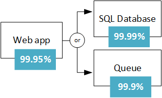
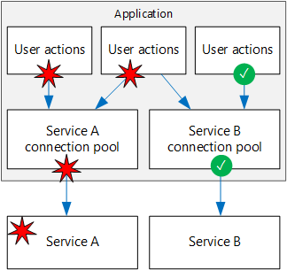

<properties
   pageTitle="Conception d’applications résistants | Microsoft Azure"
   description="Découvrez comment créer des applications résistants dans Azure, de haute disponibilité et récupération d’urgence."
   services=""
   documentationCenter="na"
   authors="MikeWasson"
   manager="christb"
   editor=""
   tags=""/>

<tags
   ms.service="guidance"
   ms.devlang="na"
   ms.topic="article"
   ms.tgt_pltfrm="na"
   ms.workload="na"
   ms.date="08/18/2016"
   ms.author="mwasson"/>
   
# Conception d’applications résistant pour Azure

Dans un système distribué, échecs seront produit. Matériel peut échouer. Le réseau peut avoir échecs temporaires. Rarement, un service entier ou une région peut-être expérimenter une interruption, mais même s’ils doivent être prévus. 

Création d’une application fiable dans le nuage est différente de la création d’une application fiable dans un environnement d’entreprise.  Tandis que par le passé vous avez acheté matériel haut de gamme d’évoluer, dans un environnement cloud vous devez évoluer plutôt que vers le haut. Les coûts pour les environnements de cloud sont conservées faibles au moyen de matériel. Au lieu de se concentrer sur la prévention des pannes et l’optimisation de « durée moyenne entre pannes », dans ce nouvel environnement le focus se déplace pour « délai moyen de restaurer. » L’objectif consiste à réduire l’impact d’une défaillance.

Cet article donne un aperçu de la façon de créer des applications résistants dans Microsoft Azure. Il commence par une définition de la *résilience* des termes et concepts qui sont associés. Il décrit ensuite un processus pour réaliser la résilience, à l’aide d’une approche structurée sur la durée d’une application, de la conception et implémentation, de déploiement et opérations.

## Quelle est la résilience ?

La **résilience** est la capacité à récupérer des défaillances et continue à fonctionner. Il n’est pas à *éviter les* échecs, mais pas *répondre* aux échecs d’une manière qui évite la perte de données ou de temps d’arrêt. L’objectif de résilience est qui renvoie l’application à un état entièrement fonctionnelle après une défaillance.

Deux aspects importants de résilience sont disponibilité et récupération d’urgence.

- **Disponibilité** (HA) est la possibilité de l’application pour continuer à fonctionner dans un état correct, sans temps d’arrêt important. « Opérationnel, » nous disons l’application est injoignable, et les utilisateurs peuvent se connecter à l’application et interagir avec lui.  

- **Récupération d’urgence** (DR) est la capacité à récupérer des incidents rares mais principales : échecs Non transitoires et grande échelle, telles que l’interruption de service qui affecte une région entière. Récupération d’urgence inclut la sauvegarde de données et d’archivage et peut inclure les interventions manuelles, telles que la restauration d’une base de données de sauvegarde. 

Un moyen de réflexion concernant HA et DR est que DR commence quand l’impact d’une erreur dépasse la possibilité de la conception HA à gérer. Par exemple, placer plusieurs machines virtuelles derrière un équilibrage de charge fournira disponibilité si une machine virtuelle échoue, mais pas s’ils sont tous échouent en même temps. 

Lorsque vous créez une application pour être résistant, vous devez comprendre vos conditions de disponibilité. Le temps d’inactivité est acceptable ? Il s’agit d’une fonction de coût partiellement. Quel sera arrêt potentiel coût votre entreprise ? Combien investir dans hautement disposition de l’application ? Vous devez également définir la signification de l’application soit disponible. Par exemple, est l’application « vers le bas » si un client peut envoyer une commande, mais le système ne peut pas le traiter dans la période normale ?

Un autre terme courant est **continuité** (BC), qui est la possibilité d’effectuer les fonctions d’entreprise essentielles pendant et après un incident. BC couvre toute l’opération de l’entreprise, y compris les installations physiques, des personnes, des communications, transport, et informatique. Dans cet article, nous nous efforçons, juste sous applications en nuage, mais résilience planification doit être effectuée dans le contexte des exigences BC globales. 

## Procédure à suivre pour obtenir la résilience

Résilience n’est pas un module complémentaire. Il doit être conçue dans le système et mis en pratique opérationnelle. Voici un modèle général à suivre :

1.  **Définir** votre disponibilité, selon les besoins professionnels

2.  **Création** de l’application de la résilience des. Commencer avec une architecture qui suit pratiques, puis identifiez les points de défaillance possibles dans cette architecture.

3.  **Mettre en œuvre** les stratégies pour détecter et réparer les échecs de. 

4.  **Test de** la mise en œuvre par simulation d’erreurs et de déclenchement basculement forcé. 

5.  **Déployer** l’application en production à l’aide d’un processus fiable et répétitif. 

6.  **Surveiller** l’application pour détecter les erreurs. Analyse du système, permet d’évaluer le bon fonctionnement de l’application et de répondre aux incidents si nécessaire. 

7.  **Répondre** s’il existe des incidents nécessitant interventions manuelles.

Dans la suite de cet article, nous étudier chacune de ces étapes plus en détail.

## Définition de vos besoins en matière de résilience

Planification de la résilience commence par besoins de l’entreprise. Voici certaines des approches de réflexion sur la résilience dans ces termes.

### Décomposer par la charge de travail

De nombreuses solutions de cloud sont constitués de plusieurs charges de travail application. Le terme « la charge de travail » dans ce contexte signifie une fonctionnalité discrète ou une tâche informatique, qui peut être séparée logiquement à partir d’autres tâches, en fonction des besoins de stockage logique et les données. Par exemple, une application de commerce peut-être inclure les charges de travail suivants :

- Parcourir et recherchez un catalogue produit.

- Créer et suivre des commandes.

- Consulter des recommandations.

Ces charges de travail peuvent avoir des exigences différentes de disponibilité, extensibilité élevées, la cohérence des données, sinistre et ainsi de suite. Là encore, il s’agit des décisions commerciales.

Pensez également à des modèles d’utilisation. Existe-t-il des certaines périodes critiques quand le système doit sera-t-il disponible ? Par exemple, un service Web de déclaration de taxe ne peuvent pas accéder à la suivante droite avant la date d’échéance classement ; une vidéo en continu service doit rester la pendant un événement sport ; et ainsi de suite. Au cours des périodes critiques, vous devrez déploiements redondantes dans différentes régions, afin que l’application peut basculer en cas d’échec d’une zone géographique. Toutefois, un déploiement de plusieurs région est plus cher, pendant les heures moins importantes, vous pouvez exécuter l’application d’une région spécifique.  

### RTO et RPO

Deux mesures importantes à prendre en considération sont les objectifs de temps et l’objectif de point de récupération :

- **Objectifs de temps** (RTO) est la durée maximale acceptable une application peut être indisponible après un incident. Si votre RTO est de 90 minutes, vous devez être en mesure de restaurer l’application à un état en cours d’exécution dans les 90 minutes depuis le début d’un incident. Si vous avez un RTO très faible, vous pouvez conserver un déploiement deuxième continuellement en cours d’exécution en veille, pour vous protéger contre une panne régionale.

- **Objectif de point de récupération** (RPO) est la durée maximale de perte de données est acceptable durant un incident. Par exemple, si vous stockez des données dans une seule base de données, avec aucune réplication vers d’autres bases de données et effectuez des sauvegardes toutes les heures, vous risquez de perdre jusqu'à une heure de données. 

RTO et RPO sont des besoins de l’entreprise. Un autre métrique courantes est le **temps moyen** (fonction), qui est la durée moyenne nécessaire pour restaurer l’application après une défaillance. FONCTION est un fait brute sur un système. Si la fonction dépasse le RTO, une défaillance dans le système entraînera une interruption professionnel inacceptable, car il n’est pas possible de restaurer le système dans le RTO défini. 

### SLA

Dans Azure, le [Contrat de niveau de Service] [ sla] (SLA) décrit les engagements de Microsoft pour la connectivité et de disponibilité. Si le contrat SLA pour un service particulier est 99,9 %, cela signifie que vous devez vous attendre le service soit disponible 99,9 % du temps.

> [AZURE.NOTE] Le SLA Azure inclut également des dispositions permettant d’obtenir un crédit de service si le contrat SLA n’est pas remplie, ainsi que des définitions spécifiques de « disponibilité » pour chaque service. Cet aspect de la SLA se comporte comme une stratégie d’application. 

Vous devez définir vos propres cible SLA pour chaque charge de travail dans votre solution. ACCORD permet de motif sur l’architecture, et si l’architecture répond aux besoins de l’entreprise. Par exemple, si une charge de travail nécessite 99,99 %, mais dépend du service avec un SLA 99,9 %, ce service ne peut pas être un seul point de panne du système. Une solution consiste à avoir une trajectoire de secours en cas de panne du service, ou prendre d’autres mesures pour récupérer une panne dans ce service. 

Le tableau suivant indique le temps d’arrêt cumulé potentiels pour divers niveaux de SLA. 

| SLA     | Temps d’arrêt par semaine | Temps d’arrêt par mois | Indisponibilité par an |
|---------|-------------------|--------------------|-------------------|
| 99 %     | heures 1.68        | 7.2 heures          | jours 3.65         |
| 99,9 %   | 10.1 minutes      | 43,2 minutes       | 8,76 heures        |
| 99,95 %  | 5 minutes         | 21,6 minutes       | heures 4,38        |
| 99,99 %  | minutes 1,01      | 4,32 minutes       | 52.56 minutes     |
| 99,999 % | 6 secondes         | secondes 25,9       | 5.26 minutes      |

Bien entendu, une plus grande disponibilité est préférable, tout le reste étant égal. Mais à mesure que vous efforcez de plus de 9 s, le coût et la complexité pour atteindre ce niveau de disponibilité augmente. Une disponibilité de 99,99 % se traduit par environ 5 minutes d’indisponibilité total par mois. Il est important de coût pour atteindre cinq 9 et la complexité supplémentaire ? La réponse dépend des besoins de l’entreprise. 

Voici quelques autres considérations lors de la définition d’accord :

- Pour atteindre quatre 9 (99,99 %), vous probablement ne peut pas s’appuient sur intervention manuelle afin de récupérer des défaillances. L’application doit être automatique diagnostic et spontanée. 

- Au-delà de quatre 9, il est difficile à détecter des défaillances assez rapidement pour atteindre les les ans.

- Réfléchissez à la fenêtre de temps que vos SLA est mesuré en fonction. La fenêtre est petite, plus tolérances. Il probablement ne représentatives pour définir votre SLA en termes de disponibilité horaire ou quotidienne. 

### SLA composite

Envisagez d’une application web application Service qui écrit dans la base de données SQL Azure. Au moment de la rédaction, ces services Azure ont les SLA suivants :

- Application Service Web applications = 99,95 %

- Base de données SQL = 99,99 %

Quel est le temps d’interruption maximum que vous pouvez attendre de cette application ? Si un service échoue, l’application entière échoue. En règle générale, la probabilité de chaque échec du service est indépendante, afin que le SLA composite de cette application est 99,95 % x 99,99 % = 99.94 %. Qui est inférieure aux niveaux de service individuels, qui n’est pas étonnant, car une application qui dépend de plusieurs services possède plusieurs points de défaillance potentiels. 

En revanche, vous pouvez améliorer le SLA composite en créant des chemins de secours indépendants. Par exemple, si la base de données SQL n’est pas disponible, placer les transactions dans une file d’attente, à traiter plus tard.

Avec ce modèle, l’application est toujours disponible même si elle ne peut pas se connecter à la base de données. Toutefois, il échoue si la base de données et la file d’attente échouent en même temps. Le pourcentage de temps d’une défaillance sonnerie attendu est 0,0001 x 0,001, afin que le contrat SLA composite pour ce chemin d’accès combiné est  

- File d’attente de base de données ou = 1.0 &minus; (0,0001 &times; 0.001) = 99.99999 %

Le SLA composite total est la suivante :

- Web app et (base de données en file d’attente OR) = 99,95 % &times; 99.99999 % = ~99.95%

Mais il existe compromis à cette approche. La logique de l’application est plus complexe, vous payez pour la file d’attente et il peut y avoir des problèmes de cohérence des données à prendre en compte.

**SLA pour les déploiements de plusieurs régions**. Une autre technique HA consiste à déployer l’application dans plusieurs régions et utilisez le Gestionnaire de trafic Azure pour basculer en cas d’échec de l’application dans une zone géographique. Pour un déploiement deux région, le contrat SLA composite se calcule comme suit. 

Soit *N* le contrat SLA composite pour l’application déployée dans une zone géographique. Le risque attendu l’application échoue dans les deux régions simultanément est (1 &minus; N) &times; (1 &minus; N). Par conséquent,

- Combinées SLA pour les deux régions = 1 &minus; (1 &minus; N) (1 &minus; N) = N + (1 &minus; N) N

Enfin, vous devez prendre dans le [Gestionnaire de trafic SLA][tm-sla]. Lors de la rédaction de cet article, le contrat SLA pour le trafic Gestionnaire SLA est 99,99 %.

- Composite SLA = 99,99 % &times; (combinées SLA pour les deux régions)

Un détail supplémentaire est que basculer n’est pas instantanée, qui peut entraîner une interruption de service pendant une défaillance. Voir le [contrôle de point de terminaison gestionnaire le trafic et basculement][tm-failover].

Le nombre de SLA calculé est une référence utile, mais elle ne disent pas tout sur la disponibilité. Souvent, une application peut se dégrader progressivement lorsqu’un chemin d’accès non critiques échoue. Prenez une application qui montre un catalogue de livres. Si l’application ne peut pas récupérer l’image miniature de la page de garde, il peut afficher une image d’espace réservé. Dans ce cas, ne parvient pas à obtenir l’image ne réduit pas la disponibilité de l’application, bien qu’il affecte l’expérience utilisateur.  

## Conception de la résilience des

Pendant la phase de conception, vous devez effectuer une analyse de mode échec (FMA). L’objectif d’une FMA est d’identifier les points de défaillance possibles et définir la manière dont l’application répondra à ces défaillances.

- Comment l’application détecte ce type de panne ?

- Comment l’application répondra à ce type de panne ?

- Comment vous connecter et surveiller ce type de panne ? 

Pour plus d’informations sur le processus FMA, avec des recommandations spécifiques pour Azure, voir [conseils supplémentaires sur la résilience Azure : analyse de l’échec en mode][fma].

### Exemple d’identification de stratégie de détection et des modes de défaillance

**Point d’échec :** Appel d’un service web externe / API.

| Mode de défaillance | Stratégie de détection |
|--------------|--------------------|
| Service n’est pas disponible | 5xx HTTP |
| La limitation | HTTP 429 (trop de requêtes) | 
| Authentification | HTTP 401 (non autorisé) | 
| Réponse lente | Demande arrive à expiration |

## Stratégies de résilience

Cette section fournit une enquête de certaines stratégies résilience courantes. La plupart d'entre elles n’est pas limitée à une technologie particulière. Les descriptions dans cette section sont destinées à synthétiser l’idée générale de chaque technique, avec des liens vers des informations complémentaires.

### Relancer échouées transitoires

Échecs temporaires peuvent être dû momentanément la connectivité réseau, une connexion de base de données supprimée ou un délai d’expiration lorsqu’un service est occupé (e). Souvent, une défaillance temporaire peut être résolue simplement en effectuant à nouveau la demande. Pour de nombreux services Azure, le Kit de développement logiciel client met en œuvre nouvelles tentatives automatiques, de façon transparente à l’appelant ; voir [Réessayer des recommandations spécifiques service][retry-service-specific guidance].

Chaque nouvelle tentative ajoute à la latence totale. En outre, échecs trop grand nombre de requêtes peuvent entraîner un critique, comme demandes en attente de s’accumuler dans la file d’attente. Ces requêtes bloquées peuvent contenir des ressources système critiques tels que la quantité de mémoire, threads, connexions de base de données et ainsi de suite, qui peut entraîner des erreurs en cascade. Pour éviter ce problème, augmenter le délai entre chaque nouvelle tentative et limiter le nombre total d’échecs de requêtes.

Pour plus d’informations, voir [Motif réessayer][retry-pattern].

### Équilibrage de charge pour plusieurs instances

Pour une extensibilité, une application en nuage doit être en mesure d’évoluer en ajoutant plusieurs instances. Cette approche améliore également la résilience, car instances défectueux peuvent être prises se déconnecter de rotation.  

Par exemple :

- Placez deux ou plusieurs ordinateurs virtuels derrière un équilibrage de charge. L’équilibrage de charge distribue le trafic vers tous les ordinateurs virtuels. Consultez [exécution de plusieurs ordinateurs virtuels sur Azure pour disponibilité et extensibilité élevées][ra-multi-vm].

- Déployer une application de Service d’application Azure à plusieurs instances. Application Service charger automatiquement les soldes pour plusieurs instances. Voir [application web base][ra-basic-web].

- Utiliser le [Gestionnaire de trafic Azure] [ tm] pour distribuer le trafic dans un jeu de points de terminaison.

### Réplication de données

Réplication de données est une stratégie générale pour gérer les erreurs non transitoires dans un magasin de données. De nombreuses technologies de stockage fournissent réplication intégrée, y compris la base de données SQL Azure, DocumentDB et Apache Cassandra.  

Il est important de prendre en considération les deux lire et écrire chemins d’accès. En fonction de la technologie de stockage, vous pouvez avoir plusieurs accessible en écriture réplicas, ou un seul réplica accessible en écriture et plusieurs en lecture seule. 

Pour optimiser la disponibilité, réplicas peuvent être placés dans plusieurs zones. Toutefois, cela augmente la latence pour répliquer les données. En règle générale, réplication via régions est effectuée en mode asynchrone, qui implique un modèle de cohérence éventuelle et la perte de données potentielle si un réplica échoue. 

### Dégradé

Si un service échoue et qu’aucun chemin de basculement, l’application pourrez peut-être dégradé, de façon à toujours fournit une expérience utilisateur acceptable. Par exemple :

- Placer un élément de travail dans une file d’attente, à exécuter ultérieurement. 

- Renvoyer une valeur estimée 

- Utiliser des données mises en cache localement. 

- Afficher l’utilisateur un message d’erreur. (Cette option est plue de l’application cesse de répondre aux demandes.)

### Limiter les utilisateurs volumineux

Un petit nombre d’utilisateurs créent parfois charge excessive. Qui peut avoir un impact sur d’autres utilisateurs, en réduisant la disponibilité générale de votre application.

Un seul client lorsqu’un trop grand nombre de requêtes, l’application peut limiter le client pour une période donnée. Pendant la période de limitation, l’application refuse tout ou partie des demandes de ce client (selon la stratégie de limitation exacte). Le seuil de limitation peut dépendre de niveau de service du client. 

La limitation n’implique pas que le client a été nécessairement agissant à des fins malveillantes. Cela signifie simplement que le client dépassé leur quota de service.  Dans certains cas, un consommateur est peut-être régulièrement dépassent leur quota ou dans le cas contraire comportement incorrect. Dans ce cas, vous pouvez aller plus loin et bloquer l’utilisateur. En règle générale, cela en bloquant une clé API ou une plage d’adresses IP.

Pour plus d’informations, voir [La limitation motif][throttling-pattern].

### Utiliser un séparateur de circuit  

Le modèle Circuit séparateur peut empêcher une application d’essayer à plusieurs reprises une opération qui peut échouer. L’exemple est d’un séparateur de circuit physique, un commutateur qui interrompt le flux de courant lorsqu’un circuit est surchargé.

Le séparateur de circuit d’appels vers un service à la ligne. Il possède trois états :

- **Fermé**. Il s’agit d’un état normal. Le séparateur de circuit envoie des demandes du service, et un compteur suit le nombre d’échecs récents. Si le nombre d’échecs dépasse un seuil pendant une période donnée, la coupure de circuit bascule vers l’état ouvert. 

- **Ouvrir**. Dans cet état, le séparateur de circuit échoue immédiatement toutes les demandes, sans appel du service. L’application doit utiliser un chemin d’accès d’atténuation, telles que la lecture de données à partir d’un réplica ou simplement renvoyant une erreur à l’utilisateur. Lorsque le séparateur de circuit bascule vers ouvrir, il démarre une horloge. Lorsque la temporisation expire, le séparateur de circuit bascule vers l’état moitié ouvertes.

- **Moitié ouvertes**. Dans cet état, le séparateur de circuit permet un nombre limité de demandes traitée au service. Si elles réussissent, le service est supposé égal à restaurer, puis le séparateur de circuit bascule vers l’état fermé. Dans le cas contraire, il revient à l’état ouvert. L’état de moitié ouvertes empêche un service de récupération de soudainement recevoir de requêtes.

Pour plus d’informations, voir [Modèle Circuit séparateur][circuit-breaker-pattern].

### Utilisez le nivellement de chargement pour atténuer les pointes de trafic

Les applications peuvent rencontrer soudains pointes de trafic, lequel peut surcharger les services sur le serveur principal. Si un service en aval ne peut pas répondre à des demandes assez rapidement, il peut provoquer des demandes en file d’attente (sauvegarder) ou de du service limiter l’application.

Pour éviter ce problème, vous pouvez utiliser une file d’attente en tant que tampon. Lorsqu’il y a un nouvel élément de travail, au lieu d’appeler le service en aval immédiatement, l’application en file d’attente un élément de travail à exécuter en mode asynchrone. La file d’attente se comporte comme un tampon lisse les variations lors du chargement. 

Pour plus d’informations, voir [basée sur la file d’attente de chargement l’audit motif][load-leveling-pattern].

### Isoler les ressources critiques 

Échecs de sous-systèmes peuvent parfois engendrer en cascade, à l’origine d’échecs dans d’autres parties de l’application. Cela peut arriver si une défaillance provoque des ressources, tels que des threads ou sockets, ne pas à obtenir libéré au moment opportun, et causer épuisement des ressources. 

Pour éviter ce problème, vous pouvez partition un système en groupes isolés, afin qu’une défaillance dans une partition ne les met pas vers le bas de l’ensemble du système. Cette technique est parfois appelée le modèle de cloisonnement.

Exemples :

- Partition d’une base de données, par exemple, par client--et attribuer une plage distincte d’instances de serveur web pour chaque partition.  
- Utiliser des pools de threads distincts à isoler les appels vers différents services. Cela permet d’éviter les échecs en cascade si un des services échoue. Pour obtenir un exemple, consultez Netflix [bibliothèque Hystrix][hystrix].

- Utiliser des [conteneurs] [ containers] pour limiter les ressources disponibles pour un sous-système particulier. 

### Appliquer des transactions compensatoires 

Une transaction de compensation est une transaction qui annule les effets d’une autre opération terminée.

Dans un système distribué, il peut être difficile à obtenir la cohérence des forte. Transactions compensatoires constituent un moyen pour garantir la cohérence à l’aide d’une série de transactions individuelles plus petites, qui peuvent être annulées à chaque étape.

Par exemple, pour réserver un voyage, un client peut réserver une voiture, un hôtel et un vol. Si une de ces étapes échoue, l’opération entière échoue. Au lieu d’essayer d’utiliser une seule transaction distribuée pour l’intégralité de l’opération, vous pouvez définir une transaction de compensation pour chaque étape. Par exemple, pour annuler une réservation voiture, annuler la réservation. Pour terminer l’opération entière, un coordinateur s’exécute chaque étape. Si une étape échoue, le coordinateur applique les transactions compensateurs pour annuler toutes les étapes qui ont été achevées. 

Pour plus d’informations, voir [Compensation Transaction motif][compensating-transaction-pattern]. 

## Test de la résilience des

En règle générale, vous ne pouvez pas tester la résilience de la même façon que vous testez les fonctionnalités application (en exécutant des tests unitaires et ainsi de suite). À la place, vous devez tester la façon dont la charge de travail de bout en bout effectue sous les conditions d’échec, ce qui par définition ne se produisent tout le temps.

Test fait partie d’un processus itératif. Tester l’application, le résultat de mesure, analyser et corriger les erreurs éventuelles résultat et répétez le processus.

**Test de panne injection**. Testez la résilience du système aux échecs, déclenchement échecs réels ou en simuler les. Voici quelques scénarios courants échec pour tester :

- Fermez les instances de machine virtuelle.

- Arrêter le processus.

- Expiration des certificats.

- Touches d’accès rapide modification.

- Arrêter le service DNS sur le domaine.

- Limiter les ressources système disponibles, par exemple RAM ou nombre de threads.

- Décharger disques.

- Redéployez une machine virtuelle.

Mesurer les temps de récupération et vérifiez qu’elles correspondent à vos besoins. Combinaisons de modes d’échec, ainsi que de test. Assurez-vous qu’échecs n’en cascade et sont gérées de manière isolée.

Il s’agit d’une autre raison pour laquelle il est important d’analyser les points de défaillance possibles pendant la phase de conception. Les résultats de cette analyse doivent être entrées dans votre plan de test.

**Tests de charge**. Test de charge de l’application à l’aide d’un outil tel que [Visual Studio Team Services] [ vsts] ou [Apache JMeter] [ jmeter] test de charge est crucial pour identifier les erreurs qui se produisent uniquement en charge, telles que la base de données principale sentez ou la limitation de service. Test de pic de charge, à l’aide de données de production, ou les données synthétiques à proximité des données de production que possible. L’objectif consiste à observer le comporte de l’application dans des conditions réelles.   

## Déploiement résistant

Une fois qu’une application est déployée en production, mises à jour sont une source possible d’erreurs. Dans le pire des cas, une mise à jour incorrecte peut provoquer des interruptions liées aux tâches. Pour éviter ce problème, le processus de déploiement doit être prévisibles et renouvelable. Déploiement inclut la mise en service des ressources Azure, le déploiement de code de l’application et appliquer des paramètres de configuration. Une mise à jour peut impliquer ces trois ou un sous-ensemble. 

Le point essentiel est que les déploiements manuels sont sources d’erreurs. Par conséquent, il est recommandé d’avoir un processus idempotent automatisé, vous pouvez exécuter à la demande et exécutez à nouveau si quelque chose échoue. 

- Modèles de gestionnaire de ressources permet d’automatiser la mise en service des ressources Azure.

- Utiliser [Configuration de l’état souhaité Azure Automation] [ dsc] (DSC) pour configurer des ordinateurs virtuels.

- Utiliser un processus de déploiement automatisé pour le code de l’application.

Déploiement de contenu lié à résistant concepts deux sont *infrastructure sous forme de code* et *l’infrastructure immuable*.

- **Infrastructure comme code** consiste à utiliser le code pour la mise en service et la configuration de l’infrastructure. Infrastructure comme code peut utiliser une approche déclarative ou une approche impérative (ou une combinaison des deux). Modèles de gestionnaire de ressources sont un exemple d’une approche déclarative. Les scripts PowerShell sont un exemple d’une approche impérative.

- **Infrastructure immuable** est le principe que vous ne devez pas modifier infrastructure après que qu’il est déployé en production. Dans le cas contraire, vous pouvez accéder à l’état dans lequel les modifications ad hoc ont été appliquées, il est difficile de savoir exactement ce qui a changé et difficile à motif sur le système. 

Une autre question est comment déployer une mise à jour de l’application. Nous vous recommandons de techniques telles que le déploiement bleu-vert ou versions canary, qui transmission de mises à jour dans hautement contrôlé permet de limiter l’impact possible à partir d’un déploiement incorrect.

- [Bleu-vert déploiement] [ blue-green] est une technique où vous déployez une mise à jour dans un environnement de production séparée à partir de l’application live. Une fois que vous validez le déploiement, basculez le routage le trafic vers la version mise à jour. Par exemple, Azure Application Service Web Apps permet ce de [reclassement emplacements][staging-slots]. 

- [Versions Canary] [ canary-release] sont similaires aux déploiement bleu-vert. Au lieu de passer tout le trafic à la version mise à jour, vous déployez la mise à jour à un faible pourcentage d’utilisateurs, par une partie du trafic le routage vers le nouveau déploiement. Si un problème se pose, interruption et revenir à l’ancien déploiement. Dans le cas contraire, acheminer le trafic plus vers la nouvelle version, jusqu'à ce qu’elle atteigne 100 % du trafic.

N’importe quelle approche vous prenez, vérifiez que vous pouvez revenir à la dernière bonne-déploiement, au cas où la nouvelle version ne fonctionne pas. En outre, si des erreurs se produisent, il doit être possible à identifier à partir des journaux d’application quelle version a provoqué l’erreur. 

## Surveillance et diagnostic

Surveillance et les diagnostics sont essentiels la résilience des. En cas de problème, vous devez savoir qu’a échoué et que vous devez comprendre la cause du problème. 

Analyse d’un système distribué à grande échelle pose un défi. Réfléchissez à une application qui s’exécute sur plusieurs ordinateurs douzaines virtuels : il n’est pas possible de se connecter à chaque machine virtuelle, une à la fois et parcourez les fichiers journaux, tenter de résoudre un problème. En outre, le nombre d’instances de machine virtuelle n’est probablement pas statique. Machines virtuelles sont ajoutés et supprimés et arrière en tant que les échelles de l’application, et il peut arriver qu’une instance peut échouer et que vous devez être configuré. En outre, une application en nuage typique peut utiliser plusieurs banques de données (stockage Azure, base de données SQL, DocumentDB, Redis cache), et une seule opération s’étend sur plusieurs sous-systèmes. 

Vous pouvez considérer le processus de surveillance et de diagnostic comme un pipeline avec plusieurs étapes distinctes :

- **Instrumentation**. Les données brutes pour surveillance et diagnostics provient d’une variété de sources, notamment les journaux des applications, journaux de serveur web, compteurs de performances du système d’exploitation, les journaux de base de données et diagnostics intégrés dans la plateforme Azure. Les services plus Azure ont une fonctionnalité diagnostics que vous pouvez utiliser pour identifier la cause des problèmes de synchronisation.

- **Collecte et stockage**. Les données d’instrumentation brutes peuvent être contenues dans une vaste gamme d’emplacements et avec différents formats (application les journaux de suivi, compteurs de performance, les journaux IIS). Ces sources variées sont collectées consolidés et mettre en stock fiable.

- **Analyse et diagnostic**. Une fois que les données consolidées, il peut être analysé, afin de résoudre les problèmes et fournir une vue d’ensemble de l’état de l’application.

- **Visualisation et les alertes**. Dans cette étape, les données de télémétrie sont présentées de façon à ce qu’un opérateur peut repérer rapidement les tendances ou des problèmes. Exemple inclure des tableaux de bord ou alertes de messagerie.  

Surveillance est différente de la détection de défaillance. Par exemple, votre application peut détecter une transitoires erreur et réessayer, ce qui crée de sans interruption de service. Mais il doit également enregistrer l’opération de nouvelle tentative, afin que vous pouvez surveiller le taux d’erreur, afin d’obtenir une vue d’ensemble de l’état de l’application. 

Journaux d’application sont une importante source de données de diagnostic. Voici quelques pratiques recommandées pour la journalisation de l’application :

- Ouvrez une session en production. Dans le cas contraire, vous perdez un aperçu moments très lorsque vous en avez le plus besoin.

- Journal des événements au niveau des limites de service. Inclure un ID de corrélation passe au-delà des limites de service. Si X transaction traversant plusieurs services et une d’elles échoue, l’ID de corrélation vous permettra de pinpoint pourquoi la transaction a échoué.

- Utiliser sémantique journalisation, également appelée structurée journalisation. Les journaux non structurées rendent difficile à automatiser la consommation et l’analyse des données journal, ce qui sont nécessaire à l’échelle de cloud.

- Utiliser la fonctionnalité de journalisation asynchrone. Dans le cas contraire, le système de journalisation peut entraîner l’application échoue, par à l’origine des demandes à sauvegarder, car ils empêcher attend pour écrire un enregistrement de l’événement.

- Journalisation de l’application n’est pas différente de celle d’audit. L’audit peut être effectuée pour des raisons réglementaires ou de conformité. Dès lors, les enregistrements d’audit doivent être complètes, et il n’est pas acceptables pour supprimer un pendant le traitement des transactions. Si une application requiert l’audit, il doit être conservé distincte de la journalisation des diagnostics. 

Pour plus d’informations sur la surveillance et les diagnostics, voir [recommandations pour la surveillance et les diagnostics de][monitoring-guidance].

## Réponses échec manuel

Les sections précédentes ont axée sur les stratégies de récupération automatique, critiques de disponibilité. Toutefois, intervention parfois manuelle est nécessaire.

- **Alertes**. Surveiller votre application pour les signaux qui peuvent nécessiter l’intervention proactive. Par exemple, si vous voyez que base de données SQL ou DocumentDB limite de manière cohérente à travers votre application, vous devrez peut-être augmenter la capacité de votre base de données ou optimiser vos requêtes. Dans cet exemple, même si l’application peut gérer les erreurs limitation en toute transparence, votre télémétrie doit déclencher toujours une alerte, afin que vous pouvez assurer un suivi.  

- **Basculement manuel**. Certains systèmes ne peut pas basculer automatiquement et requièrent un basculement manuel. 

- **Test de disponibilité opérationnelle**. Si votre application bascule vers une zone secondaire, vous devez effectuer un test opérationnelle avant que vous ne parvenez pas à la région principale. Le test doit vérifier que la zone primaire est correct et prêt à recevoir le trafic à nouveau.

- **Vérifier la cohérence des données**. Si une erreur se produit dans un magasin de données, peut-être des incohérences de données lorsque le magasin redevienne disponible, surtout si les données a été répliquées. 

- **Restauration de sauvegarde**. Par exemple, si la base de données SQL connaît une panne régionale, vous pouvez geo-restaurer la base de données à partir de la dernière sauvegarde.

Document et testez votre plan de récupération. Inclure des procédures écrites pour certaines d'entre elles manuel, telles que le basculement manuel, restauration des données à partir de sauvegardes et ainsi de suite. 

## Résumé

Cet article étudié la résilience du point de vue globale, mettre en évidence certains des défis uniques du cloud. Ceux-ci incluent la nature distribuée du cloud computing, l’utilisation de matériel et de la présence de fautes de réseau transience.

Voici les principaux points à prendre en s’éloignant de cet article :

- Résilience permet d’accéder à une plus grande disponibilité et réduction du délai moyen pour récupérer des échecs. 

- Obtention résilience dans le cloud nécessite un ensemble de techniques différent à partir de solutions traditionnel en local. 

- Résilience n’a pas lieu par inadvertance. Il doit être conçu et intégré à partir du début.

- Résilience touche chaque partie du cycle de vie application, de la planification et codage aux opérations.

- Test et surveillez !

## Étapes suivantes

- [Liste de vérification de la résilience] [ resiliency-checklist] contient des recommandations qui vous aideront à planifier pour divers modes de panne qui peut se produire.

- [Analyse de l’échec en mode] [ fma] (FMA) est un processus pour la création de la résilience dans un système, en identifiant les points de défaillance possibles. Comme point de départ pour votre processus FMA, cet article contient un catalogue des modes échec potentiels et leur minimisation. 

- Vous trouverez ici des ressources supplémentaires : [assistance technique résilience Azure](../resiliency/resiliency-technical-guidance.md) 

<!-- links -->

[blue-green]: http://martinfowler.com/bliki/BlueGreenDeployment.html
[canary-release]: http://martinfowler.com/bliki/CanaryRelease.html
[circuit-breaker-pattern]: https://msdn.microsoft.com/library/dn589784.aspx
[compensating-transaction-pattern]: https://msdn.microsoft.com/library/dn589804.aspx
[containers]: https://en.wikipedia.org/wiki/Operating-system-level_virtualization
[dsc]: https://azure.microsoft.com/documentation/articles/automation-dsc-overview/
[fma]: guidance-resiliency-failure-mode-analysis.md
[hystrix]: http://techblog.netflix.com/2012/11/hystrix.html
[jmeter]: http://jmeter.apache.org/
[load-leveling-pattern]: https://msdn.microsoft.com/library/dn589783.aspx
[monitoring-guidance]: https://azure.microsoft.com/documentation/articles/best-practices-monitoring/
[ra-basic-web]: https://azure.microsoft.com/documentation/articles/guidance-web-apps-basic/
[ra-multi-vm]: https://azure.microsoft.com/documentation/articles/guidance-compute-multi-vm/
[resiliency-checklist]: guidance-resiliency-checklist.md
[retry-pattern]: https://msdn.microsoft.com/library/dn589788.aspx
[retry-service-specific guidance]: https://azure.microsoft.com/documentation/articles/best-practices-retry-service-specific/
[sla]: https://azure.microsoft.com/support/legal/sla/
[staging-slots]: https://azure.microsoft.com/documentation/articles/guidance-web-apps-basic/
[throttling-pattern]: https://msdn.microsoft.com/library/dn589798.aspx
[tm]: https://azure.microsoft.com/services/traffic-manager/
[tm-failover]: https://azure.microsoft.com/documentation/articles/traffic-manager-monitoring/
[tm-sla]: https://azure.microsoft.com/support/legal/sla/traffic-manager/v1_0/
[vsts]: https://www.visualstudio.com/features/vso-cloud-load-testing-vs.aspx
