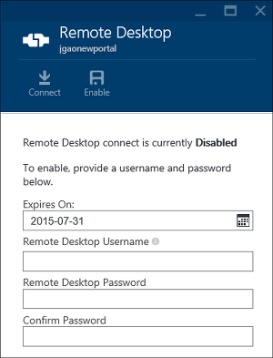

<properties
    pageTitle="Gérer les groupes de Hadoop dans un HDInsight à l’aide du portail Azure | Microsoft Azure"
    description="Découvrez comment administrer HDInsight Service. Créer un cluster de HDInsight, ouvrez la console JavaScript interactif et ouvrez la console de commande Hadoop."
    services="hdinsight"
    documentationCenter=""
    tags="azure-portal"
    authors="mumian"
    manager="jhubbard"
    editor="cgronlun"/>

<tags
    ms.service="hdinsight"
    ms.workload="big-data"
    ms.tgt_pltfrm="na"
    ms.devlang="na"
    ms.topic="article"
    ms.date="09/14/2016"
    ms.author="jgao"/>

# Gérer les groupes Hadoop dans un HDInsight à l’aide du portail Azure

[AZURE.INCLUDE [selector](../../includes/hdinsight-portal-management-selector.md)]

À l’aide du [portail Azure][azure-portal], vous pouvez créer Hadoop clusters dans Azure HDInsight, modifier le mot de passe utilisateur Hadoop et activer le protocole RDP (Remote Desktop) pour pouvoir accéder à la console de commande Hadoop sur le cluster.

Les informations contenues dans cet article s’applique uniquement aux clusters HDInsight basée sur la fenêtre. Pour plus d’informations sur la gestion des clusters basés sur Linux, cliquez sur le sélecteur de tabulation ci-dessus.

Cliquez sur le sélecteur de tabulation pour plus d’informations sur la création de clusters Hadoop dans HDInsight à l’aide d’autres outils. 

**Conditions préalables**

Avant de commencer cet article, vous devez disposer des éléments suivants :

- **Azure un abonnement**. Voir [Azure obtenir la version d’évaluation gratuite](https://azure.microsoft.com/documentation/videos/get-azure-free-trial-for-testing-hadoop-in-hdinsight/).
- **Compte de stockage azure** - HDInsight un cluster utilise un conteneur de stockage Blob Azure en tant que le système de fichiers par défaut. Pour plus d’informations sur le stockage d’objets Blob Azure offre une expérience transparente avec clusters HDInsight, voir [Utiliser Azure Blob Storage avec HDInsight](hdinsight-hadoop-use-blob-storage.md). Pour plus d’informations sur la création d’un compte de stockage Azure, Découvrez [comment créer un compte de stockage](../storage/storage-create-storage-account.md).

##Ouvrez le portail

1. Se connecter à [https://portal.azure.com](https://portal.azure.com).
2. Une fois que vous ouvrez le portail, vous pouvez :

    - Cliquez sur **Nouveau** dans le menu de gauche pour créer un nouveau cluster :
    
        
    - Dans le menu de gauche, cliquez sur **Clusters HDInsight** .
    
        

    Si **HDInsight** n’apparaît pas dans le menu de gauche, cliquez sur **Parcourir**. 

    

##Créer des clusters

Pour obtenir des instructions de la création à l’aide du portail, consultez [créer HDInsight clusters](hdinsight-provision-clusters.md#create-using-the-preview-portal).

HDInsight fonctionne avec une large gamme de Hadoop composants. Pour la liste des composants qui ont été vérifiés et pris en charge, voir [Quelle est la version de Hadoop est dans Azure HDInsight](hdinsight-component-versioning.md). Vous pouvez personnaliser HDInsight à l’aide d’une des options suivantes :

- Action de Script permet d’exécuter des scripts personnalisés que vous peuvent personnaliser un cluster pour changer la configuration du cluster ou installer des composants personnalisés tels que Giraph ou mode série sur LAN.r. Pour plus d’informations, voir [cluster HDInsight personnaliser à l’aide de Script Action](hdinsight-hadoop-customize-cluster.md).
- Utiliser les paramètres de personnalisation cluster dans le Kit de développement .NET HDInsight ou PowerShell Azure lors de la création de cluster. Ces modifications de configuration sont conservées puis via la durée de vie du cluster et ne sont pas affectées par reimages de nœud de cluster plateforme Azure exécute régulièrement pour la maintenance. Pour plus d’informations sur l’aide des paramètres de personnalisation cluster, consultez [créer HDInsight clusters](hdinsight-provision-clusters.md).
- Certains composants Java natives, tels que Mahout et en cascade, peuvent être exécutés sur le cluster en tant que fichiers JAR. Ces fichiers JAR peuvent être distribués à Azure Blob storage et envoyées à HDInsight clusters via mécanismes de soumission Hadoop travail. Pour plus d’informations, voir [Soumettre Hadoop travaux par programme](hdinsight-submit-hadoop-jobs-programmatically.md).

    >[AZURE.NOTE] Si vous rencontrez des problèmes déployer fichiersJAR HDInsight clusters ou appel fichiersJAR sur clusters HDInsight, contactez le [Support Microsoft](https://azure.microsoft.com/support/options/).

    > Cascade n’est pas pris en charge par HDInsight et n’est pas éligible pour le Support Microsoft. Pour les listes de composants pris en charge, voir [Quelles sont les nouveautés dans les versions cluster fournies par HDInsight ?](hdinsight-component-versioning.md).

Installation du logiciel personnalisé sur le cluster à l’aide de connexion Bureau à distance n’est pas pris en charge. Évitez de stocker les fichiers sur les lecteurs du nœud principal, telles qu’elles seront perdues si vous devez recréer les groupes. Nous vous recommandons de stockage des fichiers sur le stockage d’objets Blob Azure. Stockage d’objets BLOB est permanente.

##Liste et afficher les clusters

1. Se connecter à [https://portal.azure.com](https://portal.azure.com).
2. Dans le menu de gauche, cliquez sur **Clusters HDInsight** .
3. Cliquez sur le nom du cluster. Si la liste cluster est longue, vous pouvez utiliser le filtre en haut de la page.
4. Double-cliquez sur un cluster à partir de la liste pour afficher les détails.

    **Menu et essentials**:

    
    
    - Pour personnaliser le menu, avec le bouton droit n’importe où dans le menu, puis cliquez sur **Personnaliser**.
    - **Paramètres** et **Tous les paramètres**: affiche la carte de **paramètres** pour le cluster, qui permet d’accéder aux informations de configuration détaillées pour le cluster.
    - **Tableau de bord**, **Tableau de bord Cluster** et **l’URL : il s’agit des toutes les manières d’accéder au tableau de bord cluster, ce qui correspond à Ambari Web pour les clusters basés sur Linux. - **Secure Shell ** : affiche les instructions pour vous connecter au cluster à l’aide de connexion SSH (Secure Shell).
    - **Échelle Cluster**: permet de modifier le nombre de nœuds de travail pour ce cluster.
    - **Supprimer**: supprime le cluster.
    - **Démarrage rapide ()**: affiche les informations qui vous aidera à commencer à utiliser HDInsight.
    - **Les utilisateurs ()**: vous permet de définir des autorisations pour la _gestion du portail_ de ce cluster destiné aux autres utilisateurs de votre abonnement Azure.
    
        > [AZURE.IMPORTANT] Cette _uniquement_ affecte accès et les autorisations pour ce cluster dans le portail Azure et n’a aucun effet sur qui peut se connecter à ou soumettre des tâches au cluster HDInsight.
    - **Balises ()**: marqueurs permet de définir des paires clé/valeur pour définir une classification personnalisée de vos services cloud. Par exemple, vous pouvez créer une clé nommée __project__et ensuite utiliser une valeur commune pour tous les services associés à un projet spécifique.
    - **Affichages Ambari**: liens vers Ambari Web.
    
    > [AZURE.IMPORTANT] Pour gérer les services fournis par le cluster HDInsight, vous devez utiliser Ambari Web ou l’API REST Ambari. Pour plus d’informations sur l’utilisation de Ambari, voir [clusters HDInsight gérer à l’aide de Ambari](hdinsight-hadoop-manage-ambari.md).

    **L’utilisation**:
    
    
    
5. Cliquez sur **paramètres**.

    

    - **Propriétés**: afficher les propriétés du cluster.
    - **Cluster AAD identité**: 
    - **Clés de stockage Azure**: permet d’afficher le compte de stockage par défaut et sa clé. Le compte de stockage est configuration au cours du processus de création de cluster.
    - **Connexion cluster**: modifier le nom d’utilisateur cluster HTTP et le mot de passe.
    - **Metastores externes**: afficher la metastores Hive et Oozie. La metastores peut uniquement être configuré pendant le processus de création de cluster.
    - **Échelle Cluster**: augmenter et diminuer le nombre de nœuds de travail.
    - **Bureau à distance**: activer et désactiver l’accès Bureau à distance (RDP) et configurer le nom d’utilisateur RDP.  Le nom d’utilisateur RDP doit être différent du nom d’utilisateur HTTP.
    - **Partenaire d’enregistrement**:
    
    > [AZURE.NOTE] Il s’agit d’une liste générique des paramètres disponibles ; pas toutes seront présentera pour tous les types de cluster.

6. Cliquez sur **Propriétés**:

    Les listes de propriétés suivantes :
    
    - **Hostname**: nom de Cluster.
    - **URL de cluster**.
    - **État**: inclure abandonnée, accepté, ClusterStorageProvisioned, AzureVMConfiguration, HDInsightConfiguration, opérationnelle, en cours d’exécution, erreur, la suppression, supprimé, avec délai dépassé, DeleteQueued, DeleteTimedout, DeleteError, PatchQueued, CertRolloverQueued, ResizeQueued, ClusterCustomization
    - **Région**: emplacement Azure. Pour obtenir la liste des emplacements Azure pris en charge, voir **la zone de liste déroulante** sur [HDInsight tarifs](https://azure.microsoft.com/pricing/details/hdinsight/).
    - **Données créées**.
    - **Système d’exploitation**: **Windows** ou **Linux**.
    - **Type**: Hadoop, HBase, vague de, au service. 
    - **Version**. Voir les [versions HDInsight](hdinsight-component-versioning.md)
    - **Abonnement**: nom de l’abonnement.
    - **ID de l’abonnement**.
    - **Source de données principale**. Le compte de stockage Blob Azure utilisé par défaut système de fichiers Hadoop.
    - **Nœuds collaborateur tarifs niveau**.
    - **Niveau de tarification de nœud de tête**.

##Supprimer les clusters

Supprimer un cluster ne supprime pas le compte de stockage par défaut ou les comptes de stockage liées. Vous pouvez recréer le cluster en utilisant les mêmes comptes de stockage et le même metastores.

1. Connectez-vous au [portail][azure-portal].
2. Cliquez sur **Rechercher tout** dans le menu de gauche, cliquez sur **Clusters HDInsight**, cliquez sur le nom de votre cluster.
3. Cliquez sur **Supprimer** dans le menu supérieur et suivez les instructions.

Voir aussi [Pause/arrêter clusters](#pauseshut-down-clusters).

##Enverguez
Le cluster mise à l’échelle fonctionnalité permet de modifier le nombre de nœuds de travail utilisés par un cluster qui s’exécute dans Azure HDInsight sans avoir à recréer le cluster.

>[AZURE.NOTE] Clusters uniquement avec HDInsight version 3.1.3 ou version ultérieure sont prises en charge. Si vous n’êtes pas sûr de la version de votre cluster, vous pouvez vérifier la page Propriétés.  Voir la [liste et afficher clusters](#list-and-show-clusters).

L’impact de la modification du nombre de nœuds de données pour chaque type de cluster pris en charge par HDInsight :

- Hadoop

    Vous pouvez en toute transparence augmenter le nombre de nœuds de travail dans un cluster Hadoop qui s’exécute sans ayant un impact sur toutes les tâches en attente ou en cours d’exécution. Nouvelles tâches peuvent également être soumises lorsque l’opération est en cours. Échecs dans une opération de mise à l’échelle sont gérées correctement afin que le cluster est toujours vers la gauche dans un état de fonctionnalité.

    Lorsqu’un cluster Hadoop est mise à l’échelle en réduisant le nombre de nœuds de données vers le bas, certains des services dans le cluster redémarrage. Ainsi, en cours d’exécution et les tâches en attente échec à la fin de l’opération de mise à l’échelle. Vous pouvez, cependant, renvoyez les tâches une fois l’opération terminée.

- HBase

    Vous pouvez en toute transparence ajouter ou supprimer des nœuds à votre cluster HBase en cours d’exécution. Les serveurs régionaux sont réparties automatiquement après quelques minutes de fin de l’opération de mise à l’échelle. Toutefois, vous pouvez également manuellement équilibrer les serveurs régionaux en vous connectant à la headnode de cluster et exécutant les commandes suivantes dans une fenêtre d’invite de commandes :

        >pushd %HBASE_HOME%\bin
        >hbase shell
        >balancer

    Pour plus d’informations sur l’utilisation de l’interface HBase, voir]
- Vague d'

    Vous pouvez en toute transparence ajouter ou supprimer des nœuds de données à votre cluster vague en cours d’exécution. Mais après la réussite de l’opération de mise à l’échelle, vous devrez rééquilibrer la topologie.

    Il est possible de rééquilibrage de deux façons :

    * Interface utilisateur du web vague
    * Outil de l’interface de ligne (commande)

    Reportez-vous à la [documentation de vague d’Apache](http://storm.apache.org/documentation/Understanding-the-parallelism-of-a-Storm-topology.html) pour plus d’informations.

    L’interface utilisateur du web vague est disponible sur le cluster HDInsight :

    

    Voici un exemple de l’utilisation de la commande de l’infrastructure du langage commun rééquilibrer la topologie vague :

        ## Reconfigure the topology "mytopology" to use 5 worker processes,
        ## the spout "blue-spout" to use 3 executors, and
        ## the bolt "yellow-bolt" to use 10 executors

        $ storm rebalance mytopology -n 5 -e blue-spout=3 -e yellow-bolt=10

**Mettre à l’échelle clusters**

1. Connectez-vous au [portail][azure-portal].
2. Cliquez sur **Rechercher tout** dans le menu de gauche, cliquez sur **Clusters HDInsight**, cliquez sur le nom de votre cluster.
3. Cliquez sur **paramètres** dans le menu supérieur, puis cliquez sur **Échelle Cluster**.
4. Entrez les **nœuds du nombre de travail**. La limite du nombre de nœud de cluster varie selon les abonnements Azure. Vous pouvez contacter le support de facturation pour augmenter la limite.  Les informations de coût reflètent les modifications que vous avez apportées au nombre de nœuds.

    

##Pause/arrêter clusters

La plupart des travaux Hadoop sont lots sont uniquement exécuté occasionnellement. Pour la plupart des clusters Hadoop, il existe de grandes périodes de temps le cluster n’est pas utilisé pour le traitement. Avec HDInsight, vos données sont stockées dans le stockage Azure, afin de supprimer en toute sécurité un cluster lorsqu’elle n’est pas en cours d’utilisation.
Vous êtes également chargé pour un cluster de HDInsight, même lorsqu’elle n’est pas en cours d’utilisation. Dans la mesure où les frais pour le cluster sont plus autant de fois que les frais de stockage, il est préférable économique de supprimer clusters lorsqu’ils ne sont pas en cours d’utilisation.

Il existe plusieurs façons, vous pouvez programmer le processus :

- Utilisateur données Azure Factory. Voir [Service liées Azure HDInsight](../data-factory/data-factory-compute-linked-services.md) et [transformer, puis analyser à l’aide d’Azure Data Factory](../data-factory/data-factory-data-transformation-activities.md) pour les services HDInsight lié à la demande et définis par l’utilisateur.
- Utiliser PowerShell Azure.  Voir [analyse des données de vol retard](hdinsight-analyze-flight-delay-data.md).
- Utilisez Azure infrastructure du langage commun. Voir [clusters HDInsight gérer à l’aide de Azure infrastructure du langage commun](hdinsight-administer-use-command-line.md).
- Utilisez le Kit de développement .NET HDInsight. Voir [Hadoop soumettre des travaux](hdinsight-submit-hadoop-jobs-programmatically.md).

Pour les informations de tarification, voir [HDInsight tarifs](https://azure.microsoft.com/pricing/details/hdinsight/). Pour supprimer un cluster à partir du portail, consultez [Supprimer clusters](#delete-clusters)

##Nom d’utilisateur cluster de modification

Un cluster HDInsight peut avoir deux comptes d’utilisateurs. Le compte d’utilisateur HDInsight cluster est créé pendant le processus de création. Vous pouvez également créer un compte d’utilisateur RDP pour accéder au cluster via RDP. Consultez [activer Bureau à distance](#connect-to-hdinsight-clusters-by-using-rdp).

**Pour modifier le nom d’utilisateur cluster HDInsight et le mot de passe**

1. Connectez-vous au [portail][azure-portal].
2. Cliquez sur **Rechercher tout** dans le menu de gauche, cliquez sur **Clusters HDInsight**, cliquez sur le nom de votre cluster.
3. Cliquez sur **paramètres** dans le menu supérieur, puis cliquez sur **Login Cluster**.
4. Si **login Cluster** a été activé, vous devez cliquez sur **désactiver**, puis cliquez sur **Activer** avant de pouvoir modifier le nom d’utilisateur et mot de passe...
4. Modifier le **Nom de connexion Cluster** et/ou le **Cluster mot de passe**, puis cliquez sur **Enregistrer**.

    

##Accès grant/revoke

HDInsight clusters comprennent les services web HTTP suivants (tous ces services ont des extrémités RESTful) :

- ODBC
- JDBC
- Ambari
- Oozie
- Templeton

Par défaut, ces services sont accordées pour l’accès. Vous pouvez révoquer/accorder l’accès à partir du portail Azure.

>[AZURE.NOTE] Par l’octroi/révoquer l’accès, vous allez réinitialiser le cluster nom utilisateur et mot de passe.

**Pour accorder/révoquer l’accès aux services HTTP web**

1. Connectez-vous au [portail][azure-portal].
2. Cliquez sur **Rechercher tout** dans le menu de gauche, cliquez sur **Clusters HDInsight**, cliquez sur le nom de votre cluster.
3. Cliquez sur **paramètres** dans le menu supérieur, puis cliquez sur **Login Cluster**.
4. Si **login Cluster** a été activé, vous devez cliquez sur **désactiver**, puis cliquez sur **Activer** avant de pouvoir modifier le nom d’utilisateur et mot de passe...
6. Nom **d’Utilisateur de connexion Cluster** et **Cluster mot de passe**, entrez le nouveau nom d’utilisateur et mot de passe (respectivement) pour le cluster.
7. Cliquez sur **Enregistrer**.

    

##Trouver le compte de stockage par défaut

Chaque cluster HDInsight a un compte de stockage par défaut. Le compte de stockage par défaut et ses clés pour un cluster apparaît sous **paramètres**/**Propriétés**/**Clés de stockage Azure**. Voir la [liste et afficher clusters](#list-and-show-clusters).

    
##Recherchez le groupe de ressources 

Dans le mode directeur des ressources Azure, chaque cluster HDInsight est créée avec un groupe de ressources Azure. Le groupe de ressources Azure appartenant à un cluster apparaît :

- La liste cluster possède une colonne de **Groupe de ressources** .
- Vignette **essentielles** cluster.  

Voir la [liste et afficher clusters](#list-and-show-clusters).
   
##Ouvrir la console de requête HDInsight

La console HDInsight requête inclut les fonctionnalités suivantes :

- **Galerie mise en route**: pour utiliser la galerie, voir [Hadoop apprendre à l’aide de la galerie Azure HDInsight prise en main](hdinsight-learn-hadoop-use-sample-gallery.md).
- **Éditeur de ruche**: interface web graphique utilisateur A soumettre des tâches Hive.  Voir [la ruche exécuter des requêtes à l’aide de la Console de requête](hdinsight-hadoop-use-hive-query-console.md).

    

- **Historique des travaux**: travaux Hadoop moniteur.  

    

    Cliquez sur le **Nom de la requête** pour afficher les détails, y compris les propriétés du travail, **Requête de travail**, et ** sortie des tâches. Vous pouvez également télécharger la requête et la sortie sur votre poste de travail.

- **Explorateur de fichiers**: parcourir le compte de stockage par défaut et les comptes de stockage liées.

    

    Dans la capture d’écran, la **<Account>** type indique l’élément est un compte de stockage Azure.  Cliquez sur le nom du compte pour parcourir les fichiers.
    
- **Interface utilisateur Hadoop**.

    
    
    À partir de **Hadoop l’interface utilisateur*, vous pouvez parcourir les fichiers et recherchez dans les journaux. 

- **Fils de l’interface utilisateur**.

    

##Exécuter des requêtes Hive

À exécuté Hive travaux à partir du portail, cliquez sur **Éditeur ruche** dans la console de requête HDInsight. Voir [console ouvrir la requête HDInsight](#open-hdinsight-query-console).

##Surveillance des tâches

Pour contrôler les tâches à partir du portail, cliquez sur **Historique du travail** dans la console de requête HDInsight. Voir [console ouvrir la requête HDInsight](#open-hdinsight-query-console).

##Parcourir les fichiers

Pour consulter les fichiers stockés dans le compte de stockage par défaut et les comptes de stockage liées, cliquez sur **Explorateur de fichiers** dans la console de requête HDInsight. Voir [console ouvrir la requête HDInsight](#open-hdinsight-query-console).

Vous pouvez également utiliser l’utilitaire de **Parcourir le système de fichiers** à partir de l' **Interface utilisateur Hadoop** dans la console HDInsight.  Voir [console ouvrir la requête HDInsight](#open-hdinsight-query-console).

##Surveillez l’utilisation du cluster

La section de __l’utilisation__ de la cuillère cluster HDInsight affiche des informations sur le nombre de cœurs disponibles à votre abonnement pour une utilisation avec HDInsight, ainsi que le nombre de cœurs affectés à ce cluster et comment ils sont alloués pour les nœuds au sein de ce groupe. Voir la [liste et afficher clusters](#list-and-show-clusters).

> [AZURE.IMPORTANT] Pour contrôler les services fournis par le cluster HDInsight, vous devez utiliser Ambari Web ou l’API REST Ambari. Pour plus d’informations sur l’utilisation de Ambari, voir [clusters HDInsight gérer à l’aide de Ambari](hdinsight-hadoop-manage-ambari.md)

##Ouvrez l’interface utilisateur Hadoop

Pour contrôler le cluster, parcourir le système de fichiers et recherchez dans les journaux, cliquez sur **L’interface utilisateur Hadoop** dans la console de requête HDInsight. Voir [console ouvrir la requête HDInsight](#open-hdinsight-query-console).

##Ouvrir des fils de l’interface utilisateur

Pour utiliser l’interface utilisateur fils, cliquez sur **L’interface utilisateur fils** dans la console de requête HDInsight. Voir [console ouvrir la requête HDInsight](#open-hdinsight-query-console).

##Se connecter à clusters à l’aide de RDP

Les informations d’identification pour le cluster que vous avez fourni lors de sa création accorder l’accès aux services sur le cluster, mais pas pour le cluster lui-même via le Bureau à distance. Vous pouvez activer l’accès Bureau à distance lorsque vous configurez un cluster ou après qu’un cluster est mis en service. Pour obtenir des instructions sur l’activation du Bureau à distance lors de la création, voir [créer HDInsight cluster](hdinsight-provision-clusters.md).

**Pour activer le Bureau à distance**

1. Connectez-vous au [portail][azure-portal].
2. Cliquez sur **Rechercher tout** dans le menu de gauche, cliquez sur **Clusters HDInsight**, cliquez sur le nom de votre cluster.
3. Cliquez sur **paramètres** dans le menu supérieur, puis cliquez sur **Bureau à distance**.
4. Entrez **Expire**, **Nom d’utilisateur de bureau à distance** et **Mot de passe de bureau à distance**, puis cliquez sur **Activer**.

    

    Les valeurs par défaut pour l’expiration est une semaine.
> [AZURE.NOTE] Vous pouvez également utiliser le Kit de développement .NET HDInsight pour activer le Bureau à distance sur un cluster. Utilisez la méthode **EnableRdp** sur l’objet de client HDInsight de la manière suivante : **client. EnableRdp (nomducluster, emplacement, « rdpuser », « rdppassword », DateTime.Now.AddDays(6))**. De même, pour désactiver le Bureau à distance sur le cluster, vous pouvez utiliser **client. DisableRdp (nomducluster, emplacement)**. Pour plus d’informations sur ces méthodes, voir [Référence du Kit de développement logiciel .NET HDInsight](http://go.microsoft.com/fwlink/?LinkId=529017). Cela s’applique uniquement aux clusters HDInsight fonctionnant sous Windows.

**Se connecter à un cluster à l’aide de RDP**

1. Connectez-vous au [portail][azure-portal].
2. Cliquez sur **Rechercher tout** dans le menu de gauche, cliquez sur **Clusters HDInsight**, cliquez sur le nom de votre cluster.
3. Cliquez sur **paramètres** dans le menu supérieur, puis cliquez sur **Bureau à distance**.
4. Cliquez sur **se connecter** , puis suivez les instructions. Si la connexion est désactivée, vous devez l’activer tout d’abord. Assurez-vous que le Bureau à distance d’utilisateur et mot de passe.  Vous ne pouvez pas utiliser les informations d’identification utilisateur de Cluster.

##Ouvrez la ligne de commande Hadoop

Pour vous connecter au cluster à l’aide de bureau à distance et utilisez la ligne de commande Hadoop, vous devez tout d’abord activer l’accès Bureau à distance au cluster comme décrit dans la section précédente.

**Pour ouvrir une ligne de commande Hadoop**

1. Connectez-vous au cluster à l’aide de bureau à distance.
8. À partir du bureau, double-cliquez sur **ligne de commande Hadoop**.

    ![HDI. HadoopCommandLine][image-hadoopcommandline]

    Pour plus d’informations sur les commandes Hadoop, voir [référence des commandes Hadoop](http://hadoop.apache.org/docs/current/hadoop-project-dist/hadoop-common/CommandsManual.html).

Dans la capture d’écran précédente, le nom du dossier comporte le numéro de version Hadoop incorporé. Le numéro de version modifiables en fonction de la version des composants Hadoop installés sur le cluster. Vous pouvez utiliser des variables d’environnement Hadoop pour faire référence à ces dossiers. Par exemple :

    cd %hadoop_home%
    cd %hive_home%
    cd %hbase_home%
    cd %pig_home%
    cd %sqoop_home%
    cd %hcatalog_home%
    
##Étapes suivantes
Dans cet article, vous avez appris comment créer un cluster HDInsight à l’aide du portail et comment ouvrir l’outil de ligne de commande Hadoop. Pour plus d’informations, consultez les articles suivants :

* [Administrer HDInsight à l’aide de PowerShell Azure](hdinsight-administer-use-powershell.md)
* [Administrer HDInsight à l’aide d’Azure infrastructure du langage commun](hdinsight-administer-use-command-line.md)
* [Créer des clusters HDInsight](hdinsight-provision-clusters.md)
* [Soumettre des travaux d’Hadoop par programme](hdinsight-submit-hadoop-jobs-programmatically.md)
* [Prise en main Azure HDInsight](hdinsight-hadoop-linux-tutorial-get-started.md)
* [Quelle est la version de Hadoop est Azure HDInsight ?](hdinsight-component-versioning.md)

[azure-portal]: https://portal.azure.com
[image-hadoopcommandline]: ./media/hdinsight-administer-use-management-portal/hdinsight-hadoop-command-line.png "Ligne de commande Hadoop"
