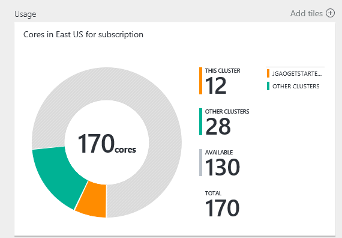

<properties
    pageTitle="Gérer les groupes de Hadoop basé sur Linux dans un HDInsight à l’aide du portail Azure | Microsoft Azure"
    description="Découvrez comment créer et gérer les HDInsight basé sur Linux à l’aide du portail Azure."
    services="hdinsight"
    documentationCenter=""
    authors="mumian"
    manager="jhubbard"
    editor="cgronlun"
    tags="azure-portal"/>

<tags
    ms.service="hdinsight"
    ms.workload="big-data"
    ms.tgt_pltfrm="na"
    ms.devlang="na"
    ms.topic="article"
    ms.date="08/10/2016"
    ms.author="jgao"/>

#Gérer les groupes Hadoop dans un HDInsight à l’aide du portail Azure

[AZURE.INCLUDE [selector](../../includes/hdinsight-portal-management-selector.md)]

À l’aide du [portail Azure][azure-portal], vous pouvez gérer les groupes de basé sur Linux dans Azure HDInsight. Utilisez le sélecteur de tabulation pour plus d’informations sur la création de clusters Hadoop dans HDInsight à l’aide d’autres outils. 

**Conditions préalables**

Avant de commencer cet article, vous devez disposer des éléments suivants :

- **Azure un abonnement**. Voir [Azure obtenir la version d’évaluation gratuite](https://azure.microsoft.com/documentation/videos/get-azure-free-trial-for-testing-hadoop-in-hdinsight/).

##Ouvrez le portail

1. Se connecter à [https://portal.azure.com](https://portal.azure.com).
2. Une fois que vous ouvrez le portail, vous pouvez :

    - Cliquez sur **Nouveau** dans le menu de gauche pour créer un nouveau cluster :
    
        
    - Cliquez sur **HDInsight Clusters** dans le menu de gauche pour répertorier les groupes existants
    
        

        Si **HDInsight** n’apparaît pas dans le menu de gauche, cliquez sur **Parcourir**, puis cliquez sur **Clusters HDInsight**.

        

##Créer des clusters

[AZURE.INCLUDE [delete-cluster-warning](../../includes/hdinsight-delete-cluster-warning.md)]

HDInsight fonctionne avec une large gamme de Hadoop composants. Pour la liste des composants qui ont été vérifiés et pris en charge, voir [Quelle est la version de Hadoop est dans Azure HDInsight](hdinsight-component-versioning.md). Pour la cluster général la création d’informations, voir [Hadoop créer des groupes dans un HDInsight](hdinsight-hadoop-provision-linux-clusters.md). 

##Liste et afficher les clusters

1. Se connecter à [https://portal.azure.com](https://portal.azure.com).
2. Cliquez sur **HDInsight Clusters** dans le menu de gauche pour répertorier les groupes existants.
3. Cliquez sur le nom du cluster. Si la liste cluster est longue, vous pouvez utiliser le filtre en haut de la page.
4. Double-cliquez sur un cluster à partir de la liste pour afficher les détails.

    **Menu et essentials**:

    
    
    - **Paramètres** et **Tous les paramètres**: affiche la carte de **paramètres** pour le cluster, qui permet d’accéder aux informations de configuration détaillées pour le cluster.
    - **Tableau de bord**, **Tableau de bord Cluster** et ** URL : il s’agit des toutes les manières d’accéder au tableau de bord cluster, ce qui correspond à Ambari Web pour les clusters basés sur Linux.
    - **Secure Shell**: affiche les instructions pour vous connecter au cluster à l’aide de connexion SSH (Secure Shell).
    - **Échelle Cluster**: permet de modifier le nombre de nœuds de travail pour ce cluster.
    - **Supprimer**: supprime le cluster.
    - **Démarrage rapide ()**: affiche les informations qui vous aidera à commencer à utiliser HDInsight.
    - **Les utilisateurs ()**: vous permet de définir des autorisations pour la _gestion du portail_ de ce cluster destiné aux autres utilisateurs de votre abonnement Azure.
    
        > [AZURE.IMPORTANT] Cette _uniquement_ affecte accès et les autorisations pour ce cluster dans le portail Azure et n’a aucun effet sur qui peut se connecter à ou soumettre des tâches au cluster HDInsight.
    - **Balises ()**: marqueurs permet de définir des paires clé/valeur pour définir une classification personnalisée de vos services cloud. Par exemple, vous pouvez créer une clé nommée __project__et ensuite utiliser une valeur commune pour tous les services associés à un projet spécifique.
    - **Affichages Ambari**: liens vers Ambari Web.
    
    > [AZURE.IMPORTANT] Pour gérer les services fournis par le cluster HDInsight, vous devez utiliser Ambari Web ou l’API REST Ambari. Pour plus d’informations sur l’utilisation de Ambari, voir [clusters HDInsight gérer à l’aide de Ambari](hdinsight-hadoop-manage-ambari.md).

    **L’utilisation**:
    
    
    
5. Cliquez sur **paramètres**.

    

    - **Journaux d’audit**:
    - **Démarrage rapide**: affiche des informations qui vous aidera à commencer à utiliser HDInsight.
    - **Échelle Cluster**: augmenter et diminuer le nombre de nœuds de travail.
    - **Secure Shell**: affiche les instructions pour vous connecter au cluster à l’aide de connexion SSH (Secure Shell).
    - **HDInsight partenaire**: ajouter/supprimer le partenaire HDInsight en cours.
    - **Metastores externes**: afficher la metastores Hive et Oozie. La metastores peut uniquement être configuré pendant le processus de création de cluster.
    - **Actions de script**: Bash exécuter des scripts sur le cluster.
    - **Propriétés**: afficher les propriétés du cluster.
    - **Clés de stockage Azure**: permet d’afficher le compte de stockage par défaut et sa clé. Le compte de stockage est configuration au cours du processus de création de cluster.
    - **Cluster AAD identité**: 
    - **Utilisateurs**: vous permet de définir des autorisations pour la _gestion du portail_ de ce cluster destiné aux autres utilisateurs de votre abonnement Azure.
    - **Balises**: marqueurs permet de définir des paires clé/valeur pour définir une classification personnalisée de vos services cloud. Par exemple, vous pouvez créer une clé nommée __project__et ensuite utiliser une valeur commune pour tous les services associés à un projet spécifique.
    
    > [AZURE.NOTE] Il s’agit d’une liste générique des paramètres disponibles ; pas toutes seront présentera pour tous les types de cluster.

6. Cliquez sur **Propriétés**:

    Les propriétés sont :
    
    - **Hostname**: nom de Cluster.
    - **URL de cluster**.
    - **État**: inclure abandonnée, accepté, ClusterStorageProvisioned, AzureVMConfiguration, HDInsightConfiguration, opérationnelle, en cours d’exécution, erreur, la suppression, supprimé, avec délai dépassé, DeleteQueued, DeleteTimedout, DeleteError, PatchQueued, CertRolloverQueued, ResizeQueued, ClusterCustomization
    - **Région**: emplacement Azure. Pour obtenir la liste des emplacements Azure pris en charge, voir **la zone de liste déroulante** sur [HDInsight tarifs](https://azure.microsoft.com/pricing/details/hdinsight/).
    - **Données créées**.
    - **Système d’exploitation**: **Windows** ou **Linux**.
    - **Type**: Hadoop, HBase, vague de, au service. 
    - **Version**. Voir les [versions HDInsight](hdinsight-component-versioning.md)
    - **Abonnement**: nom de l’abonnement.
    - **ID de l’abonnement**.
    - **Source de données par défaut**: le système de fichiers de cluster par défaut.
    - **Nœuds collaborateur tarifs niveau**.
    - **Niveau de tarification de nœud de tête**.

##Supprimer les clusters

Supprimer un cluster ne supprime pas le compte de stockage par défaut ou les comptes de stockage liées. Vous pouvez recréer le cluster en utilisant les mêmes comptes de stockage et le même metastores. Il est recommandé d’utiliser un nouveau conteneur Blob par défaut lorsque vous recréez le cluster.

1. Connectez-vous au [portail][azure-portal].
2. Cliquez sur **Rechercher tout** dans le menu de gauche, cliquez sur **Clusters HDInsight**, cliquez sur le nom de votre cluster.
3. Cliquez sur **Supprimer** dans le menu supérieur et suivez les instructions.

Voir aussi [Pause/arrêter clusters](#pauseshut-down-clusters).

##Enverguez
Le cluster mise à l’échelle fonctionnalité permet de modifier le nombre de nœuds de travail utilisés par un cluster qui s’exécute dans Azure HDInsight sans avoir à recréer le cluster.

>[AZURE.NOTE] Clusters uniquement avec HDInsight version 3.1.3 ou version ultérieure sont prises en charge. Si vous n’êtes pas sûr de la version de votre cluster, vous pouvez vérifier la page Propriétés.  Voir la [liste et afficher clusters](#list-and-show-clusters).

L’impact de la modification du nombre de nœuds de données pour chaque type de cluster pris en charge par HDInsight :

- Hadoop

    Vous pouvez en toute transparence augmenter le nombre de nœuds de travail dans un cluster Hadoop qui s’exécute sans ayant un impact sur toutes les tâches en attente ou en cours d’exécution. Nouvelles tâches peuvent également être soumises lorsque l’opération est en cours. Échecs dans une opération de mise à l’échelle sont gérées correctement afin que le cluster est toujours vers la gauche dans un état de fonctionnalité.

    Lorsqu’un cluster Hadoop est mise à l’échelle en réduisant le nombre de nœuds de données vers le bas, certains des services dans le cluster redémarrage. Ainsi, en cours d’exécution et les tâches en attente échec à la fin de l’opération de mise à l’échelle. Vous pouvez, cependant, renvoyez les tâches une fois l’opération terminée.

- HBase

    Vous pouvez en toute transparence ajouter ou supprimer des nœuds à votre cluster HBase en cours d’exécution. Les serveurs régionaux sont réparties automatiquement après quelques minutes de fin de l’opération de mise à l’échelle. Toutefois, vous pouvez également manuellement équilibrer les serveurs régionaux en vous connectant à la headnode de cluster et exécutant les commandes suivantes dans une fenêtre d’invite de commandes :

        >pushd %HBASE_HOME%\bin
        >hbase shell
        >balancer

    Pour plus d’informations sur l’utilisation de l’interface HBase, voir]
- Vague d'

    Vous pouvez en toute transparence ajouter ou supprimer des nœuds de données à votre cluster vague en cours d’exécution. Mais après la réussite de l’opération de mise à l’échelle, vous devrez rééquilibrer la topologie.

    Il est possible de rééquilibrage de deux façons :

    * Interface utilisateur du web vague
    * Outil de l’interface de ligne (commande)

    Reportez-vous à la [documentation de vague d’Apache](http://storm.apache.org/documentation/Understanding-the-parallelism-of-a-Storm-topology.html) pour plus d’informations.

    L’interface utilisateur du web vague est disponible sur le cluster HDInsight :

    

    Voici un exemple de l’utilisation de la commande de l’infrastructure du langage commun rééquilibrer la topologie vague :

        ## Reconfigure the topology "mytopology" to use 5 worker processes,
        ## the spout "blue-spout" to use 3 executors, and
        ## the bolt "yellow-bolt" to use 10 executors

        $ storm rebalance mytopology -n 5 -e blue-spout=3 -e yellow-bolt=10

**Mettre à l’échelle clusters**

1. Connectez-vous au [portail][azure-portal].
2. Cliquez sur **Rechercher tout** dans le menu de gauche, cliquez sur **Clusters HDInsight**, cliquez sur le nom de votre cluster.
3. Cliquez sur **paramètres** dans le menu supérieur, puis cliquez sur **Échelle Cluster**.
4. Entrez les **nœuds du nombre de travail**. La limite du nombre de nœud de cluster varie selon les abonnements Azure. Vous pouvez contacter le support de facturation pour augmenter la limite.  Les informations de coût reflètent les modifications que vous avez apportées au nombre de nœuds.

    

##Pause/arrêter clusters

La plupart des travaux Hadoop sont lots sont uniquement exécuté occasionnellement. Pour la plupart des clusters Hadoop, il existe de grandes périodes de temps le cluster n’est pas utilisé pour le traitement. Avec HDInsight, vos données sont stockées dans le stockage Azure, afin de supprimer en toute sécurité un cluster lorsqu’elle n’est pas en cours d’utilisation.
Vous êtes également chargé pour un cluster de HDInsight, même lorsqu’elle n’est pas en cours d’utilisation. Dans la mesure où les frais pour le cluster sont plus autant de fois que les frais de stockage, il est préférable économique de supprimer clusters lorsqu’ils ne sont pas en cours d’utilisation.

Il existe plusieurs façons, vous pouvez programmer le processus :

- Utilisateur données Azure Factory. Pour créer des services de HDInsight lié à la demande, voir [créer à la demande Hadoop basé sur Linux clusters dans HDInsight à l’aide d’Azure Data Factory](hdinsight-hadoop-create-linux-clusters-adf.md) .
- Utiliser PowerShell Azure.  Voir [analyse des données de vol retard](hdinsight-analyze-flight-delay-data.md).
- Utilisez Azure infrastructure du langage commun. Voir [clusters HDInsight gérer à l’aide de Azure infrastructure du langage commun](hdinsight-administer-use-command-line.md).
- Utilisez le Kit de développement .NET HDInsight. Voir [Hadoop soumettre des travaux](hdinsight-submit-hadoop-jobs-programmatically.md).

Pour les informations de tarification, voir [HDInsight tarifs](https://azure.microsoft.com/pricing/details/hdinsight/). Pour supprimer un cluster à partir du portail, consultez [Supprimer clusters](#delete-clusters)

##Modifier les mots de passe

Un cluster HDInsight peut avoir deux comptes d’utilisateurs. La HDInsight cluster (également appelé compte d’utilisateur Compte d’utilisateur HTTP) et le compte d’utilisateur SSH sont créés pendant le processus de création. Vous pouvez le web Ambari l’interface utilisateur pour modifier le cluster utilisateur nom d’utilisateur et mot de passe et actions de script pour modifier le compte d’utilisateur SSH

###Modifier le mot de passe utilisateur

Vous pouvez utiliser l’interface utilisateur Web Ambari pour modifier le mot de passe utilisateur. Pour vous connecter à Ambari, vous devez utiliser le nom d’utilisateur cluster existant et le mot de passe.

> [AZURE.NOTE] Si vous changez le mot de passe utilisateur (administrateur), cela peut entraîner le script actions exécutées ce cluster échec. Si vous avez les actions de script persistante que nœuds de travail cible, il peuvent échouer lorsque vous ajoutez des nœuds au cluster via redimensionnement opérations. Pour plus d’informations sur les actions de script, voir [Personnaliser HDInsight clusters à l’aide des actions de script](hdinsight-hadoop-customize-cluster-linux.md).

1. Connectez-vous à l’interface de Web Ambari en utilisant les informations d’identification utilisateur de HDInsight cluster. Le nom d’utilisateur par défaut est **admin**. L’URL est **https://&lt;HDInsight Cluster nom > azurehdinsight.net**.
2. Cliquez sur **administrateur** dans le menu supérieur, puis cliquez sur « Gérer Ambari ». 
3. Dans le menu de gauche, cliquez sur **utilisateurs**.
4. Cliquez sur **administrateur**.
5. Cliquez sur **Modifier le mot de passe**.

Ambari puis modifie le mot de passe sur tous les nœuds du cluster.

###Modifier le mot de passe utilisateur SSH

1. À l’aide d’un éditeur de texte, enregistrez ce qui suit en tant que fichier nommé __changepassword.sh__.

    > [AZURE.IMPORTANT] Vous devez utiliser un éditeur qui utilise un saut de ligne en tant que la fin de ligne. Si l’éditeur utilise CRLF, le script ne fonctionnera pas.
    
        #! /bin/bash
        USER=$1
        PASS=$2

        usermod --password $(echo $PASS | openssl passwd -1 -stdin) $USER

2. Télécharger le fichier vers un emplacement de stockage accessible à partir de HDInsight à l’aide d’une adresse HTTP ou HTTPS. Par exemple, un fichier public stocker tels que OneDrive ou Azure Blob storage. Enregistrer l’URI (adresse HTTP ou HTTPS), dans le fichier, comme cela est nécessaire à l’étape suivante.

3. À partir du portail Azure, sélectionnez votre cluster HDInsight, puis sélectionnez __tous les paramètres__. À partir de la carte de __paramètres__ , sélectionnez __Les Actions de Script__.

4. À partir de la carte de __Script Actions__ , sélectionnez __Envoyer un nouveau__. Lorsque la carte __action de script Envoyer__ s’affiche, entrez les informations suivantes.

  	| Champ | Valeur |
  	| ----- | ----- |
  	| Nom | Modifier ssh mot de passe |
  	| Script Bash URI | L’URI vers le fichier changepassword.sh |
  	| Nœuds (tête, collaborateur, Nimbus, responsable, soigneur, etc.) | ✓ pour tous les types de nœuds répertoriés |
  	| Paramètres | Entrez le nom d’utilisateur SSH, puis le nouveau mot de passe. Il doit avoir un espace entre le nom d’utilisateur et le mot de passe.
  	| Conserver cette action script... | Laissez ce champ désactivée.

5. Sélectionnez __créer__ pour appliquer le script. Une fois le script terminé, vous ne pourrez pas vous connecter au cluster à l’aide de SSH avec le nouveau mot de passe.

##Accès grant/revoke

HDInsight clusters comprennent les services web HTTP suivants (tous ces services ont des extrémités RESTful) :

- ODBC
- JDBC
- Ambari
- Oozie
- Templeton

Par défaut, ces services sont accordées pour l’accès. Vous pouvez révoquer/accorder l’accès à l’aide de [Azure infrastructure du langage commun](hdinsight-administer-use-command-line.md#enabledisable-http-access-for-a-cluster) et [Azure PowerShell](hdinsight-administer-use-powershell.md#grantrevoke-access).

##Rechercher l’ID de l’abonnement

**Pour rechercher votre abonnement Azure ID**

1. Connectez-vous au [portail][azure-portal].
2. Cliquez sur **Rechercher tout** dans le menu de gauche, puis cliquez sur **abonnements**. Chaque abonnement a un nom et un ID.

Chaque cluster est lié à un abonnement Azure. L’ID de l’abonnement n’est visible dans le cluster vignette **essentielles** . Voir la [liste et afficher clusters](#list-and-show-clusters).

##Recherchez le groupe de ressources 

Dans le mode processeur, chaque cluster HDInsight est créée avec un groupe de ressources Azure. Le groupe de ressources Azure appartenant à un cluster apparaît :

- La liste cluster possède une colonne de **Groupe de ressources** .
- Vignette **essentielles** cluster.  

Voir la [liste et afficher clusters](#list-and-show-clusters).

##Trouver le compte de stockage par défaut

Chaque cluster HDInsight a un compte de stockage par défaut. Le compte de stockage par défaut et ses clés pour un cluster apparaît sous **paramètres**/**Propriétés**/**Clés de stockage Azure**. Voir la [liste et afficher clusters](#list-and-show-clusters).

##Exécuter des requêtes Hive

Vous ne pouvez pas exécuter Hive travail directement à partir du portail Azure, mais vous pouvez utiliser l’affichage ruche dans l’interface utilisateur de Ambari Web.

**Pour exécuter des requêtes Hive avec l’affichage de la ruche Ambari**

1. Connectez-vous à l’interface de Web Ambari en utilisant les informations d’identification utilisateur de HDInsight cluster. Le nom d’utilisateur par défaut est **admin**. L’URL est **https://&lt;HDInsight Cluster nom > azurehdinsight.net**.
2. Ouvrir la ruche affichage comme le montre la capture d’écran suivante :  

    
3. Cliquez sur **la requête** dans le menu supérieur.
4. Entrez une requête Hive dans **L’éditeur de requête**, puis cliquez sur **exécuter**.

##Surveillance des tâches

Consultez [Gérer HDInsight clusters à l’aide de l’interface utilisateur Web Ambari](hdinsight-hadoop-manage-ambari.md#monitoring).

##Parcourir les fichiers

À l’aide du portail Azure, vous pouvez parcourir le contenu du conteneur par défaut.

1. Se connecter à [https://portal.azure.com](https://portal.azure.com).
2. Cliquez sur **HDInsight Clusters** dans le menu de gauche pour répertorier les groupes existants.
3. Cliquez sur le nom du cluster. Si la liste cluster est longue, vous pouvez utiliser le filtre en haut de la page.
4. Cliquez sur **paramètres**.
5. À partir de la carte de **paramètres** , cliquez sur **Les clés de stockage Azure**.
6. Cliquez sur le nom de compte de stockage par défaut.
7. Cliquez sur la vignette **des objets BLOB** .
8. Cliquez sur le nom du conteneur par défaut.

##Surveillez l’utilisation du cluster

La section de __l’utilisation__ de la cuillère cluster HDInsight affiche des informations sur le nombre de cœurs disponibles à votre abonnement pour une utilisation avec HDInsight, ainsi que le nombre de cœurs affectés à ce cluster et comment ils sont alloués pour les nœuds au sein de ce groupe. Voir la [liste et afficher clusters](#list-and-show-clusters).

> [AZURE.IMPORTANT] Pour contrôler les services fournis par le cluster HDInsight, vous devez utiliser Ambari Web ou l’API REST Ambari. Pour plus d’informations sur l’utilisation de Ambari, voir [clusters HDInsight gérer à l’aide de Ambari](hdinsight-hadoop-manage-ambari.md)

##Se connecter à un cluster

Voir [utiliser Hive avec Hadoop dans HDInsight avec SSH](hdinsight-hadoop-use-hive-ssh.md#ssh).
    
##Étapes suivantes
Dans cet article, vous avez appris comment créer un cluster HDInsight à l’aide du portail et comment ouvrir l’outil de ligne de commande Hadoop. Pour plus d’informations, consultez les articles suivants :

* [Administrer HDInsight à l’aide de PowerShell Azure](hdinsight-administer-use-powershell.md)
* [Administrer HDInsight à l’aide d’Azure infrastructure du langage commun](hdinsight-administer-use-command-line.md)
* [Créer des clusters HDInsight](hdinsight-provision-clusters.md)
* [Utiliser Hive dans HDInsight](hdinsight-use-hive.md)
* [Utiliser cochon dans HDInsight](hdinsight-use-pig.md)
* [Utiliser Sqoop dans HDInsight](hdinsight-use-sqoop.md)
* [Prise en main Azure HDInsight](hdinsight-hadoop-linux-tutorial-get-started.md)
* [Quelle est la version de Hadoop est Azure HDInsight ?](hdinsight-component-versioning.md)

[azure-portal]: https://portal.azure.com
[image-hadoopcommandline]: ./media/hdinsight-administer-use-portal-linux/hdinsight-hadoop-command-line.png "Ligne de commande Hadoop"
