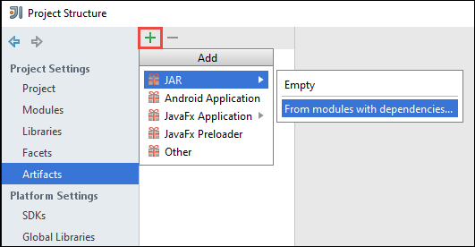

<properties
    pageTitle="Créer des applications scala de s’exécuter sur des clusters HDInsight Spark autonome | Microsoft Azure"
    description="Apprenez à créer une application explosion à s’exécuter sur des clusters HDInsight Spark autonome."
    services="hdinsight"
    documentationCenter=""
    authors="nitinme"
    manager="jhubbard"
    editor="cgronlun"
    tags="azure-portal"/>

<tags
    ms.service="hdinsight"
    ms.workload="big-data"
    ms.tgt_pltfrm="na"
    ms.devlang="na"
    ms.topic="article"
    ms.date="10/28/2016"
    ms.author="nitinme"/>

# Créer une application Scala s’exécute sur cluster explosion Apache sur HDInsight Linux autonome

Cet article fournit des instructions détaillées sur le développement d’applications d’explosion autonome écrites dans Scala à l’aide de Maven avec IntelliJ idée. L’article utilise Maven Apache en tant que le système de génération et commence par archétype Maven existant pour Scala fourni par IntelliJ idée.  À un niveau élevé, création d’un Scala application dans IntelliJ idée impliquera les opérations suivantes :

* Utilisez Maven en tant que le système de génération.
* Fichier de modèle d’objet projet (POM) mise à jour pour résoudre les dépendances de module explosion.
* Rédigez votre application de Scala.
* Générer un fichierJAR qui peut être soumis aux clusters HDInsight Spark.
* Exécutez l’application sur cluster explosion à l’aide de Livy.

>[AZURE.NOTE] HDInsight fournit également un outil de plug-in IntelliJ idée pour faciliter le processus de création et envoi d’applications à un cluster HDInsight Spark sous Linux. Pour plus d’informations, voir [Utiliser HDInsight outils plug-in idée IntelliJ créer et soumettre des applications explosion](hdinsight-apache-spark-intellij-tool-plugin.md).

**Conditions préalables**

* Un abonnement Azure. Voir [Azure obtenir la version d’évaluation gratuite](https://azure.microsoft.com/documentation/videos/get-azure-free-trial-for-testing-hadoop-in-hdinsight/).
* Un cluster explosion Apache sur HDInsight Linux. Pour plus d’informations, voir [groupes de créer Apache explosion dans Azure HDInsight](hdinsight-apache-spark-jupyter-spark-sql.md).
* Kit de développement Java Oracle. Vous pouvez l’installer à partir [d’ici](http://www.oracle.com/technetwork/java/javase/downloads/jdk8-downloads-2133151.html).
* Un Java IDE. Cet article utilise IntelliJ idée 15.0.1. Vous pouvez l’installer à partir [d’ici](https://www.jetbrains.com/idea/download/).

## Installer le plug-in Scala pour IntelliJ idée

Si l’installation idée IntelliJ n’invite pas pas permettant de plug-in Scala, lancer idée IntelliJ et suivez les étapes suivantes pour installer le plug-in :

1. Démarrer IntelliJ idée et à partir de l’écran d’accueil, cliquez sur **configurer** , puis sur **plug-ins**.

    

2. Dans l’écran suivant, cliquez sur **plug-in installer JetBrains** dans le coin inférieur gauche. Dans la boîte de dialogue **Parcourir les plug-ins JetBrains** qui s’ouvre, recherchez Scala, puis sur **installer**.

    

3. Une fois que le plug-in installé avec succès, cliquez sur le **bouton Redémarrer IntelliJ idée** pour reprendre l’IDE.

## Créer un projet de Scala autonome

1. Lancez IntelliJ idée et créez un nouveau projet. Dans la boîte de dialogue Nouveau projet, vérifiez les options suivantes, puis cliquez sur **suivant**.

    

    * Sélectionnez **Maven** comme type de projet.
    * Spécifiez un **projet SDK**. Cliquez sur Nouveau et accédez au répertoire d’installation Java, généralement `C:\Program Files\Java\jdk1.8.0_66`.
    * Sélectionnez l’option **créer à partir du archétype** .
    * Dans la liste des archetypes, sélectionnez **org.scala tools.archetypes:scala archétype simple**. Cela crée la structure du répertoire droite et télécharger les dépendances par défaut requis pour écrire Scala programme.

2. Indiquez les valeurs appropriées pour **GroupId**, **ArtifactId**et la **Version**. Cliquez sur **suivant**.

3. Dans la boîte de dialogue suivante dans laquelle vous spécifiez répertoire Maven et autres paramètres utilisateur, acceptez les paramètres par défaut, puis cliquez sur **suivant**.

4. Dans la boîte de dialogue dernière, spécifiez un nom de projet et un emplacement, puis sur **Terminer**.

5. Supprimez le fichier **MySpec.Scala** en **src\test\scala\com\microsoft\spark\example**. Il est inutile ceci pour l’application.

6. Si nécessaire, renommez les fichiers source et de test par défaut. Dans le volet gauche de l’idée IntelliJ, accédez à **src\main\scala\com.microsoft.spark.example**. Avec le bouton droit **App.scala**, cliquez sur **Refactoriser**, cliquez sur Renommer le fichier et dans la boîte de dialogue, fournir un nouveau nom pour l’application, puis sur **Refactoriser**.

      

7. Dans les étapes suivantes, vous met à jour la pom.xml pour définir les dépendances de l’application Scala explosion. Ces dépendances à être téléchargé et résolus automatiquement, vous devez configurer Maven en conséquence.

    

    1. Dans le menu **fichier** , cliquez sur **paramètres**.
    2. Dans la boîte de dialogue **paramètres** , accédez à **créer, exécution, déploiement** > **Outils de génération** > **Maven** > **importation**.
    3. Sélectionnez l’option pour **Maven importer des projets automatiquement**.
    4. Cliquez sur **Appliquer**, puis cliquez sur **OK**.

8. Mettre à jour le fichier source Scala pour inclure votre code d’application. Ouvrir et remplacez le code existant par le code suivant et enregistrer les modifications. Ce code lit les données à partir de la HVAC.csv (disponible dans tous les clusters HDInsight Spark) extrait les lignes qui possèdent uniquement un chiffre dans la colonne sixième et écrit la sortie dans **/HVACOut** sous le conteneur de stockage par défaut pour le cluster.

        package com.microsoft.spark.example

        import org.apache.spark.SparkConf
        import org.apache.spark.SparkContext

        /**
          * Test IO to wasb
          */
        object WasbIOTest {
          def main (arg: Array[String]): Unit = {
            val conf = new SparkConf().setAppName("WASBIOTest")
            val sc = new SparkContext(conf)

            val rdd = sc.textFile("wasbs:///HdiSamples/HdiSamples/SensorSampleData/hvac/HVAC.csv")

            //find the rows which have only one digit in the 7th column in the CSV
            val rdd1 = rdd.filter(s => s.split(",")(6).length() == 1)

            rdd1.saveAsTextFile("wasbs:///HVACout")
          }
        }

9. Mettre à jour le pom.xml.

    1.  Au sein de `<project>\<properties>` ajoutez ce qui suit :

            <scala.version>2.10.4</scala.version>
            <scala.compat.version>2.10.4</scala.compat.version>
            <scala.binary.version>2.10</scala.binary.version>

    2. Au sein de `<project>\<dependencies>` ajoutez ce qui suit :

            <dependency>
              <groupId>org.apache.spark</groupId>
              <artifactId>spark-core_${scala.binary.version}</artifactId>
              <version>1.4.1</version>
            </dependency>

    Enregistrer les modifications apportées à pom.xml.

10. Créer le fichier .jar. IDÉE IntelliJ permet la création de JAR comme un objet d’un projet. Procédez comme suit.

    1. Dans le menu **fichier** , cliquez sur **Structure du projet**.
    2. Dans la boîte de dialogue **Structure du projet** , cliquez sur les **objets** , puis sur le signe plus. Dans la boîte de dialogue qui s’affiche, cliquez sur **JAR**, puis cliquez sur **à partir de modules avec les dépendances**.

        

    3. Dans la boîte de dialogue **Créer JAR à partir de Modules** , cliquez sur les points de suspension ( ) par rapport à la **Classe principal**.

    4. Dans la boîte de dialogue **Sélectionnez principaux cours** , sélectionnez la catégorie qui s’affiche par défaut, puis sur **OK**.

        

    5. Dans la boîte de dialogue **Créer JAR à partir de Modules** , vérifiez que l’option **d’extraction à la cible JAR** est sélectionnée, puis cliquez sur **OK**. Cela crée un seul fichier JAR avec toutes les dépendances.

        

    6. L’onglet mise en sortie répertorie tous les fichiers JAR qui sont inclus dans le cadre du projet Maven. Vous pouvez sélectionner et supprimer ceux qui ne dépend pas directement de l’application Scala. Pour l’application que nous créons ici, vous pouvez supprimer tous sauf le dernier une (**SparkSimpleApp compiler sortie**). Sélectionnez les fichiers JAR à supprimer, puis cliquez sur l’icône **Supprimer** .

        

        Vérifiez que la case **Générer sur rendre** est activée, qui permet de garantir que le fichier jar est créé chaque fois que le projet est généré ou mis à jour. Cliquez sur **Appliquer** , puis sur **OK**.

    7. À partir de la barre de menus, cliquez sur **Générer**, puis cliquez sur **Créer le projet**. Vous pouvez également cliquer sur **Créer des objets** pour créer le fichier jar. Le fichier jar sortie est créé sous **\out\artifacts**.

        

## Exécutez l’application sur le cluster d’explosion

Pour exécuter l’application sur le cluster, vous devez procédez comme suit :

* **Copiez le fichier jar application au blob Azure stockage** associé au cluster. Vous pouvez utiliser [**AzCopy**](../storage/storage-use-azcopy.md), un utilitaire de ligne de commande pour le faire. Il existe de nombreuses autres clients ainsi que vous pouvez utiliser pour télécharger des données. Pour en savoir plus sur les à [télécharger des données pour les projets Hadoop de HDInsight](hdinsight-upload-data.md).

* **Utiliser Livy soumettre une tâche de l’application à distance** pour le cluster explosion. Clusters explosion sur HDInsight inclut Livy qui expose des points de terminaison REST pour soumettre à distance des travaux d’explosion. Pour plus d’informations, voir [tâches explosion soumettre à distance en utilisant Livy avec clusters explosion sur HDInsight](hdinsight-apache-spark-livy-rest-interface.md).

## Voir aussi

* [Vue d’ensemble : Apache explosion sur Azure HDInsight](hdinsight-apache-spark-overview.md)

### Scénarios

* [Explosion avec BI : effectuer une analyse de données interactives à l’aide d’explosion dans HDInsight avec les outils de décisionnel](hdinsight-apache-spark-use-bi-tools.md)

* [Explosion avec apprentissage automatique : utilisation explosion dans HDInsight pour analyser la température de construction à l’aide de données HVAC](hdinsight-apache-spark-ipython-notebook-machine-learning.md)

* [Explosion avec apprentissage automatique : utilisation explosion dans HDInsight pour prévoir des résultats de l’inspection alimentaires](hdinsight-apache-spark-machine-learning-mllib-ipython.md)

* [Diffusion en continu explosion : Utilisation explosion dans HDInsight pour la création d’applications en continu en temps réel](hdinsight-apache-spark-eventhub-streaming.md)

* [Analyse de journal de site Web à l’aide d’explosion dans HDInsight](hdinsight-apache-spark-custom-library-website-log-analysis.md)

### Créer et exécuter des applications

* [Exécution de tâches à distance sur un cluster explosion à l’aide de Livy](hdinsight-apache-spark-livy-rest-interface.md)

### Outils et extensions

* [Plug-in des outils HDInsight IntelliJ idée permet de créer et soumettre des applications Scala d’explosion](hdinsight-apache-spark-intellij-tool-plugin.md)

* [Plug-in utilisation HDInsight outils idée IntelliJ déboguer applications explosion à distance](hdinsight-apache-spark-intellij-tool-plugin-debug-jobs-remotely.md)

* [Utiliser les blocs-notes Zeppelin avec un cluster explosion sur HDInsight](hdinsight-apache-spark-use-zeppelin-notebook.md)

* [Noyaux disponibles pour Jupyter bloc-notes cluster explosion pour HDInsight](hdinsight-apache-spark-jupyter-notebook-kernels.md)

* [Utiliser les packages externes avec Jupyter blocs-notes](hdinsight-apache-spark-jupyter-notebook-use-external-packages.md)

* [Installer Jupyter sur votre ordinateur et vous connecter à un cluster HDInsight Spark](hdinsight-apache-spark-jupyter-notebook-install-locally.md)

### Gérer les ressources

* [Gestion des ressources pour le cluster Apache explosion dans Azure HDInsight](hdinsight-apache-spark-resource-manager.md)

* [Suivre et débogage travaux s’exécutant sur un cluster Apache explosion dans HDInsight](hdinsight-apache-spark-job-debugging.md)
