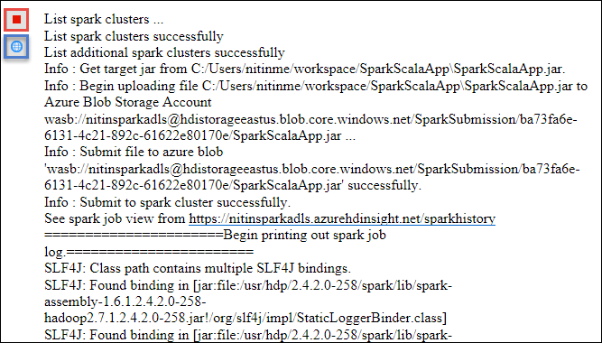
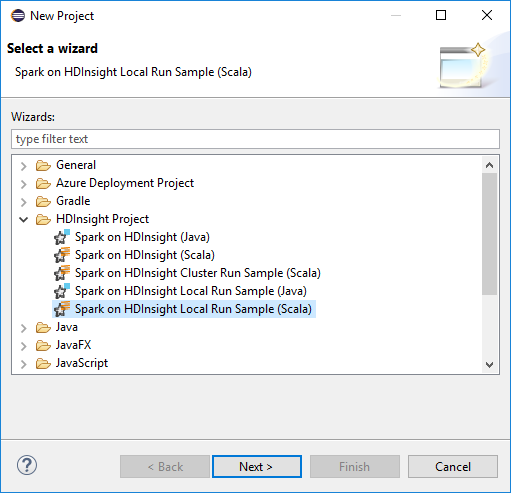

 <properties
    pageTitle="Créer des applications à explosion Scala à l’aide des outils HDInsight dans Azure le Kit de ressources pour Eclipse | Microsoft Azure"
    description="Apprenez à créer une application explosion à s’exécuter sur des clusters HDInsight Spark autonome."
    services="hdinsight"
    documentationCenter=""
    authors="nitinme"
    manager="jhubbard"
    editor="cgronlun"
    tags="azure-portal"/>

<tags
    ms.service="hdinsight"
    ms.workload="big-data"
    ms.tgt_pltfrm="na"
    ms.devlang="na"
    ms.topic="article"
    ms.date="08/30/2016"
    ms.author="nitinme"/>

# Utiliser les outils de HDInsight dans la boîte à outils Azure pour Eclipse pour créer des applications pour cluster HDInsight explosion Linux explosion

Cet article fournit des instructions détaillées sur le développement d’applications explosion écrites dans Scala et l’envoi pour une HDInsight Spark cluster à l’aide des outils HDInsight dans Azure le Kit de ressources pour Eclipse. Vous pouvez utiliser les outils de différentes façons :

* Pour développer et soumettre une application Scala Spark sur un cluster HDInsight Spark
* Accéder à vos ressources cluster Azure HDInsight explosion
* Pour développer et exécuter une application Scala Spark localement

>[AZURE.IMPORTANT] Cet outil peut être utilisé pour créer et soumettre des applications uniquement pour un cluster HDInsight Spark sur Linux.

##Conditions préalables

* Un abonnement Azure. Voir [Azure obtenir la version d’évaluation gratuite](https://azure.microsoft.com/documentation/videos/get-azure-free-trial-for-testing-hadoop-in-hdinsight/).

* Un cluster explosion Apache sur HDInsight Linux. Pour plus d’informations, voir [groupes de créer Apache explosion dans Azure HDInsight](hdinsight-apache-spark-jupyter-spark-sql.md).

* Kit de développement Java Oracle versions 7 et 8. 
    * **Java SDK 7** est utilisé pour la compilation des projets d’explosion que prennent en charge les groupes de HDInsight Java version 7. Vous pouvez télécharger Java SDK 7 à partir [d’ici](http://www.oracle.com/technetwork/java/javase/downloads/jdk7-downloads-1880260.html).
    * **Java SDK 8** est utilisé pour runtime Eclipse IDE. Vous pouvez le télécharger à partir [d’ici](http://www.oracle.com/technetwork/java/javase/downloads/jdk8-downloads-2133151.html).

* Eclipse IDE. Cet article utilise néon Eclipse. Vous pouvez l’installer à partir [d’ici](https://www.eclipse.org/downloads/).

* Scala IDE pour Eclipse. 
    * **Si vous avez Eclipse IDE installé**, vous pouvez ajouter le plug-in Scala IDE en accédant à **l’aide** -> **Installer de nouveaux logiciels**et ajoutez [http://download.scala-ide.org/sdk/lithium/e44/scala211/stable/site](http://download.scala-ide.org/sdk/lithium/e44/scala211/stable/site) comme source pour télécharger Scala Plugin pour Eclipse. 
    * **Si vous n’avez pas Eclipse IDE installé**, vous pouvez installer Scala IDE directement depuis [ici](http://scala-ide.org/download/sdk.html). Vous pouvez télécharger le fichier .zip à partir de ce lien, extraire, accédez au dossier **/eclipse** et puis exécutez **eclipse.exe** fichier à partir de là.
    
    >[AZURE.NOTE] Les étapes décrites dans ce document sont basés sur l’utilisation de Eclipse IDE avec Scala plug-in installé.

* Explosion SDK. Vous pouvez le télécharger à partir [d’ici](http://go.microsoft.com/fwlink/?LinkID=723585&clcid=0x409).

* Installez clipse e (fx) à partir de [https://www.eclipse.org/efxclipse/install.html](https://www.eclipse.org/efxclipse/install.html).

## Installer les outils de HDInsight dans Azure Kit de ressources pour Éclipse

HDInsight des outils pour Eclipse est disponible dans le cadre du Kit de ressources Azure pour Eclipse. Pour obtenir des instructions sur l’installation du Kit de ressources de Azure, voir [la boîte à outils Azure pour Eclipse](../azure-toolkit-for-eclipse-installation.md).

## Connectez-vous à votre abonnement Azure

1. Lancez l’IDE Eclipse et ouvrez l’Explorateur d’Azure. Dans le menu **fenêtre** dans l’IDE, cliquez sur **Afficher la vue** , puis sur **autres**. À partir de la boîte de dialogue qui s’ouvre, développez **Azure**et cliquez sur **Explorer Azure**, puis cliquez sur **OK**.

    

2. Cliquez sur le nœud **Azure** dans l' **Explorateur de Azure**, puis cliquez sur **Gérer les abonnements**.

3. Dans la boîte de dialogue **Gérer les abonnements** , cliquez sur **se connecter** et entrez vos informations d’identification Azure.

    

4. Une fois que vous êtes connecté, la boîte de dialogue **Gérer les abonnements** répertorie tous les abonnements Azure associés avec les informations d’identification. Cliquez sur **Fermer** dans la boîte de dialogue.

5. Dans l’onglet Azure Explorer, développez **HDInsight** pour afficher les groupes HDInsight Spark sous votre abonnement.

    

6. Vous pouvez développer davantage un cluster de nom pour afficher les ressources (par exemple, les comptes de stockage) associés au cluster.

    

## Configurer un projet Scala explosion pour un cluster HDInsight Spark

1. À partir de l’espace de travail Eclipse IDE, cliquez sur **fichier**, cliquez sur **Nouveau**, puis cliquez sur **projet**. 

2. Dans l’Assistant **Nouveau projet** , développez **HDInsight**et sélectionnez **explosion sur HDInsight (Scala)**, puis cliquez sur **suivant**.

    

3. Dans la boîte de dialogue **Nouveau projet Scala HDInsight** , entrez/sélectionner les valeurs comme le montre l’image ci-dessous, puis cliquez sur **suivant**.

    

    * Entrez un nom pour le projet.
    * Dans la zone **JRE** , vérifiez que **utiliser un environnement d’exécution JRE** est défini sur **JavaSE 1.7**.
    * Vérifiez que le Kit de développement logiciel explosion est défini à l’emplacement où vous avez téléchargé le Kit de développement. Le lien vers l’emplacement de téléchargement est inclus dans les [conditions préalables](#prerequisites) précédemment dans cette rubrique. Vous pouvez également télécharger le Kit de développement à partir du lien inclus dans cette boîte de dialogue, comme illustré dans l’image ci-dessus.    

4. Dans la boîte de dialogue suivante, cliquez sur l’onglet **bibliothèques** et puis double-cliquez sur **JRE système bibliothèque [JavaSE-1.7]**.

    

5. Dans la boîte de dialogue **Modifier la bibliothèque** , vérifiez que **Environnement d’exécution** est défini sur **JavaSE-1.7(jdk1.7.0_79)**. Si ce n’est pas disponible en tant qu’option, suivez les étapes ci-dessous.

    1. Sélectionnez l’option de **Remplacement JRE** et voyez si **JavaSE-1.7(jdk1.7.0_79)** est disponible.
    2. Dans le cas contraire, cliquez sur le bouton **JRE installé** .

          

    3. Dans la boîte de dialogue **JRE installés** , cliquez sur **Ajouter**.

            

    4. Dans la boîte de dialogue **JRE Type** , sélectionnez **Machine virtuelle Standard**, puis cliquez sur **suivant**

            

    5. Dans la boîte de dialogue **Définition du JRE** , cliquez sur le répertoire et accédez à l’emplacement d’installation JDK 7, puis sélectionnez le dossier racine pour **jdk1.7.0_79**.

            

    6. Cliquez sur **Terminer**. Dans la boîte de dialogue **JRE installé** , sélectionnez l’environnement récemment ajoutée, puis cliquez sur **OK**.

           

    7. L’environnement nouvellement ajouté doit être répertorié pour **l’Environnement d’exécution**. Cliquez sur **Terminer**.

           

6. Retour sous l’onglet **bibliothèques** , double-cliquez sur **Le conteneur de bibliothèques Scala [2.11.8]**. Dans la boîte de dialogue **Modifier la bibliothèque** , sélectionnez **bibliothèque Scala fixe conteneur : 2.10.6**. 

    

    Cliquez sur **Terminer** pour quitter la boîte de dialogue Paramètres du projet.

## Créer une application Scala pour cluster HDInsight Spark

1. Dans l’IDE Eclipse déjà ouvert, dans l' **Explorateur de Package**, développez le projet que vous avez créée, avec le bouton droit **src**, pointez sur **Nouveau**, puis cliquez sur **autres**.

2. Dans la boîte de dialogue **Sélectionner un Assistant** , développez **Scala Assistants**et cliquez sur **Objet Scala**, puis cliquez sur **suivant**.

    

3. Dans la boîte de dialogue **Créer un nouveau fichier** , entrez un nom pour l’objet, puis cliquez sur **Terminer**.

    

4. Collez le code suivant dans l’éditeur de texte.

        import org.apache.spark.SparkConf
        import org.apache.spark.SparkContext
    
        object MyClusterApp{
          def main (arg: Array[String]): Unit = {
            val conf = new SparkConf().setAppName("MyClusterApp")
            val sc = new SparkContext(conf)
        
            val rdd = sc.textFile("wasbs:///HdiSamples/HdiSamples/SensorSampleData/hvac/HVAC.csv")
        
            //find the rows which have only one digit in the 7th column in the CSV
            val rdd1 =  rdd.filter(s => s.split(",")(6).length() == 1)
        
            rdd1.saveAsTextFile("wasbs:///HVACOut")
          }     
        }

5. Exécutez l’application sur un cluster HDInsight Spark.

    1. Dans l' **Explorateur de Package**, cliquez sur le nom du projet, puis sélectionnez **Soumettre explosion Application à HDInsight**.      

    2. Dans la boîte de dialogue **Explosion soumission** , fournissent les valeurs suivantes.

        * Pour **Nom de Cluster**, sélectionnez le cluster HDInsight Spark sur lequel vous voulez exécuter votre application.

        * Vous devez sélectionner un objet du projet Eclipse, ou sélectionnez une à partir du disque dur.

        * Par rapport à la zone de texte **nom du cours principal** , entrez le nom de l’objet que vous avez spécifié dans le code (voir l’image ci-dessous).

            

        * Étant donné que le code de l’application dans cet exemple montre comment ne pas exiger des arguments de ligne de commande ou référencez bocaux ou des fichiers, vous pouvez laisser les autres zones de texte vide.

        * Cliquez sur **Envoyer**.

    3. L’onglet **Explosion soumission** devraient affichant l’état d’avancement. Vous pouvez arrêter l’application en cliquant sur le bouton rouge dans la fenêtre « Explosion soumission ». Vous pouvez également afficher les journaux de cette application spécifique exécuter en cliquant sur l’icône de globe (indiqué par le cadre bleu dans l’image).

        

    Dans la section suivante, vous allez apprendre à accéder à la tâche à l’aide des outils HDInsight Azure le Kit de ressources pour Eclipse de sortie.

## Accéder et gérer les HDInsight Spark l’aide des outils HDInsight Azure le Kit de ressources pour Éclipse

Vous pouvez effectuer diverses opérations à l’aide des outils HDInsight.

### Accéder au conteneur de stockage pour le cluster

1. À partir de l’Explorateur d’Azure, développez le nœud de racine de **HDInsight** pour afficher la liste des clusters HDInsight Spark qui sont disponibles.

3. Développez le nom de cluster pour afficher le compte de stockage et le conteneur de stockage par défaut pour le cluster.

    

4. Cliquez sur le nom du conteneur de stockage associé au cluster. Dans le volet de droite, vous devez voir un dossier nommé **HVACOut**. Double-cliquez pour ouvrir le dossier et vous verrez **partie -*** fichiers. Ouvrez un de ces fichiers pour afficher le résultat de l’application.

### Accéder au serveur de l’historique d’explosion

1. Dans l' **Explorateur Azure**, avec le bouton droit de votre nom de cluster explosion, puis sélectionnez **Ouvrir l’interface utilisateur de l’historique à explosion**. Lorsque vous y êtes invité, entrez les informations d’identification d’administration pour le cluster. Vous devez avoir indiqué ces lors de la mise en service le cluster.

2. Dans le tableau de bord explosion historique Server, vous pouvez rechercher l’application vous juste après l’exécution d’en utilisant le nom de l’application. Dans le code ci-dessus, vous définissez le nom d’application à l’aide `val conf = new SparkConf().setAppName("MyClusterApp")`. Par conséquent, votre nom de l’application explosion a été **MyClusterApp**.

### Lancer le portail Ambari

Dans l' **Explorateur Azure**, avec le bouton droit de votre nom de cluster explosion, puis sélectionnez **Ouvrir portail de gestion de Cluster (Ambari)**. Lorsque vous y êtes invité, entrez les informations d’identification d’administration pour le cluster. Vous devez avoir indiqué ces lors de la mise en service le cluster.

### Gérer les abonnements Azure

Par défaut, les outils de HDInsight dans la boîte à outils Azure pour Eclipse répertorie les groupes d’explosion de tous vos abonnements Azure. Si nécessaire, vous pouvez spécifier les abonnements pour lequel vous voulez accéder au cluster. Dans l' **Explorateur de Azure**, droit sur le nœud racine **Azure** , puis cliquez sur **Gérer les abonnements**. À partir de la boîte de dialogue, décochez les cases à cocher par rapport à l’abonnement que vous ne souhaitez pas accéder, puis cliquez sur **Fermer**. Vous pouvez également cliquer sur **Se déconnecter** si vous souhaitez vous déconnecter votre abonnement Azure.

## Exécuter une application explosion Scala localement

Vous pouvez utiliser les outils de HDInsight dans la boîte à outils Azure pour Eclipse pour exécuter des applications de Scala explosion localement sur votre poste de travail. En règle générale, ces applications ne pas besoin d’accéder aux ressources de cluster comme conteneur de stockage et peuvent être exécutées et testées localement.

### Conditions préalables

Pendant l’exécution de l’application Scala explosion locale sur un ordinateur Windows, vous pouvez obtenir une exception comme expliqué dans [explosion 2356](https://issues.apache.org/jira/browse/SPARK-2356) qui se produit en raison d’un manquantes **WinUtils.exe** sur le système d’exploitation Windows. Pour contourner cette erreur, vous devez [Télécharger le fichier exécutable à partir de là](http://public-repo-1.hortonworks.com/hdp-win-alpha/winutils.exe) vers un emplacement, par exemple **C:\WinUtils\bin**. Vous devez ensuite ajouter une variable d’environnement **HADOOP_HOME** et définissez la valeur de la variable **C\WinUtils**.

### Exécuter une application locale Scala d’explosion  

1. Lancez Eclipse et créez un nouveau projet. Dans la boîte de dialogue Nouveau projet, vérifiez les options suivantes, puis cliquez sur **suivant**.

    

    * Dans le volet gauche, sélectionnez **HDInsight**.
    * Dans le volet droit, sélectionnez **explosion échantillon exécuter HDInsight Local (Scala)**.
    * Cliquez sur **suivant**.

2. Pour fournir des détails du projet, suivez les étapes 3 à 6 comme indiqué précédemment dans la section [configurer un projet d’application Scala explosion pour un cluster explosion HDInsight](#set-up-a-spark-scala-application-project-for-an-hdinsight-spark cluster).

3. Le modèle ajoute un exemple de code (**LogQuery**) sous le dossier **src** que vous pouvez exécuter localement sur votre ordinateur.

    

4.  Clic droit sur l’application **LogQuery** , pointez sur **Exécuter en tant que**, puis cliquez sur **1 Scala Application**. Vous verrez une sortie comme suit dans l’onglet **Console** en bas.

    

## Problèmes de commentaires et connus

Actuellement affiché explosion sorties directement n’est ne pas prise en charge et nous travaillons sur ce point.

Si vous avez des suggestions ou des commentaires, ou si vous rencontrez des problèmes lors de l’utilisation de cet outil, n’hésitez pas à envoyez-nous un message électronique à hdivstool à microsoft point com.

## Voir aussi

* [Vue d’ensemble : Apache explosion sur Azure HDInsight](hdinsight-apache-spark-overview.md)

### Scénarios

* [Explosion avec BI : effectuer une analyse de données interactives à l’aide d’explosion dans HDInsight avec les outils de décisionnel](hdinsight-apache-spark-use-bi-tools.md)

* [Explosion avec apprentissage automatique : utilisation explosion dans HDInsight pour analyser la température de construction à l’aide de données HVAC](hdinsight-apache-spark-ipython-notebook-machine-learning.md)

* [Explosion avec apprentissage automatique : utilisation explosion dans HDInsight pour prévoir des résultats de l’inspection alimentaires](hdinsight-apache-spark-machine-learning-mllib-ipython.md)

* [Diffusion en continu explosion : Utilisation explosion dans HDInsight pour la création d’applications en continu en temps réel](hdinsight-apache-spark-eventhub-streaming.md)

* [Analyse de journal de site Web à l’aide d’explosion dans HDInsight](hdinsight-apache-spark-custom-library-website-log-analysis.md)

### Créer et exécuter des applications

* [Créer une application autonome à l’aide de Scala](hdinsight-apache-spark-create-standalone-application.md)

* [Exécution de tâches à distance sur un cluster explosion à l’aide de Livy](hdinsight-apache-spark-livy-rest-interface.md)

### Outils et extensions

* [Utiliser les outils de HDInsight dans la boîte à outils Azure pour IntelliJ pour créer et soumettre des applications Scala d’explosion](hdinsight-apache-spark-intellij-tool-plugin.md)

* [Utilisez les outils HDInsight dans la boîte à outils Azure pour IntelliJ déboguer applications explosion à distance](hdinsight-apache-spark-intellij-tool-plugin-debug-jobs-remotely.md)

* [Utiliser les blocs-notes Zeppelin avec un cluster explosion sur HDInsight](hdinsight-apache-spark-use-zeppelin-notebook.md)

* [Noyaux disponibles pour Jupyter bloc-notes cluster explosion pour HDInsight](hdinsight-apache-spark-jupyter-notebook-kernels.md)

* [Utiliser les packages externes avec Jupyter blocs-notes](hdinsight-apache-spark-jupyter-notebook-use-external-packages.md)

* [Installer Jupyter sur votre ordinateur et vous connecter à un cluster HDInsight Spark](hdinsight-apache-spark-jupyter-notebook-install-locally.md)

### Gérer les ressources

* [Gestion des ressources pour le cluster Apache explosion dans Azure HDInsight](hdinsight-apache-spark-resource-manager.md)

* [Suivre et débogage travaux s’exécutant sur un cluster Apache explosion dans HDInsight](hdinsight-apache-spark-job-debugging.md)
