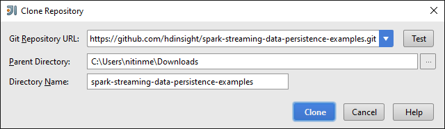
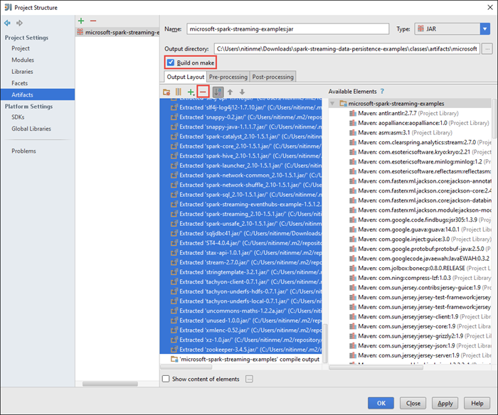
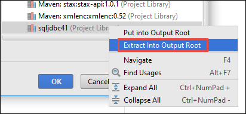
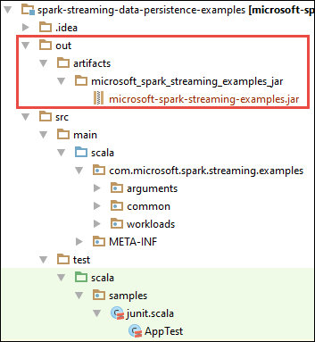

<properties 
    pageTitle="Utilisez Azure événement Hubs avec Apache explosion dans HDInsight pour traiter les données de diffusion en continu | Microsoft Azure" 
    description="Des instructions détaillées sur l’envoi de données à Azure événement concentrateur de flux et puis recevoir ces événements dans explosion à l’aide d’une application scala" 
    services="hdinsight" 
    documentationCenter="" 
    authors="nitinme" 
    manager="jhubbard" 
    editor="cgronlun"
    tags="azure-portal"/>

<tags 
    ms.service="hdinsight" 
    ms.workload="big-data" 
    ms.tgt_pltfrm="na" 
    ms.devlang="na" 
    ms.topic="article" 
    ms.date="09/30/2016" 
    ms.author="nitinme"/>

# Diffusion en continu explosion : Traiter les événements de Azure événement Hubs avec Apache explosion cluster sur HDInsight Linux

Diffusion en continu explosion étend l’API explosion pour créer des applications de traitement de flux scalable, haut débit, tolérance principale. Données peuvent provenir de plusieurs sources. Dans cet article, nous utilisons Azure événement Hubs pour ajouter des données. Événement Hubs est un système de réception hautement scalable cette admission can millions d’événements par seconde. 

Dans ce didacticiel, vous allez apprendre à créer un concentrateur d’événement Azure, comment faire pour recevoir des messages à un concentrateur de l’événement à l’aide d’une application console dans Java et les récupérer en parallèle à l’aide d’une application explosion écrite dans Scala. Cette application consomme les données transmises par le biais événement Hubs et achemine vers différentes sorties (Azure stockage Blob, table Hive et table SQL).

> [AZURE.NOTE] Pour suivre les instructions fournies dans cet article, vous devrez utiliser les deux versions du portail Azure. Pour créer un concentrateur de l’événement, vous allez utiliser le [portail Azure classique](https://manage.windowsazure.com). Pour utiliser le cluster HDInsight Spark, vous allez utiliser le [Portail Azure](https://portal.azure.com/).  

**Conditions requises :**

Vous devez disposer des éléments suivants :

- Un abonnement Azure. Voir [Azure obtenir la version d’évaluation gratuite](https://azure.microsoft.com/documentation/videos/get-azure-free-trial-for-testing-hadoop-in-hdinsight/).
- Un cluster explosion Apache. Pour plus d’informations, voir [groupes de créer Apache explosion dans Azure HDInsight](hdinsight-apache-spark-jupyter-spark-sql.md).
- Kit de développement Java Oracle. Vous pouvez l’installer à partir [d’ici](http://www.oracle.com/technetwork/java/javase/downloads/jdk8-downloads-2133151.html).
- Un Java IDE. Cet article utilise IntelliJ idée 15.0.1. Vous pouvez l’installer à partir [d’ici](https://www.jetbrains.com/idea/download/).
- Pilote JDBC Microsoft pour SQL Server, 4.1 ou version ultérieure. Cela est nécessaire pour écrire les données d’événement dans une base de données SQL Server. Vous pouvez l’installer à partir [d’ici](https://msdn.microsoft.com/sqlserver/aa937724.aspx).
- Une base de données SQL Azure. Pour plus d’informations, voir [créer une base de données SQL en minutes](../sql-database/sql-database-get-started.md).

## Que faire cette solution ?

Il s’agit de déroule de la solution en continu :

1. Créer un concentrateur événement Azure qui recevront un flux d’événements.

2. Exécution d’une application autonome local qui génère des événements et exécute un push sur le Hub événement Azure. L’exemple d’application qui effectue cette opération est publié à [https://github.com/hdinsight/spark-streaming-data-persistence-examples](https://github.com/hdinsight/spark-streaming-data-persistence-examples).

2. Exécuter une application de diffusion en continu à distance sur un cluster explosion qui lit les événements de diffusion en continu à partir d’Azure événement concentrateur et pousse vers d’autres emplacements (Blob Azure table Hive et table de base de données SQL). 

## Créer des événements Azure concentrateur

1. À partir du [Portail Azure](https://manage.windowsazure.com), sélectionnez **Nouveau** > **Service Bus** > **Événement concentrateur** > **Créer personnalisé**.

2. Dans l’écran **Ajouter un nouveau concentrateur événement** , entrez un **Nom de concentrateur d’événements**, sélectionnez la **région** à créer le hub et créer un nouvel espace de noms ou sélectionnez-en un. Cliquez sur la **flèche** pour continuer.

    ![page de l’Assistant 1] (./media/hdinsight-apache-spark-eventhub-streaming/hdispark.streaming.create.event.hub.png "Créer un concentrateur événement Azure")

    > [AZURE.NOTE] Vous devez sélectionner le même **emplacement** que votre cluster Apache explosion dans HDInsight pour réduire les coûts et latence.

3. Dans l’écran **Configurer événement concentrateur** , entrez les valeurs **Partition Nb** et **Rétention du Message** , puis cliquez sur la coche. Dans cet exemple, utilisez un compteur de partition de 10 et une rétention de message de 1. Notez le nombre de partitions car vous aurez besoin ultérieurement cette valeur.

    ![page de l’Assistant 2] (./media/hdinsight-apache-spark-eventhub-streaming/hdispark.streaming.create.event.hub2.png "Spécifier partition taille et rétention jours pour concentrateur d’événement")

4. Cliquez sur le Hub de l’événement que vous avez créé, cliquez sur **configurer**, puis créez deux règles d’accès pour le hub de l’événement.

    <table>
    <tr><th>Nom</th><th>Autorisations</th></tr>
    <tr><td>mysendpolicy</td><td>Envoyer</td></tr>
    <tr><td>myreceivepolicy</td><td>Écouter</td></tr>
    </table>

    Après avoir créé les autorisations, sélectionnez l’icône **Enregistrer** au bas de la page. Cela crée les stratégies d’accès partagé qui seront utilisés pour envoyer (**mysendpolicy**) et écouter ce concentrateur événement (**myreceivepolicy**).

    ![stratégies] (./media/hdinsight-apache-spark-eventhub-streaming/hdispark.streaming.event.hub.policies.png "Stratégies de créer événement concentrateur")

    
5. Sur la même page, notez les clés de stratégie généré pour les deux stratégies. Enregistrer ces touches, car ils seront utilisés ultérieurement.

    ![clés de stratégie] (./media/hdinsight-apache-spark-eventhub-streaming/hdispark.streaming.event.hub.policy.keys.png "Enregistrer les clés de stratégie")

6. Dans la page **tableau de bord** , cliquez sur **Informations de connexion** à partir du bas pour récupérer et enregistrer les chaînes de connexion pour le Hub de l’événement en utilisant les stratégies de deux.

    ![clés de stratégie] (./media/hdinsight-apache-spark-eventhub-streaming/hdispark.streaming.event.hub.policy.connection.strings.png "Enregistrer les chaînes de connexion de stratégie")

## Utiliser une application Scala pour envoyer des messages à concentrateur d’événement

Dans cette section que vous utilisez une application Scala locale autonome pour envoyer un flux d’événements à Azure événement concentrateur que vous avez créé à l’étape précédente. Cette application est disponible sur GitHub à [https://github.com/hdinsight/eventhubs-sample-event-producer](https://github.com/hdinsight/eventhubs-sample-event-producer). Les étapes décrites ici part du principe que vous avez déjà dupliquée ce référentiel GitHub.

1. Ouvrez l’application, **EventhubsSampleEventProducer**, dans IntelliJ idée.
    
2. Générez le projet. Dans le menu **Générer** , cliquez sur **Créer le projet**. Le fichier jar sortie est créé sous **\out\artifacts**.

>[AZURE.TIP] Vous pouvez également utiliser une option disponible dans IntelliJ idée directement créer le projet à partir d’un référentiel GitHub. Pour mieux comprendre comment utiliser cette approche, suivez les instructions dans la section suivante pour obtenir des instructions. Notez que de nombreuses étapes décrites dans la section suivante ne sera pas applicable pour l’application Scala que vous créez dans cette étape. Par exemple :

> * Vous n’avez pas mettre à jour la POM pour inclure la version explosion. C’est parce qu’il n’existe aucune dépendance sur explosion pour la création de cette application
> * Vous devrez pas ajouter quelques bocaux dépendance à la bibliothèque de projet. C’est parce que ces bocaux n’est pas requis pour ce projet.

## Mettre à jour le Scala application pour recevoir les événements de diffusion en continu

Un exemple d’application Scala pour recevoir l’événement et router vers différentes destinations est disponible sur [https://github.com/hdinsight/spark-streaming-data-persistence-examples](https://github.com/hdinsight/spark-streaming-data-persistence-examples). Suivez les étapes ci-dessous pour mettre à jour l’application et créer le bocal de sortie.

1. Barre de lancement idée IntelliJ et depuis l’écran de démarrage, sélectionnez **extraire du contrôle de Version** , puis sur **Git**.
        
    

2. Dans la boîte de dialogue **Référentiel cloner** , indiquez l’URL vers le référentiel Git pour cloner dans, spécifiez le répertoire cloner à, puis cliquez sur **cloner**.

    

    
3. Suivez les invites jusqu'à ce que le projet est cloner complètement. Appuyez sur **Alt + 1** pour ouvrir la **Vue projet**. Il doit ressembler à ceci.

    
    
4. Vérifiez que le code de l’application est compilé avec Java8. Pour ce faire, cliquez sur **fichier**, cliquez sur **Structure du projet**et sous l’onglet **projet** , vérifiez que le niveau de langage projet est défini à **8 - lambda, annotations de type, etc.**.

    

5. Ouvrez la **pom.xml** et assurez-vous que la version d’explosion est correcte. Sous <properties> nœud, recherchez l’extrait suivant et vérifiez que la version d’explosion.

        <scala.version>2.10.4</scala.version>
        <scala.compat.version>2.10.4</scala.compat.version>
        <scala.binary.version>2.10</scala.binary.version>
        <spark.version>1.6.2</spark.version>
    
5. L’application requiert deux bocaux de dépendance :

    * **Jar de récepteur EventHub**. Cela est nécessaire pour explosion recevoir les messages à partir de l’événement concentrateur. Pour utiliser cette jar, mettre à jour **pom.xml** pour ajouter ce qui suit sous `<dependencies>`.

            <dependency>
              <groupId>com.microsoft.azure</groupId>
              <artifactId>spark-streaming-eventhubs_2.10</artifactId>
              <version>1.6.0</version>
            </dependency> 

    * **Jar du pilote JDBC**. Cela est nécessaire pour écrire les messages reçus de concentrateur de l’événement dans une base de données SQL Azure. Vous pouvez télécharger la version 4.1 ou version ultérieure de ce fichier à partir [d’ici](https://msdn.microsoft.com/sqlserver/aa937724.aspx). Ajoutez la référence à ce jar dans la bibliothèque de projet. Effectuez les opérations suivantes :

        1. À partir de la fenêtre IntelliJ idée où vous disposez de l’application ouverte, cliquez sur **fichier**, cliquez sur **Structure du projet**, puis cliquez sur **bibliothèques**. 
        
        2. Cliquez sur l’icône Ajouter () et cliquez sur **Java**, puis accédez à l’emplacement où vous avez téléchargé le fichier jar pilote JDBC. Suivez les invites pour ajouter le fichier jar à la bibliothèque de projet.

            ![Ajouter des dépendances manquantes] (./media/hdinsight-apache-spark-eventhub-streaming/add-missing-dependency-jars.png "Ajouter manquantes bocaux de dépendance")

        3. Cliquez sur **Appliquer**.

6. Créer le fichier jar de sortie. Procédez comme suit.
    1. Dans la boîte de dialogue **Structure du projet** , cliquez sur les **objets** , puis sur le signe plus. Dans la boîte de dialogue qui s’affiche, cliquez sur **JAR**, puis cliquez sur **à partir de modules avec les dépendances**.

        

    1. Dans la boîte de dialogue **Créer JAR à partir de Modules** , cliquez sur les points de suspension () par rapport à la **Classe principal**.

    1. Dans la boîte de dialogue **Sélectionnez principaux cours** , sélectionnez une des classes disponibles, puis sur **OK**.

        

    1. Dans la boîte de dialogue **Créer JAR à partir de Modules** , vérifiez que l’option **d’extraction à la cible JAR** est sélectionnée, puis cliquez sur **OK**. Cela crée un seul fichier JAR avec toutes les dépendances.

        

    1. L’onglet **Disposition de sortie** répertorie tous les fichiers JAR qui sont inclus dans le cadre du projet Maven. Vous pouvez sélectionner et supprimer ceux qui ne dépend pas directement de l’application Scala. Pour l’application que nous créons ici, vous pouvez supprimer tous sauf le dernier une (**microsoft-explosion-diffusion en continu-exemples compiler sortie**). Sélectionnez les fichiers JAR à supprimer, puis cliquez sur l’icône **Supprimer** ().

        

        Vérifiez que la case **Générer sur rendre** est activée, qui permet de garantir que le fichier jar est créé chaque fois que le projet est généré ou mis à jour. Cliquez sur **Appliquer** , puis sur **OK**.

    1. Dans l’onglet **Disposition de sortie** , droit en bas de la zone **Éléments disponibles** , vous devez le bocal SQL JDBC que vous avez précédemment ajouté à la bibliothèque de projet. Vous devez l’ajouter à l’onglet **Mise en sortie** . Cliquez sur le fichier jar, puis cliquez sur **Extraire dans la racine de sortie**.

          

        L’onglet **Disposition de sortie** doit maintenant ressembler à ceci.

             

        Dans la boîte de dialogue **Structure du projet** , cliquez sur **Appliquer** , puis sur **OK**. 

    1. À partir de la barre de menus, cliquez sur **Générer**, puis cliquez sur **Créer le projet**. Vous pouvez également cliquer sur **Créer des objets** pour créer le fichier jar. Le fichier jar sortie est créé sous **\out\artifacts**.

        

## Exécuter les applications à distance sur un cluster explosion à l’aide de Livy

Nous allons utiliser Livy pour exécuter l’application de diffusion en continu à distance sur un cluster explosion. Pour plus d’informations détaillées sur l’utilisation Livy avec cluster HDInsight Spark, voir [Envoyer des travaux à distance à un cluster explosion Apache sur Azure HDInsight](hdinsight-apache-spark-livy-rest-interface.md). Avant de commencer à exécuter les tâches à distance à des événements de flux de données à l’aide d’explosion il sont deux opérations que vous devez faire :

1. Démarrez l’application autonome local pour générer des événements et envoyées à concentrateur de l’événement. Utilisez la commande suivante pour le faire :

        java -cp EventhubsSampleEventProducer.jar com.microsoft.eventhubs.client.example.EventhubsClientDriver --eventhubs-namespace "mysbnamespace" --eventhubs-name "myeventhub" --policy-name "mysendpolicy" --policy-key "<policy key>" --message-length 32 --thread-count 32 --message-count -1

2. Copier la diffusion en continu jar (**microsoft-explosion-diffusion en continu-examples.jar**) pour le stockage d’objets Blob Azure associé au cluster. Cela rend le bocal accessible à Livy. Vous pouvez utiliser [**AzCopy**](../storage/storage-use-azcopy.md), un utilitaire de ligne de commande pour le faire. Il existe un grand nombre d’autres clients, que vous pouvez utiliser pour télécharger des données. Pour en savoir plus sur les à [télécharger des données pour les projets Hadoop de HDInsight](hdinsight-upload-data.md).

3. Installez OURLÉE sur l’ordinateur sur lequel vous exécutez ces applications à partir de. Nous utilisons OURLÉE pour appeler les points de terminaison Livy pour exécuter les tâches à distance.

### Exécuter les applications pour recevoir les événements dans un objet de stockage Azure Blob en tant que texte

Ouvrez une invite de commandes, accédez au répertoire où vous avez installé OURLÉE et exécutez la commande suivante (Remplacer nom d’utilisateur et mot de passe et cluster nom) :

    curl -k --user "admin:mypassword1!" -v -H "Content-Type: application/json" -X POST --data @C:\Temp\inputBlob.txt "https://mysparkcluster.azurehdinsight.net/livy/batches"

Les paramètres dans fichier **inputBlob.txt** sont définies comme suit :

    { "file":"wasbs:///example/jars/microsoft-spark-streaming-examples.jar", "className":"com.microsoft.spark.streaming.examples.workloads.EventhubsEventCount", "args":["--eventhubs-namespace", "mysbnamespace", "--eventhubs-name", "myeventhub", "--policy-name", "myreceivepolicy", "--policy-key", "<put-your-key-here>", "--consumer-group", "$default", "--partition-count", 10, "--batch-interval-in-seconds", 20, "--checkpoint-directory", "/EventCheckpoint", "--event-count-folder", "/EventCount/EventCount10"], "numExecutors":20, "executorMemory":"1G", "executorCores":1, "driverMemory":"2G" }

Laissez-nous comprendre quels sont les paramètres dans le fichier d’entrée :

* **fichier** est le chemin d’accès au fichier jar application sur le compte de stockage Azure associé au cluster.
* **NomClasse** est le nom de la classe dans le fichier jar.
* **arguments** est la liste des arguments requis par la classe
* **numExecutors** est le nombre de cœurs utilisés par explosion pour exécuter l’application de diffusion en continu. Il doit toujours être au moins deux fois le nombre de partitions concentrateur de l’événement.
* **executorMemory**, **executorCores**, **driverMemory** sont des paramètres utilisés pour affecter les ressources nécessaires à l’application de diffusion en continu.

>[AZURE.NOTE] Vous n’avez pas besoin créer les dossiers de sortie (EventCheckpoint, nombre d’événements/EventCount10) qui sont utilisés en tant que paramètres. L’application de diffusion en continu crée pour vous.
    
Lorsque vous exécutez la commande, vous devriez voir un résultat comme suit :

    < HTTP/1.1 201 Created
    < Content-Type: application/json; charset=UTF-8
    < Location: /18
    < Server: Microsoft-IIS/8.5
    < X-Powered-By: ARR/2.5
    < X-Powered-By: ASP.NET
    < Date: Tue, 01 Dec 2015 05:39:10 GMT
    < Content-Length: 37
    <
    {"id":1,"state":"starting","log":[]}* Connection #0 to host mysparkcluster.azurehdinsight.net left intact

Prenez note de l’ID du lot dans la dernière ligne de la sortie (dans cet exemple, il est « 1 »). Pour vérifier que l’application s’exécute correctement, vous pouvez consulter votre compte de stockage Azure associé au cluster et vous devriez voir le dossier **/EventCount/EventCount10** y créé. Ce dossier doit contenir des objets BLOB qui capture le nombre d’événements traités au sein de la période de temps spécifiée pour le paramètre de **lot intervalle en secondes**.

L’application continuent à exécuter jusqu'à ce que vous le terminez. Pour ce faire, utilisez la commande suivante :

    curl -k --user "admin:mypassword1!" -v -X DELETE "https://mysparkcluster.azurehdinsight.net/livy/batches/1"

### Exécuter les applications pour recevoir les événements dans un objet de stockage Azure Blob en tant que JSON

Ouvrez une invite de commandes, accédez au répertoire où vous avez installé OURLÉE et exécutez la commande suivante (Remplacer nom d’utilisateur et mot de passe et cluster nom) :

    curl -k --user "admin:mypassword1!" -v -H "Content-Type: application/json" -X POST --data @C:\Temp\inputJSON.txt "https://mysparkcluster.azurehdinsight.net/livy/batches"

Les paramètres dans fichier **inputJSON.txt** sont définies comme suit :

    { "file":"wasbs:///example/jars/microsoft-spark-streaming-examples.jar", "className":"com.microsoft.spark.streaming.examples.workloads.EventhubsToAzureBlobAsJSON", "args":["--eventhubs-namespace", "mysbnamespace", "--eventhubs-name", "myeventhub", "--policy-name", "myreceivepolicy", "--policy-key", "<put-your-key-here>", "--consumer-group", "$default", "--partition-count", 10, "--batch-interval-in-seconds", 20, "--checkpoint-directory", "/EventCheckpoint", "--event-count-folder", "/EventCount/EventCount10", "--event-store-folder", "/EventStore10"], "numExecutors":20, "executorMemory":"1G", "executorCores":1, "driverMemory":"2G" }

Les paramètres sont semblables à ce que vous avez spécifié pour la sortie de texte, à l’étape précédente. Là encore, vous n’avez pas besoin créer les dossiers de sortie (EventCheckpoint, nombre d’événements/EventCount10) qui sont utilisés en tant que paramètres. L’application de diffusion en continu crée pour vous.

 Une fois que vous exécutez la commande, vous pouvez consulter votre compte de stockage Azure associé au cluster et vous devriez voir le dossier **/EventStore10** créé à. Ouvrir n’importe quel fichier précédé **partie -** et que vous devriez voir les événements traités dans un format JSON.

### Exécuter les applications pour recevoir les événements dans une table Hive

Pour exécuter l’application qui utilise des événements dans une table Hive, vous avez besoin des composants supplémentaires. Il s’agit des :

* datanucleus-api-jdo-3.2.6.jar
* datanucleus-SGBDR-3.2.9.jar
* datanucleus-core-3.2.10.jar
* Hive site.xml

Les fichiers **.jar** sont disponibles sur votre cluster HDInsight Spark en `/usr/hdp/current/spark-client/lib`. La **hive site.xml** est disponible dans `/usr/hdp/current/spark-client/conf`.

Vous pouvez utiliser [WinScp](http://winscp.net/eng/download.php) pour copier sur ces fichiers à partir du cluster sur votre ordinateur local. Vous pouvez ensuite utiliser outils pour copier ces fichiers sur votre compte de stockage associé au cluster. Pour plus d’informations sur la façon de télécharger des fichiers sur le compte de stockage, voir [télécharger des données pour les projets Hadoop de HDInsight](hdinsight-upload-data.md).

Une fois que vous avez copié les fichiers à votre compte de stockage Azure, ouvrez une invite de commandes, accédez au répertoire où vous avez installé OURLÉE et exécutez la commande suivante (Remplacer nom d’utilisateur et mot de passe et cluster nom) :

    curl -k --user "admin:mypassword1!" -v -H "Content-Type: application/json" -X POST --data @C:\Temp\inputHive.txt "https://mysparkcluster.azurehdinsight.net/livy/batches"

Les paramètres dans fichier **inputHive.txt** sont définies comme suit :

    { "file":"wasbs:///example/jars/microsoft-spark-streaming-examples.jar", "className":"com.microsoft.spark.streaming.examples.workloads.EventhubsToHiveTable", "args":["--eventhubs-namespace", "mysbnamespace", "--eventhubs-name", "myeventhub", "--policy-name", "myreceivepolicy", "--policy-key", "<put-your-key-here>", "--consumer-group", "$default", "--partition-count", 10, "--batch-interval-in-seconds", 20, "--checkpoint-directory", "/EventCheckpoint", "--event-count-folder", "/EventCount/EventCount10", "--event-hive-table", "EventHiveTable10" ], "jars":["wasbs:///example/jars/datanucleus-api-jdo-3.2.6.jar", "wasbs:///example/jars/datanucleus-rdbms-3.2.9.jar", "wasbs:///example/jars/datanucleus-core-3.2.10.jar"], "files":["wasbs:///example/jars/hive-site.xml"], "numExecutors":20, "executorMemory":"1G", "executorCores":1, "driverMemory":"2G" }

Les paramètres sont semblables à ce que vous avez spécifié pour la sortie de texte, des étapes précédentes. Là encore, vous n’avez pas besoin créer les dossiers de sortie (EventCheckpoint, nombre d’événements/EventCount10) ou le résultat de la table Hive (EventHiveTable10) qui sont utilisés en tant que paramètres. L’application de diffusion en continu crée pour vous. Notez que l’option **bocaux** et **fichiers** inclut les chemins d’accès aux fichiers .jar et la hive-site.xml que vous avez copié sur le compte de stockage.

Pour vérifier que la table hive a été créée, vous pouvez SSH dans le cluster et exécuter des requêtes Hive. Pour plus d’informations, voir [Utiliser la ruche avec Hadoop dans HDInsight avec SSH](hdinsight-hadoop-use-hive-ssh.md). Une fois que vous êtes connecté à l’aide de SSH, vous pouvez exécuter la commande suivante pour vérifier que la table Hive, **EventHiveTable10**, est créée.

    show tables;

Vous devriez voir un résultat semblable à ce qui suit :

    OK
    eventhivetable10
    hivesampletable

Vous pouvez également exécuter une requête sélection pour afficher le contenu de la table.

    SELECT * FROM eventhivetable10 LIMIT 10;

Vous devriez voir un résultat comme suit :

    ZN90apUSQODDTx7n6Toh6jDbuPngqT4c
    sor2M7xsFwmaRW8W8NDwMneFNMrOVkW1
    o2HcsU735ejSi2bGEcbUSB4btCFmI1lW
    TLuibq4rbj0T9st9eEzIWJwNGtMWYoYS
    HKCpPlWFWAJILwR69MAq863nCWYzDEw6
    Mvx0GQOPYvPR7ezBEpIHYKTKiEhYammQ
    85dRppSBSbZgThLr1s0GMgKqynDUqudr
    5LAWkNqorLj3ZN9a2mfWr9rZqeXKN4pF
    ulf9wSFNjD7BZXCyunozecov9QpEIYmJ
    vWzM3nvOja8DhYcwn0n5eTfOItZ966pa
    Time taken: 4.434 seconds, Fetched: 10 row(s)

### Exécuter les applications reçoivent les événements dans une table de base de données SQL Azure

Avant d’exécuter cette étape, vérifiez que vous disposez d’une base de données SQL Azure créée. Vous aurez besoin des valeurs pour nom de la base de données, nom du serveur de base de données et les informations d’identification administrateur de base de données en tant que paramètres. Vous n’avez pas besoin créer la table de base de données via. L’application de diffusion en continu qui crée pour vous.

Ouvrez une invite de commandes, accédez au répertoire où vous avez installé OURLÉE et exécutez la commande suivante :

    curl -k --user "admin:mypassword1!" -v -H "Content-Type: application/json" -X POST --data @C:\Temp\inputSQL.txt "https://mysparkcluster.azurehdinsight.net/livy/batches"

Les paramètres dans fichier **inputSQL.txt** sont définies comme suit :

    { "file":"wasbs:///example/jars/microsoft-spark-streaming-examples.jar", "className":"com.microsoft.spark.streaming.examples.workloads.EventhubsToAzureSQLTable", "args":["--eventhubs-namespace", "mysbnamespace", "--eventhubs-name", "myeventhub", "--policy-name", "myreceivepolicy", "--policy-key", "<put-your-key-here>", "--consumer-group", "$default", "--partition-count", 10, "--batch-interval-in-seconds", 20, "--checkpoint-directory", "/EventCheckpoint", "--event-count-folder", "/EventCount/EventCount10", "--sql-server-fqdn", "<database-server-name>.database.windows.net", "--sql-database-name", "mysparkdatabase", "--database-username", "sparkdbadmin", "--database-password", "<put-password-here>", "--event-sql-table", "EventContent" ], "numExecutors":20, "executorMemory":"1G", "executorCores":1, "driverMemory":"2G" }

Pour vérifier que l’application s’exécute correctement, vous pouvez vous connecter à la base de données SQL Azure avec SQL Server Management Studio. Pour obtenir des instructions sur la façon de procéder, voir [se connecter à la base de données SQL avec SQL Server Management Studio](../sql-database/sql-database-connect-query-ssms.md). Une fois que vous êtes connecté à la base de données, vous pouvez accéder à la table **EventContent** qui a été créée par l’application de diffusion en continu. Vous pouvez exécuter une requête rapide pour obtenir les données à partir de la table. Exécutez la requête suivante :

    SELECT * FROM EventCount

Vous devriez voir sortie similaire à ce qui suit :

    00046b0f-2552-4980-9c3f-8bba5647c8ee
    000b7530-12f9-4081-8e19-90acd26f9c0c
    000bc521-9c1b-4a42-ab08-dc1893b83f3b
    00123a2a-e00d-496a-9104-108920955718
    0017c68f-7a4e-452d-97ad-5cb1fe5ba81b
    001KsmqL2gfu5ZcuQuTqTxQvVyGCqPp9
    001vIZgOStka4DXtud0e3tX7XbfMnZrN
    00220586-3e1a-4d2d-a89b-05c5892e541a
    0029e309-9e54-4e1b-84be-cd04e6fce5ec
    003333cf-874f-4045-9da3-9f98c2b4ea49
    0043c07e-8d73-420a-9af7-1fcb94575356
    004a11a9-0c2c-4bc0-a7d5-2e0ebd947ab9

    
## Voir aussi

* [Vue d’ensemble : Apache explosion sur Azure HDInsight](hdinsight-apache-spark-overview.md)

### Scénarios

* [Explosion avec BI : effectuer une analyse de données interactives à l’aide d’explosion dans HDInsight avec les outils de décisionnel](hdinsight-apache-spark-use-bi-tools.md)

* [Explosion avec apprentissage automatique : utilisation explosion dans HDInsight pour analyser la température de construction à l’aide de données HVAC](hdinsight-apache-spark-ipython-notebook-machine-learning.md)

* [Explosion avec apprentissage automatique : utilisation explosion dans HDInsight pour prévoir des résultats de l’inspection alimentaires](hdinsight-apache-spark-machine-learning-mllib-ipython.md)

* [Analyse de journal de site Web à l’aide d’explosion dans HDInsight](hdinsight-apache-spark-custom-library-website-log-analysis.md)

### Créer et exécuter des applications

* [Créer une application autonome à l’aide de Scala](hdinsight-apache-spark-create-standalone-application.md)

* [Exécution de tâches à distance sur un cluster explosion à l’aide de Livy](hdinsight-apache-spark-livy-rest-interface.md)

### Outils et extensions

* [Plug-in des outils HDInsight IntelliJ idée permet de créer et soumettre des applications Scala d’explosion](hdinsight-apache-spark-intellij-tool-plugin.md)

* [Plug-in utilisation HDInsight outils idée IntelliJ déboguer applications explosion à distance](hdinsight-apache-spark-intellij-tool-plugin-debug-jobs-remotely.md)

* [Utiliser les blocs-notes Zeppelin avec un cluster explosion sur HDInsight](hdinsight-apache-spark-use-zeppelin-notebook.md)

* [Noyaux disponibles pour Jupyter bloc-notes cluster explosion pour HDInsight](hdinsight-apache-spark-jupyter-notebook-kernels.md)

* [Utiliser les packages externes avec Jupyter blocs-notes](hdinsight-apache-spark-jupyter-notebook-use-external-packages.md)

* [Installer Jupyter sur votre ordinateur et vous connecter à un cluster HDInsight Spark](hdinsight-apache-spark-jupyter-notebook-install-locally.md)

### Gérer les ressources

* [Gestion des ressources pour le cluster Apache explosion dans Azure HDInsight](hdinsight-apache-spark-resource-manager.md)

* [Suivre et débogage travaux s’exécutant sur un cluster Apache explosion dans HDInsight](hdinsight-apache-spark-job-debugging.md)

[hdinsight-versions]: hdinsight-component-versioning.md
[hdinsight-upload-data]: hdinsight-upload-data.md
[hdinsight-storage]: hdinsight-hadoop-use-blob-storage.md

[azure-purchase-options]: http://azure.microsoft.com/pricing/purchase-options/
[azure-member-offers]: http://azure.microsoft.com/pricing/member-offers/
[azure-free-trial]: http://azure.microsoft.com/pricing/free-trial/
[azure-management-portal]: https://manage.windowsazure.com/
[azure-create-storageaccount]: ../storage-create-storage-account/ 
